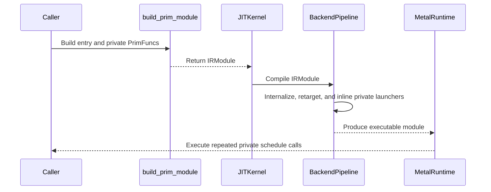

# [PR #3212] [Language] Add programmatic PrimFunc construction and composable multi-kernel programs

source: https://github.com/tile-ai/tilelang/pull/3212
state: open | updated: 2026-09-12T21:43:48Z
labels: 

## 正文

## Problem

Compiler frontends sometimes determine a `PrimFunc` ABI programmatically. The decorator frontend requires a statically declared Python signature, leaving string-based Python source generation as the only practical way to construct such functions dynamically.

Once a frontend can build functions, it also needs to compose them. A model program reuses the same schedule (an attention layer, a normalization, a GEMM) at many call sites. Emitting a fresh copy of the schedule at every site multiplies lowering work and kernel count for no benefit, and hand-inlining the schedules into one PrimFunc gives up the one-definition structure the frontend already has.

## Change

### Programmatic PrimFunc construction

- Add `T.build_prim_func(name, parameters, body)` as the programmatic counterpart of `@T.prim_func`.
- Reuse the existing eager `Builder`, argument binding, and attribute finalization paths.
- Allow ordinary Python composition of statically authored `T.macro` fragments while keeping device control flow in TileLang IR.
- Validate function names, parameter names, duplicate parameters, nesting, callability, and body return values.

### Composable multi-kernel programs

- Add `T.build_prim_module(name, parameters, body, private)` with `T.PrimFuncDefinition` and `T.PrimFuncRef`. The public entry's body receives a mapping of private schedule references and may call each any number of times; each private definition is built once.
- Private schedules are ordinary host functions containing target-neutral `T.Kernel` regions, marked `tl.is_host_launcher`. Lowering binds them to the full target before the host/device split so their kernels are extracted like the entry's, internalizes their ABI to buffer data pointers, retargets the remaining wrapper to the host target, and inlines it once device launches are lowered. Every backend therefore receives one ordinary host entry with several kernel launches and a single definition per extracted kernel.
- Accept a single-entry `IRModule` wherever a `PrimFunc` was accepted: `tilelang.compile`, `JITKernel`, the kernel cache, and lowering. One `retrieve_entry_func` helper in `tilelang.utils.language` picks the exposed `PrimFunc` for all of them.

## Tests

- `testing/python/language/test_tilelang_language_build_prim_func.py`: dynamic ABI construction, macro composition, duplicate-parameter rejection, and one private schedule reused at two call sites with a single definition in the module.
- `testing/python/metal/test_metal_prim_module.py`: compiles a two-call program on the torch Metal backend and checks both launches ran in order.
- `ruff check` and `ruff format --check` pass on the touched files.

## Related

This is a general eager-language construction API. It does not introduce a model-level program abstraction or backend-specific code generation.

<!-- This is an auto-generated comment: release notes by coderabbit.ai -->

## Summary

- Added `T.build_prim_func` for programmatic `PrimFunc` construction with validation, eager argument binding, and attribute finalization.
- Added `T.build_prim_module`, `PrimFuncDefinition`, and `PrimFuncRef` for reusable private schedules and multi-kernel host entries.
- Added private host-launcher lowering passes across CPU, CUDA, Metal, ROCm, and WebGPU pipelines.
- Added `retrieve_entry_func` and extended caching, JIT, lowering, and compilation APIs to accept single-entry `IRModule` values.
- Added tests for dynamic construction, macro composition, validation, private schedule reuse, and Metal multi-kernel execution.

## Testing

- Added unit coverage for `build_prim_func` and `build_prim_module`.
- Added Metal execution coverage for repeated private schedule launches.

<!-- end of auto-generated comment: release notes by coderabbit.ai -->

## 评论 (2)

### github-actions[bot] · 2026-09-12

👋 Hi! Thank you for contributing to the **TileLang** project.

Please remember to run `pre-commit run --all-files` in the root directory of the project to ensure your changes are properly linted and formatted. This will help ensure your contribution passes the format check.

We appreciate you taking this step! Our team will review your contribution, and we look forward to your awesome work! 🚀

### coderabbitai[bot] · 2026-09-12

<!-- This is an auto-generated comment: summarize by coderabbit.ai -->
<!-- review_stack_entry_start -->

<!-- review_stack_entry_end -->
<!-- recent_review_start -->

No actionable comments were generated in the recent review. 🎉

ℹ️ Recent review info

⚙️ Run configuration

**Configuration used**: Path: .coderabbit.yaml

**Review profile**: CHILL

**Plan**: Advanced

**Run ID**: `c6f95d46-3356-471c-9dda-9c0deb930939`

📥 Commits

Reviewing files that changed from the base of the PR and between e554608f623e5e78fbe41a782c51219f15c85983 and b0ffc8ee2b588ddddeff9749e83d730e895bd4b1.

📒 Files selected for processing (16)

* `testing/python/language/test_tilelang_language_build_prim_func.py`
* `testing/python/metal/test_metal_prim_module.py`
* `tilelang/backend/pass_pipeline/pipeline_utils.py`
* `tilelang/cache/__init__.py`
* `tilelang/cache/kernel_cache.py`
* `tilelang/cpu/pipeline.py`
* `tilelang/cuda/pipeline.py`
* `tilelang/engine/lower.py`
* `tilelang/jit/__init__.py`
* `tilelang/jit/kernel.py`
* `tilelang/language/eager/__init__.py`
* `tilelang/language/eager/builder.py`
* `tilelang/metal/pipeline.py`
* `tilelang/rocm/pipeline.py`
* `tilelang/utils/language.py`
* `tilelang/webgpu/pipeline.py`

**Included review availability:** Your plan provides up to 8 included reviews per hour; 7 remain after this review.

---

<!-- recent_review_end -->
<!-- walkthrough_start -->

📝 Walkthrough

## Walkthrough

The PR adds dynamic PrimFunc and IRModule builders, supports private host launchers, and integrates IRModule entry resolution with JIT, caching, lowering, and five backend pipelines. Tests cover construction, repeated private calls, and Metal execution.

### Changes

**PrimFunc Module Construction and Compilation**

|Layer / File(s)|Summary|
|---|---|
|**PrimFunc and module builder API**   `tilelang/language/eager/builder.py`, `tilelang/language/eager/__init__.py`, `testing/python/language/test_tilelang_language_build_prim_func.py`|Adds `build_prim_func`, `PrimFuncDefinition`, `PrimFuncRef`, and `build_prim_module`. The tests cover dynamic parameters, validation, macro composition, and repeated private schedule calls.|
|**IRModule entry resolution and compilation**   `tilelang/utils/language.py`, `tilelang/jit/...`, `tilelang/cache/...`, `tilelang/engine/lower.py`|Adds externally exposed entry-function resolution and accepts IRModules in compilation, kernel caching, JIT adapters, and lowering.|
|**Private host-launcher lowering**   `tilelang/backend/pass_pipeline/pipeline_utils.py`, `tilelang/{cpu,cuda,metal,rocm,webgpu}/pipeline.py`|Adds ABI internalization, host-target retargeting, and post-lowering inlining for private host launchers across backend pipelines.|
|**Backend execution validation**   `testing/python/metal/test_metal_prim_module.py`|Compiles and runs a module with two private schedule call sites on Metal, then validates the output tensor.|

<!-- change_assessment_start -->
**Priority:** ➖ Normal

**Estimated code review effort:** 4 (Complex) | ~60 minutes

<!-- change_assessment_commit:"b0ffc8ee2b588ddddeff9749e83d730e895bd4b1" -->
**Change:** Feature
<!-- change_assessment_end -->

**Suggested reviewers:** `leiwang1999`, `siriusneo`

### Sequence Diagram(s)

<!-- walkthrough_end -->
<!-- final_review_risk_start -->
**Merge Risk:** _⚪ Minimal_ · up to `b0ffc`
<!-- final_review_risk_coverage:{"sourceCommitId":"b0ffc8ee2b588ddddeff9749e83d730e895bd4b1","coveredCommitId":"b0ffc8ee2b588ddddeff9749e83d730e895bd4b1","kind":"reviewed"} -->

Private schedules remain compatible with the CPU lowering path, and no actionable issues remain.
<!-- final_review_risk_end -->
<!-- pre_merge_checks_walkthrough_start -->

🚥 Pre-merge checks | ✅ 4 | ❌ 1

### ❌ Failed checks (1 warning)

|     Check name     | Status     | Explanation                                                                                                                                                                                  | Resolution                                                                         |
| :----------------: | :--------- | :------------------------------------------------------------------------------------------------------------------------------------------------------------------------------------------- | :--------------------------------------------------------------------------------- |
| Docstring Coverage | ⚠️ Warning | Docstring coverage is 51.22% which is insufficient. The required threshold is 80.00%. Docstring coverage is scoped to functions touched by this diff. Analyzed 41 functions across 16 files. | Write docstrings for the functions missing them to satisfy the coverage threshold. |

✅ Passed checks (4 passed)

|         Check name         | Status   | Explanation                                                                                                                          |
| :------------------------: | :------- | :----------------------------------------------------------------------------------------------------------------------------------- |
|     Linked Issues check    | ✅ Passed | Check skipped because no linked issues were found for this pull request.                                                             |
| Out of Scope Changes check | ✅ Passed | Check skipped because no linked issues were found for this pull request.                                                             |
|      Description Check     | ✅ Passed | Check skipped - CodeRabbit’s high-level summary is enabled.                                                                          |
|         Title check        | ✅ Passed | The title clearly and concisely describes the main changes: programmatic PrimFunc construction and composable multi-kernel programs. |

<!-- pre_merge_checks_walkthrough_end -->

- [ ] <!-- {"checkboxId":"585bb3f6-faf5-4dbf-96d2-74e382adf19a"} --> Fix all pre-merge checks with AI
<!-- finishing_touch_checkbox_start -->

✨ Finishing Touches 💡 2

<!-- finishing_touch_suggestion:resolve_merge_conflict -->

⚔️ Resolve merge conflicts 💡

- [ ] <!-- {"checkboxId":"c3a5b2e1-4d7f-4a8c-b9d6-e1f2c3d4a5b6"} --> Resolve merge conflict in branch `pr/build-prim-func`

<!-- finishing_touch_suggestion:fix_ci -->

🛠️ Fix failing CI checks 💡

- [ ] <!-- {"checkboxId": "6d21cfe8-ec3f-40e2-9222-b8318b64d3b0", "radioGroupId": "fix-ci-output-choice-group-unknown_comment_id"} -->   Create stacked PR
- [ ] <!-- {"checkboxId": "9f0d24fb-b419-4f01-baf0-8b26b6424f34", "radioGroupId": "fix-ci-output-choice-group-unknown_comment_id"} -->   Commit on current branch

🧪 Generate unit tests (beta)

- [ ] <!-- {"checkboxId": "f47ac10b-58cc-4372-a567-0e02b2c3d479", "radioGroupId": "utg-output-choice-group-unknown_comment_id"} -->   Create PR with unit tests

<!-- finishing_touch_checkbox_end -->
<!-- tips_start -->

---

Thanks for using [CodeRabbit](https://coderabbit.ai?utm_source=oss&utm_medium=github&utm_campaign=tile-ai/tilelang&utm_content=3212)! It's free for OSS, and your support helps us grow. If you like it, consider giving us a shout-out.

❤️ Share

- [X](https://twitter.com/intent/tweet?text=I%20just%20used%20%40coderabbitai%20for%20my%20code%20review%2C%20and%20it%27s%20fantastic%21%20It%27s%20free%20for%20OSS%20and%20offers%20a%20free%20trial%20for%20the%20proprietary%20code.%20Check%20it%20out%3A&url=https%3A//coderabbit.ai)
- [Mastodon](https://mastodon.social/share?text=I%20just%20used%20%40coderabbitai%20for%20my%20code%20review%2C%20and%20it%27s%20fantastic%21%20It%27s%20free%20for%20OSS%20and%20offers%20a%20free%20trial%20for%20the%20proprietary%20code.%20Check%20it%20out%3A%20https%3A%2F%2Fcoderabbit.ai)
- [Reddit](https://www.reddit.com/submit?title=Great%20tool%20for%20code%20review%20-%20CodeRabbit&text=I%20just%20used%20CodeRabbit%20for%20my%20code%20review%2C%20and%20it%27s%20fantastic%21%20It%27s%20free%20for%20OSS%20and%20offers%20a%20free%20trial%20for%20proprietary%20code.%20Check%20it%20out%3A%20https%3A//coderabbit.ai)
- [LinkedIn](https://www.linkedin.com/sharing/share-offsite/?url=https%3A%2F%2Fcoderabbit.ai&mini=true&title=Great%20tool%20for%20code%20review%20-%20CodeRabbit&summary=I%20just%20used%20CodeRabbit%20for%20my%20code%20review%2C%20and%20it%27s%20fantastic%21%20It%27s%20free%20for%20OSS%20and%20offers%20a%20free%20trial%20for%20proprietary%20code)

Comment `@coderabbitai help` to get the list of available commands.

<!-- tips_end -->
