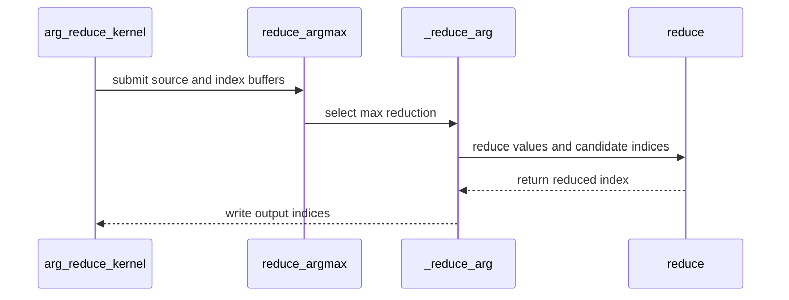

# [PR #3217] [Language] Add tile-level argmax and argmin reductions

source: https://github.com/tile-ai/tilelang/pull/3217
state: open | updated: 2026-09-12T08:56:00Z
labels: 

## 正文

Tile-level reductions currently expose values but not their indices. This adds `T.reduce_argmax(src, indices, dim=-1)` and `T.reduce_argmin` so kernels can consume indices directly from fragment or shared tiles, including a GEMM accumulator. Related to #1126.

Both operations support squeezed or retained reduction dimensions and int32/int64 outputs. Ties select the first logical index, including signed zeros; any NaN selects the first NaN index. Integer ordering retains its original precision. Non-power-of-two reduction extents are padded internally and padded indices are excluded.

The implementation composes the existing value reduction and a minimum-index reduction inside one kernel, reusing the current layout and synchronization machinery. It requires a positive compile-time reduction extent and fragment/shared buffers. It uses two reduction passes and makes no performance claim.

Validation on RTX 3090 (SM86), CUDA toolkit 13.0, PyTorch 2.8.0+cu128:

- 139 new tests plus 43 existing reduction regression cases: 182 passed.
- Compute Sanitizer memcheck, racecheck, and synccheck: 24 targeted cases each, zero errors or race warnings.
- Four CUDA Graph replays with changing NaN positions and full-range uint64 ordering checks passed.
- Repository formatter/pre-commit checks passed.

Tests cover axes, shapes, scopes, input/index dtypes, ties, NaNs, infinities, padding identities, integer precision, invalid arguments, and a fused Tensor Core GEMM accumulator. Documentation includes the API contract and a row-argmax example. Other GPU architectures and CPU/ROCm backends were not validated.

<!-- This is an auto-generated comment: release notes by coderabbit.ai -->

## Summary

- Added tile-level `T.reduce_argmax` and `T.reduce_argmin` for fragment and shared tiles, including GEMM accumulators.
- Added support for squeezed or retained dimensions, `int32` and `int64` indices, first-index tie-breaking, NaN handling, integer precision preservation, and non-power-of-two reduction extents.
- Added validation for reduction dimensions, buffer scopes, dtypes, output shapes, and positive compile-time extents.
- Exported both operations through the public language API.
- Added API documentation and a row-argmax example.
- Added 139 new tests and 43 regression cases, plus sanitizer, CUDA Graph, formatter, and pre-commit validation.

Testing used an RTX 3090 with CUDA 13.0 and PyTorch 2.8.0+cu128. Other GPU architectures and CPU/ROCm backends were not validated.

<!-- end of auto-generated comment: release notes by coderabbit.ai -->

## 评论 (2)

### github-actions[bot] · 2026-09-12

👋 Hi! Thank you for contributing to the **TileLang** project.

Please remember to run `pre-commit run --all-files` in the root directory of the project to ensure your changes are properly linted and formatted. This will help ensure your contribution passes the format check.

We appreciate you taking this step! Our team will review your contribution, and we look forward to your awesome work! 🚀

### coderabbitai[bot] · 2026-09-12

<!-- This is an auto-generated comment: summarize by coderabbit.ai -->
<!-- review_stack_entry_start -->

<!-- review_stack_entry_end -->
<!-- recent_review_start -->

No actionable comments were generated in the recent review. 🎉

ℹ️ Recent review info

⚙️ Run configuration

**Configuration used**: Path: .coderabbit.yaml

**Review profile**: CHILL

**Plan**: Advanced

**Run ID**: `b3ceff04-3f86-459c-b328-cfddc388389c`

📥 Commits

Reviewing files that changed from the base of the PR and between 5e149e31674658f94779c7d0c6039549a1853123 and cc28049a763dfefcbce01acf0570a98241f16d6c.

📒 Files selected for processing (4)

* `docs/programming_guides/instructions.md`
* `testing/python/language/test_tilelang_language_arg_reduce.py`
* `tilelang/language/arg_reduce_op.py`
* `tilelang/language/common.py`

**Included review availability:** Your plan provides up to 8 included reviews per hour; 7 remain after this review.

---

<!-- recent_review_end -->
<!-- walkthrough_start -->

📝 Walkthrough

## Walkthrough

Adds `T.reduce_argmax` and `T.reduce_argmin` with validation, integrated exports, value-and-index lowering, NaN and tie handling, padding support, tests, and programming guide documentation.

### Changes

**Index reductions**

|Layer / File(s)|Summary|
|---|---|
|**Public API and contracts**   `tilelang/language/arg_reduce_op.py`, `tilelang/language/common.py`, `docs/programming_guides/instructions.md`|Adds the public reduction APIs, validates supported buffers and shapes, exports both operations, and documents their semantics.|
|**Value and index reduction lowering**   `tilelang/language/arg_reduce_op.py`|Pads reduction extents, performs value reductions, selects first ties, handles NaN indices, masks padding, and writes reduced indices.|
|**Behavior validation**   `testing/python/language/test_tilelang_language_arg_reduce.py`|Tests dimensions, dtypes, special values, tail extents, precision, invalid arguments, GEMM accumulators, and padding identities.|

<!-- change_assessment_start -->
**Priority:** ➖ Normal

**Estimated code review effort:** 3 (Moderate) | ~25 minutes

<!-- change_assessment_commit:"cc28049a763dfefcbce01acf0570a98241f16d6c" -->
**Change:** Feature
<!-- change_assessment_end -->

**Suggested reviewers:** `leiwang1999`

### Sequence Diagram(s)

<!-- walkthrough_end -->
<!-- final_review_risk_start -->
**Merge Risk:** _⚪ Minimal_ · up to `cc280`
<!-- final_review_risk_coverage:{"sourceCommitId":"cc28049a763dfefcbce01acf0570a98241f16d6c","coveredCommitId":"cc28049a763dfefcbce01acf0570a98241f16d6c","kind":"reviewed"} -->

The new index-reduction API, lowering, tests, exports, and documentation are aligned in the supplied evidence. No unresolved merge-blocking risk remains.
<!-- final_review_risk_end -->
<!-- pre_merge_checks_walkthrough_start -->

🚥 Pre-merge checks | ✅ 4 | ❌ 1

### ❌ Failed checks (1 warning)

|     Check name     | Status     | Explanation                                                                                                                                                                                               | Resolution                                                                         |
| :----------------: | :--------- | :-------------------------------------------------------------------------------------------------------------------------------------------------------------------------------------------------------- | :--------------------------------------------------------------------------------- |
| Docstring Coverage | ⚠️ Warning | Docstring coverage is 11.76% which is insufficient. The required threshold is 80.00%. Docstring coverage is scoped to functions touched by this diff. Analyzed 17 functions across 3 files. (1 skipped: … | Write docstrings for the functions missing them to satisfy the coverage threshold. |

✅ Passed checks (4 passed)

|         Check name         | Status   | Explanation                                                                                                |
| :------------------------: | :------- | :--------------------------------------------------------------------------------------------------------- |
|      Description Check     | ✅ Passed | Check skipped - CodeRabbit’s high-level summary is enabled.                                                |
|         Title check        | ✅ Passed | The title clearly and concisely describes the main change: adding tile-level argmax and argmin reductions. |
|     Linked Issues check    | ✅ Passed | Check skipped because no linked issues were found for this pull request.                                   |
| Out of Scope Changes check | ✅ Passed | Check skipped because no linked issues were found for this pull request.                                   |

Full details: Docstring Coverage

**Explanation**

Docstring coverage is 11.76% which is insufficient. The required threshold is 80.00%. Docstring coverage is scoped to functions touched by this diff. Analyzed 17 functions across 3 files. (1 skipped: 1 unsupported.)

<!-- pre_merge_checks_walkthrough_end -->

- [ ] <!-- {"checkboxId":"585bb3f6-faf5-4dbf-96d2-74e382adf19a"} --> Fix all pre-merge checks with AI
<!-- finishing_touch_checkbox_start -->

✨ Finishing Touches

🧪 Generate unit tests (beta)

- [ ] <!-- {"checkboxId": "f47ac10b-58cc-4372-a567-0e02b2c3d479", "radioGroupId": "utg-output-choice-group-unknown_comment_id"} -->   Create PR with unit tests

<!-- finishing_touch_checkbox_end -->
<!-- tips_start -->

---

Thanks for using [CodeRabbit](https://coderabbit.ai?utm_source=oss&utm_medium=github&utm_campaign=tile-ai/tilelang&utm_content=3217)! It's free for OSS, and your support helps us grow. If you like it, consider giving us a shout-out.

❤️ Share

- [X](https://twitter.com/intent/tweet?text=I%20just%20used%20%40coderabbitai%20for%20my%20code%20review%2C%20and%20it%27s%20fantastic%21%20It%27s%20free%20for%20OSS%20and%20offers%20a%20free%20trial%20for%20the%20proprietary%20code.%20Check%20it%20out%3A&url=https%3A//coderabbit.ai)
- [Mastodon](https://mastodon.social/share?text=I%20just%20used%20%40coderabbitai%20for%20my%20code%20review%2C%20and%20it%27s%20fantastic%21%20It%27s%20free%20for%20OSS%20and%20offers%20a%20free%20trial%20for%20the%20proprietary%20code.%20Check%20it%20out%3A%20https%3A%2F%2Fcoderabbit.ai)
- [Reddit](https://www.reddit.com/submit?title=Great%20tool%20for%20code%20review%20-%20CodeRabbit&text=I%20just%20used%20CodeRabbit%20for%20my%20code%20review%2C%20and%20it%27s%20fantastic%21%20It%27s%20free%20for%20OSS%20and%20offers%20a%20free%20trial%20for%20proprietary%20code.%20Check%20it%20out%3A%20https%3A//coderabbit.ai)
- [LinkedIn](https://www.linkedin.com/sharing/share-offsite/?url=https%3A%2F%2Fcoderabbit.ai&mini=true&title=Great%20tool%20for%20code%20review%20-%20CodeRabbit&summary=I%20just%20used%20CodeRabbit%20for%20my%20code%20review%2C%20and%20it%27s%20fantastic%21%20It%27s%20free%20for%20OSS%20and%20offers%20a%20free%20trial%20for%20proprietary%20code)

Comment `@coderabbitai help` to get the list of available commands.

<!-- tips_end -->
