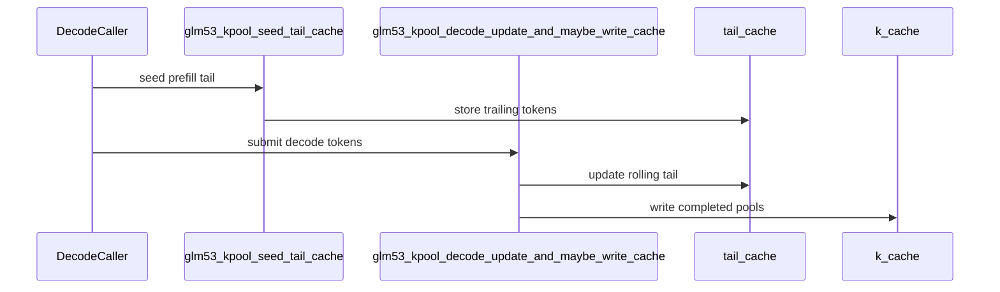

# [PR #3253] [ROCm] Add GLM-5.3 paged k-pool logits

source: https://github.com/tile-ai/tilelang/pull/3253
state: open | updated: 2026-09-19T08:02:00Z
labels: 

## 正文

## Summary

- add paged FP8 MQA logits over the GLM-5.3 compressed k-pool cache
- apply each cached pool scale, ReLU each query-head dot product, and reduce with caller-provided FP32 head weights
- support request-specific pool ranges and page-table row ownership
- select the platform FP8 E4M3 type for ROCm and CUDA
- reject invalid shapes, dtypes, ranges, page rows, and active cache blocks before launch
- add a PyTorch reference and focused ROCm correctness and safety tests

## Model contract

The published `zai-org/GLM-5.3-Flash` configuration uses `index_head_dim=128`, `index_n_heads=32`, `index_kpool=4`, and `index_topk=2048`. Query FP8 scales are expected to be folded into the per-head weights by the caller.

## Dependency

This is stacked on #3251 and includes #3250 and #3251 until those PRs land.

## Validation

Exact head: `dcdf15baad246124b817e55b7db2c222623e37f7`

- local `python3 -m py_compile` for the new example and test
- local changed-file `pre-commit`: all hooks passed
- local `git diff --check`
- exact-head CI [run `35428028647`](https://github.com/tile-ai/tilelang/actions/runs/35428028647): Quick Lint, ROCm, CUDA, Metal, and CuTeDSL all passed
- ROCm job [`105857409581`](https://github.com/tile-ai/tilelang/actions/runs/35428028647/job/105857409581): `2427 passed, 1852 skipped` on `amd-mi300x-gfx942-01`

## Scope

This increment intentionally excludes pool Top-K, pool-to-token expansion, preshuffled framework cache layouts, and vLLM or SGLang integration.

<!-- This is an auto-generated comment: release notes by coderabbit.ai -->
## Summary

- Adds GLM-5.3 k-pool compression, paged FP8 MQA logits, and decode-tail cache maintenance.
- Supports ROCm and CUDA FP8 formats with device-specific ROCm architecture detection.
- Adds validation for tensor metadata, cache locations, pool ranges, page-table rows, and active cache blocks.
- Adds PyTorch reference implementations, ROCm correctness and safety tests, and pipeline documentation.
- Adds bounds checks for k-pool page accesses.

## Validation

- Test execution results were not provided.
- Review severity counts were not provided.
<!-- end of auto-generated comment: release notes by coderabbit.ai -->

## 评论 (2)

### coderabbitai[bot] · 2026-09-19

<!-- This is an auto-generated comment: summarize by coderabbit.ai -->
<!-- review_stack_entry_start -->

<!-- review_stack_entry_end -->
<!-- recent_review_start -->

No actionable comments were generated in the recent review. 🎉

ℹ️ Recent review info

⚙️ Run configuration

**Configuration used**: Repository: tile-ai/tilelang/.coderabbit.yaml

**Review profile**: CHILL

**Plan**: Advanced

**Run ID**: `476dc182-dfee-4c67-b9d6-5f2ebf58697b`

📥 Commits

Reviewing files that changed from the base of the PR and between 78c10a3b10b574f878cd75eb28d5351dcbe83de8 and dcdf15baad246124b817e55b7db2c222623e37f7.

📒 Files selected for processing (1)

* `examples/kpool/example_glm53_kpool_decode_tail.py`

**Included review availability:** Your plan provides up to 8 included reviews per hour; 6 remain after this review.

---

<!-- recent_review_end -->
<!-- walkthrough_start -->

📝 Walkthrough

## Walkthrough

The change adds GLM-5.3 k-pool compression, rolling decode-tail cache maintenance, paged FP8 MQA logits, ROCm tests, documentation, and device-aware FP8 type selection.

### Changes

**GLM-5.3 k-pool pipeline**

|Layer / File(s)|Summary|
|---|---|
|**Device-aware FP8 selection**   `tilelang/language/fp8.py`, `testing/python/language/test_tilelang_language_fp8.py`|FP8 helpers accept a requested device and query that device's ROCm properties. Tests cover different device architectures.|
|**K-pool compression and cache writes**   `examples/kpool/example_glm53_kpool_compress.py`, `testing/python/amd/test_tilelang_hip_glm53_kpool_compress.py`, `examples/kpool/README.md`|The compressor performs softmax pooling, BF16 conversion, Hadamard-128 rotation, absmax scaling, FP8 quantization, and masked paged-cache writes. Validation, references, tests, and cache-contract documentation are added.|
|**Rolling decode-tail maintenance**   `examples/kpool/example_glm53_kpool_decode_tail.py`, `testing/python/amd/test_tilelang_hip_glm53_kpool_decode_tail.py`|Prefill seeds rolling tails. Decode processes tokens in order and writes completed pools to FP8 caches. References and tests cover cache updates, pool closures, and invalid metadata.|
|**Paged MQA logits**   `examples/kpool/example_glm53_kpool_fp8_mqa_logits.py`, `testing/python/amd/test_tilelang_hip_glm53_kpool_fp8_mqa_logits.py`|The logits kernel reads paged FP8 keys and scales, computes weighted 32-head scores, and emits FP32 logits with `-inf` for invalid or padded pools. References and metadata tests are added.|

<!-- change_assessment_start -->
**Priority:** ➖ Normal

**Estimated code review effort:** 4 (Complex) | ~60 minutes

<!-- change_assessment_commit:"dcdf15baad246124b817e55b7db2c222623e37f7" -->
**Change:** Feature
<!-- change_assessment_end -->

### Sequence Diagram(s)

<!-- walkthrough_end -->
<!-- pre_merge_checks_walkthrough_start -->

🚥 Pre-merge checks | ✅ 4 | ❌ 1

### ❌ Failed checks (1 warning)

|     Check name     | Status     | Explanation                                                                                                                                                                                 | Resolution                                                                         |
| :----------------: | :--------- | :------------------------------------------------------------------------------------------------------------------------------------------------------------------------------------------ | :--------------------------------------------------------------------------------- |
| Docstring Coverage | ⚠️ Warning | Docstring coverage is 67.35% which is insufficient. The required threshold is 80.00%. Docstring coverage is scoped to functions touched by this diff. Analyzed 49 functions across 8 files. | Write docstrings for the functions missing them to satisfy the coverage threshold. |

✅ Passed checks (4 passed)

|         Check name         | Status   | Explanation                                                                                                                                                  |
| :------------------------: | :------- | :----------------------------------------------------------------------------------------------------------------------------------------------------------- |
|     Linked Issues check    | ✅ Passed | Check skipped because no linked issues were found for this pull request.                                                                                     |
| Out of Scope Changes check | ✅ Passed | Check skipped because no linked issues were found for this pull request.                                                                                     |
|      Description Check     | ✅ Passed | Check skipped - CodeRabbit’s high-level summary is enabled.                                                                                                  |
|         Title check        | ✅ Passed | The title clearly identifies the main feature: ROCm support for GLM-5.3 paged k-pool logits. It is concise and directly related to the pull request changes. |

<!-- pre_merge_checks_walkthrough_end -->

- [ ] <!-- {"checkboxId":"585bb3f6-faf5-4dbf-96d2-74e382adf19a"} --> Fix all pre-merge checks with AI
<!-- finishing_touch_checkbox_start -->

✨ Finishing Touches

🧪 Generate unit tests (beta)

- [ ] <!-- {"checkboxId": "f47ac10b-58cc-4372-a567-0e02b2c3d479", "radioGroupId": "utg-output-choice-group-unknown_comment_id"} --> Create a new PR

<!-- finishing_touch_checkbox_end -->
<!-- tips_start -->

---

Thanks for using [CodeRabbit](https://coderabbit.ai?utm_source=oss&utm_medium=github&utm_campaign=tile-ai/tilelang&utm_content=3253)! It's free for OSS, and your support helps us grow. If you like it, consider giving us a shout-out.

❤️ Share

- [X](https://twitter.com/intent/tweet?text=I%20just%20used%20%40coderabbitai%20for%20my%20code%20review%2C%20and%20it%27s%20fantastic%21%20It%27s%20free%20for%20OSS%20and%20offers%20a%20free%20trial%20for%20the%20proprietary%20code.%20Check%20it%20out%3A&url=https%3A//coderabbit.ai)
- [Mastodon](https://mastodon.social/share?text=I%20just%20used%20%40coderabbitai%20for%20my%20code%20review%2C%20and%20it%27s%20fantastic%21%20It%27s%20free%20for%20OSS%20and%20offers%20a%20free%20trial%20for%20the%20proprietary%20code.%20Check%20it%20out%3A%20https%3A%2F%2Fcoderabbit.ai)
- [Reddit](https://www.reddit.com/submit?title=Great%20tool%20for%20code%20review%20-%20CodeRabbit&text=I%20just%20used%20CodeRabbit%20for%20my%20code%20review%2C%20and%20it%27s%20fantastic%21%20It%27s%20free%20for%20OSS%20and%20offers%20a%20free%20trial%20for%20proprietary%20code.%20Check%20it%20out%3A%20https%3A//coderabbit.ai)
- [LinkedIn](https://www.linkedin.com/sharing/share-offsite/?url=https%3A%2F%2Fcoderabbit.ai&mini=true&title=Great%20tool%20for%20code%20review%20-%20CodeRabbit&summary=I%20just%20used%20CodeRabbit%20for%20my%20code%20review%2C%20and%20it%27s%20fantastic%21%20It%27s%20free%20for%20OSS%20and%20offers%20a%20free%20trial%20for%20proprietary%20code)

Comment `@coderabbitai help` to get the list of available commands.

<!-- tips_end -->

### github-actions[bot] · 2026-09-19

👋 Hi! Thank you for contributing to the **TileLang** project.

Please remember to run `pre-commit run --all-files` in the root directory of the project to ensure your changes are properly linted and formatted. This will help ensure your contribution passes the format check.

We appreciate you taking this step! Our team will review your contribution, and we look forward to your awesome work! 🚀
