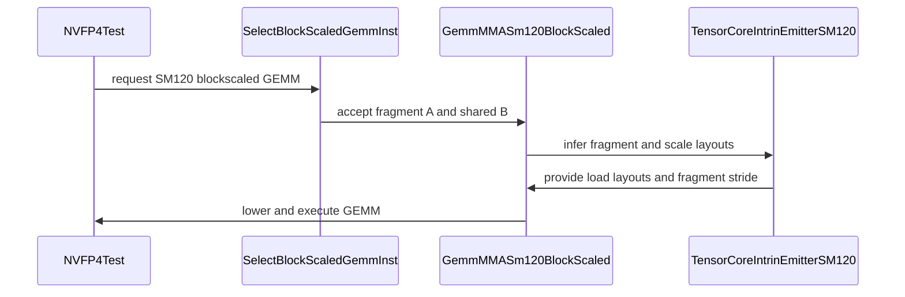

# [PR #3257] [CUDA] Support SM120 block-scaled GEMM fragments and odd warp atom grids

source: https://github.com/tile-ai/tilelang/pull/3257
state: open | updated: 2026-09-21T02:02:52Z
labels: 

## 正文

Fixes https://github.com/tile-ai/tilelang/issues/3256.
Support fragment A and row-major scale fragments in SM120 block-scaled GEMM, and fix compact scales for odd per-warp atom grids.

<!-- This is an auto-generated comment: release notes by coderabbit.ai -->
## Summary

- Added SM120 block-scaled GEMM support for fragment-resident A operands and scale buffers.
- Preserved shared-memory B operands and register-only execution.
- Added support for odd per-warp MMA atom grids, including the `8x1` partition.
- Added regression coverage for fragment A/scales, row-major scales, compact layouts, transposed A, and multiple warp policies.

## C++ style / lint notes

- The PR changes C++ code.
- It does not change `docs/developer_guide/cpp_style.md`.
- CI includes the **C++ API Style Audit (warning only)** step.
- No audit findings were supplied. Warning-only findings are separate from correctness, build, and test issues.

## Testing

- Test execution results were not supplied.
<!-- end of auto-generated comment: release notes by coderabbit.ai -->

## 评论 (2)

### github-actions[bot] · 2026-09-20

👋 Hi! Thank you for contributing to the **TileLang** project.

Please remember to run `pre-commit run --all-files` in the root directory of the project to ensure your changes are properly linted and formatted. This will help ensure your contribution passes the format check.

We appreciate you taking this step! Our team will review your contribution, and we look forward to your awesome work! 🚀

### coderabbitai[bot] · 2026-09-20

<!-- This is an auto-generated comment: summarize by coderabbit.ai -->
<!-- review_stack_entry_start -->

<!-- review_stack_entry_end -->
<!-- recent_review_start -->

No actionable comments were generated in the recent review. 🎉

ℹ️ Recent review info

⚙️ Run configuration

**Configuration used**: Repository: tile-ai/tilelang/.coderabbit.yaml

**Review profile**: CHILL

**Plan**: Advanced

**Run ID**: `6c682149-332b-4e8f-882d-97ecde06f300`

📥 Commits

Reviewing files that changed from the base of the PR and between 7d73309bbc161ba023afd24b368b7567348b9679 and 8d984b97995acc1af456da8f458b4861320d879a.

📒 Files selected for processing (1)

* `testing/python/language/test_tilelang_language_nvf4_mma_block_scale.py`

**Included review availability:** Your plan provides up to 8 included reviews per hour; 6 remain after this review.

---

<!-- recent_review_end -->
<!-- walkthrough_start -->

📝 Walkthrough

## Walkthrough

### Changes

**SM120 block-scaled GEMM support**

|Layer / File(s)|Summary|
|---|---|
|**Operand contract and fragment-A lowering**   `src/cuda/op/gemm_blockscaled.cc`, `tilelang/cuda/op/gemm/gemm_mma_sm120.py`, `testing/python/language/test_tilelang_language_gemm_blockscaled.py`|SM120 selection and lowering now accept fragment A with shared B. Fragment A requires a full region and row-major scales.|
|**Fragment layouts and odd warp grids**   `tilelang/cuda/intrinsics/macro/mma_sm120_macro_generator.py`|The emitter adds fragment and scale load layouts, fragment-A addressing, and selector offset handling for odd warp atom grids.|
|**NVFP4 CUDA coverage**   `testing/python/language/test_tilelang_language_nvf4_mma_block_scale.py`|Tests cover fragment operands and scales, transposed A, warp policies, odd grids, compact layouts, and invalid compact fragment configurations.|

<!-- change_assessment_start -->
**Priority:** ➖ Normal

**Estimated code review effort:** 4 (Complex) | ~45 minutes

<!-- change_assessment_commit:"8d984b97995acc1af456da8f458b4861320d879a" -->
**Change:** Feature
<!-- change_assessment_end -->

### Sequence Diagram(s)

<!-- walkthrough_end -->
<!-- pre_merge_checks_walkthrough_start -->

🚥 Pre-merge checks | ✅ 4 | ❌ 1

### ❌ Failed checks (1 warning)

|     Check name     | Status     | Explanation                                                                                                                                                                                 | Resolution                                                                         |
| :----------------: | :--------- | :------------------------------------------------------------------------------------------------------------------------------------------------------------------------------------------ | :--------------------------------------------------------------------------------- |
| Docstring Coverage | ⚠️ Warning | Docstring coverage is 11.76% which is insufficient. The required threshold is 80.00%. Docstring coverage is scoped to functions touched by this diff. Analyzed 34 functions across 6 files. | Write docstrings for the functions missing them to satisfy the coverage threshold. |

✅ Passed checks (4 passed)

|         Check name         | Status   | Explanation                                                                                                                                                                                               |
| :------------------------: | :------- | :-------------------------------------------------------------------------------------------------------------------------------------------------------------------------------------------------------- |
|      Description Check     | ✅ Passed | Check skipped - CodeRabbit’s high-level summary is enabled.                                                                                                                                               |
|         Title check        | ✅ Passed | The title clearly and concisely summarizes the main changes: SM120 block-scaled GEMM fragment support and odd warp atom grid support.                                                                     |
|     Linked Issues check    | ✅ Passed | The changes meet the coding requirements in `#3256`. SM120 instruction selection accepts fragment A with shared B and fragment C. `GemmMMASm120BlockScaled` supports fragment A and row-major fragment sca… |
| Out of Scope Changes check | ✅ Passed | The changed files directly implement `#3256`. Operand validation, scale layouts, SM120 instruction selection, lowering, and emitter changes support register-resident A and scales, row-major scales, and … |

<!-- pre_merge_checks_walkthrough_end -->

- [ ] <!-- {"checkboxId":"585bb3f6-faf5-4dbf-96d2-74e382adf19a"} --> Fix all pre-merge checks with AI
<!-- finishing_touch_checkbox_start -->

✨ Finishing Touches

🧪 Generate unit tests (beta)

- [ ] <!-- {"checkboxId": "f47ac10b-58cc-4372-a567-0e02b2c3d479", "radioGroupId": "utg-output-choice-group-unknown_comment_id"} --> Create a new PR

<!-- finishing_touch_checkbox_end -->
<!-- tips_start -->

---

Thanks for using [CodeRabbit](https://coderabbit.ai?utm_source=oss&utm_medium=github&utm_campaign=tile-ai/tilelang&utm_content=3257)! It's free for OSS, and your support helps us grow. If you like it, consider giving us a shout-out.

❤️ Share

- [X](https://twitter.com/intent/tweet?text=I%20just%20used%20%40coderabbitai%20for%20my%20code%20review%2C%20and%20it%27s%20fantastic%21%20It%27s%20free%20for%20OSS%20and%20offers%20a%20free%20trial%20for%20the%20proprietary%20code.%20Check%20it%20out%3A&url=https%3A//coderabbit.ai)
- [Mastodon](https://mastodon.social/share?text=I%20just%20used%20%40coderabbitai%20for%20my%20code%20review%2C%20and%20it%27s%20fantastic%21%20It%27s%20free%20for%20OSS%20and%20offers%20a%20free%20trial%20for%20the%20proprietary%20code.%20Check%20it%20out%3A%20https%3A%2F%2Fcoderabbit.ai)
- [Reddit](https://www.reddit.com/submit?title=Great%20tool%20for%20code%20review%20-%20CodeRabbit&text=I%20just%20used%20CodeRabbit%20for%20my%20code%20review%2C%20and%20it%27s%20fantastic%21%20It%27s%20free%20for%20OSS%20and%20offers%20a%20free%20trial%20for%20proprietary%20code.%20Check%20it%20out%3A%20https%3A//coderabbit.ai)
- [LinkedIn](https://www.linkedin.com/sharing/share-offsite/?url=https%3A%2F%2Fcoderabbit.ai&mini=true&title=Great%20tool%20for%20code%20review%20-%20CodeRabbit&summary=I%20just%20used%20CodeRabbit%20for%20my%20code%20review%2C%20and%20it%27s%20fantastic%21%20It%27s%20free%20for%20OSS%20and%20offers%20a%20free%20trial%20for%20proprietary%20code)

Comment `@coderabbitai help` to get the list of available commands.

<!-- tips_end -->
