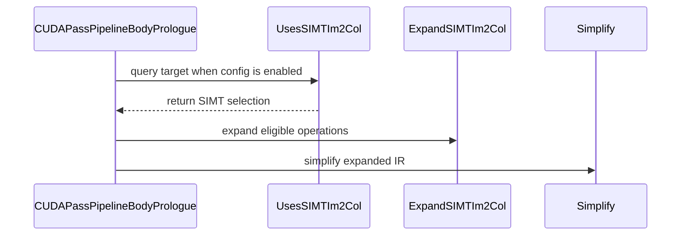

# [PR #3275] [CUDA][Transform] Expose SIMT im2col loads before scheduling

source: https://github.com/tile-ai/tilelang/pull/3275
state: open | updated: 2026-09-24T04:56:56Z
labels: 

## 正文

Fixes https://github.com/tile-ai/tilelang/issues/3274.

SIMT im2col becomes visible too late for scheduling.
https://github.com/tile-ai/tilelang/pull/3275/commits/a6bbc5c144ea16e8a3c154c5602f9cf5f0a1e723 is **only a minimal PoC for now.**

## Change

Add opt-in ExpandSIMTIm2Col, enabled by `tl.enable_early_simt_im2col=True`:

- Expose guarded parallel loads before WS, pipeline planning, and layout inference.
- Select by the actual SIMT implementation.
- Retain tail zero-filling, destination offsets, annotated operations, and manual WS schedules.

## Performance

RTX 5090, NVCC 13.2.78, sm_120a. Same convolution kernel and WS setting; two seeds × nine randomized rounds. Median GPU µs; speedup is the ratio of medians.

| Case | WS | Off | On | Speedup |
| --- | --- | ---: | ---: | ---: |
| aligned | off | 14.880 | 10.614 | 1.40× |
| aligned | on | 15.505 | 9.619 | 1.61× |
| stride_tail | off | 23.081 | 8.702 | 2.65× |
| stride_tail | on | 10.583 | 6.256 | 1.69× |
| large | off | 159.410 | 106.176 | 1.50× |
| large | on | 210.306 | 106.255 | 1.98× |

Approximately matches explicit loops. WS uses conditional 16-byte async input copies; ptxas registers drop from 240 to 78. Large without WS increases register usage and lowering time, so the pass remains opt-in.

<!-- This is an auto-generated comment: release notes by coderabbit.ai -->

## Summary

Adds the opt-in `tl.enable_early_simt_im2col` pass. When enabled for a CUDA target that selects the SIMT im2col implementation, the pass expands eligible `Im2ColOp` calls into guarded parallel loops before warp specialization and pipeline planning.

The rewrite preserves bounds checks and zero-fills invalid elements. It skips annotated operations, manual warp-specialization schedules, and unsupported shapes or buffer regions. Specialized implementations remain unchanged.

The change adds `Im2ColUsesSIMT` to query the selected implementation and tests for pass selection, idempotence, unsupported cases, output correctness, and convolution behavior. Test execution results were not provided.

## C++ style / lint notes

The PR changes C++ source and a public header. The documented C++ style guide applies to these files. It recommends `Is`/`Has`/`Can` prefixes for Boolean functions; the new `Im2ColUsesSIMT` name does not follow that convention. This is an advisory style observation, not a correctness or build failure.

CI includes the **C++ API Style Audit (warning only)** step. No audit findings for this PR were supplied. No build or test results were supplied.

<!-- end of auto-generated comment: release notes by coderabbit.ai -->

## 评论 (2)

### github-actions[bot] · 2026-09-24

👋 Hi! Thank you for contributing to the **TileLang** project.

Please remember to run `pre-commit run --all-files` in the root directory of the project to ensure your changes are properly linted and formatted. This will help ensure your contribution passes the format check.

We appreciate you taking this step! Our team will review your contribution, and we look forward to your awesome work! 🚀

### coderabbitai[bot] · 2026-09-24

<!-- This is an auto-generated comment: summarize by coderabbit.ai -->
<!-- review_stack_entry_start -->

Navigate logical layers of code changes, visualize relationships, and explore their blast radius.

<!-- review_stack_entry_end -->
<!-- recent_review_start -->

No actionable comments were generated in the recent review. 🎉

ℹ️ Recent review info

⚙️ Run configuration

**Configuration used**: Repository: tile-ai/tilelang/.coderabbit.yaml

**Review profile**: CHILL

**Plan**: Advanced

**Run ID**: `6e0b6e7c-a2d4-4674-9d25-cd723703ee95`

📥 Commits

Reviewing files that changed from the base of the PR and between e4e14156d7404ade3d2b7c0b41a112c8fe1a0a83 and a6bbc5c144ea16e8a3c154c5602f9cf5f0a1e723.

📒 Files selected for processing (8)

* `src/cuda/transform/expand_simt_im2col.cc`
* `src/op/copy.cc`
* `src/op/copy.h`
* `testing/python/transform/test_tilelang_transform_expand_simt_im2col.py`
* `testing/python/transform/test_tilelang_transform_im2col_fallback.py`
* `tilelang/cuda/pipeline.py`
* `tilelang/cuda/transform/__init__.py`
* `tilelang/transform/pass_config.py`

**Included review availability:** Your plan provides up to 8 included reviews per hour; 7 remain after this review.

---

<!-- recent_review_end -->
<!-- walkthrough_start -->

📝 Walkthrough

## Walkthrough

The change adds an opt-in CUDA pass that expands eligible SIMT Im2Col operations into guarded parallel loops before scheduling and pipeline planning. It adds a target-selection query and tests for expansion, generated source, and execution.

### Changes

**CUDA SIMT Im2Col Expansion**

|Layer / File(s)|Summary|
|---|---|
|**SIMT selection and opt-in configuration**   `src/op/copy.h`, `src/op/copy.cc`, `tilelang/transform/pass_config.py`, `src/cuda/transform/expand_simt_im2col.cc`|Adds a query for whether the selected Im2Col implementation uses SIMT and adds the disabled-by-default `tl.enable_early_simt_im2col` configuration key.|
|**Eligible operation expansion**   `src/cuda/transform/expand_simt_im2col.cc`, `tilelang/cuda/transform/__init__.py`, `testing/python/transform/test_tilelang_transform_expand_simt_im2col.py`|Adds a pass that rewrites supported Im2Col calls as guarded parallel loops. The pass leaves unsupported calls and annotated blocks unchanged. Tests cover target selection, idempotence, and those preservation cases.|
|**Pipeline integration and execution checks**   `tilelang/cuda/pipeline.py`, `testing/python/transform/test_tilelang_transform_expand_simt_im2col.py`, `testing/python/transform/test_tilelang_transform_im2col_fallback.py`|The CUDA prologue conditionally runs the expansion and simplifies the IR. Tests compare generated source and execution results; the fallback test helper accepts a configurable pipeline stage count.|

<!-- change_assessment_start -->
**Priority:** ➖ Normal

**Estimated code review effort:** 3 (Moderate) | ~25 minutes

<!-- change_assessment_commit:"a6bbc5c144ea16e8a3c154c5602f9cf5f0a1e723" -->
**Change:** Bug fix
<!-- change_assessment_end -->

### Sequence Diagram(s)

**Suggested reviewers:** `leiwang1999`, `yongqi-zhuo`

<!-- walkthrough_end -->
<!-- final_review_risk_start -->
**Merge Risk:** _⚪ Minimal_ · up to `a6bbc`
<!-- final_review_risk_coverage:{"sourceCommitId":"a6bbc5c144ea16e8a3c154c5602f9cf5f0a1e723","coveredCommitId":"a6bbc5c144ea16e8a3c154c5602f9cf5f0a1e723","kind":"reviewed"} -->

This change adds an optional CUDA transform that exposes SIMT im2col loads earlier, so scheduling and pipeline planning can overlap them with computation. The transform is disabled by default and applies only to targets whose selected im2col implementation is SIMT. Specialized paths such as Hopper TMA and existing default builds are therefore unaffected. No blocking issues were found, and the change appears ready to merge.
<!-- final_review_risk_end -->
<!-- pre_merge_checks_walkthrough_start -->

🚥 Pre-merge checks | ✅ 4 | ❌ 1

### ❌ Failed checks (1 warning)

|     Check name     | Status     | Explanation                                                                                                                                                                                 | Resolution                                                                         |
| :----------------: | :--------- | :------------------------------------------------------------------------------------------------------------------------------------------------------------------------------------------ | :--------------------------------------------------------------------------------- |
| Docstring Coverage | ⚠️ Warning | Docstring coverage is 22.22% which is insufficient. The required threshold is 80.00%. Docstring coverage is scoped to functions touched by this diff. Analyzed 27 functions across 8 files. | Write docstrings for the functions missing them to satisfy the coverage threshold. |

✅ Passed checks (4 passed)

|         Check name         | Status   | Explanation                                                                                                                                                                                               |
| :------------------------: | :------- | :-------------------------------------------------------------------------------------------------------------------------------------------------------------------------------------------------------- |
|     Linked Issues check    | ✅ Passed | The PR meets the coding requirements in [`#3274`]. `CUDAPassPipelineBodyPrologue` runs `ExpandSIMTIm2Col` after simplification and before warp specialization, pipeline planning, and layout inference. `I… |
| Out of Scope Changes check | ✅ Passed | The changed files stay within [`#3274`]. They add the opt-in configuration, selected-implementation query, early expansion pass, pipeline integration, Python exports, and focused unit and CUDA execution… |
|      Description Check     | ✅ Passed | Check skipped - CodeRabbit’s high-level summary is enabled.                                                                                                                                               |
|         Title check        | ✅ Passed | The title clearly and concisely describes the main change: exposing SIMT im2col loads before CUDA scheduling.                                                                                             |

<!-- pre_merge_checks_walkthrough_end -->

- [ ] <!-- {"checkboxId":"585bb3f6-faf5-4dbf-96d2-74e382adf19a"} --> Fix all pre-merge checks with AI
<!-- finishing_touch_checkbox_start -->

✨ Finishing Touches

🧪 Generate unit tests (beta)

- [ ] <!-- {"checkboxId": "f47ac10b-58cc-4372-a567-0e02b2c3d479", "radioGroupId": "utg-output-choice-group-unknown_comment_id"} --> Create a new PR

<!-- finishing_touch_checkbox_end -->
<!-- tips_start -->

---

Thanks for using [CodeRabbit](https://coderabbit.ai?utm_source=oss&utm_medium=github&utm_campaign=tile-ai/tilelang&utm_content=3275)! It's free for OSS, and your support helps us grow. If you like it, consider giving us a shout-out.

❤️ Share

- [X](https://twitter.com/intent/tweet?text=I%20just%20used%20%40coderabbitai%20for%20my%20code%20review%2C%20and%20it%27s%20fantastic%21%20It%27s%20free%20for%20OSS%20and%20offers%20a%20free%20trial%20for%20the%20proprietary%20code.%20Check%20it%20out%3A&url=https%3A//coderabbit.ai)
- [Mastodon](https://mastodon.social/share?text=I%20just%20used%20%40coderabbitai%20for%20my%20code%20review%2C%20and%20it%27s%20fantastic%21%20It%27s%20free%20for%20OSS%20and%20offers%20a%20free%20trial%20for%20the%20proprietary%20code.%20Check%20it%20out%3A%20https%3A%2F%2Fcoderabbit.ai)
- [Reddit](https://www.reddit.com/submit?title=Great%20tool%20for%20code%20review%20-%20CodeRabbit&text=I%20just%20used%20CodeRabbit%20for%20my%20code%20review%2C%20and%20it%27s%20fantastic%21%20It%27s%20free%20for%20OSS%20and%20offers%20a%20free%20trial%20for%20proprietary%20code.%20Check%20it%20out%3A%20https%3A//coderabbit.ai)
- [LinkedIn](https://www.linkedin.com/sharing/share-offsite/?url=https%3A%2F%2Fcoderabbit.ai&mini=true&title=Great%20tool%20for%20code%20review%20-%20CodeRabbit&summary=I%20just%20used%20CodeRabbit%20for%20my%20code%20review%2C%20and%20it%27s%20fantastic%21%20It%27s%20free%20for%20OSS%20and%20offers%20a%20free%20trial%20for%20proprietary%20code)

Comment `@coderabbitai help` to get the list of available commands.

<!-- tips_end -->
