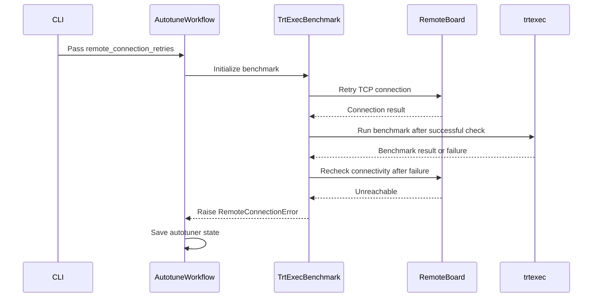

# [PR #2078] fix(autotune): pre-check remote board connectivity before benchmark

source: https://github.com/NVIDIA/Model-Optimizer/pull/2078
state: open | updated: 2026-09-23T17:20:32Z
labels: 

## 正文

# fix(autotune): pre-check remote board connectivity before benchmark

## Summary

When using `--remoteAutoTuningConfig`, a lost connection to the remote board
causes trtexec to fail. The failure gets recorded as `error: true` in
`autotune_states.yaml`, permanently skipping those schemes on restart. This is
incorrect — the error is transient (network issue), not a property of the
scheme itself.

This PR adds a TCP connectivity pre-check before each trtexec invocation. If
the board is unreachable after configurable retries, the autotuner saves state
and exits cleanly instead of poisoning the state file.

## Changes

- **`common.py`**: Add `RemoteConnectionError` exception (subclass of `AutotunerError`)
- **`benchmark.py`**: Add `_check_remote_connectivity()` and `_try_connect()` helpers;
  call pre-check in `TrtExecBenchmark.run()` before launching trtexec
- **`workflows.py`**: Catch `RemoteConnectionError` in per-scheme loop, save state
  before re-raising
- **`__main__.py`**: Add `--remote_connection_retries` CLI argument (default: 3)
- **`CHANGELOG.rst`**: Add bug fix entry

## Behavior

| Scenario | Before | After |
|----------|--------|-------|
| No remote autotune | unchanged | unchanged |
| Board unreachable before trtexec | trtexec fails → scheme marked `error: true` | pre-check fails → state saved → clean exit |
| Board reachable, trtexec succeeds | latency recorded | latency recorded |
| Board drops mid-trtexec | trtexec fails → scheme marked `error: true` | post-failure re-check: if board still gone → state saved → clean exit; if board recovered → `inf` latency (scheme error, as before) |

## New CLI option

```
--remote_connection_retries N
    Number of TCP connection attempts to the remote board before aborting.
    Only relevant when --remoteAutoTuningConfig is present in trtexec args.
    Default: 3
```

<!-- This is an auto-generated comment: release notes by coderabbit.ai -->
## Summary by CodeRabbit

* **Bug Fixes**
  * Improved remote ONNX autotuning reliability by checking board connectivity before benchmarks run.
  * Added configurable connection retries, with three retries by default.
  * Autotuning now saves its progress and exits cleanly when the remote board is unavailable, preventing schemes from being incorrectly marked as failed.
<!-- end of auto-generated comment: release notes by coderabbit.ai -->

## 评论 (6)

### copy-pr-bot[bot] · 2026-08-05

This pull request requires additional validation before any workflows can run on NVIDIA's runners.

Pull request vetters can view their responsibilities [here](https://docs.gha-runners.nvidia.com/cpr/vetters).

Contributors can view more details about this message [here](https://docs.gha-runners.nvidia.com/cpr/contributors).


### coderabbitai[bot] · 2026-08-05

<!-- This is an auto-generated comment: summarize by coderabbit.ai -->
<!-- review_stack_entry_start -->

[](https://app.coderabbit.ai/change-stack/NVIDIA/Model-Optimizer/pull/2078?utm_source=github_walkthrough&utm_medium=github&utm_campaign=change_stack)

<!-- review_stack_entry_end -->
<!-- This is an auto-generated comment: review paused by coderabbit.ai -->

> [!NOTE]
> ## Reviews paused
> 
> It looks like this branch is under active development. To avoid overwhelming you with review comments due to an influx of new commits, CodeRabbit has automatically paused this review. You can configure this behavior by changing the `reviews.auto_review.auto_pause_after_reviewed_commits` setting.
> 
> Use the following commands to manage reviews:
> - `@coderabbitai resume` to resume automatic reviews.
> - `@coderabbitai review` to trigger a single review.
> 
> Use the checkboxes below for quick actions:
> - [ ] <!-- {"checkboxId": "7f6cc2e2-2e4e-497a-8c31-c9e4573e93d1"} --> ▶️ Resume reviews
> - [ ] <!-- {"checkboxId": "e9bb8d72-00e8-4f67-9cb2-caf3b22574fe"} --> 🔍 Trigger review

<!-- end of auto-generated comment: review paused by coderabbit.ai -->
<!-- walkthrough_start -->

<details>
<summary>📝 Walkthrough</summary>

## Walkthrough

ONNX Autotune checks remote board connectivity before each `trtexec` call, retries connections with a configurable count, and saves autotuner state when the board is unreachable.

### Changes

**Remote autotuning connection handling**

|Layer / File(s)|Summary|
|---|---|
|**Remote board connectivity validation** <br> `modelopt/onnx/quantization/autotune/common.py`, `modelopt/onnx/quantization/autotune/benchmark.py`|Adds `RemoteConnectionError`. Parses remote configuration, retries TCP connections, and validates connectivity before and after `trtexec` failures.|
|**Retry configuration wiring** <br> `modelopt/onnx/quantization/autotune/__main__.py`, `modelopt/onnx/quantization/autotune/workflows.py`|Adds `--remote_connection_retries` with a default of 3, validates the range, and forwards the value to `TrtExecBenchmark`.|
|**Remote failure checkpoint handling** <br> `modelopt/onnx/quantization/autotune/workflows.py`, `CHANGELOG.rst`, `docs/source/guides/9_autotune.rst`|Saves autotuner state and re-raises `RemoteConnectionError` during baseline, region-scheme, and final-model profiling. Documents retry and resume behavior.|

**Estimated code review effort:** 3 (Moderate) | ~20 minutes

### Sequence Diagram(s)



**Suggested reviewers:** `ajrasane`

</details>

<!-- walkthrough_end -->
<!-- pre_merge_checks_walkthrough_start -->

<details>
<summary>🚥 Pre-merge checks | ✅ 6</summary>

<details>
<summary>✅ Passed checks (6 passed)</summary>

|         Check name         | Status   | Explanation                                                                                                                                                              |
| :------------------------: | :------- | :----------------------------------------------------------------------------------------------------------------------------------------------------------------------- |
|     Docstring Coverage     | ✅ Passed | Docstring coverage is 100.00% which is sufficient. The required threshold is 80.00%.                                                                                     |
|     Linked Issues check    | ✅ Passed | Check skipped because no linked issues were found for this pull request.                                                                                                 |
| Out of Scope Changes check | ✅ Passed | Check skipped because no linked issues were found for this pull request.                                                                                                 |
|   Security Anti-Patterns   | ✅ Passed | The PR adds no prohibited deserialization, remote-code, eval/exec, or # nosec patterns; it also changes no dependency manifests. The existing # nosec line is unchanged. |
|      Description Check     | ✅ Passed | Check skipped - CodeRabbit’s high-level summary is enabled.                                                                                                              |
|         Title check        | ✅ Passed | The title clearly and concisely describes the main change: adding a remote board connectivity pre-check before benchmark execution in autotune.                          |

</details>

</details>

<!-- pre_merge_checks_walkthrough_end -->
<!-- finishing_touch_checkbox_start -->

<details>
<summary>✨ Finishing Touches</summary>

<details>
<summary>🧪 Generate unit tests (beta)</summary>

- [ ] <!-- {"checkboxId": "f47ac10b-58cc-4372-a567-0e02b2c3d479", "radioGroupId": "utg-output-choice-group-unknown_comment_id"} -->   Create PR with unit tests

</details>

</details>

<!-- finishing_touch_checkbox_end -->
<!-- tips_start -->

---


<sub>Comment `@coderabbitai help` to get the list of available commands.</sub>

<!-- tips_end -->

### coderabbitai[bot] · 2026-08-05

<!-- This is an auto-generated comment by CodeRabbit -->
> [!NOTE]
> GitHub couldn't provide a complete incremental comparison for this pull request, so CodeRabbit is performing a full review instead. This review may take a little longer.

### coderabbitai[bot] · 2026-08-05

<!-- This is an auto-generated comment by CodeRabbit -->
> [!NOTE]
> GitHub couldn't provide a complete incremental comparison for this pull request, so CodeRabbit is performing a full review instead. This review may take a little longer.

### ajrasane · 2026-09-23

/ok to test 0a1ccff3e72026f854bd4cc41c58f923034bd5ca

### codecov[bot] · 2026-09-23

## [Codecov](https://app.codecov.io/gh/NVIDIA/Model-Optimizer/pull/2078?dropdown=coverage&src=pr&el=h1&utm_medium=referral&utm_source=github&utm_content=comment&utm_campaign=pr+comments&utm_term=NVIDIA) Report
:x: Patch coverage is `95.40230%` with `4 lines` in your changes missing coverage. Please review.
:white_check_mark: Project coverage is 77.95%. Comparing base ([`b311c05`](https://app.codecov.io/gh/NVIDIA/Model-Optimizer/commit/b311c054de4052df9c7f3de9409b7598f44a0dba?dropdown=coverage&el=desc&utm_medium=referral&utm_source=github&utm_content=comment&utm_campaign=pr+comments&utm_term=NVIDIA)) to head ([`0a1ccff`](https://app.codecov.io/gh/NVIDIA/Model-Optimizer/commit/0a1ccff3e72026f854bd4cc41c58f923034bd5ca?dropdown=coverage&el=desc&utm_medium=referral&utm_source=github&utm_content=comment&utm_campaign=pr+comments&utm_term=NVIDIA)).
:warning: Report is 12 commits behind head on main.

| [Files with missing lines](https://app.codecov.io/gh/NVIDIA/Model-Optimizer/pull/2078?dropdown=coverage&src=pr&el=tree&utm_medium=referral&utm_source=github&utm_content=comment&utm_campaign=pr+comments&utm_term=NVIDIA) | Patch % | Lines |
|---|---|---|
| [modelopt/onnx/quantization/autotune/\_\_main\_\_.py](https://app.codecov.io/gh/NVIDIA/Model-Optimizer/pull/2078?src=pr&el=tree&filepath=modelopt%2Fonnx%2Fquantization%2Fautotune%2F__main__.py&utm_medium=referral&utm_source=github&utm_content=comment&utm_campaign=pr+comments&utm_term=NVIDIA#diff-bW9kZWxvcHQvb25ueC9xdWFudGl6YXRpb24vYXV0b3R1bmUvX19tYWluX18ucHk=) | 25.00% | [3 Missing :warning: ](https://app.codecov.io/gh/NVIDIA/Model-Optimizer/pull/2078?src=pr&el=tree&utm_medium=referral&utm_source=github&utm_content=comment&utm_campaign=pr+comments&utm_term=NVIDIA) |
| [modelopt/onnx/quantization/autotune/benchmark.py](https://app.codecov.io/gh/NVIDIA/Model-Optimizer/pull/2078?src=pr&el=tree&filepath=modelopt%2Fonnx%2Fquantization%2Fautotune%2Fbenchmark.py&utm_medium=referral&utm_source=github&utm_content=comment&utm_campaign=pr+comments&utm_term=NVIDIA#diff-bW9kZWxvcHQvb25ueC9xdWFudGl6YXRpb24vYXV0b3R1bmUvYmVuY2htYXJrLnB5) | 98.48% | [1 Missing :warning: ](https://app.codecov.io/gh/NVIDIA/Model-Optimizer/pull/2078?src=pr&el=tree&utm_medium=referral&utm_source=github&utm_content=comment&utm_campaign=pr+comments&utm_term=NVIDIA) |

<details><summary>Additional details and impacted files</summary>


```diff
@@            Coverage Diff             @@
##             main    #2078      +/-   ##
==========================================
+ Coverage   71.14%   77.95%   +6.80%     
==========================================
  Files         602      603       +1     
  Lines       66397    69341    +2944     
==========================================
+ Hits        47239    54054    +6815     
+ Misses      19158    15287    -3871     
```

| [Flag](https://app.codecov.io/gh/NVIDIA/Model-Optimizer/pull/2078/flags?src=pr&el=flags&utm_medium=referral&utm_source=github&utm_content=comment&utm_campaign=pr+comments&utm_term=NVIDIA) | Coverage Δ | |
|---|---|---|
| [examples-diffusers](https://app.codecov.io/gh/NVIDIA/Model-Optimizer/pull/2078/flags?src=pr&el=flag&utm_medium=referral&utm_source=github&utm_content=comment&utm_campaign=pr+comments&utm_term=NVIDIA) | `21.29% <0.00%> (-0.03%)` | :arrow_down: |
| [examples-gpt-oss](https://app.codecov.io/gh/NVIDIA/Model-Optimizer/pull/2078/flags?src=pr&el=flag&utm_medium=referral&utm_source=github&utm_content=comment&utm_campaign=pr+comments&utm_term=NVIDIA) | `13.40% <0.00%> (-0.02%)` | :arrow_down: |
| [examples-hf_ptq](https://app.codecov.io/gh/NVIDIA/Model-Optimizer/pull/2078/flags?src=pr&el=flag&utm_medium=referral&utm_source=github&utm_content=comment&utm_campaign=pr+comments&utm_term=NVIDIA) | `22.39% <0.00%> (-0.07%)` | :arrow_down: |
| [examples-llm_distill](https://app.codecov.io/gh/NVIDIA/Model-Optimizer/pull/2078/flags?src=pr&el=flag&utm_medium=referral&utm_source=github&utm_content=comment&utm_campaign=pr+comments&utm_term=NVIDIA) | `13.46% <0.00%> (-0.02%)` | :arrow_down: |
| [examples-llm_eval](https://app.codecov.io/gh/NVIDIA/Model-Optimizer/pull/2078/flags?src=pr&el=flag&utm_medium=referral&utm_source=github&utm_content=comment&utm_campaign=pr+comments&utm_term=NVIDIA) | `17.33% <0.00%> (-0.03%)` | :arrow_down: |
| [examples-llm_qat](https://app.codecov.io/gh/NVIDIA/Model-Optimizer/pull/2078/flags?src=pr&el=flag&utm_medium=referral&utm_source=github&utm_content=comment&utm_campaign=pr+comments&utm_term=NVIDIA) | `17.62% <0.00%> (-0.03%)` | :arrow_down: |
| [examples-llm_sparsity](https://app.codecov.io/gh/NVIDIA/Model-Optimizer/pull/2078/flags?src=pr&el=flag&utm_medium=referral&utm_source=github&utm_content=comment&utm_campaign=pr+comments&utm_term=NVIDIA) | `15.91% <0.00%> (-0.02%)` | :arrow_down: |
| [examples-megatron_bridge](https://app.codecov.io/gh/NVIDIA/Model-Optimizer/pull/2078/flags?src=pr&el=flag&utm_medium=referral&utm_source=github&utm_content=comment&utm_campaign=pr+comments&utm_term=NVIDIA) | `26.14% <0.00%> (-0.15%)` | :arrow_down: |
| [examples-specdec_bench](https://app.codecov.io/gh/NVIDIA/Model-Optimizer/pull/2078/flags?src=pr&el=flag&utm_medium=referral&utm_source=github&utm_content=comment&utm_campaign=pr+comments&utm_term=NVIDIA) | `13.15% <0.00%> (-0.02%)` | :arrow_down: |
| [examples-speculative_decoding](https://app.codecov.io/gh/NVIDIA/Model-Optimizer/pull/2078/flags?src=pr&el=flag&utm_medium=referral&utm_source=github&utm_content=comment&utm_campaign=pr+comments&utm_term=NVIDIA) | `17.75% <0.00%> (-0.09%)` | :arrow_down: |
| [examples-torch_onnx](https://app.codecov.io/gh/NVIDIA/Model-Optimizer/pull/2078/flags?src=pr&el=flag&utm_medium=referral&utm_source=github&utm_content=comment&utm_campaign=pr+comments&utm_term=NVIDIA) | `21.83% <0.00%> (-0.03%)` | :arrow_down: |
| [examples-torch_trt](https://app.codecov.io/gh/NVIDIA/Model-Optimizer/pull/2078/flags?src=pr&el=flag&utm_medium=referral&utm_source=github&utm_content=comment&utm_campaign=pr+comments&utm_term=NVIDIA) | `15.20% <0.00%> (-0.02%)` | :arrow_down: |
| [examples-vllm_serve](https://app.codecov.io/gh/NVIDIA/Model-Optimizer/pull/2078/flags?src=pr&el=flag&utm_medium=referral&utm_source=github&utm_content=comment&utm_campaign=pr+comments&utm_term=NVIDIA) | `13.79% <0.00%> (-0.02%)` | :arrow_down: |
| [gpu](https://app.codecov.io/gh/NVIDIA/Model-Optimizer/pull/2078/flags?src=pr&el=flag&utm_medium=referral&utm_source=github&utm_content=comment&utm_campaign=pr+comments&utm_term=NVIDIA) | `58.78% <35.63%> (+25.37%)` | :arrow_up: |
| [regression](https://app.codecov.io/gh/NVIDIA/Model-Optimizer/pull/2078/flags?src=pr&el=flag&utm_medium=referral&utm_source=github&utm_content=comment&utm_campaign=pr+comments&utm_term=NVIDIA) | `15.14% <0.00%> (-0.03%)` | :arrow_down: |
| [unit](https://app.codecov.io/gh/NVIDIA/Model-Optimizer/pull/2078/flags?src=pr&el=flag&utm_medium=referral&utm_source=github&utm_content=comment&utm_campaign=pr+comments&utm_term=NVIDIA) | `58.50% <95.40%> (+0.38%)` | :arrow_up: |

Flags with carried forward coverage won't be shown. [Click here](https://docs.codecov.io/docs/carryforward-flags?utm_medium=referral&utm_source=github&utm_content=comment&utm_campaign=pr+comments&utm_term=NVIDIA#carryforward-flags-in-the-pull-request-comment) to find out more.
</details>

[:umbrella: View full report in Codecov by Harness](https://app.codecov.io/gh/NVIDIA/Model-Optimizer/pull/2078?dropdown=coverage&src=pr&el=continue&utm_medium=referral&utm_source=github&utm_content=comment&utm_campaign=pr+comments&utm_term=NVIDIA).   
:loudspeaker: Have feedback on the report? [Share it here](https://about.codecov.io/codecov-pr-comment-feedback/?utm_medium=referral&utm_source=github&utm_content=comment&utm_campaign=pr+comments&utm_term=NVIDIA).
<details><summary> :rocket: New features to boost your workflow: </summary>

- :snowflake: [Test Analytics](https://docs.codecov.com/docs/test-analytics): Detect flaky tests, report on failures, and find test suite problems.
</details>

## Review (29)

### coderabbitai[bot] · 2026-08-05 · COMMENTED

> [!WARNING]
> CodeRabbit couldn't request changes on this pull request because it doesn't have sufficient GitHub permissions.
>
> Please grant **CodeRabbit Pull requests: Read and write** permission and re-run the review.
>
> 👉 [Steps to fix this](https://kb.coderabbit.ai/articles/7925086077)

**Actionable comments posted: 2**

<details>
<summary>🤖 Prompt for all review comments with AI agents</summary>

```
Verify each finding against current code. Fix only still-valid issues, skip the
rest with a brief reason, keep changes minimal, and validate.

Inline comments:
In `@modelopt/onnx/quantization/autotune/__main__.py`:
- Around line 318-324: Validate the remote_connection_retries argument at the
CLI boundary where trt_group defines it, rejecting values below 1 and values
above a documented finite maximum. Add the allowed upper limit to the argument
help text and ensure the validated value is what _try_connect uses, preventing
zero-attempt behavior and excessive retry delays.

In `@modelopt/onnx/quantization/autotune/workflows.py`:
- Around line 338-345: Update benchmark_onnx_model so its generic exception
handling does not swallow RemoteConnectionError: add a dedicated handler that
re-raises it before the fallback handler. Preserve the existing float("inf")
behavior for other benchmark failures, allowing the workflow handler around
benchmark_onnx_model to save state and exit on remote connection loss.
```

</details>

<details>
<summary>🪄 Autofix</summary>

Fix all unresolved CodeRabbit comments on this PR:

- [ ] <!-- {"checkboxId": "4b0d0e0a-96d7-4f10-b296-3a18ea78f0b9"} --> Push a commit to this branch (recommended)
- [ ] <!-- {"checkboxId": "ff5b1114-7d8c-49e6-8ac1-43f82af23a33"} --> Create a new PR with the fixes

</details>

---

<details>
<summary>ℹ️ Review info</summary>

<details>
<summary>⚙️ Run configuration</summary>

**Configuration used**: Path: .coderabbit.yaml

**Review profile**: CHILL

**Plan**: Enterprise

**Run ID**: `3e201cba-baed-4f7c-b784-5ba792d08bd9`

</details>

<details>
<summary>📥 Commits</summary>

Reviewing files that changed from the base of the PR and between 7afbfbc85ce145d5233bcb8ec38445394dcb3944 and f95be177ea0289bef0d64dc704bad184584617ff.

</details>

<details>
<summary>📒 Files selected for processing (5)</summary>

* `CHANGELOG.rst`
* `modelopt/onnx/quantization/autotune/__main__.py`
* `modelopt/onnx/quantization/autotune/benchmark.py`
* `modelopt/onnx/quantization/autotune/common.py`
* `modelopt/onnx/quantization/autotune/workflows.py`

</details>

</details>

<!-- This is an auto-generated comment by CodeRabbit for review status -->

### coderabbitai[bot] · 2026-08-05 · COMMENTED

> [!WARNING]
> CodeRabbit couldn't request changes on this pull request because it doesn't have sufficient GitHub permissions.
>
> Please grant **CodeRabbit Pull requests: Read and write** permission and re-run the review.
>
> 👉 [Steps to fix this](https://kb.coderabbit.ai/articles/7925086077)

**Actionable comments posted: 2**

> [!CAUTION]
> Some comments are outside the diff and can’t be posted inline due to platform limitations.
> 
> 
> 
> <details>
> <summary>⚠️ Outside diff range comments (1)</summary><blockquote>
> 
> <details>
> <summary>modelopt/onnx/quantization/autotune/benchmark.py (1)</summary><blockquote>
> 
> `230-247`: _🩺 Stability & Availability_ | _🟡 Minor_ | _⚡ Quick win_
> 
> **Validate `remote_connection_retries` at the public API boundary.**
> 
> A value of `0` or less makes `_try_connect()` execute no attempts and return `None`. The benchmark then treats the remote board as reachable. A very large value can block the workflow for repeated five-second connection timeouts and retry delays. Reject values below `1` and enforce a documented upper bound before storing this value.
> 
> 
> 
> 
> As per path instructions, validate remote host/port and retry inputs, and enforce sensible timeouts and limits.
> 
> <details>
> <summary>🤖 Prompt for AI Agents</summary>
> 
> ```
> Verify each finding against current code. Fix only still-valid issues, skip the
> rest with a brief reason, keep changes minimal, and validate.
> 
> In `@modelopt/onnx/quantization/autotune/benchmark.py` around lines 230 - 247,
> Validate remote_connection_retries in the benchmark constructor before assigning
> it to _remote_connection_retries: reject values below 1 and values above a
> documented sensible maximum, using the project’s existing validation/error
> conventions. Update the parameter documentation to state the accepted range,
> while preserving the retry behavior for valid values.
> ```
> 
> </details>
> 
> <!-- cr-comment:v1:ec8742065171d4e881e06dd3 -->
> 
> _Source: Path instructions_
> 
> </blockquote></details>
> 
> </blockquote></details>

<details>
<summary>🤖 Prompt for all review comments with AI agents</summary>

```
Verify each finding against current code. Fix only still-valid issues, skip the
rest with a brief reason, keep changes minimal, and validate.

Inline comments:
In `@modelopt/onnx/quantization/autotune/benchmark.py`:
- Around line 329-330: Update region_pattern_autotuning_workflow so
RemoteConnectionError handling surrounds every benchmark_onnx_model call,
including baseline and final measurements; save the current autotuning state in
that handler before re-raising the exception, while preserving existing
per-scheme behavior.
- Around line 85-92: Update the remote URI handling in run_autotune() around
urllib.parse.urlparse to strip matching surrounding quotes from config_value
before parsing, then validate the parsed host and port. Raise
RemoteConnectionError when the hostname is missing or accessing the port
identifies an invalid port, while preserving the existing default-port lookup
for valid URIs.

---

Outside diff comments:
In `@modelopt/onnx/quantization/autotune/benchmark.py`:
- Around line 230-247: Validate remote_connection_retries in the benchmark
constructor before assigning it to _remote_connection_retries: reject values
below 1 and values above a documented sensible maximum, using the project’s
existing validation/error conventions. Update the parameter documentation to
state the accepted range, while preserving the retry behavior for valid values.
```

</details>

<details>
<summary>🪄 Autofix</summary>

Fix all unresolved CodeRabbit comments on this PR:

- [ ] <!-- {"checkboxId": "4b0d0e0a-96d7-4f10-b296-3a18ea78f0b9"} --> Push a commit to this branch (recommended)
- [ ] <!-- {"checkboxId": "ff5b1114-7d8c-49e6-8ac1-43f82af23a33"} --> Create a new PR with the fixes

</details>

---

<details>
<summary>ℹ️ Review info</summary>

<details>
<summary>⚙️ Run configuration</summary>

**Configuration used**: Path: .coderabbit.yaml

**Review profile**: CHILL

**Plan**: Enterprise

**Run ID**: `ffdbc6f1-6b9f-4123-86d2-8e22b53519ae`

</details>

<details>
<summary>📥 Commits</summary>

Reviewing files that changed from the base of the PR and between 7afbfbc85ce145d5233bcb8ec38445394dcb3944 and 7ad4729830795fdfd8f94e20a53afd6813a5d6a9.

</details>

<details>
<summary>📒 Files selected for processing (6)</summary>

* `CHANGELOG.rst`
* `docs/source/guides/9_autotune.rst`
* `modelopt/onnx/quantization/autotune/__main__.py`
* `modelopt/onnx/quantization/autotune/benchmark.py`
* `modelopt/onnx/quantization/autotune/common.py`
* `modelopt/onnx/quantization/autotune/workflows.py`

</details>

<details>
<summary>🚧 Files skipped from review as they are similar to previous changes (4)</summary>

* modelopt/onnx/quantization/autotune/common.py
* modelopt/onnx/quantization/autotune/__main__.py
* CHANGELOG.rst
* modelopt/onnx/quantization/autotune/workflows.py

</details>

</details>

<!-- This is an auto-generated comment by CodeRabbit for review status -->

### arata-miyamoto · 2026-08-06 · COMMENTED

(no text)

### coderabbitai[bot] · 2026-08-06 · COMMENTED

(no text)

### willg-nv · 2026-08-06 · COMMENTED

(no text)

### coderabbitai[bot] · 2026-08-06 · COMMENTED

> [!WARNING]
> CodeRabbit couldn't request changes on this pull request because it doesn't have sufficient GitHub permissions.
>
> Please grant **CodeRabbit Pull requests: Read and write** permission and re-run the review.
>
> 👉 [Steps to fix this](https://kb.coderabbit.ai/articles/7925086077)

**Actionable comments posted: 2**

> [!CAUTION]
> Some comments are outside the diff and can’t be posted inline due to platform limitations.
> 
> 
> 
> <details>
> <summary>⚠️ Outside diff range comments (2)</summary><blockquote>
> 
> <details>
> <summary>modelopt/onnx/quantization/autotune/benchmark.py (2)</summary><blockquote>
> 
> `73-83`: _🗄️ Data Integrity & Integration_ | _🟠 Major_ | _⚡ Quick win_
> 
> **Reject a remote configuration flag with no value.**
> 
> If `trtexec_args` ends with `--remoteAutoTuningConfig`, Line 78 does not set `config_value` and Line 82 returns. The malformed flag remains in `_base_cmd`. `trtexec` can then fail, and `_benchmark_failed()` can classify it as a scheme failure instead of preserving autotuner state.
> 
> Raise `RemoteConnectionError` when the flag has no following value.
> 
> As per path instructions, validate untrusted connection parameters and preserve remote failure handling.     
> 
> <details>
> <summary>Proposed fix</summary>
> 
> ```diff
> -        elif arg == "--remoteAutoTuningConfig" and i + 1 < len(trtexec_args):
> -            config_value = trtexec_args[i + 1]
> -            break
> +        elif arg == "--remoteAutoTuningConfig":
> +            if i + 1 >= len(trtexec_args):
> +                raise RemoteConnectionError(
> +                    "--remoteAutoTuningConfig requires a remote URI value"
> +                )
> +            config_value = trtexec_args[i + 1]
> +            break
> ```
> </details>
> 
> <details>
> <summary>🤖 Prompt for AI Agents</summary>
> 
> ```
> Verify each finding against current code. Fix only still-valid issues, skip the
> rest with a brief reason, keep changes minimal, and validate.
> 
> In `@modelopt/onnx/quantization/autotune/benchmark.py` around lines 73 - 83,
> Update the remote configuration argument parsing in the benchmark setup to raise
> RemoteConnectionError when --remoteAutoTuningConfig appears without a following
> value, rather than returning and leaving the malformed flag in _base_cmd.
> Preserve existing handling for inline and separate valid values and ensure the
> error follows the existing remote failure path.
> ```
> 
> </details>
> 
> <!-- cr-comment:v1:5474b61862c499be42e37d49 -->
> 
> _Source: Path instructions_
> 
> ---
> 
> `237-254`: _🩺 Stability & Availability_ | _🟠 Major_ | _⚡ Quick win_
> 
> **Validate `remote_connection_retries` in `TrtExecBenchmark`.**
> 
> `_try_connect` performs zero attempts for values below `1` and accepts values above `10`. Enforce `1 <= remote_connection_retries <= 10` for direct API callers, not only in the CLI.
> 
> <details>
> <summary>🤖 Prompt for AI Agents</summary>
> 
> ```
> Verify each finding against current code. Fix only still-valid issues, skip the
> rest with a brief reason, keep changes minimal, and validate.
> 
> In `@modelopt/onnx/quantization/autotune/benchmark.py` around lines 237 - 254,
> Validate remote_connection_retries in TrtExecBenchmark.__init__ before assigning
> it to _remote_connection_retries, requiring an integer value from 1 through 10
> inclusive. Reject values outside this range for direct API callers while
> preserving the existing retry behavior for valid inputs.
> ```
> 
> </details>
> 
> <!-- cr-comment:v1:d769e0b8a7a1b388552bb38e -->
> 
> _Source: Path instructions_
> 
> </blockquote></details>
> 
> </blockquote></details>

<details>
<summary>🤖 Prompt for all review comments with AI agents</summary>

```
Verify each finding against current code. Fix only still-valid issues, skip the
rest with a brief reason, keep changes minimal, and validate.

Inline comments:
In `@modelopt/onnx/quantization/autotune/benchmark.py`:
- Around line 89-97: Update the remote URI validation errors around parsed.port
and the hostname check to avoid including config_value, which may contain
credentials. Build messages using only the URI scheme, hostname, and port, while
preserving the existing RemoteConnectionError types and exception chaining for
invalid ports.

In `@modelopt/onnx/quantization/autotune/workflows.py`:
- Around line 298-303: Update all three exception handlers around the baseline,
tuning, and final benchmark flows to log the saved checkpoint path after
autotuner.save_state(str(state_path)) succeeds and before re-raising. Use
state_path in the message so users can locate the resume checkpoint, while
preserving the existing save-and-reraise behavior.

---

Outside diff comments:
In `@modelopt/onnx/quantization/autotune/benchmark.py`:
- Around line 73-83: Update the remote configuration argument parsing in the
benchmark setup to raise RemoteConnectionError when --remoteAutoTuningConfig
appears without a following value, rather than returning and leaving the
malformed flag in _base_cmd. Preserve existing handling for inline and separate
valid values and ensure the error follows the existing remote failure path.
- Around line 237-254: Validate remote_connection_retries in
TrtExecBenchmark.__init__ before assigning it to _remote_connection_retries,
requiring an integer value from 1 through 10 inclusive. Reject values outside
this range for direct API callers while preserving the existing retry behavior
for valid inputs.
```

</details>

<details>
<summary>🪄 Autofix</summary>

Fix all unresolved CodeRabbit comments on this PR:

- [ ] <!-- {"checkboxId": "4b0d0e0a-96d7-4f10-b296-3a18ea78f0b9"} --> Push a commit to this branch (recommended)
- [ ] <!-- {"checkboxId": "ff5b1114-7d8c-49e6-8ac1-43f82af23a33"} --> Create a new PR with the fixes

</details>

---

<details>
<summary>ℹ️ Review info</summary>

<details>
<summary>⚙️ Run configuration</summary>

**Configuration used**: Path: .coderabbit.yaml

**Review profile**: CHILL

**Plan**: Enterprise

**Run ID**: `c53cc04b-6637-47ba-8028-ea8992e5e0dd`

</details>

<details>
<summary>📥 Commits</summary>

Reviewing files that changed from the base of the PR and between 3eee98128f92b2e61a53301d0bd5c4a209ffc2b8 and 05a8474ddf4aeb90bb457dea11f5a3bfa605c351.

</details>

<details>
<summary>📒 Files selected for processing (2)</summary>

* `modelopt/onnx/quantization/autotune/benchmark.py`
* `modelopt/onnx/quantization/autotune/workflows.py`

</details>

</details>

<!-- This is an auto-generated comment by CodeRabbit for review status -->

### coderabbitai[bot] · 2026-08-06 · APPROVED

(no text)

### arata-miyamoto · 2026-08-07 · CHANGES_REQUESTED

(no text)

### willg-nv · 2026-08-07 · COMMENTED

(no text)

### arata-miyamoto · 2026-08-07 · APPROVED

(no text)

### cjluo-nv · 2026-09-11 · COMMENTED

> _Bot review (claude-opus-5) — DM the bot to share feedback._

Comment: the pre-check logic is new, easily unit-testable pure code but ships with no tests, and an unparseable `--remoteAutoTuningConfig` now hard-aborts a run that previously worked.

Needs action:
- [ ] Add unit tests in `tests/unit/onnx/quantization/autotune/` for `_check_remote_connectivity` (both `--flag=value` and `--flag value` forms, default ports, missing/invalid port, no-remote-config no-op) and `_try_connect` retry/backoff with a mocked `socket.create_connection`.
- [ ] Don't raise `RemoteConnectionError` when the config string has no parseable hostname (e.g. `192.168.1.100:22`, non-URI trtexec syntax) — log a warning and skip the pre-check instead of aborting the whole autotune. See inline comment in `benchmark.py`.
- [ ] Document the `_benchmark_failed()` post-failure re-check: the PR table and `docs/source/guides/9_autotune.rst` both say a mid-trtexec board drop behaves as before, but the code now aborts. Fix one or the other.
- [ ] Factor the three identical `except RemoteConnectionError: save_state + log + raise` blocks in `workflows.py` into one helper.
- [ ] Remove the unrelated EAGLE-3 context-parallelism entry from `CHANGELOG.rst` (looks like a stray rebase artifact).

<!-- bot-review sha=0e123413e193ed1f91771daae0728b85cb73ade9 -->

### willg-nv · 2026-09-21 · COMMENTED

(no text)

### willg-nv · 2026-09-21 · COMMENTED

(no text)

### willg-nv · 2026-09-21 · COMMENTED

(no text)

### willg-nv · 2026-09-21 · COMMENTED

(no text)

### cjluo-nv · 2026-09-21 · COMMENTED

> _Bot review (gpt-6-astra) — DM the bot to share feedback._

Comment: checkpoint handling is improved, but critical regression tests and input-validation fixes remain outstanding, and URI warnings reintroduce credential exposure.

Needs action:
- [ ] Add mocked connectivity and checkpoint/resume tests under `tests/unit/onnx/quantization/autotune/`, including persistent mid-trtexec disconnects and ordinary benchmark failures.
- [ ] Redact credentials from the new warnings in `benchmark.py`; see inline comment.
- [ ] Validate API retry counts and handle missing values and URI-parser exceptions in `benchmark.py`; see inline comments.
- [ ] :speech_balloon: Author replied “updated”: the guide now describes post-failure checks, but update the PR body’s mid-trtexec row, which still says behavior is unchanged.

No action needed:
- :heavy_check_mark: Resolved since the last review: exception propagation/checkpoint coverage, duplicated save-state handlers, and unrelated changelog changes.

<!-- bot-review sha=00802386d8c40ab9ee3ef9b0637e92f6339368d9 -->

### cjluo-nv · 2026-09-21 · COMMENTED

> _Bot review (gpt-6-astra) — DM the bot to share feedback._

Comment: input-validation fixes are addressed, but the new recovery path does not preserve active-region progress, and critical integration coverage remains incomplete.

Needs action:
- [ ] Preserve the interrupted scheme and completed active-region measurements across checkpoint reload; see `workflows.py` inline comment.
- [ ] Complete `test_remote_connectivity.py` coverage for persistent mid-trtexec loss, actual workflow baseline/scheme/final failures, and resumed scheme identity.
- [ ] Remove collection-time global dependency stubs from `test_remote_connectivity.py`; they contaminate other tests.
- [ ] Move unjustified function-local imports in `test_remote_connectivity.py` to the module import section.
- [ ] :speech_balloon: Author replied “updated”: the guide describes post-failure checks, but update the PR body's mid-trtexec row, which still claims unchanged behavior.

No action needed:
- :heavy_check_mark: Resolved since the last review: API/CLI retry bounds, empty values and parser exceptions, credential-safe warnings, exception propagation, shared checkpoint handling, and unrelated changelog edits. Parsing/retry tests and baseline-save coverage are now present.
- The new test header matches `LICENSE_HEADER`; no existing tests were modified or deleted.

<!-- bot-review sha=956776339e283c47fa8e457813565cafaed0c689 -->

### willg-nv · 2026-09-21 · COMMENTED

(no text)

### cjluo-nv · 2026-09-21 · COMMENTED

> _Bot review (gpt-6-astra) — DM the bot to share feedback._

Comment: test isolation and propagation coverage improved, but critical disconnect/recovery tests remain incomplete and the documented resume guarantee is still inaccurate.

Needs action:
- [ ] Add a persistent mid-trtexec disconnect test through `TrtExecBenchmark.run()` in `test_remote_connectivity.py`; see inline comment.
- [ ] Strengthen workflow tests to verify submission history and reloaded checkpoint contents, including baseline and final interruptions; see inline comment.
- [ ] :speech_balloon: Author accepts restarting the active region — document that limitation in `9_autotune.rst` and test committed-region preservation rather than claiming exact scheme recovery.
- [ ] :speech_balloon: Author previously replied “updated” — update the PR body's mid-trtexec row; it still contradicts the implemented post-failure re-check.

No action needed:
- :heavy_check_mark: Resolved since the last review: global dependency stubs and local imports removed; workflow scheme/final calls, exception propagation, and two-check assertions now have coverage.
- Earlier validation, credential-warning, and checkpoint-helper fixes remain intact. The new header matches `LICENSE_HEADER`; no existing tests were modified or deleted.

<!-- bot-review sha=c57afb261233a1a35caa894fb933cbbd28f0f53e -->

### willg-nv · 2026-09-21 · COMMENTED

(no text)

### cjluo-nv · 2026-09-21 · COMMENTED

> _Bot review (gpt-6-astra) — DM the bot to share feedback._

The problem is that transient board failures are being persisted as permanent scheme failures. I’ll first check existing benchmark and checkpoint mechanisms, then verify the previously requested disconnect and recovery tests against the current code.

<!-- bot-review sha=b4ef712ced11c78e59b84672127a3be15c8d4edf -->

### cjluo-nv · 2026-09-22 · COMMENTED

> _Bot review (gpt-6-astra) — DM the bot to share feedback._

The problem is that transient board loss can be recorded as a permanent scheme failure. I’ll check existing connectivity and checkpoint mechanisms first, then verify the remaining disconnect and restart tests.


<!-- bot-review sha=b4ef712ced11c78e59b84672127a3be15c8d4edf -->

### cjluo-nv · 2026-09-22 · COMMENTED

> _Bot review (gpt-6-astra) — DM the bot to share feedback._

Comment: recovery documentation and workflow assertions improved, but two critical disconnect/restart coverage gaps remain unresolved.

Needs action:
- [ ] :speech_balloon: Author considers existing mocks sufficient — add the persistent-disconnect test through `TrtExecBenchmark.run()` in `test_remote_connectivity.py`; see inline comment.
- [ ] Fix `test_restart_skips_committed_regions_resumes_active` to interrupt an active region after a committed region, then exercise restart; see inline comment.
- [ ] Explain in the PR body why benchmark-local TCP probing is preferred over classifying `_run_trtexec` failures or extending that shared runner with an optional guard.
- [ ] :speech_balloon: Author previously replied “updated” — correct the PR body's mid-trtexec row to describe persistent-loss detection and its brief-disconnect limitation.

No action needed:
- :heavy_check_mark: Resolved since the last review: region-level recovery documentation, baseline checkpoint reload coverage, and workflow submission-history assertions. Earlier validation, credential-warning, and test-isolation fixes remain intact.
- The 1,013-line change is test-heavy and cohesive; size alone is not blocking. No existing tests were modified or deleted, and the new header matches `LICENSE_HEADER`.
- Review was static; tests were not executed.

<!-- bot-review sha=b4ef712ced11c78e59b84672127a3be15c8d4edf -->

### willg-nv · 2026-09-22 · COMMENTED

(no text)

### cjluo-nv · 2026-09-22 · COMMENTED

> _Bot review (gpt-6-astra) — DM the bot to share feedback._

Not all comments are resolved: persistent-disconnect coverage is fixed, but the restart test still does not prove committed regions are skipped or preserved.

Needs action:
- [ ] Strengthen `test_restart_skips_committed_regions_resumes_active` with pattern-specific benchmark history and before/after measurement comparisons; see inline comment.
- [ ] :speech_balloon: Author previously replied “updated” — correct the PR body's mid-trtexec row to describe persistent-loss detection and the limitation when connectivity recovers before the post-check.
- [ ] :speech_balloon: Author explained unreliable stderr classification and keeping connectivity outside the shared runner — copy that rationale into the PR body, including TCP authentication limitations.

No action needed:
- :heavy_check_mark: Resolved since the last review: persistent disconnect through `run()`, actual interruption/restart setup, and recording every resumed scheme call. Earlier validation, credential-safe warnings, checkpoint propagation, test isolation, and region-level recovery documentation remain addressed.
- Design review: transient board loss must not become permanent scheme failure. Alternatives checked were `_run_trtexec` result classification, a shared-runner guard, and benchmark-local stdlib probing; the author's rationale supports the latter without another dependency.
- The 1,140-line change is cohesive and test-heavy. No existing tests are removed or weakened; the new header matches `LICENSE_HEADER`. Review was static; tests were not executed.

<!-- bot-review sha=52ac7e4a8ba3f9bb3d1198571fd6ea224c678631 -->

### willg-nv · 2026-09-23 · COMMENTED

(no text)

### cjluo-nv · 2026-09-23 · COMMENTED

> _Bot review (gpt-6-astra) — DM the bot to share feedback._

Comment: recovery coverage improved, but the committed-pattern preservation assertion remains incomplete and the PR description still contradicts the implementation.

Needs action:
- [ ] :speech_balloon: Author added snapshots and pattern tracking — make preservation assertions unconditional in `test_remote_connectivity.py`; see inline comment.
- [ ] :speech_balloon: Author previously replied “updated” — correct the PR body's mid-trtexec row to describe persistent-loss detection and missed disconnects that recover before the post-check.
- [ ] :speech_balloon: Author explained unreliable stderr classification and shared-runner separation — copy that rationale into the PR body, including TCP authentication limitations.
- [ ] Move the new function-local `yaml` import in `test_remote_connectivity.py` to module scope.

No action needed:
- :heavy_check_mark: Resolved: persistent disconnect propagation through `run()`, interrupted-workflow setup, and pattern-specific resumed benchmark tracking. Earlier validation, credential-safe warnings, checkpoint handling, and region-level recovery documentation remain addressed.
- Design alternatives checked: `_run_trtexec` result classification, a shared-runner guard, and benchmark-local stdlib probing. Existing checkpoint serialization is reused; no additional dependency is needed.
- Existing tests are not removed or weakened; the new header matches `LICENSE_HEADER`. Review was static; tests were not executed.

<!-- bot-review sha=369f840d76a65e7e58dffcfe454df95fbc561c17 -->

### cjluo-nv · 2026-09-23 · COMMENTED

> _Bot review (gpt-6-astra) — DM the bot to share feedback._

Nudge: the remaining recovery-test concerns are resolved, but the PR description still needs the behavior correction and design rationale requested previously.

Needs action:
- [ ] :speech_balloon: Author previously replied “updated” — correct the PR body's mid-trtexec row: persistent loss triggers checkpoint-and-exit; disconnects that recover before the post-check can still become scheme errors.
- [ ] :speech_balloon: Author explained unreliable stderr classification and shared-runner separation — copy that rationale into the PR body, comparing benchmark-local TCP probing with `_run_trtexec` result classification or an optional runner guard, and noting TCP cannot detect authentication failures.

No action needed:
- :heavy_check_mark: Resolved since the last review: unconditional committed-pattern preservation and interrupted-pattern assertions (critical coverage), and moving `yaml` to module scope (minor convention). Earlier disconnect propagation, validation, credential-safe warnings, and checkpoint fixes remain intact.
- Design alternatives were rechecked against `ort_utils.py` and `pyproject.toml`; existing checkpoint serialization and stdlib networking suffice without another dependency.
- No existing tests were removed or weakened; the new header matches `LICENSE_HEADER`. Review was static; tests were not executed.

<!-- bot-review sha=0a1ccff3e72026f854bd4cc41c58f923034bd5ca -->

### ajrasane · 2026-09-23 · APPROVED

(no text)
