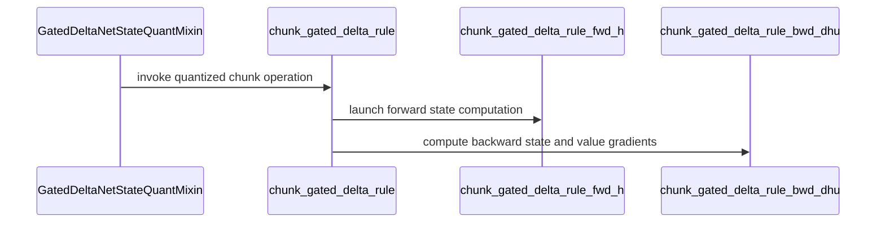

# [PR #2497] [1/5] GDN state/W QAT foundation

source: https://github.com/NVIDIA/Model-Optimizer/pull/2497
state: open | updated: 2026-09-25T05:18:04Z
labels: 

## 正文

<!-- linear-attention-stack:start -->
**Linear-attention PR stack — 5 PRs**

| Order | PR | Depends on |
| --- | --- | --- |
| 1/5 | [#2497 GDN state/W QAT foundation](https://github.com/NVIDIA/Model-Optimizer/pull/2497) | main |
| 2/5 | [#2519 GDN/KDA decode QAT + INT8](https://github.com/NVIDIA/Model-Optimizer/pull/2519) | [#2497](https://github.com/NVIDIA/Model-Optimizer/pull/2497) |
| 3/5 | [#2541 vLLM GDN/KDA state-only fake quantization](https://github.com/NVIDIA/Model-Optimizer/pull/2541) | [#2519](https://github.com/NVIDIA/Model-Optimizer/pull/2519) |
| 4/5 | [#2503 GDN/KDA prefill GEMM quantization](https://github.com/NVIDIA/Model-Optimizer/pull/2503) | [#2541](https://github.com/NVIDIA/Model-Optimizer/pull/2541) |
| 5/5 | [#2507 Experimental GDN/KDA approximate inverse](https://github.com/NVIDIA/Model-Optimizer/pull/2507) | [#2503](https://github.com/NVIDIA/Model-Optimizer/pull/2503) |

All five PRs form a linear GitHub stack in the review order shown above. #2541 applies TensorQuantizer before native vLLM prefill/decode calls.

A separate vLLM prefill-GEMM PR will wait for an optimized fused kernel. #2506 and #2509 are superseded and closed.
<!-- linear-attention-stack:end -->

### What does this PR do?

Type of change: new feature

GatedDeltaNet training keeps recurrent states inside a chunked kernel, so projection quantizers cannot emulate rounding at state boundaries. This PR adds dynamic FP8 E4M3 fake QDQ to the recurrent state and WY-transformed W activations, with identity straight-through gradients for QAT/QAD.

Both sites use the standard `quant_cfg` interface and start disabled. State QDQ uses 64-token chunks and one scale per full-key by 64-value-column tile; W grouping is applied by `TensorQuantizer`. Quantizer settings use normal ModelOpt checkpoint state. There is no `QuantizeConfig.linear_attention` field in this PR; #2519 introduces execution policies for decode and ReplaySSM, and later PRs extend them for prefill and approximate inverse. Configurations or checkpoints from earlier experimental drafts that use those execution policies require #2519.

The Megatron adapter supports the direct-forward and older split-forward call layouts, restores the original kernel when disabled, and removes temporary quantizer attributes on export. Independent recurrent/chunk numerical references live under `tests/_test_utils/torch/quantization/`; shared runtime capability checks live in `linear_attention/utils.py`.

The fused path requires `fla-core==0.5.1` and chunk size 64. State FP8 emulation requires SM89 or newer. The Hopper path has additional dtype/TileLang restrictions enforced before launch. This PR simulates numerical error; it does not add compressed state storage or faster inference.

### Usage

```python
import modelopt.torch.quantization as mtq

model = mtq.quantize(model, {
    "quant_cfg": [
        {"quantizer_name": "*", "enable": False},
        {"quantizer_name": "*gdn_state_quantizer",
         "cfg": {"num_bits": (4, 3), "type": "dynamic", "axis": (0, 1)}},
        {"quantizer_name": "*gdn_w_quantizer",
         "cfg": {"num_bits": (4, 3), "type": "dynamic", "axis": (0, 1, 2)}},
    ],
    "algorithm": None,
})
# Continue with the framework's normal forward/backward/optimizer steps.
```

Dynamic scales require no calibration.

### Testing

GPU CI follow-up: the packed FP32 state+W case failed only the final-state comparison (1.0301% versus a 1% gate). A controlled SM86 diagnostic reproduced 1.0302%; replacing reduced-precision GEMMs with `tf32x3` reduced it to 1.956e-7 relative L2 with identical QDQ. FP8 bin crossings amplify small upstream arithmetic differences. The test now separates final-state comparison (2% for FP32 with state QDQ) from the unchanged output and gradient limits. Four additional zero-update cases check state-scale tiles at rtol=1e-6/atol=1e-7 and exact identity state gradients. Production kernels are unchanged.

This amendment: **19 passed, 16 hardware skips** in the ordinary local GPU suite, plus **34 passed, 1 Hopper skip** in a temporary diagnostic suite substituting software E4M3 conversion on SM86. The substitute matched PyTorch on 1,968,128 values; it reproduced the original CI error but is not native SM89+/SM120 validation and is not committed. Native GPU CI must rerun after publication. Pre-commit passed.

Validation of the preceding quant_cfg cleanup: **122 passed, 12 skipped** on RTX A6000 (SM86), Python 3.12.8, Torch 2.9.1+cu128, Triton 3.5.1, and fla-core 0.5.1. Coverage includes conversion/refinement, state/W checkpoint round trips, legacy disabled-handle restoration, independent reference numerics, W grouping, fused output/gradient comparisons, existing CPU quantization, and recipe regressions. Eleven skips require native state E4M3 conversion; one is Hopper-specific.

```bash
PYTHONPATH=. python -m pytest -q \
  tests/unit/torch/quantization/plugins/test_gated_delta_net.py \
  tests/unit/torch/quantization/test_linear_attention_reference.py \
  tests/gpu/torch/kernels/quantization/linear_attention/test_fla_chunk_gated_delta_rule.py \
  tests/unit/torch/quantization/test_quantize_cpu.py \
  tests/unit/recipe/test_presets.py
```

CI collection fix: the streaming-dataset test now skips when optional `httpx` is unavailable. Reproduced the missing-dependency collection failure, verified it becomes a skip, and ran all 18 streaming-dataset tests successfully with dependencies installed.

Pre-commit and `git diff --check` passed. Megatron-Core/Transformer Engine are absent locally, so the updated Megatron test was checked statically but not rerun. Earlier Hopper/Megatron qualification predates this amendment; it is not current-head runtime evidence. Model-quality/QAT-recovery evaluation, pipeline parallelism, and checkpoint resharding remain outside this validation.

### Before your PR is "*Ready for review*"

Contributor and security guidance reviewed. Commits are signed and signed off.

- Is this change backward compatible?: ✅ Disabled-by-default quantizers, standard-recipe exclusions, and legacy-checkpoint coverage; enabled experimental configurations have explicit capability restrictions.
- If you copied code from any other sources or added a new PIP dependency, did you follow guidance in `CONTRIBUTING.md`: ❌ Internal third-party approval tracking still needs confirmation. Upstream attribution, MIT/Apache headers, `LICENSE` notice, and license-hook exclusions are included. FLA/TileLang and TVM-FFI license files were reviewed.
- Did you write any new necessary tests?: ✅ Numerical, gradient, conversion/checkpoint, and real framework tests.
- Did you update Changelog?: ✅ Experimental quantization feature entry.
- Did you get Claude approval on this PR?: ❌ Not verified during this CI fix.

### Additional Information

Related: #2455. This is the first integration slice and does not assume #2455 has merged. Later milestones will extend the numerical boundaries after choosing their approximation contracts.


<!-- This is an auto-generated comment: release notes by coderabbit.ai -->
## Summary by CodeRabbit

* **New Features**
  * Added experimental dynamic FP8 fake quantization for GatedDeltaNet recurrent states and WY activations during training.
  * Added PTQ options to configure state and WY quantization independently; both are disabled by default.
  * Added support for these quantization options in Megatron GatedDeltaNet models.

* **Documentation**
  * Documented hardware and integration requirements, including SM89+ for state quantization and a chunk size of 64.

* **Bug Fixes**
  * Improved restoration of quantized models when GatedDeltaNet quantizers are disabled.
<!-- end of auto-generated comment: release notes by coderabbit.ai -->

## 评论 (4)

### copy-pr-bot[bot] · 2026-09-22

Auto-sync is disabled for draft pull requests in this repository. Workflows must be run manually.

Contributors can view more details about this message [here](https://docs.gha-runners.nvidia.com/cpr/auto-sync).


### coderabbitai[bot] · 2026-09-22

<!-- This is an auto-generated comment: summarize by coderabbit.ai -->
<!-- review_stack_entry_start -->

<a href="https://app.coderabbit.ai/change-stack/NVIDIA/Model-Optimizer/pull/2497"></a>

Navigate logical layers of code changes, visualize relationships, and explore their blast radius.

<!-- review_stack_entry_end -->
<!-- recent_review_start -->

No actionable comments were generated in the recent review. 🎉

<details>
<summary>ℹ️ Recent review info</summary>

<details>
<summary>⚙️ Run configuration</summary>

**Configuration used**: Repository: NVIDIA/Model-Optimizer/.coderabbit.yaml

**Review profile**: CHILL

**Plan**: Enterprise

**Run ID**: `fd3defd2-5956-454b-9ec3-0ca2ba99b190`

</details>

<details>
<summary>📥 Commits</summary>

Reviewing files that changed from the base of the PR and between 6686c9b19d9e85c06f74702e9a7c5277894a6919 and e1a32414062b3c13624a45af43adadd2c0df0d90.

</details>

<details>
<summary>📒 Files selected for processing (1)</summary>

* `tests/gpu/torch/kernels/quantization/linear_attention/test_fla_chunk_gated_delta_rule.py`

</details>

**Included review availability:** Your plan provides up to 12 included reviews per hour; 11 remain after this review.

</details>

---


<!-- recent_review_end -->
<!-- walkthrough_start -->

<details>
<summary>📝 Walkthrough</summary>

## Walkthrough

This change adds experimental dynamic FP8 fake quantization for GatedDeltaNet recurrent states and WY activations. It adds chunked kernels, model and Megatron integration, PTQ configurations, and reference and GPU tests.

### Changes

**GatedDeltaNet Quantization**

|Layer / File(s)|Summary|
|---|---|
|**Chunked state kernels** <br> `modelopt/torch/kernels/quantization/linear_attention/*`, `.pre-commit-config.yaml`, `docs/source/_templates/autosummary/module.rst`, `LICENSE`, `noxfile.py`, `pyproject.toml`|Adds Triton forward and backward kernels with optional dynamic FP8 state QDQ, state-tile selection, and launch wrappers. Adds package documentation and supporting tooling and GPU test environment configuration.|
|**Fused chunk GatedDeltaNet API** <br> `modelopt/torch/kernels/quantization/linear_attention/fla_chunk_gated_delta_rule.py`|Adds the chunked GatedDeltaNet API and autograd implementation. The path supports optional WY quantization and state QDQ, with validation for supported chunk size, hardware, and context-parallel settings.|
|**Quantizer configuration and model lifecycle** <br> `modelopt/torch/quantization/linear_attention/*`, `modelopt/torch/quantization/conversion.py`, `modelopt/torch/quantization/model_quant.py`, `modelopt/torch/quantization/plugins/{__init__,gated_delta_net}.py`, `modelopt_recipes/configs/ptq/units/*`, `CHANGELOG.rst`, `tests/unit/torch/quantization/plugins/test_gated_delta_net.py`|Adds state and WY quantizers, validates quantizer settings during conversion and restoration, and adds dynamic FP8 PTQ recipes. Unit tests cover configuration, dispatch, and restore behavior.|
|**Megatron GatedDeltaNet wiring** <br> `modelopt/torch/quantization/plugins/megatron.py`, `tests/gpu_megatron/torch/quantization/plugins/test_megatron_gated_delta_net.py`|Registers a quantized Megatron wrapper when `GatedDeltaNet` is available. Tests cover distributed execution, checkpoint restore, and context-parallel rejection.|
|**Reference and kernel validation** <br> `tests/_test_utils/torch/quantization/linear_attention_reference.py`, `tests/gpu/torch/kernels/quantization/linear_attention/test_fla_chunk_gated_delta_rule.py`, `tests/unit/torch/quantization/test_linear_attention_reference.py`|Adds differentiable reference functions and tests for outputs and gradients across quantization modes, packed sequences, state layouts, and kernel options.|

**Optional Test Dependency**

|Layer / File(s)|Summary|
|---|---|
|**Skip without optional HTTP client** <br> `tests/unit/torch/speculative/plugins/test_hf_streaming_dataset.py`|Uses `pytest.importorskip` so the module skips when `httpx` is unavailable.|

<!-- change_assessment_start -->
**Priority:** ➖ Normal


**Estimated code review effort:** 4 (Complex) | ~60 minutes

<!-- change_assessment_commit:"e1a32414062b3c13624a45af43adadd2c0df0d90" -->
**Change:** Feature
<!-- change_assessment_end -->

### Sequence Diagram(s)



</details>

<!-- walkthrough_end -->
<!-- final_review_risk_start -->
**Merge Risk:** _⚪ Minimal_ · up to `e1a32`
<!-- final_review_risk_coverage:{"sourceCommitId":"e1a32414062b3c13624a45af43adadd2c0df0d90","coveredCommitId":"e1a32414062b3c13624a45af43adadd2c0df0d90","kind":"reviewed"} -->

No concrete issue requiring a fix before merge is established; complete the normal GPU validation for this hardware-dependent change.
<!-- final_review_risk_end -->
<!-- pre_merge_checks_walkthrough_start -->

<details>
<summary>🚥 Pre-merge checks | ✅ 5 | ❌ 1</summary>

### ❌ Failed checks (1 warning)

|     Check name     | Status     | Explanation                                                                                                                                                                                  | Resolution                                                                         |
| :----------------: | :--------- | :------------------------------------------------------------------------------------------------------------------------------------------------------------------------------------------- | :--------------------------------------------------------------------------------- |
| Docstring Coverage | ⚠️ Warning | Docstring coverage is 22.35% which is insufficient. The required threshold is 80.00%. Docstring coverage is scoped to functions touched by this diff. Analyzed 85 functions across 17 files. | Write docstrings for the functions missing them to satisfy the coverage threshold. |

<details>
<summary>✅ Passed checks (5 passed)</summary>

|         Check name         | Status   | Explanation                                                                                                                                                                                               |
| :------------------------: | :------- | :-------------------------------------------------------------------------------------------------------------------------------------------------------------------------------------------------------- |
|     Linked Issues check    | ✅ Passed | Check skipped because no linked issues were found for this pull request.                                                                                                                                  |
| Out of Scope Changes check | ✅ Passed | Check skipped because no linked issues were found for this pull request.                                                                                                                                  |
|   Security Anti-Patterns   | ✅ Passed | No listed security anti-pattern is introduced. The authoritative PR diff adds no `torch.load(..., weights_only=False)`, `numpy.load(..., allow_pickle=True)`, hardcoded `trust_remote_code=True`, extern… |
|      Description Check     | ✅ Passed | Check skipped - CodeRabbit’s high-level summary is enabled.                                                                                                                                               |
|         Title check        | ✅ Passed | The title clearly identifies the main change: adding the foundation for GatedDeltaNet state and W quantization-aware training. It is concise and consistent with the pull request objectives.             |

</details>

</details>

<!-- pre_merge_checks_walkthrough_end -->

- [ ] <!-- {"checkboxId":"585bb3f6-faf5-4dbf-96d2-74e382adf19a"} --> Fix all pre-merge checks with AI
<!-- finishing_touch_checkbox_start -->

<details>
<summary>✨ Finishing Touches 💡 1</summary>

<!-- finishing_touch_suggestion:docstrings -->
<details open>
<summary>📝 Generate docstrings 💡</summary>

- [ ] <!-- {"checkboxId":"3e1879ae-f29b-4d0d-8e06-d12b7ba33d98"} --> Commit to this branch
- [ ] <!-- {"checkboxId":"7962f53c-55bc-4827-bfbf-6a18da830691"} --> Create a new PR

</details>
<details open>
<summary>🧪 Generate unit tests (beta)</summary>

- [ ] <!-- {"checkboxId": "6ba7b810-9dad-11d1-80b4-00c04fd430c8", "radioGroupId": "utg-output-choice-group-unknown_comment_id"} --> Commit to this branch
- [ ] <!-- {"checkboxId": "f47ac10b-58cc-4372-a567-0e02b2c3d479", "radioGroupId": "utg-output-choice-group-unknown_comment_id"} --> Create a new PR

</details>

</details>

<!-- finishing_touch_checkbox_end -->
<!-- tips_start -->

---


<sub>Comment `@coderabbitai help` to get the list of available commands.</sub>

<!-- tips_end -->

### github-actions[bot] · 2026-09-22

[PR Preview Action](https://github.com/rossjrw/pr-preview-action) v1.8.1
:---:
| <p></p> :rocket: View preview at <br> https://NVIDIA.github.io/Model-Optimizer/pr-preview/pr-2497/ <br><br>
| <h6>Built to branch [`gh-pages`](https://github.com/NVIDIA/Model-Optimizer/tree/gh-pages) at 2026-09-25 04:32 UTC. <br> Preview will be ready when the [GitHub Pages deployment](https://github.com/NVIDIA/Model-Optimizer/deployments) is complete. <br><br> </h6>
<!-- Sticky Pull Request Commentpr-preview -->

### codecov[bot] · 2026-09-22

## [Codecov](https://app.codecov.io/gh/NVIDIA/Model-Optimizer/pull/2497?dropdown=coverage&src=pr&el=h1&utm_medium=referral&utm_source=github&utm_content=comment&utm_campaign=pr+comments&utm_term=NVIDIA) Report
:x: Patch coverage is `9.73558%` with `751 lines` in your changes missing coverage. Please review.
:white_check_mark: Project coverage is 68.03%. Comparing base ([`051d6ad`](https://app.codecov.io/gh/NVIDIA/Model-Optimizer/commit/051d6adb204f10cd3e78d0f824f31a5a01d54831?dropdown=coverage&el=desc&utm_medium=referral&utm_source=github&utm_content=comment&utm_campaign=pr+comments&utm_term=NVIDIA)) to head ([`e1a3241`](https://app.codecov.io/gh/NVIDIA/Model-Optimizer/commit/e1a32414062b3c13624a45af43adadd2c0df0d90?dropdown=coverage&el=desc&utm_medium=referral&utm_source=github&utm_content=comment&utm_campaign=pr+comments&utm_term=NVIDIA)).
:warning: Report is 17 commits behind head on main.

| [Files with missing lines](https://app.codecov.io/gh/NVIDIA/Model-Optimizer/pull/2497?dropdown=coverage&src=pr&el=tree&utm_medium=referral&utm_source=github&utm_content=comment&utm_campaign=pr+comments&utm_term=NVIDIA) | Patch % | Lines |
|---|---|---|
| [...quantization/linear\_attention/fla\_chunk\_delta\_h.py](https://app.codecov.io/gh/NVIDIA/Model-Optimizer/pull/2497?src=pr&el=tree&filepath=modelopt%2Ftorch%2Fkernels%2Fquantization%2Flinear_attention%2Ffla_chunk_delta_h.py&utm_medium=referral&utm_source=github&utm_content=comment&utm_campaign=pr+comments&utm_term=NVIDIA#diff-bW9kZWxvcHQvdG9yY2gva2VybmVscy9xdWFudGl6YXRpb24vbGluZWFyX2F0dGVudGlvbi9mbGFfY2h1bmtfZGVsdGFfaC5weQ==) | 0.00% | [587 Missing :warning: ](https://app.codecov.io/gh/NVIDIA/Model-Optimizer/pull/2497?src=pr&el=tree&utm_medium=referral&utm_source=github&utm_content=comment&utm_campaign=pr+comments&utm_term=NVIDIA) |
| [...ion/linear\_attention/fla\_chunk\_gated\_delta\_rule.py](https://app.codecov.io/gh/NVIDIA/Model-Optimizer/pull/2497?src=pr&el=tree&filepath=modelopt%2Ftorch%2Fkernels%2Fquantization%2Flinear_attention%2Ffla_chunk_gated_delta_rule.py&utm_medium=referral&utm_source=github&utm_content=comment&utm_campaign=pr+comments&utm_term=NVIDIA#diff-bW9kZWxvcHQvdG9yY2gva2VybmVscy9xdWFudGl6YXRpb24vbGluZWFyX2F0dGVudGlvbi9mbGFfY2h1bmtfZ2F0ZWRfZGVsdGFfcnVsZS5weQ==) | 0.00% | [140 Missing :warning: ](https://app.codecov.io/gh/NVIDIA/Model-Optimizer/pull/2497?src=pr&el=tree&utm_medium=referral&utm_source=github&utm_content=comment&utm_campaign=pr+comments&utm_term=NVIDIA) |
| [modelopt/torch/quantization/plugins/megatron.py](https://app.codecov.io/gh/NVIDIA/Model-Optimizer/pull/2497?src=pr&el=tree&filepath=modelopt%2Ftorch%2Fquantization%2Fplugins%2Fmegatron.py&utm_medium=referral&utm_source=github&utm_content=comment&utm_campaign=pr+comments&utm_term=NVIDIA#diff-bW9kZWxvcHQvdG9yY2gvcXVhbnRpemF0aW9uL3BsdWdpbnMvbWVnYXRyb24ucHk=) | 57.14% | [21 Missing :warning: ](https://app.codecov.io/gh/NVIDIA/Model-Optimizer/pull/2497?src=pr&el=tree&utm_medium=referral&utm_source=github&utm_content=comment&utm_campaign=pr+comments&utm_term=NVIDIA) |
| [...lopt/torch/quantization/plugins/gated\_delta\_net.py](https://app.codecov.io/gh/NVIDIA/Model-Optimizer/pull/2497?src=pr&el=tree&filepath=modelopt%2Ftorch%2Fquantization%2Fplugins%2Fgated_delta_net.py&utm_medium=referral&utm_source=github&utm_content=comment&utm_campaign=pr+comments&utm_term=NVIDIA#diff-bW9kZWxvcHQvdG9yY2gvcXVhbnRpemF0aW9uL3BsdWdpbnMvZ2F0ZWRfZGVsdGFfbmV0LnB5) | 91.42% | [3 Missing :warning: ](https://app.codecov.io/gh/NVIDIA/Model-Optimizer/pull/2497?src=pr&el=tree&utm_medium=referral&utm_source=github&utm_content=comment&utm_campaign=pr+comments&utm_term=NVIDIA) |

<details><summary>Additional details and impacted files</summary>


```diff
@@            Coverage Diff             @@
##             main    #2497      +/-   ##
==========================================
- Coverage   71.14%   68.03%   -3.12%     
==========================================
  Files         603      611       +8     
  Lines       66739    71442    +4703     
==========================================
+ Hits        47482    48604    +1122     
- Misses      19257    22838    +3581     
```

| [Flag](https://app.codecov.io/gh/NVIDIA/Model-Optimizer/pull/2497/flags?src=pr&el=flags&utm_medium=referral&utm_source=github&utm_content=comment&utm_campaign=pr+comments&utm_term=NVIDIA) | Coverage Δ | |
|---|---|---|
| [examples-gpt-oss](https://app.codecov.io/gh/NVIDIA/Model-Optimizer/pull/2497/flags?src=pr&el=flag&utm_medium=referral&utm_source=github&utm_content=comment&utm_campaign=pr+comments&utm_term=NVIDIA) | `13.34% <2.57%> (-0.07%)` | :arrow_down: |
| [examples-hf_ptq](https://app.codecov.io/gh/NVIDIA/Model-Optimizer/pull/2497/flags?src=pr&el=flag&utm_medium=referral&utm_source=github&utm_content=comment&utm_campaign=pr+comments&utm_term=NVIDIA) | `22.30% <3.06%> (-0.14%)` | :arrow_down: |
| [examples-llm_distill](https://app.codecov.io/gh/NVIDIA/Model-Optimizer/pull/2497/flags?src=pr&el=flag&utm_medium=referral&utm_source=github&utm_content=comment&utm_campaign=pr+comments&utm_term=NVIDIA) | `13.40% <2.57%> (-0.08%)` | :arrow_down: |
| [examples-llm_eval](https://app.codecov.io/gh/NVIDIA/Model-Optimizer/pull/2497/flags?src=pr&el=flag&utm_medium=referral&utm_source=github&utm_content=comment&utm_campaign=pr+comments&utm_term=NVIDIA) | `17.26% <3.06%> (-0.08%)` | :arrow_down: |
| [examples-llm_qat](https://app.codecov.io/gh/NVIDIA/Model-Optimizer/pull/2497/flags?src=pr&el=flag&utm_medium=referral&utm_source=github&utm_content=comment&utm_campaign=pr+comments&utm_term=NVIDIA) | `17.52% <3.30%> (-0.12%)` | :arrow_down: |
| [examples-llm_sparsity](https://app.codecov.io/gh/NVIDIA/Model-Optimizer/pull/2497/flags?src=pr&el=flag&utm_medium=referral&utm_source=github&utm_content=comment&utm_campaign=pr+comments&utm_term=NVIDIA) | `15.82% <2.57%> (-0.12%)` | :arrow_down: |
| [examples-megatron_bridge](https://app.codecov.io/gh/NVIDIA/Model-Optimizer/pull/2497/flags?src=pr&el=flag&utm_medium=referral&utm_source=github&utm_content=comment&utm_campaign=pr+comments&utm_term=NVIDIA) | `25.91% <7.84%> (-0.40%)` | :arrow_down: |
| [examples-specdec_bench](https://app.codecov.io/gh/NVIDIA/Model-Optimizer/pull/2497/flags?src=pr&el=flag&utm_medium=referral&utm_source=github&utm_content=comment&utm_campaign=pr+comments&utm_term=NVIDIA) | `13.10% <2.57%> (-0.07%)` | :arrow_down: |
| [examples-speculative_decoding](https://app.codecov.io/gh/NVIDIA/Model-Optimizer/pull/2497/flags?src=pr&el=flag&utm_medium=referral&utm_source=github&utm_content=comment&utm_campaign=pr+comments&utm_term=NVIDIA) | `17.58% <3.06%> (-0.24%)` | :arrow_down: |
| [examples-torch_onnx](https://app.codecov.io/gh/NVIDIA/Model-Optimizer/pull/2497/flags?src=pr&el=flag&utm_medium=referral&utm_source=github&utm_content=comment&utm_campaign=pr+comments&utm_term=NVIDIA) | `21.66% <3.06%> (-0.21%)` | :arrow_down: |
| [examples-torch_trt](https://app.codecov.io/gh/NVIDIA/Model-Optimizer/pull/2497/flags?src=pr&el=flag&utm_medium=referral&utm_source=github&utm_content=comment&utm_campaign=pr+comments&utm_term=NVIDIA) | `15.12% <3.06%> (-0.10%)` | :arrow_down: |
| [examples-vllm_serve](https://app.codecov.io/gh/NVIDIA/Model-Optimizer/pull/2497/flags?src=pr&el=flag&utm_medium=referral&utm_source=github&utm_content=comment&utm_campaign=pr+comments&utm_term=NVIDIA) | `13.72% <2.57%> (-0.08%)` | :arrow_down: |
| [gpu](https://app.codecov.io/gh/NVIDIA/Model-Optimizer/pull/2497/flags?src=pr&el=flag&utm_medium=referral&utm_source=github&utm_content=comment&utm_campaign=pr+comments&utm_term=NVIDIA) | `21.36% <3.06%> (-12.07%)` | :arrow_down: |
| [regression](https://app.codecov.io/gh/NVIDIA/Model-Optimizer/pull/2497/flags?src=pr&el=flag&utm_medium=referral&utm_source=github&utm_content=comment&utm_campaign=pr+comments&utm_term=NVIDIA) | `14.93% <2.57%> (-0.17%)` | :arrow_down: |
| [unit](https://app.codecov.io/gh/NVIDIA/Model-Optimizer/pull/2497/flags?src=pr&el=flag&utm_medium=referral&utm_source=github&utm_content=comment&utm_campaign=pr+comments&utm_term=NVIDIA) | `58.14% <6.60%> (-0.08%)` | :arrow_down: |

Flags with carried forward coverage won't be shown. [Click here](https://docs.codecov.io/docs/carryforward-flags?utm_medium=referral&utm_source=github&utm_content=comment&utm_campaign=pr+comments&utm_term=NVIDIA#carryforward-flags-in-the-pull-request-comment) to find out more.
</details>

[:umbrella: View full report in Codecov by Harness](https://app.codecov.io/gh/NVIDIA/Model-Optimizer/pull/2497?dropdown=coverage&src=pr&el=continue&utm_medium=referral&utm_source=github&utm_content=comment&utm_campaign=pr+comments&utm_term=NVIDIA).   
:loudspeaker: Have feedback on the report? [Share it here](https://about.codecov.io/codecov-pr-comment-feedback/?utm_medium=referral&utm_source=github&utm_content=comment&utm_campaign=pr+comments&utm_term=NVIDIA).
<details><summary> :rocket: New features to boost your workflow: </summary>

- :snowflake: [Test Analytics](https://docs.codecov.com/docs/test-analytics): Detect flaky tests, report on failures, and find test suite problems.
</details>

## Review (1)

### coderabbitai[bot] · 2026-09-25 · APPROVED

(no text)
