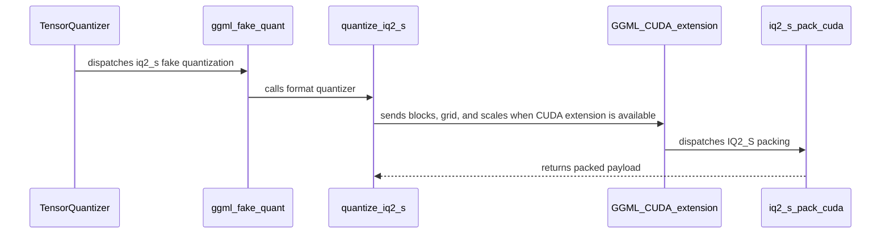

# [PR #2512] Add the IQ2_S weight-only quantization format

source: https://github.com/NVIDIA/Model-Optimizer/pull/2512
state: open | updated: 2026-09-22T23:21:32Z
labels: 

## 正文

### What does this PR do?

Type of change: new feature

Adds **IQ2_S** at 2.5625 bits per weight — the widest of the GGML IQ family at one and two bits. **Second of three**, stacked on #2511 (IQ2_XXS).

> **Review #2511 first.** This PR targets `main` but branches off `chenjiel/iq2-xxs-format`, so its diff will include #2511's commit until that merges.

On the mixed-precision checkpoint #2511 measured (`unsloth/Qwen3.8-27B-GGUF`), IQ2_S covers **9 tensors and 0.6 B parameters**.

### What's distinctive about it

**IQ2_S is the one format llama.cpp's own tooling gives no head start on**, so both the search and the kernel are written against the GGML layout directly.

The interesting difference from IQ2_XS and IQ2_XXS is sign handling: IQ2_S stores a **full 8-bit sign mask** per group rather than a 7-bit parity-coded index. So the encoder takes the input signs as they are, instead of flipping the weakest element to fix parity, and the search compares magnitudes directly — simpler than its siblings.

Its **1024-entry codebook is twice IQ2_XS's**, which makes it the most expensive search of the five and pushes the grid past the static shared-memory limit, so the kernel keeps the codebook and its norms in dynamic shared memory.

That cost is why the kernel matters more here than anywhere else:

| | torch | CUDA | |
|---|---|---|---|
| IQ2_S, 5632×2048 weight | 0.8 M elem/s | **725.7 M elem/s** | **907×** |
| extrapolated to a 27B model | ~9.8 hours | **~37 s** | |

Without the kernel this format would not be usable on the models these formats exist for.

### Usage

```bash
python examples/hf_ptq/hf_ptq.py --pyt_ckpt_path <model> --recipe general/ptq/iq2_s
```

### Testing

**The decoder is validated against llama.cpp's own output, not just round-tripped:**

```
IQ2_S: 9 tensors, 2,355,200 blocks → 0 mismatched, max|diff| 0.0
```

The new 1024-entry codebook matches the `ggml-common.h` table entry for entry. Blocks lifted from that checkpoint ship as conformance vectors so CI keeps checking bytes we did not produce.

The format joins the `IQ_FORMATS` registry and the shared parametrized test batteries introduced in #2511, so it inherits the whole contract rather than bringing its own set.

- `tests/unit/torch/quantization/ -k 'ggml or iq1 or iq2 or iq_'` — 131 passed
- `tests/gpu/torch/quantization/test_iq_formats_cuda.py` — 28 passed (7 checks × 4 formats)
- `tests/unit/recipe/test_presets.py` — passing; `general/ptq` now holds 30 recipes, `ptq.md` updated
- CUDA encoder byte-identical to the PyTorch reference on a fixed input

Pre-existing failures in `test_autoquant.py` are a `torchvision` circular import in my environment — **71 failed / 39 passed identically** with and without this change.

### Before your PR is "*Ready for review*"

- Is this change backward compatible?: ✅
- If you copied code from any other sources or added a new PIP dependency, did you follow guidance in `CONTRIBUTING.md`: ✅ — the new codebook is a GGML table, carried in `codebooks.py` with the source revision recorded. No new dependencies.
- Did you write any new necessary tests?: ✅
- Did you update Changelog?: ✅
- Did you get Claude approval on this PR?: ❌ — not yet run

### Additional Information

Second of three: #2511 (IQ2_XXS) → **this** → IQ1_M. Replaces #2505, which carried all three at once.

🤖 Generated with [Claude Code](https://claude.com/claude-code)


<!-- This is an auto-generated comment: release notes by coderabbit.ai -->

## Summary by CodeRabbit

* **New Features**
  * Added GGML-compatible IQ2_XXS and IQ2_S weight-only quantization, including CPU and CUDA packing, quantization, and dequantization.
  * Added PTQ recipes and presets for both formats. Calibration data is not required, and weights must use dimensions divisible by 256.
  * Expanded Hugging Face and Megatron export support to cover all four GGML IQ formats.
  * Updated the PTQ catalog with the new formats and their bit rates.

<!-- end of auto-generated comment: release notes by coderabbit.ai -->

## 评论 (3)

### coderabbitai[bot] · 2026-09-22

<!-- This is an auto-generated comment: summarize by coderabbit.ai -->
<!-- review_stack_entry_start -->

<a href="https://app.coderabbit.ai/change-stack/NVIDIA/Model-Optimizer/pull/2512"></a>

Navigate logical layers of code changes, visualize relationships, and explore their blast radius.

<!-- review_stack_entry_end -->
<!-- recent_review_start -->

No actionable comments were generated in the recent review. 🎉

<details>
<summary>ℹ️ Recent review info</summary>

<details>
<summary>⚙️ Run configuration</summary>

**Configuration used**: Repository: NVIDIA/Model-Optimizer/.coderabbit.yaml

**Review profile**: CHILL

**Plan**: Enterprise

**Run ID**: `cf415608-6e2c-4d91-8ab7-e5d0d931402a`

</details>

<details>
<summary>📥 Commits</summary>

Reviewing files that changed from the base of the PR and between 7159c01d9d909ca2431db6332363f07b2137ac09 and 6410b27cd22d7e7832171312416bc4393885b9b9.

</details>

<details>
<summary>📒 Files selected for processing (28)</summary>

* `CHANGELOG.rst`
* `modelopt/torch/export/quant_format.py`
* `modelopt/torch/export/quant_utils.py`
* `modelopt/torch/export/unified_export_hf.py`
* `modelopt/torch/export/unified_export_megatron.py`
* `modelopt/torch/kernels/quantization/ggml/common.cuh`
* `modelopt/torch/kernels/quantization/ggml/ggml.cpp`
* `modelopt/torch/kernels/quantization/ggml/iq2_s.cu`
* `modelopt/torch/kernels/quantization/ggml/iq2_xxs.cu`
* `modelopt/torch/quantization/extensions.py`
* `modelopt/torch/quantization/ggml/__init__.py`
* `modelopt/torch/quantization/ggml/backend.py`
* `modelopt/torch/quantization/ggml/codebooks.py`
* `modelopt/torch/quantization/ggml/iq2_s.py`
* `modelopt/torch/quantization/ggml/iq2_xxs.py`
* `modelopt_recipes/configs/numerics/iq2_s.yaml`
* `modelopt_recipes/configs/numerics/iq2_xxs.yaml`
* `modelopt_recipes/configs/ptq/presets/model/iq2_s.yaml`
* `modelopt_recipes/configs/ptq/presets/model/iq2_xxs.yaml`
* `modelopt_recipes/general/ptq/iq2_s.yaml`
* `modelopt_recipes/general/ptq/iq2_xxs.yaml`
* `modelopt_recipes/ptq.md`
* `tests/_test_utils/torch/quantization/iq_llama_cpp_vectors.py`
* `tests/examples/hf_ptq/test_llm_ptq.py`
* `tests/gpu/torch/quantization/test_iq_formats_cuda.py`
* `tests/unit/recipe/test_presets.py`
* `tests/unit/torch/quantization/test_ggml_backend.py`
* `tests/unit/torch/quantization/test_iq_formats.py`

</details>

**Included review availability:** Your plan provides up to 12 included reviews per hour; 9 remain after this review.

</details>

---


<!-- recent_review_end -->
<!-- walkthrough_start -->

<details>
<summary>📝 Walkthrough</summary>

## Walkthrough

The change adds IQ2_XXS and IQ2_S GGML quantization with Python and CUDA packers. It integrates both formats into fake quantization, Hugging Face and Megatron export, and PTQ recipes. Tests cover format conformance, CUDA parity, and recipe integration.

### Changes

**GGML IQ2 Format Support**

|Layer / File(s)|Summary|
|---|---|
|**IQ2 encoding and decoding** <br> `modelopt/torch/quantization/ggml/codebooks.py`, `modelopt/torch/quantization/ggml/iq2_s.py`, `modelopt/torch/quantization/ggml/iq2_xxs.py`, `modelopt/torch/quantization/ggml/__init__.py`|Adds IQ2_XXS and IQ2_S codebooks, quantizers, decoders, and fake-quantization adapters. The package exports the formats.|
|**CUDA packers** <br> `modelopt/torch/kernels/quantization/ggml/common.cuh`, `modelopt/torch/kernels/quantization/ggml/ggml.cpp`, `modelopt/torch/kernels/quantization/ggml/iq2_*.cu`, `modelopt/torch/quantization/extensions.py`|Adds CUDA packing kernels and bindings for both formats and includes the new sources in the GGML extension build.|
|**Backend and export integration** <br> `modelopt/torch/export/quant_format.py`, `modelopt/torch/export/quant_utils.py`, `modelopt/torch/export/unified_export_*.py`, `modelopt/torch/quantization/ggml/backend.py`|Recognizes all four IQ formats in format metadata, fake-quant dispatch, and Hugging Face and Megatron export paths.|
|**PTQ recipes and catalog** <br> `modelopt_recipes/configs/numerics/iq2_*.yaml`, `modelopt_recipes/configs/ptq/presets/model/iq2_*.yaml`, `modelopt_recipes/general/ptq/iq2_*.yaml`, `modelopt_recipes/ptq.md`, `CHANGELOG.rst`|Adds IQ2_XXS and IQ2_S PTQ configurations, presets, and recipes, and updates the catalog and changelog.|
|**Format conformance and integration tests** <br> `tests/_test_utils/torch/quantization/iq_llama_cpp_vectors.py`, `tests/unit/torch/quantization/test_iq_formats.py`, `tests/gpu/torch/quantization/test_iq_formats_cuda.py`, `tests/unit/recipe/test_presets.py`, `tests/examples/hf_ptq/test_llm_ptq.py`, `tests/unit/torch/quantization/test_ggml_backend.py`|Adds llama.cpp conformance vectors and tests for quantization, decoding, CUDA parity, PTQ recipes, and backend dispatch.|

<!-- change_assessment_start -->
**Priority:** ➖ Normal

**Estimated code review effort:** 4 (Complex) | ~60 minutes

<!-- change_assessment_commit:"6410b27cd22d7e7832171312416bc4393885b9b9" -->
**Change:** Feature
<!-- change_assessment_end -->

### Sequence Diagram(s)



</details>

<!-- walkthrough_end -->
<!-- final_review_risk_start -->
**Merge Risk:** _⚪ Minimal_ · up to `6410b`
<!-- final_review_risk_coverage:{"sourceCommitId":"6410b27cd22d7e7832171312416bc4393885b9b9","coveredCommitId":"6410b27cd22d7e7832171312416bc4393885b9b9","kind":"reviewed"} -->

No material merge risk remains in the supplied review context; the new formats are wired through export and have conformance and integration coverage.
<!-- final_review_risk_end -->
<!-- pre_merge_checks_walkthrough_start -->

<details>
<summary>🚥 Pre-merge checks | ✅ 5 | ❌ 1</summary>

### ❌ Failed checks (1 warning)

|     Check name     | Status     | Explanation                                                                                                                                                                                               | Resolution                                                                         |
| :----------------: | :--------- | :-------------------------------------------------------------------------------------------------------------------------------------------------------------------------------------------------------- | :--------------------------------------------------------------------------------- |
| Docstring Coverage | ⚠️ Warning | Docstring coverage is 64.47% which is insufficient. The required threshold is 80.00%. Docstring coverage is scoped to functions touched by this diff. Analyzed 76 functions across 19 files. (9 skipped:… | Write docstrings for the functions missing them to satisfy the coverage threshold. |

<details>
<summary>✅ Passed checks (5 passed)</summary>

|         Check name         | Status   | Explanation                                                                                                                                                                                               |
| :------------------------: | :------- | :-------------------------------------------------------------------------------------------------------------------------------------------------------------------------------------------------------- |
|      Description Check     | ✅ Passed | Check skipped - CodeRabbit’s high-level summary is enabled.                                                                                                                                               |
|         Title check        | ✅ Passed | The title clearly identifies IQ2_S weight-only quantization, the primary objective of the pull request. The changes also add IQ2_XXS support.                                                             |
|     Linked Issues check    | ✅ Passed | Check skipped because no linked issues were found for this pull request.                                                                                                                                  |
| Out of Scope Changes check | ✅ Passed | Check skipped because no linked issues were found for this pull request.                                                                                                                                  |
|   Security Anti-Patterns   | ✅ Passed | The reviewed diff adds no prohibited security patterns. The added Python lines contain no `torch.load(..., weights_only=False)`, `numpy.load(..., allow_pickle=True)`, hardcoded `trust_remote_code=True… |

</details>

<details>
<summary>Full details: Docstring Coverage</summary>

**Explanation**

Docstring coverage is 64.47% which is insufficient. The required threshold is 80.00%. Docstring coverage is scoped to functions touched by this diff. Analyzed 76 functions across 19 files. (9 skipped: 9 unsupported.)

</details>

</details>

<!-- pre_merge_checks_walkthrough_end -->

- [ ] <!-- {"checkboxId":"585bb3f6-faf5-4dbf-96d2-74e382adf19a"} --> Fix all pre-merge checks with AI
<!-- finishing_touch_checkbox_start -->

<details>
<summary>✨ Finishing Touches 💡 1</summary>

<!-- finishing_touch_suggestion:docstrings -->
<details open>
<summary>📝 Generate docstrings 💡</summary>

- [ ] <!-- {"checkboxId":"3e1879ae-f29b-4d0d-8e06-d12b7ba33d98"} --> Commit to this branch
- [ ] <!-- {"checkboxId":"7962f53c-55bc-4827-bfbf-6a18da830691"} --> Create a new PR

</details>
<details open>
<summary>🧪 Generate unit tests (beta)</summary>

- [ ] <!-- {"checkboxId": "6ba7b810-9dad-11d1-80b4-00c04fd430c8", "radioGroupId": "utg-output-choice-group-unknown_comment_id"} --> Commit to this branch
- [ ] <!-- {"checkboxId": "f47ac10b-58cc-4372-a567-0e02b2c3d479", "radioGroupId": "utg-output-choice-group-unknown_comment_id"} --> Create a new PR

</details>

</details>

<!-- finishing_touch_checkbox_end -->
<!-- tips_start -->

---


<sub>Comment `@coderabbitai help` to get the list of available commands.</sub>

<!-- tips_end -->

### github-actions[bot] · 2026-09-22

[PR Preview Action](https://github.com/rossjrw/pr-preview-action) v1.8.1
:---:
| <p></p> :rocket: View preview at <br> https://NVIDIA.github.io/Model-Optimizer/pr-preview/pr-2512/ <br><br>
| <h6>Built to branch [`gh-pages`](https://github.com/NVIDIA/Model-Optimizer/tree/gh-pages) at 2026-09-22 22:17 UTC. <br> Preview will be ready when the [GitHub Pages deployment](https://github.com/NVIDIA/Model-Optimizer/deployments) is complete. <br><br> </h6>
<!-- Sticky Pull Request Commentpr-preview -->

### codecov[bot] · 2026-09-22

## [Codecov](https://app.codecov.io/gh/NVIDIA/Model-Optimizer/pull/2512?dropdown=coverage&src=pr&el=h1&utm_medium=referral&utm_source=github&utm_content=comment&utm_campaign=pr+comments&utm_term=NVIDIA) Report
:white_check_mark: All modified and coverable lines are covered by tests.
:white_check_mark: Project coverage is 78.48%. Comparing base ([`1b4e7df`](https://app.codecov.io/gh/NVIDIA/Model-Optimizer/commit/1b4e7dfb146fe4450d206ebfd430d66ddd4b3536?dropdown=coverage&el=desc&utm_medium=referral&utm_source=github&utm_content=comment&utm_campaign=pr+comments&utm_term=NVIDIA)) to head ([`6410b27`](https://app.codecov.io/gh/NVIDIA/Model-Optimizer/commit/6410b27cd22d7e7832171312416bc4393885b9b9?dropdown=coverage&el=desc&utm_medium=referral&utm_source=github&utm_content=comment&utm_campaign=pr+comments&utm_term=NVIDIA)).
:warning: Report is 1 commits behind head on main.

<details><summary>Additional details and impacted files</summary>


```diff
@@            Coverage Diff             @@
##             main    #2512      +/-   ##
==========================================
+ Coverage   71.20%   78.48%   +7.27%     
==========================================
  Files         603      605       +2     
  Lines       66796    67061     +265     
==========================================
+ Hits        47564    52634    +5070     
+ Misses      19232    14427    -4805     
```

| [Flag](https://app.codecov.io/gh/NVIDIA/Model-Optimizer/pull/2512/flags?src=pr&el=flags&utm_medium=referral&utm_source=github&utm_content=comment&utm_campaign=pr+comments&utm_term=NVIDIA) | Coverage Δ | |
|---|---|---|
| [examples-diffusers](https://app.codecov.io/gh/NVIDIA/Model-Optimizer/pull/2512/flags?src=pr&el=flag&utm_medium=referral&utm_source=github&utm_content=comment&utm_campaign=pr+comments&utm_term=NVIDIA) | `21.43% <28.23%> (+0.03%)` | :arrow_up: |
| [examples-gpt-oss](https://app.codecov.io/gh/NVIDIA/Model-Optimizer/pull/2512/flags?src=pr&el=flag&utm_medium=referral&utm_source=github&utm_content=comment&utm_campaign=pr+comments&utm_term=NVIDIA) | `13.53% <27.21%> (+0.06%)` | :arrow_up: |
| [examples-hf_ptq](https://app.codecov.io/gh/NVIDIA/Model-Optimizer/pull/2512/flags?src=pr&el=flag&utm_medium=referral&utm_source=github&utm_content=comment&utm_campaign=pr+comments&utm_term=NVIDIA) | `23.03% <65.98%> (+0.42%)` | :arrow_up: |
| [examples-llm_distill](https://app.codecov.io/gh/NVIDIA/Model-Optimizer/pull/2512/flags?src=pr&el=flag&utm_medium=referral&utm_source=github&utm_content=comment&utm_campaign=pr+comments&utm_term=NVIDIA) | `13.59% <27.21%> (+0.06%)` | :arrow_up: |
| [examples-llm_eval](https://app.codecov.io/gh/NVIDIA/Model-Optimizer/pull/2512/flags?src=pr&el=flag&utm_medium=referral&utm_source=github&utm_content=comment&utm_campaign=pr+comments&utm_term=NVIDIA) | `17.50% <28.23%> (+0.05%)` | :arrow_up: |
| [examples-llm_qat](https://app.codecov.io/gh/NVIDIA/Model-Optimizer/pull/2512/flags?src=pr&el=flag&utm_medium=referral&utm_source=github&utm_content=comment&utm_campaign=pr+comments&utm_term=NVIDIA) | `17.78% <28.23%> (+0.04%)` | :arrow_up: |
| [examples-llm_sparsity](https://app.codecov.io/gh/NVIDIA/Model-Optimizer/pull/2512/flags?src=pr&el=flag&utm_medium=referral&utm_source=github&utm_content=comment&utm_campaign=pr+comments&utm_term=NVIDIA) | `16.02% <27.21%> (+0.05%)` | :arrow_up: |
| [examples-megatron_bridge](https://app.codecov.io/gh/NVIDIA/Model-Optimizer/pull/2512/flags?src=pr&el=flag&utm_medium=referral&utm_source=github&utm_content=comment&utm_campaign=pr+comments&utm_term=NVIDIA) | `26.17% <29.93%> (-0.11%)` | :arrow_down: |
| [examples-specdec_bench](https://app.codecov.io/gh/NVIDIA/Model-Optimizer/pull/2512/flags?src=pr&el=flag&utm_medium=referral&utm_source=github&utm_content=comment&utm_campaign=pr+comments&utm_term=NVIDIA) | `13.29% <27.21%> (+0.06%)` | :arrow_up: |
| [examples-speculative_decoding](https://app.codecov.io/gh/NVIDIA/Model-Optimizer/pull/2512/flags?src=pr&el=flag&utm_medium=referral&utm_source=github&utm_content=comment&utm_campaign=pr+comments&utm_term=NVIDIA) | `17.85% <28.23%> (-0.02%)` | :arrow_down: |
| [examples-torch_onnx](https://app.codecov.io/gh/NVIDIA/Model-Optimizer/pull/2512/flags?src=pr&el=flag&utm_medium=referral&utm_source=github&utm_content=comment&utm_campaign=pr+comments&utm_term=NVIDIA) | `21.96% <27.21%> (+0.03%)` | :arrow_up: |
| [examples-torch_trt](https://app.codecov.io/gh/NVIDIA/Model-Optimizer/pull/2512/flags?src=pr&el=flag&utm_medium=referral&utm_source=github&utm_content=comment&utm_campaign=pr+comments&utm_term=NVIDIA) | `15.36% <27.21%> (+0.05%)` | :arrow_up: |
| [examples-vllm_serve](https://app.codecov.io/gh/NVIDIA/Model-Optimizer/pull/2512/flags?src=pr&el=flag&utm_medium=referral&utm_source=github&utm_content=comment&utm_campaign=pr+comments&utm_term=NVIDIA) | `13.93% <27.21%> (+0.06%)` | :arrow_up: |
| [gpu](https://app.codecov.io/gh/NVIDIA/Model-Optimizer/pull/2512/flags?src=pr&el=flag&utm_medium=referral&utm_source=github&utm_content=comment&utm_campaign=pr+comments&utm_term=NVIDIA) | `58.98% <97.61%> (+25.67%)` | :arrow_up: |
| [regression](https://app.codecov.io/gh/NVIDIA/Model-Optimizer/pull/2512/flags?src=pr&el=flag&utm_medium=referral&utm_source=github&utm_content=comment&utm_campaign=pr+comments&utm_term=NVIDIA) | `15.18% <27.21%> (+0.10%)` | :arrow_up: |
| [unit](https://app.codecov.io/gh/NVIDIA/Model-Optimizer/pull/2512/flags?src=pr&el=flag&utm_medium=referral&utm_source=github&utm_content=comment&utm_campaign=pr+comments&utm_term=NVIDIA) | `58.44% <93.19%> (+0.16%)` | :arrow_up: |

Flags with carried forward coverage won't be shown. [Click here](https://docs.codecov.io/docs/carryforward-flags?utm_medium=referral&utm_source=github&utm_content=comment&utm_campaign=pr+comments&utm_term=NVIDIA#carryforward-flags-in-the-pull-request-comment) to find out more.
</details>

[:umbrella: View full report in Codecov by Harness](https://app.codecov.io/gh/NVIDIA/Model-Optimizer/pull/2512?dropdown=coverage&src=pr&el=continue&utm_medium=referral&utm_source=github&utm_content=comment&utm_campaign=pr+comments&utm_term=NVIDIA).   
:loudspeaker: Have feedback on the report? [Share it here](https://about.codecov.io/codecov-pr-comment-feedback/?utm_medium=referral&utm_source=github&utm_content=comment&utm_campaign=pr+comments&utm_term=NVIDIA).
<details><summary> :rocket: New features to boost your workflow: </summary>

- :snowflake: [Test Analytics](https://docs.codecov.com/docs/test-analytics): Detect flaky tests, report on failures, and find test suite problems.
</details>

## Review (1)

### coderabbitai[bot] · 2026-09-22 · APPROVED

(no text)
