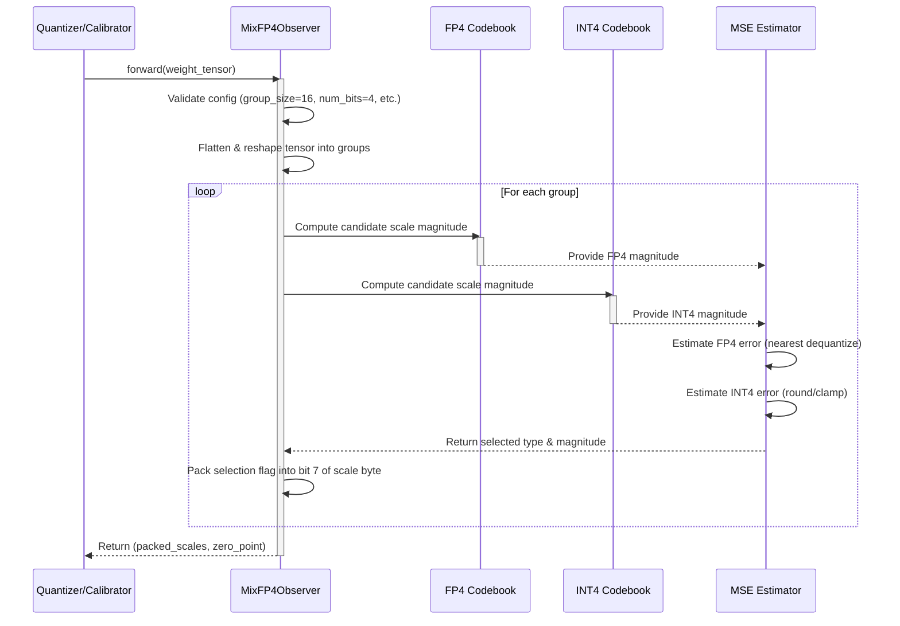

# [PR #2657] Add MixFP4A16 quantization recipe support

source: https://github.com/vllm-project/llm-compressor/pull/2657
state: open | updated: 2026-09-24T20:21:14Z
labels: enhancement, fp8, Refactor, two-reviews

## 正文

# Add MixFP4A16 quantization recipe support

SUMMARY:

Add llm-compressor support for generating MixFP4A16 checkpoints with the same recipe style as NVFP4A16. MixFP4 is an extension of NVFP4: for each 16-weight group, it compares the reconstruction MSE and chooses whether the elements in that group use the NVFP4 FP4 codebook or the INT4 (E1M2) codebook.

The user-facing recipe remains:

```python
recipe = QuantizationModifier(targets="Linear", scheme="MixFP4A16", ignore=["lm_head"])
```

## Usage

Python recipe usage mirrors the existing NVFP4A16 flow, with only the scheme name changed to `MixFP4A16`:

```python
from transformers import AutoModelForCausalLM

from llmcompressor import oneshot
from llmcompressor.modifiers.quantization import QuantizationModifier

model = AutoModelForCausalLM.from_pretrained(MODEL_ID, dtype="auto")
recipe = QuantizationModifier(
    targets="Linear",
    scheme="MixFP4A16",
    ignore=["lm_head"],
)

oneshot(model=model, recipe=recipe, output_dir=OUTPUT_DIR)
```

YAML form:

```yaml
quant_stage:
  quant_modifiers:
    QuantizationModifier:
      targets: ["Linear"]
      scheme: "MixFP4A16"
      ignore: ["lm_head"]
```

The emitted compressed-tensors config uses `format: mixfp4-pack-quantized` and `observer: mixfp4`. Quantized weights are saved as `weight_packed`, `weight_scale`, and `weight_global_scale`; no separate selector metadata is saved.

## Implementation

- Add `MixFP4A16` scheme registration for `QuantizationModifier`.
- Reuse the NVFP4-style W4A16 quantization path except for the MixFP4 observer/format marker.
- Keep the selector inside the FP8 scale sign bit; no side tensor or extra metadata is introduced.
- Preserve `lm_head` ignore behavior from the user recipe.

## Cross-project workflow

MixFP4 is intended to be used across the compressed-tensors -> llm-compressor -> vLLM stack:

1. `compressed-tensors` defines the canonical `mixfp4-pack-quantized` format, the `MIXFP4A16` preset, and pack/unpack/fake-quant behavior.
2. `llm-compressor` exposes the user-facing quantization recipe: `QuantizationModifier(targets="Linear", scheme="MixFP4A16", ignore=["lm_head"])`.
3. `vLLM` loads the resulting compressed-tensors checkpoint and routes `mixfp4-pack-quantized` W4A16 layers to the MixFP4 Marlin path.

Related PRs:

- compressed-tensors: https://github.com/vllm-project/compressed-tensors/pull/687
- llm-compressor: https://github.com/vllm-project/llm-compressor/pull/2657
- vLLM: https://github.com/vllm-project/vllm/pull/41004

## Shared validation summary

Storage contract:

- Persisted tensors: `weight_packed`, `weight_scale`, `weight_global_scale`.
- `weight_packed` stores 4 bits/element.
- `weight_scale` remains `torch.float8_e4m3fn`, one scale byte per 16 weights; bit 7 stores the FP4/INT4 selector.
- No extra selector tensor or side metadata is emitted.

Accuracy / quality uses lm-eval + vLLM. Math/reasoning uses Qwen math prompts with chat template and math system instruction. MMLU uses lm-eval default `mmlu`, 5-shot, no chat template. WikiText uses lm-eval default `wikitext`; lower PPL is better.

| Model | Quant | GSM8K | MATH500 strict | AIME25 | MMLU | WikiText word PPL |
|---|---|---:|---:|---:|---:|---:|
| Qwen3-8B | BF16 | 93.71% | 76.20% | 70.00% | 74.93% | 13.4838 |
| Qwen3-8B | NVFP4 | 91.58% | 72.00% | 56.67% | 73.55% | 13.7782 |
| Qwen3-8B | MixFP4 | 93.40% | 76.20% | 56.67% | 73.88% | 13.5464 |
| Qwen3-14B | BF16 | 95.07% | 78.80% | 66.67% | 78.82% | 11.6597 |
| Qwen3-14B | NVFP4 | 95.38% | 79.20% | 70.00% | 78.08% | 11.9641 |
| Qwen3-14B | MixFP4 | 94.77% | 76.20% | 66.67% | 78.14% | 11.8100 |

Quality claim: MixFP4 is close to BF16 and improves over NVFP4 on Qwen3-8B for GSM8K, MATH500, MMLU, and WikiText PPL, while tying NVFP4 on AIME25 in the post-fix rerun. On Qwen3-14B, MixFP4 improves WikiText PPL over NVFP4 and is effectively tied on MMLU, while math/reasoning is mixed. AIME25 has only 30 examples, so small-sample deltas should not be overinterpreted.

Latest-vLLM E2E performance on Qwen3-8B with H100 80GB, CUDA 12.8, Torch 2.11, and FA3 enabled:

| Shape | Quant | Wall median ms | Total tok/s median | Decode tok/s median |
|---|---|---:|---:|---:|
| prefill-heavy in=1024 out=32 bs=1 | BF16 | 233.48 | 4522.9 | 148.4 |
| prefill-heavy in=1024 out=32 bs=1 | NVFP4 | 176.25 | 5991.5 | 244.4 |
| prefill-heavy in=1024 out=32 bs=1 | MixFP4 | 187.25 | 5639.6 | 230.1 |
| decode-heavy in=32 out=512 bs=1 | BF16 | 3402.27 | 159.9 | 150.6 |
| decode-heavy in=32 out=512 bs=1 | NVFP4 | 2073.25 | 262.4 | 247.4 |
| decode-heavy in=32 out=512 bs=1 | MixFP4 | 2182.98 | 249.2 | 235.0 |
| batched in=512 out=128 bs=8 | BF16 | 982.90 | 5209.1 | 1141.7 |
| batched in=512 out=128 bs=8 | NVFP4 | 736.97 | 6947.3 | 1837.8 |
| batched in=512 out=128 bs=8 | MixFP4 | 782.96 | 6539.3 | 1751.0 |

MixFP4 is about 5-6% slower than the existing NVFP4 Marlin path in these Qwen3-8B shapes, while remaining substantially faster than BF16 in decode-heavy and batched cases.

TEST PLAN:

- Run focused MixFP4A16 recipe tests.
- Quantize Qwen3-8B and Qwen3-14B with `QuantizationModifier(targets="Linear", scheme="MixFP4A16", ignore=["lm_head"])`.
- Verify emitted checkpoint metadata: `format: mixfp4-pack-quantized`, `observer: mixfp4`, and `quantization_status: compressed`.
- Verify stored tensors use `weight_packed`, `weight_scale`, and `weight_global_scale` with no extra selector metadata.
- Run downstream lm-eval accuracy/PPL and vLLM E2E performance validation.

TEST RESULT:

- Qwen3-8B and Qwen3-14B MixFP4A16 quantization jobs completed successfully.
- Both generated checkpoints have `format: mixfp4-pack-quantized` and `quantization_status: compressed`.
- Downstream accuracy/PPL and E2E performance results are listed above.

## Dependency / follow-up

This PR depends on compressed-tensors containing the `MIXFP4A16` preset and `mixfp4-pack-quantized` format. The compressed-tensors PR should merge/release first, or llm-compressor should bump to a compressed-tensors version containing those definitions.


## 评论 (6)

### github-actions[bot] · 2026-04-27

👋 Hi! Thank you for contributing to llm-compressor. Please add the ready label when the PR is ready for review.

**Note:** This is required to complete the testing suite, please only add the label once the PR is code complete and local testing has been performed.

### coderabbitai[bot] · 2026-04-27

<!-- This is an auto-generated comment: summarize by coderabbit.ai -->
<!-- walkthrough_start -->

## Walkthrough

Introduces `MixFP4Observer` for selecting between FP4 E2M1 and signed INT4 codebooks during per-tensor-group quantization calibration. The observer validates configuration constraints, computes per-group MSE estimates via fake quantization, and packs the selection flag into the scale byte. Includes module re-export and comprehensive unit tests.

## Changes

|Cohort / File(s)|Summary|
|---|---|
|**Core Implementation** <br> `src/llmcompressor/observers/__init__.py`, `src/llmcompressor/observers/codebook.py`|New `MixFP4Observer` class implementing per-tensor-group FP4/INT4 codebook selection with scale byte packing; module re-export added to public API.|
|**Quantization Tests** <br> `tests/llmcompressor/modifiers/quantization/test_mixfp4_scheme.py`, `tests/llmcompressor/observers/test_mixfp4.py`|Unit tests validating `MixFP4Observer` registry loading, configuration validation, bit-level scale encoding, and integration with fake quantization.|

## Sequence Diagram



## Estimated code review effort

🎯 4 (Complex) | ⏱️ ~60 minutes

## Suggested labels

`enhancement`, `fp8`, `two-reviews`, `refactor`

## Suggested reviewers

- brian-dellabetta

<!-- walkthrough_end -->


<!-- pre_merge_checks_walkthrough_start -->

<details>
<summary>🚥 Pre-merge checks | ✅ 4 | ❌ 1</summary>

### ❌ Failed checks (1 warning)

|     Check name     | Status     | Explanation                                                                          | Resolution                                                                         |
| :----------------: | :--------- | :----------------------------------------------------------------------------------- | :--------------------------------------------------------------------------------- |
| Docstring Coverage | ⚠️ Warning | Docstring coverage is 0.00% which is insufficient. The required threshold is 80.00%. | Write docstrings for the functions missing them to satisfy the coverage threshold. |

<details>
<summary>✅ Passed checks (4 passed)</summary>

|         Check name         | Status   | Explanation                                                                                                                                              |
| :------------------------: | :------- | :------------------------------------------------------------------------------------------------------------------------------------------------------- |
|         Title check        | ✅ Passed | The title clearly and concisely summarizes the main change: adding MixFP4A16 quantization recipe support, which matches the primary focus of the PR.     |
|     Linked Issues check    | ✅ Passed | Check skipped because no linked issues were found for this pull request.                                                                                 |
| Out of Scope Changes check | ✅ Passed | Check skipped because no linked issues were found for this pull request.                                                                                 |
|      Description check     | ✅ Passed | The PR description clearly relates to the changeset, detailing MixFP4A16 quantization recipe support with implementation, usage, and validation details. |

</details>

<sub>✏️ Tip: You can configure your own custom pre-merge checks in the settings.</sub>

</details>

<!-- pre_merge_checks_walkthrough_end -->

<!-- finishing_touch_checkbox_start -->

<details>
<summary>✨ Finishing Touches</summary>

<details>
<summary>🧪 Generate unit tests (beta)</summary>

- [ ] <!-- {"checkboxId": "f47ac10b-58cc-4372-a567-0e02b2c3d479", "radioGroupId": "utg-output-choice-group-unknown_comment_id"} -->   Create PR with unit tests

</details>

</details>

<!-- finishing_touch_checkbox_end -->

<!-- tips_start -->

---

Thanks for using [CodeRabbit](https://coderabbit.ai?utm_source=oss&utm_medium=github&utm_campaign=vllm-project/llm-compressor&utm_content=2657)! It's free for OSS, and your support helps us grow. If you like it, consider giving us a shout-out.

<details>
<summary>❤️ Share</summary>

- [X](https://twitter.com/intent/tweet?text=I%20just%20used%20%40coderabbitai%20for%20my%20code%20review%2C%20and%20it%27s%20fantastic%21%20It%27s%20free%20for%20OSS%20and%20offers%20a%20free%20trial%20for%20the%20proprietary%20code.%20Check%20it%20out%3A&url=https%3A//coderabbit.ai)
- [Mastodon](https://mastodon.social/share?text=I%20just%20used%20%40coderabbitai%20for%20my%20code%20review%2C%20and%20it%27s%20fantastic%21%20It%27s%20free%20for%20OSS%20and%20offers%20a%20free%20trial%20for%20the%20proprietary%20code.%20Check%20it%20out%3A%20https%3A%2F%2Fcoderabbit.ai)
- [Reddit](https://www.reddit.com/submit?title=Great%20tool%20for%20code%20review%20-%20CodeRabbit&text=I%20just%20used%20CodeRabbit%20for%20my%20code%20review%2C%20and%20it%27s%20fantastic%21%20It%27s%20free%20for%20OSS%20and%20offers%20a%20free%20trial%20for%20proprietary%20code.%20Check%20it%20out%3A%20https%3A//coderabbit.ai)
- [LinkedIn](https://www.linkedin.com/sharing/share-offsite/?url=https%3A%2F%2Fcoderabbit.ai&mini=true&title=Great%20tool%20for%20code%20review%20-%20CodeRabbit&summary=I%20just%20used%20CodeRabbit%20for%20my%20code%20review%2C%20and%20it%27s%20fantastic%21%20It%27s%20free%20for%20OSS%20and%20offers%20a%20free%20trial%20for%20proprietary%20code)

</details>

<sub>Comment `@coderabbitai help` to get the list of available commands and usage tips.</sub>

<!-- tips_end -->

<!-- internal state start -->


<!-- DwQgtGAEAqAWCWBnSTIEMB26CuAXA9mAOYCmGJATmriQCaQDG+Ats2bgFyQAOFk+AIwBWJBrngA3EsgEBPRvlqU0AgfFwA6NPEgQAfACgjoCEYDEZyAAUASpETZWaCrKPR1AGxJcAgrXoAsvAAHgBiVgAsPgCMAGyQAI7YmOIAXtTw+FgUovDcJPbY3Nz4FLiQABS2kGYATLEArADsADSQ2IiUXDkS+B79HrhtAlQYDLBcAGYk1Ng5APTMIZPcEWBMzLzSiKWQgEmEkMzaGACUbgjI1Wj+yP3M6yxbiDt8DsWl5ZO7aJBBYZExeJJFLwdLiLKQHIMPIFJYUCileAYIiQXCwAokYJIcTIyAAOQAauEonFIJMPPgAO4aSAAVU6FGQDEw9ny0Mm8gAiskMGkMlkAop4JN4JQKrhnKRcIgALwAIgAMkiZhQ5W1EOMSGx5X9iYC1SgiBhSiQZQBtOUeZgAfXR1zlAF0TigsFZZGiIbsSElJGgvLzIABNHwBBUAbn45EQsHw5Up8H6kC16gUmxyzzoYBoGBeyHjaLJpSOnEOy1WYG4aAYAGswMDeaC6OgMPRBAypBQuEtgisIjSrJRENim9nc+gcpBKSR4ERYLhrZWa3Q2lOZ3PrRq/SQ2ph6KvZ/OiBSBH6N8yvBH9+vN15IVrjsgCBRxhpyfhqAAOa0kCLMADMkxYPmsCQGo5RNEmYxCriaIFPkFDEAiRSQMS8wAJJ4tAET2CQXhiLsFTGjhlZUDQOF4U+qJkC8/CvPASiHCQEq0NQaAnDSaGbF4bC8vyWDXLQyA/EwSgCPg+C1p0FGZFgbaUB2d5EMOOT0GgyDdr2lTViQJDcOpIR0NavbWkiuDYWp6CQF4RBVvIfrwGpzpotQjAxvgnTIMSkAAKK1AE0S0fYM7kPQGFYTwlBUTmuxEEh3CgfIAQAMreRGsHkaIND0CJJBiRJKDIGQOX0EioEphB+CTKi6IoVYH4RQhsX4MhN4FHINA0jYuT5GAXhSB4CgdmgpCQB2wqisgGromwd47B4eAyc2JVGiaoEkLAaASJkfBfHwVq2jMtA0klG0qaN9kseCWBIgw81KJNT7DQUTC8lQYhUYg0o7gwDBzLZ8zAh46jyAIRWwEcFDVsgFRWmAJASH6kAANSjQqCoBM6VYIs8kCclOGB/ocii4YgO4tqj6M+bU3kNbtRxjM9jzOEgWSIDS0DSNKXDYBgKY0J90PRITlYZrQmPk1CML2MwEmMxgIoUEsuJ09Q8xyRQHZtPBQ6fSO1GlKTGX4XwRXQUQZPLcaZ37XaR2QAAIrpZBKGMsjdN62DwOmqZPJ0tBZvrjKovgPAIltDEBGhAAaeqkk8TFLaWPbloutb1mkTYq+UFQbL7majgb1h2MwHTlGwFCkPMOReGpBQK59gUCI48VKPkLZFbI7HmJYADCLBLGX2xPZNjgQ64BhQH4gQhF56sdlwpkIrQ2AMNI1UFHPkXwFxWrsEiKK6pECiieJ1ZG1dGgT5AU+/DPAKkunoJ8Xe0L5B9JYCcgks9X1uHv0y+Axq4imrvWafQFoQl3A1HWWUoq5kvlAQUUhb7/GwpvPgBBj65VPvwAQ7ZBzu0mFWJ8yB0E8A8FWXeAZTIh3SjlPKZ90HqUUNgLwl8J5gEMAYEwUBnb8CqmgPAhBSDkFIk2DYPESy8FwSIMQkg15yCwVQVQ6gtA6H0Nw8AUA4CoFQCyQRBBiBkGULAiR7BuhoEpIUJwLgEpKJUGBNRuhOFGE0aYAwiBnzzDuLndMLw1Z4PkoOeY1oTK83nNaDQ3A3YGDlHEgwFhr5oSMaI6gTYHA2PkJVVymBSCIAMHAOCVZqxPUAJgEyAAAGTCKlE2XreY0ViBLqBkn6Dw8gchw2CCUMoyBuDYAEEDBgKAaDMGQJMBEzBIAVI0PMehp8amKO3t0nEKJ4aUHdAgXEwEpnjJYJADQcz8pLI+JAAAVNM/EIdYzoj2vgJSDA2gvVwAiAab5KRtC9FiT6+8kxdI+HmSgsIhQijoOw7u19BgmJko+WhNUlC3WcHxUhVVMTLKbLsPpAz4BDL3uIaQV9BR1IKB01FJyBJ0C4BUzxDBvFWl8dsUoAT8GMhCWE9QoSomyBqQ035yyhKJkxYMyC4g8VjImVM6ltLmD0ueIyphsziYMM5TUioW0fgVN2ZMg5iqcHHLKGcipXcDBKijDk5EFLkbRHmGAAADEYby3ziziOJneLaJArEkEmLtEsCoqSxPiRwsARhJU+MeH4uVgSNbBMOdWTlHB/VygSZYHwySREmPSaPZwWSqrjFyfigwPhIDkCsRUw+EQADykaOw1L0f4EcId4J0wagHaKjU4pYIYefRaoNcBTjILVbCvl/KJyHEaJsYVsLLwoD8x+YJFrnngCMPi7MapkIRkDS6a9nLlBTKgDomddhXiGHA0oiFmrxVnc/bZFSmpFA3I2GUcQKltAqRgRw1owKygiM+skFIMjIgrPgUykA1hgXVLIVgTFp1DJlkoC2Oy/24C/D+f8gEamtTZg7OYPyNWlEpM4WgFQTg/pTOSago5164PwfQAuO1dgLqXVdR5jw8Br3gme5CzIWz0TSfYc8sJhrhOwPdQsfAvJQInW0WCWBObbzSb0ygHH4rJRpooocJcKErLJGgbSiQeR8iulwLylAER8FQLnVj9A1VFpVJzB4J98pKEvVdSoN07o/NHacFcCBbwTqTPCXY5mWOwOs0hbjyJZkUM2D8zB6VPPjswthUYpAOLlHGOJDykA/OUnRNdaUSZHVpPoCZwLtwqSUHVLhTKj4apMHhNIEo4WURHCNOoYT25E6pxq89GMnQsBkZRDQsq4F+GUfCPVdjt74qtQSmRCoOWEwFG0rpH5LWhMidKulHIRwkQ/M/ScNoORcBzF5sA/jQlyapEoIQEowHaNs1cUmiFNBSLQuDpR+FFDXus1G6Sso6K+CCuxcK5p+bJ51uK38/79BEAQbEh4SlZbK3MprVgKlXjQ1pgZRQJlQSWUxuVZUHISldZnQshUuUGlVhyhqds+y5PKcGVoEZVYYSzI04Oy6W6wmfnqF6f0oVbAPSCSmVKa0StxdoGCERn9N6mLWiPIIU8EujjS+I/B3DFB8MUEI8R9hiSAiYGFJzFCi3r4YD9LIK7FAjAmrXrm81tAuBIyFh+a1dqDAOvEE67KLqeiig9V6j4XAAASa4E1GAgEGgw/NpRSplf42D41gnOZkvMWP4uywRDPNNEgcaI+JJTSk9NMPM22OyQ7vJBg0KvRYavISNmrE8z5ibsaHIYsbXKOq7kII50CmBaKCgNSXoiiIHMJs16JQVyYrKRUypnA08TlSzU2o5Rlv1DU9MfQpAwsskOZEt4uNZGxYjVPEIR8zkgFNldBRY/oAzD0yjW+PBSBhyv2/koZ9tDP/1osLkKgU5U5rCpx1j6aNi0Ac4rjTgHg5JvQvbYjYrQygakaIZSaBxKb2DPJpJECyBtBTZBRXaQBxDgaQbPLYrzDGgYBgC0CyAW5LAMCc5kIAGM7JwRCQEjpsjjRDKtTzDW43ZAYBi0C4CyD5DQwVJPgvhvifjfi/gAQYCGqpboAeA7CuSiBQzVQuRbbSDb7Orywzh/QubxxRrdahyAL0RNjBSrRAwNwAEWg2yHSOgKGPaF6QrfY5jvbpSfaIpXTIq8ofAA48AC7A64oTRXx4ghx/ZZTzBA44oNjCGQBeFuFMgbSO766WCG68zTANyhBm4+AW5tLW627KjJF5pO7Iy1Bu62r2qFamJ+7wwB5JhB5lBcABB0DwCOAR6BpGCx6IDx5hrY645RosoZ5AH55xKJqF6prGJiKl6ZKjaV74o17PJ15rw/BKC0An6wLRJ34ODqB1y7Clp3wVpVqUALLrSbTbQ37/yjSUDCjyDbqUaAFZ6L7E7Yi2LsC2J/oi6YLqpI4nFD6JwPHpTWS2RTIsGGTGSmRsE1L05fzaEv5bqwoFCIBoAzRkLCH5CKFqQMj5YPHnhAwwSrr/GTjqAxh4BTJHoK7HinitSb7aCZbqoEh+jYAkDeQBYAmSIyQ/KAA4BIrieANK1IALgEih66PG/Mw2vUayA0psGxuIamTEWmnGWQyx/QTYyB5Q66LJV+cUhsFAPMp2KI6U6JVyAgEopUFSFQrUbQfBC4AhuA6ujAakWmy+W4NSmCFSnsvIH4P6UCmoNYHemhNUnmw2BUOEnwuw6UaAxQCIvADkZE+BUCPMnQ4ZGCq6sEFAWJyhIcfp6hDx+i/QYAfBk40Bc4phy89elkqc6S/Gs2G8VUFSNqbpIcm0QG9A5ANk4gUghZ12kEIk+8NIU8zSWQiMJEqJUG4B1x1E4+RaWQ6wmAx+54UyPeDYfeGAPgFciAw+LAagFuPh44xKJAsisC2yiAnBIoOK7JjEzww8lQn0YiOB8wU296V2FB76n66eIhJA8wsOpB0G35/G1oQhn57EKEcw6Z1xOQR57Q++hpRJzKomM5VBR6oEtc0MeeRAGgL6coSIfSuAHONIOR+RbSbQKYF+isNWLk6CFYS8K8TYFpVpkANpt2vIxGShFIJaRC2k1os6JATZd4vAKxlGiISk+RCgOYzyK8x5JZ+WmIxCbSk4uW0FHeG8/x1FZh6xV+1JAp/GYKT2PgrhSKHhcKogX2hl2SkRARMRIOoqYRERUOURVluK8giRhlSeIKtAaUFwZqI0WQ8ln8lkxa78ZIi27CduJRjuzu0QEQEQ7u1R3uRWWCrqDRnq3qLRbRHR4xkeLibivC5M2SBiwi0xCVZivIFiViGSY8diOUyiji2gzihgPCqYA8Jkgk1o/u7qhkn0zg5QGiOVRBkwAgRCtQTQAgQsf4f4I1EQAAnAwH+LEF6uNQwNELQAwDahNQ0NEAwLEJ6tEJMELPVcYFok1eyvRIgG1fUR1cznwhoo1VsOLpQKQNaDmWdV1fqr1QAN4GCQCQDYWIC2AABCFIS4tAfckGvIVg7kWUcoUwfonQLQX1P1SA5aHY06daGA0N2myh24CNcotA+ADAd5+8fcQ0pASxlA+RSUEoNAGNn13131coPRfRWOsqOOblg+vRP+6enMmerBOeu8nKNNCNdNP1BAEoHgoQPMcirMGN0Q8Nwt9NkwktPhAA6qSfbPjYTciIgBjXasLQAL5y101yghp0r9Es2DEdi9EE7RKC3y0i2xh+gS1jA+Ey2y1C1G2K3O3Qqq1ojq0E1kFa063u160I0G0405Q2AOLqDK0Ig0BWAUDuC4BeAY1EJY2G2WhOk9zog1hdQOCDDa1cBmju203y1yg5l4hjkY1yiJ2H7Z3Vhqju301dXHYF2oh6nY121yiooUK7kyRV2FKoieDPQ1wUB+XkwvTQhSTyAVXMxXYmE7ZYALFcBNK4jr4PxgGrkvxSxvDLLebYogTFiagmGxmVVfC/S+HpS2AaAN2d2wYkBV3a4Gk32l1QhZCj7j4p2w0d2l3CVIh+hZ1qEV1sBV0irJ3B2G3fUl3C1l111AP31cByh+2a0ojE3KCkDP3QPN0dCf1p2N0/Xd2YB8RV1IMB0ohMAk0FCoA2oaA2o2oACkCl+9oZSIDgXq2KoovIVxOQPoZ0aI6YMYHgJUyAH41DtDdD19EDRtz+EC6NCDMdexCRGtpDYyEZNUntUt7hSwzwylkymCKJ4giAHIlG5DaDt+sA/DfQR0GDRtd9D9zgT9kj9Nv9+RADNYcDVdeN/t06gd4DxdeDMDgDldCDJq2koUzwLJyRah1jTdVN2DXAEl390DBDvdWQVdrjZ8iA1YeQ+Q9AoMzI+6M5VkSIoTBUDga8U4E4XwPM9Au01UqAfSiY3DETmg0TP1tjCDj9+8rTcozj/9sDQTP1BJoTaE4T0gPgGYzwkiia+tkjUDRt5dAzco5a5J2SSUTAb8WdeakTNY3TWDrdCTjj+DXSPdRDCD6T9gWTxQTYeTginQhTQzFhozAKlTzU5MtTaI9TrCA0TTnMEj/j7TP1nTyI3TvTHg6T7jCDzUuA5akwaz+A+Qmz5qiA4zHkiAUzvjwtcz9NCzwDCDjsGo063ALmOZuzsT+z7dhzXdxzhDV0/dNU1Q90DAhLxLI98l1c8mRlPWWzTEbQSgZpBJB8RxgIemvez838yJRQyyJJBYSy3E7AfEbQHQT08Gopl0i0fL2gyhfzt9xMdjFADj/jr9ehY+OQODcN/joL4LizjLzLfdwdCNDo6dFCn0tg+LTLeQtLCDkwEQDQtAEQq8aAPraATQJANqm1AgNqkwS1aAH4H4sQs1H4uUf4tDU1kwf4H4DAAgEQUVEQkbTQaA0QTQkwU10QAgjQsbAgf4S1sQubz9GdLrNgNd8DP1VYNqEQK1y10QDQU1U1lbtQU1aAaAkwNqtQxbQbdAsQtQtDTQf4JAI1TQH4EQsb6bDQDQf4AgU1tAAgtQc781U1EQsQU1H4qgEB6d0YzUgjgN+N1YtgZr39uN9ENgPMbrtrWQ6TGNBzONGxtAT7GATb778TFLX7j7z7+NlN3jRAiAAHbdLJBgIdfVd15cj1z1345MN1R1BVC4tzJAG4VNOHr1PV2V719buAVg2HtAPguAXUbqU4IN/c6gfcPMeFHANq8HjVmHlY+6uHaSqH9A6HEAhwrC4g51JQT1ypmI84BHB1BgJdlOQ86DCDiSITTYOQJQQ4T4E0wVTWiAAAOhgHpxYJYAnvnIHMgGaBwBwBIHcGpUeQqszX7C2rmBZw6Hp3p1AOEb8ggbiDpywb2D55APMJAD50ARWMUqAb3nQP54Fz55HDHPfLEP5zkNMDkAzCo9Uy6E/rpCHJ0M4OMLNEJ9DBXHeMdvq02ERIfeiIgCBTosgEiBscyOKelIFdZwnrsOglXN1AUPGI0x7F7IzPVqeVkLKSiE0nuaVMZ/7PdmtLtBiC2FmIQHwuK3mAmANJSKULGpAOZ5Z9ZwJbZxN45wbM5651QZAKDb7ItFnEyHMCl0nc5SZc4BSnp99VAJKhN9aPdgqsa/MCeJ0JypAIACgECRnqxRnn3yysf+5QyDtXYw7myIHAT3dNUAIBPFtACPz3RaEgvYoXNY4XK5kXWAiPhwrB2PacG9+P31FQg5e5TTfXZRIXyPZPrYdESwX2GgzoW3VnsMu3mUdneck3pnR3+nJ3oQEP8wZ34afArxd5hlUCsrVCVNb2mCEnfCwo6A/gq2We8PBPL3Xib3H3rXLKWcf3gPSXgKqX6ACMCYKgt44v2wMkIvisLkmp0gNIHPO3CIe3ZtDn92gv6Pr3Xvhk+vXvBsFBmPqw33tcxv+IRIR8Bvikbxz8UC6IHg8E0FT0lQqc8wPMqcIFeI7qScmkcfa3rC9AQM2k8l5ATYhDFIRAzUcJJOWBLmUCmf2fxSVkdy2KrvFnnP9w3PYgvPfiJnraiAvvug9guvAfzOQf9nIfzArBEfv30SAPvwcX2EcfUvL26S28Vvo98gFQ+6it3znqZvq8CFcvkiz8lYuAL2pwXf23XPHvPP+3PvHALnQvUAfcGAltaeHxIhdpvyqJbgF4Auy+4v+lAF7HCWS5FQCgX/TSFAjn69gtefvCfvZ0D6md5gv/ZinHhegdhcAn3XAcEjvoUgiW1oWAasCj44DwBkUB4smHyy29tGWQB3sWA0BkDs8qcbiozw4hVQWuwfMzLyBICxRn4qKarGJQIFBxamQBNoIFUoH/Y+AuwNmg1zezdcBooMGzHQFBSbdu+7vfAJ71QH89h+o/XhMEEAHAD8B4Ap6nXSwEAx8Yf4UgWH2zyyUd4UfRwUAIKAdAfkrA0TMwM0H39e+j/fvs/wF6v9ju2iTmIVGCCUBJ6RSHHijykH2DE4CA1YL+ipAyBySlBfYnwCAJICx+jNU5Fzjui34whCFXsHEJKFE8yhDPCLvQAqDoVMK/8Lmp9DE4z9hi3NYyOnE5RoEBYDQ+cAb16IjFea7Q6JJ0LjwZ5Oaow/THzTYCcpc+tCE3KbxS7QhcQoxGAF5QcBEA8k+WQIcP3fhgBdiZEYvoIzUH0Aigm6XfKq14yYB5AgVIAl4OoB38e+NnJ/pPwO6MhBeenJKGXnkAT15oQ4LIFwB4HNCAA5JcDsCtxnYpCRes8Km6koYKAVfPgngu6i944XecmGX1whXD4RvAlADvAv5N9yYLfDAKnEgDJ9tYlQenmFxR5LQ1YfAWLrHHiDIjqutWKEaZ34ruR1ApQL4dd3YDyUnkD4DHnAPJiJDsI5/eVnuSgRZxIIjgCipDzJKHDVByvduDRmbL+AC+SQneh8EvCkkoW1UdyFyyRZSYao4rDLpfTsDKC1ooEBENpFkh8ABk17JsExwTA+xB++gscP5S0I8MmwHxCaPcO0G6C+eLwkfq/zrbQgsoXUNThjSLrQMHhffPAVsNzDTNIADoODodQE4aZhOqnfAGJ34HBB5w11ThEAA= -->

<!-- internal state end -->

### mergify[bot] · 2026-04-27

# Merge Protections

🔴 **1 of 1 protections blocking** · waiting on 👀 reviews

| | Protection | Waiting on |
|:--:|:--|:--:|
| 🔴 | **Require two reviews** | 👀 reviews |

## 🔴 Require two reviews

**Waiting for**

- [ ] `#approved-reviews-by >= 2`

<details><summary>This rule is failing.</summary>

PRs labelled "two-reviews" must have at least two approving reviews before merging.
- [ ] `#approved-reviews-by >= 2`
- [X] `#changes-requested-reviews-by = 0`

</details>

### github-actions[bot] · 2026-09-23

This pull request has been automatically marked as stale because it has not had any activity within 90 days. It will be automatically closed if no further activity occurs within 30 days.

### mergify[bot] · 2026-09-23

# Merge Protections

🔴 **1 of 1 protections blocking** · waiting on 👀 reviews

| | Protection | Waiting on |
|:--:|:--|:--:|
| 🔴 | **Require two reviews** | 👀 reviews |

## 🔴 Require two reviews

**Waiting for**

- [ ] `#approved-reviews-by >= 2`

<details><summary>This rule is failing.</summary>

PRs labelled \"two\-reviews\" must have at least two approving reviews before merging\.
- [ ] `#approved-reviews-by >= 2`
- [X] `#changes-requested-reviews-by = 0`

</details>

### mergify[bot] · 2026-09-24

# Merge Protections

🔴 **1 of 1 protections blocking** · waiting on 👀 reviews

| | Protection | Waiting on |
|:--:|:--|:--:|
| 🔴 | **Require two reviews** | 👀 reviews |

## 🔴 Require two reviews

**Waiting for**

- [ ] `#approved-reviews-by >= 2`

<details><summary>This rule is failing.</summary>

PRs labelled \"two\-reviews\" must have at least two approving reviews before merging\.
- [ ] `#approved-reviews-by >= 2`
- [X] `#changes-requested-reviews-by = 0`

</details>

## Review (6)

### gemini-code-assist[bot] · 2026-04-27 · COMMENTED

## Code Review

This pull request introduces the MixFP4Observer, which implements a quantization strategy that selects between FP4 E2M1 and signed INT4 per tensor group based on Mean Squared Error (MSE). The selection flag is packed into the sign bit of the FP8 per-group scale byte. The PR also includes unit tests for the observer and its integration with the quantization scheme. I have no feedback to provide.

### coderabbitai[bot] · 2026-04-27 · COMMENTED

**Actionable comments posted: 2**

<details>
<summary>🧹 Nitpick comments (2)</summary><blockquote>

<details>
<summary>src/llmcompressor/observers/codebook.py (1)</summary><blockquote>

`114-122`: **Optional: reduce peak memory and cache the FP4 codebook.**

`(magnitude.unsqueeze(-1) - codebook).abs()` materializes a `(..., group_size, 8)` tensor — for a `Linear(4096, 4096)` weight with `group_size=16` this is roughly 134M float32 entries (~0.5 GB) of transient allocation per call, in addition to moving the small codebook to device on every invocation. Iterating over the 8 codebook entries (or computing a closed-form FP4 round) avoids the 8x expansion, and registering the codebook once (e.g., as a buffer at module init) avoids the per-call host→device copy.


<details>
<summary>♻️ Sketch: per-entry reduction to avoid 8x expansion</summary>

```diff
-def _fake_quant_error_fp4(observed: torch.Tensor, scale: torch.Tensor) -> torch.Tensor:
-    codebook = _E2M1_CODEBOOK.to(device=observed.device)
-    scale = scale.unsqueeze(0).unsqueeze(-1)
-    scaled = observed / scale
-    sign = torch.sign(scaled)
-    magnitude = scaled.abs().clamp(max=_FP4_MAX)
-    indices = (magnitude.unsqueeze(-1) - codebook).abs().argmin(dim=-1)
-    dequantized = sign * codebook[indices] * scale
-    return ((dequantized - observed) ** 2).sum(dim=(0, -1))
+def _fake_quant_error_fp4(observed: torch.Tensor, scale: torch.Tensor) -> torch.Tensor:
+    codebook = _E2M1_CODEBOOK.to(device=observed.device, dtype=observed.dtype)
+    scale = scale.unsqueeze(0).unsqueeze(-1)
+    scaled = observed / scale
+    sign = torch.sign(scaled)
+    magnitude = scaled.abs().clamp(max=_FP4_MAX)
+    # Iterate over the 8 entries to avoid an (..., group_size, 8) intermediate.
+    best_dist = torch.full_like(magnitude, float("inf"))
+    best_value = torch.zeros_like(magnitude)
+    for v in codebook.tolist():
+        dist = (magnitude - v).abs()
+        better = dist < best_dist
+        best_dist = torch.where(better, dist, best_dist)
+        best_value = torch.where(better, torch.full_like(magnitude, v), best_value)
+    dequantized = sign * best_value * scale
+    return ((dequantized - observed) ** 2).sum(dim=(0, -1))
```

</details>

<details>
<summary>🤖 Prompt for AI Agents</summary>

```
Verify each finding against the current code and only fix it if needed.

In `@src/llmcompressor/observers/codebook.py` around lines 114 - 122, The
_fake_quant_error_fp4 function is creating a large temporary tensor by computing
(magnitude.unsqueeze(-1) - codebook).abs() and also moves _E2M1_CODEBOOK to
device on every call; change it to iterate over the 8 FP4 codebook entries (or
compute the FP4 rounding closed-form) to compute per-entry absolute differences
and argmin without expanding to (..., group_size, 8), and register/cache the
codebook on the module (e.g., as a persistent buffer) so _E2M1_CODEBOOK is not
copied to device each invocation; update _fake_quant_error_fp4 to use the cached
buffer on observed.device (or ensure the buffer is already on device) and
compute dequantized using _FP4_MAX and the per-entry reduction to eliminate the
8x expansion and transient allocations.
```

</details>

</blockquote></details>
<details>
<summary>tests/llmcompressor/observers/test_mixfp4.py (1)</summary><blockquote>

`46-72`: **Optional: extract the canonical `(int4_group, fp4_group)` weight pair into a fixture.**

`test_mixfp4_packs_int4_flag_in_scale_sign_bit` and `test_mixfp4_observer_scales_are_safe_for_fake_quantize` build the same hand‑crafted 2×16 weight tensor whose first row is engineered to MSE‑prefer INT4 and whose second row is engineered to MSE‑prefer FP4. Lifting it into a single `@pytest.fixture` keeps the two assertions in lock‑step if the codebook calibration ever changes.


Also applies to: 114-144

<details>
<summary>🤖 Prompt for AI Agents</summary>

```
Verify each finding against the current code and only fix it if needed.

In `@tests/llmcompressor/observers/test_mixfp4.py` around lines 46 - 72, Extract
the duplicated 2×16 weight construction into a pytest fixture (e.g.,
mixfp4_weight_fixture) and update both
test_mixfp4_packs_int4_flag_in_scale_sign_bit and
test_mixfp4_observer_scales_are_safe_for_fake_quantize to accept that fixture
instead of reconstructing int4_group/fp4_group locally; the fixture should build
and return the same torch.stack([int4_group, fp4_group]) tensor (or a cloned
copy) so both tests reuse the canonical weight pair and remain synchronized if
the codebook calibration changes.
```

</details>

</blockquote></details>

</blockquote></details>

<details>
<summary>🤖 Prompt for all review comments with AI agents</summary>

```
Verify each finding against the current code and only fix it if needed.

Inline comments:
In `@src/llmcompressor/observers/codebook.py`:
- Around line 132-138: The pack bit-7 selector produced by _pack_scale_flag is
not supported in compressed-tensors: add a new CompressionFormat entry named
mixfp4_pack_quantized (in compressed-tensors/config/base.py), implement and
register a MixFP4PackedCompressor (in compressed-tensors/compressors/) that
mirrors existing packed compressors but uses the bit-7 selector, and update the
decompressor/unpacking logic (the NVFP4 decompressor path that now calls
unpack_fp4_from_uint8) to inspect bit 7 of each packed scale byte and branch to
the correct codebook/unpacking routine (INT4 vs FP4) when reconstructing weights
so the mixfp4 pack format round-trips correctly.

In `@tests/llmcompressor/modifiers/quantization/test_mixfp4_scheme.py`:
- Around line 6-28: The test fails because QuantizationModifier(...) triggers
validate_scheme which calls
compressed_tensors.quantization.is_preset_scheme("MixFP4A16") but the installed
compressed-tensors release doesn't define that preset yet; update the test
(test_mixfp4a16_recipe_resolves_to_canonical_scheme) to skip or xfail when the
preset/format/observer are unavailable by checking
compressed_tensors.quantization.is_preset_scheme("MixFP4A16") (or equivalent
availability checks for "mixfp4-pack-quantized" and "mixfp4"), e.g., wrap the
test with pytest.mark.skipif/xfail based on that check or mock is_preset_scheme
in the test setup so QuantizationModifier construction (and validate_scheme)
only runs when the compressed-tensors feature exists.

---

Nitpick comments:
In `@src/llmcompressor/observers/codebook.py`:
- Around line 114-122: The _fake_quant_error_fp4 function is creating a large
temporary tensor by computing (magnitude.unsqueeze(-1) - codebook).abs() and
also moves _E2M1_CODEBOOK to device on every call; change it to iterate over the
8 FP4 codebook entries (or compute the FP4 rounding closed-form) to compute
per-entry absolute differences and argmin without expanding to (..., group_size,
8), and register/cache the codebook on the module (e.g., as a persistent buffer)
so _E2M1_CODEBOOK is not copied to device each invocation; update
_fake_quant_error_fp4 to use the cached buffer on observed.device (or ensure the
buffer is already on device) and compute dequantized using _FP4_MAX and the
per-entry reduction to eliminate the 8x expansion and transient allocations.

In `@tests/llmcompressor/observers/test_mixfp4.py`:
- Around line 46-72: Extract the duplicated 2×16 weight construction into a
pytest fixture (e.g., mixfp4_weight_fixture) and update both
test_mixfp4_packs_int4_flag_in_scale_sign_bit and
test_mixfp4_observer_scales_are_safe_for_fake_quantize to accept that fixture
instead of reconstructing int4_group/fp4_group locally; the fixture should build
and return the same torch.stack([int4_group, fp4_group]) tensor (or a cloned
copy) so both tests reuse the canonical weight pair and remain synchronized if
the codebook calibration changes.
```

</details>

<details>
<summary>🪄 Autofix (Beta)</summary>

Fix all unresolved CodeRabbit comments on this PR:

- [ ] <!-- {"checkboxId": "4b0d0e0a-96d7-4f10-b296-3a18ea78f0b9"} --> Push a commit to this branch (recommended)
- [ ] <!-- {"checkboxId": "ff5b1114-7d8c-49e6-8ac1-43f82af23a33"} --> Create a new PR with the fixes

</details>

---

<details>
<summary>ℹ️ Review info</summary>

<details>
<summary>⚙️ Run configuration</summary>

**Configuration used**: Path: .coderabbit.yaml

**Review profile**: CHILL

**Plan**: Pro

**Run ID**: `6b4fd1cd-6955-4a6b-be83-5c16e18d69e2`

</details>

<details>
<summary>📥 Commits</summary>

Reviewing files that changed from the base of the PR and between f81c26c8b273b818f0be6bd926576057f090fdaa and 1fbfa27b13337b49c36ff33c1dc03751c6ef1f13.

</details>

<details>
<summary>📒 Files selected for processing (4)</summary>

* `src/llmcompressor/observers/__init__.py`
* `src/llmcompressor/observers/codebook.py`
* `tests/llmcompressor/modifiers/quantization/test_mixfp4_scheme.py`
* `tests/llmcompressor/observers/test_mixfp4.py`

</details>

</details>

<!-- This is an auto-generated comment by CodeRabbit for review status -->

### revollllt · 2026-04-28 · COMMENTED

(no text)

### coderabbitai[bot] · 2026-04-28 · COMMENTED

(no text)

### revollllt · 2026-04-28 · COMMENTED

(no text)

### coderabbitai[bot] · 2026-04-28 · COMMENTED

(no text)
