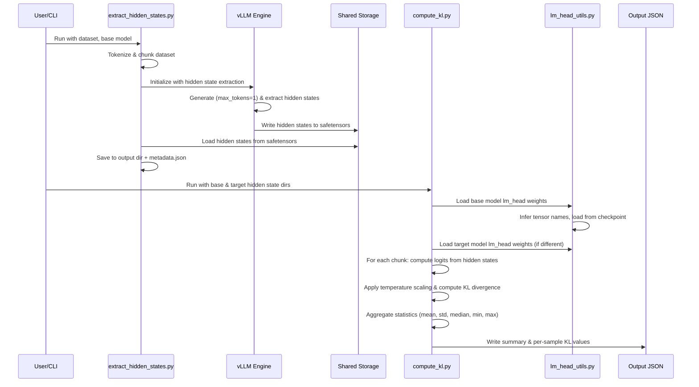

# [PR #2663] Feat/issue 2646

source: https://github.com/vllm-project/llm-compressor/pull/2663
state: open | updated: 2026-09-24T20:21:08Z
labels: enhancement, ready, two-reviews

## 正文

**Summary:**

Implements #2646 — a tool to efficiently compute KL divergence between a base and quantized model using vLLM's hidden state extraction API.

**Problem:** Extracting full-vocab logprobs from vLLM is too slow (~64hrs for WikiText on Llama-3-8B) due to serializing [seq_len × 128k] tensors.

**Approach** (as described in the issue):
- Use vLLM's [hidden state extraction API](https://vllm.ai/blog/extract-hidden-states) to save post-norm hidden states (dim ~4096 vs vocab ~128k = ~30x smaller)
- Two-phase workflow: extract hidden states to disk, then compute KL offline
- Load only the lm_head weight from the checkpoint (no full model load needed)
- Reconstruct logprobs offline and compute token-weighted KL(P_base || P_quant)

**New files:**

| File | Description |
|------|-------------|
| `tools/kl_divergence/extract_hidden_states.py` | Phase 1 — vLLM hidden state extraction to safetensors |
| `tools/kl_divergence/compute_kl.py` | Phase 2 — offline KL divergence computation |
| `tools/kl_divergence/lm_head_utils.py` | Efficient lm_head weight loading from checkpoints |
| `tools/kl_divergence/test_local.py` | 10 unit tests (CPU-only, torch + safetensors) |
| `tools/kl_divergence/README.md` | Usage guide |

**Test plan:**
- 10 local unit tests passing (self-KL=0, KL>0 for different inputs, non-negativity, temperature scaling, E2E with safetensors I/O, token ID mismatch detection, dimension validation)
- End-to-end on Colab T4 with TinyLlama-1.1B: hidden state extraction via vLLM (16 samples) + self-comparison KL = 0.000000


## 评论 (12)

### github-actions[bot] · 2026-04-28

👋 Hi! Thank you for contributing to llm-compressor. Please add the ready label when the PR is ready for review.

**Note:** This is required to complete the testing suite, please only add the label once the PR is code complete and local testing has been performed.

### coderabbitai[bot] · 2026-04-28

<!-- This is an auto-generated comment: summarize by coderabbit.ai -->
<!-- This is an auto-generated comment: skip review by coderabbit.ai -->

> [!IMPORTANT]
> ## Review skipped
> 
> Auto incremental reviews are disabled on this repository.
> 
> Please check the settings in the CodeRabbit UI or the `.coderabbit.yaml` file in this repository. To trigger a single review, invoke the `@coderabbitai review` command.
> 
> <details>
> <summary>⚙️ Run configuration</summary>
> 
> **Configuration used**: Path: .coderabbit.yaml
> 
> **Review profile**: CHILL
> 
> **Plan**: Pro
> 
> **Run ID**: `deff3d72-d7d8-46a8-b774-dd0b456349d3`
> 
> </details>
> 
> You can disable this status message by setting the `reviews.review_status` to `false` in the CodeRabbit configuration file.
> 
> Use the checkbox below for a quick retry:
> - [ ] <!-- {"checkboxId": "e9bb8d72-00e8-4f67-9cb2-caf3b22574fe"} --> 🔍 Trigger review

<!-- end of auto-generated comment: skip review by coderabbit.ai -->

<!-- walkthrough_start -->

## Walkthrough

Introduces a comprehensive KL divergence computation toolkit for comparing base and quantized/compressed models. Adds hidden state extraction via vLLM, lm_head weight loading utilities, KL divergence computation scripts, documentation, and local testing capabilities.

## Changes

|Cohort / File(s)|Summary|
|---|---|
|**Documentation** <br> `tools/kl_divergence/README.md`|New README documenting the KL divergence workflow, including phase-based requirements, CLI option specifications for both extraction and computation scripts, architecture-specific tensor name detection, operational limitations, and output JSON structure.|
|**Core KL Divergence Tooling** <br> `tools/kl_divergence/extract_hidden_states.py`, `tools/kl_divergence/compute_kl.py`|New scripts implementing end-to-end KL divergence computation: `extract_hidden_states.py` tokenizes datasets, chunks tokens, and uses vLLM with speculative mechanisms to extract hidden states from a target layer; `compute_kl.py` loads pre-extracted hidden states, retrieves lm_head weights, computes logits per chunk, and outputs detailed KL divergence statistics including per-sample and token-weighted global means.|
|**Utility Functions** <br> `tools/kl_divergence/lm_head_utils.py`|New module providing tensor weight utilities: infers lm_head/embedding tensor names from model configs with architecture-specific defaults, detects extraction layer indices, maps tensor names to safetensors shards, and loads lm_head weights from local or Hub checkpoints with support for tied embeddings and fallbacks.|
|**Testing** <br> `tools/kl_divergence/test_local.py`|New standalone test module generating synthetic hidden states and weights via safetensors, validating logit computation, KL correctness (self-comparison near zero, positive for perturbations), temperature scaling behavior, token-ID alignment, and dimension compatibility with comprehensive assertions.|

## Sequence Diagram(s)



## Estimated code review effort

🎯 4 (Complex) | ⏱️ ~60 minutes

## Possibly related issues

- vllm-project/llm-compressor#2646: This PR directly implements the "cheap KLD metric" approach by providing vLLM-based hidden state extraction and lm_head-based KL divergence computation for efficient model comparison.

## Suggested labels

`enhancement`

<!-- walkthrough_end -->

<!-- pre_merge_checks_walkthrough_start -->

<details>
<summary>🚥 Pre-merge checks | ✅ 3 | ❌ 2</summary>

### ❌ Failed checks (1 warning, 1 inconclusive)

|     Check name     | Status         | Explanation                                                                                                                                                                    | Resolution                                                                                                                                                               |
| :----------------: | :------------- | :----------------------------------------------------------------------------------------------------------------------------------------------------------------------------- | :----------------------------------------------------------------------------------------------------------------------------------------------------------------------- |
| Docstring Coverage | ⚠️ Warning     | Docstring coverage is 70.59% which is insufficient. The required threshold is 80.00%.                                                                                          | Write docstrings for the functions missing them to satisfy the coverage threshold.                                                                                       |
|     Title check    | ❓ Inconclusive | The pull request title 'Feat/issue 2646' is vague and does not clearly convey the main change; it references an issue number without describing what the feature accomplishes. | Replace the title with a clear, descriptive phrase that summarizes the feature, such as 'Add KL divergence computation tool for model quantization analysis' or similar. |

<details>
<summary>✅ Passed checks (3 passed)</summary>

|         Check name         | Status   | Explanation                                                                                                                                                                                                                    |
| :------------------------: | :------- | :----------------------------------------------------------------------------------------------------------------------------------------------------------------------------------------------------------------------------- |
|     Linked Issues check    | ✅ Passed | Check skipped because no linked issues were found for this pull request.                                                                                                                                                       |
| Out of Scope Changes check | ✅ Passed | Check skipped because no linked issues were found for this pull request.                                                                                                                                                       |
|      Description check     | ✅ Passed | The pull request description clearly relates to the changeset, describing a KL divergence computation tool with vLLM integration that matches the five new files and comprehensive implementation details in the code summary. |

</details>

<sub>✏️ Tip: You can configure your own custom pre-merge checks in the settings.</sub>

</details>

<!-- pre_merge_checks_walkthrough_end -->

<!-- finishing_touch_checkbox_start -->

<details>
<summary>✨ Finishing Touches</summary>

<details>
<summary>🧪 Generate unit tests (beta)</summary>

- [ ] <!-- {"checkboxId": "f47ac10b-58cc-4372-a567-0e02b2c3d479", "radioGroupId": "utg-output-choice-group-unknown_comment_id"} -->   Create PR with unit tests

</details>

</details>

<!-- finishing_touch_checkbox_end -->

<!-- tips_start -->

---

Thanks for using [CodeRabbit](https://coderabbit.ai?utm_source=oss&utm_medium=github&utm_campaign=vllm-project/llm-compressor&utm_content=2663)! It's free for OSS, and your support helps us grow. If you like it, consider giving us a shout-out.

<details>
<summary>❤️ Share</summary>

- [X](https://twitter.com/intent/tweet?text=I%20just%20used%20%40coderabbitai%20for%20my%20code%20review%2C%20and%20it%27s%20fantastic%21%20It%27s%20free%20for%20OSS%20and%20offers%20a%20free%20trial%20for%20the%20proprietary%20code.%20Check%20it%20out%3A&url=https%3A//coderabbit.ai)
- [Mastodon](https://mastodon.social/share?text=I%20just%20used%20%40coderabbitai%20for%20my%20code%20review%2C%20and%20it%27s%20fantastic%21%20It%27s%20free%20for%20OSS%20and%20offers%20a%20free%20trial%20for%20the%20proprietary%20code.%20Check%20it%20out%3A%20https%3A%2F%2Fcoderabbit.ai)
- [Reddit](https://www.reddit.com/submit?title=Great%20tool%20for%20code%20review%20-%20CodeRabbit&text=I%20just%20used%20CodeRabbit%20for%20my%20code%20review%2C%20and%20it%27s%20fantastic%21%20It%27s%20free%20for%20OSS%20and%20offers%20a%20free%20trial%20for%20proprietary%20code.%20Check%20it%20out%3A%20https%3A//coderabbit.ai)
- [LinkedIn](https://www.linkedin.com/sharing/share-offsite/?url=https%3A%2F%2Fcoderabbit.ai&mini=true&title=Great%20tool%20for%20code%20review%20-%20CodeRabbit&summary=I%20just%20used%20CodeRabbit%20for%20my%20code%20review%2C%20and%20it%27s%20fantastic%21%20It%27s%20free%20for%20OSS%20and%20offers%20a%20free%20trial%20for%20proprietary%20code)

</details>


<sub>Comment `@coderabbitai help` to get the list of available commands and usage tips.</sub>

<!-- tips_end -->

<!-- internal state start -->


<!-- DwQgtGAEAqAWCWBnSTIEMB26CuAXA9mAOYCmGJATmriQCaQDG+Ats2bgFyQAOFk+AIwBWJBrngA3EsgEBPRvlqU0AgfFwA6NPEgQAfACgjoCEYDEZyAAUASpETZWaCrKPR1AGxJcAYiWoA9EgOJJAATABsACwRkAAUtpBmkREAzACUkHKQFNzUsGhKADT2+NgUDKECVBgMsJAAZv64QYghYJExkIBJhJDM2hglDBTNdOEADJFg41EdABzQMxyRHKkAjABaJYi41NiIXPjcZBpGACLSw/Dc4vgYHAZQAJLM3F5sGLjIwdihydERLhoSAEfAeEH4BSvPChADSABlILRJJRSLUqiRcAB3EhkdBZNCIULMRQkcGYejAgCO2Ew4gAXmMSUpwft4BgiJAJPD4QBZADkyAQtCUGDAO2ooRIAA9cFQxPA7pAAIJWJ6nKDK7i8fBoOpcGVyvW4Hj4HZgDxoWSUDD4CjMeLcM24MC2+2ZYWi+y7GjIOIAPyi4wAnLFkR9EIqMIhMuydv56PgGo1sB4PGAJPgGCpU855B58EQdQI/f61mE5gBrJHwCNRmMQnJ0bCVEE1RBNPgU712tCkeL+1LjADrTdoLduGHSGkgAGEWNwYZAEfwGg0POyqvndciOSDYKEPMwAPoHwqQHHwIiwL7oDD0EZMaNyifszkFosUQTIBpfh2INApHoT08QlX0NRgaRb27CQ0A3WhqCjB5IF0SA1nGSAC2zcFZysABVMA7g8eRsAwdQQSgv0CAqeoAGp7DQJoaGjO0Yy4OpRErb5ag8bAlHsMkGjABEAF5xhKBE9Awho7RrNdKHYFAMEXL4SltMVyCIRCJHUWQShoV5lFwcpQkQbC322RjMTIRBWMgJ4AgAeUgMhaDAAgwFc/T8ErPEnjOPokH6XA6iRayFTuEpu3DGyoy5OD4AQydThQqAAFF73cwhXPi+DEKVJUAHF8ELLw5zBFQYCiSBCvwi91HqdwMFkeFLX6MA1g0NYACEuBAsUwKlWV5UneI1liADXi8RASgAVnLASqUwshMh1cdKnoJgKEfE1EAKY5kG7NhdiStAAG4BI8ISmFeZwkCVOIBEJUIJBkZ7MlkeAySUegVxEyBxg0cZgZBkpYLy8Q91wA8eGuMlN3iQ0Rri3oj1PBMeC/EQIqwXoEWnAxUusZ1XTtB1LWtPh2SUaV4gAAwwRxT0S0VjwpyhEDpzJwcSyVKS0uMTQACWwIgiDfSAfD1UJ+u9SVkCxBqFEjch7FreBLQoXSAY0YM5jmRpZI/dREFOR4wEMAwTCgHKkxwDy0SMsYbo+ThMf4YRRHEKQZHkJglCoVR1C0HR9Ct8AoDgVBUEwe3CEdqgaE2lhXa4KgsXsRx+hcLI/dJQO1E0bRdAtoxw9MAxQQ8RAAkrDxj2RKQKDRSoAhsNLlTOXk0o0ZhaAeAAiIeDAsFUnmIMgnfoBwnBzu26kwUhEAMJ5Pi/dbpHxcgM/bzvu/3agwrMrWBE32B8AzggoRUuFEUb1EyFbU/sVxLBgSeok+lJcl73xGk6XgIyWgAQbq8GkESegzIySQDZHubkfIwAfzGLLQaLlhrGjijJPgJA1zwAYF9WosgZxPF2scfBDQvrIG4AUIkiDnoPhIDSeAIxXYzUxvgHSShkCuSyp5X+LtuwyjQFNTeWC0FGgVHuFBPpRF/iyPgaGX8WSHV/tDPEoC8ASxXPfZuj9Qi/hYPuUygFkEs1AjI02MAYa0CzI4RSZA7GJ03rOeETx+A3HrIbPgdMkbGmZiKMgx5Bqm24LIOmd56B0w0TQY8dcNChLpiUMouANzkEOjRdQXsTLijIfAChDAKIsT4BgYRoQ0B4EIEoGgON6qKI4ZQLW/EjiTjYd2DcOxkBHCMlGOCmF1Y+k8XEeBvIuQcziiMJhLD2AlCdOaChJT0xugdL4mpp8Cg6TtN5XyZFGQUACKdIkJonyRnjIQhQz4qDslUhE9hrwXREXkCsyc057ImjgrZMK8zN5qO9BQCcJlVxGP4HgFSkAABSABlRyAA5JSDBeK7k5DPbO8gwJIHEAwNhxwKDimEW8W+uVfhsOOoUagaAoq/2xVg/o6IAjQy/KLWAoKKHfVNmXEelhlQeBoInTxV8flKHhc4fK0ZAUyidBQJO/A+CLgEBuAp7B1CUMeJAaFdxQhxBsQwOxnwRWEQwMRRgBQOTeEgNvSAu8u5pUaBrEgBMOWQF5JgPJUFJa2pVAs2QuyjDwk3MgBeJr+6QFouNKIARphGDSjsWsfMFD8RGDpEgGccFYLdvCC+Bgh4DyMBAMARgq41zrg3FEujaXRJILEjw8TZCD2HqPZU48E6xuRXmQFAal4rzXooFsm8okLhhJW6tiT8QSnvHBdVUIaVuVSaEKuB8jn9t9MuO+JaW4YhfniYEgAcAiQYAXAIblbt2Lo3A+6oGshVpyMBGz9iGoAkBSA0j5bEJNHkCgRJkDIh2naShJQz0oFFOIFlb79IkEMonEyJQlA6UqEMWApFqyRkZBSxMHi7i9OYrZHFJS2D8Cbo00Rsk6ZozPLQOmARQOnxFBLS814vgzjgKZK4NxMI7mQHTElp0NBCFshgcJBiHQCAUfUT9Xtv3SDBglJKm9Jr4oUKRBd0Z0WP3kHEbsWJnCiqVAczEZrSmBUQMFOo6R9IHiwAWQobHiMJnCTRm8P5ZI/KQTcuIzSelplkJkI9pATRnrYSMWBnJbO3ixKZpR0D/LIEM/UQRGAsH4LgVmFQ4pAFSn/huXARDJayX8KFfq4oZE2rKnkZhJRyIjAs5AOm/UgkWPCap3+rm0PucqwQbZx5Eqc2M6MrWLLkCtbIGARK6ANxEAwK7C8oXALaEtHKkg2xKzXEi0FagHFp6MN+OiZaHJoYKyVsCdTFAyIcmQ0aziQozFYBioppr2s+wDB2ECojJ4SPhPZKCq7kY7jPuvjCZAxtbxiJy/UOo8Hc59FTOIN4n0pEXblkuxWiiflPfRoUGzJArw3kdLxGQ8BCQoGTGAoknwutoG1Bub5oHsV7BGPYcyx2jFYHLcgbRq69FKRY0QHJ0suS48qz4DQRbG7hO7H2IgIwtJLuxbikRy6+j+FFXjnEaZ0CHQhNssAQWxhEALE9cEbBMAzh8OyOChryLJJUh+zE02xgtpzmi6NmL4j64wAEHYwC2DIkwAEZg7JvdoGlJZGXTB5NbPUWUT4JmGXXhUid8QPuOSZDU1rJdaiHRX2BJCmFhXQh5MqxAc3eBXtUK/JwugZtzCcu5d0u4fXIQCtEJrEVnTkzirtFK2Ssr5UuU+Eq6QKrlQBPoOa4+1wTTsBzk6K5XB2MDDiOkV7WA6YFtrvXHRa6QGLorXEhJ/fB9mqTTwbAcq8EplqC09nS+SrVxX8Wpu6/y2DoSchVCdNX1EmPM4IgiA5900Ji/48D+RaWCABcGGAlYj0z0/ioo+kn+mIUBZAJQSCx4QWbCXmcBKBIGYG1OdqugegEINEGg0ANkdov+RMfa0IMSgurO6IEB7+n6MBx6xaFAiBkBZ6DB3mx4Z6Ikaq5AmBVOxkIwIknU4kYU0GJAIkA82qCEHA4wA8sG8GQSKWIk0QJQVmhQyB6OtGx42G4hPBc2mEz2CYx4aghI2hpS3B6qJQFGdAGhGOuAZhbAFh5AmQFsNYYgv+DqTqZETQD2RuZUyonq3qBgvqaSRqi8dAXAtEQY4w4a4wka0awUzspITYiayaa4beXAQsGOmaw85sealcV+haq+1BrcTy8BGANWT6oSta2a9ajak8Ti08Wcra88xqHaA+tAqu5qVgsg0MSoI+zG0Mh8VKZM3CmUHkOUj6NA4iyMSoOkwIwy9GMMAxJo/WOym8wIiAuSLK9AIsYsb4UsrY2mC6vEzAgw5y2YzE8sauNkJ2Wx6WfWB4DoVykIFC0odAFoZARAiiIOYBfojWCyhq2Y2oYw2QdMEAjMzA0u+KnW325SHkVSXsjxs6sBY+6CNS7MVM94MojQciPyf6T4FCgWoWtoL6JeiUdAJmeI7ISqCUjIbGEgaYzAGgPIvI4SAWj2ZR1WwS4SWxoguY3sxIogxqQUNywIlYEg5y5AYgskhJV4Jk9AV8WIyeMsF2+Wko6AkqeSxote+IBkEqrae0zgNu1EfYoQImMpLghu2Weo9Qb2eARq8GpWJoTa8OSsM+0ox4axiAQhw6WE1xVWF2lRvox4eQ0MfGcidMBemgEpXp7YnYoZwqzAnMqhrGw24IGGdk/GQKa0Pa08VkmZwGNyIwuKPsRizxnwdeMM+wlAOSogeSX0iYIKDpFp1EJE2JfAiJ9oNJDuPAtZRINIbOFCXgOhliJCTYW0nRE2eC9Qw5m8OINOuZG0w2dwgWSsfyWAr6pSPKKi9Axx3u38/6iqQG3ElWHGZKXGPGw6aijOXgmAyA2A3AXIrJTYtk5QlQu5c4eEZwyocuJIVp7K9aVevKNejY9eQqIFmmLe0oEq7eMqR+Xeiq4gfemoe+5qBA3AnxUg4IDQpEOMp5l+YIRRt+D8tKXJQZwSQ60+b+Fan+3+8+JQr+Iwr6FaaxIB8G3+GgXFDFlW5FASFRwScQXFGgPFM+7IP+EEHRYw5qMo/Juws23ecosgk+nw0+uex4DhFax4kAIk/0A8Gl/Q7IGlA8XAhlGAElFejqzqPhJofhoQARcEXqlAPqfqYRgakRqQYQawsR8Rcesa/soQCaX0aRqamR2RWaOaFcy+VBd+eiAQahtAx4mi1c1aNRDqDaE85AjRmcs88grR4Ry8q8co3aH5lWCVSV4gKVCStSs5eF5+V8cQawsYsWlABhKOwC1hVGUMxBxSpSP4ciex4sHIhxxIh5cpnIcQdM7ICZQWmlnWpWPEfEEsUuzgdQmSYgAKSgDQ5S3Kn5Dg2obeXiIIjZLkzAlGiKiAF0cQYQmQiJYgQKwyMxGCSomJSkNMPOwIDMTM1WmJnM9Md19hloOwbMVolA7W2J0oXMV1GQWQ2AGslIhSmGropSvCAETEPViA4oBQFAkCpO3AEsYigmii/p4IrZYmn5g1Bx3OIsAgp2DAlYKlt4k1x4HBs1/Q3AUN8QUQmQ5mCNF6ZUOhipPVuJhiwIJN2ePA+Q0qItDowINiWIBqO4yCR+9g2N9AzNvNXpPVnN3YcQs0mQdoHEOwTidNDN+AVy6ADAH5upIwAhWADyZVhh6hQWwuDWqGCyjt7VxhuOf1SowIEyRKUqUGeCGqRGO4bMTtiVKBXMJQCOs5JuT09NjYnViKF4mhmOIWeIS+X0yBdoiVKdb4f1qAZAKgXglIv8DS36e4ueAdzCYwhZ6SxIwQb45e6VwFTeYF1iDewq5+dsrekqYwHeCFJ+SFyqqFP0++GczIqYoQhF1+MVpFrc5VyVISYSaCsFb4z+UAU1LVFAthWho5cQZ67WQaxtqhkd+9N4mlXAjk7tcEAA2sbQALpOH6HlUmGIDX2QC32TgP3P2v1WFnU2GzU6E3130eCP1ygv16EuF4HIjuF/7b0A0g3A2Yng00xH3fwn1cDG2wNKS4CkEv6a3lUoGYMsjYO/Ln1e0gOlJgO/0QP/16FUMkbe2mGgPf3gOQMUDQOWGnWUaX32HsM/1uZcM8O8GiEh04NygSEMCLgDx4PwMEOWVeEuq+HuoOXERBEhGbztoRHBphDjARA+UGBRp+VSoBUpHBUuTpGSpcC8h0DwCOA5HZp5H5qFE35r5xW+iA2JZVrVHOPpX1FZXNrNFzzJi6OFVdobxdEH6joIQFiqw9F9FYDeNKIz1HU/IIhgCeObbRIiqNAFhYhwkiiq6RhTQNljAri4Vn5xRDEKZNy3hTHfKQj/bIDzH4g6il6RIkPp0EPxDdgAm9If0k5k6ULuL0MURYECGMYJT05M4c5gDFgqAay96tK/y23lCipS6zJKpKgrjtOX4EEYAYAaDVM4xwQC7FESAL4LNoE+akhLGMZazMaunSayCfAHgYoMTo1FI/i2r+p3C7A0l7iBn8XBnSCu2RJsUdbDrKmZI1zlZTnnm7A3IN0wIXqVZo3WS/MaBYvHhdK8YnYbmlOUBjN2yEhEhak15cD/aq2k4kCu5Ji4D9C0w8zIgZaIE+3WNNBiBsJEhXRgCgJ3Q8ay7kDOCQC7L4AzJmhKpSCy5iLYoCGUYgiolsLqSugkAS6SDax2z7NwREpWEwVexMh3AKJ3An5rKASKh8Bx2TP8EQbd5uQTG/z8sNABCKvlDKtYtotCtaw8bIC11ax7hRYSxrH2RnCoE+R4g+4GYrbCbhSTgnZy21ixR3CCsLiIRqDpZ+wHhJ11Pr1In4gblx5SjbSySZ1YCywfZxQ2LSAYCACYBD5nG57S9t9jKCbDVXGrPeMOEg7bnibhRB0pLW0K3UBTyh3fyl3RBR3X3TBW3oPfBcfgqj3shcvOPdJQftPWVHPcRTk63N42zL40Op2+hUcFhdAmcy0lvZVoAfXMAb8eAUgf1OwXAc+2nXYagZTkZCZEIUDPPogze+VjEttb5OUeC9/tGUwWpEzDJtNNsIwmzAgQ+kGeGKHhUR1mzOiq/f+2QcMKMMeCBxWqQ9Vqh1yIlgIIoYyDhy/huVrR0j/rvhPSsYpS4IzWpcmBpToRpTpXpQZQMMZTgy2NbTpTkKRHR18HPhdO27gHEBhLng4FbeAi5NXKEE1R4aPCozZW6v4YEc5cEa5bo0GrRKkFEN5RGiYwkf5ckUFQfimhkY6g404xFebJbNbI64CvCfHA0VZ6wOwGnGgBnLbvINkAFQXMHMXGHG5y7OoCfZ/TZziIlRKJKiXK5xHJAMGGgHMGkAIAAOwMA5dzA5ckDAwkBRBzCzSzTldrC0ANARCnwkBrCzSZe0CpBPQRANCTApfGBpfRf2EYfxc2E5SRdpdgKcEPwgFnaVHJdhwGAADef+A8SAtg3UWEvktA84vnnwVgzodAJljQ7yc2C3SAjkeGF2e321KnRQC3Wqxtb484TcZpRVNocEEKMie383KEKEA80VVzi9DLy9lVq973f+n3kA33CicEPgdV9Ye3s0V3oPX3l79YAA6g1GcFmLdxyIgLDyD5AAAL7w+ffg9EUeMlEMt8WsyUWhLA8I9g8EC7AeBQ81M157dRCE+g8DxI816o/Qzo+YpyiF17dhC48E+4/E/z2/elr7tQSHvYTVo08I/g8M9M/4Ws/s9E9c/Rg8+wB8+Y9f57epAi/q/i+7tk8b4UFb5+OyAK8c/0+Q/Q8s9cBs+4+I8O9a9o8Y8C9Y9C8i9/6i9fcBU2AqCFzI9fg0BWAUDuApIkDncHeE8DxA24Czi5uVg2DSAQ7Y9cD3248feK8cT03QqlJ7cDxR9lT5+VhyEu9g9gT7Cx+XdV8DziqWglKTjF8MaH7K4B2uriDR+QD8h+CBA/ChCdARD8goBtN9i/A3K1vICkmMB3kUBAl3BSDyD4kDBuWkAXRlY4IKTogqLj8hBmqOCnw2sNTJJHxXBqB7ghaHw/JNDYGW2gLtIHimyV+08DwjC2S8St9cADxp9vDc4fkPfMqLa2BDwp/AzBC/s80FI8BYAVAT+Pm1twpZkSjQZoA6wU7RZkA/IDorLj3ahA8mo0OdGIj/T/we89IfJpgEconIx+skMphrGcAaA3+ivKBMXwOxHYiATAjno+DuBEkTIe3F8Id3f7fohqcEZPpxEL5sBi+wAmPkbxz4N9y+EgmPr/115e9OQ93ZQKQE4FE8a+mffbvX3f5N9KBP/MHioKDacgmAD3fsKgBy6AxZowYAAKTTlQo0caMNgFwT4J2AjzJsJMnrpwDpA58DwPQFQBzBAYwMewYwPV5fdP+YITRHcGL6h9MkSIT3mYPsx8A7+bvJbG0FDZPFGwAEcQB2FX4wwLBGg2dH4L2hghaAEQhviwN/5sC3wWgr7sIONweAxBBfIvr/xu6qDsesg0Hrnw54KD2hYPEImt3shtAiUptBodXx9C18uAAgyIWD0MEt8owxfVoQhgWwgl6Ap8bMDWTNQtN2QIwofgrAUiGxSI9AMRNDFQCLhO+62KCFUPf41CwedQjkJMIHhNCFkqwxQcX1SRrcngYw6QMqDaDgJXY2aUHv70+59CieAwyQb/0cgOk7YEKJgMcDnBtEdGKfF4ToP4F/JBBivRYSKhWEp97A6w44JsNEDlJP4toPpGATGCHC06NOGSKcIyYIAqEqYcEF3x2B3DmBpIVgRpnqHzDXhWsEQS0JT6fDf+ySRyA0ARFdJk+BVAEe+gMzsAQRn3MEShAhEB9hRgwgeBcBWJxRy+6I6YboLmEN9cRxgkvjDCuGsibhD2LhExlGjgDnAhqEYJaBTxVl8BKIw5JBkuAnwJYwIFnLFVyaLp8mc6W1o9SuSatIK86PoHG2+QwwKEcrc1HOU/KgIRgpmSMHK1rD4pXY+TKpNNlPI/ILGQXDkRzweEDwnhHAvkdwNizykRgdfIkHyLeGiD1R0IsHtaOgHLDfeKEJ+vH0T62AtRNo5Yb/xy4CAGgSgKILNHGCqAhwaAccQwD1hRACu7XBgGsDWA5c9YwYJcWEDCACAyutAOYMGAYCTBxgi42gMGAECpAcueocsAwFHFhAogm4prkwIT6EhcAtgUvkoLB5eVxgaAVILVxy7jRGIdghgGEAaCzQ5xTXNYF+Mq60BcuaAKIAwAaAzimuYQPWFOIaArjaAEQCIDONSCpA0AGEoMEOF/HlgHx5Q1MLQBW5ZhKwtgGsdiIHjIhaANgUiL2NbF3BVhmI34PHzokMSMAr41ibMKxEcTEoXEvnq9xSG8S2wvwAwHj264QBMYFaNgLogm701P6Q3UuG5086Jkay4LKbiaBm6zdHxOwKwGSLoDKhcAafVInQA24+4k+4eXACZXGBSTy4UAdSXkE0mDRjwKkvQEAA= -->

<!-- internal state end -->

### mergify[bot] · 2026-04-28

# Merge Protections

🔴 **1 of 1 protections blocking** · waiting on 👀 reviews

| | Protection | Waiting on |
|:--:|:--|:--:|
| 🔴 | **Require two reviews** | 👀 reviews |

## 🔴 Require two reviews

**Waiting for**

- [ ] `#approved-reviews-by >= 2`

<details><summary>This rule is failing.</summary>

PRs labelled "two-reviews" must have at least two approving reviews before merging.
- [ ] `#approved-reviews-by >= 2`
- [X] `#changes-requested-reviews-by = 0`

</details>

### HDCharles · 2026-04-28

do you have any benchmarks for how long it took?

### rpathade · 2026-04-29

> do you have any benchmarks for how long it took?

Ran on Colab with Llama-3.1-8B, A100-40GB, 64 x 2048 tokens:

Extract:  89.5s  (1,464 tok/s)
Compute:  21.3s  (6,151 tok/s)
Total:    110.9s (1,182 tok/s)
Storage:  1,025 MB (63x smaller than full logprobs)
Self-KL:  0.0

[Colab notebook](https://colab.research.google.com/drive/17rJttZhVlFBbBlAxqJwIChoXiSqlP2_s?usp=sharing)


### HDCharles · 2026-04-29

can you also comment on the issue so i can assign you, also if you need additional feedback feel free to reach out to me on the vllm slack where i'm also HDCharles

### HDCharles · 2026-05-05

It looks like you resolved the comments but can you indicate whether/where/how this was fixed for clarity?

### rpathade · 2026-05-05

> Just submitted my pending replies — sorry about that, didn't realize they were stuck in draft. Here's where each concern was addressed:
> 
> 1. **Architecture mappings removed** (`lm_head_utils.py`): Removed the entire per-architecture dict. Now using `init_empty_weights()` + `get_output_embeddings()` to discover lm_head weight names dynamically — same approach as the speculators script. No manual config needed.
> 
> 2. **Norm layer** (`compute_kl.py`, `lm_head_utils.py`): You were right — `num_hidden_layers` gives pre-norm hidden states. Now loading the norm weight from the checkpoint in `lm_head_utils.py` and applying it in `compute_kl.py` before the lm_head projection.

### HDCharles · 2026-05-06

Ok cool, I'll try to run some tests and see how it does

### github-actions[bot] · 2026-09-23

This pull request has been automatically marked as stale because it has not had any activity within 90 days. It will be automatically closed if no further activity occurs within 30 days.

### mergify[bot] · 2026-09-23

# Merge Protections

🔴 **1 of 1 protections blocking** · waiting on 👀 reviews

| | Protection | Waiting on |
|:--:|:--|:--:|
| 🔴 | **Require two reviews** | 👀 reviews |

## 🔴 Require two reviews

**Waiting for**

- [ ] `#approved-reviews-by >= 2`

<details><summary>This rule is failing.</summary>

PRs labelled \"two\-reviews\" must have at least two approving reviews before merging\.
- [ ] `#approved-reviews-by >= 2`
- [X] `#changes-requested-reviews-by = 0`

</details>

### mergify[bot] · 2026-09-24

# Merge Protections

🔴 **1 of 1 protections blocking** · waiting on 👀 reviews

| | Protection | Waiting on |
|:--:|:--|:--:|
| 🔴 | **Require two reviews** | 👀 reviews |

## 🔴 Require two reviews

**Waiting for**

- [ ] `#approved-reviews-by >= 2`

<details><summary>This rule is failing.</summary>

PRs labelled \"two\-reviews\" must have at least two approving reviews before merging\.
- [ ] `#approved-reviews-by >= 2`
- [X] `#changes-requested-reviews-by = 0`

</details>

## Review (7)

### gemini-code-assist[bot] · 2026-04-28 · COMMENTED

## Code Review

This pull request introduces a toolset for measuring KL divergence between models using vLLM's hidden state extraction API, which significantly reduces storage and computation overhead compared to full-vocab logprob extraction. The feedback focuses on improving robustness and performance: specifically, raising a ValueError for sequence length mismatches in compute_kl.py to prevent silent errors, removing unimplemented normalization options from the documentation to avoid confusion, and optimizing weight casting and dataset tokenization for better efficiency.

### coderabbitai[bot] · 2026-04-28 · COMMENTED

**Actionable comments posted: 7**

<details>
<summary>🧹 Nitpick comments (1)</summary><blockquote>

<details>
<summary>tools/kl_divergence/test_local.py (1)</summary><blockquote>

`19-44`: **Move the KL math into a shared helper.**

This duplicates `_compute_kl_for_chunk()` from `tools/kl_divergence/compute_kl.py`, so future math changes can leave the local test green while production has drifted. A tiny shared tensor-only helper would preserve the lightweight dependency story without duplicating the implementation.

As per coding guidelines, `**/*.py`: Focus on code correctness, quantization algorithm implementation, numerical stability, and tensor operations. Check for major PEP 8 violations and Python best practices. Pay attention to GPU memory management and model loading patterns.

<details>
<summary>🤖 Prompt for AI Agents</summary>

```
Verify each finding against the current code and only fix it if needed.

In `@tools/kl_divergence/test_local.py` around lines 19 - 44, compute_kl_for_chunk
duplicates the KL math from tools/kl_divergence/compute_kl.py's
_compute_kl_for_chunk, risking drift; extract the tensor-only KL computation
into a single shared helper (e.g., compute_kl_tensor or kl_for_logits) in
tools/kl_divergence/compute_kl.py, ensuring it accepts base_hidden,
target_hidden, lm_head_weight and optional lm_head_bias/temperature and returns
kl_per_position, then replace the body of compute_kl_for_chunk to call that
helper (import it) so tests and production use the same implementation and avoid
duplicated logic.
```

</details>

</blockquote></details>

</blockquote></details>

<details>
<summary>🤖 Prompt for all review comments with AI agents</summary>

```
Verify each finding against the current code and only fix it if needed.

Inline comments:
In `@tools/kl_divergence/compute_kl.py`:
- Around line 68-91: Add explicit argument validation for temperature and
chunk_size in the CLI parsing stage so non-positive values are rejected
immediately: when defining the parser arguments for "--temperature" and
"--chunk-size" (the parser.add_argument calls that create the temperature and
chunk_size variables), enforce that temperature > 0 and chunk_size > 0 (either
via a custom type/validator or by checking args after parse_args and calling
parser.error with a clear message) so the script fails fast instead of producing
NaNs or runtime errors later (affects the code paths that use temperature for
softmax scaling and the chunk loop that iterates with chunk_size).
- Around line 283-345: The aggregation code assumes per_sample_kl is non-empty
and will crash if all pairs were skipped; add a guard right before creating
kl_tensor/ results: if len(per_sample_kl) == 0 then set results to sensible
defaults (e.g., mean_kl=0.0, mean_kl_per_sample=0.0, std_kl=0.0, median_kl=0.0,
min_kl=0.0, max_kl=0.0, num_samples=0, total_tokens as-is,
temperature=temperature, elapsed_seconds=elapsed, tokens_per_second=0.0) and
return or continue, otherwise proceed to build kl_tensor and compute stats as
currently done (references: per_sample_kl, kl_tensor, results,
token_weighted_mean_kl, total_tokens).

In `@tools/kl_divergence/extract_hidden_states.py`:
- Around line 4-6: The help/docs currently imply extraction of the pre-norm last
transformer block but the code uses num_hidden_layers (the post-final-norm
state) and compute_kl.py expects that; update the CLI help, module docstring,
and inline comments around the parser.add_argument('--layer-index') and the code
that sets layer_index/default to num_hidden_layers to explicitly state that the
default extracts the post-final-norm representation (index == num_hidden_layers)
and that numeric --layer-index values are interpreted as follows:
0..num_hidden_layers-1 = outputs of transformer blocks (pre-final-norm), and
num_hidden_layers = post-final-norm hidden state used by compute_kl.py; ensure
any examples/comments near num_hidden_layers and where layer_index is applied
reflect this mapping so manual overrides can't silently pick the wrong
activation.
- Around line 134-150: The current logic builds all_tokens for the whole dataset
before slicing chunks, which ignores num_samples during tokenization; modify the
loop over dataset to incrementally tokenize and fill chunks up to max_seq_length
and stop once you've produced num_samples full chunks (drop the final incomplete
chunk as before). Concretely, replace the two-step all_tokens->chunks flow by
maintaining a running buffer (e.g., curr_tokens), extend it with
tokenizer.encode(text, add_special_tokens=False) for each example, emit a chunk
into chunks whenever len(curr_tokens) >= max_seq_length (consume that many
tokens), and break out of the outer loop when len(chunks) == num_samples or
dataset exhausted; keep using text_column, tokenizer, max_seq_length, chunks,
and num_samples names so the change is easy to locate.

In `@tools/kl_divergence/lm_head_utils.py`:
- Around line 125-136: The try/except around hf_hub_download and json.load is
too broad; change it to only catch "index missing" errors by importing and
catching the hub-specific missing-entry exception (EntryNotFoundError from
huggingface_hub.utils) and FileNotFoundError, and let all other exceptions
propagate; specifically update the block that calls hf_hub_download and
json.load (variables index_path, index, and weight_map) to except
(EntryNotFoundError, FileNotFoundError): fallback to hf_hub_download(...,
"model.safetensors") while not swallowing auth, network, or corrupt-checkpoint
exceptions.

In `@tools/kl_divergence/README.md`:
- Around line 96-99: Remove the undocumented flag reference `--norm-weight-name`
from the README's flags table and any duplicated mentions later (the block
listing `--norm-weight-name`, `--lm-head-weight-name`, `--lm-head-bias-name`,
`--embed-weight-name`), since compute_kl.py does not define or use that flag;
also update the "default-tensor-name" explanatory text to omit any reference to
norm weights so it matches compute_kl.py's actual flags and behavior (search for
`--norm-weight-name` and "default-tensor-name" strings to locate the text to
change).

In `@tools/kl_divergence/test_local.py`:
- Around line 282-317: The test currently only compares token_ids tensors but
never calls the code path that enforces alignment, so change Test 9 to invoke
the real failure by calling compute_kl_divergence (or the function that performs
the alignment check) with the base and target datasets created by
create_fake_hidden_states using different token_ids; wrap that call in
pytest.raises(ExpectedException) (or assertRaises) to assert the mismatch
raises, ensuring the token_ids tensors are different but all other metadata
matches so the alignment-check path is exercised.

---

Nitpick comments:
In `@tools/kl_divergence/test_local.py`:
- Around line 19-44: compute_kl_for_chunk duplicates the KL math from
tools/kl_divergence/compute_kl.py's _compute_kl_for_chunk, risking drift;
extract the tensor-only KL computation into a single shared helper (e.g.,
compute_kl_tensor or kl_for_logits) in tools/kl_divergence/compute_kl.py,
ensuring it accepts base_hidden, target_hidden, lm_head_weight and optional
lm_head_bias/temperature and returns kl_per_position, then replace the body of
compute_kl_for_chunk to call that helper (import it) so tests and production use
the same implementation and avoid duplicated logic.
```

</details>

<details>
<summary>🪄 Autofix (Beta)</summary>

Fix all unresolved CodeRabbit comments on this PR:

- [ ] <!-- {"checkboxId": "4b0d0e0a-96d7-4f10-b296-3a18ea78f0b9"} --> Push a commit to this branch (recommended)
- [ ] <!-- {"checkboxId": "ff5b1114-7d8c-49e6-8ac1-43f82af23a33"} --> Create a new PR with the fixes

</details>

---

<details>
<summary>ℹ️ Review info</summary>

<details>
<summary>⚙️ Run configuration</summary>

**Configuration used**: Path: .coderabbit.yaml

**Review profile**: CHILL

**Plan**: Pro

**Run ID**: `8769700c-3ea8-43c5-9cac-5f0ae7b28b67`

</details>

<details>
<summary>📥 Commits</summary>

Reviewing files that changed from the base of the PR and between 7a52e9e24558bbb4cf8c3a47c0eda630ea6e64be and 9a863b7c787e00e4855851df6bee15a8d3ba6f02.

</details>

<details>
<summary>📒 Files selected for processing (5)</summary>

* `tools/kl_divergence/README.md`
* `tools/kl_divergence/compute_kl.py`
* `tools/kl_divergence/extract_hidden_states.py`
* `tools/kl_divergence/lm_head_utils.py`
* `tools/kl_divergence/test_local.py`

</details>

</details>

<!-- This is an auto-generated comment by CodeRabbit for review status -->

### HDCharles · 2026-04-28 · COMMENTED

(no text)

### HDCharles · 2026-04-28 · COMMENTED

(no text)

### HDCharles · 2026-04-28 · COMMENTED

(no text)

### HDCharles · 2026-04-29 · COMMENTED

(no text)

### rpathade · 2026-05-05 · COMMENTED

(no text)
