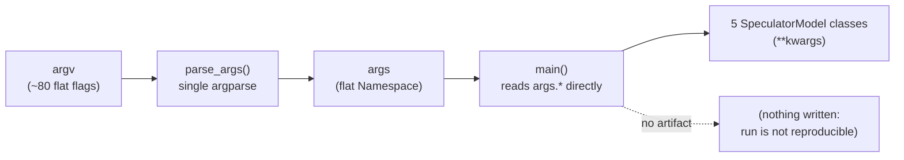
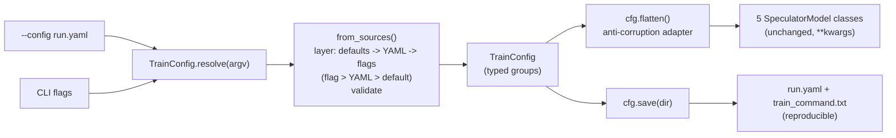

# [Issue #833] [RFC]:  Config-file-first CLI for `scripts/train.py`

source: https://github.com/vllm-project/speculators/issues/833
state: closed | updated: 2026-07-24T12:57:06Z
labels: RFC

## 正文

### Motivation.

Training a drafter is driven by `scripts/train.py`, whose tunable surface has grown past **80 flat `argparse` flags** declared in a single `parse_args`, with `main()` reading `args.*` directly and threading them as `**kwargs` into the five `SpeculatorModel` classes. That shape hurts three ways today:

- **Reproducibility.** There is no first-class, re-runnable artifact of *the exact configuration that produced a checkpoint*. A run is reconstructed after the fact by re-reading a bash script and hoping its variables were not edited since — there is nothing next to the checkpoint that says how it was made.
- **Discoverability.** A wall of ~80 flat flags gives no sense of what belongs together or what a given run actually needs. `--help` is one long undifferentiated list.
- **Maintainability.** Every new knob is another hand-written `add_argument`, and the flag set drifts easily from how `main()` consumes it.

The real workflow makes this concrete. A user copies an `examples/train/*.sh` **recipe**, edits ~15 bash variables in its `# ==== Configuration ====` block, and the script threads them into a curated ~15-flag invocation of `train.py`; the other ~65 flags stay at their defaults. So a per-run configuration file *already exists* — it just lives in bash, covers only a slice of the surface, and produces no durable record of the resolved run. We should make that configuration a first-class, typed, re-runnable artifact without breaking a single existing recipe.

This RFC covers `scripts/train.py` only.

### Proposed Change.

Make `train.py` **config-file-first** while keeping the full flag surface backward-compatible. A run is described by an optional YAML file, overridable on the CLI, and every run writes back a clean, re-runnable copy of the configuration it actually resolved to.

1. **`--config run.yaml` (new).** A run is specified by an optional YAML config file. The file is **stage-shaped**: everything nests under a top-level `train:` key, so a future pipeline config (`prepare_data:`, `launch_vllm:`) extends the same file rather than replacing it. Loading is lenient — a bare top-level mapping is still accepted — and unknown keys warn and are ignored rather than silently accepted.
2. **All ~80 flags remain, byte-for-byte (existing).** Every flag is generated from a single typed schema (one typed field == one flag, with its type / choices / bool-style / help), shown in a flat, **grouped** `--help`. Existing `examples/train/*.sh` recipes and workflows keep working unchanged.
3. **Precedence `flag > YAML > default` (new).** Two explicit layers over the schema default — no third layer, no escape hatch. Predictable: a flag always beats the file, the file always beats the default.
4. **`--dump-config` (new).** Prints the fully-resolved configuration as a valid, `train:`-wrapped config file, so a working invocation can be turned into a `run.yaml` to version and share.
5. **Reproducibility artifacts (new).** Each run writes, next to its checkpoints at rank 0: a resolved **`run.yaml`** (clean, re-runnable via `--config`, no provenance inlined) and a **`train_command.txt`** manifest (exact argv, git SHA, world size, and `speculators` / `transformers` / `torch` versions). Re-running an experiment becomes `--config run.yaml`.
6. **One public type, `TrainConfig` (new).** The configuration subsystem presents essentially one type that parses, layers, validates, and serializes itself. `train.py` collapses to `main(TrainConfig.resolve())`.
   - `TrainConfig.resolve(argv)` — the impure CLI boundary: parse argv, layer sources, validate, handle `--dump-config`, convert a config error into a clean `SystemExit(2)`.
   - `TrainConfig.from_sources(*, cli, config_path, argv)` — the **pure, argv-free, exception-raising core** and primary test seam. Validation runs here, including rejecting conflicting draft-init options (`--from-pretrained` vs `--draft-config` vs decoder-shaping flags) whether the conflict is expressed on the CLI or entirely inside the YAML file.
   - `cfg.flatten()` — the **anti-corruption adapter**: returns the `vars(args)`-shaped flat dict the five `SpeculatorModel` classes already consume via `**kwargs`, with byte-identical ordering to today's parser. The model layer is **not touched**.

### Any Other Things.

#### Old flow

#### New flow

The contrast is the point: today `argv` flows straight through a flat `Namespace` into the model classes and nothing durable is written; the proposal routes the same inputs through one typed `TrainConfig` that layers sources, validates once, hands the model layer the *identical* flat dict through an anti-corruption adapter, and writes back the resolved config so the run is reproducible.

### Any Other Things.

**Backward compatibility is the binding constraint.** Every existing `examples/train/*.sh` invocation must run unchanged; passing no `--config` at all behaves identically to today.

**Test plan.** The suite is anchored in real happy paths rather than a synthetic flag-by-flag snapshot: each `examples/train/*.sh` recipe's invocation is run through the new config layer and its flags asserted to resolve to the expected values — so any flag a recipe relies on is guarded against a silent rename, drop, or retype, and the schema stays the single source of truth for the long tail of flags no recipe exercises. On top of that, at the pure `from_sources(...)` seam: layering/precedence (`flag > YAML > default`) resolves to the right winner; `dump_yaml()` → `--config` round-trips to an identical resolved config; and validation/error fidelity holds (a broken `--config` → clean exit 2; a missing required value names the flag to set; conflicting draft-init options are rejected whether set on the CLI or in YAML; a mismatched algorithm block warns). Process-level behavior (`--dump-config` output, exit codes) is checked at the `resolve(argv)` boundary.

**Considered but out of scope:**

- **`typer` for the generated CLI** — considered for its cleaner grouped `--help`, but `typer`/`click` cannot reproduce the current space-separated `nargs='+'` flags (`--full-attention-indices 2 18 33`, `--target-layer-ids …`) without click-level surgery beneath its vendored parser — a back-compat break under "zero breakage beats polished look." The schema generates `argparse` flags instead.
- **A pydantic-native / `pydantic-settings` CLI** (its built-in argv parsing as the surface) — rejected: it does not reproduce the exact flat flag surface (dotted group names, space-separated `nargs`, the current bool style) byte-for-byte, so it too breaks recipes. (`pydantic-settings` is still used internally for source ordering.)
- **Phase 2** — pushing typed groups into the five `SpeculatorModel` classes and retiring the flat-dict adapter. Separate future PR.
- **Whole-pipeline config** — one file driving `prepare_data` + `launch_vllm` + `train`. The `train:` wrapper only reserves room for it.
- **Env-var / dotenv config sources** — the trainer is configured via CLI + YAML only.

## 评论 (1)

### rahul-tuli · 2026-07-22

Tracked in JIRA: https://issues.redhat.com/browse/INFERENG-9334

**JIRA Details:**
- Issue Type: Task
- Priority: Major
- Component: Speculators
- Activity Type: Tech Debt & Quality
- Fix Version: Speculators 0.7.0
- Assignee: Rahul Tuli
- Status: Backlog
