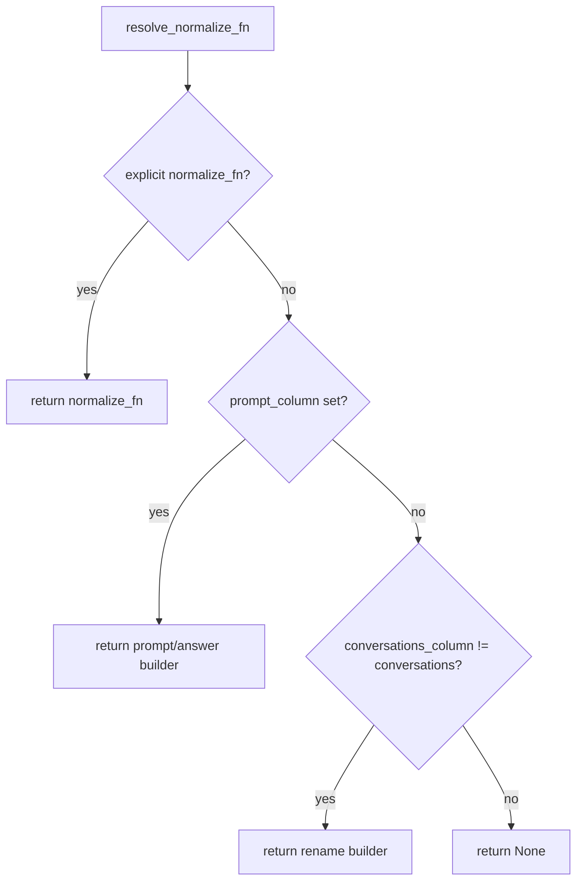

# [PR #688] feat(data): declarative schema normalization for prepare-data (RFC #583)

source: https://github.com/vllm-project/speculators/pull/688
state: open | updated: 2026-09-22T15:51:19Z
labels: needs-rebase

## 正文

Implements declarative conversation-schema normalization for prepare_data.py (part of RFC #583 per @shanjiaz scoping comments), replacing hand-written per-dataset normalizers with config-driven ones.

## Changes

- **Declarative role mapping**. Add a ROLE_ALIASES lookup table and a _normalize_turn helper; _normalize_conversation delegates to it instead of an inline if/elif chain.

- **Automatic messages → conversations**. The column is renamed during ingestion (_rename_messages_to_conversations), so OpenAI-style messages datasets need no per-dataset normalizer (e.g. _normalize_ultrachat is removed).

- **Config-generated normalizers**. DatasetConfig gains declarative hints — conversations_column, prompt_column/answer_column — and resolve_normalize_fn(config) builds the normalizer from them. ultrachat and gsm8k are converted to hints; normalize_fn remains an explicit escape hatch (e.g. for sharegpt4v_coco).

- **Correctness hardening of turn handling**: observation maps to the tool role (it's a tool result, not a user turn), thinking and reasoning_content are preserved independently (no or-overwrite), and empty conversations are guarded before turn-dropout sampling.

## Testing

- tests/integration/datagen/test_schema_normalization.py — offline unit tests for role aliases, resolve_normalize_fn generation (prompt/answer, conversations_column rename, explicit escape hatch), and the automatic messages→conversations rename.

- tests/integration/datagen/test_normalization_presets.py — a @pytest.mark.slow, self-skipping test that runs the real normalization path over small streamed slices of sharegpt, ultrachat, gsm8k, and nemotron, asserting well-formed conversations.

- Existing _normalize_conversation tests still pass. ruff, ruff format, and mypy --check-untyped-defs are clean.

## 评论 (8)

### coderabbitai[bot] · 2026-06-30

<!-- This is an auto-generated comment: summarize by coderabbit.ai -->
<!-- review_stack_entry_start -->

[](https://app.coderabbit.ai/change-stack/vllm-project/speculators/pull/688?utm_source=github_walkthrough&utm_medium=github&utm_campaign=change_stack)

<!-- review_stack_entry_end -->
<!-- This is an auto-generated comment: skip review by coderabbit.ai -->

> [!IMPORTANT]
> ## Review skipped
> 
> Auto incremental reviews are disabled on this repository.
> 
> Please check the settings in the CodeRabbit UI or the `.coderabbit.yaml` file in this repository. To trigger a single review, invoke the `@coderabbitai review` command.
> 
> <details>
> <summary>⚙️ Run configuration</summary>
> 
> **Configuration used**: Path: .coderabbit.yaml
> 
> **Review profile**: CHILL
> 
> **Plan**: Pro
> 
> **Run ID**: `7b74bac4-f9b2-4978-99e1-c82bd2685aa3`
> 
> </details>
> 
> You can disable this status message by setting the `reviews.review_status` to `false` in the CodeRabbit configuration file.
> 
> Use the checkbox below for a quick retry:
> - [ ] <!-- {"checkboxId": "e9bb8d72-00e8-4f67-9cb2-caf3b22574fe"} --> 🔍 Trigger review

<!-- end of auto-generated comment: skip review by coderabbit.ai -->

<!-- walkthrough_start -->

<details>
<summary>📝 Walkthrough</summary>

<!--review_stack_artifact
<stack_title>Declarative dataset normalization and turn canonicalization</stack_title>
<stack_summary>Replaces bespoke per-dataset normalizer functions with declarative DatasetConfig fields, adds resolve_normalize_fn, refactors _normalize_turn with role aliases, and adds automatic messages→conversations renaming with integration tests.</stack_summary>
<cohort id="normalization" title="Declarative normalization refactor">
<summary>Introduces declarative schema hints in DatasetConfig, resolve_normalize_fn, role-alias turn normalization, automatic messages→conversations renaming, and integration test coverage.</summary>
<layer id="config_contract" title="DatasetConfig fields and resolve_normalize_fn">
<summary>Extends DatasetConfig with conversations_column, prompt_column, answer_column; exports resolve_normalize_fn; adds helper builders for rename and prompt/answer normalizers; updates DATASET_CONFIGS entries for ultrachat and gsm8k.</summary>
<ranges>
range_a1b188cce313
range_748de5fdd415
range_7601837b0015
</ranges>
<diagram title="resolve_normalize_fn selection logic">

</diagram>
</layer>
<layer id="preprocessing_turn" title="Turn normalization and _normalize_conversation refactor" depends_on="config_contract">
<summary>Adds ROLE_ALIASES and _normalize_turn for role/content canonicalization with unknown-role warnings and tool/thinking field preservation; reworks _normalize_conversation to delegate to _normalize_turn; wires resolve_normalize_fn into load_raw_dataset; adds _rename_messages_to_conversations and calls it in load_and_preprocess_dataset.</summary>
<ranges>
range_2c8ca918f02a
range_4c798a14293f
range_3401af9f386b
range_354490c957ec
range_347c8ecd0ecc
range_05e602aa763f
</ranges>
</layer>
<layer id="tests" title="Integration tests for normalization" depends_on="preprocessing_turn">
<summary>Adds test_schema_normalization.py covering role alias mapping, resolve_normalize_fn behaviors, and messages→conversations renaming edge cases; adds test_normalization_presets.py streaming real HuggingFace datasets and asserting valid conversation structure.</summary>
<ranges>
range_75e8557c93c4
range_f3bd7400b8ca
range_fca590251f47
range_b999b8fd1d04
</ranges>
</layer>
</cohort>
<unassigned_ranges>
</unassigned_ranges>
-->

## Walkthrough

Replaces hard-coded per-dataset normalizer functions with declarative `DatasetConfig` fields (`conversations_column`, `prompt_column`, `answer_column`) and a new `resolve_normalize_fn` factory. Refactors `_normalize_conversation` to use a new `_normalize_turn` helper with role aliases, and adds automatic `messages`→`conversations` schema canonicalization. Two new integration test modules validate these behaviors.

**Declarative normalization refactor**

| Layer / File(s) | Summary |
|---|---|
| **`DatasetConfig` fields and `resolve_normalize_fn`** <br> `src/speculators/data_generation/configs.py` | Adds `conversations_column`, `prompt_column`, `answer_column` to `DatasetConfig`; exports `resolve_normalize_fn`; adds rename and prompt/answer normalizer builders; updates `ultrachat` and `gsm8k` entries in `DATASET_CONFIGS` to use declarative fields instead of bespoke `normalize_fn` values. |
| **Turn normalization and preprocessing wiring** <br> `src/speculators/data_generation/preprocessing.py` | Adds `ROLE_ALIASES` and `_normalize_turn` for role/content canonicalization with tool and thinking field preservation; reworks `_normalize_conversation` to delegate to `_normalize_turn`; wires `resolve_normalize_fn` into `load_raw_dataset`; adds `_rename_messages_to_conversations` called in `load_and_preprocess_dataset`. |
| **Integration tests** <br> `tests/integration/datagen/test_schema_normalization.py`, `tests/integration/datagen/test_normalization_presets.py` | Covers role alias mapping, `resolve_normalize_fn` behaviors (passthrough, rename, prompt/answer, escape hatch), `messages`→`conversations` renaming edge cases, and streaming validation against real HuggingFace preset datasets. |

## Possibly related issues

- **vllm-project/speculators#583**: This PR implements the declarative dataset normalization and `messages`→`conversations` canonicalization described in that RFC.

## Possibly related PRs

- [vllm-project/speculators#561](https://github.com/vllm-project/speculators/pull/561): Both PRs modify `_normalize_conversation`/turn normalization in `preprocessing.py` to handle `tool_calls`, `tool_call_id`, and the `"tool"` role.

</details>

<!-- walkthrough_end -->
<!-- pre_merge_checks_walkthrough_start -->

<details>
<summary>🚥 Pre-merge checks | ✅ 4 | ❌ 1</summary>

### ❌ Failed checks (1 warning)

|     Check name     | Status     | Explanation                                                                           | Resolution                                                                         |
| :----------------: | :--------- | :------------------------------------------------------------------------------------ | :--------------------------------------------------------------------------------- |
| Docstring Coverage | ⚠️ Warning | Docstring coverage is 29.41% which is insufficient. The required threshold is 80.00%. | Write docstrings for the functions missing them to satisfy the coverage threshold. |

<details>
<summary>✅ Passed checks (4 passed)</summary>

|         Check name         | Status   | Explanation                                                                                           |
| :------------------------: | :------- | :---------------------------------------------------------------------------------------------------- |
|         Title check        | ✅ Passed | The title clearly describes the main change: declarative schema normalization for data preparation.   |
|      Description check     | ✅ Passed | The description matches the changeset and accurately summarizes the normalization refactor and tests. |
|     Linked Issues check    | ✅ Passed | Check skipped because no linked issues were found for this pull request.                              |
| Out of Scope Changes check | ✅ Passed | Check skipped because no linked issues were found for this pull request.                              |

</details>

</details>

<!-- pre_merge_checks_walkthrough_end -->
<!-- finishing_touch_checkbox_start -->

<details>
<summary>✨ Finishing Touches</summary>

<details>
<summary>🧪 Generate unit tests (beta)</summary>

- [ ] <!-- {"checkboxId": "f47ac10b-58cc-4372-a567-0e02b2c3d479", "radioGroupId": "utg-output-choice-group-unknown_comment_id"} -->   Create PR with unit tests

</details>

</details>

<!-- finishing_touch_checkbox_end -->
<!-- tips_start -->

---

Thanks for using [CodeRabbit](https://coderabbit.ai?utm_source=oss&utm_medium=github&utm_campaign=vllm-project/speculators&utm_content=688)! It's free for OSS, and your support helps us grow. If you like it, consider giving us a shout-out.

<details>
<summary>❤️ Share</summary>

- [X](https://twitter.com/intent/tweet?text=I%20just%20used%20%40coderabbitai%20for%20my%20code%20review%2C%20and%20it%27s%20fantastic%21%20It%27s%20free%20for%20OSS%20and%20offers%20a%20free%20trial%20for%20the%20proprietary%20code.%20Check%20it%20out%3A&url=https%3A//coderabbit.ai)
- [Mastodon](https://mastodon.social/share?text=I%20just%20used%20%40coderabbitai%20for%20my%20code%20review%2C%20and%20it%27s%20fantastic%21%20It%27s%20free%20for%20OSS%20and%20offers%20a%20free%20trial%20for%20the%20proprietary%20code.%20Check%20it%20out%3A%20https%3A%2F%2Fcoderabbit.ai)
- [Reddit](https://www.reddit.com/submit?title=Great%20tool%20for%20code%20review%20-%20CodeRabbit&text=I%20just%20used%20CodeRabbit%20for%20my%20code%20review%2C%20and%20it%27s%20fantastic%21%20It%27s%20free%20for%20OSS%20and%20offers%20a%20free%20trial%20for%20proprietary%20code.%20Check%20it%20out%3A%20https%3A//coderabbit.ai)
- [LinkedIn](https://www.linkedin.com/sharing/share-offsite/?url=https%3A%2F%2Fcoderabbit.ai&mini=true&title=Great%20tool%20for%20code%20review%20-%20CodeRabbit&summary=I%20just%20used%20CodeRabbit%20for%20my%20code%20review%2C%20and%20it%27s%20fantastic%21%20It%27s%20free%20for%20OSS%20and%20offers%20a%20free%20trial%20for%20proprietary%20code)

</details>


<sub>Comment `@coderabbitai help` to get the list of available commands.</sub>

<!-- tips_end -->

### mergify[bot] · 2026-07-02

This pull request has merge conflicts that must be resolved before it can be
merged. Please rebase the PR, @imargulis.

https://docs.github.com/en/pull-requests/collaborating-with-pull-requests/working-with-forks/syncing-a-fork


### imargulis · 2026-07-05

@WindChimeRan Thanks for the thorough review — I agree with the framing (role names are uniform,
column layout is per-dataset) and reworked the PR accordingly. 

**Thinking regression (blocker) — reverted.** You're right, this was a behavior change,
not normalization. Restored the mirror so `thinking` and `reasoning_content` are both
populated from whichever is present, so Qwen3's template (which reads
`reasoning_content`) still renders the `<think>` block. Your repro is covered by a test.

**`hf:` path skipped the rename — fixed.** The `messages→conversations` rename now runs
once in `load_raw_dataset`, covering every source (local file, directory, preset, and
`hf:`). `_load_hf_dataset` just loads; the conversations-format check happens after the
rename, so `load_raw_dataset("hf:HuggingFaceH4/ultrachat_200k:test_sft")` works now.
Removed the duplicate call in `load_and_preprocess_dataset`.

**Overcomplicated / premature generalization — trimmed.** Cut `conversations_column`,
`prompt_column`/`answer_column`, both builder factories, and `resolve_normalize_fn`
(no preset used `conversations_column`; only gsm8k used prompt/answer). gsm8k is back to
a bespoke `_normalize_fn`. What remains is the part you called out as correct: role
centralization (`ROLE_ALIASES` + `_normalize_turn`) plus the single automatic
`messages→conversations` rename, plus the turn-handling hardening (observation→tool,
empty-conversation guard). 

On the bigger "generalize now vs later" question — agreed it belongs on RFC #583; happy
to bring the prompt/answer or column-layout hints back there once there's a real second
case to justify them.


### imargulis · 2026-07-10

Up to date PR description:

Implements declarative conversation-schema **role normalization** for prepare_data.py
(the schema-normalization slice of RFC #583), trimmed after
review to the parts that are uniform across datasets.

## Changes
- **Declarative role mapping.** Add a `ROLE_ALIASES` table and a `_normalize_turn`
  helper; `_normalize_conversation` delegates to it instead of an inline if/elif chain.
  `observation` maps to the `tool` role, `tool_calls`/`tool_call_id` are preserved, and
  `thinking`/`reasoning_content` are mirrored (both populated from whichever is present,
  so Qwen3's template — which reads `reasoning_content` — still renders the `<think>`
  block).
- **Automatic `messages` → `conversations`.** A single rename in `load_raw_dataset`
  covers every source (local file, directory, preset, and `hf:`), so OpenAI-style
  `messages` datasets need no per-dataset normalizer (`_normalize_ultrachat` removed).
- **Empty-conversation guard** before turn-dropout sampling.

`normalize_fn` remains the explicit per-dataset escape hatch (e.g. `gsm8k`,
`sharegpt4v_coco`). The config-driven column-layout machinery from the earlier revision
(`conversations_column`, `prompt_column`/`answer_column`, `resolve_normalize_fn`) was
dropped as premature generalization; the "generalize now vs later" discussion lives on
RFC #583.

## Testing
- `tests/integration/datagen/test_schema_normalization.py` — role aliases, turn
  normalization (tool fields, thinking/reasoning mirroring + priority, empty-value
  preference), the automatic `messages`→`conversations` rename, and preset normalizers.
- `tests/integration/datagen/test_normalization_presets.py` — network-gated, self-skipping
  validation over small streamed slices of sharegpt/ultrachat/gsm8k/nemotron.

### mergify[bot] · 2026-07-14

This pull request has merge conflicts that must be resolved before it can be
merged. Please rebase the PR, @imargulis.

https://docs.github.com/en/pull-requests/collaborating-with-pull-requests/working-with-forks/syncing-a-fork


### WindChimeRan · 2026-07-17

nit: `tests/integration/datagen/test_schema_normalization.py` this test is low value. Suggest delete. Others LGTM! @shanjiaz 

### mergify[bot] · 2026-07-24

# Merge Protections

🔴 **1 of 1 protections blocking** · waiting on 👀 reviews

| | Protection | Waiting on |
|:--:|:--|:--:|
| 🔴 | **Require approval from approved reviewers list** | 👀 reviews |

## 🔴 Require approval from approved reviewers list

**Waiting for any of**

- [ ] `approved-reviews-by = dsikka`
- [ ] `approved-reviews-by = fynnsu`
- [ ] `approved-reviews-by = orestis-z`
- [ ] `approved-reviews-by = rahul-tuli`
- [ ] `approved-reviews-by = shanjiaz`

<details><summary>This rule is failing.</summary>

All pull requests must have at least one approving review from a member of the approved reviewers list before merging\.
- [ ] any of:
  - [ ] `approved-reviews-by = dsikka`
  - [ ] `approved-reviews-by = fynnsu`
  - [ ] `approved-reviews-by = orestis-z`
  - [ ] `approved-reviews-by = rahul-tuli`
  - [ ] `approved-reviews-by = shanjiaz`

</details>

### mergify[bot] · 2026-08-03

This pull request has merge conflicts that must be resolved before it can be
merged. Please rebase the PR, @imargulis.

https://docs.github.com/en/pull-requests/collaborating-with-pull-requests/working-with-forks/syncing-a-fork


## Review (12)

### coderabbitai[bot] · 2026-06-30 · COMMENTED


<details>
<summary>🧹 Nitpick comments (1)</summary><blockquote>

<details>
<summary>src/speculators/data_generation/configs.py (1)</summary><blockquote>

`84-92`: _🎯 Functional Correctness_ | _🔵 Trivial_ | _⚡ Quick win_

**Partial prompt/answer hints are silently ignored.**

`resolve_normalize_fn` only builds the prompt/answer normalizer when both `prompt_column` and `answer_column` are set. If a config specifies just one (a likely typo/misconfiguration), it silently falls through to the rename/`None` branch and the dataset is never normalized into the canonical schema. A guard that raises (or warns) on the partial case would surface the misconfiguration early.


<details>
<summary>♻️ Optional guard for partial hints</summary>

```diff
     if config.normalize_fn is not None:
         return config.normalize_fn
+    if (config.prompt_column is None) != (config.answer_column is None):
+        raise ValueError(
+            "prompt_column and answer_column must be set together"
+        )
     if config.prompt_column is not None and config.answer_column is not None:
         return _make_prompt_response_normalizer(
             config.prompt_column, config.answer_column
         )
```
</details>

<details>
<summary>🤖 Prompt for AI Agents</summary>

```
Verify each finding against current code. Fix only still-valid issues, skip the
rest with a brief reason, keep changes minimal, and validate.

In `@src/speculators/data_generation/configs.py` around lines 84 - 92,
`resolve_normalize_fn` currently ignores partial prompt/answer configuration,
which can hide misconfigurations. Update this function to explicitly detect when
exactly one of `config.prompt_column` or `config.answer_column` is set, and
raise an error or emit a clear warning before falling through. Keep the existing
behavior only when both are set, using `_make_prompt_response_normalizer`, and
otherwise preserve the rename/None branches. This guard should make the
partial-hint case visible instead of silently skipping normalization.
```

</details>

<!-- cr-comment:v1:6c29bad7232f40615e1882f8 -->

</blockquote></details>

</blockquote></details>

<details>
<summary>🤖 Prompt for all review comments with AI agents</summary>

```
Verify each finding against current code. Fix only still-valid issues, skip the
rest with a brief reason, keep changes minimal, and validate.

Nitpick comments:
In `@src/speculators/data_generation/configs.py`:
- Around line 84-92: `resolve_normalize_fn` currently ignores partial
prompt/answer configuration, which can hide misconfigurations. Update this
function to explicitly detect when exactly one of `config.prompt_column` or
`config.answer_column` is set, and raise an error or emit a clear warning before
falling through. Keep the existing behavior only when both are set, using
`_make_prompt_response_normalizer`, and otherwise preserve the rename/None
branches. This guard should make the partial-hint case visible instead of
silently skipping normalization.
```

</details>

---

<details>
<summary>ℹ️ Review info</summary>

<details>
<summary>⚙️ Run configuration</summary>

**Configuration used**: Path: .coderabbit.yaml

**Review profile**: CHILL

**Plan**: Pro

**Run ID**: `11ffe690-f83d-4553-8376-5463a85c122a`

</details>

<details>
<summary>📥 Commits</summary>

Reviewing files that changed from the base of the PR and between ff71b1e6c89feb62d77a492075164d207989e538 and 8a5b92d42e6b3782c9b644e33bb216be14bddc73.

</details>

<details>
<summary>📒 Files selected for processing (4)</summary>

* `src/speculators/data_generation/configs.py`
* `src/speculators/data_generation/preprocessing.py`
* `tests/integration/datagen/test_normalization_presets.py`
* `tests/integration/datagen/test_schema_normalization.py`

</details>

</details>

<!-- This is an auto-generated comment by CodeRabbit for review status -->

### WindChimeRan · 2026-07-03 · COMMENTED

(no text)

### WindChimeRan · 2026-07-03 · COMMENTED

(no text)

### WindChimeRan · 2026-07-03 · COMMENTED

(no text)

### WindChimeRan · 2026-07-04 · COMMENTED

(no text)

### WindChimeRan · 2026-07-04 · COMMENTED

Main concern: this is overcomplicated and the implementation is fragile. The config-driven column-layout normalization adds machinery no dataset uses yet, and that's where the bugs cluster.

Role names are uniform across datasets, so centralizing them is right. Column layout is per-dataset — generalizing it ahead of a real second case is what makes this fragile. Concretely: two mechanisms do the same `messages→conversations rename`, and it's wired into one downstream caller, so the hf: path skips it entirely. Collapse to one rename in one place (`load_raw_dataset`) that covers every source, and cut `conversations_column/_make_rename_normalizer.`

One blocker beyond that: the thinking change is a behavior regression, not normalization. 

Bigger "generalize now vs later" question is on RFC #583.

### orestis-z · 2026-07-10 · COMMENTED

Core changes are correct, well-tested, and properly scoped after the trim. Two nits: falsy-content fallthrough in `_normalize_turn` when `value` is empty string, and missing test for dual `thinking`/`reasoning_content` priority. PR description is stale — still references cut machinery. See inline comments. Recommend approving.

🤖 Generated with [Claude Code](https://claude.ai/code) using the `/pr-review` skill

### orestis-z · 2026-07-10 · COMMENTED

(no text)

### orestis-z · 2026-07-10 · COMMENTED

(no text)

### orestis-z · 2026-07-10 · COMMENTED

LGTM. Both nits from my previous review (falsy-content fallthrough, missing thinking/reasoning priority test) are cleanly addressed in `9fafc86`. Recommend approving.

🤖 Generated with [Claude Code](https://claude.ai/code) using the `/pr-review` skill

### WindChimeRan · 2026-07-10 · COMMENTED

LGTM, recommend approve and merge. 


### speculatorsbot · 2026-07-17 · COMMENTED

LGTM. The refactoring is clean and well-scoped after the trim -- role centralization via `ROLE_ALIASES` + `_normalize_turn`, single `messages`→`conversations` rename covering all sources, and the `observation`→`tool` fix are all correct. Agree with @WindChimeRan and @orestis-z. Recommend approving.

🤖 Generated with [Claude Code](https://claude.ai/code) using the `/pr-review` skill
