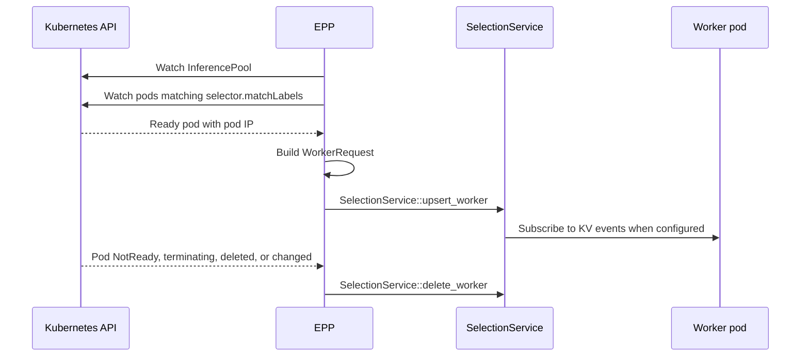
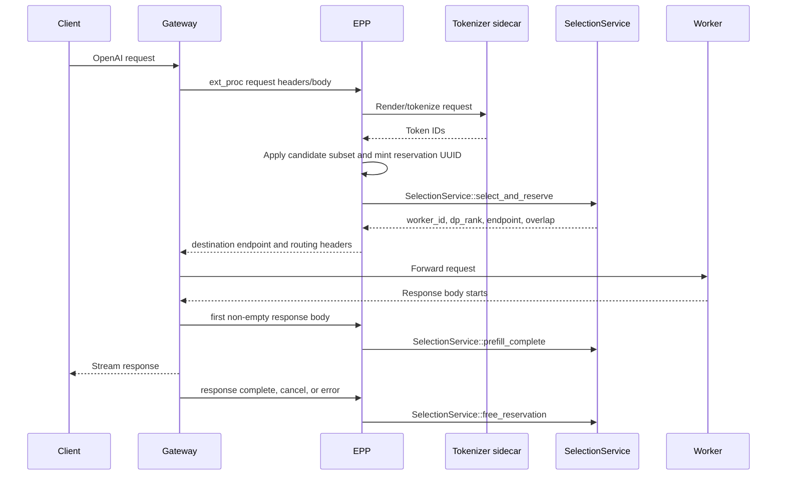
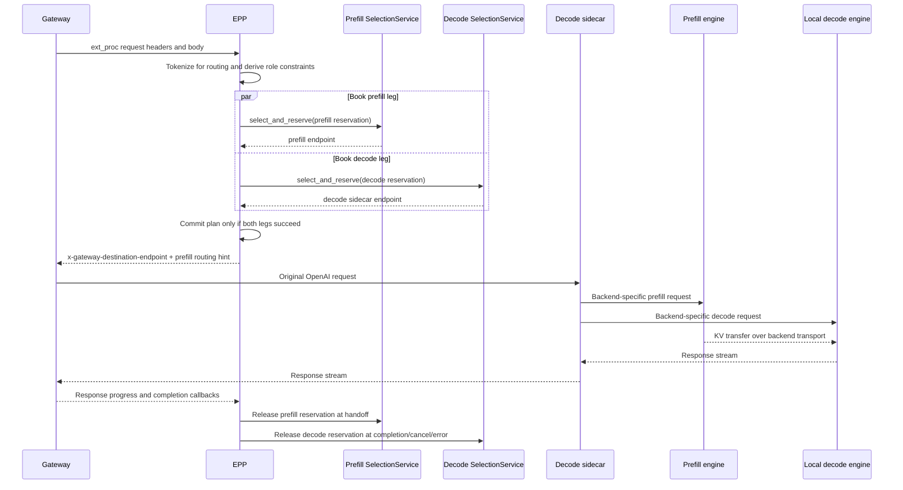
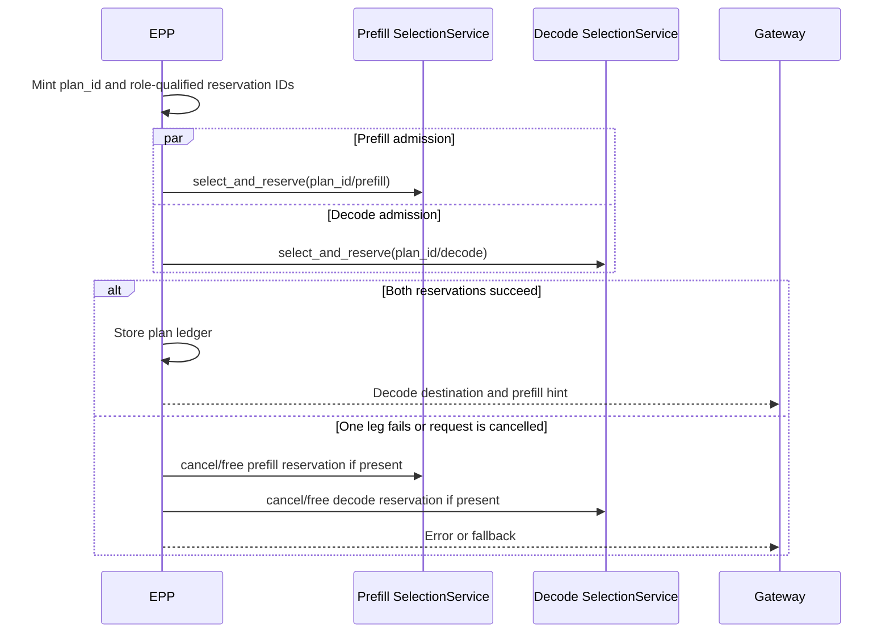
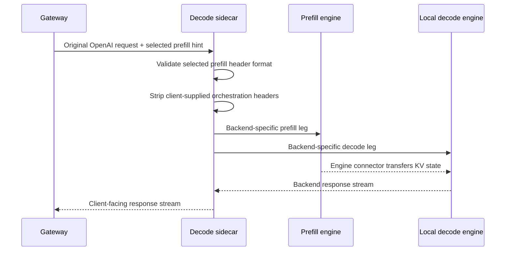
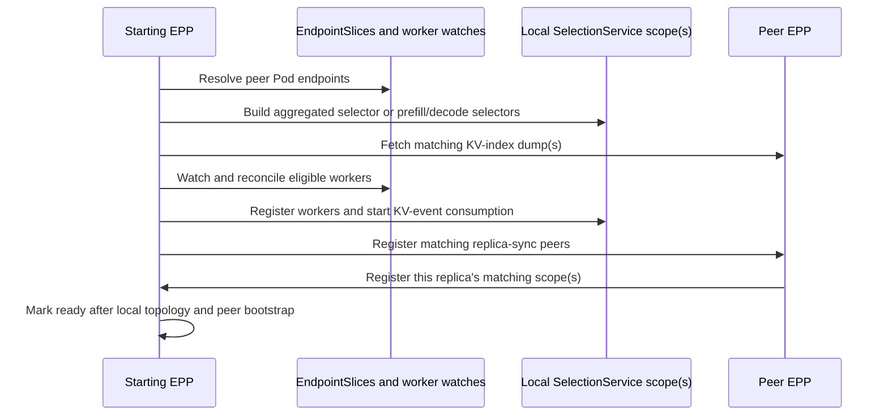

# [Issue #11661] DEP: EPP Embedded SelectionService Interface

source: https://github.com/ai-dynamo/dynamo/issues/11661
state: open | updated: 2026-09-21T21:52:41Z
labels: enhancement, backend::vllm, deployment::k8s, backend::sglang, backend::trtllm, router, dep:implementing, epp

## 正文

## Table of Contents

* [Summary](<#user-content-summary>)
* [Motivation](<#user-content-motivation>)
* [Proposal](<#user-content-proposal>)
  * [Design Inputs](<#user-content-design-inputs>)
  * [Component Boundary](<#user-content-component-boundary>)
  * [Motivation](<#user-content-motivation-2>)
  * [Goals](<#user-content-goals>)
  * [Worker Discovery](<#user-content-worker-discovery>)
  * [In-Process Interface](<#user-content-in-process-interface>)
  * [Aggregated Request Lifecycle](<#user-content-aggregated-request-lifecycle>)
  * [Tokenization](<#user-content-tokenization>)
    * [Problem with the Dynamo Preprocessor](<#user-content-problem-with-the-dynamo-preprocessor>)
    * [Initial Implementation: External Tokenizer Service](<#user-content-initial-implementation-external-tokenizer-service>)
      * [Backend Tokenization Services](<#user-content-backend-tokenization-services>)
    * [Long-Term: Tokens-In/Tokens-Out Execution](<#user-content-long-term-tokens-in-tokens-out-execution>)
  * [Disaggregated Routing](<#user-content-disaggregated-routing>)
    * [Overview](<#user-content-overview>)
    * [Plane 1: EPP Selection and Accounting](<#user-content-plane-1-epp-selection-and-accounting>)
    * [Plane 2: Decode Sidecar Execution](<#user-content-plane-2-decode-sidecar-execution>)
    * [Backend Execution Contracts](<#user-content-backend-execution-contracts>)
      * [vLLM](<#user-content-vllm-2>)
      * [SGLang](<#user-content-sglang-2>)
      * [TensorRT-LLM](<#user-content-tensorrt-llm-3>)
  * [Multi-Replica EPP State Sharing](<#user-content-multi-replica-epp-state-sharing-2>)
    * [Peer Discovery](<#user-content-peer-discovery>)
    * [State-Sharing Planes](<#user-content-state-sharing-planes>)
  * [EPP Embedded SelectionService vs Full Dynamo Runtime Router](<#user-content-epp-embedded-selectionservice-vs-full-dynamo-runtime-router>)
    * [Functional Gaps](<#user-content-functional-gaps>)
* [Implementation Milestones](<#user-content-implementation-milestones>)
  * [Milestone 1: vLLM Aggregated Routing](<#user-content-milestone-1-vllm-aggregated-routing>)
  * [Milestone 2: SGLang Aggregated Routing](<#user-content-milestone-2-sglang-aggregated-routing>)
  * [Milestone 3: TensorRT-LLM Aggregated Routing](<#user-content-milestone-3-tensorrt-llm-aggregated-routing>)
  * [Milestone 4: Multi-EPP Aggregated Routing](<#user-content-milestone-4-multi-epp-aggregated-routing>)
  * [Milestone 5: vLLM Disaggregated Routing](<#user-content-milestone-5-vllm-disaggregated-routing>)
  * [Milestone 6: SGLang Disaggregated Routing](<#user-content-milestone-6-sglang-disaggregated-routing>)
  * [Milestone 7: TensorRT-LLM Disaggregated Routing](<#user-content-milestone-7-tensorrt-llm-disaggregated-routing>)
  * [Milestone 8: Multi-EPP Disaggregated Routing and Hardening](<#user-content-milestone-8-multi-epp-disaggregated-routing-and-hardening>)
  * [Milestone 9: Embedded EPP Observability](<#user-content-milestone-9-embedded-epp-observability>)
  * [Functional-gap completion tasks](<#user-content-functional-gap-completion-tasks>)
* [Alternate Solutions](<#user-content-alternate-solutions>)
* [Requirements](<#user-content-requirements>)
* [Appendix](<#user-content-appendix>)
  * [Environment Contract](<#user-content-environment-contract>)
    * [EPP Request Plane](<#user-content-epp-request-plane>)
    * [EPP Selection and Worker Metadata](<#user-content-epp-selection-and-worker-metadata>)
    * [Multi-Replica EPP State Sharing](<#user-content-multi-replica-epp-state-sharing>)
  * [Kubernetes Resource Model](<#user-content-appendix-kubernetes-resource-model>)
  * [Worker Catalog Field-to-EPP Mapping](<#user-content-appendix-worker-catalog-field-to-epp-mapping>)
* [References](<#user-content-references>)

## Summary

Embed `SelectionService` in EPP for runtime-free Dynamo KV-aware and load-aware routing.

## Motivation

Preserve existing Gateway API and raw engine worker deployments while adding Dynamo selection, KV indexing, queueing, and accounting.

## Proposal

This document outlines how Dynamo Endpoint Picker Plugin (EPP) embeds `SelectionService` to achieve a Dynamo runtime-free pathway that can integrate directly with raw engine workers. EPP handles the Envoy protocol, request normalization, and worker discovery, while `SelectionService` owns worker selection, KV indexing, scheduling, active-load accounting, and reservation state.

### Design Inputs

* [Standalone Selection Service](<https://github.com/ai-dynamo/dynamo/blob/main/docs/components/router/standalone-selection.md>) is the API and behavior reference for `SelectionService`. It documents the standalone HTTP packaging and the embedded Rust API through `SelectionServiceBuilder`.
* [DEP: Runtime-Free Router and Gateway On-Ramp](<https://github.com/ai-dynamo/dynamo/issues/10321>) is the broader migration proposal. This document narrows that proposal to the EPP-owned Gateway/Kubernetes adapter and its in-process, non-runtime interface to `SelectionService`.

### Component Boundary

<!-- linear:table-colwidths:400,400 -->
| Component | Owns |
| -- | -- |
| EPP | Envoy `ext_proc` / GAIE protocol handling, OpenAI request normalization and tokenization, `InferencePool` subset filtering, Kubernetes worker discovery, engine metadata normalization, and selection lifecycle reporting. |
| Embedded `SelectionService` | Worker catalog, KV-event listeners, KV index, overlap/load scoring, scheduler queue, worker selection, reservation lifecycle, and replica sync or startup recovery when configured. |
| Decode sidecar | Decode ingress, orchestration-header handling, local decode passthrough, backend-specific P/D dispatch, streaming, and cancellation. |
| Worker backend | OpenAI-compatible serving, KV-event publication, and backend-specific KV transfer. |

### Motivation

Many users already run `vllm serve` or other OpenAI-compatible backends behind a Kubernetes Gateway in their own cluster. They may want Dynamo's KV-aware and load-aware routing, but do not want to adopt the full Dynamo runtime, Dynamo operator, `DynamoGraphDeployment`, discovery plane, or event plane.

The embedded EPP path gives those users an incremental adoption model. They keep their existing Gateway API resources and backend pods, add the Dynamo EPP, and let the EPP register eligible workers with its in-process `SelectionService`. The EPP remains the Gateway request-plane integration point, while `SelectionService` provides routing decisions and reservation accounting through a runtime-free in-process interface.

### Goals

* Support a user-managed Kubernetes deployment where raw vLLM, SGLang, or TRTLLM pods sit behind Gateway API and GAIE.
* Let users add Dynamo routing without requiring the Dynamo runtime, Dynamo operator or `DynamoGraphDeployment`
* Keep Gateway API resources, EPP resources, and worker resources user-managed in the operator-free path.
* Keep routing policy, KV indexing, scheduling, and reservation accounting inside `SelectionService` instead of reimplementing those behaviors within the EPP.

### Worker Discovery

The embedded EPP populates the `SelectionService` worker catalog through in-process method calls:

See [Appendix: Worker Catalog Field-to-EPP Mapping](<#user-content-appendix-worker-catalog-field-to-epp-mapping>).

### In-Process Interface

This design uses the embedded Rust API for `SelectionService`: the EPP constructs `SelectionService` with `SelectionServiceBuilder` and calls it directly.

Worker discovery uses the `SelectionService` worker-catalog methods:

<!-- linear:table-colwidths:400,400 -->
| Method | Use |
| -- | -- |
| `SelectionService::upsert_worker(WorkerRequest)` | Create or replace a worker record when a pod becomes eligible or its metadata changes. |
| `SelectionService::delete_worker(worker_id)` | Remove workers that are no longer eligible. |
| `SelectionService::list_workers(...)` | Inspect catalog state for debugging and readiness decisions. |

The EPP uses the selection and lifecycle methods:

<!-- linear:table-colwidths:400,400 -->
| Method | Use |
| -- | -- |
| `SelectionService::select_and_reserve(...)` | Select a worker and atomically book active load for a request. |
| `SelectionService::prefill_complete(reservation_id)` | Mark prompt-side load complete when the first non-empty response body arrives. |
| `SelectionService::add_output_block(reservation_id, ...)` | Report decode output growth. |
| `SelectionService::free_reservation(reservation_id)` | Free active load on response completion, cancel, upstream error, or stream teardown. |

### Aggregated Request Lifecycle

On successful selection, the EPP returns:

* `x-gateway-destination-endpoint = podIP:port`

### Tokenization

`SelectionService` requires token IDs to construct block hashes and generate KV-overlap scores. It also indexes KV events emitted by the worker, which describe the tokens actually executed by that worker.

#### Problem with the Dynamo Preprocessor

Using the Dynamo OpenAI Preprocessor in EPP would create a separate tokenization path from the inference engine. The token sequence used for selection could differ from the token sequence in the worker's KV events, making KV-aware routing inaccurate.

#### Initial Implementation: External Tokenizer Service

The initial EPP implementation uses an external tokenizer service associated with the inference backend:

1. EPP sends the original OpenAI request to the tokenizer service.
2. The service returns engine-native token IDs.
3. EPP performs KV-aware selection with those IDs.
4. EPP forwards the original request unchanged to the selected worker.

**Pros**

* Uses the backend's tokenization path for routing.
* Keeps the selection layer independent of tokenizer libraries and model artifacts.
* Preserves the raw OpenAI request for execution.

**Cons**

* Adds a tokenizer RPC and its availability dependency to the request path.
* The worker tokenizes the request again for execution.
* Requires backend- and version-specific tokenizer-service configuration.

##### Backend Tokenization Services

* **vLLM:** The [vLLM Render service](<https://docs.vllm.ai/en/latest/serving/online_serving/derenderer/>) provides rendered prompt token IDs through its chat-completions render endpoint. It can run separately from the model-serving worker.
* **SGLang:** SGLang provides a `/tokenize` endpoint that can serve as the backend tokenizer service. Its accepted request format and chat-template support must be version-gated before relying on it for KV-aware routing.
* **TensorRT-LLM:** TensorRT-LLM does not currently provide an equivalent tokenizer-service endpoint.

#### Long-Term: Tokens-In/Tokens-Out Execution

A backend-native tokens-in/tokens-out execution interface would eliminate the second tokenization step. EPP would obtain canonical input IDs from either Dynamo preprocessing or a tokenizer service, send those IDs to the selected worker, and receive output IDs for response handling.

* **vLLM:** [`POST /inference/v1/generate`](<https://docs.vllm.ai/en/v0.22.0/examples/generate/token_generation_client/>) accepts `token_ids`; with `detokenize=false`, the response exposes generated token IDs.
* **SGLang:** [`POST /generate`](<https://docs.sglang.ai/developer_guide/bench_serving>) accepts token-ID input (`input_ids`). Adoption requires validating that the deployed version returns native output token IDs in the required response path.
* **TensorRT-LLM:** No corresponding EPP-compatible tokens-in/tokens-out interface is currently identified.

### Disaggregated Routing

#### Overview

Disaggregated routing has two independent responsibilities. First, the EPP selects and books a compatible prefill/decode pair using two role-scoped `SelectionService` instances. Second, Gateway forwards the original request to the selected decode-sidecar endpoint, and that sidecar executes the backend-specific prefill/decode protocol using the selected prefill endpoint as a routing hint.

#### Plane 1: EPP Selection and Accounting

The EPP constructs two embedded `SelectionService` instances for the same model: a prefill selector and a decode selector. Each selector receives only role-appropriate workers, KV-event inputs, policy configuration, and queue configuration. The EPP assigns a single logical plan ID plus role-qualified reservation IDs, for example `(plan_id, prefill)` and `(plan_id, decode)`, and stores the mapping until the request terminates.

This mirrors the full Dynamo prefill/decode router more closely than a single shared selector. Prefill and decode have different queueing, scoring, and slot-accounting semantics, so each role gets an independent scheduler/policy profile and independent reservation state. The EPP-owned plan ledger ties the two role reservations together and translates lifecycle events to the correct selector.

Role-specific slot tracking:

<!-- linear:table-colwidths:266,266,266 -->
| Role selector | Slot/load accounting | Lifecycle owner |
| -- | -- | -- |
| Prefill | Track prefill-token compute load; do not track the transferred prompt as long-lived active blocks. | Free the prefill reservation when the prefill/handoff is observed, conservatively at first decode response body for the MVP. |
| Decode | Do not track prompt prefill compute; track transferred prompt occupancy as decode-side active blocks and apply output-block growth only here. | Keep the decode reservation until response completion, cancellation, or upstream error. |

Queuing is role-local. A prefill request waits only behind other prefill work in the prefill selector, and a decode request waits only behind decode work in the decode selector. The EPP should start both selection calls concurrently so one role is not systematically booked first while the other waits. No routing result is returned to Gateway until both role reservations succeed.

The transaction semantics are intentionally light. The two `SelectionService` calls are a lease-backed saga, not an atomic cross-service commit. If either leg fails, times out, loses its endpoint, or the client request is cancelled before dispatch, the EPP cancels any pending selection and frees any completed reservation. Leases or expiry should bound orphaned reservations if the EPP crashes after one role books but before cleanup. This guarantees no partial plan is exposed to Gateway, while accepting transient partial booked load inside one role selector during compensation.

#### Plane 2: Decode Sidecar Execution

After selection succeeds, the EPP returns `x-gateway-destination-endpoint` for the selected decode-sidecar endpoint and provides selected prefill metadata, such as `x-prefiller-host-port`, as orchestration metadata. The OpenAI request body remains the original client request; backend-specific disaggregation fields are not written by the EPP.

Gateway forwards the request to the decode sidecar. The sidecar validates the `x-prefiller-host-port` header format, strips or sanitizes orchestration headers before sending requests to engines, and performs the backend-specific P/D protocol. The sidecar owns prefill dispatch, decode dispatch, KV-transfer handoff coordination, cancellation cleanup, and the final response stream back to Gateway.

For the MVP, a syntactically valid `x-prefiller-host-port` is treated as authoritative. `InferencePool` membership validation and endpoint allowlisting are deferred as follow-up hardening.

Generic sidecar flow:

#### Backend Execution Contracts

The decode sidecar receives the original OpenAI request and EPP-selected prefill endpoint as orchestration metadata. It validates the orchestration header, removes it before calling an engine, and performs the backend-specific prefill/decode control plane. The backend connector transfers KV state directly between workers; the sidecar never carries KV bytes.

##### vLLM

vLLM supports multiple KV connector families. The initial implementation supports `NixlConnector` (`NixlPullConnector`) only.

1. The decode sidecar receives the forwarded request and selected prefill-worker hint, validates the orchestration header, and removes it.
2. It creates a non-streaming prefill request, adds `kv_transfer_params` for remote decode, and sends it synchronously to the selected prefill worker.
3. The prefill response contains `kv_transfer_params` describing the remote KV blocks and their location.
4. The sidecar adds those parameters to the original request for remote prefill, then sends it to the selected local decode worker.
5. The decode worker pulls KV directly from the prefill worker through NIXL and streams the client response through the sidecar. Cancellation or failure releases sidecar state and both EPP reservations.

##### SGLang

1. The decode sidecar receives the forwarded request and selected prefill-worker hint, validates the orchestration header, and removes it.
2. It creates a per-request bootstrap tuple consisting of the prefill host, bootstrap port, and a unique `bootstrap_room`.
3. It adds that tuple to copies of the request and dispatches the prefill and local decode requests concurrently.
4. The workers use the bootstrap information to establish their backend transfer path and exchange KV state directly.
5. The decode response is streamed back to the client; the sidecar observes the prefill leg for failure and cleanup.

##### TensorRT-LLM

The initial implementation supports the `context-first` schedule only.

1. The decode sidecar receives the forwarded request and selected context-worker hint, validates the orchestration header, and removes it.
2. It creates a non-streaming `context_only` request with a sidecar-minted disaggregation request ID and sends it to the selected context worker.
3. The context response returns prompt token IDs and opaque handoff metadata.
4. The sidecar adds that information to the original request as a `generation_only` request and sends it to the selected local generation worker.
5. The configured TensorRT-LLM transceiver transfers KV state between workers. The generation response streams to the client; the sidecar handles cancellation and cleanup.

### Multi-Replica EPP State Sharing

#### Peer Discovery

#### State-Sharing Planes

<!-- linear:table-colwidths:400,400 -->
| Plane | Purpose |
| -- | -- |
| HTTP dump | During EPP startup, recover peer KV-index placement state and warm the local KV index before serving requests. |
| Replica sync | After an EPP replica joins, propagate live reservation lifecycle events for ongoing requests, including `AddRequest`, `MarkPrefillCompleted`, and `Free`. |

The startup dump recovers KV-index state only. Each EPP replica independently discovers workers and subscribes to worker KV events.

Replica sync is not request recovery: it does not recreate reservations or scheduler state for requests that were already in flight before the replica started.

### EPP Embedded SelectionService vs Full Dynamo Runtime Router

The embedded EPP path is a runtime-free on-ramp to Dynamo selection, not a replacement for the full Dynamo Runtime Router. It reuses `SelectionService` for worker catalogs, KV indexing, scheduling, selection, reservations, and lifecycle accounting, while keeping Gateway, Kubernetes, and raw-engine integration in the EPP/sidecar layer.

#### Functional Gaps

The comparison below lists capabilities that the full Dynamo Runtime Router currently provides and that the embedded EPP path does not yet provide end to end.

<!-- linear:table-colwidths:266,266,266 -->
| Feature | Description | Decision |
| -- | -- | -- |
| Data-parallel rank-aware routing | `SelectionService` can catalog and select `(worker_id, dp_rank)`, but EPP currently registers every pod as DP size 1, subscribes only to rank 0 KV events, and routes only to the pod endpoint. | **Needs design** |
| Encode/prefill/decode (EPD) routing | The runtime can select an encode worker and carry processed multimodal state through prefill and decode. EPP has no encoder catalog, encoder-cache routing, three-stage plan, or encode-to-prefill/decode handoff contract. | **Needs design** |
| Conditional disaggregation | The shared router library contains conditional-disaggregation policies, but the full runtime `PrefillRouter` owns decode probing, load evaluation, bypass selection, worker pinning, and backend signaling. `SelectionService` does not orchestrate these operations, so configuring conditional-disaggregation environment variables on EPP does not enable the feature. | **Needs design** |
| Multimodal KV-aware routing | `SelectionService` accepts multimodal routing tokens and block metadata, but EPP depends on the engine's tokenizer or preprocessing service supplying equivalent information. Investigate the available metadata and request/event hash parity for vLLM, SGLang, and TensorRT-LLM; execution may work while KV-aware selection remains text-only or inaccurate. | **Needs investigation** |
| Topology-aware KV transfer | The Dynamo runtime lets workers publish topology domains and KV-transfer policy metadata. After prefill selection, the router uses this metadata to prefer or require a decode worker in a compatible transfer domain. `SelectionService` supports the corresponding worker-registration fields and routing constraints, but EPP does not currently discover, populate, or apply them. | **Needs design** |
| Worker taints and request constraints | The runtime filters and scores workers using required and preferred taints from request routing hints. `SelectionService` supports worker taints and `RoutingConstraints`, but EPP registers empty taints and sends empty constraints. Define the runtime-free source and ownership of static, topology-derived, and dynamic taints, including which request inputs are trusted. | **Needs design** |
| LoRA-aware routing | The runtime tracks loaded adapters and adapter capacity, filters candidates to eligible replicas, and maintains LoRA-specific KV hashes and load accounting. `SelectionService` accepts the lower-level `lora_name` hashing/accounting input, but EPP does not extract adapter identity or maintain adapter placement and load/unload state. | **Needs design** |
| Dynamic worker metadata and early request rejection | Runtime workers publish metadata such as maximum context length, batching and KV capacity, block size, DP layout, Eagle mode, topology, and event endpoints. The frontend consumes this metadata and can reject requests that exceed the effective context budget. EPP currently constructs worker records from Kubernetes state and EPP-wide environment variables. Define a runtime-free metadata publication, discovery, refresh, and conflict-resolution contract. | **Needs design** |
| Approximate KV routing without worker events | The full router records routing decisions into an approximate index when precise KV events are disabled. `SelectionService` skips event listeners when `use_kv_events=false`, but does not record its selections into the index, leaving EPP load-aware only. Add routing-decision recording and TTL pruning to the standalone service. | **Needs fix** |
| Decode output-growth accounting | The runtime router can optionally update modeled decode load whenever streamed output crosses a KV-block boundary. `SelectionService` exposes `add_output_block`, but EPP does not call it. Raw OpenAI response chunks may require engine-specific parsing, output tokenization, or additional metadata. Benchmark whether improved load accuracy and routing quality justify the response-processing and scheduler-update overhead. | **Needs evaluation** |
| Conversation/session affinity | The runtime maintains a TTL-based mapping from session ID to `(worker_id, dp_rank)`, with atomic first-request initialization, active-request leases, failure invalidation, and best-effort replica propagation. The `session_id` field accepted by `SelectionService` is scheduling metadata, not an affinity implementation, and EPP currently sends `None`. Define header extraction, pinning, failover, expiry, and cross-replica ownership. | **Needs design** |
| Scheduling metadata propagation | The runtime propagates expected output length and policy class into scheduling. Embedded EPP currently forwards only `priority_jump` and `strict_priority`: it sets `expected_output_tokens=None` and calls `select_and_reserve` without a policy class, causing the default class to be used. The SelectionService APIs already support both inputs. | **Needs fix** |
| Cache namespace/salt parity | The runtime treats `cache_salt` as a per-request hash domain. It forwards the salt to the backend and incorporates it into request- and event-side block hashes, allowing different salts to occupy disjoint paths in the same `(model, routing_group)` radix tree. `SelectionService` already supports the field; EPP does not currently pass it or ensure backend request/event parity. Add the missing plumbing and validate each engine end to end. | **Needs fix** |
| API coverage beyond chat completions | The runtime frontend has protocol-specific preprocessing for multiple request APIs. Initial EPP routing targets chat completions. Determine per backend whether completions, Responses, embeddings, image/audio, realtime, tool/reasoning, and structured-output requests require token/KV-aware routing and whether the preprocessing service preserves the required identity. | **Needs investigation** |
| Shared or remote cache awareness and router hints | The runtime can combine worker-local KV state with shared-cache lookup results and attach source-worker hints for remote cache reuse. Embedded `SelectionService` has no configured live shared-cache client or end-to-end contract for raw engines to consume router hints. Define the supported cache systems and engine publication/consumption contracts. | **Needs design** |
| Transparent retry, migration, and backend cancellation | The runtime owns backend dispatch and the response stream, allowing it to cancel an attempt and reselect while preserving constraints and accounting. Embedded `SelectionService` ends at selection and reservation while Gateway owns dispatch. These operations require Gateway support or an execution-owning sidecar/coordinator. | **Not feasible** within `SelectionService` alone |
| Multi-replica warm start and convergence | EPP can replicate reservation lifecycle events and plans peer-assisted KV-index recovery, but that is not authoritative request recovery. Define the boundaries for snapshots, missed-event recovery, readiness, in-flight load, session affinity, and convergence after replica restart or partition. | **Needs design** |

## Implementation Milestones

Milestones are ordered around deployable configurations. Each milestone should leave a runnable EPP deployment mode, a clear backend support boundary, and minimal validation evidence before the next topology or backend is added.

### Milestone 1: vLLM Aggregated Routing

**Status:** Complete (delivered before issue-level tracking)

**Deployable result:** A user can deploy a single `InferencePool` of raw vLLM workers with `DYN_EPP_TOPOLOGY_MODE=aggregated` and route `/v1/chat/completions` through GAIE using EPP embedded selection.

**Completion tasks:**

- [X] ai-dynamo/dynamo#11070
- [X] ai-dynamo/dynamo#11827
- [X] ai-dynamo/dynamo#11072
- [X] ai-dynamo/dynamo#11541
- [X] ai-dynamo/dynamo#11074
- [X] ai-dynamo/dynamo#11542
- [X] ai-dynamo/dynamo#10957

### Milestone 2: SGLang Aggregated Routing

**Status:** Blocked on SGLang backend prerequisite

**Deployable result:** A user can deploy a single `InferencePool` of raw SGLang workers with `DYN_EPP_TOPOLOGY_MODE=aggregated` and route `/v1/chat/completions` through GAIE using EPP embedded selection.

**External prerequisites:**

- [ ] SGLang provides a supported standalone, CPU-light preprocessing/tokenization API that uses the same request-preparation path as inference without requiring a serving engine or loaded model. The current `/tokenize` endpoint is insufficient. Track sgl-project/sglang#28669.

**Completion tasks:**

- [x] #13390
- [ ] #13392

### Milestone 3: TensorRT-LLM Aggregated Routing

**Status:** Blocked on TensorRT-LLM backend prerequisites

**Deployable result:** A user can deploy a single `InferencePool` of raw TensorRT-LLM workers with `DYN_EPP_TOPOLOGY_MODE=aggregated` and route `/v1/chat/completions` through GAIE using EPP embedded selection.

**External prerequisites:**

- [ ] TensorRT-LLM provides a standalone request-preprocessing service that returns canonical prompt token IDs for an OpenAI chat-completions request. Track [NVIDIA/TensorRT-LLM#19232](https://github.com/NVIDIA/TensorRT-LLM/issues/19232).
- [x] TensorRT-LLM exposes a SelectionService-compatible external KV-event stream from `trtllm-serve`. Track NVIDIA/TensorRT-LLM#17013.

**Completion tasks:**

- [ ] #TBD
- [ ] #TBD

### Milestone 4: Multi-EPP Aggregated Routing

**Status:** In Progress

**Deployable result:** A user can deploy two or more EPP replicas for the vLLM aggregated on-ramp. Replicas discover peers, synchronize admission, prefill-complete, and reservation-release events, and recover a peer KV-index dump before a joining or restarted replica becomes ready.

**Completion tasks:**

- [x] #11541 — Added EndpointSlice-based sibling discovery, peer readiness, and ZMQ replication of admission, prefill-complete, and free lifecycle events. Explicitly does not provide an active-reservation or KV-index snapshot protocol.
- [x] #11542 — Wired optional peer discovery, peer readiness, and the replicated reservation lifecycle into the running standalone EPP request path; it adds no new recovery protocol.
- [ ] #13403

### Milestone 5: vLLM Disaggregated Routing

**Status:** Planned

**Deployable result:** A user can deploy an `InferencePool` of raw vLLM prefill and decode workers labeled `nvidia.com/role=prefill|decode` with `DYN_EPP_TOPOLOGY_MODE=disaggregated` and route `/v1/chat/completions` through GAIE using EPP embedded pair selection and a decode sidecar to perform the vLLM NIXL handoff.

**Completion tasks:**

- [ ] #13406
- [ ] #13407
- [x] #13405
- [ ] #13404
- [ ] #13408

### Milestone 6: SGLang Disaggregated Routing

**Status:** Blocked on [Milestone 2: SGLang Aggregated Routing](<#user-content-milestone-2-sglang-aggregated-routing>).

**Deployable result:** A user can deploy an `InferencePool` of raw SGLang prefill and decode workers labeled `nvidia.com/role=prefill|decode` with `DYN_EPP_TOPOLOGY_MODE=disaggregated` and route `/v1/chat/completions` through GAIE using EPP embedded pair selection and a decode sidecar to perform the SGLang bootstrap handoff.

**Completion tasks:**

- [ ] #13412
- [ ] #13413
- [ ] #13414

### Milestone 7: TensorRT-LLM Disaggregated Routing

**Status:** Blocked on [Milestone 3: TensorRT-LLM Aggregated Routing](<#user-content-milestone-3-tensorrt-llm-aggregated-routing>).

**Deployable result:** A user can deploy an `InferencePool` of raw TensorRT-LLM context and generation workers labeled `nvidia.com/role=prefill|decode` with `DYN_EPP_TOPOLOGY_MODE=disaggregated` and route `/v1/chat/completions` through GAIE using EPP embedded pair selection and a decode sidecar to perform the TensorRT-LLM context-first handoff.

**Completion tasks:**

- [ ] #13416
- [ ] #13417

### Milestone 8: Multi-EPP Disaggregated Routing and Hardening

**Status:** Blocked on [Milestone 4: Multi-EPP Aggregated Routing](<#user-content-milestone-4-multi-epp-aggregated-routing>) and [Milestone 5: vLLM Disaggregated Routing](<#user-content-milestone-5-vllm-disaggregated-routing>).

**Deployable result:** A user can deploy two or more EPP replicas for the vLLM disaggregated on-ramp. Replicas discover role-scoped peers, synchronize prefill and decode reservation lifecycle events, and recover role-scoped peer KV-index dumps before a joining or restarted replica becomes ready.

**Completion tasks:**

- [ ] #13418
- [ ] #13419
- [ ] #13420
- [ ] #13421

### Milestone 9: Embedded EPP Observability

**Status:** Design

**Deployable result:** The standalone EPP provides metrics and structured-log observability at parity with the relevant Dynamo Frontend/router behavior for equivalent request paths. Operators can diagnose EPP-owned request processing, routing, selection, reservation lifecycle, replica behavior, and disaggregated handoff without requiring the Dynamo runtime.

**Tracking:** TBD — open for a contributor to define the design and implementation plan.

### Functional-gap completion tasks

These direct parity fixes are independent of a deployable-topology milestone.

**Completion tasks:**

- [ ] #13425
- [x] #13427
- [x] #13426
- [ ] #14640

## Alternate Solutions

See `Tokenization`, `Plane 1: EPP Selection and Accounting`, and `Backend Execution Contracts`.

## Requirements

See `Goals`, `Non-Goals`, and `Implementation Milestones`.

## Appendix

### Environment Contract

#### EPP Request Plane

<!-- linear:table-colwidths:200,200,200,200 -->
| Env var | Required | Default | Notes |
| -- | -- | -- | -- |
| `DYN_EPP_MODE` | Yes | `dynamo` | The embedded path requires the explicit value `standalone`; unset or dynamo starts the runtime-backed router. |
| `POD_NAMESPACE` | Yes | unset | Inject with the Downward API. Must be the namespace containing the EPP, `InferencePool`, and selected worker pods. |
| `DYN_EPP_INFERENCE_POOL_NAME` | Yes | unset | Names the namespace-local `InferencePool` that scopes eligible workers and target port. |
| `DYN_EPP_TOPOLOGY_MODE` | No | `aggregated` | `aggregated` treats every selected worker as a routable decode target. `disaggregated` expects the singular `InferencePool` to select both prefill and decode pods and uses `DYN_EPP_WORKER_ROLE_LABEL` to split them into role-scoped selectors. |
| `DYN_EPP_WORKER_ROLE_LABEL` | Conditional | `nvidia.com/role` | Required when `DYN_EPP_TOPOLOGY_MODE=disaggregated`. Workers selected by the `InferencePool` must set this label to `prefill` or `decode`. Decode workers are routable Gateway destinations; prefill workers are selection/topology inputs only. |
| `DYN_MODEL_NAME` | Yes | unset | Served model name. |
| `DYN_EPP_TOKENIZER_SERVICE_URL` | Yes | unset | Absolute HTTP(S) base URL of the external tokenizer service. |
| `DYN_EPP_TOKENIZER_PROTOCOL` | Yes | unset | Tokenizer wire protocol; the initial implementation supports only `vllm-render`. |
| `DYN_EPP_TOKENIZATION_TIMEOUT_MS` | No | `5000` | Timeout for one tokenizer-service call, in milliseconds. |
| `DYN_EPP_TOKENIZER_MAX_RESPONSE_BYTES` | No | `16777216` (16 MiB) | Maximum accepted successful tokenizer-service response size. |
| `DYN_KV_CACHE_BLOCK_SIZE` | Yes | unset | Must match the worker backend block size. |
| `DYN_EPP_MAX_INFLIGHT_REQUESTS` | No | `1024` | Bounds concurrent EPP picks, tokenizer requests, and buffered request bodies; excess requests receive `503`. |
| `DYN_EPP_METRICS_PORT` | No | `9090` | Port for the EPP `/metrics` endpoint; set `0` to disable it. |

#### EPP Selection and Worker Metadata

<!-- linear:table-colwidths:200,200,200,200 -->
| Env var | Required | Default | Notes |
| -- | -- | -- | -- |
| `DYN_USE_KV_EVENTS` | No | `true` | EPP-side `SelectionService` router config. When `false`, the embedded selector does not consume worker KV events or require worker KV-event endpoints. The immediate embedded path is then load-aware only; approximate KV-cache prediction from routing decisions is not part of the initial design. |
| `DYN_EPP_KV_EVENT_PORT` | No | `5557` when KV events are enabled | Worker ZMQ KV-event publisher port for the single registered rank. Multi-rank port derivation is deferred. |
| `DYN_EPP_KV_EVENT_REPLAY_PORT` | No | unset | Worker ZMQ KV-event replay port. |
| `DYN_EPP_MAX_NUM_BATCHED_TOKENS` | Conditional | unset | Worker capacity. Required when selection queueing or policy config is enabled in the embedded prototype. |
| `DYN_EPP_TOTAL_KV_BLOCKS` | No | unset | Optional KV capacity metadata. |
| `DYN_EPP_IS_EAGLE` | No | `false` | Optional worker metadata for EAGLE-aware routing. |
| `DYN_EPP_SELECTION_INDEXER_THREADS` | No | Default is 4 | Embedded `SelectionService` indexer thread count. |
| `DYN_ROUTER_*` | No | Router defaults | Parsed by the embedded `SelectionService` path from the EPP environment. |

#### Multi-Replica EPP State Sharing

<!-- linear:table-colwidths:200,200,200,200 -->
| Env var | Required | Default | Notes |
| -- | -- | -- | -- |
| `DYN_EPP_PEER_SERVICE` | No | unset | Enables replica sync and names the peer Service. |
| `POD_NAME`, `POD_UID`, `POD_IP` | Conditional | unset | Downward API identity used to locate and exclude the local EPP when the peer Service is set. |

Named peer ports are defined on the EPP peer `Service`; its `targetPort` resolves to a listener bound by each EPP Pod. EPP reads the name and numeric port from the Service's `EndpointSlice` and dials Pod IPs directly.

<!-- linear:table-colwidths:266,266,266 -->
| Named port | Topology | Purpose |
| -- | -- | -- |
| `replica-agg` | Aggregated | ZMQ lifecycle sync for the aggregated selector. |
| `replica-prefill` | Disaggregated | ZMQ lifecycle sync for the prefill selector. |
| `replica-decode` | Disaggregated | ZMQ lifecycle sync for the decode selector. |
| `selection-http` | Both, when peer HTTP is enabled | Startup dumps, inspection/readiness, and peer management. |

### Kubernetes Resource Model

<!-- linear:table-colwidths:200,200,200,200 -->
| Resource | Required | Owner | Purpose |
| -- | -- | -- | -- |
| `GatewayClass` | Usually pre-existing | Platform | Selects the Gateway API implementation, such as agentgateway or Istio. |
| `Gateway` | Yes | Platform or user | Hosts the HTTP listener and accepts routes from workload namespaces. |
| `HTTPRoute` | Yes | User | Sends model traffic to the `InferencePool`. |
| `InferencePool` | Yes | User | Defines the backend pod selector, target port, and `endpointPickerRef` that points at the EPP `Service`. |
| EPP `Deployment` | Yes | User | Runs the Rust EPP and embeds `SelectionService` for worker selection, KV indexing, and reservation accounting. |
| EPP `Service` | Yes | User | Receives GAIE endpoint-picker calls on gRPC port `9002`. When also used for peer discovery, it exposes the required named peer ports. A dedicated headless peer Service may be used instead. |
| EPP `ServiceAccount` and RBAC | Yes | User | Allows the EPP to serve traffic and, in embedded-discovery mode, read pods and `InferencePool` resources. |
| Worker `Deployment` or `DynamoGraphDeployment` workers | Yes | User | Serves OpenAI HTTP, emits KV events, and exposes optional metadata used by selection. |
| Worker `Service` | Optional | User | Operational handle for workers. Selection should route to pod endpoints, not through Service load balancing. |

### Worker Catalog Field-to-EPP Mapping

Each worker catalog record maps Kubernetes state and EPP environment as follows:

<!-- linear:table-colwidths:266,266,266 -->
| Field | Required | EPP mapping |
| -- | -- | -- |
| `worker_id` | Yes | Compute from the pod name with `hash_pod_name(pod_name)`. The initial implementation assumes one schedulable rank per worker; rank-specific worker ID shape is deferred. |
| `stable_routing_id` | No | unset because it is currently unused by scheduling, and deriving it from `Pod.metadata.name` would only be stable for StatefulSet Pods—not replacement Pods managed by a Deployment. |
| `model_name` | Yes | Read from `DYN_MODEL_NAME`. |
| `routing_group` | Yes | `routing_group` is set to `default`; the EPP is scoped to a single `InferencePool` and consequently manages one worker pool, KV index, and scheduler per model, with no routing-group configuration. |
| `endpoint` | Yes | Build as `http://<podIP>:<targetPort>` from pods selected by the namespace-local `InferencePool`. |
| `block_size` | Yes | Read from `DYN_KV_CACHE_BLOCK_SIZE`. |
| `data_parallel_start_rank` and `data_parallel_size` | Yes | Set to `0` and `1` for all workers in the initial implementation. Multi-rank worker catalogs are deferred to the data-parallel routing design. |
| `kv_events_endpoint` or `kv_events_endpoints` | Conditional | Required when `DYN_USE_KV_EVENTS=true` (default). Supplied intially as `kv_events_endpoints = {0: "tcp://<podIP>:<port>"}.`, multi-rank dp deferred |
| `replay_endpoint` | No | Constructed from `DYN_EPP_KV_EVENT_REPLAY_PORT`. |
| `max_num_batched_tokens` | Conditional | Read from `DYN_EPP_MAX_NUM_BATCHED_TOKENS`. Required when selection queueing or policy config needs worker capacity. |
| `total_kv_blocks` | No | Read from `DYN_EPP_TOTAL_KV_BLOCKS` when set. |
| `is_eagle` | No | Read from `DYN_EPP_IS_EAGLE`; defaults to `false`. |
| `taints`, `topology_domains`, and KV-transfer policy fields | No | Future topology metadata for disaggregated routing. No EPP env var yet. |

## References

* [Standalone Selection Service](<https://github.com/ai-dynamo/dynamo/blob/main/docs/components/router/standalone-selection.md>)
* [DEP: Runtime-Free Router and Gateway On-Ramp](<https://github.com/ai-dynamo/dynamo/issues/10321>)

## 评论 (10)

### itay · 2026-07-14

Questions as I read:

1. `approximate KV-cache prediction from routing decisions is not part of the initial design.` -> any reason why? Do we have a sense of how we will support it?
2. For the multi-rank piece, can we be clear in a section what are the open questions remaining?
3. For some of these ports, any reason it's coming from env vars vs detecting from the Kubernetes resources (e.g. for multi EPP syncing)?
4. For the tokenization, a few questions:
    1. Would doing tokens in/text out be feasible, so we do not need to do anything on the response path?
    2. In all of these options, it seems like multi-modal is kind of odd. Even in the proposed path with a sidecar for vLLM, how does multi-modal work?
    3. For long agentic requests (50K+ ISLs), is the overhead of both the RPC and the double tokenization not significant (i.e. materially affect TTFT)?
    4. What are other systems (AIBrix, llm-d, SMG) doing?
5. For disagg, do we have clarity on why other systems are moving away from the sidecar? 
6. In the `Main Deltas`, can we list what the functional implication is for each row? Many of them feel like the impl is different but the functionality is the same.
7. Can we make sure that things like conversation-aware routing will work?
8. @ishandhanani how would something like ThunderAgents work?

### tmonty12 · 2026-07-17

> 1. `approximate KV-cache prediction from routing decisions is not part of the initial design.` -> any reason why? Do we have a sense of how we will support it?

The `SelectionService` as currently written requires that each worker registers with a `kv_endpoint` when `use_kv_events=true` (default) and if `use_kv_events=false` the approximate routing logic does not exist. So we just simply need to update `SelectionService` to support approximate routing and the standalone EPP would then naturally support. I'll create an issue and PR and just state this is a blocker for the standalone EPP to support.

> 2. For the multi-rank piece, can we be clear in a section what are the open questions remaining?

Yes I can add this. The TLDR is that we 1) need a way of consuming events that are indexed by rank and 2) a way of routing to the rank via the engine's http server. vllm has different dp lb modes which would differ how events are consumed and routing is done (via specific endpoint selection or header based), sglang only support for attention dp and header based dp selection, trtllm doesn't surface a way at the http server level to select dp rank. So it's possible (assuming trtllm upstream support) just slightly differs between backend and what the dp configuration is.

> 3. For some of these ports, any reason it's coming from env vars vs detecting from the Kubernetes resources (e.g. for multi EPP syncing)?

I've updated the multi EPP replication ports to be named ports on the EPP Service instead of defined via env vars. This is ok as we will provide the EPP Service that the user then deploys.

`DYN_EPP_KV_EVENT_PORT` (defaulted),`DYN_EPP_KV_EVENT_REPLAY_PORT` and ports such as the Sglang bootrap room port are defined on user owned resources so I want to avoid requiring the user to add these ports to containerPorts and follows a port naming convention in these cases.

> 4. For the tokenization, a few questions:>    
>    i. Would doing tokens in/text out be feasible, so we do not need to do anything on the response path?

It's not currently feasible as no engine provides a tokens in/text out endpoint. Also, llm-d is pushing a derender path upstream into vllm to mirror the render path: https://github.com/vllm-project/vllm/issues/42729. They're still working through streaming derender as it has some complications with needing to recompute intermediate states: https://github.com/vllm-project/vllm/issues/47161.

what llm-d and others are pushing for is a clean CPU preprocessing and GPU based inference separation. `render -> generate -> derender`

>    ii. In all of these options, it seems like multi-modal is kind of odd. Even in the proposed path with a sidecar for vLLM, how does multi-modal work?

I meant for multi-modal to be a separate milestone.

It can be supported in the current design. For the vllm sidecar path vllm render returns token ids and mm features. The mm features can be used alongside token ids for mm kv aware routing. However, the preprocessing of images is done once in sidecar and again on the worker itself. The longer term work of render -> vllm generate endpoint would eliminate the duplicate multimodal preprocessing.

For sglang the tokenize endpoint only returns token ids, so we could not initially get mm kv aware routing. The preprocessing of multimodal data is done by the engine.

There's separate things like E/P/D that I have not thought about that we would want to scope support for.

>    iii. For long agentic requests (50K+ ISLs), is the overhead of both the RPC and the double tokenization not significant (i.e. materially affect TTFT)?

We would need to benchmark to be certain. At high concurrencies with high prefix hit rate, I assume it could materially affect ttft. The double tokenization magnifies this, but longer term with render once and then native tokens-in/tokens-out we'd avoid this.

>    iii. What are other systems (AIBrix, llm-d, SMG) doing? 

For llm-d for their precise kv aware routing they use vllm render as a sidecar or external service to the EPP and pay the same double tokenization cost.

Their longer term approach of Coordinator seems to have the goal of preprocessing the request once including tokenization and then passing tokens directly to the engine. Would then need to postprocess on the response stream

AIBrix has a similar architecture where they consume kv events from the workers zmq endpoint and require a remote vllm tokenization service: https://aibrix.readthedocs.io/latest/features/kv-event-sync.html

SMG does native Rust tokenization in their gateway. This blog shows off some optimizations they have done on the tokenization side: https://pytorch.org/blog/lightseek-smg/. Then they use a direct gRPC call to the worker for tokens-in/tokens-out. We don't have this option with the Gateway API as the Gateway API is forwarding an http request.

> 5. For disagg, do we have clarity on why other systems are moving away from the sidecar?

They only project I can think of that supports GAIE and has the same sidecar constraint is llm-d. The sidecar is functional for P/D but becomes awkward when trying to represent E/P/D and other forms of disaggregration. Having Coordinator in front of the Gateway more natively represents these sub-requests as each runs it's own EPP, can delay worker selection until needed, fan out and parallelize requests, etc. The Coordinator can also perform preprocessing once and then use tokens for sub-requests and then preprocess on the response stream.

> 7. In the `Main Deltas`, can we list what the functional implication is for each row? Many of them feel like the impl is different but the functionality is the same.

Yep, TODO

> 9. Can we make sure that things like conversation-aware routing will work?

Yep, TODO

### tryambak2019 · 2026-09-17

@tmonty12 Following up with a more concrete Milestone 9 question after reviewing the current implementation.

The standalone EPP exposes its own `/metrics` endpoint, but today it reports only cached tokens. I could not find visibility into the selection, queue, or reservation lifecycle - for example, why selection failed, whether a request was queued, or whether a reservation was booked and later released.

My current assumption is:

* EPP owns ext-proc request outcomes and latency for the work it performs.
* `SelectionService` owns selection, queue, worker-catalog, and reservation metrics.
* Request, reservation, and worker IDs belong in structured logs rather than Prometheus labels.

Now trying to scope Phase 1, would you prefer the standalone EPP to expose `SelectionService` metrics through its existing `/metrics` endpoint using a registry or observer hook, or should the EPP instrument only its integration callbacks using separate `dynamo_epp_*` metrics?

I lean toward the first option because it keeps selection accounting with `SelectionService` and avoids duplicating metric semantics. If that boundary looks right, I can open a focused tracking issue with the Phase 1 schema and failure-path acceptance tests, then limit the first PR to the shared hook and aggregated selection/reservation lifecycle.

### 0z5a · 2026-09-18

@itay I'd like to take Milestone 9 (Embedded EPP Observability). I can start by defining the observability parity matrix against the relevant Frontend/router paths, then open a tracking/design issue covering the metrics and structured-log contract and split the implementation into focused follow-up PRs.

If that direction sounds good, I'm happy to own the initial design and tracking plan.

### flpanbin · 2026-09-18

Hi @tryambak2019 @0z5a, thanks for your interest about Milestone 9 ! I've been in touch with @tmonty12 on this and he asked me to draft the observability design for M9. The design issue is now up: #15058. The design is still being refined and revised. Once it's approved, there's plenty of room to split the implementation phases if you're interested in owning one of them.

### 0z5a · 2026-09-18

> Hi [@tryambak2019](https://github.com/tryambak2019) [@0z5a](https://github.com/0z5a), thanks for your interest about Milestone 9 ! I've been in touch with [@tmonty12](https://github.com/tmonty12) on this and he asked me to draft the observability design for M9. The design issue is now up: [#15058](https://github.com/ai-dynamo/dynamo/issues/15058). The design is still being refined and revised. Once it's approved, there's plenty of room to split the implementation phases if you're interested in owning one of them.

ok i will stay tuned and keep the PR draft.

### tryambak2019 · 2026-09-18

@flpanbin Thanks for clarifying. I am interested in owning an implementation.

### tmonty12 · 2026-09-19

@0z5a @tryambak2019 thanks for the interest, I'd already discussed with @flpanbin on him doing the initial design. If you had ideas or thoughts, please leave them on the design issue. Please avoid posting long ai generated comments.

### 0z5a · 2026-09-19

@tryambak2019 @tmonty12 @flpanbin 
I have a draft implementation for the vLLM side of Milestone 5 in #15057, implementing #13404.

I re-checked it against the updated disaggregated-routing section here. The current split looks consistent with the draft: EPP owns pair selection/reservation accounting, while the decode sidecar owns the backend-specific prefill → NIXL handoff → local decode execution.

One ownership detail I'd like to confirm before this lands: when the vLLM contract says that cancellation/failure "releases sidecar state and both EPP reservations", I'm interpreting that as the sidecar propagating/observing request termination while the actual reservation release remains EPP-owned (e.g. the #13407 plan lifecycle), rather than the sidecar directly manipulating SelectionService reservations.

If that's the intended boundary, #15057 should already stay within the DEP scope and I won't add any EPP reservation logic to the adapter.

### atchernych · 2026-09-21

Findings from a review of the upstream vLLM render/derender work as it relates to this DEP, with proposed edits. Happy to open a PR against the body if you prefer that to a comment.

## 1. § Backend Tokenization Services

**vLLM.** Version floors, verified by checking which release tag contains each merge commit:

| Capability | PR | First release |
|---|---|---|
| `/v1/chat/completions/render` | vllm-project/vllm#36166 | v0.18.0 |
| `/derender` batch, including reasoning/tool parsing | vllm-project/vllm#43606, #45919 | v0.24.0 |
| streaming derender, detokenization only | vllm-project/vllm#47301 | v0.27.0 |
| streaming derender with reasoning/tool parsing | vllm-project/vllm#50550 | merged 2026-09-18, not in v0.29.0 |

Worth recording in the same place: vllm-project/vllm#54579 and #55176 gate `/render`, `/derender` and `/inference/v1/generate` behind `--enable-scale-out` on a standard `vllm serve`. Neither is in v0.29.0, so this lands in the next release. vLLM's renderer docs now state it directly: "Scale-out endpoints, including `/render`, `/derender`, and `/inference/v1/generate`, are disabled by default on a standard inference server." Per #55176, `vllm launch render` and `--tokens-only` modes always register their endpoints, so pointing the render Service at a dedicated render deployment avoids the flag entirely.

This reaches the deployed path today, not just future work: `deploy/inference-gateway/ext-proc/examples/onramp/agg.yaml` and the vanilla-vLLM on-ramp docs page both launch workers without the flag, and the `vllm-qwen-render` Service selects those same worker pods. On the next vLLM release those workers stop serving `/render` and EPP tokenization fails.

Link nit: the "vLLM Render service" link in this section points at the derenderer docs page rather than the renderer page.

**SGLang.** This bullet and Milestone 2's status are stale. sgl-project/sglang#28669 is closed, and #13390 shipped as #14501 — `sglang_renderer_client.rs` targets the `sglang-renderer` binary in render-only mode. Only #13392 (on-ramp docs) appears to remain for M2.

**TensorRT-LLM.** Unchanged: NVIDIA/TensorRT-LLM#19232 is open and proposes render only, with no derender phase and no tokens-out path.

## 2. § Long-Term: Tokens-In/Tokens-Out Execution

The full render -> generate -> derender path is released upstream now, so this section can be made concrete:

- **The consumer is the standalone decode sidecar** (`deploy/inference-gateway/sidecar/`, #13669 and #15057), not the EPP. The EPP emits `x-gateway-destination-endpoint` and never rewrites the request path, so it cannot turn an OpenAI request into a `GenerateRequest`. Only a component that owns dispatch can.
- **The saving is 3 -> 1 prompt tokenizations on the P/D path**: EPP `/render` for routing, prefill worker, decode worker. Reaching 1 also needs an EPP change, since `epp_router.rs` currently discards the rendered token IDs ("Worker re-tokenizes the forwarded request (llm-d parity); no inject"); the rendered `GenerateRequest` would have to reach the sidecar.
- **Aggregated deployments cannot benefit** without deploying the sidecar in front of every worker and repointing `InferencePool.targetPorts` at it, because Envoy delivers straight to the engine.
- **The handoff is expressible today**: `GenerateRequest.kv_transfer_params` and `GenerateResponse.kv_transfer_params` both exist in the scale-out protocol, so the NixlConnector contract in #15057 maps onto the generate protocol unchanged.
- **The response side is what blocks streaming.** Streaming derender is a stateless per-chunk translator: one HTTP round trip per SSE chunk, `stream_state` echoed back each time, and parser state rebuilt by replaying all prior output tokens. vllm-project/vllm#47161 documents O(n^2) transport and O(n^3) character work over a generation, and the benchmark cited in vllm-project/vllm#56851 measured roughly 9x derender-tier CPU at matched load and +15% E2E p50 on multi-thousand-token reasoning outputs.
- Non-streaming requests can use batch derender today without any of that cost, so a per-request split (`stream: false` -> generate + batch derender, `stream: true` -> today's `/v1/chat/completions` path) is the only shape that works on current releases.

Because interactive streaming dominates the standalone path, we are deferring adoption rather than building a streaming derender client.

## 3. Suggested new external prerequisite

In the same form as the SGLang and TensorRT-LLM prerequisites:

- [ ] vLLM exposes request-level text/derender output on `/inference/v1/generate`, keeping parser state on the live request instead of replaying it per chunk. Track vllm-project/vllm#56851.

That RFC proposes `output_mode: "tokens" | "text" | "derender"` on `GenerateRequest`, and notes that a decode server which is not `--tokens-only` already runs an incremental detokenizer for every request and discards the text. It is the dependency that would make the streaming case worth adopting.

## 4. § Milestone 5

Worth one line that generate/derender adoption is an optimization layered on the decode sidecar rather than a prerequisite for it, and is currently deferred pending vllm-project/vllm#56851.

## 5. Appendix § Environment Contract

Record the worker-side `--enable-scale-out` requirement next to `DYN_EPP_TOKENIZER_SERVICE_URL`, since a standalone deployment on the next vLLM release will not serve `/render` without it.

