# [Issue #14354] DEP: Unified semantic error propagation across frontend and backends

source: https://github.com/ai-dynamo/dynamo/issues/14354
state: open | updated: 2026-09-21T05:11:40Z
labels: language::rust, language::python, dynamo-runtime, frontend, router

## 正文

# Unified Dynamo error handling: minimal semantic contract

Created: 2026-09-04 21:26:47 PDT

Status: Final proposal and staged implementation plan

Supersedes: `dynamo-error-handling-final-2026-08-31-131227-PDT.md`

Related: ai-dynamo/dynamo#13342, ai-dynamo/dynamo#14354, ai-dynamo/dynamo#12808

## Executive summary

Dynamo currently derives client-facing failures from multiple partially overlapping signals, including Python exception types, Rust variants, cause chains, HTTP status values, message prefixes, and stream shapes. Equivalent failures can therefore produce different status codes depending on the backend, wrapper path, topology, or whether response headers have already been committed.

The target design uses one small semantic error type across trusted Dynamo frontend and backend processes. The component that understands a failure classifies it once as a stable `class` and `reason`; wrappers and internal transports preserve that identity; the frontend maps the class to the external protocol and uses the reason to select safe public details. HTTP status, retry decisions, stream state, and worker-health state remain local decisions and are not fields on the error.

This revision removes `FailureContext` entirely and does not replace it with another shared context object. It also removes origin, transience, side-effect quota, retry-after advice, and serialized causes from `DynamoError`. The only new failure counter is `dynam_failures_total{class,reason}`.

## Goals

- Make the client result for every canonical error class explicit and exhaustively tested.
- Give Rust and Python producers one generic semantic error contract.
- Classify failures at the boundary that understands the cause and preserve that classification across wrappers and processes.
- Return consistent protocol errors for request validation, chat templates, configuration, routing, backend, dependency, timeout, capacity, and internal failures.
- Keep diagnostics useful to operators without exposing them in public responses or metric labels.
- Preserve correct behavior before and after a streaming response is committed.
- Keep retry, migration, deadline, replay, stream, and worker-health state in the components that already own it.

## Non-goals

- `DynamoError` does not carry an HTTP status, gRPC code, retry decision, worker quarantine decision, or stream action.
- This design does not create `WireError`, `ErrorClassification`, `FailureContext`, or another cross-process error envelope.
- This design does not make free-form exception text part of the public API.
- This design does not infer failures from arbitrary JSON-looking application data.
- This design does not redesign Dynamo retry and continuation migration algorithms.

## Design principles

1. Classify once, close to the cause.
2. Carry semantic identity, not transport policy.
3. Use one error structure across trusted Dynamo processes.
4. Keep the payload small and fields bounded.
5. Fail closed when a classification is unknown or inconsistent.
6. Keep mutable request execution state with its existing owner.
7. Render public output only through protocol-specific renderers.
8. Count a final semantic failure once, using bounded labels only.

### Why `DynamoError` is separate from an HTTP status

`DynamoError` describes what failed. An HTTP status describes how one frontend protocol represents that failure at a particular point in the response lifecycle. Keeping these concepts separate allows the same `Unavailable/backend.engine_shutdown` error to become HTTP 503 before commit, gRPC `UNAVAILABLE` on a gRPC endpoint, a legal terminal stream error after HTTP 200 has started, or no additional bytes when the protocol has no terminal error representation. It also prevents backend components from embedding frontend transport policy.

Classification flows in one direction: the causal boundary chooses `class` and `reason`, and the protocol boundary maps that identity to an HTTP status or terminal stream event. Frontend metrics consume the same semantic identity directly; they never reconstruct `class` or `reason` from the selected status. This matters when two semantic classes share a status, when an operator configures the overload status to 503, and when `NotImplemented` intentionally renders as 501.

## Minimal semantic model

```rust
pub struct DynamoError {
    pub class: ErrorClass,
    pub reason: ErrorReason,
    pub diagnostic: Option<Diagnostic>, // Optional captured source for operators
    pub public: Option<PublicDetails>,
}
```

`ErrorClassification` remains only a conceptual shorthand for `class + reason`; it is not a second data structure.

### `DynamoError` fields

| Field | Required | Purpose | Invariant | Client-visible |
|---|---:|---|---|---:|
| `class` | Yes | Stable coarse failure category used for exhaustive transport policy and safe fallback. | Closed `ErrorClass` enum; legacy variants normalize before frontend policy and metrics. | Rendered into protocol vocabulary, not copied blindly. |
| `reason` | Yes | Stable machine-readable cause used for policy, safe message lookup, and low-cardinality metrics. | Must be a registered catalog key and must belong to the normalized class. Unknown or mismatched pairs become `Internal/runtime.invalid_error`. | May be returned only where the external protocol contract permits it. |
| `diagnostic` | No | Bounded operator-facing description or captured source text for the specific occurrence. | Maximum 4 KiB at a UTF-8 boundary; never accepted by a public response constructor; never a metric label. | No. |
| `public` | No | Structured data needed to make the public response actionable. | Closed `PublicDetails` enum; no free-form text, worker identity, credentials, raw URL, prompt, generated output, or upstream response body. | Yes, through a protocol renderer. |

The fields remain public to keep construction and cross-language bindings simple, but raw field access is not policy-authoritative. Serialization, HTTP classification, retry classification, metrics, display fallback, and legacy accessors revalidate the `class + reason` identity and fail closed to `Internal/runtime.invalid_error` on any mismatch.

### `ErrorClass`

| Canonical class | Pre-commit HTTP result | Typical use |
|---|---:|---|
| `InvalidRequest` | 400 | Malformed input, schema validation, invalid combinations, or client-caused chat-template input errors. |
| `Unauthenticated` | 401 | Missing or invalid authentication. |
| `PermissionDenied` | 403 | Authenticated caller lacks permission. |
| `NotFound` | 404 | Caller-visible resource is absent. |
| `Conflict` | 409 | Request conflicts with current state. |
| `PayloadTooLarge` | 413 | Request exceeds an advertised size limit. |
| `UnsupportedMedia` | 415 | Unsupported media type. |
| `RateLimited` | 429 | Caller-attributable admission or rate limit. |
| `CapacityExhausted` | 503 | Dynamo or worker capacity pressure. |
| `Cancelled` | No delivery | Client disconnected; 499 remains an access-log convention, not a wire response. |
| `Unavailable` | 503 | Service, pool, worker, or Dynamo-owned dependency unavailable. |
| `BackendProtocol` | 502 | Backend response violates the expected protocol. |
| `DeadlineExceeded` | 504 | Request or attempt deadline expired. |
| `NotImplemented` | 501 | Valid requested capability is unsupported. |
| `Internal` | 500 | Defect, invalid classification, or unclassified exception. |

The mapping is a total function of the normalized class before response commit. A reason selects the catalog message and allowed `PublicDetails`; it cannot arbitrarily change the HTTP status.

### `ErrorReason`

`ErrorReason` is a bounded catalog-key newtype. Allowing arbitrary reason strings would make `dynam_failures_total{reason=...}` unbounded and could turn user input or exception text into Prometheus cardinality. Adding a reason therefore requires a catalog entry, its owning class, a safe public message, and tests.

Initial compatibility keys implemented by the branch include:

| Canonical class | Reasons |
|---|---|
| `Internal` | `runtime.unclassified`, `runtime.invalid_error`, `runtime.internal`, `backend.unknown` |
| `InvalidRequest` | `request.invalid`, `request.invalid_argument`, `backend.invalid_argument` |
| `Unavailable` | `transport.cannot_connect`, `transport.disconnected`, `backend.unavailable`, `backend.cannot_connect`, `backend.disconnected`, `backend.engine_shutdown`, `backend.stream_incomplete` |
| `DeadlineExceeded` | `transport.connection_timeout`, `backend.connection_timeout`, `backend.response_timeout`, `request.deadline_exceeded` |
| `Cancelled` | `request.cancelled`, `backend.cancelled` |
| `CapacityExhausted` | `capacity.exhausted`, `capacity.pool_exhausted`, `capacity.worker_overloaded` |
| `BackendProtocol` | `backend.protocol` |
| `Unauthenticated` | `request.unauthenticated` |
| `PermissionDenied` | `request.permission_denied` |
| `NotFound` | `request.not_found` |
| `Conflict` | `request.conflict` |
| `PayloadTooLarge` | `request.payload_too_large` |
| `UnsupportedMedia` | `request.unsupported_media` |
| `RateLimited` | `request.rate_limited` |
| `NotImplemented` | `runtime.not_implemented` |

The catalog expands as adapters migrate. Unknown, malformed, or class-mismatched values are demoted to `Internal/runtime.invalid_error`; public details are cleared and the bounded diagnostic may be retained for operators.

### `Diagnostic`

`Diagnostic` is a private-text newtype with a 4 KiB maximum enforced at construction. It can capture a native source's display text, but native cause chains are not serialized in `DynamoError`. Local wrappers may continue to retain native causes for local debugging, provided the semantic head remains authoritative.

An absent diagnostic is valid. `Display` uses `class: diagnostic` when it exists and `class: reason` otherwise. Diagnostics must never contain secrets, authorization material, prompt text, generated text, or raw upstream bodies.

### `PublicDetails`

`PublicDetails` is a closed enum. Initial variants cover size limits, context limits, and rate limits. Protocol renderers accept only catalog messages and these closed details; there is no conversion from `Diagnostic` to a public message, header, or stream frame.

## Recommended target architecture

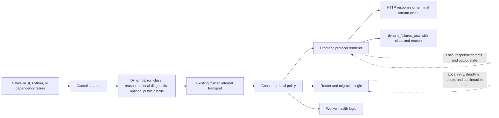

The architecture has one semantic contract and multiple consumers. Each consumer combines the immutable error with state it already owns. There is no assembled cross-component `FailureContext`.

## Responsibility boundaries

| Component | Must do | Must not do |
|---|---|---|
| Request decoder and validator | Produce an explicit `InvalidRequest` reason for client-caused input failures. | Let framework validation exceptions fall into a generic 500 path. |
| Chat-template and preprocessing adapters | Distinguish client input errors from invalid operator configuration. | Classify every template exception as the same failure. |
| Backend adapters | Convert typed engine failures at the nearest boundary and capture bounded diagnostics when useful. | Send an HTTP status or rely on free-form text for the primary classification. |
| Runtime wrappers and internal transport | Preserve the semantic class and reason. | Replace an existing classification by scanning message text or arbitrary JSON. |
| Retry and migration manager | Use its existing local budget, deadline, replay, pinning, sequence, and continuation state to decide whether another attempt is safe. | Read retry permission from `DynamoError` or require a shared `FailureContext`. |
| Worker health logic | Combine the reason with local worker and pool observations. | Quarantine a worker solely from a generic status code. |
| Frontend renderer | Use local commit state and protocol rules to render a safe result and record the terminal failure. | Expose `Diagnostic` or attempt to change an already-committed HTTP status. |

## Retry and continuation behavior without `FailureContext`

Removing `FailureContext` does not remove retry safety. It leaves each fact with its authoritative owner:

- `RetryManager` already owns retry budget, overall and attempt deadlines, request pinning, retained input, replay support, sequence limits, and continuation reconstruction.
- A pre-output failure may be retried only when the existing retry policy and local state permit it.
- Dynamo continuation migration after partial output remains valid only for request shapes explicitly supported by `RetryManager`; a blanket rule forbidding retry after all visible output would break supported migration.
- A semantic error does not claim that replay is safe and does not carry a retry-after hint.
- Recovered attempts do not increment the final frontend failure counter.

## Streaming behavior

| Response phase | HTTP status mutable | Required behavior |
|---|---:|---|
| Before commit | Yes | Render the class-derived protocol status and safe error body. |
| After commit | No | Emit the protocol's legal terminal error event, or close without additional delivery when none exists. |

After a terminal error, the renderer must not emit the protocol's success sentinel. Bounded pre-commit buffering may remain as a temporary legacy adapter with a total deadline, bounded frames, exact replay order, configuration, and removal telemetry.

## Internal propagation and compatibility

Dynamo processes are inside one administrative trust boundary, so the existing transport carries serialized `DynamoError` directly. A second wire type adds no value here.

The new reader accepts legacy `error_type` as an alias for `class`, `message` as an alias for `diagnostic`, and `public_details` as an alias for `public`. A missing legacy reason is derived from the class. Legacy origin, retry advice, and serialized cause fields are ignored.

The new writer emits only `class`, `reason`, and present optional fields. Because an old reader may require `error_type` and `message`, rollout must be coordinated:

1. Deploy readers that accept both legacy and minimal representations.
2. Confirm every mixed-version internal edge has an upgraded reader.
3. Enable minimal writers.
4. Remove legacy aliases after the compatibility window and mixed-version tests pass.

This is intentionally reader-first rather than dual-writing extra schema fields indefinitely. The target writer in `bis/dynamo-error` is not safe for an ordinary mixed-version rolling deployment by itself: it may be enabled only after a reader-only prerequisite is present on every receiving process, or as part of an explicitly approved atomic upgrade. Old-reader/new-writer incompatibility is a release gate, not a tolerated runtime fallback.

## Frontend rendering mechanism

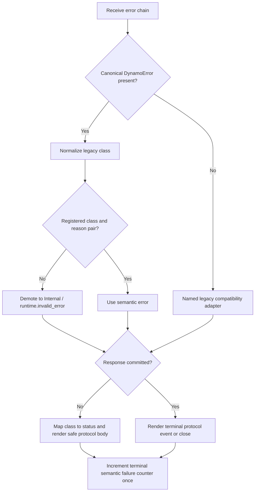

Compatibility adapters are explicit and temporary. Arbitrary JSON-looking data is never interpreted as an error signal. Diagnostics are logged privately at an appropriate level but are not copied to a response.

## Observability

The only new metric in this simplified design is:

```text
dynam_failures_total{class,reason}
```

Rules:

- Increment once when the frontend renders a final canonical semantic failure.
- Do not increment for an internal attempt that subsequently recovers.
- Do not increment for `Cancelled` when the client has disconnected and no response is rendered.
- Use the normalized class and a registered reason only; never derive semantic identity from the rendered HTTP status.
- Never use diagnostic text, request IDs, model names, URLs, exception types, or user input as labels.
- Existing attempt, retry, request, and stream metrics remain separate and are not duplicated into this counter.
- Logs and traces may carry request-scoped identifiers and allowlisted component context; those values do not belong in the semantic payload or metric labels.

This single counting point prevents the same propagated error from being counted independently by backend, runtime, router, and frontend layers.

## Sequence examples

### Request validation returns 400

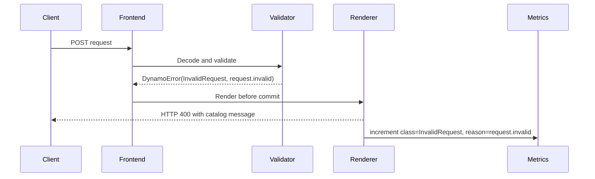

The diagnostic may contain bounded operator detail, but the response message comes from the catalog.

### Backend overload retries and succeeds

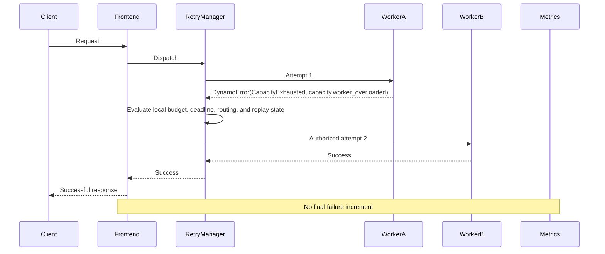

The error carries semantic identity only. The retry manager, not the error, decides that a second attempt is safe.

### Backend fails after stream commit

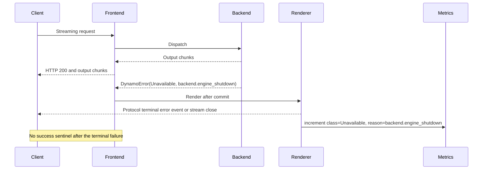

The already-sent HTTP 200 is not rewritten. The semantic class still records the final failure.

## Payload examples

### Invalid client request

```json
{
  "class": "InvalidRequest",
  "reason": "request.invalid",
  "public": {
    "type": "context_length",
    "limit": 8192,
    "actual": 9216
  }
}
```

### Backend unavailable with private diagnostic

```json
{
  "class": "Unavailable",
  "reason": "backend.engine_shutdown",
  "diagnostic": "engine response channel closed"
}
```

The diagnostic crosses trusted internal boundaries but is excluded from the public protocol response.

### Minimal internal error

```json
{
  "class": "Internal",
  "reason": "runtime.unclassified"
}
```

No diagnostic or public details are required.

## Implementation plan

### Phase 0: characterize behavior

- Record representative current behavior for validation, template, configuration, routing, capacity, timeout, backend, dependency, cancellation, and stream failures.
- Maintain security-forbidden tests for diagnostic leakage and JSON-looking application data.
- Inventory remaining message-prefix, exception-type, status, and cause-chain classifiers.

### Phase 1: common Rust semantic model and frontend bridge

- Add the four-field `DynamoError`, bounded `Diagnostic`, closed `PublicDetails`, canonical classes, and catalog-backed reasons.
- Accept legacy serialized aliases during the reader-first migration.
- Add total class-to-HTTP policy and safe OpenAI rendering.
- Preserve protocol terminal error behavior and success-sentinel suppression.
- Add `dynam_failures_total{class,reason}` at the frontend semantic render point.

Branch status: implemented on local branch `bis/dynamo-error` at signed commit `15aae48a76`. The branch includes the minimal runtime schema, fail-closed readers and consumers, explicit semantic classification for OpenAI and Anthropic frontend funnels, diagnostic-safe unary rendering, typed terminal SSE rendering, once-per-delivered-terminal stream accounting, frontend JSON/content/body validation funnels, backend message sanitization, reason-aware migration, and inner-cause telemetry. Semantic metrics consume `class + reason` directly and do not reverse-map HTTP status.

Local validation: `cargo check -p dynamo-runtime -p dynamo-llm --no-default-features --tests` passes; the complete `dynamo-llm` library suite passes with 2,438 passed and 3 ignored; the focused runtime error suite passes 19 tests; focused OpenAI, Anthropic stream, disconnect, and migration suites pass 130, 2, 13, and 29 tests respectively.

### Phase 2: producer and transport integration

- Add typed adapters for request validation, chat-template input, operator configuration, router, backend, dependency, timeout, and capacity failures.
- Bind the same contract into Python and preserve it across PyO3 and internal transport boundaries.
- Deploy compatible readers before minimal writers.
- Add mixed Rust/Python and mixed-version integration tests.

### Phase 3: retry, health, and protocol completion

- Audit every retry and migration consumer to use semantic class/reason plus its existing local state.
- Audit worker-health actions for reason-specific behavior.
- Complete protocol-specific pre-commit and post-commit rendering tests for OpenAI, Anthropic, KServe, realtime, and other exposed surfaces.
- Confirm recovered attempts do not increment the final failure metric.

### Phase 4: remove legacy inference

- Remove named message-prefix, cause-chain override, status-only, and legacy comment adapters after telemetry shows no callers.
- Remove bounded pre-commit buffering when structured terminal errors are universal.
- Remove deserialization aliases after the supported mixed-version window.

## Validation matrix

| Area | Required proof |
|---|---|
| Schema | Serialization contains exactly the two required fields plus only present optional fields. |
| Catalog | Unknown and class-mismatched reasons fail closed without increasing label cardinality. |
| Compatibility | New readers accept legacy aliases; old-reader/new-writer is explicitly rejected until the reader-only prerequisite or atomic-upgrade gate is satisfied. |
| HTTP | Every canonical class has one expected pre-commit status or no-delivery outcome. |
| Sanitization | Private diagnostics never appear in public response bodies, headers, or stream frames. |
| Metrics | The family name is exactly `dynam_failures_total`; labels are exactly `class` and `reason`; one render increments once. |
| Retry | A recovered attempt has no final failure increment; local replay and continuation guards remain authoritative. |
| Streaming | Post-commit failures use legal terminal behavior and never emit a success sentinel. |
| Python | Representative Python exceptions become the same semantic payload and frontend result as equivalent Rust errors. |

## Acceptance criteria

- `DynamoError` has exactly `class`, `reason`, optional `diagnostic`, and optional `public` as semantic fields.
- No `FailureContext`, wire-specific semantic type, origin, retry hint, side-effect quota, transience, or serialized cause is added to the payload.
- Every emitted reason is catalog registered and class consistent.
- Frontend mappings are exhaustive and diagnostics are sanitized.
- The new Prometheus family is exactly `dynam_failures_total{class,reason}` with bounded values and one terminal counting point.
- Existing retry and continuation behavior remains owned by current local components.
- Reader-first deployment gating protects upgrades; the minimal writer is not enabled in a mixed fleet until old-reader/new-writer compatibility is no longer required.
- Named legacy inference paths have measurable removal criteria and no arbitrary JSON data is classified as an error.


## 评论 (4)

### biswapanda · 2026-09-04

## Design addendum: request-state decisions and operability

This addendum expands the recommended target architecture with the live request state used for retry and rendering decisions, concrete sequences, and the observability contract. It does not change the canonical `DynamoError` proposal.

## Recommended target architecture

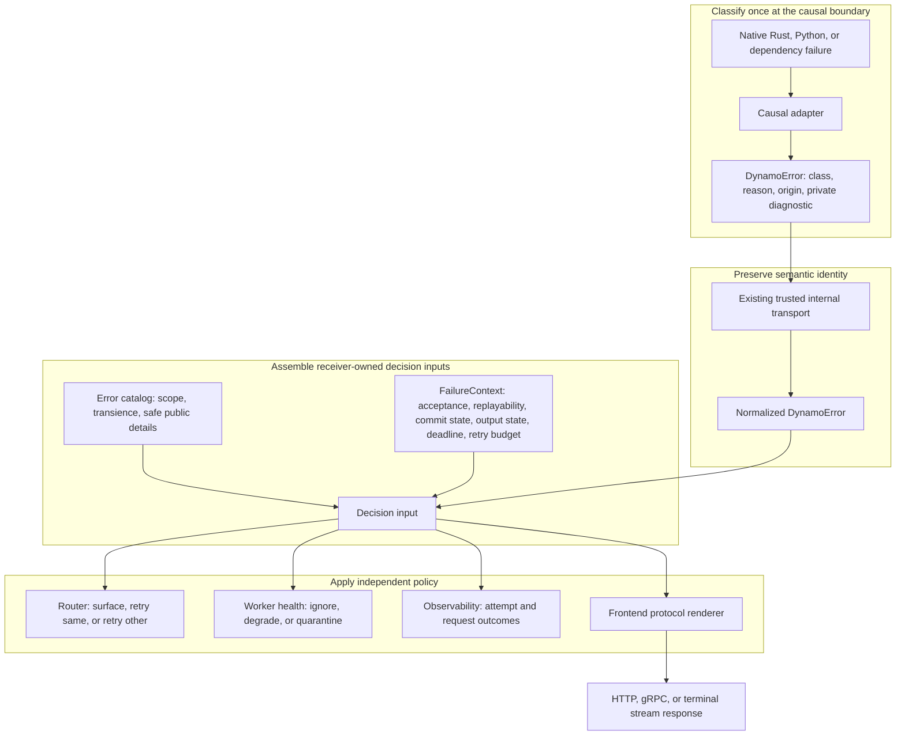

`DynamoError` answers **what failed** and keeps that identity stable while the failure propagates. `FailureContext` answers **what is safe and possible now** for this request. The catalog answers **what Dynamo policy applies to this known error identity**. Keeping these inputs separate prevents a backend from making a stale retry or HTTP decision and allows the same `CapacityExhausted` error to be retried before output but terminated safely after output.

`FailureContext` is assembled at the decision point from authoritative request state:

| Field | Meaning | Primary use |
|---|---|---|
| `acceptance` | Whether the previous worker definitely did not accept work, may have accepted it, or accepted it | Prevent duplicate live work; unknown or possible acceptance does not authorize retry |
| `replayable` | Whether the request can be safely reconstructed and replayed | Prevent retry when request data or semantics cannot be reproduced safely |
| `response_committed` | Whether the external protocol status and headers are fixed | Select a normal pre-commit response versus protocol-legal terminal behavior |
| `client_output_emitted` | Whether any client-visible token, byte, or frame has been emitted | Hard retry prohibition after visible output |
| `remaining_deadline` | Time left in the end-to-end request deadline | Avoid retries that cannot complete within the caller's budget |
| `retry_budget_remaining` | Number of policy-authorized attempts still available | Bound retry amplification and latency |

The router reads `DynamoError`, its catalog entry, and `FailureContext` together. A transient or capacity classification is necessary evidence but never sufficient permission to retry. Retry dispatch and the first client-visible write revalidate the same request state under one guard so that output cannot race with a retry decision. `FailureContext` is not propagated as durable error identity and is not trusted when supplied by a producer.

## Sequence examples

### Invalid request before response commit

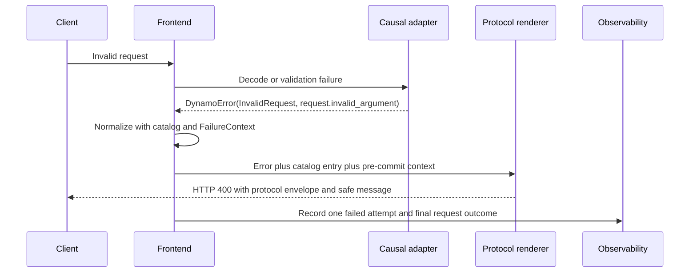

The frontend classifies the failure because it owns request decoding. Private diagnostics remain in logs and traces; only catalog-approved public details reach the client.

### Backend capacity failure with a safe retry

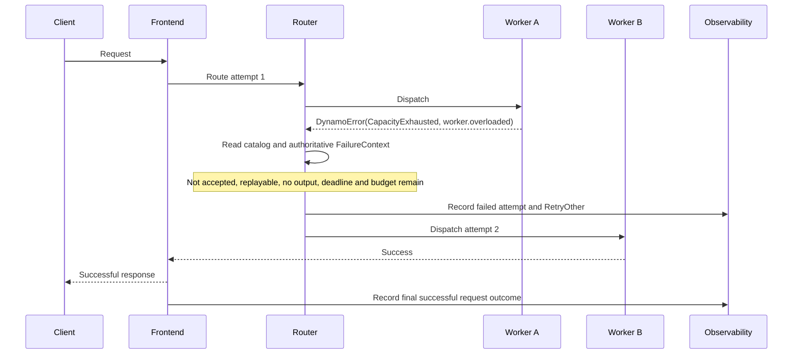

If acceptance is unknown, replayability is unknown, the deadline is exhausted, the retry budget is zero, or client output has been emitted, the router does not retry. If the response is still uncommitted, the frontend surfaces the normalized 503 response; if it is committed, it uses the protocol's terminal behavior.

### Stream failure after client-visible output

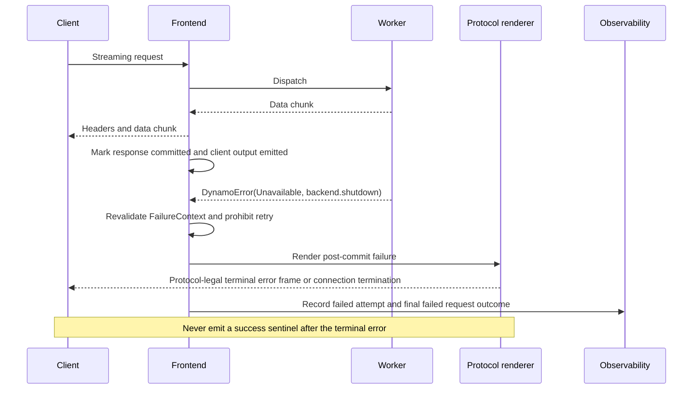

Cancellation before delivery returns `NoDelivery`. Cancellation after commit uses the protocol's terminal or connection-close behavior. HTTP 499 is an access-log outcome only and is never sent as a response status.

## Observability

Observability must distinguish an individual attempt from the final client request. A retryable failed attempt followed by success increments one failed-attempt counter and one successful-request counter; it must not count as a failed client request.

### Structured attributes

Use bounded attributes shared by logs, metrics, and traces:

| Attribute | Purpose |
|---|---|
| `error.class` | Coarse semantic class |
| `error.reason` | Stable catalog reason |
| `error.origin` | Subsystem that classified the failure |
| `error.scope` | Request, worker, dependency, or service impact from the catalog |
| `error.transient` | Catalog-derived transience |
| `request.outcome` | Final success, failure, cancellation, or no-delivery outcome |
| `attempt.outcome` | Per-attempt success, failure, cancellation, or timeout outcome |
| `retry.action` | Surface, retry-same, retry-other, or none |
| `retry.blocked_reason` | Acceptance, replayability, output, deadline, budget, or policy gate |
| `response.committed` | Whether normal status rendering was still possible |
| `client_output_emitted` | Whether retry was prohibited by visible output |
| `legacy.classifier_source` | Named compatibility adapter used during migration |

Request IDs and trace IDs belong in logs and trace context, not metric labels. Native exception names, diagnostics, prompts, generated text, credentials, raw URLs, upstream response bodies, and user-controlled values must never be metric labels.

### Metrics

- `dynamo_error_attempts_total{class,reason,origin,scope,protocol}` counts failed execution attempts.
- `dynamo_request_outcomes_total{outcome,class,reason,protocol}` counts exactly one terminal outcome per client request; class and reason are set only for failed outcomes.
- `dynamo_error_retries_total{action,reason}` counts retry decisions and their bounded reason.
- `dynamo_error_retry_blocked_total{blocked_reason,class}` counts why an otherwise eligible failure was surfaced.
- `dynamo_stream_terminal_errors_total{protocol,class}` counts post-commit terminal errors.
- `dynamo_error_invalid_contract_total{violation}` counts unknown reasons, missing catalog entries, invalid public details, and malformed internal values.
- `dynamo_error_legacy_classifications_total{source}` counts remaining compatibility classification.
- `dynamo_error_classification_divergences_total{legacy_class,semantic_class}` supports shadow migration using bounded class enums.
- Histograms record attempts per request, retry delay, and time from request start to final outcome.

### Logs and traces

- Log one structured event for each failed attempt and one for the final request outcome. Include the semantic fields, retry decision, commit state, request ID, and trace ID.
- Keep `diagnostic` and native causes server-side with existing redaction and size bounds. Public renderers accept only closed safe-detail types and catalog messages.
- Model each attempt as a child span of the request span. Record retries as span events or linked attempt spans, and set the final status on the request span exactly once.
- Record worker-health action independently from retry action so a surfaced request failure does not silently imply worker quarantine.

### Alerts and migration exit gates

- Alert on sustained increases in `Internal`, `runtime.invalid_error`, unknown reasons, or invalid-contract violations.
- Treat retry-after-client-output, concurrent retry while prior acceptance is uncertain, terminal-error-followed-by-success, and diagnostic-sentinel exposure as invariant violations with a target of zero.
- Review semantic-versus-legacy divergences by bounded class and named adapter before cutover.
- Remove a compatibility adapter only after its use counter and unexplained divergence counter remain zero for the agreed observation window.
- Dashboard attempt failure rate separately from final request failure rate, and break down both by class, reason, origin, protocol, and backend using bounded dimensions.

This structure keeps error propagation generic across frontend and backend processes while centralizing retry safety, protocol rendering, health policy, and observability at the components that own those decisions.


### biswapanda · 2026-09-05

## Revision: minimal semantic error contract

This revision supersedes the earlier `FailureContext` addendum and the corresponding schema and observability sections in the issue body.

### Changelog

- Remove `FailureContext` entirely; do not replace it with another shared context structure.
- Reduce `DynamoError` to `class`, `reason`, optional `diagnostic`, and optional `public`.
- Remove origin, retry-after hints, transience, side-effect quota, and serialized causes from the semantic payload.
- Keep retry, deadline, replay, continuation, response-commit, stream-output, and worker-health state with the components that already own it.
- Replace the proposed metric family with one counter: `dynam_failures_total{class,reason}`.
- Require every reason to be a bounded catalog key so the `reason` label cannot gain unbounded cardinality.

### Minimal schema

```rust
pub struct DynamoError {
    pub class: ErrorClass,
    pub reason: ErrorReason,
    pub diagnostic: Option<Diagnostic>, // Optional captured source for operators
    pub public: Option<PublicDetails>,
}
```

| Field | Purpose | Invariant |
|---|---|---|
| `class` | Coarse semantic category used for exhaustive client transport policy. | Closed enum; legacy variants normalize before policy and metrics. |
| `reason` | Stable cause used for catalog lookup and metrics. | Registered bounded key owned by exactly one normalized class. |
| `diagnostic` | Optional bounded operator-only occurrence detail or captured source text. | Maximum 4 KiB; never public and never a metric label. |
| `public` | Optional actionable client-safe data. | Closed enum with no free-form prose or sensitive fields. |

Unknown, malformed, or class-mismatched reasons fail closed to `Internal/runtime.invalid_error`; public details are cleared and a bounded diagnostic may be retained.

### Recommended target architecture


There is one cross-process semantic contract. Consumers combine the immutable error with state they already own; no assembled cross-component context is required.

### Local state ownership

| Owner | Local state and decision |
|---|---|
| Retry and migration manager | Retry budget, deadlines, pinning, retained input, replay support, sequence limits, continuation reconstruction, and whether another attempt is safe. |
| Frontend renderer | Whether HTTP is committed, whether output was emitted, which terminal error event is legal, and whether a success sentinel must be suppressed. |
| Worker health logic | Worker and pool observations used with the semantic reason to decide health actions. |

Continuation migration after partial output remains allowed only for request shapes already authorized by the retry manager. `DynamoError` neither grants replay permission nor carries retry advice.

### Observability

```text
dynam_failures_total{class,reason}
```

- Increment once when the frontend renders a final canonical semantic failure.
- Do not increment for a failed internal attempt that subsequently recovers.
- Do not increment a disconnected-client cancellation when no response is rendered.
- Use normalized classes and registered reasons only.
- Never place diagnostic text, request IDs, model names, URLs, exception types, or user input in labels.
- Existing attempt, retry, request, and stream metrics remain separate.

A single frontend terminal counting point prevents the same propagated error from being counted independently by backend, runtime, router, and frontend layers.

### Sequence: invalid request

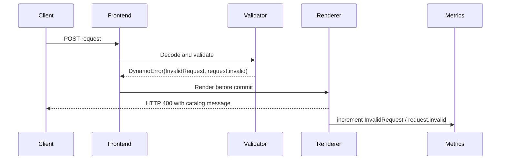

### Sequence: overload retries and succeeds

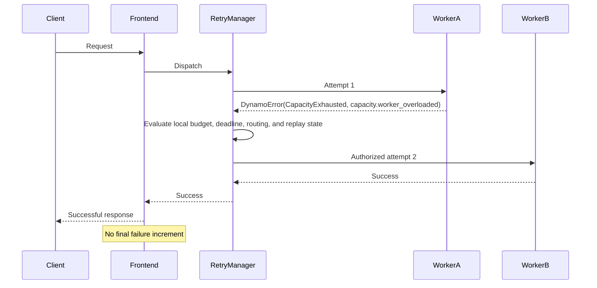

### Sequence: post-commit backend failure

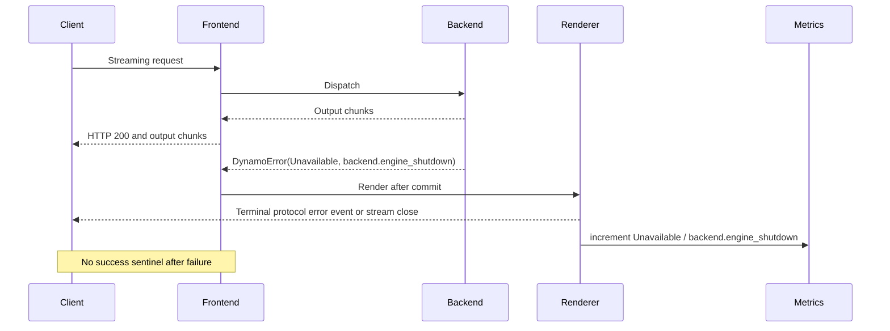

### Compatibility and rollout

The new reader accepts legacy `error_type`, `message`, and `public_details` aliases and derives a missing legacy reason from the class. The minimal writer emits only the four schema fields. Rollout is reader-first because old readers may require legacy fields: deploy compatible readers, verify mixed-version edges, enable minimal writers, then remove aliases after the compatibility window.

### Updated acceptance criteria

- The semantic payload has exactly the four fields above, with the last two optional.
- `FailureContext` and all removed policy or execution fields are absent from the contract.
- Every emitted reason is catalog registered and class consistent.
- Client status mappings are exhaustive and diagnostics remain private.
- The metric family is exactly `dynam_failures_total` with exactly `class` and `reason` labels and one terminal counting point.
- Existing retry and continuation algorithms remain authoritative through their local state.
- Pre-commit errors render the class-derived status; post-commit errors use a legal terminal event or close and never emit a success sentinel.


### biswapanda · 2026-09-05

## Implementation PR

The approved minimal four-field error-handling design is implemented in [PR #14382](https://github.com/ai-dynamo/dynamo/pull/14382).

The PR includes the unified semantic contract, class/reason-only failure metric, OpenAI and Anthropic unary/stream rendering, diagnostic sanitization, exact-once accounting, and migration updates. The reader-first or atomic-upgrade gate remains required before enabling the minimal writer in a mixed-version deployment.

### biswapanda · 2026-09-21

2 PRs were merged to main adding unified error handling

https://github.com/ai-dynamo/dynamo/pull/14395
https://github.com/ai-dynamo/dynamo/pull/14396
