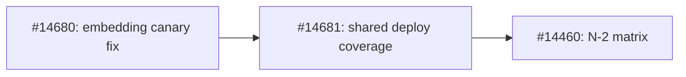

# [Issue #14685] DEP: N-2 component compatibility testing on shared deployment infrastructure

source: https://github.com/ai-dynamo/dynamo/issues/14685
state: open | updated: 2026-09-23T02:18:38Z
labels: enhancement, dynamo-deploy, deployment::k8s, dep:proposed

## 正文

## Summary

Add a component-version compatibility matrix on top of Dynamo's existing Kubernetes deployment tests. Ordinary deploy tests verify current frontend/current worker functionality; the N-2 suite reuses the same deployment examples and API checks with historical component images. The initial scope is SGLang aggregated chat and embedding, with both frontend/worker age directions against the two preceding Dynamo minor releases.

This DEP documents the design and review boundaries of three open implementation PRs: #14680, #14681, and #14460. The implementation is proposed and has local CPU validation; a successful GPU matrix is still required before claiming compatibility.

## Motivation

The original #14460 combined a backend health-check correction, missing ordinary deploy coverage, and an N-2 harness. It also introduced parallel implementations of deployment manifests, readiness polling, request validation, cache provisioning, diagnostics, and cleanup. That made the review larger and risked ordinary deploy tests and compatibility tests checking different behavior.

The split keeps each change useful on its own: fix the embedding canary, strengthen shared deployment tests, then add version selection and mixed-version execution. New API scenarios should normally be implemented once and reused where their contract applies.

## Relationship to the Existing Compatibility Contract

[DEP #9020: Operator–Runtime Version Compatibility Contract](https://github.com/ai-dynamo/dynamo/issues/9020) describes a broader operator/runtime skew policy, version-gated injection, and validation across runtimes, topologies, EPP, Planner, and operator upgrades.

This proposal supplies a focused component-mixing test capability and uses the existing runtime-version-aware operator behavior. It does not replace or complete #9020, establish a new blanket compatibility guarantee, or test the older-operator/newer-runtime direction. The operator remains the candidate version in this initial matrix.

Here, **N, N-1, and N-2 refer to Dynamo release lines**, not upstream SGLang engine releases. Each historical image contains its released Dynamo/backend stack and remains unmodified.

## Proposal

### Separate Functional Coverage from Version Selection

| Layer | Responsibility | Used by |
|---|---|---|
| Deployment examples | Canonical SGLang `agg.yaml` and `agg_embed.yaml` | Ordinary deploy and N-2 tests |
| `DeploymentSpec` | Load examples and patch images, model/cache settings, and per-component runtime versions | Both suites |
| `ManagedDeployment` | Deployment lifecycle, readiness, port forwarding, Pod manifests/image IDs, logs, and cleanup | Both suites |
| Shared API checks | Send requests through the existing client helper and validate public API responses | Both suites |
| Ordinary deploy tests | Run current frontend/current worker functionality, including the standalone frontend image | PR/nightly prerequisites; manual controls |
| N-2 suite | Select released images, generate component pairs, apply compatibility settings, and identify results by pair | Mixed-version tests |

The response contracts are shared functionality, not N-2-specific validators. Initial checks cover unary and streaming chat, completion token limits, finish reasons, stop behavior, and embedding default/float/batch responses with valid vector shape and finite values. The response validator accepts empty-string and null content for fully suppressed stops without rewriting responses. The live stop case selects an interior word from an unstopped response and requires a nonempty matching prefix ending before that word, exclusion of the stop string, a stop finish reason, and fewer completion tokens.

The readiness helper accepts an endpoint-specific request so an embedding deployment is probed with embedding input rather than a chat payload.

### Version Matrix

For the current 1.5 development line, the selected historical images are Dynamo 1.4.2 and 1.3.1:

| Frontend | SGLang worker | Scenarios | Owner |
|---|---|---|---|
| Candidate | Candidate | Chat and embedding | Ordinary deploy tests |
| Candidate | N-1 | Chat and embedding | N-2 suite |
| N-1 | Candidate | Chat and embedding | N-2 suite |
| Candidate | N-2 | Chat and embedding | N-2 suite |
| N-2 | Candidate | Chat and embedding | N-2 suite |

The N-2 suite therefore owns **eight mixed-version deployments**, not a second implementation of the candidate controls. The release catalog is explicit; advancing the candidate minor requires selecting the corresponding historical releases. A missing release entry fails setup instead of silently reducing coverage.

### Deployment and Resource Handling

Load the example DGD and patch only the settings needed for the run. In particular, set `runtimeVersionOverride` independently for the frontend and worker so the candidate operator applies defaults appropriate to each image. Initial execution uses Linux amd64, Kubernetes discovery, and TCP requests.

Use the shared model-cache PVC and a GPU-free download Job to prepare pinned chat and embedding snapshots. Mixed-version inference uses offline snapshot paths. There is no fallback PVC allocation or GPU reservation solely to place a download Pod.

Image tags identify the requested builds/releases; Pod manifests retain the actual image IDs. The GPU runner does not need an extra registry digest resolver or `kubectl exec` to inspect installed package versions.

Keep lifecycle improvements in the shared helper: fail fast on unrecoverable startup conditions, distinguish successful init-container completion after retries from failure, preserve a primary request/startup exception when cleanup also fails, and wait for both the DGD and its Pods to disappear. A compatibility failure allows other pairs to run; a cleanup failure stops the session after the current item is reported because resource isolation is no longer established.

### CI and Evidence

PR and nightly N-2 jobs depend on successful ordinary SGLang deploy tests. A skipped prerequisite does not count as a passing baseline. Manual dispatch runs the ordinary chat and embedding profiles before the mixed-version tests. The PR path honors `RUN_DEPLOY_TESTS`.

The compatibility workflow owns a dedicated vCluster, runs cases serially, and has a bounded timeout and an always-run teardown job. Missing shared-cache configuration fails before provisioning. Image access, startup, and protocol failures remain observable failures.

Retain version-pair metadata, raw requests/responses, normal deployment diagnostics, and JUnit results. CPU tests validate the harness and contracts; GPU execution validates component compatibility. Unexecuted cases provide no compatibility evidence.

The ordinary prerequisites currently use the same model IDs and request checks, but do not enforce the N-2 suite's pinned snapshot revisions. They are functional prerequisites rather than a strict experimental control. Matching snapshot revisions is required if stronger causal attribution is later claimed.

## Implementation PRs and Review Order

| Order | PR | Own changes | Dependency and reviewer focus |
|---|---|---|---|
| 1 | [#14680 — Embedding canary fix](https://github.com/ai-dynamo/dynamo/pull/14680) | Use `model`/`input` embedding payloads instead of generation-style `prompt`/`token_ids`; preserve environment overrides | Independent backend fix. Check schema and handler coverage for text/token input. |
| 2 | [#14681 — Shared deploy API coverage](https://github.com/ai-dynamo/dynamo/pull/14681) | Embedding example/profile, standalone frontend image wiring, endpoint-specific readiness, and shared API checks | Depends on #14680 for embedding deployments with active canaries. Check that ordinary deploy actually executes the new checks and that CI passes the intended images. |
| 3 | [#14460 — N-2 component matrix](https://github.com/ai-dynamo/dynamo/pull/14460) | Historical version selection, mixed-version example patching, workflow orchestration, shared lifecycle improvements, and evidence | Depends on #14681's code and examples, and transitively on #14680. Check matrix completeness, version overrides, prerequisite gates, and cleanup behavior. |

All three PRs target upstream `main`. They are currently stacked, so a later PR's full diff includes unmerged prerequisite commits. This is a Git ancestry dependency, not an intention to review the same change three times.

For the current review snapshots:

- Review #14680's normal PR diff.
- Review [#14681's own increment](https://github.com/ai-dynamo/dynamo/compare/c97491b609b2c6175159cfe2026f7634aa1be87d...f9f8150f76d5e5b1fde71fc054f92e2191884a2d).
- Review [#14460's framework increment](https://github.com/ai-dynamo/dynamo/compare/f9f8150f76d5e5b1fde71fc054f92e2191884a2d...3659ada6e54d3fb6f44b1f31c19ce0d8cff9e2ec).

Merge **#14680 → #14681 → #14460**. After each prerequisite merges, rebase the remaining branches onto the updated base, drop already-landed prerequisite commits if squash merging changed their identities, refresh these comparison links, and rerun relevant checks. Review can proceed concurrently; merge order preserves the dependencies.

## Alternate Solutions

- **Keep one monolithic PR:** combines backend correctness with testing infrastructure and obscures the scope of the N-2 framework. The three-PR split makes those boundaries reviewable.
- **Keep a standalone Docker/manifest/validator harness:** duplicates deployment definitions and lifecycle code. Shared examples and helpers reduce drift and make improvements available to ordinary deploy tests.
- **Keep private candidate controls inside N-2:** duplicates deployments while ordinary deploy remains under-tested. Strengthening ordinary deploy provides the prerequisite checks once.
- **Build the full cross-backend/topology/upgrade matrix immediately:** expands GPU spend and review scope before the shared foundation has live evidence. Extend the matrix incrementally after this initial slice is validated.

## Requirements and Acceptance Criteria

- [ ] The embedding canary correction passes the SGLang CPU regressions and the new live embedding deploy profile.
- [ ] Ordinary deploy tests exercise the standalone frontend image and shared chat/embedding checks on candidate images.
- [ ] Each of the eight mixed-version scenarios has successful GPU CI evidence, with the image pair and response artifacts identifiable.
- [ ] CPU regressions cover version selection, example patching, response contracts, startup failures, deletion waiting/timeouts, and primary-error preservation.
- [ ] Cleanup failures remain visible and prevent further allocations in the N-2 session; the outer workflow tears down its vCluster.
- [ ] The three PRs are merged in dependency order, with final descriptions and this DEP reflecting the resulting state.

The PR descriptions record 33 related local CPU tests passing across the split. The SGLang engine-dependent tests and refactored GPU matrix still need their CI evidence; results from the superseded harness are not evidence for this implementation.

## Non-Goals and Follow-up Scope

This initial implementation does not cover rolling upgrades, disaggregated KV transfer, multi-node deployments, Planner/EPP compatibility, fault recovery, performance/SLO regression, or vLLM/TensorRT-LLM version matrices. It does not change release-promotion gates or claim broad Dynamo functional coverage.

Future shared API scenarios can be reused by N-2 when supported by the selected historical versions. New features absent from an older release should not silently change the tested contract, and additional backend/topology combinations need explicit resource budgets and GPU validation.

## References

- Existing compatibility policy: [DEP #9020](https://github.com/ai-dynamo/dynamo/issues/9020).
- Review requesting the separation and shared infrastructure: [comment on #14460](https://github.com/ai-dynamo/dynamo/pull/14460#issuecomment-5623474309).
- Implementation PRs: [#14680](https://github.com/ai-dynamo/dynamo/pull/14680), [#14681](https://github.com/ai-dynamo/dynamo/pull/14681), [#14460](https://github.com/ai-dynamo/dynamo/pull/14460).

## 评论 (1)

### xianlubird · 2026-09-23

Follow-up design from [Julien's review of #14460](https://github.com/ai-dynamo/dynamo/pull/14460#issuecomment-5777557148).

This DEP's acceptance criteria remain the initial SGLang N-2 matrix. Before extending it to another backend or topology, the design should cover:

1. Explicit release ordering across major-version boundaries, instead of deriving predecessors by minor-version arithmetic.
2. Typed compatibility cases and a single scenario/model registry shared by case generation, readiness/API checks, and model preparation.
3. A capability policy that distinguishes required compatibility, unavailable features, and known incompatibilities. Expected failures should be strict and linked to issues.
4. Backend-specific deployment adapters and explicit image/runtime-version metadata where needed; move repeated DGD edits into focused `DeploymentSpec` operations as that surface grows.

These are follow-up design requirements, not new acceptance criteria for #14460. When a multi-backend extension is planned, a separate linked DEP can define its scope, resource budget, and validation criteria alongside the existing operator/runtime policy in #9020.

