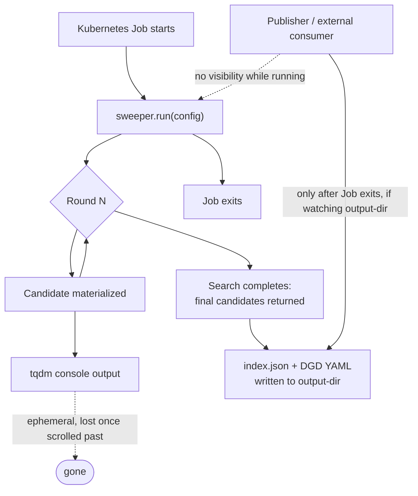

# [Issue #15002] DEP: Event schema and Unix-socket wire protocol for Sweeper Job progress and candidate outcomes

source: https://github.com/ai-dynamo/dynamo/issues/15002
state: open | updated: 2026-09-21T10:29:45Z
labels: enhancement, planner, needs-triage, dep:draft, DGDR

## 正文

## Summary
 
Define the event schema and Unix-socket wire protocol a Sweeper Job emits progress and Candidate outcomes through, so the publisher ([#13545](https://github.com/ai-dynamo/dynamo/issues/13545), item 5) can consume a live search's results without polling the Job's process state or waiting for it to exit.
 
A working, tested prototype of the *emitter* half already exists: `components/src/dynamo/profiler/v2/job_wrapper.py`, `run_and_emit()`. It calls `sweeper.run(config, on_round=...)` — the real Sweeper's own progress hook — materializes every candidate per round, and emits three event types: `search.resolved`, `round.completed`, `run.completed`. It was proven end-to-end against the real `aisimulate.sweeper.Sweeper` orchestration, not a mock, across two genuinely different parallel shapes. It was deliberately built without owning the socket transport: *"deliberately not owning the Unix socket transport itself, since that's Job/Pod plumbing untestable outside a running Job."* That gap is this DEP's scope. Separately confirmed: the standalone CLI that shipped later ([#13765](https://github.com/ai-dynamo/dynamo/pull/13765)) has zero event functionality — `sweeper.run(config)` is called with no `on_round` callback at all. This work was never superseded; it's simply unmerged.
 
Two guarantees are already designed, implemented, and tested, not open questions: a failed candidate never aborts the round (`MaterializationError` becomes `outcome='materialization_failed'` as a data value in the event, not a raised exception), and a terminal record always exists (even a Sweeper run that raises still emits `run.completed` with `outcome='failed'` before re-raising).
 
`Sweeper.run`'s real, confirmed signature — fetched directly from `aisimulate/sweeper/search.py`, not assumed — is `on_round: Callable[[int, list[Candidate]], None]`. It receives the full list of `Candidate` objects for that round, called synchronously and unguarded (no try/except, no timeout) inside the main search loop, before the loop even decides whether to continue. Two consequences: `round.completed` genuinely *could* carry much more than a bare count — keeping it minimal below is a deliberate choice, not a forced ceiling — and any slow work performed inside emission would directly stall the search itself. The Proposed Solution section below treats that second point as a hard requirement.
 
## Motivation
 
Today, a running Sweeper search is a black box to everything outside its own process. Confirmed directly against the shipped code, not assumed: `#13765`'s CLI calls `sweeper.run(config)` with no `on_round` callback at all — the only visibility into what happened during a search is the live `tqdm` console output, which is ephemeral and gone once the terminal scrolls past it. Only the final artifacts persist (`index.json` and the materialized DGD YAML files), written once, after the entire search completes.
 

 
Two concrete consequences follow from this gap:
 
- **The publisher (item 5) has nothing to consume.** It can only poll a Job's terminal state or watch a filesystem path after the fact — there is no way to react to a candidate as it's found, or to update `DGDRRun` status incrementally during a long search.
- **A failing or hung search gives no diagnostic signal until it exits.** For the DEP's own motivating case (a multi-hour search), a consumer has no way to tell "still searching, N candidates so far" from "stuck" without this stream.
`job_wrapper.py`'s `run_and_emit()` already builds the emitter half needed to close this gap — see Summary above. This DEP proposes finishing it: the wire protocol and schema below turn the right-hand dead ends in the diagram above into a live, external stream.
 
## Proposed solution
 
### Event schema
 
A common envelope wraps every event:
 
```json
{
  "apiVersion": "sweeper.dynamo.nvidia.com/v1alpha1",
  "runUID": "3f2b1a90-...",
  "sequence": 42,
  "timestamp": "2026-09-17T12:00:00Z",
  "type": "round.completed",
  "data": { }
}
```
 
- `apiVersion` — envelope schema version, so a consumer can reject or adapt to a format it doesn't recognize instead of guessing.
- `runUID` — identifies which Sweeper run (Job) this event belongs to, so events from different runs sharing infrastructure never get conflated, and a consumer can correlate a stream back to the `DGDRRun` it eventually updates.
- `sequence` — monotonically increasing per run. Authoritative for ordering; `timestamp` is wall-clock, for observability only. Lets a consumer detect gaps and supports the replay behavior below.
- `type` — one of `search.resolved`, `round.completed`, `run.completed`.
- `data` — type-specific payload.
Type-specific payloads:
 
- **`search.resolved`** — emitted once per candidate materialization outcome within a round:
```json
  {"candidate": {"spec": {...}, "experimental": {...}}, "outcome": "materialized"}
  {"outcome": "materialization_failed", "error": "..."}
```
  `candidate` matches `MaterializationResult`'s real shape (`.dgd`/`.experimental`) already produced by `materialize_dgd_from_candidate()` — no new shape invented here.
 
- **`round.completed`**:
```json
  {"round_no": 3, "cumulative_candidates": 17}
```
  Deliberately minimal, even though the real `on_round` signature (`Callable[[int, list[Candidate]], None]`) provides the full round's `Candidate` list — kept to a count here specifically to avoid duplicating what `search.resolved` already reports per candidate. Open question for review: is a bare count enough, or does the publisher need more per round (e.g. a per-round outcome tally)?
 
- **`run.completed`** — emitted exactly once, terminal:
```json
  {"outcome": "succeeded"}
  {"outcome": "failed", "error": "..."}
```
 
### Wire protocol
 
- **Backpressure: emission must never block the search.** Confirmed real and necessary, not precautionary: `on_round` is called synchronously and unguarded inside `Sweeper.run`'s main loop (see Summary). `job_wrapper.py`'s `on_round` implementation must therefore only enqueue onto a small, bounded, in-process queue — never perform the socket write itself. A separate background thread owns the actual socket I/O, draining that queue independently of the search's own progress. If the queue fills (slow or absent consumer), the oldest buffered event is dropped and a single warning is logged; the search itself never waits on the socket.
- **Framing: newline-delimited JSON (NDJSON).** One JSON object per line. Simple to stream, trivially resumable line-by-line, human-readable for debugging (`nc -U <socket> | jq`), and matches common precedent (`kubectl logs -f`-style streaming, container log drivers) rather than inventing a novel framing.
- **Socket ownership: the Job listens, the consumer connects.** The Job has a well-defined lifetime with clear start/exit hooks; the publisher may come and go independently. The wrapper creates and binds the socket before calling `sweeper.run`, and unlinks it on exit (`finally`/`atexit`).
- **Path convention (proposed, open to bikeshedding):** a fixed, well-known path within the Job's own filesystem namespace, e.g. `/tmp/dynamo-sweeper-events.sock`.
- **Reconnection / replay:** separate from the pending-write queue above, the background thread also keeps a small, bounded ring buffer of *already-sent* events (proposed starting size: 100), specifically so a consumer connecting mid-run can catch up. A consumer sends `REPLAY FROM <sequence>\n` immediately after connecting to receive everything from that point forward out of this buffer, then the live tail; a consumer that sends nothing just receives the live tail going forward.
- **Multiple consumers:** supported natively — a listening Unix socket accepts multiple concurrent client connections, each independently receiving the stream (and independently choosing whether to request replay).
This section is the actual proposal for discussion — framing, envelope fields, the path convention, and the replay buffer size are all open to being revised together, not presented as final.
 
## Alternatives considered
 
**Structured stdout, tailed via existing Kubernetes primitives.** If `job_wrapper.py` printed one NDJSON line per event to stdout instead, `kubectl logs -f` or a standard log-collector sidecar already solves streaming, persistence, and multi-consumer fan-out — all problems the socket design above has to solve itself (path convention, listen/accept lifecycle, cleanup on crash). Not proposed here because it gives up point-to-point framing and a `REPLAY FROM <sequence>` mechanism the socket design provides natively, but genuinely simpler, and worth real consideration rather than dismissal.
 
**A shared append-only file, read by a co-located sidecar.** If "Job-local" means the consumer runs alongside the Sweeper Job in the same Pod, this isn't a novel proposal — the operator already has a real, shipping mechanism for exactly this shape of architecture: [`#14657`](https://github.com/ai-dynamo/dynamo/issues/14657) ("Dynamo Sidecar Architecture"), implemented in [`#14927`](https://github.com/ai-dynamo/dynamo/pull/14927), adds a `dynamoSidecar` field that names a native `initContainer` (`restartPolicy: Always`) running for the Pod's full lifetime. A file on a shared `emptyDir` sidesteps the backpressure problem entirely (writes never block on a reader) and needs no separate replay buffer, since the file *is* the history. Not proposed as the primary design here because it constrains the consumer to same-Pod co-location, which may or may not match how item 6 ends up scheduling the publisher — worth confirming before ruling it out.
 
**OTLP logs/traces, matching Dynamo's existing observability architecture.** Dynamo already has real, mature OTLP logs/traces infrastructure, not just metrics — and a directly relevant precedent: an opt-in *"otel audit sink that exports chat-completion audit records as OTLP LogRecords"* (`DYN_AUDIT_SINKS`), and a named, versioned domain-record stream (`dynamo.request.trace.v1`). Exporting Sweeper events the same way would follow an established convention rather than invent a new one.
 
Weighed against the Unix-socket design above, this is genuinely close, not a clear win either way:
 
*In OTLP's favor* — the standard `opentelemetry-sdk`'s batch processors already implement the queue-plus-background-thread backpressure handling this DEP has to hand-design for the socket (see Proposed Solution); the debugging/tooling ecosystem (Grafana, the Collector's own inspection tools) is mature versus `nc -U <socket> | jq`; and `LogRecord`/`Span` already define timestamp and correlation-ID fields the custom envelope above reinvents.
 
*Against it* — OTLP exporters typically batch and send asynchronously, since the protocol was built for aggregating many distributed sources, not for strict single-stream ordering; the custom `sequence` field's ordering guarantee has no real OTLP equivalent, a genuine concern if the publisher's logic depends on processing rounds in order. Naively routing through Loki/Tempo (the pattern every existing Dynamo doc describes) means the publisher polls a query API rather than receiving a live push — a real latency and indirection cost for something meant to drive incremental `DGDRRun` status updates. A refined version — OTLP's wire protocol with a Collector configured to forward directly to the publisher, skipping the Loki detour — avoids that latency problem, but doesn't remove the replay-buffer design work, only relocates it into an OTLP-shaped receiver instead of the socket-shaped one already designed here. It also adds a real new dependency (`opentelemetry-sdk` in the Job's image) where the socket design needs nothing beyond the Python standard library, and a `Candidate`'s full rendered DGD spec doesn't map as cleanly onto OTLP's `body`/`attributes` shape as it does onto a plain JSON object.
 
Worth flagging directly rather than deciding unilaterally: the tracking issue's own wording is *"Job-local Unix socket,"* not "Job-local transport" — treating OTLP as in-scope here is a real reinterpretation of that wording, not just an implementation choice, and deserves `sttts`'s explicit input rather than being resolved in this document alone.
 
## Non-goals
 
- Widening `round.completed`'s payload to carry more than a count — genuinely possible given the real `on_round` signature (see Summary), but deliberately deferred here as a schema decision for review, not something this DEP resolves unilaterally.
- The consumer side (item 5's "consume events") — this DEP defines the contract the consumer will be built against, not the consumer itself.
- Updating `DGDRRun` status from these events — a separate item-5 sub-clause, blocked on the `v1beta2` CRDs being served ([#13603](https://github.com/ai-dynamo/dynamo/pull/13603)/[#13744](https://github.com/ai-dynamo/dynamo/pull/13744)), unrelated to whether this protocol is well-defined.
## References
 
- Tracking issue: [#13545](https://github.com/ai-dynamo/dynamo/issues/13545)
- Prototype: `components/src/dynamo/profiler/v2/job_wrapper.py`, `run_and_emit()` (unmerged)
- Real `on_round` signature and call site: `aisimulate/sweeper/search.py`, `Sweeper.run` (fetched directly from source)
- Sidecar precedent: [`#14657`](https://github.com/ai-dynamo/dynamo/issues/14657) (DEP), [`#14927`](https://github.com/ai-dynamo/dynamo/pull/14927) (implementation)
- Observability precedent: [`#13142`](https://github.com/ai-dynamo/dynamo/issues/13142) (OTLP metrics export); OTLP audit sink (`DYN_AUDIT_SINKS`) and the `dynamo.request.trace.v1` stream, both from the v1.4.0 release notes

## 评论 (2)

### devivasudevan · 2026-09-17

@sttts ptal.

### devivasudevan · 2026-09-21

Comparison update: event-plane approach  [#15073](https://github.com/ai-dynamo/dynamo/issues/15073) vs. this design, now that both are tested

#15073's advantages:

Reuses Dynamo's existing EventPublisher/EventSubscriber path instead of hand-rolled NDJSON framing, connection lifecycle, and a bespoke replay handshake
Multi-consumer fan-out and selective subscription come free via subject-per-event-type naming; this design would need its own multiplexing for >1 consumer
No Job-local socket-path plumbing — discovery is handled by Dynamo's existing Endpoint/EndpointId resolution
Consistent with how FPM/KV-cache event streams are already built elsewhere in Dynamo

Where this design (#15002) remains stronger:

Native replay, tested via the ring buffer — #15073's replay story is stated but not tested
No Rust/PyO3 dependency or maturin develop build step — pure Python, works end-to-end today
No etcd dependency for discovery — #15073 needs a discovery backend even when using ZMQ for the actual transport; this design needs neither etcd nor NATS

Correction to an earlier concern raised against #15073: it does not carry a conditional NATS dependency under Kubernetes/etcd discovery. Confirmed from DiscoveryBackend::resolve_event_transport_kind() (lib/runtime/src/distributed.rs) and verified empirically: ZMQ is the default transport for every discovery backend (file/mem/etcd/kubernetes); NATS only activates if an operator explicitly sets DYN_EVENT_PLANE=nats. So under default settings, #15073 adds no NATS dependency at all.

Net: with the NATS-dependency question resolved and both designs tested, the remaining gap is narrower — replay and build-step overhead. Full details and test evidence in the [#15073](https://github.com/ai-dynamo/dynamo/issues/15073).
