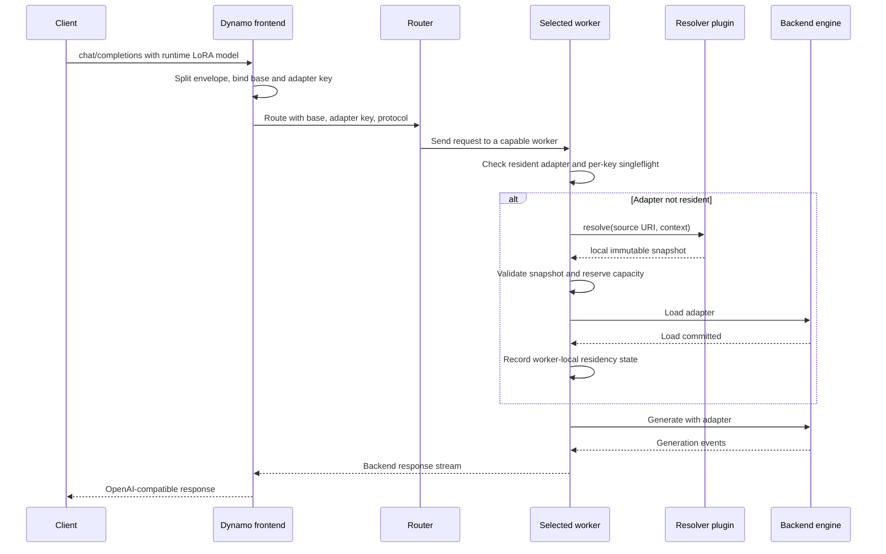

# [Issue #15018] RFC: Pluggable Request-Time LoRA Resolution

source: https://github.com/ai-dynamo/dynamo/issues/15018
state: open | updated: 2026-09-18T14:26:06Z
labels: enhancement, language::rust, backend::vllm, frontend, dep:draft, lora

## 正文

# DEP RFC: Pluggable Request-Time LoRA Resolution

## Status

- State: Draft
- DEP number: 15018
- GitHub issue: [ai-dynamo/dynamo#15018](https://github.com/ai-dynamo/dynamo/issues/15018)
- Scope owner: Frontend, shared LoRA management, and backend worker integrations
- Related issue: [ai-dynamo/dynamo#14547](https://github.com/ai-dynamo/dynamo/issues/14547)
- Baseline reviewed: `ai-dynamo/dynamo` main at `dc0f53886b03e25bdc621431967a39b4faa97d6e`

The key words **MUST**, **MUST NOT**, **REQUIRED**, **SHOULD**, **SHOULD NOT**, and **MAY** in this document are to be interpreted as described in RFC 2119 and RFC 8174 when they appear in uppercase.

## Summary

This RFC proposes a backend-neutral, plugin-based mechanism for resolving and loading LoRA adapters when an OpenAI-compatible request names an external adapter reference in `model`. The frontend recognizes either `<base-model>|<opaque-source>` or, when exactly one canonical base deployment is committed, a bare `<opaque-source>`; it validates only the bounded request envelope and binds stable internal routing metadata. The selected worker passes the opaque source to a configured plugin, which owns scheme parsing, policy validation, download, and materialization before loading the adapter through the backend's existing LoRA lifecycle. The feature is opt-in, plugin-policy-controlled, capability-aware, and fail-closed.

## Motivation

Dynamo currently supports explicit LoRA loading through the LoRA management API and then serves requests that name an already-known adapter. It does not provide the request-time resolver contract described in the earlier LoRA support draft: `DYN_LORA_DOWNLOADER_PLUGIN` is not implemented on current main, and external adapter URIs in `model` are rejected before a worker can resolve them.

This gap prevents applications that already use native vLLM resolver plugins from migrating without changing their request contract. A typical application validates an allowed URI scheme at ingress and sends either a bare adapter URI or a base-model-and-adapter identifier. Its existing worker plugin authenticates to an artifact system, resolves a revision, downloads the adapter, and returns a local path. Dynamo should support that workflow without embedding one artifact provider in the frontend or making the frontend orchestrate worker-local loads.

The architectural problem is broader than downloading. Dynamo must preserve a stable base-model identity for routing, carry an opaque and potentially sensitive source reference to exactly one selected worker, avoid serving the base model when resolution fails, coordinate concurrent cache misses, and advertise worker capabilities so mixed-version deployments cannot silently misroute requests.

## Current State

The current shared Python `LoRAManager` supports built-in `file`, `hf`, and `s3` sources and exposes `register_custom_source(scheme, source)`, but current main has no production registration path for `DYN_LORA_DOWNLOADER_PLUGIN`. The explicit load API resolves a source and invokes backend load logic, while the generation path expects routing metadata for an adapter that is already known. The Rust preprocessor already carries a LoRA name context key, and workers already publish `ModelRuntimeConfig`, providing suitable extension points for request metadata and capability discovery.

This RFC does not replace explicit `POST /v1/loras` loading. It adds a separate request-time path that reuses the same source resolution, validation, cache, capacity, and backend load primitives.

## Goals

- Accept request-time LoRA references in `model` without requiring a prior explicit load call.
- Keep external source resolution and credentials on workers.
- Provide a stable, backend-neutral plugin contract that returns a local immutable adapter directory.
- Preserve base-only and preloaded-adapter behavior.
- Route only to a worker set that uniformly advertises the runtime-LoRA protocol and one identical non-empty plugin scheme policy.
- Deduplicate concurrent resolution and load work for the same adapter identity.
- Fail closed so a requested adapter is never silently replaced by base-model inference.
- Bound resource use, redact source references, and expose actionable low-cardinality telemetry.
- Allow a compatibility adapter to wrap an existing native vLLM resolver plugin without exposing vLLM types in the Dynamo-wide ABI.

## Non-Goals

- Defining an artifact-provider-specific protocol in Dynamo core.
- Treating an arbitrary remote URL as a trusted local adapter.
- Making external adapter URIs visible through `/v1/models`.
- Having the frontend call every worker's LoRA management endpoint.
- Globally replicating every runtime-loaded adapter.
- Supporting runtime loading on backends that do not advertise the feature.
- Supporting request-time loading with disaggregated prefill/decode or coordinated, residency-aware horizontal autoscaling in protocol version 2.
- Replacing the explicit LoRA load, unload, or listing APIs.

## Terminology

- **Source URI**: The opaque external adapter reference supplied after parsing `model`.
- **Canonical base model**: The deployment's stable base-model identity used for engine selection, readiness, routing, and base-level metrics.
- **Adapter key**: A bounded, non-secret internal identifier derived from the canonical base model and exact source URI.
- **Resolver plugin**: Worker-side code that accepts a source URI and returns a validated local snapshot description.
- **Runtime adapter**: An adapter discovered through a generation request rather than an explicit LoRA management call.
- **Resident adapter**: An adapter that a worker reports as loaded and available for generation.

## Proposal

### External Request Contract

Runtime resolution is disabled unless the deployment enables it explicitly. When disabled, existing request parsing remains unchanged and an unknown value continues through the existing `model_not_found` path. When enabled, the frontend recognizes these request forms:

| Form | Meaning |
| --- | --- |
| `<base-model>` | Existing base-model request |
| `<preloaded-adapter-name>` | Existing explicitly loaded adapter request |
| `<base-model>\|<opaque-source>` | Runtime adapter with an explicit base model |
| `<opaque-source>` | Runtime adapter using the only committed canonical base model |

The parser applies the following precedence:

1. Resolve an exact known base-model name or exact known preloaded-adapter name using existing behavior.
2. If the value contains `|`, split once at the first delimiter and require non-empty base and adapter components.
3. Otherwise, treat the value as a bare runtime source only when the committed catalog contains exactly one canonical base deployment after excluding aliases and preloaded adapters.
4. Treat the source portion as an opaque string. The frontend MUST NOT parse its URI scheme or impose provider grammar.
5. Require the explicit or inferred base model to resolve to the deployment's canonical base identity.
6. Reject empty components, bounded-envelope violations, and ambiguous bare requests before routing.

The implementation MUST define finite byte limits for the complete `model` value, base component, and opaque source. The frontend MUST reject NUL, ASCII control characters, invalid UTF-8, and empty components. The delimiter is not allowed in the base-model portion. Any delimiter in the opaque source remains part of the source because parsing splits only once. The source is preserved byte-for-byte so provider-specific identity semantics are not changed. URI structure, allowed schemes, user-info, fragments, secret-bearing query parameters, and provider-specific policy are validated only by the worker plugin before any download or engine admission.

When runtime loading is enabled, explicit load APIs MUST reject new administrative aliases that match the combined or bare runtime grammar. A legacy preloaded alias that already matches the grammar retains exact-match precedence until renamed; operators MUST treat that alias as intentionally shadowing the equivalent runtime spelling.

Bare source support is enabled only while the committed catalog contains exactly one canonical base deployment. Zero-base and multi-base frontends return `runtime_lora_base_model_required` and instruct the caller to use `<base-model>|<opaque-source>`. Discovery iteration order is never used, aliases do not add candidates, and preloaded adapters are not base candidates.

The response retains the caller's original `model` value for OpenAI-compatible behavior. Engine selection, readiness, and base-level metrics use the canonical base model. Logs and metric labels never use the raw source URI.

### Internal Identity

The frontend derives an adapter key using a versioned recipe:

```text
digest = SHA-256(
    b"dynamo-runtime-lora-v1\0"
    + utf8(canonical_base_model)
    + b"\0"
    + utf8(exact_source_uri)
)
adapter_key = "dyn-lora-" + lowercase_hex(first 16 bytes of the raw digest)
```

The 128-bit suffix gives a bounded routing and telemetry identity without exposing the source URI. Implementations must publish golden test vectors for this recipe before release. Changing normalization, separators, digest input, or truncation requires a new recipe version.

The backend's positive 31-bit `lora_int_id` is a worker-local engine handle allocated from that worker's existing safe ID allocator. It MAY differ across workers and MUST NOT participate in routing, KV, prefix, prompt, or cross-worker identity. Every worker MUST maintain a bidirectional `adapter_key` to `lora_int_id` map, prevent local reuse while an adapter is resident, and fail closed rather than alias two adapters. The canonical adapter key is the only cross-worker adapter identity.

Every worker MUST recompute the full digest and adapter key from the received canonical base model and exact source URI before any residency lookup, singleflight lookup, cache lookup, or backend load. A mismatch between the supplied and recomputed key is `runtime_lora_identity_mismatch` and MUST fail closed. Frontend validation is not a worker trust boundary.

The `dyn-lora-` namespace is reserved for runtime identities. Explicit load APIs MUST reject administrative adapter names in that namespace so an explicit alias cannot shadow a runtime key.

The request metadata carries separate fields:

- `base_model_name`: canonical base identity.
- `lora_name`: the bounded adapter key used by existing LoRA-aware routing.
- `lora_source_uri`: the exact source URI, available only to the selected worker.
- `lora_resolution_version`: protocol version, initially `2`.

The source URI must not be overloaded into `lora_name`. Keeping identity and source separate prevents unbounded or credential-bearing values from entering routing keys, state trackers, logs, and metric labels.

The canonical adapter key MUST participate in every KV-block, prefix-cache, prompt-cache, and backend request identity used by a runtime LoRA request. Base-model and different-adapter cache entries MUST NOT be reusable for that request.

### Configuration Contract

| Setting | Role | Meaning |
| --- | --- | --- |
| `DYN_LORA_ENABLED` | Frontend and worker | Existing master switch for LoRA serving |
| `DYN_LORA_RUNTIME_LOAD_ENABLED` | Frontend and worker | Enables request-time parsing and load-on-miss; default `false` |
| `DYN_LORA_DOWNLOADER_PLUGIN` | Worker only | Python import reference in `module:object` or historical dotted `module.object` form |
| `DYN_LORA_ALLOWED_SCHEMES` | Worker only | Comma-separated request-time scheme allowlist enforced by the resolver boundary and advertised for homogeneous worker-set admission; no permissive default |
| `DYN_LORA_PATH` | Worker only | Existing worker-local cache root |
| `DYN_LORA_RESOLVE_TIMEOUT_SECONDS` | Worker only | Deadline for plugin resolution and materialization |
| `DYN_LORA_MAX_CONCURRENT_RESOLUTIONS` | Worker only | Process-wide bound on active resolver calls |
| `DYN_LORA_MAX_PENDING_RUNTIME_KEYS` | Worker only | Bound on distinct unresolved runtime identities per worker |
| `DYN_LORA_MAX_PENDING_ADMISSIONS` | Worker only | Independent bound on requests holding a pending adapter lease |
| `DYN_LORA_PENDING_ADMISSION_TIMEOUT_SECONDS` | Worker only | Time allowed between worker resolution and generation admission; default `30` |
| `DYN_LORA_MAX_RESIDENT_RUNTIME_LORAS` | Worker only | Bound on request-time resident adapters |
| `DYN_LORA_MAX_DOWNLOAD_BYTES` | Worker only | Maximum materialized snapshot size |
| `DYN_LORA_MAX_CACHE_BYTES` | Worker only | Admission ceiling for measured cache-root bytes plus in-flight reservations; a conforming plugin must honor its reservation, and protocol version 2 does not perform automatic disk eviction |

Every role MUST fail startup when runtime loading is enabled while `DYN_LORA_ENABLED` is false. The frontend validates the supported router mode at startup and evaluates protocol-compatible worker availability and one identical non-empty advertised scheme policy for each runtime-LoRA request. A request returns `runtime_lora_capability_unavailable` until such a worker set exists; base and preloaded-adapter readiness are unaffected. A capable worker additionally validates engine LoRA support, plugin import and protocol shape, declared scheme intersection, cache root, resource bounds, backend admission settings, and a token-mode request path that can carry the adapter into generation. The frontend MUST NOT import the worker plugin or provider SDK and MUST NOT parse the opaque source to select a scheme.

Built-in explicit-load schemes do not become request-time schemes automatically. In particular, `file`, `hf`, and `s3` are accepted at request time only when they are explicitly allowlisted and backed by a runtime resolver satisfying this RFC. A request-time `file` resolver MUST confine all references to configured roots; an unconfined local path scheme is prohibited.

The configured object may be a resolver instance, a resolver class with a zero-argument constructor, or a factory returning a resolver. Dynamo resolves that variability once during worker startup and validates the resulting object. The two import syntaxes are aliases for the same object and MUST NOT trigger module discovery or filesystem scanning.

### Backend-Neutral Plugin Protocol

The normative contract is async and contains no backend-specific types. This contract is authoritative; the two companion implementation plans must be realigned to this exact shape before coding:

```python
from dataclasses import dataclass
from pathlib import Path
from typing import Mapping, Protocol

@dataclass(frozen=True)
class ResolveContext:
    adapter_key: str
    base_model_name: str
    cache_root: Path
    deadline_monotonic: float
    max_download_bytes: int
    request_id: str

@dataclass(frozen=True)
class ResolvedLoRA:
    local_path: Path
    source_revision: str
    size_bytes: int | None = None
    metadata: Mapping[str, str] | None = None

class RuntimeLoRAResolverProtocol(Protocol):
    protocol_version: int

    @property
    def schemes(self) -> frozenset[str]: ...

    async def resolve(
        self, *, source_uri: str, context: ResolveContext
    ) -> ResolvedLoRA | None: ...
```

Returning `None` means that this resolver did not handle or find the source and permits the manager to continue through the registered resolver chain. Exhausting the chain produces `lora_not_found`. Resolver unavailability or authorization failure MUST raise a typed exception and MUST NOT be converted to `None`.

A successful resolver MUST return a local directory containing a complete snapshot and an immutable `source_revision`. Protocol version 2 accepts only sources that the plugin can bind to an immutable provider version or content digest; it rejects movable aliases and any reference whose immutability the plugin cannot establish before returning. The plugin MUST deterministically validate that the returned `source_revision` represents the immutable source named by the opaque reference. Dynamo does not contact the provider on a resident fast path. A provider that can rebind an accepted immutable source does not satisfy this protocol and MUST NOT be configured. Mutable alias support requires a future protocol with a revised routing, engine, and KV identity design.

Returning a path or metadata does not establish trust. Dynamo canonicalizes the path, measures the materialized tree itself, and validates containment, file types, adapter configuration, tensor metadata, measured size, base compatibility, rank, target modules, and backend limits before load. The plugin is responsible for binding the opaque reference to the returned immutable `source_revision`; Dynamo records that revision and verifies resident reuse against the exact request identity. Plugin-provided `size_bytes` and `metadata` are advisory and untrusted.

The plugin owns provider authentication, immutable revision lookup, network download, atomic publication, temporary-state cleanup, provider-specific cache validation, and enforcement of `ResolveContext.max_download_bytes` while it writes. Dynamo owns admission policy, deadline enforcement, cancellation, concurrency, cache reservations, post-return cache measurement, cache-root containment, engine compatibility validation, lifecycle locking, capacity accounting, backend load, residency reporting, and error translation. Dynamo MUST cancel the resolver task when the deadline expires. Resolvers MUST propagate `asyncio.CancelledError`, clean temporary state, and never translate cancellation into a miss. A compatibility wrapper around a synchronous provider SDK MUST offload blocking calls from the worker event loop. Because the plugin is trusted in-process Python code, Dynamo cannot sandbox it or roll back bytes written by a plugin that ignores its reservation; it detects the overrun after return and fails the request.

Plugin exceptions are translated to a small Dynamo error taxonomy rather than returned directly to the client. Optional provider details belong in redacted debug logs, not in public errors.

### Native vLLM Compatibility Adapter

A backend package may provide an adapter that wraps the native vLLM resolver interface and converts its result into `ResolvedLoRA`. This is a compatibility feature, not the Dynamo core ABI.

The adapter must:

- Instantiate the configured native resolver inside the vLLM worker image.
- Pass the canonical base model and provider reference expected by native `resolve_lora(base_model_name, lora_name)`.
- Await synchronous or asynchronous native results without blocking the event loop.
- Convert a native result to a local snapshot path and required immutable source revision.
- Apply the same containment, size, content, and compatibility validation as every other Dynamo resolver.
- Avoid importing vLLM from shared frontend or backend-neutral packages.

Custom aliases such as `artifact-store://` are supported only when a plugin explicitly declares them and the operator allowlists them. Dynamo does not infer aliases or rewrite one provider scheme into another.

### Capability Advertisement

Workers publish optional runtime LoRA capability data in `ModelRuntimeConfig`:

```json
{
  "supports_runtime_lora_resolution": true,
  "runtime_lora_protocol_versions": [2],
  "runtime_lora_schemes": ["custom-artifact"]
}
```

Absence or false `supports_runtime_lora_resolution` means unsupported. The frontend must not infer support from deployment environment variables alone. A worker MUST advertise only protocol versions implemented by its loaded plugin and backend integration. For protocol version 2, the frontend routes only among healthy workers for the canonical base model that advertise version 2. Because the source is opaque to Rust, all eligible workers in the selected worker set MUST advertise one identical non-empty scheme set; heterogeneous plugin policy fails closed instead of attempting per-request scheme routing.

This rule is required for mixed-version rollouts. If old and new workers coexist, runtime requests route only to capable workers; if none are capable, the frontend returns an explicit capability error and never falls back to base inference.

### Request Flow



The frontend never invokes `POST /v1/loras` on workers and does not store a loaded-source registry. Resolution occurs only on the worker selected for that request. Pre-dispatch failover to another capable worker is permitted only before any worker accepts the request; the opaque source may remain in memory only for that in-flight attempt. After worker acceptance, protocol version 2 does not automatically replay the request to a different worker, regardless of whether provider work has begun; the caller may issue a new request under the ordinary retry policy.

### Routing and Residency

Protocol version 2 chooses exactly one capable worker deterministically using highest-random-weight selection over `adapter_key` and the eligible worker set. Concurrent and subsequent requests for the same key therefore converge on one worker without publishing a per-adapter residency record. The router does not spill a runtime adapter to another worker when that pinned worker is overloaded, so per-adapter throughput is bounded by one worker and callers can receive `lora_capacity_exceeded` while other workers have capacity. A membership change may remap the key and cause a cold load on the newly selected worker. Private residency-aware spillover or replication requires a later protocol with a bounded residency signal and coordinated cache identity.

Runtime residency is worker-local state used for capacity accounting and eviction. It must not create a public model entry or make the external URI discoverable through `/v1/models`.

Runtime adapter keys MUST bypass the dynamic allocator, load estimator, persistent per-adapter routing tables, and per-adapter controller gauges in protocol version 2. The frontend keeps no persistent per-key admission state; it relies on bounded request concurrency and deterministic routing. Each worker MUST bound distinct in-flight resolutions with `DYN_LORA_MAX_PENDING_RUNTIME_KEYS`, bound requests holding pending adapter leases with `DYN_LORA_MAX_PENDING_ADMISSIONS`, and separately bound resident runtime adapters. This keeps the only state that can outlive frontend preprocessing next to the resolver and engine lifecycle it protects.

Protocol version 2 supports aggregated serving only. When `DYN_LORA_RUNTIME_LOAD_ENABLED=true`, workers MUST refuse capability advertisement for disaggregated prefill/decode and frontends MUST reject router modes that existing LoRA serving does not support. Horizontal scaling is permitted only as an operator-managed membership change: changing the eligible worker set can remap adapter keys, trigger additional cold loads, and temporarily duplicate worker-local residency, and protocol version 2 provides no drain-aware residency transfer or scale-down coordination. The restriction does not affect deployments with runtime loading disabled. Disaggregated or residency-aware autoscaling support requires a future protocol defining role-local resolution, cross-role identity consistency, bounded residency publication, eviction coordination, and scale-down handling.

### Worker Load Transaction

Each backend integrates a shared `ensure_runtime_lora_loaded` transaction before generation:

1. Validate that the request's protocol version matches the worker's advertised capability.
2. Re-apply bounded-envelope checks. The Python worker extracts only the leading scheme token needed for allowlisted plugin dispatch, then passes the otherwise opaque source to the selected plugin, which owns URI grammar and provider policy, including user-info, fragments, secret-bearing query parameters, and authorization.
3. Recompute the digest and adapter key from the canonical base and source URI; reject any mismatch.
4. Return the resident backend request object only after the recomputed key, canonical base, exact source URI, and recorded immutable revision are consistent with resident state; this check is local and does not contact the provider.
5. Apply distinct-cold-key admission and process-wide concurrency limits before provider work; provider authorization is enforced inside the selected plugin before download.
6. Join or create a bounded per-`adapter_key` singleflight operation owned by the worker rather than by its initiating request.
7. Resolve and materialize the source outside backend lifecycle locks.
8. Validate the returned path, measured contents, immutable revision, adapter metadata, and KV identity inputs.
9. Acquire the existing lifecycle lock, recheck residency, reserve capacity, and evict only an eligible runtime-loaded adapter when required.
10. Load the adapter through the backend's existing dynamic LoRA API.
11. Commit the adapter key, integer ID, local path, immutable revision, and residency state atomically.
12. Release reservations, singleflight state, and incomplete materialization on failure or cancellation.
13. Generate only after a valid backend LoRA request object exists.

Network or disk operations must not run while holding the backend's striped lifecycle lock. The resolution singleflight map and the load/unload lifecycle lock are separate synchronization domains. Waiters observe the same success or typed failure, and abandoned singleflight entries are removed.

The shared singleflight task uses a worker-owned deadline derived from `DYN_LORA_RESOLVE_TIMEOUT_SECONDS`, not the initiating request's deadline. Cancellation or disconnect of one waiter detaches only that waiter and MUST NOT cancel shared work while another waiter remains. When no waiters remain, the worker MAY cancel the task and MUST perform the same cleanup as any other cancellation.

The transaction must reuse the same capacity and eviction accounting used by explicit loads, but request-driven admission MUST NOT evict an administratively loaded adapter. Administrative aliases and runtime URI identities are distinct logical adapters even when they resolve to identical bytes; they may share immutable disk content but consume distinct engine slots and never alias engine or KV identity. Before invoking the plugin, Dynamo measures the cache root and reserves at most the remaining `DYN_LORA_MAX_CACHE_BYTES` capacity. The plugin MUST treat `ResolveContext.max_download_bytes` as its write ceiling; a zero reservation permits only a cache hit that writes no bytes. Dynamo measures the cache again after resolution and fails the request with `lora_capacity_exceeded` when the ceiling is exceeded, but trusted in-process plugin code can consume disk before that check and Dynamo cannot undo the write. Protocol version 2 deliberately does not delete resolver materializations from Dynamo core because the plugin ABI does not expose ownership or loaded-path reference counts. Every successful path is pinned for the worker process lifetime, and cleanup occurs only after the worker is drained or stopped. A plugin MUST NOT delete or mutate a path after returning it. Ownership-aware online reclamation requires a future ABI that identifies plugin-owned entries and consults active backend references. Partial downloads use a plugin-owned private temporary directory and become visible through an atomic rename only after validation succeeds.

Protocol version 2 does not persistently cache resolver misses. An optional future negative cache requires a bounded entry count, short TTL, explicit metrics, and error-class rules that do not conceal recovery from authentication or dependency failures.

### Streaming Semantics

Runtime resolution and backend load can fail after routing. Only runtime LoRA streaming requests MUST use pre-commit behavior equivalent to `UntilFirstEvent`: do not commit a success status or stream headers until adapter resolution, load, and the first generation event succeed. Base and preloaded-adapter requests retain their configured pre-commit behavior. A failure before commitment returns the normal structured error response; later generation failures follow existing streaming error behavior. Operators MUST configure ingress and client deadlines longer than the resolver deadline plus backend load and first-event budgets so Dynamo, rather than an intermediary, returns the typed timeout.

### Error Contract

The frontend parse path and worker request-time resolution path define the following stable symbolic errors and map them consistently across chat and completions:

| Error code | Condition | Recommended HTTP status |
| --- | --- | --- |
| `invalid_lora_model_id` | Malformed, oversized, control-bearing, or ambiguous runtime identifier | 400 |
| `model_not_found` | Explicit base model is unknown | 404 |
| `runtime_lora_base_model_required` | A bare opaque source is ambiguous because zero or multiple canonical base deployments are committed | 400 |
| `runtime_lora_unsupported` | Runtime loading enabled with a request unsupported by the active topology or router mode | 400 |
| `unsupported_lora_scheme` | Scheme is not operator-allowlisted | 400 |
| `runtime_lora_capability_unavailable` | No healthy worker advertises the required capability | 503 |
| `lora_not_found` | Resolver chain handled no source or found no artifact | 404 |
| `lora_resolver_unavailable` | Provider DNS, transport, or dependency failure | 503 |
| `runtime_lora_resolve_timeout` | Resolver exceeded its deadline | 504 |
| `invalid_lora_adapter` | Files, metadata, immutability, rank, targets, or base compatibility failed validation | 422 |
| `lora_capacity_exceeded` | A worker's distinct-key, pending-admission, cache, or safe engine-capacity bound is exhausted | 429 |
| `runtime_lora_identity_mismatch` | Worker recomputation does not match supplied identity | 400 |
| `runtime_lora_identity_collision` | Bounded key or integer ID collision detected | 500 |
| `lora_plugin_error` | Plugin violates its declared protocol | 500 |
| `lora_load_failed` | Backend rejected the validated adapter | 500 |

Public responses intentionally collapse artifact absence and provider authorization denial into `lora_not_found` unless deployment policy explicitly authorizes the caller to receive that distinction; internal telemetry retains the redacted cause. The current frontend and worker error responses contain the applicable stable symbolic code and exclude the source URI, credentials, local path, provider response body, stack trace, adapter key, and provider-specific retry details. A routing-stage overload that occurs before worker dispatch continues to use Dynamo's existing typed `ResourceExhausted` response rather than `lora_capacity_exceeded`. A runtime LoRA error must never cause retry as a base-only request.

### Security and Isolation

The source URI is untrusted input and the plugin is privileged worker-side code. The following controls are mandatory:

- Runtime loading and every accepted scheme are explicit opt-ins.
- Plugins reject request-embedded credentials, including URI user-info, unless an explicitly reviewed deployment-specific provider contract permits them; Rust treats the source as opaque and does not enforce provider grammar.
- Provider credentials come from worker-local secret injection and never from the request URI.
- Plugins enforce provider namespace, project, registry, or bucket authorization appropriate to the deployment.
- Enabling runtime loading grants eligible inference callers the effective read scope of the worker's provider credentials within the plugin's enforced namespace policy; operators MUST treat that as an authorization decision.
- Workers bound distinct unresolved adapter keys, concurrent resolver calls, pending request admissions, and resident runtime adapters before provider work or engine admission; provider authorization runs inside the plugin before download.
- Workers bound concurrent resolver calls and validate response size, extracted file count, snapshot bytes, and measured cache usage; the trusted plugin must honor its in-flight byte reservation while writing.
- Returned paths are canonicalized and must remain under an approved cache root. A trusted local-source resolver may use only separately configured roots; no request-time source may return an arbitrary worker-local path.
- Plugins that download or extract archives reject path traversal, archive bombs, symlinks, hard links, device files, FIFOs, sockets, and unrelated files before atomic publication; Dynamo independently validates the returned snapshot tree, containment, type, size, and backend-specific file allowlist before backend load. Protocol version 2 for vLLM accepts `adapter_config.json`, `adapter_model.safetensors`, and optional `new_embeddings.safetensors`; unsafe pickle-based embedding files and unrelated metadata are rejected.
- Snapshot publication is atomic and incomplete directories are not reusable.
- Cache keys include the required immutable provider revision; movable aliases are rejected in protocol version 2.
- The raw source URI may transit only the internal request channel from frontend to the selected worker. Frontend access logs, request dumps, router state, message persistence, retries, traces, errors, metric labels, and model listings MUST exclude or redact it and every query string.
- Plugin packages are part of the trusted worker image and are not installed from request data.

### Observability

Before the feature leaves Experimental status, metrics MUST use scheme, backend, outcome, and cache status. The adapter key is forbidden as a metric label; it may appear only in sampled logs, traces, or exemplars subject to retention and access policy. The draft implementation currently relies on existing logs and does not yet expose all dedicated signals below; completing them is a release-readiness gate:

- Runtime resolver requests, successes, failures, and timeouts.
- Resolve and materialization latency.
- Local cache hit and miss counts.
- Singleflight waiter count and deduplicated work count.
- Snapshot validation failures by reason class.
- Backend load latency and failures.
- Resident runtime adapter count and capacity pressure.
- Requests rejected because no capable worker exists.

Tracing may correlate frontend parse, routing, worker resolution, validation, load, and generation through request ID and adapter key. Raw URIs and credentials are prohibited trace attributes.

## Requirements

An implementation conforming to this RFC MUST satisfy all of the following:

- Base-only requests and explicitly preloaded adapter names remain behaviorally unchanged.
- Combined and bare runtime forms follow the exact parsing precedence in this RFC.
- Bare source requests require exactly one committed canonical base deployment; otherwise callers must use the combined form.
- Runtime model identifiers are bounded and the frontend rejects control characters while preserving the source as an opaque string.
- The worker plugin rejects unsupported schemes and provider-policy violations before download or engine admission.
- Workers, not frontends, perform provider resolution and download.
- `DYN_LORA_DOWNLOADER_PLUGIN` loads one validated backend-neutral plugin entry point at worker startup; that entry point may register a resolver chain.
- Existing `LoRAManager.register_custom_source` remains an internal registration mechanism, not the external plugin ABI.
- Capability advertisement is authoritative, and absence means unsupported.
- The worker recomputes and verifies the adapter key before any lookup or load.
- Protocol version 2 accepts only references that the plugin can bind to an immutable source revision.
- The selected worker performs one resolution/load transaction per adapter key under concurrency.
- Resolver I/O occurs outside backend lifecycle locks.
- Resolver deadlines cancel the task, cancellation propagates, and blocking provider SDKs run outside the event loop.
- Every returned snapshot is validated before backend load.
- Dynamo independently measures the materialized snapshot and treats plugin-returned metadata as untrusted.
- Adapter-key collisions and unsafe reuse of worker-local integer IDs are detected and fail closed.
- Runtime adapter identity participates in all KV, prefix, prompt, and backend request cache keys.
- Request-driven admission never evicts an administratively loaded adapter.
- Cache admission measures existing bytes plus in-flight reservations, passes the available reservation to the plugin, and remeasures after resolution; a conforming plugin does not cross `DYN_LORA_MAX_CACHE_BYTES`.
- Protocol version 2 never deletes or mutates a resolver-returned path while the worker is running; online disk reclamation is out of scope until the plugin ABI exposes ownership and active references.
- Adapter load failure never falls back to base inference.
- Runtime LoRA streaming responses do not commit before load success and the first event; other traffic is unchanged.
- Runtime residency remains private and does not add a public model record.
- Runtime keys are excluded from unbounded control-plane tables and metric labels.
- Distinct pending identities, pending request admissions, and resident runtime identities are independently bounded.
- Source URIs are redacted from logs, are not persisted by routing components, and may be replayed only for bounded pre-acceptance failover within the original in-flight attempt.
- All supported backends either implement the contract or explicitly advertise no support.
- Aggregated serving is the only required topology for protocol version 2.
- Unit, integration, concurrency, cancellation, cache isolation, mixed-version, and negative-security tests cover the normative behavior while the feature is Experimental.
- Before the feature leaves Experimental status, a GPU-backed aggregated-vLLM test MUST exercise the complete frontend-to-Rust-to-worker-to-real-engine request path, including first load, resident reuse, typed failure, and shutdown drain.

### Implementation Readiness Gates

The current draft implementation remains Experimental and MUST NOT be represented as production-complete until dedicated low-cardinality metrics described above are available and the GPU-backed aggregated-vLLM end-to-end gate passes in CI or a documented release qualification environment. Mocked engine integration tests are necessary but do not satisfy this gate. SGLang, TensorRT-LLM, and disaggregated vLLM remain explicitly unsupported until they implement and advertise the same protocol contract.

## Backward Compatibility

All new behavior is behind `DYN_LORA_RUNTIME_LOAD_ENABLED`, which defaults to `false`. Existing deployments, request parsing, explicit LoRA management APIs, and preloaded adapter names remain unchanged when the feature is disabled.

The plugin contract is versioned independently from provider implementations. Additive optional fields may be introduced within a protocol version; changes to identity, required methods, parse semantics, or capability interpretation require a new protocol version. Workers may advertise multiple versions during migration.

## Rollout and Rollback

Mixed-version rollout is worker-first. Operators deploy and verify resolver-capable workers, wait for their `ModelRuntimeConfig` capabilities to become healthy, and only then enable runtime parsing on frontends. Until a capable worker set exists, runtime-LoRA requests return `runtime_lora_capability_unavailable` without affecting frontend readiness, base traffic, or preloaded-adapter traffic.

Normal rollback disables runtime parsing on frontends first, drains in-flight runtime requests, and then stops or replaces resolver-capable workers so engine teardown releases runtime-resident adapters. Protocol version 2 does not expose runtime adapters through the administrative unload API. Rollback MUST NOT change the version 2 identity recipe or reinterpret existing cache metadata. A security-triggered rollback additionally revokes provider credentials, removes provider egress when appropriate, and quarantines affected cache entries. Explicitly loaded adapters and base traffic remain independently operable throughout rollback.

## Alternate Solutions

### Frontend fan-out to `POST /v1/loras`

The frontend could resolve a request and call the explicit load API on one or more workers before dispatch. This couples the frontend to worker topology, creates races with worker membership and capacity, duplicates lifecycle policy, exposes source state centrally, and is difficult to make correct for streaming. It is rejected.

### Pre-register every external adapter

Operators could require every client to call the explicit load API and then use a short adapter name. This works today but breaks the established request-time contract, introduces an extra coordination step, and cannot represent large or dynamic adapter namespaces efficiently. It remains supported but is not a substitute.

### Put provider SDKs in the frontend

The frontend could resolve external references into signed URLs or local paths. This expands credentials and provider dependencies into the routing tier, downloads to the wrong host, and still requires a secure worker transfer mechanism. It is rejected.

### Expose the native vLLM resolver interface directly

Making vLLM classes the public Dynamo contract would prevent backend neutrality and pull vLLM dependencies into common packages. A thin compatibility adapter provides migration value without making that interface normative.

### Encode the raw URI as the LoRA name

This would reuse existing routing fields but leaks secrets, permits unbounded identifiers, creates high-cardinality telemetry, and conflates source with identity. It is rejected in favor of a bounded adapter key plus a separate worker-only source field.

### Eagerly replicate an adapter to all workers

Replication reduces later misses but multiplies downloads, memory consumption, and failure surface. Deterministic first placement plus resident-aware routing is the safer initial policy.

## Open Questions

- Which backend integrations beyond vLLM can safely advertise load-on-miss in the first release?
- What residency propagation latency is acceptable before the router uses deterministic placement again?
- Which topology contract should unlock disaggregated prefill/decode: independent role-local resolution, coordinated role loading, or a shared artifact cache?
- Should runtime adapters be eligible for explicit unload by adapter key even though they remain absent from `/v1/models`?

## References

- [Runtime LoRA resolution request, ai-dynamo/dynamo#14547](https://github.com/ai-dynamo/dynamo/issues/14547)
- [Historical LoRA support draft: downloading LoRA models to local disk](https://github.com/ai-dynamo/enhancements/blob/50643c59b74307187f28e8af37138aa1a471db79/deps/000N-lora-support.md#downloading-lora-models-to-local-disk)
- [Current Dynamo shared LoRA manager](https://github.com/ai-dynamo/dynamo/blob/dc0f53886b03e25bdc621431967a39b4faa97d6e/components/src/dynamo/common/lora/manager.py)
- [Current Dynamo request preprocessor](https://github.com/ai-dynamo/dynamo/blob/dc0f53886b03e25bdc621431967a39b4faa97d6e/lib/llm/src/preprocessor.rs)
- [Current Dynamo worker runtime configuration](https://github.com/ai-dynamo/dynamo/blob/dc0f53886b03e25bdc621431967a39b4faa97d6e/lib/llm/src/local_model/runtime_config.rs)
- [Native vLLM LoRA resolver interface](https://github.com/vllm-project/vllm/blob/67e5b0acc9988afc50d019db64ad9da0dadaa15e/vllm/lora/resolver.py)
- [Native vLLM LoRA resolver plugin design](https://github.com/vllm-project/vllm/blob/67e5b0acc9988afc50d019db64ad9da0dadaa15e/docs/design/lora_resolver_plugins.md)


## 评论 (1)

### biswapanda · 2026-09-18

Revision note: updated the proposal so Rust treats the adapter source as an opaque value and performs no URI or scheme parsing. Scheme and provider policy now belong exclusively to the worker plugin. Removed the DYN_LORA_DEFAULT_BASE_MODEL concept; bare sources bind only when the committed catalog contains exactly one canonical base deployment, otherwise clients must use base_model|source. Capability semantics and metadata are aligned to protocol version 2.
