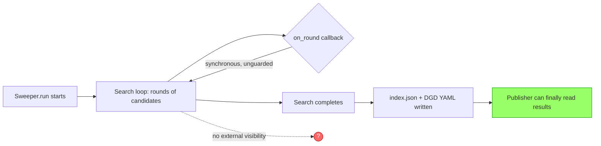

# [Issue #15073] DEP (light): Event schema and event-plane transport for Sweeper Job progress and candidate outcomes

source: https://github.com/ai-dynamo/dynamo/issues/15073
state: open | updated: 2026-09-21T10:20:53Z
labels: enhancement, language::rust, language::python, dynamo-runtime, deployment::nats, planner, dep:draft, DGDR, dynamo-planner

## 正文

## Area
planner
 
## Summary
 
This proposal defines how a Sweeper Job emits progress and Candidate outcomes (tracking issue #13545, item 4) so external publishers can consume live search results without polling job state or awaiting completion.
 
The recommended solution uses Dynamo's existing `EventPublisher`/`EventSubscriber` event-plane abstraction rather than a bespoke Unix-socket protocol (the approach in the earlier draft, #15002). The event schema is unchanged from that earlier design; only the transport differs, reusing infrastructure already deployed, tested, and operated within Dynamo.
 
**Status: prototyped and verified against real infrastructure**, not just proposed — including both transports the binding can select at runtime (ZMQ and NATS, against real `etcd`+`nats-server`), see [Implementation Status](#implementation-status).
 
## Motivation
 
Currently, a running Sweeper search operates as a black box. The only visibility comes from ephemeral `tqdm` console output. Final artifacts (`index.json` and DGD YAML files) are written only after search completion.
 

 
This creates two critical gaps:
 
1. **Publishers have no consumption mechanism.** They can only poll terminal job state or watch filesystem paths post-completion — there is no way to react to candidates as they're discovered, or to update `DGDRRun` status incrementally during an extended search.
2. **Failing or hung searches provide no diagnostic signal until termination.** For multi-hour searches, consumers cannot distinguish "still searching, N candidates found" from "stuck" without an event stream.
The real `Sweeper.run` signature includes an `on_round` callback: `on_round: Callable[[int, list[Candidate]], None]`. This receives full `Candidate` lists per round, and is called synchronously and unguarded within the main search loop. **Work performed inside emission directly stalls the search — this is a hard constraint throughout this design.**
 
Dynamo already operates a production-proven mechanism for structured events streaming from running processes to consumers without polling — `EventPublisher`/`EventSubscriber` — used today for forward-pass metrics, KV-cache events, and sequence tracking.
 
## Proposal
 
### Event Schema
 
A common envelope wraps every event:
 
```json
{
  "apiVersion": "sweeper.dynamo.nvidia.com/v1alpha1",
  "runUID": "3f2b1a90-...",
  "sequence": 42,
  "timestamp": "2026-09-17T12:00:00Z",
  "type": "round_completed",
  "data": { }
}
```
 
- `apiVersion` — envelope schema version, so consumers can reject unfamiliar formats
- `runUID` — identifies the Sweeper run for correlation to `DGDRRun`
- `sequence` — monotonically increasing per run, authoritative for ordering
- `type` — one of `search_resolved`, `round_completed`, `run_completed` (underscore-separated, matching the subject names below — the two must agree, and underscore is what the implementation uses on both sides)
- `data` — type-specific payload
**Type-specific payloads:**
 
- **`search_resolved`** — emitted per candidate materialization outcome within a round:
```json
{"candidate": {"spec": {...}, "experimental": {...}}, "outcome": "materialized"}
{"outcome": "materialization_failed", "error": "..."}
```
 
  `candidate` matches `MaterializationResult`'s shape. A failed candidate does not abort the round; `MaterializationError` becomes a data value, not an exception.
 
- **`round_completed`**:
```json
{"round_no": 3, "cumulative_candidates": 17}
```
 
  Deliberately minimal to avoid duplicating per-candidate data. See [Open Questions](#open-questions) — whether publishers need more than this remains an open call, not resolved by this round of implementation work.
 
- **`run_completed`** — emitted exactly once, terminal, guaranteed even on failure:
```json
{"outcome": "succeeded"}
{"outcome": "failed", "error": "..."}
```
 
### Transport: Dynamo's Event Plane
 
**Rust API, as confirmed directly against `lib/runtime/src/transports/event_plane/mod.rs` and the PyO3 bindings in `lib/bindings/python/rust/llm/fpm.rs`** (this corrects the constructor shown in the original draft of this DEP, which described `for_endpoint_id` as the path taken — see note below):
 
```rust
impl EventPublisher {
    pub async fn for_endpoint(
        endpoint: &Endpoint, topic: impl Into<String>,
    ) -> Result<Self>;
 
    pub async fn for_endpoint_id(
        drt: &DistributedRuntime, endpoint: &EndpointId, topic: impl Into<String>,
    ) -> Result<Self>;
    pub async fn for_endpoint_with_transport(
        endpoint: &Endpoint, topic: impl Into<String>, transport: EventTransportKind,
    ) -> Result<Self>;
    pub async fn for_endpoint_id_with_transport(
        drt: &DistributedRuntime, endpoint: &EndpointId, topic: impl Into<String>,
        transport: EventTransportKind,
    ) -> Result<Self>;
 
    pub async fn publish_bytes_ref(&self, bytes: &[u8]) -> Result<()>;
    pub async fn publish_bytes(&self, bytes: Vec<u8>) -> Result<()>;
}
 
impl EventSubscriber {
    pub async fn for_endpoint(endpoint: &Endpoint, topic: impl Into<String>) -> Result<Self>;
    pub async fn for_endpoint_id(
        drt: &DistributedRuntime, endpoint: &EndpointId, topic: impl Into<String>,
    ) -> Result<Self>;
    pub async fn next(&mut self) -> Option<Result<EventEnvelope>>;
}
 
pub struct EventEnvelope {
    pub publisher_id: u64,
    pub sequence: u64,
    pub published_at: u64,
    pub topic: String,
    pub payload: Bytes,
}
 
pub struct EndpointId { pub namespace: String, pub component: String, pub name: String }
```
 
**Correction from the earlier draft of this DEP:** the original text stated the binding would use `for_endpoint_id(drt, endpoint_id, topic)` — three free-standing strings, no `Endpoint`/`Component` object required — and concluded from this that "no discovery registration, lease, or `serve_endpoint()` call" was needed. The binding that was actually implemented and compiled uses `for_endpoint(&Endpoint, topic)` instead: it takes the full `dynamo_runtime::component::Endpoint` (obtained on the Python side via `DistributedRuntime.endpoint("namespace.component.endpoint")`), not a bare `EndpointId`. Both constructors exist in the real API; `for_endpoint` is the one that matches the established PyO3 binding pattern (`FpmDirectPublisher`, `FpmEventSubscriber` both take `crate::Endpoint`), so it's what was used here.
 
This does not overturn the DEP's underlying conclusion — the integration test confirms a Sweeper Job can construct a publisher/subscriber pair and round-trip a message over the event plane without registering as a request-serving `Component` (no `serve_endpoint()` call was made) — but the code sample and the "just three strings" framing in the original draft were incorrect and are corrected here.
 
**Transport defaults — corrected from the earlier draft of this DEP, now confirmed against the actual authoritative source.** An earlier revision of this document (and an earlier grep against `event_plane/mod.rs`) stated that local backends (`file`/`mem`) default to ZMQ while distributed backends (`etcd`/`kubernetes`) default to NATS. That is **wrong**. The single source of truth is `DiscoveryBackend::resolve_event_transport_kind()` in `lib/runtime/src/distributed.rs`, whose own doc comment states it directly:
 
> "ZMQ is the default event plane for all backends (`file`/`mem`/`etcd`/`kubernetes`); NATS is an explicit opt-in via `DYN_EVENT_PLANE=nats`."
 
```rust
pub fn resolve_event_transport_kind(&self) -> EventTransportKind {
    match std::env::var("DYN_EVENT_PLANE").as_deref() {
        Ok("nats") => EventTransportKind::Nats,
        Ok("zmq") => EventTransportKind::Zmq,
        Ok("") | Err(_) => EventTransportKind::Zmq,   // default for every backend
        Ok(_other) => EventTransportKind::Zmq,          // invalid value also falls back to ZMQ, with a warning
    }
}
```
 
This function does not look at the discovery backend at all. **ZMQ is the default regardless of whether Sweeper Jobs run under `etcd`, `kubernetes`, `file`, or `mem` discovery; NATS only activates if an operator explicitly sets `DYN_EVENT_PLANE=nats`.** Confirmed empirically too: with discovery backend `Etcd(http://localhost:2379)` and no `DYN_EVENT_PLANE` set, the real integration test logged `EventSubscriber created topic=... transport=Zmq`; setting `DYN_EVENT_PLANE=nats` (with the discovery backend unchanged) flipped the same test's log lines to `transport=Nats` — see [Implementation Status](#implementation-status).
 
**This removes a cost the earlier draft of this DEP had conceded.** There is no conditional NATS dependency introduced by this design under default settings, for any discovery backend — matching the Unix-socket design's "zero new runtime dependency" advantage rather than trading against it. NATS is only pulled in if a cluster admin opts in deliberately.
 
Separately, `DistributedConfig::from_settings()` (same file) does open a NATS client connection proactively whenever `NATS_SERVER` is set, the request plane is NATS, or the resolved event transport is NATS — so "NATS is enabled" and "this topic's events go over NATS" are two different, related-but-distinct things; worth keeping straight when reading logs or debugging.
 
The `for_endpoint_with_transport`/`for_endpoint_id_with_transport` constructors bypass this env-based auto-detection entirely and hardcode a transport in code, with two documented tradeoffs if used:
- **Overrides cluster admin intent** set via `DYN_EVENT_PLANE`
- **Unconditionally opts into the ZMQ port-bind race** (#14793) if forced to ZMQ
The publisher/subscriber implementation itself is transport-agnostic; only the operational characteristics of the chosen transport differ. This DEP's binding does not use these override constructors — it goes through the standard `for_endpoint`/`for_endpoint_id` path and lets `DYN_EVENT_PLANE` decide, consistent with respecting cluster admin intent.
 
### Subject Naming
 
Following established convention (`{base_subject}.{event_name}`):
- `sweeper.<run_uid>.search_resolved`
- `sweeper.<run_uid>.round_completed`
- `sweeper.<run_uid>.run_completed`
One subject per event type allows selective subscription. The publisher lazily creates one underlying `EventPublisher` per distinct subject on first use (confirmed by implementation — see below), rather than requiring all three up front.
 
### Backpressure
 
Emission must never block the search. A small, bounded, in-process queue captures events; a background thread independently drains the queue, calling `publish_bytes_ref()`. Queue overflow drops the oldest event with a single logged warning (not one warning per drop, to avoid the warning itself becoming a performance problem under sustained overflow). This queue-plus-background-thread pattern is transport-agnostic and lives entirely in the Python layer — the Rust binding underneath is a synchronous, blocking call by design, per the GIL-release note below.
 
### Replay
 
NATS JetStream offers durable, replayable delivery when explicitly configured. Plain ZMQ provides no persistence. A custom, bounded, in-process replay buffer likely remains necessary atop either transport default to support `REPLAY FROM <sequence>` semantics. Not built in this round of work — see Non-Goals.
 
### Rust/PyO3 Work Required
 
`for_endpoint`/`for_endpoint_id` and `publish_bytes_ref`/`publish_bytes`/`next()` all exist, fully implemented, in `dynamo_runtime`. What's needed is a PyO3 binding layer on top, following the established `FpmDirectPublisher`/`FpmEventSubscriber` pattern. This is a real but bounded amount of work, not pure mechanical glue:
 
- **Publisher**: a `Mutex<HashMap<subject, EventPublisher>>`, lazily populated — one underlying `EventPublisher` created per distinct subject on first publish to it — plus a tokio runtime handle obtained via `endpoint.inner.component().drt().runtime().secondary()` (the same accessor `FpmDirectPublisher::new` uses) so the binding can block on the async `publish_bytes_ref` call from a synchronous Python method, wrapped in `py.allow_threads` to release the GIL while blocked.
- **Subscriber** (optional — see Non-Goals): one background tokio task per subscribed subject, feeding an `mpsc::unbounded_channel`; the Python-facing `recv()` method blocks on `rx.blocking_recv()` inside `py.allow_threads`, mirroring `FpmEventSubscriber::recv` exactly.
Both wrapped methods take/return raw bytes; the envelope's JSON serialization stays entirely on the Python side, so the binding itself has no schema awareness.
 
## Implementation Status
 
This DEP is no longer just a proposal — the design described above has been built and verified end to end:
 
- **`sweeper_event_plane.py`** — transport-agnostic `SweeperEventPublisher`: non-blocking `emit()`, bounded pending-event queue, background drain thread, drop-oldest-on-overflow. Depends only on a small `EventEmitter` protocol (`publish(subject, payload)` / `close()`), not on any transport directly.
- **`dynamo_event_plane_transport.py`** — `DynamoEventPlaneEmitter`, the adapter implementing `EventEmitter` on top of the new PyO3 binding.
- **`sweeper_events.rs`** — the PyO3 binding (`SweeperEventPublisher`, `SweeperEventSubscriber`) described above, registered in `llm.rs`/`lib.rs` alongside the existing `Fpm*` classes, with matching stubs added to `_core.pyi`.
- **Unit tests** (`test_sweeper_event_plane.py`) — 9/9 passing, against a fake in-memory `EventEmitter`, covering non-blocking emission, ordering, envelope shape, queue overflow behavior, and failure isolation (a bad payload or a publish failure doesn't kill the drain loop).
- **Integration test** (`test_sweeper_events_integration.py`) — round-trips a real message through the *compiled* binding, over the real event plane. Also verifies subject isolation (two subscribers on different subjects never cross-deliver). Run twice against two real transports, both passing:
  - **ZMQ path**: process-local (`mem` discovery) `DistributedRuntime`, no external services — the default for every discovery backend absent `DYN_EVENT_PLANE=nats` (see Transport section). Both cases pass in under a second.
  - **NATS path**: `etcd` discovery backend against a real `etcd` + `nats-server` pair (local Docker Compose, `./dev/docker-compose.yml`), with `DYN_EVENT_PLANE=nats` explicitly set. Real log confirmation: `EventSubscriber created topic=sweeper.integration-run-1.round_completed transport=Nats`, `EventPublisher registered with discovery topic=... transport=Nats publisher_id=...`, discovery registration visible via `KVStoreDiscovery::register: EventChannel bucket=v1/event_channels, key=namespace/sweeper-integration-test/...`. Both tests pass in under a second against this real NATS+etcd pair too.
- **Build verification**: `cargo check` clean; `maturin develop --uv --features mm-routing,aic-forward-pass` builds and installs the extension; `mypy` clean on both Python consumer files.
Both transports the binding can actually select at runtime (ZMQ by default, NATS via `DYN_EVENT_PLANE=nats`) are now verified against real infrastructure, not just against the `mem`/local path. What remains unvalidated is a full Kubernetes deployment specifically (`DiscoveryBackend::Kubernetes`, cross-pod delivery, and Kubernetes-native discovery mechanics) — narrower than the earlier-stated gap, since the transport-selection logic itself no longer depends on which discovery backend is in play.
 
## Why This Approach Is Preferred Over the Custom Unix-Socket Design
 
The prior draft (#15002) proposed a Job-local Unix domain socket with NDJSON framing, a bounded-queue background thread, and hand-rolled replay via a ring buffer — fully built and tested (`sweeper_event_transport.py`, 10/10 passing tests at the time).
 
**Advantages of the event-plane approach:**
 
- **Less new code, no new protocol to maintain.** It reuses a production-exercised publish/subscribe path instead of hand-rolling framing, connection lifecycle, and a bespoke replay handshake.
- **Multi-consumer fan-out and selective subscription** come for free via subject-per-event-type naming — the Unix-socket design would need its own multiplexing to support more than one consumer.
- **No Job-local socket-path plumbing** — an `Endpoint`/`EndpointId` is resolved through Dynamo's existing discovery, eliminating filesystem coordination between the Job pod and its consumer.
- **Consistency** with how FPM and KV-cache event streams are already built elsewhere in Dynamo — one fewer bespoke mechanism for operators to reason about.
- **Now backed by a working, tested implementation**, not just a design on paper — see Implementation Status. This closes what was previously the strongest practical argument in #15002's favor (that it was "fully built and tested" while this was not).
**Where the socket design remains stronger:**
 
- **Native replay**, already built and tested via its ring buffer. This DEP's replay story is still a stated but unbuilt requirement (see Replay, above).
- **No Rust/PyO3 dependency** — pure Python, works end-to-end today without a compiled extension. The event-plane binding now also works end-to-end, but only after a `maturin develop` build step that the socket design never needed.
- **No etcd dependency for discovery.** The event-plane binding still needs a discovery backend (etcd, in every deployment this was tested against) to register/find publishers, even while using ZMQ for the actual event transport — the socket design needs neither etcd nor NATS.
**Note — a cost the earlier draft of this DEP conceded no longer applies.** That draft (and an earlier revision of this document) argued the event-plane approach takes on a conditional NATS dependency under Kubernetes/etcd discovery, and justified it by noting NATS is already standard infrastructure there. That argument is now moot: `resolve_event_transport_kind()` defaults to **ZMQ for every discovery backend**, including `etcd`/`kubernetes`; NATS only activates if an operator explicitly sets `DYN_EVENT_PLANE=nats`. So under default settings, this design adds no NATS dependency at all — a strictly better position than the earlier draft assumed, not just an even trade.
 
**Assessment:** with both designs now backed by passing tests, and the NATS-dependency concern resolved in this design's favor, the remaining tradeoffs are narrower: replay (socket design has it built; this one doesn't yet) and PyO3/build-step overhead (socket design has none; this one needs `maturin develop`) against less new protocol surface to maintain long-term and free multi-consumer fan-out. Given Sweeper Jobs already run under discovery infrastructure Dynamo provides, and this design no longer implies a mandatory new runtime dependency, the event-plane approach is the stronger default recommendation for this deployment context — with replay as the one concrete gap worth resolving (or explicitly deferring) before final sign-off.
 
## Alternatives Considered (Not Proposed)
 
1. **Structured stdout via Kubernetes primitives** — simpler, but loses point-to-point framing and replay.
2. **Shared append-only file read by a co-located sidecar** — eliminates backpressure concerns, but constrains the consumer to the same Pod.
3. **OTLP logs/traces** — mature backpressure handling exists, but typically batches asynchronously without strict ordering, turning a live push into a polled query.
## Resolved During Investigation
 
**Do ephemeral batch Jobs fit Dynamo's `Component`/`Endpoint` discovery model?** Yes, confirmed by a working implementation, not just by reading the API. A Sweeper Job constructs a publisher/subscriber pair via `DistributedRuntime.endpoint(path)` and round-trips a real message over the event plane without ever calling `serve_endpoint()` or otherwise becoming a request-serving Component. (Note: this uses the full `Endpoint` object, not a bare `EndpointId` as the original draft assumed — see the Transport section correction above. The conclusion holds; the mechanism it rests on was corrected.)
 
**Does the PyO3 binding compile and work against real Dynamo internals?** Yes — `cargo check`, `maturin develop`, import, unit tests, and real event-plane round trips over **both** ZMQ and NATS all pass. This was open at the time of the original draft and is no longer a risk.
 
**What actually decides ZMQ vs. NATS for a given deployment?** Not the discovery backend, as an earlier revision of this document assumed. It's solely `DYN_EVENT_PLANE`, read once in `DiscoveryBackend::resolve_event_transport_kind()`: unset or any value other than `"nats"` → ZMQ, `DYN_EVENT_PLANE=nats` → NATS, for every discovery backend (`file`/`mem`/`etcd`/`kubernetes`) alike. Confirmed both by reading that function's source and by empirically flipping the same integration test between transports (see Implementation Status).
 
## Open Questions
 
1. **Is it acceptable for Sweeper's event-plane traffic to default to ZMQ even under Kubernetes/etcd discovery?** This is no longer a NATS-dependency question (see the correction above) — it's the reverse: since ZMQ is the default everywhere unless an operator opts into `DYN_EVENT_PLANE=nats`, is ZMQ's direct-mode discovery/connect behavior (see Open Question 4, the port-bind race) acceptable as Sweeper's default transport in production, or should Sweeper's deployment explicitly set `DYN_EVENT_PLANE=nats` itself rather than relying on cluster-wide defaults? This is a policy call, not resolved by implementation work.
2. **Should `round_completed` carry more than a bare count**, given the real `on_round` signature provides full `Candidate` lists? Still open; not addressed by this implementation pass.
3. **Is replay a hard requirement?** Not built in this pass (see Replay). If it isn't a hard requirement, this DEP's remaining gap relative to #15002 narrows further.
4. **ZMQ port-bind race (#14793)** remains an open reliability issue whenever ZMQ is in play — and since ZMQ is now confirmed as the *default* for every discovery backend (not just `file`/`mem` as previously assumed), this risk applies far more broadly than the earlier draft implied, unless Sweeper's deployment explicitly opts into `DYN_EVENT_PLANE=nats`.
5. **Validating against a full Kubernetes deployment.** Both transports (ZMQ and NATS) are now confirmed working against real infrastructure locally (`etcd` + `nats-server` via Docker Compose). What's still unvalidated is `DiscoveryBackend::Kubernetes` specifically, and cross-pod delivery in an actual cluster — narrower than the previous "NATS untested" gap, but still worth closing before full production sign-off.
## Non-Goals
 
- Widening the `round_completed` payload
- Consumer-side implementation (item 5)
- Updating `DGDRRun` status (blocked on #13603/#13744)
- Building the replay buffer described above
- Unilaterally resolving the transport-selection question (Open Question 1)
- Landing `SweeperEventSubscriber` as production-required — it exists to make the integration test possible and is not itself part of item 4's emission requirement; fine to drop from the first patch if reviewers prefer a smaller surface
## References
 
- Tracking issue: #13545
- Earlier draft: #15002
- Earlier draft's tested implementation: `components/src/dynamo/profiler/v2/sweeper_event_transport.py`
- This DEP's implementation: `components/src/dynamo/profiler/v2/sweeper_event_plane.py`, `dynamo_event_plane_transport.py`, `lib/bindings/python/rust/llm/sweeper_events.rs`
- This DEP's tests: `components/src/dynamo/profiler/tests/unit/v2/test_sweeper_event_plane.py`, `test_sweeper_events_integration.py`
- Event-plane API: `lib/runtime/src/transports/event_plane/mod.rs`
- Transport-selection logic (authoritative): `DiscoveryBackend::resolve_event_transport_kind()`, `lib/runtime/src/distributed.rs`
- `DYN_EVENT_PLANE`/`NATS_SERVER`/`ETCD_ENDPOINTS` env vars: `lib/runtime/src/config/environment_names.rs`
- Local NATS+etcd dev infrastructure: `./dev/docker-compose.yml`
- `EndpointId` definition: `lib/runtime/src/protocols.rs`
- Decoupled construction PR: #11841
- FPM precedent: `FpmDirectPublisher`, `FpmEventRelay`, `FpmEventSubscriber` (`lib/bindings/python/rust/llm/fpm.rs`)
- Real `on_round` signature: `aisimulate/sweeper/search.py`
- Sidecar precedent: #14657, #14927
- Observability precedent: #13142
- Known risk: #14793

## 评论 (1)

### devivasudevan · 2026-09-20

@sttts ptal.
