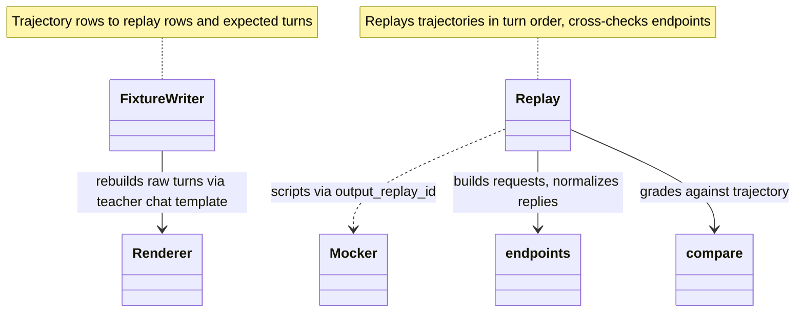

# [PR #15284] feat(mocker): replay agent traces through the frontend with real parsers

source: https://github.com/ai-dynamo/dynamo/pull/15284
state: open | updated: 2026-09-26T22:13:55Z
labels: documentation, size/XXL, feat

## 正文

## Why

The mocker can already replay exact output token ids (`--response-replay-trace-path` + the `output_replay_id` annotation), but nothing drives them through the frontend with real parsers: the mocker cannot register a tool-call or reasoning parser, and parser tests feed pre-decoded text. So the path agents depend on (incremental decode, stop handling, reasoning and tool-call parsing, chat / Responses / Messages assembly) is only exercised with random tokens. Replaying recorded agent trajectories such as `nvidia/Open-SWE-Traces` gives realistic token streams plus ground truth to grade the frontend against.

## Effect

Open-SWE-Traces replay, complete trajectories, every turn through chat / Responses / Messages x stream / unary:

```
teacher (parsers)                   trajectories/turns  requests/arm  parsers off     full turns within tolerance
Qwen3.8-27B (qwen3_coder+qwen3)     28 / 1,066          11,904        byte-exact      1,066 / 1,066
DeepSeek-V4-Flash (deepseek_v4)     25 / 1,093          10,734        byte-exact      1,091 / 1,093
MiniMax-M2.5 (minimax_m2)           18 / 1,076          10,444        byte-exact      1,076 / 1,076
```

It already surfaces frontend gaps, e.g. tool-argument edge whitespace is trimmed (367/367, including `str_replace` indentation) and a script cut inside a parallel call leaks raw `<tool_call>` markup after `finish_reason=tool_calls`.

## What Change

- Mocker `--dyn-tool-call-parser` / `--dyn-reasoning-parser`, registered like engine backends.
- `tests/frontend/trace_replay`: fixture builder, endpoint normalizers, tolerance-tier grader, concurrent runner.
- CI e2e test replaying a hand-written Qwen3.5 trajectory; known frontend gaps are listed explicitly.



## Test Plan

- `pytest tests/frontend/test_mocker_trace_replay.py` and mocker unit tests pass on a CPU pod.
- Open-SWE-Traces replay of three teachers on a CPU pod: ~99k requests, 0 HTTP errors.

🤖 Generated with [Claude Code](https://claude.com/claude-code)


## 评论 (1)

### copy-pr-bot[bot] · 2026-09-26

This pull request requires additional validation before any workflows can run on NVIDIA's runners.

Pull request vetters can view their responsibilities [here](https://docs.gha-runners.nvidia.com/cpr/vetters).

Contributors can view more details about this message [here](https://docs.gha-runners.nvidia.com/cpr/contributors).

