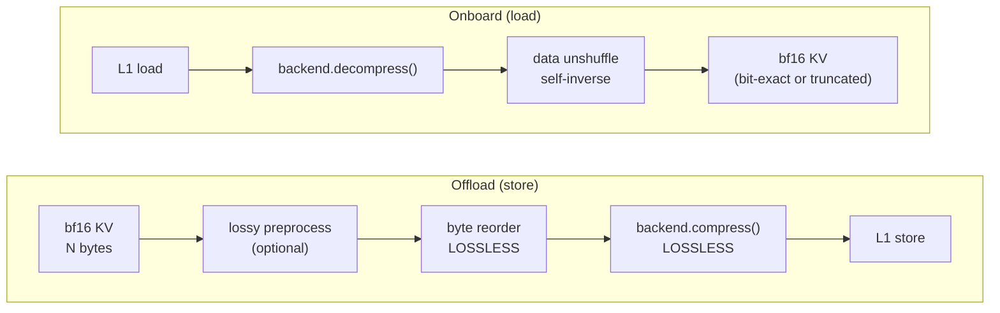
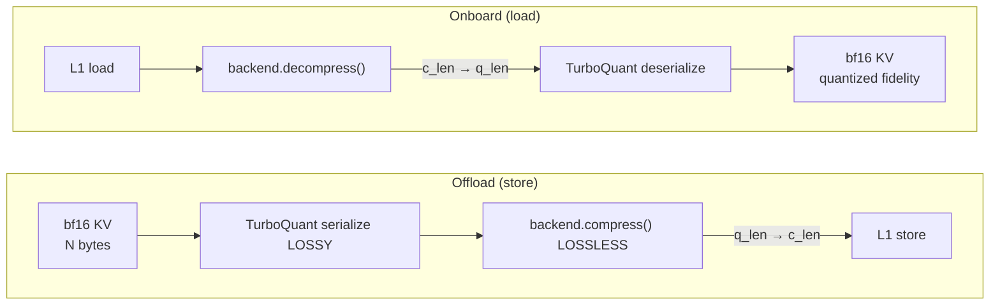
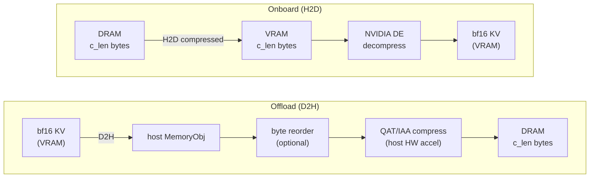

# [Issue #4149] [RFC]:  Hardware-Accelerated KV Compress Adapter

source: https://github.com/LMCache/LMCache/issues/4149
state: open | updated: 2026-09-19T01:44:41Z
labels: 

## 正文

## 1. Summary

Integrate hardware-accelerated lossless compression (e.g., deflate) into LMCache as a
registered serde type, supporting different hardware backends.
e.g., QuickAssist Technology, In-Memory Analytics Accelerator, GPU Decompression Engine, etc.
It offloads the lossless compression/decompression jobs  to specific hardware other than CPU or GPU compute resource.

Different compression paths offer different tradeoffs:

| Path | Name | Serde type | Pipeline (offload) | GPU needed | HW backend |
|------|------|------------|-------------------|------------|------------|
| **1** | Accel Device Only | `accel_kv_compress` | bf16 → [optional lossy preprocessing] → byte reorder → HW compress | No | QAT or IAA |
| **2** | GPU Quant + Accel Device | `turboquant_with_accel_kv_compress` | bf16 → TurboQuant (GPU) → HW compress | **Yes** | QAT or IAA |
| **3** | Accel Device + GPU DE | `accel_kv_compress_with_de` | Offload: QAT/IAA compress (host) → DRAM; Onboard: H2D compressed → NVIDIA DE decompress (GPU) | **Yes** (DE) | QAT or IAA + DE |

All paths operate on host `MemoryObj` byte buffers via the serde
transform layer. Two deployment modes:

- **In L1 (DRAM Only):** `compress_adapters`(**new module**) compresses KV in DRAM
  — validates correctness and measures compression
  ratio with minimal integration surface.  e.g., paired with **IAA**
  (low latency, on-die, small-buffer optimized).
- **L1→L2 (SSD / remote):** `SerdeL2AdapterWrapper` wraps any L2 adapter
  (NVMe / remote) transparently, optimizing storage footprint and
  bandwidth.  e.g.,  paired with **QAT** (high throughput, large buffers).

### 1.1 Architecture

Accelerator KV compression is a **serde transform** backed by
hardware compression adapters.  The `compress_adapters` module is a
top-level package under `distributed/`, parallel to `serde/` and
`l2_adapters/`:

```
distributed/
    serde/               # transform ABCs + implementations (fp8, turboquant)
    l2_adapters/         # L2 storage backends + SerdeL2AdapterWrapper
    compress_adapters/   # HW compression backends + L1/L2 integration (NEW)

compress_adapters owns:
  ├── AccelCompressBackend ABC          (QAT, IAA, etc.)
  ├── GpuDecompressBackend ABC          (nvCOMP/DE, etc.)
  ├── QatBackend / IaaBackend           (QAT/IAA hardware)
  ├── DEBackend                         (DE hardware - on GPU)
  ├── AccelCompressSerializer/Deser.    (implements serde ABCs)
  ├── preprocessing (optional)         (transforms)
  └── L1 compression integration        (in L1/DRAM)

L2 path:   config → create_serde_processor() → SerdeL2AdapterWrapper (existing)
L1 path:   config → compress_adapters.l1_compress (new)
Path 3 (Accel Device + GPU DE):  D2H → compress (AccelCompressBackend) → H2D → DE decompress (GpuDecompressBackend)
```

### 1.2 Source layout

```
lmcache/v1/distributed/compress_adapters/
    __init__.py                   # register_serde_factory("accel_kv_compress", ...)
    backend.py                    # AccelCompressBackend ABC (host, memoryview)
    gpu_decompress.py             # GpuDecompressBackend ABC (device, torch.Tensor)
    qat_backend.py                # QatBackend — ctypes to libqatzip.so
    iaa_backend.py                # IaaBackend — ctypes to libqpl.so
    de_backend.py             # DEBackend — nvCOMP/NVIDIA DE (GPU decompress)
    preprocessing.py              # optional preprocessing transforms (NumPy)
    serde.py                      # AccelCompressSerializer / AccelCompressDeserializer
    l1_compress.py                # L1→L1 DRAM compression integration
```

## 2. AccelCompressBackend — unified hardware abstraction

### 2.1 Abstract interface

```python
class AccelCompressBackend(abc.ABC):
    """Unified API for hardware-accelerated KV compression.

    Each backend wraps a specific hardware library and
    manages per-thread sessions/jobs internally.
    """

    @abc.abstractmethod
    def compress(self, src: memoryview, dst: memoryview) -> int:
        """Compress src into dst. Returns actual compressed size.
        Must be thread-safe (per-thread session internally)."""
        ...

    @abc.abstractmethod
    def decompress(self, src: memoryview, dst: memoryview) -> int:
        """Decompress src into dst. Returns decompressed size.
        Must be thread-safe."""
        ...

    @abc.abstractmethod
    def max_compressed_length(self, src_size: int) -> int:
        """Upper-bound output size for buffer pre-allocation."""
        ...

    @abc.abstractmethod
    def close(self) -> None:
        """Release all resources (sessions, jobs, etc.)."""
        ...
```

## 3. Compression Pipelines

Accelerators share the same `AccelCompressBackend.compress()` /
`.decompress()` call.

### 3.1 Path 1 — Accel Device Only: `accel_kv_compress`

Host-only HW compression with optional lossy preprocessing.
Optional lossy preprocessing (controlled by `truncate_bits` config)
zeros low-order mantissa bits to boost compression ratio.
When `truncate_bits=0` the path is fully lossless (bit-exact round-trip).



### 3.2 Path 2 — GPU Quant + Accel Device: `turboquant_with_accel_kv_compress`



### 3.3 Path 3 — Accel Device + GPU DE: QAT/IAA compress (host) + NVIDIA DE decompress (GPU)




| Property | Detail |
|----------|--------|
| **Offload compress** | QAT/IAA on host — same as Path 1 Accel Device Only (this serde) |
| **Onboard decompress** | NVIDIA Decompression Engine |
| **PCIe savings** | Onboard transfers compressed bytes H2D instead of full KV |
| **Format compatibility** | QAT/IAA produce standard DEFLATE; NVIDIA DE supports DEFLATE |
| **Serde integration** | Serialize = same `AccelCompressBackend.compress()`; Deserialize = **passthrough** (host serde is no-op) |
| **GPU decompress** | `GpuDecompressBackend.decompress_device()` via nvCOMP — plugs into H2D→attention path, outside serde framework |


## 4. LMCache serde API mapping

### 4.1 Sync interface

| API | Signature | AccelCompress usage |
|-----|-----------|-----------|
| `Serializer.serialize()` | `(src: MemoryObj, dst: MemoryObj) -> int` | Run preprocessing + `backend.compress()`; return `c_len` |
| `Serializer.estimate_serialized_size()` | `(layout_desc: MemoryLayoutDesc) -> int` | Return `backend.max_compressed_length(raw_size)` |
| `Deserializer.deserialize()` | `(src: MemoryObj, dst: MemoryObj) -> None` | Run `backend.decompress()` + post-processing |

### 4.2 Async model

| Layer | Mechanism | Decision |
|-------|-----------|----------|
| **LMCache `AsyncSerdeProcessor`** | ThreadPoolExecutor + eventfd |

Implement `serialize()` / `deserialize()` as **synchronous** blocking calls.
`AsyncSerdeProcessor(max_workers=N)` handles all concurrency via its thread pool.


## 5. Backend implementations

Three backend classes cover host compression and GPU decompression.
For the QAT backend, there are two ctypes target options: direct
`libqatzip.so` (open source) or KVCacheClip's `libqzip.so` (wraps
QATzip with thread-local sessions and batch multi-buffer calls).

| Backend | ctypes target | Library | Open source |
|---------|--------------|---------|-------------|
| **QatBackend** | Option A: `libqatzip.so` (direct) | QATzip | Yes (BSD) |
| **QatBackend** | Option B: KVCacheClip `libqzip.so` | QATzip (wrapped) | **No** (proprietary) |
| **IaaBackend** | `libqpl.so` | QPL | Yes (MIT) |
| **DEBackend** | `libnvcomp.so` | nvCOMP | Yes (BSD) |
## 5. Backend implementations

Three backend classes cover host compression and GPU decompression.
For the QAT backend, there are two ctypes target options: direct
`libqatzip.so` (open source) or KVCacheClip's `libqzip.so` (wraps
QATzip with thread-local sessions and batch multi-buffer calls).

| Backend | ctypes target | Library | Open source |
|---------|--------------|---------|-------------|
| **QatBackend** | Option A: `libqatzip.so` (direct) | QATzip | Yes (BSD) |
| **QatBackend** | Option B: KVCacheClip `libqzip.so` | QATzip (wrapped) | **No** (proprietary) |
| **IaaBackend** | `libqpl.so` | QPL | Yes (MIT) |
| **DEBackend** | `libnvcomp.so` | nvCOMP | Yes (BSD) |
## 5. Backend implementations

Three backend classes cover host compression and GPU decompression.
For the QAT backend, there are two ctypes target options: direct
`libqatzip.so` (open source) or KVCacheClip's `libqzip.so` (wraps
QATzip with thread-local sessions and batch multi-buffer calls).

| Backend | ctypes target | Library | Open source |
|---------|--------------|---------|-------------|
| **QatBackend** | Option A: `libqatzip.so` (direct) | QATzip | Yes (BSD) |
| **QatBackend** | Option B: KVCacheClip `libqzip.so` | QATzip (wrapped) | **No** (proprietary) |
| **IaaBackend** | `libqpl.so` | QPL | Yes (MIT) |
| **DEBackend** | `libnvcomp.so` | nvCOMP | Yes (BSD) |

## 6. Serializer / Deserializer implementations

### 6.1 AccelCompressSerializer — unified, backend-agnostic

```python
class AccelCompressSerializer(Serializer):
    def __init__(self, backend: AccelCompressBackend,
                 byte_reorder: bool = True,
                 truncate_bits: int = 0):
        self._backend = backend
        self._byte_reorder = byte_reorder
        self._truncate_bits = truncate_bits   # 0=off, -1=auto, >0=explicit

    def serialize(self, src: MemoryObj, dst: MemoryObj) -> int:
        buf = bytearray(src.byte_array)
        if self._truncate_bits != 0:
            _apply_lossy_truncation(buf, src, self._truncate_bits)
        if self._byte_reorder:
            _apply_byte_reorder(buf, src)
        return self._backend.compress(buf, dst.byte_array)

    def estimate_serialized_size(self, layout_desc: MemoryLayoutDesc) -> int:
        return self._backend.max_compressed_length(layout_desc.total_bytes())


class AccelCompressDeserializer(Deserializer):
    def __init__(self, backend: AccelCompressBackend,
                 byte_reorder: bool = True):
        self._backend = backend
        self._byte_reorder = byte_reorder

    def deserialize(self, src: MemoryObj, dst: MemoryObj) -> None:
        self._backend.decompress(src.byte_array, dst.byte_array)
        if self._byte_reorder:
            _apply_byte_reorder(dst.byte_array, dst)  # self-inverse
```

### 6.2 TurboQuantAccelSerializer — Path 2 composite

```python
class TurboQuantAccelSerializer(Serializer):
    def __init__(self, tq_config, backend: AccelCompressBackend):
        self._tq = TurboQuantSerializer(tq_config)
        self._backend = backend

    def serialize(self, src: MemoryObj, dst: MemoryObj) -> int:
        q_buf = alloc_temp(self._tq.estimate_serialized_size(src.layout))
        q_len = self._tq.serialize(src, q_buf)
        return self._backend.compress(q_buf[:q_len], dst.byte_array)

    def estimate_serialized_size(self, layout_desc: MemoryLayoutDesc) -> int:
        q_size = self._tq.estimate_serialized_size(layout_desc)
        return self._backend.max_compressed_length(q_size)


class TurboQuantAccelDeserializer(Deserializer):
    def __init__(self, tq_config, backend: AccelCompressBackend):
        self._tq = TurboQuantDeserializer(tq_config)
        self._backend = backend

    def deserialize(self, src: MemoryObj, dst: MemoryObj) -> None:
        q_size = tq_serialized_nbytes_for(dst.layout)
        q_buf = alloc_temp(q_size)
        self._backend.decompress(src.byte_array, q_buf)
        self._tq.deserialize(q_buf, dst)
```

### 6.3 Path 3 (Accel Device + GPU DE) — host serialize + passthrough deserialize

Path 3 (Accel Device + GPU DE) reuses `AccelCompressSerializer` for the host compress side.
The serde `Deserializer` is a **passthrough** — compressed bytes are
stored as-is, transferred H2D compressed, and decompressed on GPU
by `DEBackend` (outside the serde framework).

```python
class PassthroughDeserializer(Deserializer):
    """No-op: compressed bytes pass through to GPU path."""

    def deserialize(self, src: MemoryObj, dst: MemoryObj) -> None:
        # Copy compressed bytes as-is (no host decompression)
        dst.byte_array[:len(src.byte_array)] = src.byte_array
```

The GPU decompress step happens after H2D transfer, called by the
KV cache loading pipeline (not the serde framework):

```python
# In the KV cache onboard path (outside serde):
gpu_backend = DEBackend()
gpu_backend.decompress_device(
    src=compressed_vram_tensor,
    dst=kv_cache_tensor,
    stream=torch.cuda.current_stream())
```

## 7. Config and registration

### 7.1 Config examples

**Path 1 (Accel Device Only) — lossless with QAT:**
```json
{"serde": {"type": "accel_kv_compress", "backend": "qat",
           "algorithm": "deflate", "level": 1,
           "byte_reorder": true, "max_workers": 4}}
```

**Path 1 (Accel Device Only) — lossless with IAA:**
```json
{"serde": {"type": "accel_kv_compress", "backend": "iaa",
           "iaa_path": "hardware", "level": "default",
           "byte_reorder": true, "max_workers": 4}}
```

**Path 1 (Accel Device Only) — with lossy truncation:**
```json
{"serde": {"type": "accel_kv_compress", "backend": "qat",
           "truncate_bits": -1, "byte_reorder": true, "max_workers": 4}}
```

**Path 2 (GPU Quant + Accel Device) — TurboQuant + HW compress:**
```json
{"serde": {"type": "turboquant_accel", "backend": "iaa",
           "preset": "turboquant_k8v4", "block_size": 16, "max_workers": 4}}
```

**Path 3 (Accel Device + GPU DE) — host QAT compress + GPU DE decompress:**
```json
{"serde": {"type": "accel_kv_compress", "backend": "qat",
           "byte_reorder": true, "max_workers": 4,
           "gpu_decompress": "nvcomp"}}
```


## 评论 (3)

### zxue2 · 2026-07-19

@ApostaC  per discussion in meeting pls help review the  ```distributed/compress_adapters``` , especially from abstraction & hierarchy level.  The intention is to offload the KV lossless compression/decompression jobs to specific hardware ( QAT/IAA/DE, etc.) other than CPU or GPU compute resource.

@KuntaiDu pls kindly have a glance and feel free to comment. thx

### github-actions[bot] · 2026-09-18

This issue has been automatically marked as stale because it has not had activity within 60 days. It will be automatically closed if no further activity occurs within 30 days.

### zxue2 · 2026-09-18

Pls keep it. it will move forward post https://github.com/LMCache/LMCache/pull/4816
