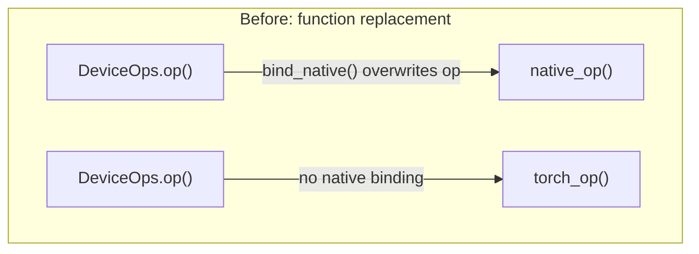
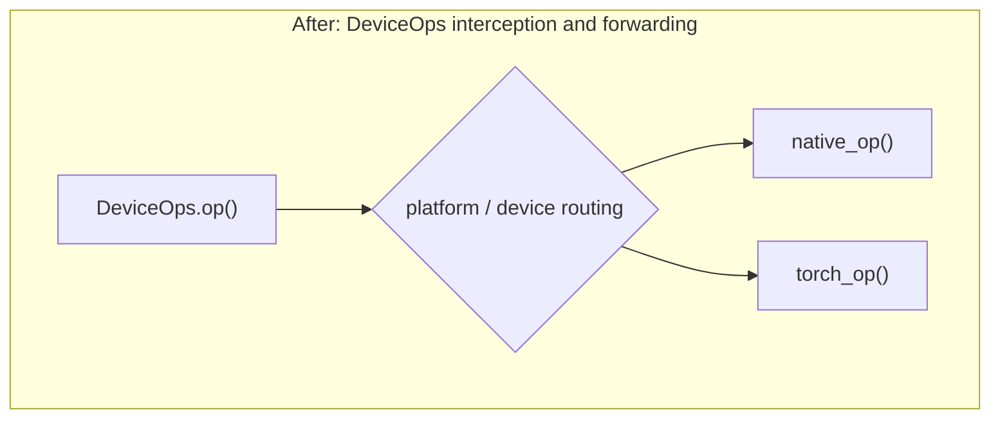
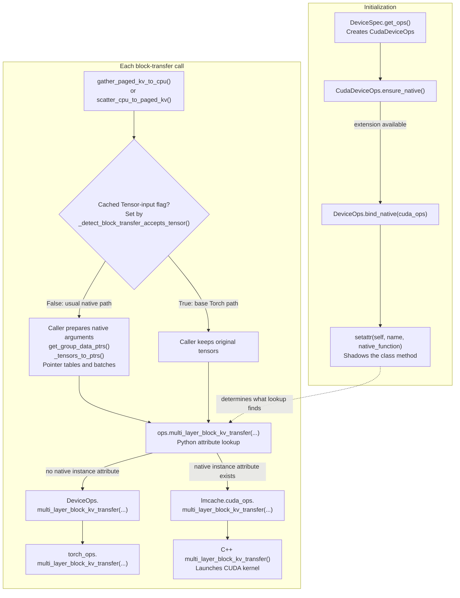
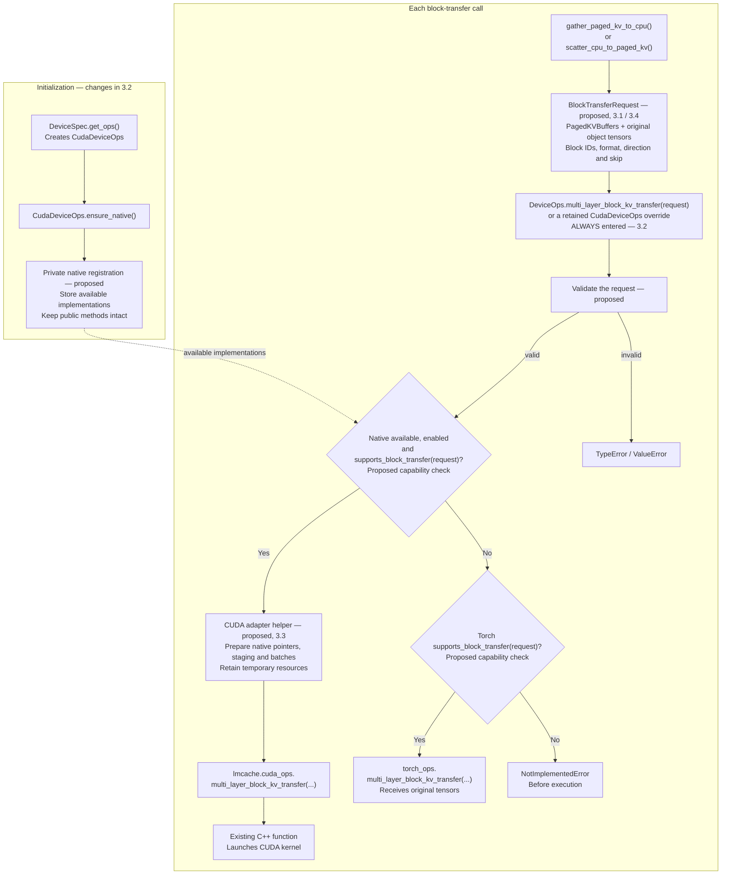

# [Issue #4465] [RFC] Torch Ops Improvements and Backend Routing

source: https://github.com/LMCache/LMCache/issues/4465
state: open | updated: 2026-09-26T14:41:14Z
labels: 

## 正文

## Background

Today, Torch ops and C ops are separate implementations. This RFC proposes to:

1. Close the functional gap between Torch ops and C ops.
2. Reorganize the Torch ops file layout to align with C ops.
3. Route ops through per-device `DeviceOps` implementations.

## Step 1: Close the Gap Between Torch Ops and C Ops (https://github.com/LMCache/LMCache/pull/4370)

The first step is to complete the missing Torch ops functionality and close the gap with C ops. A related PR already exists.

### Motivation

1. **Hybrid model convergence**

   Complete Torch ops support is required for converging hybrid models in the LMCache engine-driven path.

2. **Complete fallback support for device vendors**

   A complete Torch ops implementation provides a functional fallback, allowing device vendors to evaluate LMCache software support quickly before implementing or optimizing native C ops.

## Step 2: Reorganize the Torch Ops File Layout

The second step is to reorganize the Torch ops file layout and align it with the C ops layout.

### Motivation

Currently, Torch ops are concentrated in a single large file. The file is difficult to maintain and becomes increasingly hard to extend as more ops are added.

Aligning the Torch ops layout with C ops will improve maintainability and make the relationship between the two implementations clearer.

## Step 3: Route Ops Through Per-Device `DeviceOps`

### Current Design

Today, `bind_native()` directly replaces a `DeviceOps` method with a native function. Once bound, the original `DeviceOps` method is bypassed.

An op can therefore only use one implementation: native ops or Torch ops.



### Proposed Design

After this change, `DeviceOps` methods are always retained. Each device-specific `DeviceOps` subclass intercepts the call, performs necessary device-specific handling, and forwards the call to native ops or Torch ops dynamically.



### Motivation

1. **Use Tensor as the unified upper-layer interface**

   Upper-layer code should always pass Tensors and should not need to know whether the selected backend is native ops or Torch ops.

   If native ops are selected, the device-specific `DeviceOps` subclass can convert Tensors to pointers as needed. If Torch ops are selected, it forwards Tensors directly.

2. **Route based on KV format**

   A device vendor may support only a subset of KV formats in its native ops, while Torch ops provide complete functional coverage.

   The device-specific `DeviceOps` subclass can select native ops for supported formats and fall back to Torch ops for unsupported formats.

   For example, the vLLM path can use the optimized native path when supported. The SGLang path may prioritize functional coverage and fall back to Torch ops when a native implementation does not support the requested KV format.

3. **Simplify the current code structure**

   There is currently a significant amount of logic under `platform` that exists because upper layers pass pointers and need to reconstruct Tensors.

   Moving backend-specific conversion and routing into the device-specific `DeviceOps` subclass will simplify the platform code structure.

4. **Make multi-op composition easier**

   The device-specific `DeviceOps` subclass can combine multiple low-level ops into a single API for upper layers.

   For example, `multi_block_transfer` and `memcpy_async` can be composed behind one API, while the upper layer does not need to know the composition details.

5. **Support multiple backends per device**

   This design allows a device to select among multiple backends, such as native ops, Torch ops, TorchMUSA, Triton, or other vendor-specific implementations.

   For example, MUSA can dynamically select between its `torchmusa` and native backends. The same structure can support additional backends in the future.

## 评论 (2)

### maobaolong · 2026-09-01

@neurawn Hi, thanks for the interest in this issue! You can try to split this RPC to some sub steps here.

### neurawn · 2026-09-26

@maobaolong thanks for the suggestion. Here's a proposed split of the block-transfer part of Step 3, with calculate_cdf as the first example of the new routing. The rest of Step 3 is listed at the end as follow-up work. Each sub-step is its own PR: it keeps dev working when merged alone and comes with its own tests. Names like block_transfer_input_kind, transfer_kv_blocks and PagedKVBuffers are placeholders.

Current flow:
CudaDeviceOps inherits DeviceOps, but native binding installs functions directly on the instance. Those functions take precedence over the class methods.
The important bypass: on the native branch, execution goes from ops.multi_layer_block_kv_transfer(...) directly into the compiled function. The DeviceOps class method never runs - refer to device_ops.py:bind_native (binding code) and base.py:gather_paged_kv_to_cpu (argument preparation) 



Goal flow: 
Every call enters a retained Python method. That method selects an implementation using the actual request. Components marked proposed are planned additions; helper names and their precise placement remain implementation choices.


Example for calculate_cdf, today, with native binding:
```
encode_function()
  → ops.calculate_cdf(...)
  → lmcache.cuda_ops.calculate_cdf(...)
    [DeviceOps.calculate_cdf is skipped]

Goal, with native selected:
encode_function()
  → ops.calculate_cdf(...)
  → DeviceOps.calculate_cdf(...) or retained device override
      → check support
      → lmcache.cuda_ops.calculate_cdf(...)
      ← return through the retained method

Goal, with Torch selected:
encode_function()
  → ops.calculate_cdf(...)
  → retained Python method
      → check support
      → torch_ops.calculate_cdf(...)
      ← return through the retained method
```

**What shaped the order**

gather/scatter choose between passing tensors and passing pointers by inspecting the bound function's signature ([_detect_block_transfer_accepts_tensor](https://github.com/LMCache/LMCache/blob/814a96b127f8d1554223ff915032e86b151b25b7/lmcache/v1/multiprocess/transfer_context/base.py#L48-L64)). Once the DeviceOps methods are kept, that inspection would see the Python method and pass tensors to the pointer-only CUDA function. So an explicit query replaces it first (3.1).
bind_native is also how callers reach native-only functions and types (execute_object_group_transfer, execute_direct_copy_transfer, DirectCopyGroupSpec, …). They stay public for now.
Other callers still pass raw pointers. One is the [object-group fallback path](https://github.com/LMCache/LMCache/blob/814a96b127f8d1554223ff915032e86b151b25b7/lmcache/v1/multiprocess/object_group_transfer.py#L740-L753), which MUSA serves by rebuilding tensors from those pointers. So the tensor entry point is added next to the pointer one, and pointer compatibility is transitional.
MUSA already picks native or torch on each call, but replays the whole transfer on torch after a native failure. Changing that is a policy change for the MUSA owners.
Order: 3.1 → 3.2 → 3.3 → 3.4 → 3.5 → {3.6, 3.7, 3.8} → 3.9 → 3.10.

3.1 Ask the ops object for its input contract
Summary: gather/scatter ask the ops for the KV device whether block transfer takes tensors or pointers, instead of inferring it from a signature.

<details><summary>Details and tests</summary>
Add DeviceOps.block_transfer_input_kind() returning TENSORS or POINTERS, queried on the ops instance resolved for the KV tensors' device. It describes the public method's input contract, not whether native code exists. For example, MUSA accepts tensors and may still run native code inside its override. It replaces _detect_block_transfer_accepts_tensor, as the existing [TODO](https://github.com/LMCache/LMCache/blob/814a96b127f8d1554223ff915032e86b151b25b7/lmcache/v1/multiprocess/transfer_context/base.py#L57) asks. It's transitional and goes away when gather/scatter switch to requests (3.9). Behavior doesn't change.

Tests (CPU, with the fake native module already in tests/v1/platform/test_device_ops.py)

Base, CPU and RBLN report TENSORS. MUSA reports TENSORS with LMCACHE_MUSA_NATIVE_KV_TRANSFER both off and on. CUDA with a fake native module reports POINTERS. Purpose: the query describes the input contract, not native availability.
For each of those, gather/scatter make the same tensor-or-pointer choice as the old inspection. Purpose: proves nothing changes.
The existing cuda-marked gather/scatter tests pass unchanged. Purpose: same, on real hardware.
</details>
3.2 Keep the DeviceOps methods and call natives from inside them
Summary: bind_native stops replacing methods, so every call goes through the Python method, which picks native or torch exactly as today.

<details><summary>Details and tests</summary>
Natives whose names match a DeviceOps method go into a private registry. The method stays and forwards the same arguments.

Native-only symbols stay public as a transitional choice: functions and types with no matching method are still set as attributes. __getattr__ still raises AttributeError, so hasattr checks keep working.
Every binding backend changes: CUDA and ROCm (they share CudaDeviceOps), XPU, and NPU.
Design doc: sections 3.1 and 3.3 of [device_ops_design.md](https://github.com/LMCache/LMCache/blob/814a96b127f8d1554223ff915032e86b151b25b7/docs/design/v1/platform/device_ops_design.md) describe the replacement as intended and are updated in the same PR.
Overhead: each op call gains one Python call. I'll measure it on a frequently called op such as lmcache_memcpy_async.
Tests (CPU, fake native module)

Call order, the acceptance test: the subclass method is entered and calls the native function, and the result returns through the method. It's checked both before and after ensure_native(). Purpose: proves every call goes through the method, not just that native results come back.
[test_bind_native_shadows_baseline_for_present_ops](https://github.com/LMCache/LMCache/blob/814a96b127f8d1554223ff915032e86b151b25b7/tests/v1/platform/test_device_ops.py#L215) only checks native return values. Its is not assertion is always true, because every attribute access creates a new bound method. It's renamed and extended with the call-order assertion. Purpose: the test proves what its name says.
An op missing from the native module uses torch, and a module that provides only some ops (like XPU's) is routed op by op. Purpose: partial native coverage still works.
Native-only symbols and types stay reachable, and missing ones still fail hasattr. Purpose: nothing that uses them breaks.
[test_cpu_and_cuda_kv_can_share_one_process](https://github.com/LMCache/LMCache/blob/814a96b127f8d1554223ff915032e86b151b25b7/tests/v1/multiprocess/test_engine_driven_device_dispatch.py#L95-L100) skips unless the attribute is the raw native function, so it would start skipping here. Its gate switches to 3.1's query. Purpose: CPU/CUDA coexistence stays covered.
</details>
3.3 Per-op support checks, starting with calculate_cdf
Summary: A backend declares which valid inputs its native op handles. Other valid inputs go to torch, and invalid inputs raise on every path.

<details><summary>Details and tests</summary>
A hook lets a backend register a support check next to a native op. Only existing bulk-bound natives may omit it, which keeps today's behavior (always used), so XPU and NPU don't change until they opt in. Every adapter added from now on must declare one. The first user is calculate_cdf:

Invalid input raises on every path: wrong rank, a non-integer dtype, or a non-positive num_bins. It never falls back, because torch [clamps symbols](https://github.com/LMCache/LMCache/blob/814a96b127f8d1554223ff915032e86b151b25b7/lmcache/v1/platform/torch_ops/cachegen_kernels.py#L321) and would silently change the result.
Valid input the native kernel can't handle goes to torch: a non-CUDA tensor, empty dimensions, too many bins, or 65,536 tokens or more. That last limit exists because the kernel's histogram counts are [16-bit](https://github.com/LMCache/LMCache/blob/814a96b127f8d1554223ff915032e86b151b25b7/csrc/cuda/cal_cdf.cu#L25).
Symbol values in [0, num_bins) are a documented caller guarantee, not a per-call check. The native kernel uses them [as indices without bounds checks](https://github.com/LMCache/LMCache/blob/814a96b127f8d1554223ff915032e86b151b25b7/csrc/cuda/cal_cdf.cu#L37), and scanning them on every call would add a GPU sync.
Today a CPU tensor fails with "Input must be a CUDA tensor". Afterwards it runs on torch.

Tests

CPU, fake native, one test per class of input (Purpose: invalid and unsupported inputs stay distinct):
supported input: only native runs
each unsupported case: only torch runs
each invalid case: raises, and neither runs
cuda: native and torch match for supported inputs, up to 65,535 tokens, and 65,536 tokens goes to torch. Purpose: torch is a correct substitute, and the overflow boundary is enforced.
</details>
3.4 BlockTransferRequest
Summary: One typed object describes a logical block transfer in tensors. It accepts every transfer that's valid today and rejects only inconsistent ones.

<details><summary>Details and tests</summary>
It holds:

the paged KV input (PagedKVBuffers: per-layer tensors, the cross-layer tensor, K/V lists or MLA plane tuples, plus the format)
the chunk tensors
block IDs, direction, shape descriptor, chunk size and skip
Validation follows operand roles and today's behavior:

Devices by role: KV tensors share one device. Chunks may be on the host (the usual case, next to CUDA KV) or on that device.
Per-plane dtypes and widths: MLA plane tuples mix both and are [packed by bytes](https://github.com/LMCache/LMCache/blob/814a96b127f8d1554223ff915032e86b151b25b7/lmcache/v1/platform/torch_ops/mp_mem_kernels.py#L749).
Partial chunks: a trailing partial chunk is valid, as an [RBLN test](https://github.com/LMCache/LMCache/blob/814a96b127f8d1554223ff915032e86b151b25b7/tests/v1/platform/devices/rbln/test_rbln_kv_ops.py#L173) covers.
Over-skip: a skip past the end of the transfer is valid and copies nothing, as the [mla-skip-past-chunk case](https://github.com/LMCache/LMCache/blob/814a96b127f8d1554223ff915032e86b151b25b7/tests/v1/multiprocess/test_engine_driven_transfer.py#L1063) covers.
Backend limits, such as CUDA's four chunks per launch and whole chunks only, belong in that backend's support check (3.6), not here.

The docstring also specifies what every implementation must follow:

block-to-chunk ordering
partial occupancy
in-place output
ownership: the caller keeps the tensors alive
completion: a return means the work is queued, and the caller synchronizes before reading or reusing chunks
Nothing uses it yet.

Tests (CPU, table-driven)

Accepted: every EngineKVFormat, host chunks with device KV, mixed-dtype MLA plane tuples, a trailing partial chunk, and a skip past the end. Purpose: nothing valid today is rejected.
Rejected with ValueError or TypeError and a clear message: KV tensors on different devices, chunks too small for their blocks, a negative skip, and an unknown direction. Purpose: inconsistent requests fail before any copy, in one place.
</details>
3.5 Tensor entry point with routing
Summary: A new DeviceOps method validates a request and runs the first registered implementation that supports it, or raises NotImplementedError before copying anything.

<details><summary>Details and tests</summary>
For example transfer_kv_blocks(request), next to the pointer-based multi_layer_block_kv_transfer. Each backend registers an ordered list of implementations, each with a support check and an enabled check. For example:

CUDA: native adapter, then generic torch
RBLN: its own tensor implementation
MUSA: native adapter, then TorchMUSA
Vendor tensor implementations are entries in their own right, not forced into "native or generic torch". Rules:

Pointer natives need an adapter. A pointer-only native (CUDA today, possibly the out-of-tree NPU plugin) is never passed tensors directly.
No retry once execution starts. An exception or a failure return is an execution failure and propagates. No other implementation re-runs the request.
Torch declares the formats it implements. Formats with no registered spec already fail in the [spec lookup](https://github.com/LMCache/LMCache/blob/814a96b127f8d1554223ff915032e86b151b25b7/lmcache/v1/gpu_connector/kv_format/specs/registry.py#L60-L62). The remaining risk is registered formats that reach torch's [NHD fallback](https://github.com/LMCache/LMCache/blob/814a96b127f8d1554223ff915032e86b151b25b7/lmcache/v1/platform/torch_ops/mp_mem_kernels.py#L469) without an NHD layout.
Nothing calls it yet. Base, CPU, HPU and XPU handle requests with torch.

Tests

CPU with fake implementations, one test per outcome (Purpose: locks in the routing rules):
the first supports → only it runs
the first declines → the next runs
none supports → NotImplementedError, and nothing ran
the chosen one raises → the same exception, and nothing else runs
disabled → skipped
Canonical bytes, for every format torch claims: KV is filled with values that encode their position. Gathered chunks must match the expected canonical layout. Scatter must leave blocks outside the request, skipped blocks and a partial chunk's tail untouched. Round trips remain only as a secondary check. Purpose: catches layout mistakes that gather and scatter would share, which a round trip can't see.
Every format torch doesn't claim is rejected before any copy. Purpose: no format is silently treated as NHD.
</details>
3.6 CUDA adapter over the unchanged native interface
Summary: CudaDeviceOps registers an adapter that turns a request into the pointer arguments the existing kernel takes. The adapter declares exactly which requests the kernel can run and keeps its temporary buffers alive until the GPU is done.

<details><summary>Details and tests</summary>
The adapter takes over the preparation callers do today:

the per-layer pointer table
chunk pointers
block IDs as a device tensor
batches of at most four chunks, each with its own skip (see below)
pinned staging for unpinned chunks
Skip per batch. The kernel counts skip from the start of each launch ([here](https://github.com/LMCache/LMCache/blob/814a96b127f8d1554223ff915032e86b151b25b7/csrc/cuda/mp_mem_kernels.cu#L299)). So each batch gets max(0, skip - batch_start_block), and batches that are entirely skipped aren't launched. Today's caller gives the whole skip to the first batch and zero to the rest ([here](https://github.com/LMCache/LMCache/blob/814a96b127f8d1554223ff915032e86b151b25b7/lmcache/v1/multiprocess/transfer_context/base.py#L724)). That's safe only because every current caller keeps the skip under one chunk. For example, the vLLM adapter starts a retrieve at the chunk holding the first uncached token ([here](https://github.com/LMCache/LMCache/blob/814a96b127f8d1554223ff915032e86b151b25b7/lmcache/integration/vllm/lmcache_mp_metadata.py#L347-L375)). A general request API can't rely on that.

It supports a request only when all of these hold:

a CUDA device and one of the 15 formats (of 18) the kernel dispatches
the strides, storage layout and pointer alignment the kernel assumes for that format
the kernel's limits, such as head bytes divisible by 2, at most 32 heads, and whole chunks only
Everything else goes to torch. That includes the other three formats (NL_X_TWO_X_NB_BS_NH_HS, NL_X_NP_X_NB_BS_ONE_HS and RBLN's NL_X_TWO_NB_NH_ONE_BS_HS) and trailing partial chunks. That's the RFC's route-by-format goal, on CUDA. It also covers ROCm.

Buffer lifetime. Pointer tables, block-ID tensors and staging buffers stay alive until the queued work completes, including when a later batch raises. Today scatter waits for the GPU only at the end of a [successful call](https://github.com/LMCache/LMCache/blob/814a96b127f8d1554223ff915032e86b151b25b7/lmcache/v1/multiprocess/transfer_context/base.py#L731-L741).

The native interface doesn't change, and no caller switches yet.

Tests

CPU, recording fake native: argument building, and each batch's skip for 5 and 9 chunks, with skips that end before, exactly at and past the four-chunk boundary. Entirely skipped batches aren't launched. Purpose: builds the arguments the kernel needs, including skips that span batches.
cuda: a skip longer than four chunks leaves every block inside the skipped prefix unwritten. Purpose: the per-batch skip holds on real copies.
CPU, fake native that fails on the second batch: the first batch's buffers aren't released until its work completes. Purpose: no buffer is freed while in-flight work still uses it.
cuda: every supported format, in both directions, with and without skip, with pinned and unpinned chunks. The output must match canonical bytes and torch, and untouched regions must stay untouched. Purpose: the conversion is exact.
cuda: non-contiguous or misaligned KV, and partial chunks, go to torch. Purpose: the support check covers layout, not just format.
cuda: every format the adapter claims runs natively, and every format it declines would fail natively. Purpose: keeps the Python format list in sync with the kernel.
</details>
3.7 MUSA on the shared router
Summary: MUSA's native-or-torch logic becomes router entries. Eligibility is checked before any work starts, and nothing is replayed after a failure.

<details><summary>Details and tests</summary>
MusaDeviceOps registers its native transfer as an adapter, with LMCACHE_MUSA_NATIVE_KV_TRANSFER as its enabled check, followed by TorchMUSA. Today's helpers can't be registered as they are. They turn exceptions into False, sometimes [after earlier chunks already ran](https://github.com/LMCache/LMCache/blob/814a96b127f8d1554223ff915032e86b151b25b7/lmcache/v1/platform/devices/musa/native_kv_transfer.py#L422-L443), and the whole request is then replayed on torch. The adapter splits them into two phases:

Eligibility: checked for every chunk before any work starts.
Execution: once it starts, an exception or a False from any chunk is an execution failure and raises. Nothing is replayed.
musa_connectors.py also uses try_native_to_gpu and try_native_from_gpu ([1](https://github.com/LMCache/LMCache/blob/814a96b127f8d1554223ff915032e86b151b25b7/lmcache/v1/gpu_connector/musa_connectors.py#L233), [2](https://github.com/LMCache/LMCache/blob/814a96b127f8d1554223ff915032e86b151b25b7/lmcache/v1/gpu_connector/musa_connectors.py#L317)), and relies on False meaning "fall back". Those helpers keep their behavior, and the connector moves only in a deliberate follow-up.

This is a policy change, so it needs the MUSA owners' agreement. The pointer-based override stays until 3.10.

Tests

CPU with a fake MUSA native module, following test_musa_mp_block_transfer.py (Purpose: the router works for a second backend with its own settings):
disabled → TorchMUSA
enabled and supported → native only
unsupported format → TorchMUSA
native raises → the error surfaces, and nothing else runs
The second chunk fails after the first succeeded: the request fails and isn't replayed. Purpose: the no-replay rule holds mid-request.
The MUSA connector still falls back when a helper returns False. Purpose: connector behavior doesn't change by accident.
The musa-marked suite passes. Purpose: no regression on hardware.
</details>
3.8 RBLN as a vendor tensor implementation
Summary: RBLN registers its existing tensor implementation as a router entry, so switching gather/scatter keeps its operation ordering and layout handling.

<details><summary>Details and tests</summary>
RBLN has no native module. Its [multi_layer_block_kv_transfer override](https://github.com/LMCache/LMCache/blob/814a96b127f8d1554223ff915032e86b151b25b7/lmcache/v1/platform/devices/rbln/device_ops.py#L78) exists for the device's operation ordering, not the layout. Its MLA path moves blocks through a persistent device staging buffer. It becomes RBLN's router entry, neither native nor generic torch. Without this, 3.9 would silently switch RBLN to torch_ops.

RBLN also relies on the transfer context's torch_dev.synchronize() for ordering ([here](https://github.com/LMCache/LMCache/blob/814a96b127f8d1554223ff915032e86b151b25b7/lmcache/v1/platform/devices/rbln/device_ops.py#L4-L10)), which 3.9 has to keep.

Tests

Both RBLN formats, HND (NL_X_TWO_NB_NH_ONE_BS_HS) and MLA (NL_X_NB_BS_HS), through the new entry point: round trip, skip, trailing partial chunk, canonical bytes and untouched regions. Purpose: 3.9 changes nothing for RBLN.
Back-to-back transfers that share the staging buffer don't corrupt each other. Purpose: operation ordering survives the move.
An unsupported layout raises NotImplementedError. Purpose: failures are explicit.
</details>
3.9 gather/scatter send requests
Summary: gather/scatter build a request and call the new entry point. The tensor-or-pointer branch, pointer tables, batching and staging leave the caller.

<details><summary>Details and tests</summary>
This removes _detect_block_transfer_accepts_tensor (with 3.1's query), _tensors_to_ptrs, the MAX_OBJECTS loops and the staging code from transfer_context/base.py. Two things stay with the caller:

Host buffers come from a backend host-buffer policy, not the old flag. Pinning support varies by backend: only the CUDA, MUSA and NPU specs provide a pin-memory backend.
out identity: gather still fills and returns the caller's out tensors in place.
The public docstrings of gather, scatter and the entry point state the synchronization obligation. A return means the copy is queued, and the caller synchronizes before reading, reusing or serializing chunks.

Test migration

[test_scatter_syncs_before_releasing_dynamically_pinned_chunks](https://github.com/LMCache/LMCache/blob/814a96b127f8d1554223ff915032e86b151b25b7/tests/v1/multiprocess/test_engine_driven_async_copy_lifetime.py#L22) checks that the caller waits before releasing pinned temporaries. That job moved into the adapter, so the check moves to 3.6's lifetime tests.
[test_pickle_store_syncs_before_commit_serializes](https://github.com/LMCache/LMCache/blob/814a96b127f8d1554223ff915032e86b151b25b7/tests/v1/multiprocess/test_engine_driven_async_copy_lifetime.py#L69) stays, and still checks that the store waits before serializing.
The other engine-driven suites (test_engine_driven_transfer.py, test_engine_driven_device_dispatch.py, test_async_engine_driven_transfer_context.py) run against the new path. Any assertion about pointer arguments or caller-level staging is rewritten against the request.
New tests

Delayed completion: the GPU stream is held up before the copy, and results are read only after the documented synchronize. Purpose: proves callers don't rely on copies finishing early.
Temporary-buffer reuse: host buffers are reallocated right after the call returns, while copies are in flight. Purpose: in-flight copies never read reused memory.
out identity, including shared-memory out. Purpose: the in-place contract survives.
</details>
3.10 Move the remaining pointer callers
Summary: The remaining pointer-based callers move to tensor requests. Native batching, prepared metadata and direct-copy optimizations stay behind that boundary, and pointer compatibility ends here.

<details><summary>Details and tests</summary>
The remaining callers are:

the [object-group fallback path](https://github.com/LMCache/LMCache/blob/814a96b127f8d1554223ff915032e86b151b25b7/lmcache/v1/multiprocess/object_group_transfer.py#L740-L753), which runs whenever the native plan executor is missing ([check](https://github.com/LMCache/LMCache/blob/814a96b127f8d1554223ff915032e86b151b25b7/lmcache/v1/multiprocess/object_group_transfer.py#L44), [use](https://github.com/LMCache/LMCache/blob/814a96b127f8d1554223ff915032e86b151b25b7/lmcache/v1/multiprocess/object_group_transfer.py#L643))
two GPU-connector paths ([1](https://github.com/LMCache/LMCache/blob/814a96b127f8d1554223ff915032e86b151b25b7/lmcache/v1/gpu_connector/gpu_connectors.py#L2135), [2](https://github.com/LMCache/LMCache/blob/814a96b127f8d1554223ff915032e86b151b25b7/lmcache/v1/gpu_connector/gpu_connectors.py#L2200))
A CUDA-only pointer entry point can't keep them working, because MUSA serves the object-group path by [rebuilding tensors from pointers](https://github.com/LMCache/LMCache/blob/814a96b127f8d1554223ff915032e86b151b25b7/tests/v1/platform/devices/musa/test_pointer_transfer.py). So either the object-group caller migrates to requests first, or a backend-aware compatibility adapter stays until it does.

Native batching, cached pointer tables and the direct-copy path stay as optimizations behind the tensor boundary. Once nothing passes pointers, the reconstruction code is deleted (torch_ops' pointer branch and MUSA's _reconstruct_* helpers), and the design doc is finished.

Tests

The existing suites for those callers pass: test_direct_copy_transfer_gpu.py, test_mp_mem_kernels.py, the GPU connector tests, and the MUSA pointer-transfer tests rewritten for requests. Purpose: every caller still works after the migration.
If the pointer interface is removed, calling it fails with a clear error. Purpose: it can't be used by accident.
</details>
Rest of Step 3 (follow-up work)
The RFC's scope goes beyond block transfer. These parts would be tracked separately:

Route the other DeviceOps ops through the kept methods with support checks: layer transfers, reshape ops, the other codec ops and memcpy.
Move in-process GPU connectors, including musa_connectors.py, to tensor calls.
Combine block transfer with lmcache_memcpy_async staging behind one API (RFC motivation 4). Bring the native plan executor and direct-copy paths behind the tensor boundary.
Support multiple backends per device beyond MUSA (RFC motivation 5).
Open questions

3.7: is it OK for MUSA to stop replaying on torch after a native failure?
3.9: should the host-buffer policy live on DeviceSpec, next to pin_memory_backend, or on DeviceOps?
3.10: should the object-group fallback path migrate first, or should a backend-aware compatibility adapter stay for a while?
3.3 and 3.7 change behavior on purpose. Every other step keeps behavior the same or only adds code. If the split looks right, I'll start with 3.1.
