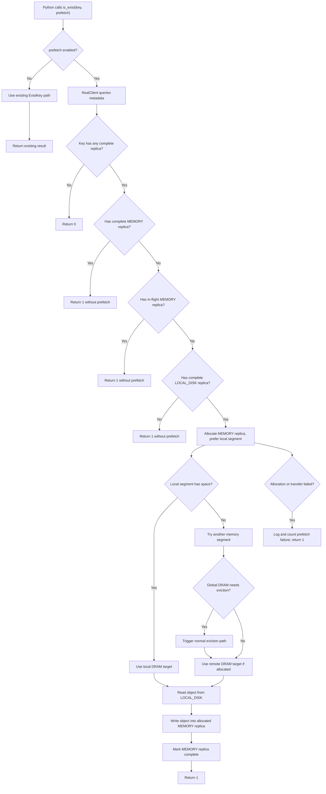

# [Issue #2213] [RFC]: Prefetch SSD-Only Objects to DRAM on Exist

source: https://github.com/kvcache-ai/Mooncake/issues/2213
state: closed | updated: 2026-09-15T03:20:55Z
labels: stale, auto-closed

## 正文

### Changes proposed

## Background

Mooncake Store can keep object replicas in both distributed memory and SSD offload storage. When SSD offload is enabled, an object may remain available only as a `LOCAL_DISK` replica after its `MEMORY` replica has been evicted.

Today, `exist` is a metadata-style query. It checks whether the key has at least one complete replica and returns whether the object exists. **It does not change replica placement.** This keeps the API lightweight, but it also means a subsequent `get` may still need to read from SSD even if the caller has just probed the key and is likely to access it soon.

For workloads that use `exist` as a cache probe before a later read, an SSD-only hit is a strong signal that the object may become hot again. This RFC proposes an optional behavior: **when `exist` finds that an object exists on SSD but has no DRAM replica, Mooncake Store can prefetch that object from SSD back into DRAM.**

This is especially valuable for frameworks with **asynchronous scheduling**, which is enabled by default in vLLM. In those systems, an `exist(prefetch=True)` probe for a future request or future block can **overlap with the current forward pass**. The SSD read and DRAM materialization latency can therefore be hidden behind ongoing compute. If the prefetch completes before the later `get`, the final access observes a DRAM hit even though the original probe found the object only on SSD. In this mode, **SSD hits can approach DRAM-hit behavior from the application's perspective**, provided the scheduler issues probes early enough and the memory tier has enough capacity to hold the promoted objects.

**The behavior is opt-in and disabled by default.**

## Goals

- Allow Python users to opt in to SSD-to-DRAM prefetch on `exist`.
- **Preserve current `exist` behavior by default.**
- **Only prefetch when the key exists on SSD, does not already have a complete DRAM replica, and does not have an in-flight DRAM put.**
- **Prefer prefetching into the local DRAM segment of the requesting real client.**
- Fall back to another available memory segment when the local segment has no space.
- Reuse normal memory allocation and eviction behavior. If global DRAM is full, normal eviction should be triggered.
- Keep the `exist` return value compatible: `1` means exists, `0` means not exists, negative values remain errors.

## Non-Goals

- **This RFC does not propose changing default `exist` semantics.**
- This RFC does not require `exist` to wait for prefetch completion in all modes.
- This RFC does not introduce a new persistent replica type.
- This RFC does not change SSD offload write policy, including `offload_on_evict`.
- This RFC does not require prefetch for keys that already have a complete DRAM replica or an in-flight DRAM replica.

## API Proposal

Add an optional boolean flag to Python `is_exist`:

```python
store.is_exist(key: str, prefetch: bool = False) -> int
```

**Default behavior remains unchanged:**

```python
store.is_exist("k1")
store.is_exist("k1", prefetch=False)
```

**Opt-in prefetch:**

```python
store.is_exist("k1", prefetch=True)
```

When `prefetch=True`, `is_exist` should:

1. Return `0` if the key does not exist.
2. Return `1` immediately or after a best-effort prefetch attempt if the key exists.
3. **Trigger SSD-to-DRAM prefetch only when the key has a complete `LOCAL_DISK` replica, no complete `MEMORY` replica, and no in-flight `MEMORY` replica.**

The same flag can be added to batch exist as a follow-up:

```python
store.batch_is_exist(keys: list[str], prefetch: bool = False) -> list[int]
```

Batch support is useful for KV cache block probes, but the single-key API is sufficient for the first implementation.

## Semantics

### Existing Behavior

Current `exist` checks master metadata:

- Key missing: return `false`.
- Key exists but no complete replica: return `false`.
- Key has at least one complete replica: grant lease and return `true`.

No object data is transferred.

### Proposed Behavior with `prefetch=False`

**No behavior change.**

### Proposed Behavior with `prefetch=True`

When the caller enables prefetch, the client should inspect replica placement after confirming the key exists:

- **If a complete `MEMORY` replica exists, return success without prefetch.**
- **If a `MEMORY` replica is being written or otherwise in flight, return success without prefetch.**
- **If no complete `MEMORY` replica exists, but a complete `LOCAL_DISK` replica exists, prefetch the object from SSD into DRAM.**
- If only a legacy `DISK` replica exists, do not prefetch in the initial implementation unless explicitly extended later.
- If the key is missing or has no complete replica, return not-exist.

**Prefetch should be best effort** from an API compatibility perspective:

- If the key exists but prefetch fails due to transient allocation or transfer failure, `exist` may still return `1`.
- The failure should be logged and counted in metrics.
- If metadata query itself fails, return the existing negative error code.

This keeps `exist` as an existence API rather than making it a strict data movement API.

## Placement Policy

**Prefetch should use one memory replica by default.**

The target placement should follow this order:

1. **Prefer the local memory segment of the requesting real client.**
2. If local allocation fails, allocate from any available memory segment.
3. **If DRAM is globally full, rely on the normal allocation path to trigger eviction.**
4. If allocation still fails after eviction, treat prefetch as failed but keep the existence result.

This mirrors the intent of the existing "prefer local segment" behavior used when putting data from HBM or local buffers: local placement is preferred for read locality, but the system should still make progress when local DRAM is full.

Implementation-wise, the prefetch allocation should use `ReplicateConfig` with:

```cpp
replica_num = 1
preferred_segment = local_hostname
```

or an equivalent preferred-segment list. The allocation strategy should try the preferred segment first, then fall back to other segments if the preferred segment cannot satisfy the allocation.

## Data Flow

The high-level decision flow is:



The concrete SSD-to-DRAM prefetch path is:

```text
Python
  |
  | is_exist(key, prefetch=True)
  v
RealClient
  |
  | Query metadata
  v
Master
  |
  | replicas contain COMPLETE LOCAL_DISK
  | and do not contain COMPLETE MEMORY
  | and do not contain in-flight MEMORY
  v
RealClient
  |
  | allocate MEMORY replica, prefer local segment
  v
Master
  |
  | PutStart/PrefetchStart allocates DRAM
  v
RealClient
  |
  | read from LOCAL_DISK via offload RPC
  | write into allocated MEMORY replica
  v
Master
  |
  | PutEnd/PrefetchEnd marks MEMORY replica complete
  v
Python
  |
  | returns 1
```

The prefetch path can be implemented as a specialized internal copy from `LOCAL_DISK` to `MEMORY`:

1. Query replicas for the key.
2. Select a complete `LOCAL_DISK` source replica only if no complete or in-flight `MEMORY` replica exists.
3. Allocate a new `MEMORY` replica for the same key using preferred-local placement.
4. Read the object from SSD into the allocated DRAM buffer.
5. Mark the new `MEMORY` replica complete.

## Master-Side Requirements

The current master `ExistKey` API only returns a boolean. To implement prefetch, the caller needs replica placement information. There are two possible approaches:

### Option A: Client-side query before or after `ExistKey`

Keep master `ExistKey` unchanged. When `prefetch=True`, the real client uses the normal query path to fetch replica descriptors, then decides whether prefetch is needed.

Pros:

- Minimal change to existing `ExistKey`.
- Keeps default `exist` fast.
- Reuses existing replica selection helpers.

Cons:

- `exist(prefetch=True)` may require an additional metadata query.

### Option B: Extend `ExistKey` response

Introduce a richer RPC response for prefetch-capable exist:

```cpp
struct ExistKeyResponse {
    bool exists;
    bool has_complete_memory_replica;
    bool has_inflight_memory_replica;
    bool has_local_disk_replica;
    std::vector<Replica::Descriptor> replicas;
};
```

Pros:

- One metadata RPC can answer both existence and placement.
- Cleaner semantics for batch exist with prefetch.

Cons:

- Larger API and serialization change.
- More compatibility work for existing clients.

**Recommendation: start with Option A.** It is simpler and keeps the existing `ExistKey` RPC stable.

## Client-Side Requirements

Add new client-layer methods, for example:

```cpp
tl::expected<bool, ErrorCode> Client::IsExist(
    const std::string& key,
    bool prefetch_to_memory);

tl::expected<bool, ErrorCode> RealClient::isExist_internal(
    const std::string& key,
    bool prefetch_to_memory);
```

For Python binding:

```cpp
.def(
    "is_exist",
    [](MooncakeStorePyWrapper& self, const std::string& key, bool prefetch) {
        py::gil_scoped_release release;
        return self.store_->isExist(key, prefetch);
    },
    py::arg("key"),
    py::arg("prefetch") = false)
```

The existing overload without the flag should continue to work.

## Prefetch Operation

The real client should provide an internal helper:

```cpp
tl::expected<void, ErrorCode> RealClient::PrefetchLocalDiskToMemory(
    const std::string& key,
    const std::vector<Replica::Descriptor>& replicas);
```

The helper should:

1. Check whether a complete or in-flight `MEMORY` replica already exists.
2. Select a complete `LOCAL_DISK` replica as the source only when no `MEMORY` replica is complete or in flight.
3. Allocate one new memory replica, preferring the local segment.
4. Use the existing SSD read path to load data from `LOCAL_DISK`.
5. Transfer the loaded data into the allocated memory replica.
6. Complete the memory replica in master metadata.
7. Handle duplicate races idempotently.

**Races are expected.** For example, another client may prefetch or put the same key concurrently. If a complete or in-flight memory replica appears before completion, the prefetch should be treated as successful or safely revoked. In particular, **a key with a `MEMORY` replica in a `PROCESSING` state should not start SSD-to-DRAM prefetch**, because the normal put path is already materializing that key in DRAM.

## Eviction Behavior

**Prefetch allocation should use the same memory allocation path as normal puts.** Therefore:

- If local DRAM is full, allocation should try other eligible segments.
- If global DRAM is full, normal eviction should be triggered.
- If eviction selects objects for SSD offload, existing `offload_on_evict` behavior should apply.
- The prefetched object should receive the usual lease or soft-pin treatment to avoid immediate eviction while the caller is likely to use it.

The RFC does not propose a special eviction policy for prefetched objects. They should participate in normal LRU/lease-based eviction after being materialized in memory.

## Error Handling

Recommended behavior:

- Metadata query error: return negative error code.
- Key not found: return `0`.
- Key exists in memory: return `1`.
- Key has an in-flight memory replica: return `1` without prefetch.
- Key exists only on SSD and prefetch succeeds: return `1`.
- Key exists only on SSD and prefetch fails: return `1`, log the prefetch failure, and update a metric.

**Returning `1` on prefetch failure is intentional because the object does exist.** Applications that require strict materialization should use a future explicit prefetch API or call `get`.

## Metrics

TBD

## Compatibility

This change is backward compatible:

- Python `is_exist(key)` keeps the same behavior.
- **Default `prefetch=False` avoids unexpected data movement.**
- Existing users who rely on `exist` as a cheap metadata check are not affected.
- The behavior is opt-in per call, so higher-level systems can enable it only for cache probes likely to be followed by reads.


## Summary

This RFC proposes an **opt-in `exist` prefetch mode** for Mooncake Store. When memory and SSD offload are both enabled, `is_exist(key, prefetch=True)` can promote SSD-only objects back into DRAM, preferring the caller's local segment and falling back to other memory segments when local DRAM is full.

**The default remains unchanged.** The feature improves cache-warming behavior for callers that use `exist` as a predictor of near-future access, while preserving the lightweight semantics of existing `exist` calls.

cc List: @ykwd @ascend-direct-dev @LCAIZJ @LujhCoconut 

Feedbacks are welcome!

### Before submitting a new issue...

- [ ] Make sure you already searched for relevant issues and read the [documentation](https://kvcache-ai.github.io/Mooncake/)

## 评论 (4)

### LujhCoconut · 2026-05-27

Thanks. The overall approach looks good! One suggestion on the API design: instead of a bare bool for `prefetch`, consider using an options/config struct (e.g., `ExistOptions`) from the start. Even though `prefetch` is the only flag today, this leaves room for future extensions without changing the function signature each time. It also aligns with the existing `ReplicateConfig` pattern in the codebase.

### Pz1116 · 2026-05-27

> Thanks. The overall approach looks good! One suggestion on the API design: instead of a bare bool for `prefetch`, consider using an options/config struct (e.g., `ExistOptions`) from the start. Even though `prefetch` is the only flag today, this leaves room for future extensions without changing the function signature each time. It also aligns with the existing `ReplicateConfig` pattern in the codebase.

Thanks for the feedback! I agree, condisdering future needs, using an options struct is the way to go. Let me take note of this.

### github-actions[bot] · 2026-09-08

This issue has had no activity for 90 days and will be closed in 7 days if there is no further activity. Please comment or react if it should stay open.

### github-actions[bot] · 2026-09-15

Closing due to 3 months of inactivity. If this is still relevant, please comment and we can reopen.
