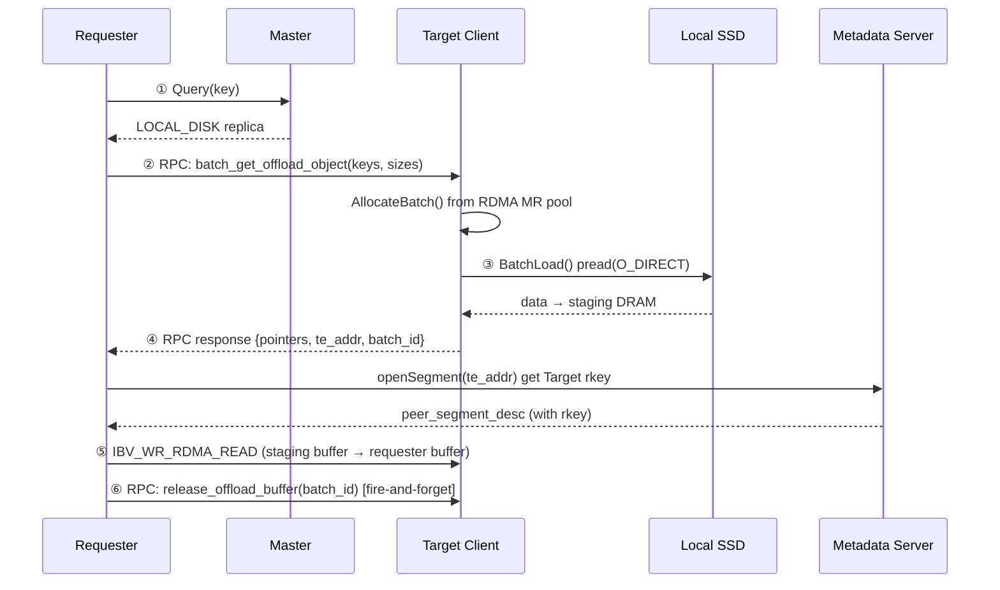
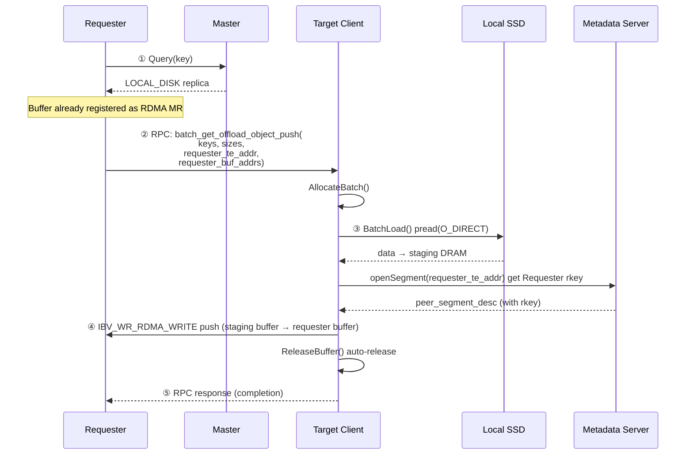

# [Issue #2451] [Feature Request]: Optimize SSD remote read with RDMA direct push

source: https://github.com/kvcache-ai/Mooncake/issues/2451
state: closed | updated: 2026-09-23T03:15:45Z
labels: stale, auto-closed

## 正文

### Describe your feature request

## Changes proposed

This proposal optimizes SSD remote read by switching from a **pull model** to a **push model**. The Target node reads SSD data into its staging buffer and then pushes it to the Requester via `IBV_WR_RDMA_WRITE`, reducing network interactions from **4 → 3** and synchronous wait points from **2 → 1**. Pure software change, no TransferEngine modifications needed.

---

## 1. Introduction

When a Mooncake Store client reads data offloaded to a remote node's SSD, the current implementation requires **4 network interactions** in RDMA mode:

1. RPC request to Target (load from SSD)
2. RPC response (return staging buffer pointers + TransferEngine address)
3. TransferEngine RDMA READ pull (Requester reads from Target's staging buffer)
4. Buffer release RPC (fire-and-forget)

We propose switching to a **push model**: the Requester sends an RPC with its own buffer addresses, the Target loads SSD data and pushes it via RDMA WRITE, then returns a completion response. This reduces to **3 interactions** and eliminates 1 synchronous wait point.

---

## 2. Background and Motivation

### 2.1 Current RDMA SSD Remote Read Flow



**4 hops**: ② RPC request → ④ RPC response → ⑤ RDMA READ data → ⑥ release RPC

### 2.2 The Problem: Two Synchronous Wait Points

The Requester has **2 synchronous wait points** on the critical path:
- **Wait 1**: RPC roundtrip (steps ②③④) — wait for Target to load SSD and return pointers
- **Wait 2**: RDMA READ completion (step ⑤) — wait for data transfer to finish

These are strictly serial: the Requester must receive pointers (Wait 1) before it can issue RDMA READ (Wait 2).

**Critical path latency = 2 × RTT + SSD I/O + data transfer time**

### 2.3 Key Observation: RDMA Infrastructure Already Supports Push

The TransferEngine's RDMA layer already maps WRITE opcode to `IBV_WR_RDMA_WRITE`:

**`rdma_endpoint.cpp:760-762`**:
```cpp
wr.opcode = slice->opcode == Transport::TransferRequest::READ
                ? IBV_WR_RDMA_READ
                : IBV_WR_RDMA_WRITE;
```

The staging buffer pool is already registered as RDMA MR via `ibv_reg_mr()`:

**`file_storage.cpp:899-902`**:
```cpp
auto error_code = client_->RegisterLocalMemory(
    client_buffer_allocator_->getBase(), config_.local_buffer_size,
    kWildcardLocation, false, true);
```

**No TransferEngine or RDMA layer changes needed** — only mooncake-store application layer orchestration.

---

## 3. Proposed Design: RDMA Direct Push (4 hops → 3 hops)

### 3.1 Proposed Flow



**3 hops**: ② RPC request → ④ RDMA WRITE data → ⑤ RPC response. Eliminated: ⑥ release RPC.

### 3.2 What Changes

#### New RPC Request

```cpp
struct BatchGetOffloadObjectPushRequest {
    std::vector<std::string> keys;
    std::vector<int64_t> sizes;
    std::string requester_transfer_engine_addr;  // NEW
    std::vector<uint64_t> requester_buffer_addrs; // NEW: RDMA MR virtual addresses
};
```

#### Simplified RPC Response

```cpp
struct BatchGetOffloadObjectPushResponse {
    bool success;
    std::string error_message;       // non-empty on failure
    std::vector<int32_t> status;     // per-key status codes
};
```

#### New Target-side Handler

The Target handler:
1. Calls `FileStorage::BatchGet()` to load SSD data into staging buffers (unchanged)
2. Opens segment to `requester_te_addr` via `engine_.openSegment()` → gets Requester's rkey from Metadata Server
3. Constructs `TransferRequest` with `opcode = WRITE`, `source = staging buffer`, `target_offset = requester_buf_addrs[i]`
4. Submits via `submitTransfer()` and waits for completion
5. Calls `FileStorage::ReleaseBuffer()` to free staging buffers
6. Returns completion response

#### New TransferSubmitter Function

```cpp
std::optional<TransferFuture>
TransferSubmitter::submit_batch_push_offload_object(
    const std::string& requester_te_addr,
    const std::vector<uint64_t>& staging_pointers,     // local staging (source)
    const std::vector<uint64_t>& requester_buf_addrs,  // remote requester (dest)
    const std::vector<size_t>& sizes) {
    SegmentHandle seg = engine_.openSegment(requester_te_addr);
    std::vector<TransferRequest> requests;
    for (size_t i = 0; i < sizes.size(); ++i) {
        TransferRequest request;
        request.opcode = TransferRequest::WRITE;              // WRITE = push
        request.source = reinterpret_cast<char*>(staging_pointers[i]);
        request.target_id = seg;
        request.target_offset = requester_buf_addrs[i];
        request.length = sizes[i];
        requests.emplace_back(request);
    }
    return submitTransfer(requests);  // Reuses existing RDMA submission path
}
```

### 3.3 rkey Resolution (Existing Code, No Changes)

When Target calls `openSegment(requester_te_addr)`, it connects to Requester's Metadata Server and downloads the segment descriptor containing buffer rkeys.

**`worker_pool.cpp:129-144`** resolves the rkey from the remote segment descriptor:
```cpp
RdmaTransport::selectDevice(peer_segment_desc.get(), slice->rdma.dest_addr, ...)
slice->rdma.dest_rkey = peer_segment_desc->buffers[buffer_id].rkey[device_id];
```

This code is **opcode-agnostic** — it works identically for READ and WRITE.

### 3.4 Completion Notification

In the push model, the RPC response serves as the completion notification. The Target waits for RDMA WRITE completion (CQ completion = data sent and ACK'd by remote NIC) before sending the RPC response. When the Requester receives the response, the data is guaranteed to be in its buffer.

---

## 4. Implementation Plan

### Phase 1: Core Infrastructure
1. Add `BatchGetOffloadObjectPushRequest` / `Response` to `rpc_types.h`
2. Add `RealClient::batch_get_offload_object_push()` handler on Target side
3. Register new RPC handler in offload RPC server (`real_client.cpp`)
4. Add `TransferSubmitter::submit_batch_push_offload_object()` using `WRITE` opcode

### Phase 2: Requester Integration & Testing
5. Add rkey resolution for Requester's local buffers
6. Modify `batch_get_into_offload_object_internal()` to use push path when RDMA is available
7. Add fallback to legacy pull-based path for non-RDMA environments
8. Unit tests + end-to-end integration test
9. Benchmark: latency comparison pull (4 hops, 2 waits) vs push (3 hops, 1 wait)

---

## 5. Compatibility

- **Backward compatible**: New RPC handler is added alongside existing ones. The legacy pull path (4 hops) remains unchanged.
- **Feature negotiation**: Requester can probe Target capability, or try the new RPC and fall back on error.
- **TCP/UB transport**: Push model works with all transports that support the WRITE opcode (RDMA, UB, TCP). Deployments without RDMA can still benefit from the simplified flow (fewer RPC roundtrips).
- **No new dependencies**.

---

### Before submitting a new issue...

- [x] Make sure you already searched for relevant issues and read the [documentation](https://kvcache-ai.github.io/Mooncake/)

---

Credit to @syliudf for the initial proposal and analysis.


## 评论 (4)

### github-actions[bot] · 2026-06-12

Thanks for opening this issue, @zchuango!

| Field | Value |
|-------|-------|
| **Issue** | #2451 |
| **GitHub user ID** | `237737874` |
| **Reporter** | @zchuango |

A maintainer will triage this when possible. To help us respond faster, please include:

- Mooncake version or commit SHA
- Environment (OS, CUDA/driver, RDMA stack if relevant)
- Steps to reproduce and expected vs. actual behavior

Useful links: [Documentation](https://kvcache-ai.github.io/Mooncake/) · [Contributing guide](https://github.com/kvcache-ai/Mooncake/blob/main/CONTRIBUTING.md)

> This message was posted automatically by the issue bot.

### zchuango · 2026-06-17

Hi @stmatengss , could you please take a look at this proposal when you have time?

This is related to the Mooncake Store remote SSD read path. The main idea is to reduce one RDMA round trip by changing the remote SSD read flow from requester-side RDMA READ pull to target-side RDMA WRITE push, without requiring Transfer Engine API changes.

I would appreciate your feedback on whether this direction is reasonable before I start drafting an implementation PR. Thanks!

### github-actions[bot] · 2026-09-15

This issue has had no activity for 90 days and will be closed in 7 days if there is no further activity. Please comment or react if it should stay open.

### github-actions[bot] · 2026-09-23

Closing due to 3 months of inactivity. If this is still relevant, please comment and we can reopen.
