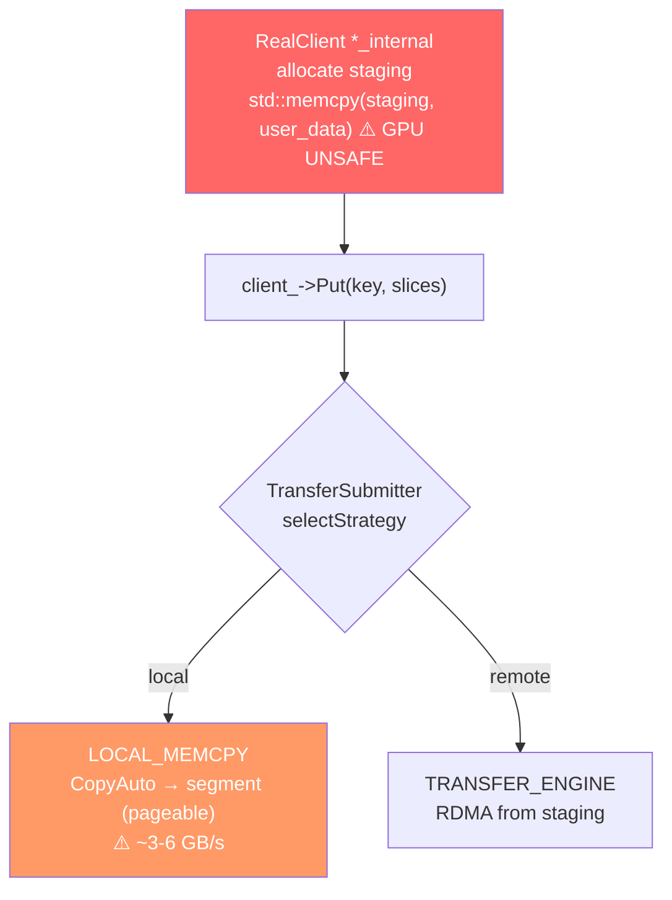
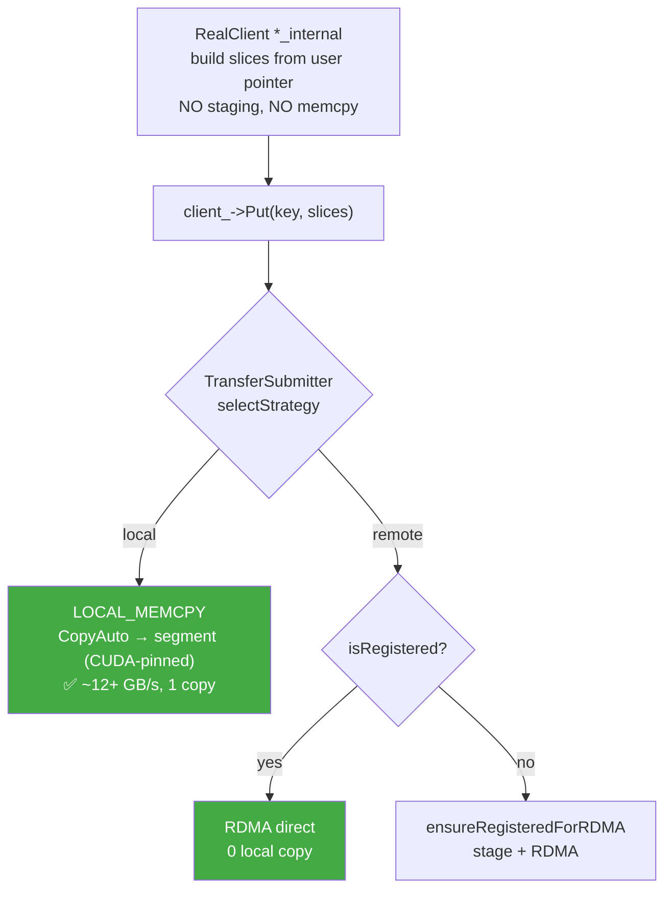
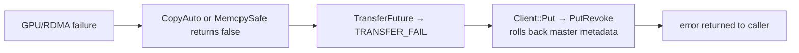

# [Issue #2479] [RFC]: Zero-Copy Read/Write: Eliminate Redundant Data Copies

source: https://github.com/kvcache-ai/Mooncake/issues/2479
state: closed | updated: 2026-09-22T03:15:23Z
labels: stale, auto-closed

## 正文

## Background and Motivation

Mooncake Store's read/write paths have three systemic issues:

1. **GPU pointer unsafety**: 8 `std::memcpy` call sites may receive GPU device pointers, causing crashes or silent data corruption.
2. **Redundant staging copies**: The write path always stages user data into an intermediate buffer — 2 copies instead of 1.
3. **Slow GPU→CPU bandwidth**: `cudaMemcpy` to pageable (non-CUDA-pinned) memory is throttled to ~3-6 GB/s by internal driver staging. Pinned memory achieves ~12+ GB/s.

### Root Cause

All six `*_internal` write functions unconditionally stage in RealClient:

```
user buffer → ① std::memcpy → staging buffer → ② CopyAuto → target segment
```

- Copy ① is **GPU unsafe** (`std::memcpy` cannot operate on device memory)
- Copy ① is **redundant** — staging can be skipped if we push the decision downstream
- Both staging buffer and segment are **pageable** (not CUDA-pinned), so even `cudaMemcpy` via `CopyAuto` only achieves ~3-6 GB/s

### Current vs Target Copy Counts

| Scenario | Current | Target |
|----------|---------|--------|
| GPU → local segment | 2 copies, ~3-6 GB/s, GPU unsafe | **1 copy, ~12+ GB/s** |
| CPU → local segment | 2 copies | **1 copy** |
| Registered buf → remote (RDMA) | 1+RDMA, GPU unsafe | **0+RDMA** |
| Unregistered buf → remote (RDMA) | 1+RDMA, GPU unsafe | **1+RDMA, GPU safe** |
| `get_buffer` → `buffer_to_tensor` | 2 copies | **1 copy** |

---

## Core Design

Two orthogonal changes that compose into the solution:

1. **`cudaHostRegister` segment and staging memory** — enables full-bandwidth GPU DMA
2. **Push staging decision to TransferSubmitter** — eliminates the redundant copy

### Current Architecture



### Proposed Architecture



---

## Key Design Details

### `cudaHostRegister` segment and staging memory

At mount time (`MountSegmentAndGetId`), after RDMA registration (`ibv_reg_mr`), call `cudaHostRegister` on the segment memory to make it CUDA-pinned. Same for the staging buffer at `setup_internal`.

```cpp
#ifdef USE_CUDA
auto ret = cudaHostRegister(buffer, size, cudaHostRegisterDefault);
if (ret != cudaSuccess) {
    LOG(WARNING) << "cudaHostRegister failed: " << cudaGetErrorString(ret);
    // Non-fatal: falls back to pageable-speed cudaMemcpy
}
#endif
```

**Why this works**:
- Segment memory is `mmap`-allocated (hugepage, 2MB-aligned), long-lived, never reallocated — ideal for `cudaHostRegister`
- `ibv_reg_mr` (RDMA pin) and `cudaHostRegister` (CUDA pin) coexist — different subsystems pinning the same pages
- **Precedent**: Mooncake's tent NVLink transport already uses `cudaHostRegister` on CPU memory in production (`nvlink_transport.cpp:276`)

### `MemcpySafe`: GPU-safe generic memcpy

```cpp
// gpu_staging_utils.h
inline bool MemcpySafe(void* dst, const void* src, size_t size) {
    if (!IsDevicePointer(src) && !IsDevicePointer(dst)) {
        std::memcpy(dst, src, size); return true;
    }
    SetDevice(/* whichever is GPU */);
    return CopyAuto(dst, src, size);
}
```

### Copy efficiency: `CopyAuto` and `MemcpySafe`

`CopyAuto` wraps `cudaMemcpy(dst, src, size, cudaMemcpyDefault)` — a synchronous, blocking copy. Two overhead sources:

| Source | Cost | Impact at MB+ scale |
|--------|------|---------------------|
| `cudaMemcpy` sync overhead (implicit stream create + wait) | ~5-10 us/call | Negligible (<0.1%) |
| `cudaPointerGetAttributes` in `IsDevicePointer` (×2 per call) | ~1-5 us/call | Negligible |

**Bandwidth** (with `cudaHostRegister`'d destination):
- GPU→pinned host: ~12-25 GB/s (PCIe Gen4/5 DMA, full line rate)
- CPU→CPU fallback: `std::memcpy` at ~20+ GB/s

This is sufficient for Mooncake Store's primary workload (MB+ tensor writes). The overhead is amortized over large transfers.

**Future optimization**: Replace `cudaMemcpy` with `cudaMemcpyAsync` on a persistent per-worker CUDA stream. Eliminates the per-call stream creation overhead and allows CPU-side pipelining. Not required for Phase 1 — the bandwidth bottleneck is PCIe, not API overhead.

### `ensureRegisteredForRDMA`: on-demand staging for TRANSFER_ENGINE

Only allocates staging when the RDMA path is selected AND a slice is not RDMA-registered:

```cpp
auto [prepared_slices, staging_handles] = ensureRegisteredForRDMA(slices);
// registered → original ptr; unregistered → staging copy
```

### Staging removal from `*_internal`

Six write functions change from `allocate → memcpy → split_into_slices(staging)` to `split_into_slices(user_ptr)`. Follows the existing zero-copy pattern of `put_from_internal`.

**Lifetime safety**: All `Put`/`Upsert` calls are synchronous — user buffer on caller's stack stays alive throughout the transfer.

---

## Read Path

- `get_into` / `get_into_ranges`: already optimal for memory replicas (1 copy). No change.
- `get_buffer` → `buffer_to_tensor`: reads into staging, then `new char[] + memcpy`. Fix: transfer `BufferHandle` ownership to the tensor capsule (1 copy instead of 2).
- `execute_tensor_into_plan_transfers`: `std::memcpy(metadata → gpu_buffer)` is GPU unsafe. Fix: replace with `MemcpySafe`.

---

## GPU-Unsafe Call Sites

| Call site | File | Path |
|-----------|------|------|
| `put_internal` staging memcpy | `real_client.cpp:1551` | Write |
| `put_batch_internal` staging memcpy | `real_client.cpp:1629` | Write |
| `put_parts_internal` loop memcpy | `real_client.cpp:1733` | Write |
| `upsert_internal` staging memcpy | `real_client.cpp:3504` | Write |
| `upsert_parts_internal` loop memcpy | `real_client.cpp:3750` | Write |
| `upsert_batch_internal` staging memcpy | `real_client.cpp:3834` | Write |
| `batch_write_tensor_impl` data memcpy | `store_py_parallel_write.h:55-57` | Write |
| `execute_tensor_into_plan_transfers` metadata memcpy | `store_py_parallel_read.h:1074` | Read |

---

## Risks and Mitigations

| Risk | Impact | Mitigation |
|------|--------|-----------|
| `cudaHostRegister` fails (no GPU, insufficient pinnable memory) | GPU→segment copies remain at pageable speed (~3-6 GB/s) | Non-fatal: log WARNING, system works correctly at reduced GPU bandwidth. CPU→CPU path unaffected. |
| `cudaHostRegister` on hugepage memory | Potential compatibility issues on some kernels | Validated: tent NVLink transport uses same pattern in production. `cudaHostRegister` supports hugepages since CUDA 11. |
| Large segment registration overhead | One-time latency at startup (ms-level for GB-scale memory) | Amortized over process lifetime. Only done once at mount time. |
| `ibv_reg_mr` + `cudaHostRegister` coexistence | Theoretical double-pinning conflict | Both pin OS pages — independent subsystems (NIC DMA vs GPU DMA). No known conflict. RDMA registration uses `IBV_ACCESS_LOCAL_WRITE`; CUDA registration uses page table entries. |
| Removing staging breaks `*_internal` user buffer lifetime | Data corruption if user buffer freed during transfer | All Put/Upsert/BatchPut are synchronous — user buffer guaranteed alive. `std::span<const char>` references caller stack data. |
| System pinned memory limit (`vm.max_map_count`, RLIMIT_MEMLOCK) | Registration silently fails or OOM-kills | Check `ulimit -l` at startup; document minimum requirements. Fallback is transparent (pageable speed). |

---

## Error Handling



---

## Scope and Phasing

| Phase | Scope | Files | Est. lines |
|-------|-------|-------|-----------|
| 1 | GPU safety + `cudaHostRegister` segment/staging | `gpu_staging_utils.h`, `real_client.cpp`, `client_service.cpp`, `store_py_parallel_*.h` | ~80 |
| 2 | Remove staging from `*_internal` + `ensureRegisteredForRDMA` | `real_client.cpp`, `transfer_task.h/.cpp`, `transfer_engine*.h/.cpp`, `client_service.cpp` | ~200 |
| 3 | Read path: `buffer_to_tensor` ownership transfer | `store_py.cpp` | ~30 |
| | **Total** | | **~310** |

**Phase 1** is low-risk (additive changes, non-fatal fallback). Deploy and validate first.

**Phase 2** restructures the write path. Depends on Phase 1 for GPU safety. Higher blast radius but all changes are API-compatible.

**Phase 3** is isolated to Python binding layer.

## Compatibility

- **No API changes**. All public interfaces unchanged.
- **Non-GPU fallback**: `cudaHostRegister` failure is non-fatal. System operates correctly without GPU, just at pageable speed for GPU transfers.
- **Registration requirement**: Zero-copy remote RDMA still requires `register_buffer()`. Unregistered buffers handled transparently via `ensureRegisteredForRDMA`.


## 评论 (3)

### github-actions[bot] · 2026-06-15

Thanks for opening this issue, @zxpdemonio!

| Field | Value |
|-------|-------|
| **Issue** | #2479 |
| **GitHub user ID** | `16206312` |
| **Reporter** | @zxpdemonio |

A maintainer will triage this when possible. To help us respond faster, please include:

- Mooncake version or commit SHA
- Environment (OS, CUDA/driver, RDMA stack if relevant)
- Steps to reproduce and expected vs. actual behavior

Useful links: [Documentation](https://kvcache-ai.github.io/Mooncake/) · [Contributing guide](https://github.com/kvcache-ai/Mooncake/blob/main/CONTRIBUTING.md)

> This message was posted automatically by the issue bot.

### github-actions[bot] · 2026-09-14

This issue has had no activity for 90 days and will be closed in 7 days if there is no further activity. Please comment or react if it should stay open.

### github-actions[bot] · 2026-09-22

Closing due to 3 months of inactivity. If this is still relevant, please comment and we can reopen.
