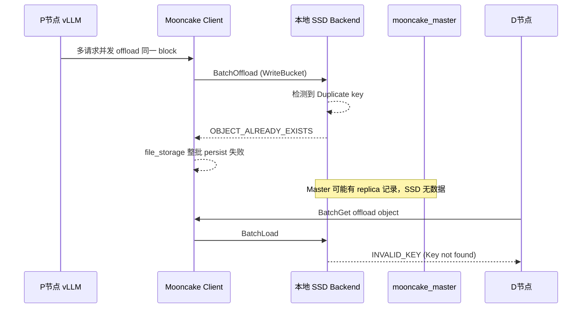

# [Issue #2827] [Bug]: [SSD] DSV4 enable SSD offload，stress testing, repeat offloading the same batch key, lead to OBJECT_ALREADY_EXISTS/persist failed/INVALID_KEY

source: https://github.com/kvcache-ai/Mooncake/issues/2827
state: closed | updated: 2026-09-16T04:23:23Z
labels: bug

## 正文

### Bug Report

# 测试场景：
DeepSeekV4模型，PD分离，4机，1P1D，P和D都是双机。

## P节点的1台机器的vllm启动脚本。
```shell
unset ftp_proxy
unset https_proxy
unset http_proxy
rm -rf ~/ascend/log
rm -rf /opt/XXX/Test/vLLM/mooncake-ssd/logs/*
#!/bin/bash
TIMESTAMP=$(date +"%Y%m%d%H%M")

#export HCCL_INTRA_PCIE_ENABLE=1
#export HCCL_INTRA_ROCE_ENABLE=0

MASTER_IP_ADDRESS="x.xxx.xx.xx"
IP_ADDRESS="x.xxx.xx.xx"
SERVICE_PORT=10000
LOG_FILE="/opt/XXX/Test/vLLM/mooncake-ssd/logs/deepseekv4_start_prefill_${TIMESTAMP}.log"

NETWORK_INTERFACE="eth0"
export ASCEND_RT_VISIBLE_DEVICES=0,1,2,3,4,5,6,7
PREFILL_DATA_PARALLEL_RANK=0

PREFILL_DATA_PARALLEL_SIZE=2
PREFILL_TENSOR_PARALLEL_SIZE=8

MODEL_PATH="/opt/Dsv4-flash-bf16"
MODEL_NAME="DeepSeek-V4-Flash"

# # mooncake
export MOONCAKE_CONFIG_PATH="/opt/XXX/Test/vLLM/mooncake-ssd/configs/mooncake.json"
export LD_LIBRARY_PATH=/usr/local/lib:/usr/local/lib64:${LD_LIBRARY_PATH}
export PYTHONHASHSEED=0
export HCCL_INTRA_ROCE_ENABLE=1
export ASCEND_CONNECT_TIMEOUT=10000
export ASCEND_TRANSFER_TIMEOUT=10000

# # jemalloc
export LD_PRELOAD=/usr/lib64/libjemalloc.so.2:$LD_PRELOAD
# # AIV
export HCCL_OP_EXPANSION_MODE="AIV"
export TASK_QUEUE_ENABLE=1
export VLLM_RPC_TIMEOUT=3600000
export VLLM_EXECUTE_MODEL_TIMEOUT_SECONDS=30000
export HCCL_EXEC_TIMEOUT=1200
export HCCL_CONNECT_TIMEOUT=1200

export HCCL_IF_IP=$IP_ADDRESS
export GLOO_SOCKET_IFNAME=$NETWORK_INTERFACE
export TP_SOCKET_IFNAME=$NETWORK_INTERFACE
export HCCL_SOCKET_IFNAME=$NETWORK_INTERFACE
export OMP_PROC_BIND=false
export OMP_NUM_THREADS=10
export PYTORCH_NPU_ALLOC_CONF=expandable_segments:True
export HCCL_BUFFSIZE=1024

#export VLLM_VERSION=0.20.2
export VLLM_ASCEND_APPLY_DSV4_PATCH=1
export VLLM_ASCEND_ENABLE_FLASHCOMM1=1
#export USE_MULTI_GROUPS_KV_CACHE=1
#export USE_MULTI_BLOCK_POOL=1

vllm serve "$MODEL_PATH" \
--host "$IP_ADDRESS" \
--port "$SERVICE_PORT" \
--data-parallel-size "$PREFILL_DATA_PARALLEL_SIZE" \
--data-parallel-rank "$PREFILL_DATA_PARALLEL_RANK" \
--data-parallel-address "$MASTER_IP_ADDRESS" \
--data-parallel-rpc-port 12321 \
--tensor-parallel-size "$PREFILL_TENSOR_PARALLEL_SIZE" \
--enable-expert-parallel \
--served-model-name "$MODEL_NAME" \
--seed 1024 \
--max-model-len 204800 \
--max-num-batched-tokens 4096 \
--max-num-seqs 16 \
--block-size 128 \
--enforce-eager \
--async-scheduling \
--no-disable-hybrid-kv-cache-manager \
--no-enable-prefix-caching \
--trust-remote-code \
--gpu_memory_utilization 0.95 \
--speculative-config '{"num_speculative_tokens": 1,"method": "mtp","enforce_eager": true}' \
--safetensors-load-strategy 'prefetch' \
--model-loader-extra-config='{"enable_multithread_load": "true", "num_threads": 128}' \
--tokenizer-mode deepseek_v4 \
--tool-call-parser deepseek_v4 \
--enable-auto-tool-choice \
--reasoning-parser deepseek_v4 \
--additional-config '{"enable_cpu_binding": true, "enable_shared_expert_dp": true}' \
--kv-transfer-config \
    '{"kv_connector": "MultiConnector",
    "kv_role": "kv_producer",
    "kv_connector_extra_config": {
        "connectors": [{
	    "kv_connector": "MooncakeHybridConnector",
	    "kv_role": "kv_producer",
	    "kv_port": "30000",
	    "kv_connector_extra_config": {
                "prefill": {
                        "dp_size": 2,
                        "tp_size": 8
                },
                "decode": {
                        "dp_size": 2,
                        "tp_size": 8
                }
	    }
        },
	{
	    "kv_connector": "AscendStoreConnector",
	    "kv_role": "kv_producer",
	    "kv_connector_extra_config": {
                "backend": "mooncake",
		"lookup_rpc_port": "0"
            }
	}]
    }
    }' > "$LOG_FILE" 2>&1 &
```
## mooncake_master的启动命令。
```shell
export LD_LIBRARY_PATH=/usr/local/lib:/usr/local/lib64:${LD_LIBRARY_PATH}

mooncake_master \
  --rpc_port=39486 \
  --eviction_high_watermark_ratio=0.7 \
  --eviction_ratio=0.2 \
  --default_kv_lease_ttl=11000 \
  --enable_offload=true \
  --offload_on_evict=true
```

# P节点的vllm日志
```text
W20260708 12:39:38.314945  7519 storage_backend.cpp:1353] Duplicate key detected in BatchOffload: Dsv4-flash-bf16@pcp0@dcp0@head_or_tp_rank:0@pp_rank:0@group:0@cache_role:kv@cache_family:c4@cb74f08f554769a92285d5d1a278df180c9d1763a35ca22a68da22ddf5fbec7f, bucket_id=7304518881347. Returning OBJECT_ALREADY_EXISTS.
...
E20260708 12:48:28.416213  7519 file_storage.cpp:731] Key not found: Dsv4-flash-bf16@pcp0@dcp0@head_or_tp_rank:0@pp_rank:0@group:0@cache_role:kv@cache_family:c4@797000e494ea5584f4407dbdd0f8087369dc029a48ccecbc37b63875e55dc7a2
E20260708 12:48:28.416296  7519 file_storage.cpp:382] BatchQuerySlices failed with error: INVALID_KEY
E20260708 12:48:30.313634  7528 file_storage.cpp:731] Key not found: Dsv4-flash-bf16@pcp0@dcp0@head_or_tp_rank:0@pp_rank:0@group:0@cache_role:kv@cache_family:c4@8d1310d6592a04f35eb7eb83c04b6f407b857e81bd428f18339d54580aef6d9a
E20260708 12:48:30.313707  7528 file_storage.cpp:382] BatchQuerySlices failed with error: INVALID_KEY
E20260708 12:48:30.458350  7511 file_storage.cpp:731] Key not found: Dsv4-flash-bf16@pcp0@dcp0@head_or_tp_rank:0@pp_rank:0@group:0@cache_role:kv@cache_family:c4@6b288f4977b946d91003ddcca6332024e5f82185632c7f1c16f600edde81a2fc
E20260708 12:48:30.458447  7511 file_storage.cpp:382] BatchQuerySlices failed with error: INVALID_KEY
E20260708 12:48:30.642908  7526 file_storage.cpp:731] Key not found: Dsv4-flash-bf16@pcp0@dcp0@head_or_tp_rank:0@pp_rank:0@group:0@cache_role:kv@cache_family:c4@dceb210cdce4c83faf29c754daf4918a4ab549fd0ab270dff3f2305735bbf059
E20260708 12:48:30.643005  7526 file_storage.cpp:382] BatchQuerySlices failed with error: INVALID_KEY
E20260708 12:48:30.651410  7513 file_storage.cpp:731] Key not found: Dsv4-flash-bf16@pcp0@dcp0@head_or_tp_rank:0@pp_rank:0@group:5@cache_role:kv@cache_family:c1@b748b1174ac20e00b2329dbdaf9d84f54fc91145820592d0085169055936f49b
E20260708 12:48:30.651494  7513 file_storage.cpp:382] BatchQuerySlices failed with error: INVALID_KEY
E20260708 12:48:30.946017  7517 file_storage.cpp:731] Key not found: Dsv4-flash-bf16@pcp0@dcp0@head_or_tp_rank:0@pp_rank:0@group:5@cache_role:kv@cache_family:c1@b2a33ffe860be7487d2f3abe1dd8062ad2f01d474a9378cda4507368b1786913
E20260708 12:48:30.946106  7517 file_storage.cpp:382] BatchQuerySlices failed with error: INVALID_KEY
...
E20260708 12:57:39.994860 11520 storage_backend.cpp:1424] Key not found: Dsv4-flash-bf16@pcp0@dcp0@head_or_tp_rank:0@pp_rank:0@group:0@cache_role:kv@cache_family:c4@16e8aff8f59dd4f5396cff3500306159171b8eb1745e182f9f3f7ccd94827d35
E20260708 12:57:39.995028 11521 storage_backend.cpp:1424] Key not found: Dsv4-flash-bf16@pcp0@dcp0@head_or_tp_rank:0@pp_rank:0@group:0@cache_role:kv@cache_family:c4@16e8aff8f59dd4f5396cff3500306159171b8eb1745e182f9f3f7ccd94827d35
E20260708 12:57:39.995077 11521 file_storage.cpp:690] Batch load object failed,err_code = INVALID_KEY
E20260708 12:57:39.995029 11520 file_storage.cpp:690] Batch load object failed,err_code = INVALID_KEY
E20260708 12:57:39.995108 11520 file_storage.cpp:311] Batch load object failed,err_code = INVALID_KEY
E20260708 12:57:39.995096 11521 file_storage.cpp:311] Batch load object failed,err_code = INVALID_KEY
E20260708 12:57:39.995134 11520 real_client.cpp:5434] Batch get offload object failed,err_code = INVALID_KEY
E20260708 12:57:39.995139 11521 real_client.cpp:5434] Batch get offload object failed,err_code = INVALID_KEY
...

```

单条请求测试（50K输入，1K输出）时，mooncake + 池化 + ssd没有问题。
32并发，50K输入，1K输出时，会报错，报错见：deepseekv4_start_prefill_XX.log

# 分析
## 问题定位结论

32 并发下失败的核心链路是 **Mooncake SSD Offload 并发写冲突 → 整批 persist 失败 → Master 与本地 SSD 元数据不一致 → D 侧读 KV 时 `INVALID_KEY`**。单请求不触发，是因为没有并发重复 offload。

---

### 1. 错误时间线（日志）

| 时间 | 现象 | 含义 |
|------|------|------|
| **12:39:38** | 首次 `Duplicate key detected in BatchOffload` → `OBJECT_ALREADY_EXISTS` | 多线程/多请求同时 offload 同一 KV block |
| **12:48 ~ 13:10+** | 大量 `Key not found` → `BatchQuerySlices/BatchLoad INVALID_KEY` | SSD 本地索引找不到 block |
| **12:57:39** | `Batch get offload object failed, err_code = INVALID_KEY`（约 4.7 万次） | D 节点经 RPC 从 P 节点 SSD 拉 KV 失败 |
| **14:19+** | 32 并发 POST 开始，`missing_count=N` 持续出现 | KV 传输时 block 缺失，需补存 |

---

### 2. 根因分析

#### 根因 A：并发 offload 同一 KV key（主因）

日志典型片段：

```
W ... Duplicate key detected in BatchOffload: Dsv4-flash-bf16@pcp0@dcp0@head_or_tp_rank:0@...@{block_hash}
    bucket_id=7304518881347. Returning OBJECT_ALREADY_EXISTS.
I ... Cleaned up orphaned bucket data file: /opt/mooncake_offload/rank_8/7304518881347.bucket
E ... Failed to store objects with error: OBJECT_ALREADY_EXISTS
E ... Failed to persist objects with error: OBJECT_ALREADY_EXISTS
```

触发条件（32 并发 + 池化 + prefix caching）：
- 多请求共享 prefix block → **相同 block hash**
- Mooncake 池化后多请求同时触发 offload
- 本地 `object_bucket_map_` 检测到 key 已存在，返回 `OBJECT_ALREADY_EXISTS`

本地代码路径（`storage_backend.cpp`）：

```1344:1353:Mooncake/mooncake-store/src/storage_backend.cpp
        // Pre-check for duplicates before modifying any state
        for (const auto& key : committed_keys) {
            if (object_bucket_map_.find(key) != object_bucket_map_.end()) {
                LOG(WARNING)
                    << "Duplicate key detected in BatchOffload: " << key
                    << ", bucket_id=" << bucket_id
                    << ". Returning OBJECT_ALREADY_EXISTS.";
                lock.unlock();
                CleanupOrphanedBucket(bucket_id);
                return tl::make_unexpected(ErrorCode::OBJECT_ALREADY_EXISTS);
```

#### 根因 B：`file_storage.cpp` 未将 `OBJECT_ALREADY_EXISTS` 视为幂等成功

`PutStart` 路径会把 `OBJECT_ALREADY_EXISTS` 当成功：

```1553:1555:Mooncake/mooncake-store/src/client_service.cpp
        if (err == ErrorCode::OBJECT_ALREADY_EXISTS) {
            VLOG(1) << "object_already_exists key=" << key;
            return {};
```

但 **Offload persist 路径**遇到该错误会直接失败整批：

```563:577:Mooncake/mooncake-store/src/file_storage.cpp
        if (!offload_res) {
            LOG(ERROR) << "Failed to store objects with error: "
                       << offload_res.error();
            ...
            } else {
                return tl::make_unexpected(offload_res.error());
            }
        }
```

后果：
1. 一个 bucket 里只要有一个 duplicate key，**整批 keys 都 persist 失败**
2. 部分 key 可能已在 Master 注册 LOCAL_DISK replica，但本地 SSD 实际未写入
3. D 侧 `BatchGet` → `Key not found` → **`INVALID_KEY`**

#### 根因 C：配置加剧并发冲突

| 配置项 | 当前值 | 影响 |
|--------|--------|------|
| `enable_prefix_caching` | 日志中为 **True**（`run_pd-p.sh` 写了 `--no-enable-prefix-caching`，但实际运行未生效） | 多请求共享 block，duplicate offload 概率高 |
| `default_kv_lease_ttl` | **11000ms（11 秒）** | 50K prefill 远超 11s，lease 过期可能导致 Master 侧 key 失效 |
| `max_num_seqs` | 16 | 32 并发下仍有足够并行度触发 race |
| `offload_on_evict=true` | 开启 | 高并发下 eviction + 重复 offload 叠加 |

---

### 3. 错误传播链



---

### 4. 非主因（可忽略）

- `libjemalloc.so.2` LD_PRELOAD 警告：环境缺库，不影响功能
- Traceback `ValueError: ... is not a multimodal model`：个别请求带了 image 内容，与 Mooncake KV 无关
- `reasoning token IDs` 警告：DSV4 parser 配置问题，非本次根因

---

### 5. 修复建议（按优先级）

**P0 — Mooncake 代码修复**

1. 在 `file_storage.cpp` 的 `OffloadObjects` 中，对 `OBJECT_ALREADY_EXISTS` **按幂等成功处理**（与 `PutStart` 一致），不要 fail 整批。
2. 或在 `storage_backend.cpp` 的 `BatchOffload` 中，duplicate key 时 **跳过该 key、继续提交其余 key**，而不是 return error。
3. 同一 bucket 内 duplicate 时，只对 duplicate key 跳过，不影响 batch 内其他 key。

**P1 — 配置调整**

```bash
# start_mooncake_master.sh - lease 应覆盖完整 prefill + transfer 时间
--default_kv_lease_ttl=600000   # 建议 10 分钟，按实际 prefill 时长调整

# run_pd-p.sh - 确认 prefix caching 关闭（与脚本意图一致）
--no-enable-prefix-caching

# 若 32 并发仍冲突，可先压测验证
--max-num-seqs 32
```

**P2 — 验证步骤**

1. 修复后重跑 32 并发，确认不再出现 `Failed to persist objects with error: OBJECT_ALREADY_EXISTS`
2. 确认 `Batch get offload object failed, INVALID_KEY` 归零
3. 确认 D 侧 `missing_count` 不再持续增长
4. 检查 `/opt/mooncake_offload/rank_*/` 下 bucket 文件与 Master 元数据一致

---

### 6. 总结

| 项目 | 结论 |
|------|------|
| **直接报错** | `OBJECT_ALREADY_EXISTS` → `INVALID_KEY` |
| **根本原因** | 32 并发下同一 KV block 被重复 offload，`file_storage` 未做幂等处理，整批 persist 失败 |
| **为何单请求正常** | 无并发 race，duplicate 不触发 |
| **修复方向** | Offload 路径对 `OBJECT_ALREADY_EXISTS` 幂等 + 增大 lease TTL + 确认关闭 prefix caching |


### Before submitting...

- [x] Ensure you searched for relevant issues and read the [documentation]

## 评论 (6)

### github-actions[bot] · 2026-07-10

Thanks for opening this issue, @huangdong2022!

| Field | Value |
|-------|-------|
| **Issue** | #2827 |
| **GitHub user ID** | `161736910` |
| **Reporter** | @huangdong2022 |

A maintainer will triage this when possible. To help us respond faster, please include:

- Mooncake version or commit SHA
- Environment (OS, CUDA/driver, RDMA stack if relevant)
- Steps to reproduce and expected vs. actual behavior

Useful links: [Documentation](https://kvcache-ai.github.io/Mooncake/) · [Contributing guide](https://github.com/kvcache-ai/Mooncake/blob/main/CONTRIBUTING.md)

> This message was posted automatically by the issue bot.

### he-yufeng · 2026-07-13

Triaging this one — I traced it through the SSD offload path and I'm fairly confident it's a distinct issue from the `INVALID_KEY` race in #2799 (which #2818 covers). The `OBJECT_ALREADY_EXISTS` → "persist failed" here is about how the offload orchestrator handles an already-offloaded key, and it sits in a different layer than #2818's change.

**Root cause.** When the same batch/key gets offloaded again (which does happen under stress/retry), the key is already present in `object_bucket_map_`, so `BucketStorageBackend::BatchOffload` trips its duplicate pre-check and returns `OBJECT_ALREADY_EXISTS` for the whole bucket. Back in the orchestrator (the `storage_backend_->BatchOffload(...)` caller in `FileStorage`), the error handling only special-cases `KEYS_ULTRA_LIMIT` and `INVALID_READ`; everything else — including `OBJECT_ALREADY_EXISTS` — falls into the `else` and is propagated as a hard failure for the entire offload (condensed):

```cpp
if (offload_res.error() == ErrorCode::KEYS_ULTRA_LIMIT) { ...; return unexpected; }
if (offload_res.error() == ErrorCode::INVALID_READ)     { /* mark keys as failed_tasks */ }
else { return tl::make_unexpected(offload_res.error()); }   // OBJECT_ALREADY_EXISTS lands here
```

Contrast with the client Put path, which deliberately treats the same code as benign — `Client::BatchPut` has an explicit "if error == object already exist, consider as ok (Put semantics)" branch, and the `PutStart` handler returns `{}` on `OBJECT_ALREADY_EXISTS`. The offload path doesn't apply that idempotency, so re-offloading an already-persisted key becomes a persist failure.

**Amplification.** It's worse than a single key failing: the duplicate pre-check returns *before any* key in the bucket is committed, so one already-present key fails the whole bucket and takes the fresh keys grouped with it down too. There's also no dedup against `object_bucket_map_` before grouping (`GroupOffloadingKeysByBucket` only drops keys that don't fit into a bucket), so re-submitted keys always reach the pre-check.

**Fix direction — want to align on the semantics first.** A few options, none a clean one-liner:

1. Make `BatchOffload` skip already-present keys and commit the rest (partial success), reporting the skipped ones as already-persisted instead of failing the bucket. Most correct, but it changes the return contract.
2. Dedup already-offloaded keys *before* `GroupOffloadingKeysByBucket`, so they never enter a bucket and instead fall through the existing "skipped keys" path that reports via `NotifyOffloadSuccess`.
3. Just make the orchestrator treat `OBJECT_ALREADY_EXISTS` as non-fatal — but on its own that's unsafe here, because the bucket's *non-duplicate* keys were never committed, so we can't call the batch a success.

Option 2 reads cleanest to me — keep the "already persisted, nothing to do" decision out of the hot commit path — but it depends on what invariant we want `BatchOffload` to guarantee on a re-offload. I'm happy to put up the PR once we settle on the intended idempotency behavior. cc @LujhCoconut since this is adjacent to the #2799/#2818 work.

@huangdong2022 — to confirm the diagnosis, could you share the commit SHA you hit this on, and (if you have them) the surrounding log lines where `OBJECT_ALREADY_EXISTS` first appears before the `persist failed`? That'll tell us whether the re-offload is coming from a retry after a partial failure or from the normal eviction/offload loop re-selecting the same keys.


### huangdong2022 · 2026-07-13

> Triaging this one — I traced it through the SSD offload path and I'm fairly confident it's a distinct issue from the `INVALID_KEY` race in [#2799](https://github.com/kvcache-ai/Mooncake/issues/2799) (which [#2818](https://github.com/kvcache-ai/Mooncake/pull/2818) covers). The `OBJECT_ALREADY_EXISTS` → "persist failed" here is about how the offload orchestrator handles an already-offloaded key, and it sits in a different layer than [#2818](https://github.com/kvcache-ai/Mooncake/pull/2818)'s change.
> 
> **Root cause.** When the same batch/key gets offloaded again (which does happen under stress/retry), the key is already present in `object_bucket_map_`, so `BucketStorageBackend::BatchOffload` trips its duplicate pre-check and returns `OBJECT_ALREADY_EXISTS` for the whole bucket. Back in the orchestrator (the `storage_backend_->BatchOffload(...)` caller in `FileStorage`), the error handling only special-cases `KEYS_ULTRA_LIMIT` and `INVALID_READ`; everything else — including `OBJECT_ALREADY_EXISTS` — falls into the `else` and is propagated as a hard failure for the entire offload (condensed):
> 
> if (offload_res.error() == ErrorCode::KEYS_ULTRA_LIMIT) { ...; return unexpected; }
> if (offload_res.error() == ErrorCode::INVALID_READ)     { /* mark keys as failed_tasks */ }
> else { return tl::make_unexpected(offload_res.error()); }   // OBJECT_ALREADY_EXISTS lands here
> Contrast with the client Put path, which deliberately treats the same code as benign — `Client::BatchPut` has an explicit "if error == object already exist, consider as ok (Put semantics)" branch, and the `PutStart` handler returns `{}` on `OBJECT_ALREADY_EXISTS`. The offload path doesn't apply that idempotency, so re-offloading an already-persisted key becomes a persist failure.
> 
> **Amplification.** It's worse than a single key failing: the duplicate pre-check returns _before any_ key in the bucket is committed, so one already-present key fails the whole bucket and takes the fresh keys grouped with it down too. There's also no dedup against `object_bucket_map_` before grouping (`GroupOffloadingKeysByBucket` only drops keys that don't fit into a bucket), so re-submitted keys always reach the pre-check.
> 
> **Fix direction — want to align on the semantics first.** A few options, none a clean one-liner:
> 
> 1. Make `BatchOffload` skip already-present keys and commit the rest (partial success), reporting the skipped ones as already-persisted instead of failing the bucket. Most correct, but it changes the return contract.
> 2. Dedup already-offloaded keys _before_ `GroupOffloadingKeysByBucket`, so they never enter a bucket and instead fall through the existing "skipped keys" path that reports via `NotifyOffloadSuccess`.
> 3. Just make the orchestrator treat `OBJECT_ALREADY_EXISTS` as non-fatal — but on its own that's unsafe here, because the bucket's _non-duplicate_ keys were never committed, so we can't call the batch a success.
> 
> Option 2 reads cleanest to me — keep the "already persisted, nothing to do" decision out of the hot commit path — but it depends on what invariant we want `BatchOffload` to guarantee on a re-offload. I'm happy to put up the PR once we settle on the intended idempotency behavior. cc [@LujhCoconut](https://github.com/LujhCoconut) since this is adjacent to the [#2799](https://github.com/kvcache-ai/Mooncake/issues/2799)/[#2818](https://github.com/kvcache-ai/Mooncake/pull/2818) work.
> 
> [@huangdong2022](https://github.com/huangdong2022) — to confirm the diagnosis, could you share the commit SHA you hit this on, and (if you have them) the surrounding log lines where `OBJECT_ALREADY_EXISTS` first appears before the `persist failed`? That'll tell us whether the re-offload is coming from a retry after a partial failure or from the normal eviction/offload loop re-selecting the same keys.

@he-yufeng The supplementary information is as follows:
1、Mooncake version： commitid (main branch)   ->  c9896684fbd7b85ca207c643056a645ab6be3bad
2、surrounding log lines where OBJECT_ALREADY_EXISTS first appears before the persist failed：
```log
(Worker_DP1_TP7_EP15 pid=2653) INFO 07-08 11:54:00 [worker.py:852] Free memory on device (60.6/60.96 GiB) on startup. Desired GPU memory utilization is (0.95, 57.91 GiB). Actual usage: 39.51 GiB for weights, 1.52 GiB for peak activation, 3.15 GiB for non-torch memory, 0.0 GiB for NPU graph memory. Replace gpu_memory_utilization with `--kv-cache-memory=14584478208` (13.58 GiB) to fit into requested memory, or `--kv-cache-memory=17476561408` (16.28 GiB) to fully utilize NPU free memory. Current KV cache memory: 13.73 GiB.
(Worker_DP1_TP1_EP9 pid=2647) INFO 07-08 11:54:02 [cpu_binding.py:389] [cpu_bind_mode] mode=topo_affinity rank=1 visible_npus=[0, 1, 2, 3, 4, 5, 6, 7]
(Worker_DP1_TP1_EP9 pid=2647) INFO 07-08 11:54:02 [cpu_binding.py:454] The CPU allocation plan is as follows:
(Worker_DP1_TP1_EP9 pid=2647) INFO 07-08 11:54:02 [cpu_binding.py:459] NPU1: main=[2 3 4 5 6 7 8 9 10 11 12 13 14 15 16 17 18 19 20 21]  acl=[22]  release=[[23]]
(Worker_DP1_TP4_EP12 pid=2650) INFO 07-08 11:54:02 [cpu_binding.py:389] [cpu_bind_mode] mode=topo_affinity rank=4 visible_npus=[0, 1, 2, 3, 4, 5, 6, 7]
(Worker_DP1_TP4_EP12 pid=2650) INFO 07-08 11:54:02 [cpu_binding.py:454] The CPU allocation plan is as follows:
(Worker_DP1_TP4_EP12 pid=2650) INFO 07-08 11:54:02 [cpu_binding.py:459] NPU4: main=[98 99 100 101 102 103 104 105 106 107 108 109 110 111 112 113 114 115 116 117]  acl=[118]  release=[[119]]
(Worker_DP1_TP3_EP11 pid=2649) INFO 07-08 11:54:02 [cpu_binding.py:389] [cpu_bind_mode] mode=topo_affinity rank=3 visible_npus=[0, 1, 2, 3, 4, 5, 6, 7]
(Worker_DP1_TP3_EP11 pid=2649) INFO 07-08 11:54:02 [cpu_binding.py:454] The CPU allocation plan is as follows:
(Worker_DP1_TP3_EP11 pid=2649) INFO 07-08 11:54:02 [cpu_binding.py:459] NPU3: main=[26 27 28 29 30 31 32 33 34 35 36 37 38 39 40 41 42 43 44 45]  acl=[46]  release=[[47]]
(Worker_DP1_TP7_EP15 pid=2653) INFO 07-08 11:54:02 [cpu_binding.py:389] [cpu_bind_mode] mode=topo_affinity rank=7 visible_npus=[0, 1, 2, 3, 4, 5, 6, 7]
(Worker_DP1_TP7_EP15 pid=2653) INFO 07-08 11:54:02 [cpu_binding.py:454] The CPU allocation plan is as follows:
(Worker_DP1_TP7_EP15 pid=2653) INFO 07-08 11:54:02 [cpu_binding.py:459] NPU7: main=[74 75 76 77 78 79 80 81 82 83 84 85 86 87 88 89 90 91 92 93]  acl=[94]  release=[[95]]
(Worker_DP1_TP0_EP8 pid=2646) INFO 07-08 11:54:02 [cpu_binding.py:389] [cpu_bind_mode] mode=topo_affinity rank=0 visible_npus=[0, 1, 2, 3, 4, 5, 6, 7]
(Worker_DP1_TP0_EP8 pid=2646) INFO 07-08 11:54:02 [cpu_binding.py:454] The CPU allocation plan is as follows:
(Worker_DP1_TP0_EP8 pid=2646) INFO 07-08 11:54:02 [cpu_binding.py:459] NPU0: main=[146 147 148 149 150 151 152 153 154 155 156 157 158 159 160 161 162 163 164 165]  acl=[166]  release=[[167]]
(Worker_DP1_TP6_EP14 pid=2652) INFO 07-08 11:54:02 [cpu_binding.py:389] [cpu_bind_mode] mode=topo_affinity rank=6 visible_npus=[0, 1, 2, 3, 4, 5, 6, 7]
(Worker_DP1_TP6_EP14 pid=2652) INFO 07-08 11:54:02 [cpu_binding.py:454] The CPU allocation plan is as follows:
(Worker_DP1_TP6_EP14 pid=2652) INFO 07-08 11:54:02 [cpu_binding.py:459] NPU6: main=[122 123 124 125 126 127 128 129 130 131 132 133 134 135 136 137 138 139 140 141]  acl=[142]  release=[[143]]
(Worker_DP1_TP1_EP9 pid=2647) INFO 07-08 11:54:02 [cpu_binding.py:485] [migrate] NPU:1 -> NUMA [0]
(Worker_DP1_TP5_EP13 pid=2651) INFO 07-08 11:54:02 [cpu_binding.py:389] [cpu_bind_mode] mode=topo_affinity rank=5 visible_npus=[0, 1, 2, 3, 4, 5, 6, 7]
(Worker_DP1_TP5_EP13 pid=2651) INFO 07-08 11:54:02 [cpu_binding.py:454] The CPU allocation plan is as follows:
(Worker_DP1_TP5_EP13 pid=2651) INFO 07-08 11:54:02 [cpu_binding.py:459] NPU5: main=[50 51 52 53 54 55 56 57 58 59 60 61 62 63 64 65 66 67 68 69]  acl=[70]  release=[[71]]
(Worker_DP1_TP4_EP12 pid=2650) INFO 07-08 11:54:03 [cpu_binding.py:485] [migrate] NPU:4 -> NUMA [4]
(Worker_DP1_TP2_EP10 pid=2648) INFO 07-08 11:54:03 [cpu_binding.py:389] [cpu_bind_mode] mode=topo_affinity rank=2 visible_npus=[0, 1, 2, 3, 4, 5, 6, 7]
(Worker_DP1_TP2_EP10 pid=2648) INFO 07-08 11:54:03 [cpu_binding.py:454] The CPU allocation plan is as follows:
(Worker_DP1_TP2_EP10 pid=2648) INFO 07-08 11:54:03 [cpu_binding.py:459] NPU2: main=[170 171 172 173 174 175 176 177 178 179 180 181 182 183 184 185 186 187 188 189]  acl=[190]  release=[[191]]
(Worker_DP1_TP3_EP11 pid=2649) INFO 07-08 11:54:03 [cpu_binding.py:485] [migrate] NPU:3 -> NUMA [1]
(Worker_DP1_TP7_EP15 pid=2653) INFO 07-08 11:54:03 [cpu_binding.py:485] [migrate] NPU:7 -> NUMA [3]
(Worker_DP1_TP0_EP8 pid=2646) INFO 07-08 11:54:03 [cpu_binding.py:485] [migrate] NPU:0 -> NUMA [6]
(Worker_DP1_TP6_EP14 pid=2652) INFO 07-08 11:54:03 [cpu_binding.py:485] [migrate] NPU:6 -> NUMA [5]
(Worker_DP1_TP5_EP13 pid=2651) INFO 07-08 11:54:03 [cpu_binding.py:485] [migrate] NPU:5 -> NUMA [2]
(Worker_DP1_TP2_EP10 pid=2648) INFO 07-08 11:54:03 [cpu_binding.py:485] [migrate] NPU:2 -> NUMA [7]
(Worker_DP1_TP5_EP13 pid=2651) INFO 07-08 11:54:09 [cpu_binding.py:584] NPU5(PCI 0000:41:00.0): sq_send_trigger_irq IRQ_ID=1730 -> CPU48, cq_update_irq IRQ_ID=1731 -> CPU49
(Worker_DP1_TP3_EP11 pid=2649) INFO 07-08 11:54:10 [cpu_binding.py:584] NPU3(PCI 0000:02:00.0): sq_send_trigger_irq IRQ_ID=1474 -> CPU24, cq_update_irq IRQ_ID=1475 -> CPU25
(Worker_DP1_TP2_EP10 pid=2648) INFO 07-08 11:54:10 [cpu_binding.py:584] NPU2(PCI 0000:c2:00.0): sq_send_trigger_irq IRQ_ID=3010 -> CPU168, cq_update_irq IRQ_ID=3011 -> CPU169
(Worker_DP1_TP7_EP15 pid=2653) INFO 07-08 11:54:10 [cpu_binding.py:584] NPU7(PCI 0000:42:00.0): sq_send_trigger_irq IRQ_ID=1986 -> CPU72, cq_update_irq IRQ_ID=1987 -> CPU73
(Worker_DP1_TP6_EP14 pid=2652) INFO 07-08 11:54:10 [cpu_binding.py:584] NPU6(PCI 0000:82:00.0): sq_send_trigger_irq IRQ_ID=2498 -> CPU120, cq_update_irq IRQ_ID=2499 -> CPU121
(Worker_DP1_TP4_EP12 pid=2650) INFO 07-08 11:54:11 [cpu_binding.py:584] NPU4(PCI 0000:81:00.0): sq_send_trigger_irq IRQ_ID=2242 -> CPU96, cq_update_irq IRQ_ID=2243 -> CPU97
(Worker_DP1_TP1_EP9 pid=2647) INFO 07-08 11:54:12 [cpu_binding.py:584] NPU1(PCI 0000:01:00.0): sq_send_trigger_irq IRQ_ID=1218 -> CPU0, cq_update_irq IRQ_ID=1219 -> CPU1
(Worker_DP1_TP0_EP8 pid=2646) INFO 07-08 11:54:14 [cpu_binding.py:584] NPU0(PCI 0000:c1:00.0): sq_send_trigger_irq IRQ_ID=2754 -> CPU144, cq_update_irq IRQ_ID=2755 -> CPU145
(EngineCore_DP1 pid=2589) INFO 07-08 11:54:14 [core.py:313] init engine (profile, create kv cache, warmup model) took 29.90 s
(EngineCore_DP1 pid=2589) `rope_parameters`'s factor field must be a float >= 1, got 16
(EngineCore_DP1 pid=2589) `rope_parameters`'s beta_fast field must be a float, got 32
(EngineCore_DP1 pid=2589) `rope_parameters`'s beta_slow field must be a float, got 1
(EngineCore_DP1 pid=2589) `rope_parameters`'s factor field must be a float >= 1, got 16
(EngineCore_DP1 pid=2589) `rope_parameters`'s beta_fast field must be a float, got 32
(EngineCore_DP1 pid=2589) `rope_parameters`'s beta_slow field must be a float, got 1
(EngineCore_DP1 pid=2589) `rope_parameters`'s factor field must be a float >= 1, got 16
(EngineCore_DP1 pid=2589) `rope_parameters`'s beta_fast field must be a float, got 32
(EngineCore_DP1 pid=2589) `rope_parameters`'s beta_slow field must be a float, got 1
(EngineCore_DP1 pid=2589) INFO 07-08 11:54:16 [factory.py:62] Creating v1 connector with name: AscendMultiConnector and engine_id: ce594e72-b7ee-40f3-a27f-666dcceeacec-660a4a13f0164d5c845442f93ba1ce00_dp0
(EngineCore_DP1 pid=2589) WARNING 07-08 11:54:16 [base.py:190] Initializing KVConnectorBase_V1. This API is experimental and subject to change in the future as we iterate the design.
(EngineCore_DP1 pid=2589) INFO 07-08 11:54:16 [ascend_config.py:854] Dynamic EPLB is False
(EngineCore_DP1 pid=2589) INFO 07-08 11:54:16 [ascend_config.py:855] The number of redundant experts is 0
(EngineCore_DP1 pid=2589) INFO 07-08 11:54:16 [ascend_config.py:333] AscendConfig.enable_flashcomm1 falls back to environment variable VLLM_ASCEND_ENABLE_FLASHCOMM1 with value True. Please use additional_config.enable_flashcomm1 instead, because VLLM_ASCEND_ENABLE_FLASHCOMM1 will be removed in the next release.
(EngineCore_DP1 pid=2589) INFO 07-08 11:54:16 [mooncake_hybrid_connector.py:1175] Initializing Mooncake Scheduler ce594e72-b7ee-40f3-a27f-666dcceeacec-660a4a13f0164d5c845442f93ba1ce00_dp0
(EngineCore_DP1 pid=2589) WARNING 07-08 11:54:16 [base.py:190] Initializing KVConnectorBase_V1. This API is experimental and subject to change in the future as we iterate the design.
(EngineCore_DP1 pid=2589) INFO 07-08 11:54:18 [vllm.py:999] Asynchronous scheduling is enabled.
(EngineCore_DP1 pid=2589) WARNING 07-08 11:54:18 [vllm.py:1023] Disabling cascade attention (not yet compatible with async speculative decoding).
(EngineCore_DP1 pid=2589) WARNING 07-08 11:54:18 [vllm.py:1055] Enforce eager set, disabling torch.compile and CUDAGraphs. This is equivalent to setting -cc.mode=none -cc.cudagraph_mode=none
(EngineCore_DP1 pid=2589) WARNING 07-08 11:54:18 [vllm.py:1097] Inductor compilation was disabled by user settings, optimizations settings that are only active during inductor compilation will be ignored.
(EngineCore_DP1 pid=2589) INFO 07-08 11:54:18 [kernel.py:270] Final IR op priority after setting platform defaults: IrOpPriorityConfig(rms_norm=['native'], fused_add_rms_norm=['native'])
(EngineCore_DP1 pid=2589) WARNING 07-08 11:54:18 [vllm.py:1597] max_num_scheduled_tokens is set to 4096 based on the speculative decoding settings. This may lead to suboptimal performance. Consider increasing max_num_batched_tokens to accommodate the additional draft token slots, or decrease num_speculative_tokens or max_num_seqs.
(EngineCore_DP1 pid=2589) INFO 07-08 11:54:18 [vllm.py:1273] Cudagraph is disabled under eager mode
ERROR: ld.so: object '/usr/lib64/libjemalloc.so.2' from LD_PRELOAD cannot be preloaded (cannot open shared object file): ignored.
(EngineCore_DP1 pid=2589) INFO 07-08 11:54:19 [utils.py:174] No quantization signature detected from model files for "/opt/deepseek/Dsv4-flash-bf16". The model will be loaded as float. To force a quantization method, pass "--quantization <method>" explicitly.
(EngineCore_DP1 pid=2589) WARNING 07-08 11:54:19 [platform.py:1036] GPU-specific parameter is not supported on Ascend. parameter=disable_cascade_attn, value=True, action: resetting to False.
(EngineCore_DP1 pid=2589) INFO 07-08 11:54:19 [ascend_config.py:854] Dynamic EPLB is False
(EngineCore_DP1 pid=2589) INFO 07-08 11:54:19 [ascend_config.py:855] The number of redundant experts is 0
(EngineCore_DP1 pid=2589) INFO 07-08 11:54:19 [platform.py:526] Compilation disabled, using eager mode by default
(EngineCore_DP1 pid=2589) WARNING 07-08 11:54:19 [utils.py:1364] For deepseek_v4 model, block size should be 32, 64 or 128. Setting block size to 32 for better performance.
(EngineCore_DP1 pid=2589) INFO 07-08 11:54:19 [platform.py:759] Set PYTORCH_NPU_ALLOC_CONF=expandable_segments:True
(EngineCore_DP1 pid=2589) WARNING 07-08 11:54:19 [vllm.py:1435] Auto-initialization of reasoning token IDs failed. Please check whether your reasoning parser has implemented the `reasoning_start_str` and `reasoning_end_str`.
(EngineCore_DP1 pid=2589) INFO 07-08 11:54:19 [compilation.py:321] Enabled custom fusions: norm_quant, act_quant
(APIServer pid=2531) INFO 07-08 11:54:19 [api_server.py:579] Supported tasks: ['generate']
(APIServer pid=2531) INFO 07-08 11:54:19 [parser_manager.py:37] "auto" tool choice has been enabled.
(APIServer pid=2531) WARNING 07-08 11:54:19 [model.py:1502] Default vLLM sampling parameters have been overridden by the model's `generation_config.json`: `{'temperature': 1.0, 'top_p': 1.0}`. If this is not intended, please relaunch vLLM instance with `--generation-config vllm`.
(APIServer pid=2531) INFO 07-08 11:54:19 [api_server.py:583] Starting vLLM server on http://x.xxx.xx.xxx:10000
(APIServer pid=2531) INFO 07-08 11:54:19 [launcher.py:37] Available routes are:
(APIServer pid=2531) INFO 07-08 11:54:19 [launcher.py:46] Route: /openapi.json, Methods: GET, HEAD
(APIServer pid=2531) INFO 07-08 11:54:19 [launcher.py:46] Route: /docs, Methods: GET, HEAD
(APIServer pid=2531) INFO 07-08 11:54:19 [launcher.py:46] Route: /docs/oauth2-redirect, Methods: GET, HEAD
(APIServer pid=2531) INFO 07-08 11:54:19 [launcher.py:46] Route: /redoc, Methods: GET, HEAD
(APIServer pid=2531) INFO 07-08 11:54:19 [launcher.py:46] Route: /load, Methods: GET
(APIServer pid=2531) INFO 07-08 11:54:19 [launcher.py:46] Route: /version, Methods: GET
(APIServer pid=2531) INFO 07-08 11:54:19 [launcher.py:46] Route: /health, Methods: GET
(APIServer pid=2531) INFO 07-08 11:54:19 [launcher.py:46] Route: /metrics, Methods: GET
(APIServer pid=2531) INFO 07-08 11:54:19 [launcher.py:46] Route: /tokenize, Methods: POST
(APIServer pid=2531) INFO 07-08 11:54:19 [launcher.py:46] Route: /detokenize, Methods: POST
(APIServer pid=2531) INFO 07-08 11:54:19 [launcher.py:46] Route: /v1/models, Methods: GET
(APIServer pid=2531) INFO 07-08 11:54:19 [launcher.py:46] Route: /ping, Methods: GET
(APIServer pid=2531) INFO 07-08 11:54:19 [launcher.py:46] Route: /ping, Methods: POST
(APIServer pid=2531) INFO 07-08 11:54:19 [launcher.py:46] Route: /invocations, Methods: POST
(APIServer pid=2531) INFO 07-08 11:54:19 [launcher.py:46] Route: /v1/chat/completions, Methods: POST
(APIServer pid=2531) INFO 07-08 11:54:19 [launcher.py:46] Route: /v1/chat/completions/batch, Methods: POST
(APIServer pid=2531) INFO 07-08 11:54:19 [launcher.py:46] Route: /v1/responses, Methods: POST
(APIServer pid=2531) INFO 07-08 11:54:19 [launcher.py:46] Route: /v1/responses/{response_id}, Methods: GET
(APIServer pid=2531) INFO 07-08 11:54:19 [launcher.py:46] Route: /v1/responses/{response_id}/cancel, Methods: POST
(APIServer pid=2531) INFO 07-08 11:54:19 [launcher.py:46] Route: /v1/completions, Methods: POST
(APIServer pid=2531) INFO 07-08 11:54:19 [launcher.py:46] Route: /v1/messages, Methods: POST
(APIServer pid=2531) INFO 07-08 11:54:19 [launcher.py:46] Route: /v1/messages/count_tokens, Methods: POST
(APIServer pid=2531) INFO 07-08 11:54:19 [launcher.py:46] Route: /generative_scoring, Methods: POST
(APIServer pid=2531) INFO 07-08 11:54:19 [launcher.py:46] Route: /inference/v1/generate, Methods: POST
(APIServer pid=2531) INFO 07-08 11:54:19 [launcher.py:46] Route: /scale_elastic_ep, Methods: POST
(APIServer pid=2531) INFO 07-08 11:54:19 [launcher.py:46] Route: /is_scaling_elastic_ep, Methods: POST
(APIServer pid=2531) INFO 07-08 11:54:19 [launcher.py:46] Route: /v1/chat/completions/render, Methods: POST
(APIServer pid=2531) INFO 07-08 11:54:19 [launcher.py:46] Route: /v1/completions/render, Methods: POST
(APIServer pid=2531) INFO:     Started server process [2531]
(APIServer pid=2531) INFO:     Waiting for application startup.
(APIServer pid=2531) INFO:     Application startup complete.
(APIServer pid=2531) INFO:     7.216.56.14:48140 - "GET /metrics HTTP/1.1" 200 OK
(APIServer pid=2531) INFO:     10.44.198.89:59306 - "GET /metrics HTTP/1.1" 200 OK
(APIServer pid=2531) INFO:     10.44.198.89:59306 - "GET /metrics HTTP/1.1" 200 OK
(APIServer pid=2531) INFO:     10.44.198.89:59306 - "GET /metrics HTTP/1.1" 200 OK
(APIServer pid=2531) INFO:     10.44.198.89:59306 - "GET /metrics HTTP/1.1" 200 OK
(APIServer pid=2531) INFO:     10.44.198.89:59306 - "GET /metrics HTTP/1.1" 200 OK
(APIServer pid=2531) INFO:     10.44.198.89:59306 - "GET /metrics HTTP/1.1" 200 OK
(APIServer pid=2531) INFO:     10.44.198.89:59306 - "GET /metrics HTTP/1.1" 200 OK
(APIServer pid=2531) INFO:     10.44.198.89:59306 - "GET /metrics HTTP/1.1" 200 OK
(APIServer pid=2531) INFO:     10.44.198.89:59306 - "GET /metrics HTTP/1.1" 200 OK
(APIServer pid=2531) INFO:     10.44.198.89:59306 - "GET /metrics HTTP/1.1" 200 OK
(APIServer pid=2531) INFO:     10.44.198.89:59306 - "GET /metrics HTTP/1.1" 200 OK
(APIServer pid=2531) INFO:     10.44.198.89:59306 - "GET /metrics HTTP/1.1" 200 OK
(APIServer pid=2531) INFO:     10.44.198.89:59306 - "GET /metrics HTTP/1.1" 200 OK
(APIServer pid=2531) INFO:     10.44.198.89:59306 - "GET /metrics HTTP/1.1" 200 OK
(APIServer pid=2531) INFO:     10.44.198.89:59306 - "GET /metrics HTTP/1.1" 200 OK
(APIServer pid=2531) INFO:     10.44.198.89:59306 - "GET /metrics HTTP/1.1" 200 OK
(APIServer pid=2531) INFO:     10.44.198.89:59306 - "GET /metrics HTTP/1.1" 200 OK
(APIServer pid=2531) INFO:     10.44.198.89:59306 - "GET /metrics HTTP/1.1" 200 OK
(APIServer pid=2531) INFO:     10.44.198.89:59306 - "GET /metrics HTTP/1.1" 200 OK
(APIServer pid=2531) INFO:     10.44.198.89:59306 - "GET /metrics HTTP/1.1" 200 OK
(APIServer pid=2531) INFO:     10.44.198.89:59306 - "GET /metrics HTTP/1.1" 200 OK
(APIServer pid=2531) INFO:     10.44.198.89:59306 - "GET /metrics HTTP/1.1" 200 OK
(APIServer pid=2531) INFO:     10.44.198.89:59306 - "GET /metrics HTTP/1.1" 200 OK
(APIServer pid=2531) INFO:     10.44.198.89:59306 - "GET /metrics HTTP/1.1" 200 OK
(APIServer pid=2531) INFO:     10.44.198.89:59306 - "GET /metrics HTTP/1.1" 200 OK
(APIServer pid=2531) INFO:     10.44.198.89:59306 - "GET /metrics HTTP/1.1" 200 OK
(APIServer pid=2531) INFO:     10.44.198.89:59306 - "GET /metrics HTTP/1.1" 200 OK
(APIServer pid=2531) INFO:     10.44.198.89:59306 - "GET /metrics HTTP/1.1" 200 OK
(APIServer pid=2531) INFO:     10.44.198.89:59306 - "GET /metrics HTTP/1.1" 200 OK
(APIServer pid=2531) INFO:     10.44.198.89:59306 - "GET /metrics HTTP/1.1" 200 OK
(APIServer pid=2531) INFO:     10.44.198.89:59306 - "GET /metrics HTTP/1.1" 200 OK
(APIServer pid=2531) INFO:     10.44.198.89:59306 - "GET /metrics HTTP/1.1" 200 OK
(APIServer pid=2531) INFO:     10.44.198.89:59306 - "GET /metrics HTTP/1.1" 200 OK
(APIServer pid=2531) INFO:     10.44.198.89:59306 - "GET /metrics HTTP/1.1" 200 OK
(APIServer pid=2531) INFO:     10.44.198.89:59306 - "GET /metrics HTTP/1.1" 200 OK
(APIServer pid=2531) INFO:     10.44.198.89:59306 - "GET /metrics HTTP/1.1" 200 OK
(APIServer pid=2531) INFO:     10.44.198.89:59306 - "GET /metrics HTTP/1.1" 200 OK
(APIServer pid=2531) INFO:     10.44.198.89:59306 - "GET /metrics HTTP/1.1" 200 OK
(APIServer pid=2531) INFO:     10.44.198.89:59306 - "GET /metrics HTTP/1.1" 200 OK
(APIServer pid=2531) INFO:     10.44.198.89:59306 - "GET /metrics HTTP/1.1" 200 OK
(APIServer pid=2531) INFO:     10.44.198.89:59306 - "GET /metrics HTTP/1.1" 200 OK
(APIServer pid=2531) INFO:     10.44.198.89:59306 - "GET /metrics HTTP/1.1" 200 OK
(APIServer pid=2531) INFO:     10.44.198.89:59306 - "GET /metrics HTTP/1.1" 200 OK
(APIServer pid=2531) INFO:     10.44.198.89:59306 - "GET /metrics HTTP/1.1" 200 OK
(APIServer pid=2531) INFO:     10.44.198.89:59306 - "GET /metrics HTTP/1.1" 200 OK
(APIServer pid=2531) INFO:     10.44.198.89:59306 - "GET /metrics HTTP/1.1" 200 OK
(APIServer pid=2531) INFO:     10.44.198.89:59306 - "GET /metrics HTTP/1.1" 200 OK
(APIServer pid=2531) INFO:     10.44.198.89:59306 - "GET /metrics HTTP/1.1" 200 OK
(APIServer pid=2531) INFO:     10.44.198.89:59306 - "GET /metrics HTTP/1.1" 200 OK
(APIServer pid=2531) INFO:     10.44.198.89:59306 - "GET /metrics HTTP/1.1" 200 OK
(APIServer pid=2531) INFO:     10.44.198.89:59306 - "GET /metrics HTTP/1.1" 200 OK
(APIServer pid=2531) INFO:     10.44.198.89:59306 - "GET /metrics HTTP/1.1" 200 OK
(APIServer pid=2531) INFO:     10.44.198.89:59306 - "GET /metrics HTTP/1.1" 200 OK
(APIServer pid=2531) INFO:     10.44.198.89:59306 - "GET /metrics HTTP/1.1" 200 OK
(APIServer pid=2531) INFO:     10.44.198.89:59306 - "GET /metrics HTTP/1.1" 200 OK
(APIServer pid=2531) INFO:     10.44.198.89:59306 - "GET /metrics HTTP/1.1" 200 OK
(APIServer pid=2531) INFO:     10.44.198.89:59306 - "GET /metrics HTTP/1.1" 200 OK
(APIServer pid=2531) INFO:     10.44.198.89:59306 - "GET /metrics HTTP/1.1" 200 OK
(APIServer pid=2531) INFO:     10.44.198.89:59306 - "GET /metrics HTTP/1.1" 200 OK
(APIServer pid=2531) INFO:     10.44.198.89:59306 - "GET /metrics HTTP/1.1" 200 OK
(APIServer pid=2531) INFO:     10.44.198.89:59306 - "GET /metrics HTTP/1.1" 200 OK
(APIServer pid=2531) INFO:     10.44.198.89:59306 - "GET /metrics HTTP/1.1" 200 OK
(APIServer pid=2531) INFO:     10.44.198.89:59306 - "GET /metrics HTTP/1.1" 200 OK
(APIServer pid=2531) INFO:     10.44.198.89:59306 - "GET /metrics HTTP/1.1" 200 OK
(APIServer pid=2531) INFO:     10.44.198.89:59306 - "GET /metrics HTTP/1.1" 200 OK
(APIServer pid=2531) INFO:     10.44.198.89:59306 - "GET /metrics HTTP/1.1" 200 OK
(APIServer pid=2531) INFO:     10.44.198.89:59306 - "GET /metrics HTTP/1.1" 200 OK
(APIServer pid=2531) INFO:     10.44.198.89:59306 - "GET /metrics HTTP/1.1" 200 OK
(APIServer pid=2531) INFO:     10.44.198.89:59306 - "GET /metrics HTTP/1.1" 200 OK
(APIServer pid=2531) INFO:     10.44.198.89:59306 - "GET /metrics HTTP/1.1" 200 OK
(APIServer pid=2531) INFO:     10.44.198.89:59306 - "GET /metrics HTTP/1.1" 200 OK
(APIServer pid=2531) INFO:     10.44.198.89:59306 - "GET /metrics HTTP/1.1" 200 OK
(APIServer pid=2531) INFO:     10.44.198.89:59306 - "GET /metrics HTTP/1.1" 200 OK
(APIServer pid=2531) INFO:     10.44.198.89:59306 - "GET /metrics HTTP/1.1" 200 OK
(APIServer pid=2531) INFO:     10.44.198.89:59306 - "GET /metrics HTTP/1.1" 200 OK
(APIServer pid=2531) INFO:     10.44.198.89:59306 - "GET /metrics HTTP/1.1" 200 OK
(APIServer pid=2531) INFO:     10.44.198.89:59306 - "GET /metrics HTTP/1.1" 200 OK
(APIServer pid=2531) INFO:     10.44.198.89:59306 - "GET /metrics HTTP/1.1" 200 OK
(APIServer pid=2531) INFO:     10.44.198.89:59306 - "GET /metrics HTTP/1.1" 200 OK
(APIServer pid=2531) INFO:     10.44.198.89:59306 - "GET /metrics HTTP/1.1" 200 OK
(APIServer pid=2531) INFO:     10.44.198.89:59306 - "GET /metrics HTTP/1.1" 200 OK
(APIServer pid=2531) INFO:     10.44.198.89:59306 - "GET /metrics HTTP/1.1" 200 OK
(APIServer pid=2531) INFO:     10.44.198.89:59306 - "GET /metrics HTTP/1.1" 200 OK
(APIServer pid=2531) INFO:     10.44.198.89:59306 - "GET /metrics HTTP/1.1" 200 OK
(APIServer pid=2531) INFO:     10.44.198.89:59306 - "GET /metrics HTTP/1.1" 200 OK
(APIServer pid=2531) INFO:     10.44.198.89:59306 - "GET /metrics HTTP/1.1" 200 OK
(APIServer pid=2531) INFO:     10.44.198.89:59306 - "GET /metrics HTTP/1.1" 200 OK
(APIServer pid=2531) INFO:     10.44.198.89:59306 - "GET /metrics HTTP/1.1" 200 OK
(APIServer pid=2531) INFO:     10.44.198.89:59306 - "GET /metrics HTTP/1.1" 200 OK
(APIServer pid=2531) INFO:     10.44.198.89:59306 - "GET /metrics HTTP/1.1" 200 OK
(APIServer pid=2531) INFO:     10.44.198.89:59306 - "GET /metrics HTTP/1.1" 200 OK
(APIServer pid=2531) INFO:     10.44.198.89:59306 - "GET /metrics HTTP/1.1" 200 OK
(APIServer pid=2531) INFO:     10.44.198.89:59306 - "GET /metrics HTTP/1.1" 200 OK
(APIServer pid=2531) INFO:     10.44.198.89:59306 - "GET /metrics HTTP/1.1" 200 OK
(APIServer pid=2531) INFO:     10.44.198.89:59306 - "GET /metrics HTTP/1.1" 200 OK
(APIServer pid=2531) INFO:     10.44.198.89:59306 - "GET /metrics HTTP/1.1" 200 OK
(APIServer pid=2531) INFO:     10.44.198.89:59306 - "GET /metrics HTTP/1.1" 200 OK
(APIServer pid=2531) INFO:     10.44.198.89:59306 - "GET /metrics HTTP/1.1" 200 OK
(APIServer pid=2531) INFO:     10.44.198.89:59306 - "GET /metrics HTTP/1.1" 200 OK
(APIServer pid=2531) INFO:     10.44.198.89:59306 - "GET /metrics HTTP/1.1" 200 OK
(APIServer pid=2531) INFO:     10.44.198.89:59306 - "GET /metrics HTTP/1.1" 200 OK
(APIServer pid=2531) INFO:     10.44.198.89:59306 - "GET /metrics HTTP/1.1" 200 OK
(APIServer pid=2531) INFO:     10.44.198.89:59306 - "GET /metrics HTTP/1.1" 200 OK
(APIServer pid=2531) INFO:     10.44.198.89:59306 - "GET /metrics HTTP/1.1" 200 OK
(APIServer pid=2531) INFO:     10.44.198.89:59306 - "GET /metrics HTTP/1.1" 200 OK
(APIServer pid=2531) INFO:     10.44.198.89:59306 - "GET /metrics HTTP/1.1" 200 OK
(APIServer pid=2531) INFO:     10.44.198.89:59306 - "GET /metrics HTTP/1.1" 200 OK
(APIServer pid=2531) INFO:     10.44.198.89:59306 - "GET /metrics HTTP/1.1" 200 OK
(APIServer pid=2531) INFO:     10.44.198.89:59306 - "GET /metrics HTTP/1.1" 200 OK
(APIServer pid=2531) INFO:     10.44.198.89:59306 - "GET /metrics HTTP/1.1" 200 OK
(APIServer pid=2531) INFO:     10.44.198.89:59306 - "GET /metrics HTTP/1.1" 200 OK
(APIServer pid=2531) INFO:     10.44.198.89:59306 - "GET /metrics HTTP/1.1" 200 OK
(APIServer pid=2531) INFO:     10.44.198.89:59306 - "GET /metrics HTTP/1.1" 200 OK
(APIServer pid=2531) INFO:     10.44.198.89:59306 - "GET /metrics HTTP/1.1" 200 OK
(APIServer pid=2531) INFO:     10.44.198.89:59306 - "GET /metrics HTTP/1.1" 200 OK
(APIServer pid=2531) INFO:     10.44.198.89:59306 - "GET /metrics HTTP/1.1" 200 OK
(APIServer pid=2531) INFO:     10.44.198.89:59306 - "GET /metrics HTTP/1.1" 200 OK
(APIServer pid=2531) INFO:     10.44.198.89:59306 - "GET /metrics HTTP/1.1" 200 OK
(APIServer pid=2531) INFO:     10.44.198.89:59306 - "GET /metrics HTTP/1.1" 200 OK
(APIServer pid=2531) INFO:     10.44.198.89:59306 - "GET /metrics HTTP/1.1" 200 OK
(APIServer pid=2531) INFO:     10.44.198.89:59306 - "GET /metrics HTTP/1.1" 200 OK
(APIServer pid=2531) INFO:     10.44.198.89:59306 - "GET /metrics HTTP/1.1" 200 OK
(APIServer pid=2531) INFO:     10.44.198.89:59306 - "GET /metrics HTTP/1.1" 200 OK
(APIServer pid=2531) INFO:     10.44.198.89:59306 - "GET /metrics HTTP/1.1" 200 OK
(APIServer pid=2531) INFO:     10.44.198.89:59306 - "GET /metrics HTTP/1.1" 200 OK
(APIServer pid=2531) INFO:     10.44.198.89:59306 - "GET /metrics HTTP/1.1" 200 OK
(APIServer pid=2531) INFO:     10.44.198.89:59306 - "GET /metrics HTTP/1.1" 200 OK
(APIServer pid=2531) INFO:     10.44.198.89:59306 - "GET /metrics HTTP/1.1" 200 OK
(APIServer pid=2531) INFO:     10.44.198.89:59306 - "GET /metrics HTTP/1.1" 200 OK
(APIServer pid=2531) INFO:     10.44.198.89:59306 - "GET /metrics HTTP/1.1" 200 OK
(APIServer pid=2531) INFO:     10.44.198.89:59306 - "GET /metrics HTTP/1.1" 200 OK
(APIServer pid=2531) INFO:     10.44.198.89:59306 - "GET /metrics HTTP/1.1" 200 OK
(APIServer pid=2531) INFO:     10.44.198.89:59306 - "GET /metrics HTTP/1.1" 200 OK
(APIServer pid=2531) INFO:     10.44.198.89:59306 - "GET /metrics HTTP/1.1" 200 OK
(APIServer pid=2531) INFO:     10.44.198.89:59306 - "GET /metrics HTTP/1.1" 200 OK
(APIServer pid=2531) INFO:     10.44.198.89:59306 - "GET /metrics HTTP/1.1" 200 OK
(APIServer pid=2531) INFO:     10.44.198.89:59306 - "GET /metrics HTTP/1.1" 200 OK
(APIServer pid=2531) INFO:     10.44.198.89:59306 - "GET /metrics HTTP/1.1" 200 OK
(APIServer pid=2531) INFO:     10.44.198.89:59306 - "GET /metrics HTTP/1.1" 200 OK
(APIServer pid=2531) INFO:     10.44.198.89:59306 - "GET /metrics HTTP/1.1" 200 OK
(APIServer pid=2531) INFO:     10.44.198.89:59306 - "GET /metrics HTTP/1.1" 200 OK
(APIServer pid=2531) INFO:     10.44.198.89:59306 - "GET /metrics HTTP/1.1" 200 OK
(APIServer pid=2531) INFO:     10.44.198.89:59306 - "GET /metrics HTTP/1.1" 200 OK
(APIServer pid=2531) INFO:     10.44.198.89:59306 - "GET /metrics HTTP/1.1" 200 OK
(APIServer pid=2531) INFO:     10.44.198.89:59306 - "GET /metrics HTTP/1.1" 200 OK
(APIServer pid=2531) INFO:     10.44.198.89:59306 - "GET /metrics HTTP/1.1" 200 OK
(APIServer pid=2531) INFO:     10.44.198.89:59306 - "GET /metrics HTTP/1.1" 200 OK
(APIServer pid=2531) INFO:     10.44.198.89:59306 - "GET /metrics HTTP/1.1" 200 OK
(APIServer pid=2531) INFO:     10.44.198.89:59306 - "GET /metrics HTTP/1.1" 200 OK
(APIServer pid=2531) INFO:     10.44.198.89:59306 - "GET /metrics HTTP/1.1" 200 OK
(APIServer pid=2531) INFO:     10.44.198.89:59306 - "GET /metrics HTTP/1.1" 200 OK
(APIServer pid=2531) INFO:     10.44.198.89:59306 - "GET /metrics HTTP/1.1" 200 OK
(APIServer pid=2531) INFO:     10.44.198.89:59306 - "GET /metrics HTTP/1.1" 200 OK
(APIServer pid=2531) INFO:     10.44.198.89:59306 - "GET /metrics HTTP/1.1" 200 OK
(APIServer pid=2531) INFO:     10.44.198.89:59306 - "GET /metrics HTTP/1.1" 200 OK
(APIServer pid=2531) INFO:     10.44.198.89:59306 - "GET /metrics HTTP/1.1" 200 OK
(APIServer pid=2531) INFO:     10.44.198.89:59306 - "GET /metrics HTTP/1.1" 200 OK
(APIServer pid=2531) INFO:     10.44.198.89:59306 - "GET /metrics HTTP/1.1" 200 OK
(APIServer pid=2531) INFO:     10.44.198.89:59306 - "GET /metrics HTTP/1.1" 200 OK
(APIServer pid=2531) INFO:     10.44.198.89:59306 - "GET /metrics HTTP/1.1" 200 OK
(APIServer pid=2531) INFO:     10.44.198.89:59306 - "GET /metrics HTTP/1.1" 200 OK
(APIServer pid=2531) INFO:     10.44.198.89:59306 - "GET /metrics HTTP/1.1" 200 OK
(APIServer pid=2531) INFO:     10.44.198.89:59306 - "GET /metrics HTTP/1.1" 200 OK
(APIServer pid=2531) INFO:     10.44.198.89:59306 - "GET /metrics HTTP/1.1" 200 OK
(APIServer pid=2531) INFO:     10.44.198.89:59306 - "GET /metrics HTTP/1.1" 200 OK
(APIServer pid=2531) INFO:     10.44.198.89:59306 - "GET /metrics HTTP/1.1" 200 OK
(APIServer pid=2531) INFO:     10.44.198.89:59306 - "GET /metrics HTTP/1.1" 200 OK
(APIServer pid=2531) INFO:     10.44.198.89:59306 - "GET /metrics HTTP/1.1" 200 OK
(APIServer pid=2531) INFO:     10.44.198.89:59306 - "GET /metrics HTTP/1.1" 200 OK
(APIServer pid=2531) INFO:     10.44.198.89:59306 - "GET /metrics HTTP/1.1" 200 OK
(APIServer pid=2531) INFO:     10.44.198.89:59306 - "GET /metrics HTTP/1.1" 200 OK
(APIServer pid=2531) INFO:     10.44.198.89:59306 - "GET /metrics HTTP/1.1" 200 OK
(APIServer pid=2531) INFO:     10.44.198.89:59306 - "GET /metrics HTTP/1.1" 200 OK
(APIServer pid=2531) INFO:     10.44.198.89:59306 - "GET /metrics HTTP/1.1" 200 OK
(APIServer pid=2531) INFO:     10.44.198.89:59306 - "GET /metrics HTTP/1.1" 200 OK
(APIServer pid=2531) INFO:     10.44.198.89:59306 - "GET /metrics HTTP/1.1" 200 OK
(APIServer pid=2531) INFO:     10.44.198.89:59306 - "GET /metrics HTTP/1.1" 200 OK
(APIServer pid=2531) INFO:     10.44.198.89:59306 - "GET /metrics HTTP/1.1" 200 OK
(APIServer pid=2531) INFO:     10.44.198.89:59306 - "GET /metrics HTTP/1.1" 200 OK
(APIServer pid=2531) INFO:     10.44.198.89:59306 - "GET /metrics HTTP/1.1" 200 OK
(APIServer pid=2531) INFO:     10.44.198.89:59306 - "GET /metrics HTTP/1.1" 200 OK
(APIServer pid=2531) INFO:     10.44.198.89:59306 - "GET /metrics HTTP/1.1" 200 OK
(APIServer pid=2531) INFO:     10.44.198.89:59306 - "GET /metrics HTTP/1.1" 200 OK
(APIServer pid=2531) INFO:     10.44.198.89:59306 - "GET /metrics HTTP/1.1" 200 OK
(APIServer pid=2531) INFO:     10.44.198.89:59306 - "GET /metrics HTTP/1.1" 200 OK
(APIServer pid=2531) INFO:     10.44.198.89:59306 - "GET /metrics HTTP/1.1" 200 OK
(APIServer pid=2531) INFO:     10.44.198.89:59306 - "GET /metrics HTTP/1.1" 200 OK
(APIServer pid=2531) INFO:     10.44.198.89:59306 - "GET /metrics HTTP/1.1" 200 OK
(APIServer pid=2531) INFO:     10.44.198.89:59306 - "GET /metrics HTTP/1.1" 200 OK
(APIServer pid=2531) INFO:     10.44.198.89:59306 - "GET /metrics HTTP/1.1" 200 OK
(APIServer pid=2531) INFO:     10.44.198.89:59306 - "GET /metrics HTTP/1.1" 200 OK
(APIServer pid=2531) INFO:     10.44.198.89:59306 - "GET /metrics HTTP/1.1" 200 OK
(APIServer pid=2531) INFO:     10.44.198.89:59306 - "GET /metrics HTTP/1.1" 200 OK
(APIServer pid=2531) INFO:     10.44.198.89:59306 - "GET /metrics HTTP/1.1" 200 OK
(APIServer pid=2531) INFO:     10.44.198.89:59306 - "GET /metrics HTTP/1.1" 200 OK
(APIServer pid=2531) INFO:     10.44.198.89:59306 - "GET /metrics HTTP/1.1" 200 OK
(APIServer pid=2531) INFO:     10.44.198.89:59306 - "GET /metrics HTTP/1.1" 200 OK
(APIServer pid=2531) INFO:     10.44.198.89:59306 - "GET /metrics HTTP/1.1" 200 OK
(APIServer pid=2531) INFO:     10.44.198.89:59306 - "GET /metrics HTTP/1.1" 200 OK
(APIServer pid=2531) INFO:     10.44.198.89:59306 - "GET /metrics HTTP/1.1" 200 OK
(APIServer pid=2531) INFO:     10.44.198.89:59306 - "GET /metrics HTTP/1.1" 200 OK
(APIServer pid=2531) INFO:     10.44.198.89:59306 - "GET /metrics HTTP/1.1" 200 OK
(APIServer pid=2531) INFO:     10.44.198.89:59306 - "GET /metrics HTTP/1.1" 200 OK
(APIServer pid=2531) INFO:     10.44.198.89:59306 - "GET /metrics HTTP/1.1" 200 OK
(APIServer pid=2531) INFO:     10.44.198.89:59306 - "GET /metrics HTTP/1.1" 200 OK
(APIServer pid=2531) INFO:     10.44.198.89:59306 - "GET /metrics HTTP/1.1" 200 OK
(APIServer pid=2531) INFO:     10.44.198.89:59306 - "GET /metrics HTTP/1.1" 200 OK
(APIServer pid=2531) INFO:     10.44.198.89:59306 - "GET /metrics HTTP/1.1" 200 OK
(APIServer pid=2531) INFO:     10.44.198.89:59306 - "GET /metrics HTTP/1.1" 200 OK
(APIServer pid=2531) INFO:     10.44.198.89:59306 - "GET /metrics HTTP/1.1" 200 OK
(APIServer pid=2531) INFO:     10.44.198.89:59306 - "GET /metrics HTTP/1.1" 200 OK
(APIServer pid=2531) INFO:     10.44.198.89:59306 - "GET /metrics HTTP/1.1" 200 OK
(APIServer pid=2531) INFO:     10.44.198.89:59306 - "GET /metrics HTTP/1.1" 200 OK
(APIServer pid=2531) INFO:     10.44.198.89:59306 - "GET /metrics HTTP/1.1" 200 OK
(APIServer pid=2531) INFO:     10.44.198.89:59306 - "GET /metrics HTTP/1.1" 200 OK
(APIServer pid=2531) INFO:     10.44.198.89:59306 - "GET /metrics HTTP/1.1" 200 OK
(APIServer pid=2531) INFO:     10.44.198.89:59306 - "GET /metrics HTTP/1.1" 200 OK
(APIServer pid=2531) INFO:     10.44.198.89:59306 - "GET /metrics HTTP/1.1" 200 OK
(APIServer pid=2531) INFO:     10.44.198.89:59306 - "GET /metrics HTTP/1.1" 200 OK
(APIServer pid=2531) INFO:     10.44.198.89:59306 - "GET /metrics HTTP/1.1" 200 OK
(APIServer pid=2531) INFO:     10.44.198.89:59306 - "GET /metrics HTTP/1.1" 200 OK
(APIServer pid=2531) INFO:     10.44.198.89:59306 - "GET /metrics HTTP/1.1" 200 OK
(APIServer pid=2531) INFO:     10.44.198.89:59306 - "GET /metrics HTTP/1.1" 200 OK
(APIServer pid=2531) INFO:     10.44.198.89:59306 - "GET /metrics HTTP/1.1" 200 OK
(APIServer pid=2531) INFO:     10.44.198.89:59306 - "GET /metrics HTTP/1.1" 200 OK
(APIServer pid=2531) INFO:     10.44.198.89:59306 - "GET /metrics HTTP/1.1" 200 OK
(APIServer pid=2531) INFO:     10.44.198.89:59306 - "GET /metrics HTTP/1.1" 200 OK
(APIServer pid=2531) INFO:     10.44.198.89:59306 - "GET /metrics HTTP/1.1" 200 OK
(APIServer pid=2531) INFO:     10.44.198.89:59306 - "GET /metrics HTTP/1.1" 200 OK
(APIServer pid=2531) INFO:     10.44.198.89:59306 - "GET /metrics HTTP/1.1" 200 OK
(APIServer pid=2531) INFO:     10.44.198.89:59306 - "GET /metrics HTTP/1.1" 200 OK
(APIServer pid=2531) INFO:     10.44.198.89:59306 - "GET /metrics HTTP/1.1" 200 OK
(APIServer pid=2531) INFO:     10.44.198.89:59306 - "GET /metrics HTTP/1.1" 200 OK
(APIServer pid=2531) INFO:     10.44.198.89:59306 - "GET /metrics HTTP/1.1" 200 OK
(APIServer pid=2531) INFO:     10.44.198.89:59306 - "GET /metrics HTTP/1.1" 200 OK
(APIServer pid=2531) INFO:     10.44.198.89:59306 - "GET /metrics HTTP/1.1" 200 OK
(APIServer pid=2531) INFO:     10.44.198.89:59306 - "GET /metrics HTTP/1.1" 200 OK
(APIServer pid=2531) INFO:     10.44.198.89:59306 - "GET /metrics HTTP/1.1" 200 OK
(APIServer pid=2531) INFO:     10.44.198.89:59306 - "GET /metrics HTTP/1.1" 200 OK
(APIServer pid=2531) INFO:     10.44.198.89:59306 - "GET /metrics HTTP/1.1" 200 OK
(APIServer pid=2531) INFO:     10.44.198.89:59306 - "GET /metrics HTTP/1.1" 200 OK
(APIServer pid=2531) INFO:     10.44.198.89:59306 - "GET /metrics HTTP/1.1" 200 OK
(APIServer pid=2531) INFO:     10.44.198.89:59306 - "GET /metrics HTTP/1.1" 200 OK
(APIServer pid=2531) INFO:     10.44.198.89:59306 - "GET /metrics HTTP/1.1" 200 OK
(APIServer pid=2531) INFO:     10.44.198.89:59306 - "GET /metrics HTTP/1.1" 200 OK
(APIServer pid=2531) INFO:     10.44.198.89:59306 - "GET /metrics HTTP/1.1" 200 OK
(APIServer pid=2531) INFO:     10.44.198.89:59306 - "GET /metrics HTTP/1.1" 200 OK
(APIServer pid=2531) INFO:     10.44.198.89:59306 - "GET /metrics HTTP/1.1" 200 OK
(APIServer pid=2531) INFO:     10.44.198.89:59306 - "GET /metrics HTTP/1.1" 200 OK
(APIServer pid=2531) INFO:     10.44.198.89:59306 - "GET /metrics HTTP/1.1" 200 OK
(APIServer pid=2531) INFO:     10.44.198.89:59306 - "GET /metrics HTTP/1.1" 200 OK
(APIServer pid=2531) INFO:     10.44.198.89:59306 - "GET /metrics HTTP/1.1" 200 OK
(APIServer pid=2531) INFO:     10.44.198.89:59306 - "GET /metrics HTTP/1.1" 200 OK
(APIServer pid=2531) INFO:     10.44.198.89:59306 - "GET /metrics HTTP/1.1" 200 OK
(APIServer pid=2531) INFO:     10.44.198.89:59306 - "GET /metrics HTTP/1.1" 200 OK
(APIServer pid=2531) INFO:     10.44.198.89:59306 - "GET /metrics HTTP/1.1" 200 OK
(APIServer pid=2531) INFO:     10.44.198.89:59306 - "GET /metrics HTTP/1.1" 200 OK
(APIServer pid=2531) INFO:     10.44.198.89:59306 - "GET /metrics HTTP/1.1" 200 OK
(APIServer pid=2531) INFO:     10.44.198.89:59306 - "GET /metrics HTTP/1.1" 200 OK
(APIServer pid=2531) INFO:     10.44.198.89:59306 - "GET /metrics HTTP/1.1" 200 OK
(APIServer pid=2531) INFO:     10.44.198.89:59306 - "GET /metrics HTTP/1.1" 200 OK
(APIServer pid=2531) INFO:     10.44.198.89:59306 - "GET /metrics HTTP/1.1" 200 OK
(APIServer pid=2531) INFO:     10.44.198.89:59306 - "GET /metrics HTTP/1.1" 200 OK
(APIServer pid=2531) INFO:     10.44.198.89:59306 - "GET /metrics HTTP/1.1" 200 OK
(APIServer pid=2531) INFO:     10.44.198.89:59306 - "GET /metrics HTTP/1.1" 200 OK
(APIServer pid=2531) INFO:     10.44.198.89:59306 - "GET /metrics HTTP/1.1" 200 OK
(APIServer pid=2531) INFO:     10.44.198.89:59306 - "GET /metrics HTTP/1.1" 200 OK
(APIServer pid=2531) INFO:     10.44.198.89:59306 - "GET /metrics HTTP/1.1" 200 OK
(APIServer pid=2531) INFO:     10.44.198.89:59306 - "GET /metrics HTTP/1.1" 200 OK
(APIServer pid=2531) INFO:     10.44.198.89:59306 - "GET /metrics HTTP/1.1" 200 OK
(APIServer pid=2531) INFO:     10.44.198.89:59306 - "GET /metrics HTTP/1.1" 200 OK
(APIServer pid=2531) INFO:     10.44.198.89:59306 - "GET /metrics HTTP/1.1" 200 OK
(APIServer pid=2531) INFO:     10.44.198.89:59306 - "GET /metrics HTTP/1.1" 200 OK
(APIServer pid=2531) INFO:     10.44.198.89:59306 - "GET /metrics HTTP/1.1" 200 OK
(APIServer pid=2531) INFO:     10.44.198.89:59306 - "GET /metrics HTTP/1.1" 200 OK
(APIServer pid=2531) INFO:     10.44.198.89:59306 - "GET /metrics HTTP/1.1" 200 OK
(APIServer pid=2531) INFO:     10.44.198.89:59306 - "GET /metrics HTTP/1.1" 200 OK
(APIServer pid=2531) INFO:     10.44.198.89:59306 - "GET /metrics HTTP/1.1" 200 OK
(APIServer pid=2531) INFO:     10.44.198.89:59306 - "GET /metrics HTTP/1.1" 200 OK
(APIServer pid=2531) INFO:     10.44.198.89:59306 - "GET /metrics HTTP/1.1" 200 OK
(APIServer pid=2531) INFO:     10.44.198.89:59306 - "GET /metrics HTTP/1.1" 200 OK
(APIServer pid=2531) INFO:     10.44.198.89:59306 - "GET /metrics HTTP/1.1" 200 OK
(APIServer pid=2531) INFO:     10.44.198.89:59306 - "GET /metrics HTTP/1.1" 200 OK
(APIServer pid=2531) INFO:     10.44.198.89:59306 - "GET /metrics HTTP/1.1" 200 OK
(APIServer pid=2531) INFO:     10.44.198.89:59306 - "GET /metrics HTTP/1.1" 200 OK
(APIServer pid=2531) INFO:     10.44.198.89:59306 - "GET /metrics HTTP/1.1" 200 OK
(APIServer pid=2531) INFO:     10.44.198.89:59306 - "GET /metrics HTTP/1.1" 200 OK
(APIServer pid=2531) INFO:     10.44.198.89:59306 - "GET /metrics HTTP/1.1" 200 OK
(APIServer pid=2531) INFO:     10.44.198.89:59306 - "GET /metrics HTTP/1.1" 200 OK
(APIServer pid=2531) INFO:     10.44.198.89:59306 - "GET /metrics HTTP/1.1" 200 OK
(APIServer pid=2531) INFO:     10.44.198.89:59306 - "GET /metrics HTTP/1.1" 200 OK
(APIServer pid=2531) INFO:     10.44.198.89:59306 - "GET /metrics HTTP/1.1" 200 OK
(APIServer pid=2531) INFO:     10.44.198.89:59306 - "GET /metrics HTTP/1.1" 200 OK
(APIServer pid=2531) INFO:     10.44.198.89:59306 - "GET /metrics HTTP/1.1" 200 OK
(APIServer pid=2531) INFO:     10.44.198.89:59306 - "GET /metrics HTTP/1.1" 200 OK
(APIServer pid=2531) INFO:     10.44.198.89:59306 - "GET /metrics HTTP/1.1" 200 OK
(APIServer pid=2531) INFO:     10.44.198.89:59306 - "GET /metrics HTTP/1.1" 200 OK
(APIServer pid=2531) INFO:     10.44.198.89:59306 - "GET /metrics HTTP/1.1" 200 OK
(APIServer pid=2531) INFO:     10.44.198.89:59306 - "GET /metrics HTTP/1.1" 200 OK
(APIServer pid=2531) INFO:     10.44.198.89:59306 - "GET /metrics HTTP/1.1" 200 OK
(APIServer pid=2531) INFO:     10.44.198.89:59306 - "GET /metrics HTTP/1.1" 200 OK
(APIServer pid=2531) INFO:     10.44.198.89:59306 - "GET /metrics HTTP/1.1" 200 OK
(APIServer pid=2531) INFO:     10.44.198.89:59306 - "GET /metrics HTTP/1.1" 200 OK
(APIServer pid=2531) INFO:     10.44.198.89:59306 - "GET /metrics HTTP/1.1" 200 OK
(APIServer pid=2531) INFO:     10.44.198.89:59306 - "GET /metrics HTTP/1.1" 200 OK
(APIServer pid=2531) INFO:     10.44.198.89:59306 - "GET /metrics HTTP/1.1" 200 OK
(APIServer pid=2531) INFO:     10.44.198.89:59306 - "GET /metrics HTTP/1.1" 200 OK
(APIServer pid=2531) INFO:     10.44.198.89:59306 - "GET /metrics HTTP/1.1" 200 OK
(APIServer pid=2531) INFO:     10.44.198.89:59306 - "GET /metrics HTTP/1.1" 200 OK
(APIServer pid=2531) INFO:     10.44.198.89:59306 - "GET /metrics HTTP/1.1" 200 OK
(APIServer pid=2531) INFO:     10.44.198.89:59306 - "GET /metrics HTTP/1.1" 200 OK
(APIServer pid=2531) INFO:     10.44.198.89:59306 - "GET /metrics HTTP/1.1" 200 OK
(APIServer pid=2531) INFO:     10.44.198.89:59306 - "GET /metrics HTTP/1.1" 200 OK
(APIServer pid=2531) INFO:     10.44.198.89:59306 - "GET /metrics HTTP/1.1" 200 OK
(APIServer pid=2531) INFO:     10.44.198.89:59306 - "GET /metrics HTTP/1.1" 200 OK
(APIServer pid=2531) INFO:     10.44.198.89:59306 - "GET /metrics HTTP/1.1" 200 OK
(APIServer pid=2531) INFO:     10.44.198.89:59306 - "GET /metrics HTTP/1.1" 200 OK
(APIServer pid=2531) INFO:     10.44.198.89:59306 - "GET /metrics HTTP/1.1" 200 OK
(APIServer pid=2531) INFO:     10.44.198.89:59306 - "GET /metrics HTTP/1.1" 200 OK
(APIServer pid=2531) INFO:     10.44.198.89:59306 - "GET /metrics HTTP/1.1" 200 OK
(APIServer pid=2531) INFO:     10.44.198.89:59306 - "GET /metrics HTTP/1.1" 200 OK
(APIServer pid=2531) INFO:     10.44.198.89:59306 - "GET /metrics HTTP/1.1" 200 OK
(APIServer pid=2531) INFO:     10.44.198.89:59306 - "GET /metrics HTTP/1.1" 200 OK
(APIServer pid=2531) INFO:     10.44.198.89:59306 - "GET /metrics HTTP/1.1" 200 OK
(APIServer pid=2531) INFO:     10.44.198.89:59306 - "GET /metrics HTTP/1.1" 200 OK
(APIServer pid=2531) INFO:     10.44.198.89:59306 - "GET /metrics HTTP/1.1" 200 OK
(APIServer pid=2531) INFO:     10.44.198.89:59306 - "GET /metrics HTTP/1.1" 200 OK
(APIServer pid=2531) INFO:     10.44.198.89:59306 - "GET /metrics HTTP/1.1" 200 OK
(APIServer pid=2531) INFO:     10.44.198.89:59306 - "GET /metrics HTTP/1.1" 200 OK
(APIServer pid=2531) INFO:     10.44.198.89:59306 - "GET /metrics HTTP/1.1" 200 OK
(APIServer pid=2531) INFO:     10.44.198.89:59306 - "GET /metrics HTTP/1.1" 200 OK
(APIServer pid=2531) INFO:     10.44.198.89:59306 - "GET /metrics HTTP/1.1" 200 OK
(APIServer pid=2531) INFO:     10.44.198.89:59306 - "GET /metrics HTTP/1.1" 200 OK
(APIServer pid=2531) INFO:     10.44.198.89:59306 - "GET /metrics HTTP/1.1" 200 OK
(APIServer pid=2531) INFO:     10.44.198.89:59306 - "GET /metrics HTTP/1.1" 200 OK
(APIServer pid=2531) INFO:     10.44.198.89:59306 - "GET /metrics HTTP/1.1" 200 OK
(APIServer pid=2531) INFO:     10.44.198.89:59306 - "GET /metrics HTTP/1.1" 200 OK
(APIServer pid=2531) INFO:     10.44.198.89:59306 - "GET /metrics HTTP/1.1" 200 OK
(APIServer pid=2531) INFO:     10.44.198.89:59306 - "GET /metrics HTTP/1.1" 200 OK
(APIServer pid=2531) INFO:     10.44.198.89:59306 - "GET /metrics HTTP/1.1" 200 OK
(APIServer pid=2531) INFO:     10.44.198.89:59306 - "GET /metrics HTTP/1.1" 200 OK
(APIServer pid=2531) INFO:     10.44.198.89:59306 - "GET /metrics HTTP/1.1" 200 OK
(APIServer pid=2531) INFO:     10.44.198.89:59306 - "GET /metrics HTTP/1.1" 200 OK
(APIServer pid=2531) INFO:     10.44.198.89:59306 - "GET /metrics HTTP/1.1" 200 OK
(APIServer pid=2531) INFO:     10.44.198.89:59306 - "GET /metrics HTTP/1.1" 200 OK
(APIServer pid=2531) INFO:     10.44.198.89:59306 - "GET /metrics HTTP/1.1" 200 OK
(APIServer pid=2531) INFO:     10.44.198.89:59306 - "GET /metrics HTTP/1.1" 200 OK
(APIServer pid=2531) INFO:     10.44.198.89:59306 - "GET /metrics HTTP/1.1" 200 OK
(APIServer pid=2531) INFO:     10.44.198.89:59306 - "GET /metrics HTTP/1.1" 200 OK
(APIServer pid=2531) INFO:     10.44.198.89:59306 - "GET /metrics HTTP/1.1" 200 OK
(APIServer pid=2531) INFO:     10.44.198.89:59306 - "GET /metrics HTTP/1.1" 200 OK
(APIServer pid=2531) INFO:     10.44.198.89:59306 - "GET /metrics HTTP/1.1" 200 OK
(APIServer pid=2531) INFO:     10.44.198.89:59306 - "GET /metrics HTTP/1.1" 200 OK
(APIServer pid=2531) INFO:     10.44.198.89:59306 - "GET /metrics HTTP/1.1" 200 OK
(APIServer pid=2531) INFO:     10.44.198.89:59306 - "GET /metrics HTTP/1.1" 200 OK
(APIServer pid=2531) INFO:     10.44.198.89:59306 - "GET /metrics HTTP/1.1" 200 OK
(APIServer pid=2531) INFO:     10.44.198.89:59306 - "GET /metrics HTTP/1.1" 200 OK
(APIServer pid=2531) INFO:     10.44.198.89:59306 - "GET /metrics HTTP/1.1" 200 OK
(APIServer pid=2531) INFO:     10.44.198.89:59306 - "GET /metrics HTTP/1.1" 200 OK
(APIServer pid=2531) INFO:     10.44.198.89:59306 - "GET /metrics HTTP/1.1" 200 OK
(APIServer pid=2531) INFO:     10.44.198.89:59306 - "GET /metrics HTTP/1.1" 200 OK
(APIServer pid=2531) INFO:     10.44.198.89:59306 - "GET /metrics HTTP/1.1" 200 OK
(APIServer pid=2531) INFO:     10.44.198.89:59306 - "GET /metrics HTTP/1.1" 200 OK
(APIServer pid=2531) INFO:     10.44.198.89:59306 - "GET /metrics HTTP/1.1" 200 OK
(APIServer pid=2531) INFO:     10.44.198.89:59306 - "GET /metrics HTTP/1.1" 200 OK
(APIServer pid=2531) INFO:     10.44.198.89:59306 - "GET /metrics HTTP/1.1" 200 OK
(APIServer pid=2531) INFO:     10.44.198.89:59306 - "GET /metrics HTTP/1.1" 200 OK
(APIServer pid=2531) INFO:     10.44.198.89:59306 - "GET /metrics HTTP/1.1" 200 OK
(APIServer pid=2531) INFO:     10.44.198.89:59306 - "GET /metrics HTTP/1.1" 200 OK
(APIServer pid=2531) INFO:     10.44.198.89:59306 - "GET /metrics HTTP/1.1" 200 OK
(APIServer pid=2531) INFO:     10.44.198.89:59306 - "GET /metrics HTTP/1.1" 200 OK
(APIServer pid=2531) INFO:     10.44.198.89:59306 - "GET /metrics HTTP/1.1" 200 OK
(APIServer pid=2531) INFO:     10.44.198.89:59306 - "GET /metrics HTTP/1.1" 200 OK
(APIServer pid=2531) INFO:     10.44.198.89:59306 - "GET /metrics HTTP/1.1" 200 OK
(APIServer pid=2531) INFO:     10.44.198.89:59306 - "GET /metrics HTTP/1.1" 200 OK
(APIServer pid=2531) INFO:     10.44.198.89:59306 - "GET /metrics HTTP/1.1" 200 OK
(APIServer pid=2531) INFO:     10.44.198.89:59306 - "GET /metrics HTTP/1.1" 200 OK
(APIServer pid=2531) INFO:     10.44.198.89:59306 - "GET /metrics HTTP/1.1" 200 OK
(APIServer pid=2531) INFO:     10.44.198.89:59306 - "GET /metrics HTTP/1.1" 200 OK
(APIServer pid=2531) INFO:     10.44.198.89:59306 - "GET /metrics HTTP/1.1" 200 OK
(APIServer pid=2531) INFO:     10.44.198.89:59306 - "GET /metrics HTTP/1.1" 200 OK
(APIServer pid=2531) INFO:     10.44.198.89:59306 - "GET /metrics HTTP/1.1" 200 OK
(APIServer pid=2531) INFO:     10.44.198.89:59306 - "GET /metrics HTTP/1.1" 200 OK
(APIServer pid=2531) INFO:     10.44.198.89:59306 - "GET /metrics HTTP/1.1" 200 OK
(APIServer pid=2531) INFO:     10.44.198.89:59306 - "GET /metrics HTTP/1.1" 200 OK
(APIServer pid=2531) INFO:     10.44.198.89:59306 - "GET /metrics HTTP/1.1" 200 OK
(APIServer pid=2531) INFO:     10.44.198.89:59306 - "GET /metrics HTTP/1.1" 200 OK
(APIServer pid=2531) INFO:     10.44.198.89:59306 - "GET /metrics HTTP/1.1" 200 OK
(APIServer pid=2531) INFO:     10.44.198.89:59306 - "GET /metrics HTTP/1.1" 200 OK
(APIServer pid=2531) INFO:     10.44.198.89:59306 - "GET /metrics HTTP/1.1" 200 OK
(APIServer pid=2531) INFO:     10.44.198.89:59306 - "GET /metrics HTTP/1.1" 200 OK
(APIServer pid=2531) INFO:     10.44.198.89:59306 - "GET /metrics HTTP/1.1" 200 OK
(APIServer pid=2531) INFO:     10.44.198.89:59306 - "GET /metrics HTTP/1.1" 200 OK
(APIServer pid=2531) INFO:     10.44.198.89:59306 - "GET /metrics HTTP/1.1" 200 OK
(APIServer pid=2531) INFO:     10.44.198.89:59306 - "GET /metrics HTTP/1.1" 200 OK
(APIServer pid=2531) INFO:     10.44.198.89:59306 - "GET /metrics HTTP/1.1" 200 OK
(APIServer pid=2531) INFO:     10.44.198.89:59306 - "GET /metrics HTTP/1.1" 200 OK
(APIServer pid=2531) INFO:     10.44.198.89:59306 - "GET /metrics HTTP/1.1" 200 OK
(APIServer pid=2531) INFO:     10.44.198.89:59306 - "GET /metrics HTTP/1.1" 200 OK
(APIServer pid=2531) INFO:     10.44.198.89:59306 - "GET /metrics HTTP/1.1" 200 OK
(APIServer pid=2531) INFO:     10.44.198.89:59306 - "GET /metrics HTTP/1.1" 200 OK
(APIServer pid=2531) INFO:     10.44.198.89:59306 - "GET /metrics HTTP/1.1" 200 OK
(APIServer pid=2531) INFO:     10.44.198.89:59306 - "GET /metrics HTTP/1.1" 200 OK
(APIServer pid=2531) INFO:     10.44.198.89:59306 - "GET /metrics HTTP/1.1" 200 OK
(APIServer pid=2531) INFO:     10.44.198.89:59306 - "GET /metrics HTTP/1.1" 200 OK
(APIServer pid=2531) INFO:     10.44.198.89:59306 - "GET /metrics HTTP/1.1" 200 OK
(APIServer pid=2531) INFO:     10.44.198.89:59306 - "GET /metrics HTTP/1.1" 200 OK
(APIServer pid=2531) INFO:     10.44.198.89:59306 - "GET /metrics HTTP/1.1" 200 OK
(APIServer pid=2531) INFO:     10.44.198.89:59306 - "GET /metrics HTTP/1.1" 200 OK
(APIServer pid=2531) INFO:     10.44.198.89:59306 - "GET /metrics HTTP/1.1" 200 OK
(APIServer pid=2531) INFO:     10.44.198.89:59306 - "GET /metrics HTTP/1.1" 200 OK
(APIServer pid=2531) INFO:     10.44.198.89:59306 - "GET /metrics HTTP/1.1" 200 OK
(APIServer pid=2531) INFO:     10.44.198.89:59306 - "GET /metrics HTTP/1.1" 200 OK
(APIServer pid=2531) INFO:     10.44.198.89:59306 - "GET /metrics HTTP/1.1" 200 OK
(APIServer pid=2531) INFO:     10.44.198.89:59306 - "GET /metrics HTTP/1.1" 200 OK
(APIServer pid=2531) INFO:     10.44.198.89:59306 - "GET /metrics HTTP/1.1" 200 OK
(APIServer pid=2531) INFO:     10.44.198.89:59306 - "GET /metrics HTTP/1.1" 200 OK
(APIServer pid=2531) INFO:     10.44.198.89:59306 - "GET /metrics HTTP/1.1" 200 OK
(APIServer pid=2531) INFO:     10.44.198.89:59306 - "GET /metrics HTTP/1.1" 200 OK
(APIServer pid=2531) INFO:     10.44.198.89:59306 - "GET /metrics HTTP/1.1" 200 OK
(APIServer pid=2531) INFO:     10.44.198.89:59306 - "GET /metrics HTTP/1.1" 200 OK
(APIServer pid=2531) INFO:     10.44.198.89:59306 - "GET /metrics HTTP/1.1" 200 OK
(APIServer pid=2531) INFO:     10.44.198.89:59306 - "GET /metrics HTTP/1.1" 200 OK
(APIServer pid=2531) INFO:     10.44.198.89:59306 - "GET /metrics HTTP/1.1" 200 OK
(APIServer pid=2531) INFO:     10.44.198.89:59306 - "GET /metrics HTTP/1.1" 200 OK
(APIServer pid=2531) INFO:     10.44.198.89:59306 - "GET /metrics HTTP/1.1" 200 OK
(APIServer pid=2531) INFO:     10.44.198.89:59306 - "GET /metrics HTTP/1.1" 200 OK
(APIServer pid=2531) INFO:     10.44.198.89:59306 - "GET /metrics HTTP/1.1" 200 OK
(APIServer pid=2531) INFO:     10.44.198.89:59306 - "GET /metrics HTTP/1.1" 200 OK
(APIServer pid=2531) INFO:     10.44.198.89:59306 - "GET /metrics HTTP/1.1" 200 OK
(APIServer pid=2531) INFO:     10.44.198.89:59306 - "GET /metrics HTTP/1.1" 200 OK
(APIServer pid=2531) INFO:     10.44.198.89:59306 - "GET /metrics HTTP/1.1" 200 OK
(APIServer pid=2531) INFO:     10.44.198.89:59306 - "GET /metrics HTTP/1.1" 200 OK
(APIServer pid=2531) INFO:     10.44.198.89:59306 - "GET /metrics HTTP/1.1" 200 OK
(APIServer pid=2531) INFO:     10.44.198.89:59306 - "GET /metrics HTTP/1.1" 200 OK
(APIServer pid=2531) INFO:     10.44.198.89:59306 - "GET /metrics HTTP/1.1" 200 OK
(APIServer pid=2531) INFO:     10.44.198.89:59306 - "GET /metrics HTTP/1.1" 200 OK
(APIServer pid=2531) INFO:     10.44.198.89:59306 - "GET /metrics HTTP/1.1" 200 OK
(APIServer pid=2531) INFO:     10.44.198.89:59306 - "GET /metrics HTTP/1.1" 200 OK
(APIServer pid=2531) INFO:     10.44.198.89:59306 - "GET /metrics HTTP/1.1" 200 OK
(APIServer pid=2531) INFO:     10.44.198.89:59306 - "GET /metrics HTTP/1.1" 200 OK
(APIServer pid=2531) INFO:     10.44.198.89:59306 - "GET /metrics HTTP/1.1" 200 OK
(APIServer pid=2531) INFO:     10.44.198.89:59306 - "GET /metrics HTTP/1.1" 200 OK
(APIServer pid=2531) INFO:     10.44.198.89:59306 - "GET /metrics HTTP/1.1" 200 OK
(APIServer pid=2531) INFO:     10.44.198.89:59306 - "GET /metrics HTTP/1.1" 200 OK
(APIServer pid=2531) INFO:     10.44.198.89:59306 - "GET /metrics HTTP/1.1" 200 OK
(APIServer pid=2531) INFO:     10.44.198.89:59306 - "GET /metrics HTTP/1.1" 200 OK
(APIServer pid=2531) INFO:     10.44.198.89:59306 - "GET /metrics HTTP/1.1" 200 OK
(APIServer pid=2531) INFO:     10.44.198.89:59306 - "GET /metrics HTTP/1.1" 200 OK
(APIServer pid=2531) INFO:     10.44.198.89:59306 - "GET /metrics HTTP/1.1" 200 OK
(APIServer pid=2531) INFO:     10.44.198.89:59306 - "GET /metrics HTTP/1.1" 200 OK
(APIServer pid=2531) INFO:     10.44.198.89:59306 - "GET /metrics HTTP/1.1" 200 OK
(APIServer pid=2531) INFO:     10.44.198.89:59306 - "GET /metrics HTTP/1.1" 200 OK
(APIServer pid=2531) INFO:     10.44.198.89:59306 - "GET /metrics HTTP/1.1" 200 OK
(APIServer pid=2531) INFO:     10.44.198.89:59306 - "GET /metrics HTTP/1.1" 200 OK
(APIServer pid=2531) INFO:     10.44.198.89:59306 - "GET /metrics HTTP/1.1" 200 OK
(APIServer pid=2531) INFO:     10.44.198.89:59306 - "GET /metrics HTTP/1.1" 200 OK
(APIServer pid=2531) INFO:     10.44.198.89:59306 - "GET /metrics HTTP/1.1" 200 OK
(APIServer pid=2531) INFO:     10.44.198.89:59306 - "GET /metrics HTTP/1.1" 200 OK
(APIServer pid=2531) INFO:     10.44.198.89:59306 - "GET /metrics HTTP/1.1" 200 OK
(APIServer pid=2531) INFO:     10.44.198.89:59306 - "GET /metrics HTTP/1.1" 200 OK
(APIServer pid=2531) INFO:     10.44.198.89:59306 - "GET /metrics HTTP/1.1" 200 OK
(APIServer pid=2531) INFO:     10.44.198.89:59306 - "GET /metrics HTTP/1.1" 200 OK
(APIServer pid=2531) INFO:     10.44.198.89:59306 - "GET /metrics HTTP/1.1" 200 OK
(APIServer pid=2531) INFO:     10.44.198.89:59306 - "GET /metrics HTTP/1.1" 200 OK
(APIServer pid=2531) INFO:     10.44.198.89:59306 - "GET /metrics HTTP/1.1" 200 OK
(APIServer pid=2531) INFO:     10.44.198.89:59306 - "GET /metrics HTTP/1.1" 200 OK
(APIServer pid=2531) INFO:     10.44.198.89:59306 - "GET /metrics HTTP/1.1" 200 OK
(APIServer pid=2531) INFO:     10.44.198.89:59306 - "GET /metrics HTTP/1.1" 200 OK
(APIServer pid=2531) INFO:     10.44.198.89:59306 - "GET /metrics HTTP/1.1" 200 OK
(APIServer pid=2531) INFO:     10.44.198.89:59306 - "GET /metrics HTTP/1.1" 200 OK
(APIServer pid=2531) INFO:     10.44.198.89:59306 - "GET /metrics HTTP/1.1" 200 OK
(APIServer pid=2531) INFO:     10.44.198.89:59306 - "GET /metrics HTTP/1.1" 200 OK
(APIServer pid=2531) INFO:     10.44.198.89:59306 - "GET /metrics HTTP/1.1" 200 OK
(APIServer pid=2531) INFO:     10.44.198.89:59306 - "GET /metrics HTTP/1.1" 200 OK
(APIServer pid=2531) INFO:     10.44.198.89:59306 - "GET /metrics HTTP/1.1" 200 OK
(APIServer pid=2531) INFO:     10.44.198.89:59306 - "GET /metrics HTTP/1.1" 200 OK
(APIServer pid=2531) INFO:     10.44.198.89:59306 - "GET /metrics HTTP/1.1" 200 OK
(APIServer pid=2531) INFO:     10.44.198.89:59306 - "GET /metrics HTTP/1.1" 200 OK
(APIServer pid=2531) INFO:     10.44.198.89:59306 - "GET /metrics HTTP/1.1" 200 OK
(APIServer pid=2531) INFO:     10.44.198.89:59306 - "GET /metrics HTTP/1.1" 200 OK
(APIServer pid=2531) INFO:     10.44.198.89:59306 - "GET /metrics HTTP/1.1" 200 OK
(APIServer pid=2531) INFO:     10.44.198.89:59306 - "GET /metrics HTTP/1.1" 200 OK
(APIServer pid=2531) INFO:     10.44.198.89:59306 - "GET /metrics HTTP/1.1" 200 OK
(APIServer pid=2531) INFO:     10.44.198.89:59306 - "GET /metrics HTTP/1.1" 200 OK
(APIServer pid=2531) INFO:     10.44.198.89:59306 - "GET /metrics HTTP/1.1" 200 OK
(APIServer pid=2531) INFO:     10.44.198.89:59306 - "GET /metrics HTTP/1.1" 200 OK
(APIServer pid=2531) INFO:     10.44.198.89:59306 - "GET /metrics HTTP/1.1" 200 OK
(APIServer pid=2531) INFO:     10.44.198.89:59306 - "GET /metrics HTTP/1.1" 200 OK
(APIServer pid=2531) INFO:     10.44.198.89:59306 - "GET /metrics HTTP/1.1" 200 OK
(APIServer pid=2531) INFO:     10.44.198.89:59306 - "GET /metrics HTTP/1.1" 200 OK
(APIServer pid=2531) INFO:     10.44.198.89:59306 - "GET /metrics HTTP/1.1" 200 OK
(APIServer pid=2531) INFO:     10.44.198.89:59306 - "GET /metrics HTTP/1.1" 200 OK
(APIServer pid=2531) INFO:     10.44.198.89:59306 - "GET /metrics HTTP/1.1" 200 OK
(APIServer pid=2531) INFO:     10.44.198.89:59306 - "GET /metrics HTTP/1.1" 200 OK
(APIServer pid=2531) INFO:     10.44.198.89:59306 - "GET /metrics HTTP/1.1" 200 OK
(APIServer pid=2531) INFO:     10.44.198.89:59306 - "GET /metrics HTTP/1.1" 200 OK
(APIServer pid=2531) INFO:     10.44.198.89:59306 - "GET /metrics HTTP/1.1" 200 OK
(APIServer pid=2531) INFO:     10.44.198.89:59306 - "GET /metrics HTTP/1.1" 200 OK
(APIServer pid=2531) INFO:     10.44.198.89:59306 - "GET /metrics HTTP/1.1" 200 OK
(APIServer pid=2531) INFO:     10.44.198.89:59306 - "GET /metrics HTTP/1.1" 200 OK
(APIServer pid=2531) INFO:     10.44.198.89:59306 - "GET /metrics HTTP/1.1" 200 OK
(APIServer pid=2531) INFO:     10.44.198.89:59306 - "GET /metrics HTTP/1.1" 200 OK
(APIServer pid=2531) INFO:     10.44.198.89:59306 - "GET /metrics HTTP/1.1" 200 OK
(APIServer pid=2531) INFO:     10.44.198.89:59306 - "GET /metrics HTTP/1.1" 200 OK
(APIServer pid=2531) INFO:     10.44.198.89:59306 - "GET /metrics HTTP/1.1" 200 OK
(APIServer pid=2531) INFO:     10.44.198.89:59306 - "GET /metrics HTTP/1.1" 200 OK
(APIServer pid=2531) INFO:     10.44.198.89:59306 - "GET /metrics HTTP/1.1" 200 OK
(APIServer pid=2531) INFO:     10.44.198.89:59306 - "GET /metrics HTTP/1.1" 200 OK
(APIServer pid=2531) INFO:     10.44.198.89:59306 - "GET /metrics HTTP/1.1" 200 OK
(APIServer pid=2531) INFO:     10.44.198.89:59306 - "GET /metrics HTTP/1.1" 200 OK
(APIServer pid=2531) INFO:     10.44.198.89:59306 - "GET /metrics HTTP/1.1" 200 OK
(APIServer pid=2531) INFO:     10.44.198.89:59306 - "GET /metrics HTTP/1.1" 200 OK
(APIServer pid=2531) INFO:     10.44.198.89:59306 - "GET /metrics HTTP/1.1" 200 OK
(APIServer pid=2531) INFO:     10.44.198.89:59306 - "GET /metrics HTTP/1.1" 200 OK
(APIServer pid=2531) INFO:     10.44.198.89:59306 - "GET /metrics HTTP/1.1" 200 OK
(APIServer pid=2531) INFO:     10.44.198.89:59306 - "GET /metrics HTTP/1.1" 200 OK
(APIServer pid=2531) INFO:     10.44.198.89:59306 - "GET /metrics HTTP/1.1" 200 OK
(APIServer pid=2531) INFO:     10.44.198.89:59306 - "GET /metrics HTTP/1.1" 200 OK
(APIServer pid=2531) INFO:     10.44.198.89:59306 - "GET /metrics HTTP/1.1" 200 OK
(APIServer pid=2531) INFO:     10.44.198.89:59306 - "GET /metrics HTTP/1.1" 200 OK
(APIServer pid=2531) INFO:     10.44.198.89:59306 - "GET /metrics HTTP/1.1" 200 OK
(APIServer pid=2531) INFO:     10.44.198.89:59306 - "GET /metrics HTTP/1.1" 200 OK
(APIServer pid=2531) INFO:     10.44.198.89:59306 - "GET /metrics HTTP/1.1" 200 OK
(APIServer pid=2531) INFO:     10.44.198.89:59306 - "GET /metrics HTTP/1.1" 200 OK
(APIServer pid=2531) INFO:     10.44.198.89:59306 - "GET /metrics HTTP/1.1" 200 OK
(APIServer pid=2531) INFO:     10.44.198.89:59306 - "GET /metrics HTTP/1.1" 200 OK
(APIServer pid=2531) INFO:     10.44.198.89:59306 - "GET /metrics HTTP/1.1" 200 OK
(APIServer pid=2531) INFO:     10.44.198.89:59306 - "GET /metrics HTTP/1.1" 200 OK
(APIServer pid=2531) INFO:     10.44.198.89:59306 - "GET /metrics HTTP/1.1" 200 OK
(APIServer pid=2531) INFO:     10.44.198.89:59306 - "GET /metrics HTTP/1.1" 200 OK
(APIServer pid=2531) INFO:     10.44.198.89:59306 - "GET /metrics HTTP/1.1" 200 OK
(APIServer pid=2531) INFO:     10.44.198.89:59306 - "GET /metrics HTTP/1.1" 200 OK
(APIServer pid=2531) INFO:     10.44.198.89:59306 - "GET /metrics HTTP/1.1" 200 OK
(APIServer pid=2531) INFO:     10.44.198.89:59306 - "GET /metrics HTTP/1.1" 200 OK
(APIServer pid=2531) INFO:     10.44.198.89:59306 - "GET /metrics HTTP/1.1" 200 OK
(APIServer pid=2531) INFO:     10.44.198.89:59306 - "GET /metrics HTTP/1.1" 200 OK
(APIServer pid=2531) INFO:     10.44.198.89:59306 - "GET /metrics HTTP/1.1" 200 OK
(APIServer pid=2531) INFO:     10.44.198.89:59306 - "GET /metrics HTTP/1.1" 200 OK
(APIServer pid=2531) INFO:     10.44.198.89:59306 - "GET /metrics HTTP/1.1" 200 OK
(APIServer pid=2531) INFO:     10.44.198.89:59306 - "GET /metrics HTTP/1.1" 200 OK
(APIServer pid=2531) INFO:     10.44.198.89:59306 - "GET /metrics HTTP/1.1" 200 OK
(APIServer pid=2531) INFO:     10.44.198.89:59306 - "GET /metrics HTTP/1.1" 200 OK
(APIServer pid=2531) INFO:     10.44.198.89:59306 - "GET /metrics HTTP/1.1" 200 OK
W20260708 12:39:38.314945  7519 storage_backend.cpp:1353] Duplicate key detected in BatchOffload: Dsv4-flash-bf16@pcp0@dcp0@head_or_tp_rank:0@pp_rank:0@group:0@cache_role:kv@cache_family:c4@cb74f08f554769a92285d5d1a278df180c9d1763a35ca22a68da22ddf5fbec7f, bucket_id=7304518881347. Returning OBJECT_ALREADY_EXISTS.
I20260708 12:39:38.372144  7519 storage_backend.cpp:2139] Cleaned up orphaned bucket data file: /opt/mooncake_offload/rank_8/7304518881347.bucket
I20260708 12:39:38.372254  7519 storage_backend.cpp:2152] Cleaned up orphaned bucket metadata file: /opt/mooncake_offload/rank_8/7304518881347.meta
E20260708 12:39:38.372313  7519 file_storage.cpp:467] Failed to store objects with error: OBJECT_ALREADY_EXISTS
E20260708 12:39:38.372437  7519 file_storage.cpp:519] Failed to persist objects with error: OBJECT_ALREADY_EXISTS
W20260708 12:39:40.360574  7511 storage_backend.cpp:1353] Duplicate key detected in BatchOffload: Dsv4-flash-bf16@pcp0@dcp0@head_or_tp_rank:0@pp_rank:0@group:0@cache_role:kv@cache_family:c4@0863ea37fe1d1c93e797845328420727080a6d536c71f002ba99feabc77fbb85, bucket_id=7304518881344. Returning OBJECT_ALREADY_EXISTS.
I20260708 12:39:40.423892  7511 storage_backend.cpp:2139] Cleaned up orphaned bucket data file: /opt/mooncake_offload/rank_15/7304518881344.bucket
I20260708 12:39:40.424010  7511 storage_backend.cpp:2152] Cleaned up orphaned bucket metadata file: /opt/mooncake_offload/rank_15/7304518881344.meta
E20260708 12:39:40.424069  7511 file_storage.cpp:467] Failed to store objects with error: OBJECT_ALREADY_EXISTS
E20260708 12:39:40.424181  7511 file_storage.cpp:519] Failed to persist objects with error: OBJECT_ALREADY_EXISTS
W20260708 12:39:40.549170  7526 storage_backend.cpp:1353] Duplicate key detected in BatchOffload: Dsv4-flash-bf16@pcp0@dcp0@head_or_tp_rank:0@pp_rank:0@group:0@cache_role:kv@cache_family:c4@705a314cf39007b45330f298af8d3582fe891211e738b0f0c5768d4858398149, bucket_id=7304518881343. Returning OBJECT_ALREADY_EXISTS.
W20260708 12:39:40.559589  7513 storage_backend.cpp:1353] Duplicate key detected in BatchOffload: Dsv4-flash-bf16@pcp0@dcp0@head_or_tp_rank:0@pp_rank:0@group:1@cache_role:kv@cache_family:c128@ab009f61fc1048b6ac1aa4e12fe3d1c6007c04b1e4913aa7849b8f2afd05e572, bucket_id=7304518881342. Returning OBJECT_ALREADY_EXISTS.
I20260708 12:39:40.612403  7526 storage_backend.cpp:2139] Cleaned up orphaned bucket data file: /opt/mooncake_offload/rank_11/7304518881343.bucket
I20260708 12:39:40.612527  7526 storage_backend.cpp:2152] Cleaned up orphaned bucket metadata file: /opt/mooncake_offload/rank_11/7304518881343.meta
E20260708 12:39:40.612583  7526 file_storage.cpp:467] Failed to store objects with error: OBJECT_ALREADY_EXISTS
E20260708 12:39:40.612712  7526 file_storage.cpp:519] Failed to persist objects with error: OBJECT_ALREADY_EXISTS
I20260708 12:39:40.622922  7513 storage_backend.cpp:2139] Cleaned up orphaned bucket data file: /opt/mooncake_offload/rank_9/7304518881342.bucket
I20260708 12:39:40.623062  7513 storage_backend.cpp:2152] Cleaned up orphaned bucket metadata file: /opt/mooncake_offload/rank_9/7304518881342.meta
E20260708 12:39:40.623116  7513 file_storage.cpp:467] Failed to store objects with error: OBJECT_ALREADY_EXISTS
E20260708 12:39:40.623256  7513 file_storage.cpp:519] Failed to persist objects with error: OBJECT_ALREADY_EXISTS
W20260708 12:39:40.692312  7515 storage_backend.cpp:1353] Duplicate key detected in BatchOffload: Dsv4-flash-bf16@pcp0@dcp0@head_or_tp_rank:0@pp_rank:0@group:0@cache_role:kv@cache_family:c4@bb0af3d4fb0b46b0a8dc90b511f46c80b4065793ce6c58ee47808023a0f0e487, bucket_id=7304518881344. Returning OBJECT_ALREADY_EXISTS.
I20260708 12:39:40.754190  7515 storage_backend.cpp:2139] Cleaned up orphaned bucket data file: /opt/mooncake_offload/rank_14/7304518881344.bucket
I20260708 12:39:40.754316  7515 storage_backend.cpp:2152] Cleaned up orphaned bucket metadata file: /opt/mooncake_offload/rank_14/7304518881344.meta
E20260708 12:39:40.754379  7515 file_storage.cpp:467] Failed to store objects with error: OBJECT_ALREADY_EXISTS
E20260708 12:39:40.754513  7515 file_storage.cpp:519] Failed to persist objects with error: OBJECT_ALREADY_EXISTS
W20260708 12:39:40.850601  7524 storage_backend.cpp:1353] Duplicate key detected in BatchOffload: Dsv4-flash-bf16@pcp0@dcp0@head_or_tp_rank:0@pp_rank:0@group:0@cache_role:kv@cache_family:c4@f138997703bce5dd124c198b81c1ca1f8b62f86f5c27cd7fb860d3d3dd4288f6, bucket_id=7304518881347. Returning OBJECT_ALREADY_EXISTS.
W20260708 12:39:40.859879  7517 storage_backend.cpp:1353] Duplicate key detected in BatchOffload: Dsv4-flash-bf16@pcp0@dcp0@head_or_tp_rank:0@pp_rank:0@group:5@cache_role:kv@cache_family:c1@7a69ed21cbabe5343f00b3a16326003b6cfb6c34d0cfe034ffba96757686dac2, bucket_id=7304518881344. Returning OBJECT_ALREADY_EXISTS.
I20260708 12:39:40.913640  7524 storage_backend.cpp:2139] Cleaned up orphaned bucket data file: /opt/mooncake_offload/rank_13/7304518881347.bucket
I20260708 12:39:40.913753  7524 storage_backend.cpp:2152] Cleaned up orphaned bucket metadata file: /opt/mooncake_offload/rank_13/7304518881347.meta
E20260708 12:39:40.913818  7524 file_storage.cpp:467] Failed to store objects with error: OBJECT_ALREADY_EXISTS
E20260708 12:39:40.913928  7524 file_storage.cpp:519] Failed to persist objects with error: OBJECT_ALREADY_EXISTS
I20260708 12:39:40.918782  7517 storage_backend.cpp:2139] Cleaned up orphaned bucket data file: /opt/mooncake_offload/rank_10/7304518881344.bucket
I20260708 12:39:40.918889  7517 storage_backend.cpp:2152] Cleaned up orphaned bucket metadata file: /opt/mooncake_offload/rank_10/7304518881344.meta
E20260708 12:39:40.918963  7517 file_storage.cpp:467] Failed to store objects with error: OBJECT_ALREADY_EXISTS
E20260708 12:39:40.919076  7517 file_storage.cpp:519] Failed to persist objects with error: OBJECT_ALREADY_EXISTS
(APIServer pid=2531) INFO:     10.44.198.89:59306 - "GET /metrics HTTP/1.1" 200 OK
(APIServer pid=2531) INFO:     10.44.198.89:59306 - "GET /metrics HTTP/1.1" 200 OK
(APIServer pid=2531) INFO:     10.44.198.89:59306 - "GET /metrics HTTP/1.1" 200 OK
(APIServer pid=2531) INFO:     10.44.198.89:59306 - "GET /metrics HTTP/1.1" 200 OK
(APIServer pid=2531) INFO:     10.44.198.89:59306 - "GET /metrics HTTP/1.1" 200 OK
(APIServer pid=2531) INFO:     10.44.198.89:59306 - "GET /metrics HTTP/1.1" 200 OK
(APIServer pid=2531) INFO:     10.44.198.89:59306 - "GET /metrics HTTP/1.1" 200 OK
(APIServer pid=2531) INFO:     10.44.198.89:59306 - "GET /metrics HTTP/1.1" 200 OK
(APIServer pid=2531) INFO:     10.44.198.89:59306 - "GET /metrics HTTP/1.1" 200 OK
(APIServer pid=2531) INFO:     10.44.198.89:59306 - "GET /metrics HTTP/1.1" 200 OK
(APIServer pid=2531) INFO:     10.44.198.89:59306 - "GET /metrics HTTP/1.1" 200 OK
(APIServer pid=2531) INFO:     10.44.198.89:59306 - "GET /metrics HTTP/1.1" 200 OK
(APIServer pid=2531) INFO:     10.44.198.89:59306 - "GET /metrics HTTP/1.1" 200 OK
(APIServer pid=2531) INFO:     10.44.198.89:59306 - "GET /metrics HTTP/1.1" 200 OK
(APIServer pid=2531) INFO:     10.44.198.89:59306 - "GET /metrics HTTP/1.1" 200 OK
(APIServer pid=2531) INFO:     10.44.198.89:59306 - "GET /metrics HTTP/1.1" 200 OK
(APIServer pid=2531) INFO:     10.44.198.89:59306 - "GET /metrics HTTP/1.1" 200 OK
(APIServer pid=2531) INFO:     10.44.198.89:59306 - "GET /metrics HTTP/1.1" 200 OK
(APIServer pid=2531) INFO:     10.44.198.89:59306 - "GET /metrics HTTP/1.1" 200 OK
(APIServer pid=2531) INFO:     10.44.198.89:59306 - "GET /metrics HTTP/1.1" 200 OK
(APIServer pid=2531) INFO:     10.44.198.89:59306 - "GET /metrics HTTP/1.1" 200 OK
(APIServer pid=2531) INFO:     10.44.198.89:59306 - "GET /metrics HTTP/1.1" 200 OK
(APIServer pid=2531) INFO:     10.44.198.89:59306 - "GET /metrics HTTP/1.1" 200 OK
(APIServer pid=2531) INFO:     10.44.198.89:59306 - "GET /metrics HTTP/1.1" 200 OK
(APIServer pid=2531) INFO:     10.44.198.89:59306 - "GET /metrics HTTP/1.1" 200 OK
(APIServer pid=2531) INFO:     10.44.198.89:59306 - "GET /metrics HTTP/1.1" 200 OK
(APIServer pid=2531) INFO:     10.44.198.89:59306 - "GET /metrics HTTP/1.1" 200 OK
(APIServer pid=2531) INFO:     10.44.198.89:59306 - "GET /metrics HTTP/1.1" 200 OK
(APIServer pid=2531) INFO:     10.44.198.89:59306 - "GET /metrics HTTP/1.1" 200 OK
(APIServer pid=2531) INFO:     10.44.198.89:59306 - "GET /metrics HTTP/1.1" 200 OK
(APIServer pid=2531) INFO:     10.44.198.89:59306 - "GET /metrics HTTP/1.1" 200 OK
(APIServer pid=2531) INFO:     10.44.198.89:59306 - "GET /metrics HTTP/1.1" 200 OK
(APIServer pid=2531) INFO:     10.44.198.89:59306 - "GET /metrics HTTP/1.1" 200 OK
(APIServer pid=2531) INFO:     10.44.198.89:59306 - "GET /metrics HTTP/1.1" 200 OK
(APIServer pid=2531) INFO:     10.44.198.89:59306 - "GET /metrics HTTP/1.1" 200 OK
(APIServer pid=2531) INFO:     10.44.198.89:59306 - "GET /metrics HTTP/1.1" 200 OK
(APIServer pid=2531) INFO:     10.44.198.89:59306 - "GET /metrics HTTP/1.1" 200 OK
(APIServer pid=2531) INFO:     10.44.198.89:59306 - "GET /metrics HTTP/1.1" 200 OK
(APIServer pid=2531) INFO:     10.44.198.89:59306 - "GET /metrics HTTP/1.1" 200 OK
(APIServer pid=2531) INFO:     10.44.198.89:59306 - "GET /metrics HTTP/1.1" 200 OK
(APIServer pid=2531) INFO:     10.44.198.89:59306 - "GET /metrics HTTP/1.1" 200 OK
(APIServer pid=2531) INFO:     10.44.198.89:59306 - "GET /metrics HTTP/1.1" 200 OK
(APIServer pid=2531) INFO:     10.44.198.89:59306 - "GET /metrics HTTP/1.1" 200 OK
(APIServer pid=2531) INFO:     10.44.198.89:59306 - "GET /metrics HTTP/1.1" 200 OK
(APIServer pid=2531) INFO:     10.44.198.89:59306 - "GET /metrics HTTP/1.1" 200 OK
(APIServer pid=2531) INFO:     10.44.198.89:59306 - "GET /metrics HTTP/1.1" 200 OK
(APIServer pid=2531) INFO:     10.44.198.89:59306 - "GET /metrics HTTP/1.1" 200 OK
(APIServer pid=2531) INFO:     10.44.198.89:59306 - "GET /metrics HTTP/1.1" 200 OK
(APIServer pid=2531) INFO:     10.44.198.89:59306 - "GET /metrics HTTP/1.1" 200 OK
(APIServer pid=2531) INFO:     10.44.198.89:59306 - "GET /metrics HTTP/1.1" 200 OK
(APIServer pid=2531) INFO:     10.44.198.89:59306 - "GET /metrics HTTP/1.1" 200 OK
(APIServer pid=2531) INFO:     10.44.198.89:59306 - "GET /metrics HTTP/1.1" 200 OK
(APIServer pid=2531) INFO:     10.44.198.89:59306 - "GET /metrics HTTP/1.1" 200 OK
(APIServer pid=2531) INFO:     10.44.198.89:59306 - "GET /metrics HTTP/1.1" 200 OK
(APIServer pid=2531) INFO:     10.44.198.89:59306 - "GET /metrics HTTP/1.1" 200 OK
(APIServer pid=2531) INFO:     10.44.198.89:59306 - "GET /metrics HTTP/1.1" 200 OK
(APIServer pid=2531) INFO:     10.44.198.89:59306 - "GET /metrics HTTP/1.1" 200 OK
(APIServer pid=2531) INFO:     10.44.198.89:59306 - "GET /metrics HTTP/1.1" 200 OK
(APIServer pid=2531) INFO:     10.44.198.89:59306 - "GET /metrics HTTP/1.1" 200 OK
(APIServer pid=2531) INFO:     10.44.198.89:59306 - "GET /metrics HTTP/1.1" 200 OK
(APIServer pid=2531) INFO:     10.44.198.89:59306 - "GET /metrics HTTP/1.1" 200 OK
(APIServer pid=2531) INFO:     10.44.198.89:59306 - "GET /metrics HTTP/1.1" 200 OK
(APIServer pid=2531) INFO:     10.44.198.89:59306 - "GET /metrics HTTP/1.1" 200 OK
(APIServer pid=2531) INFO:     10.44.198.89:59306 - "GET /metrics HTTP/1.1" 200 OK
(APIServer pid=2531) INFO:     10.44.198.89:59306 - "GET /metrics HTTP/1.1" 200 OK
(APIServer pid=2531) INFO:     10.44.198.89:59306 - "GET /metrics HTTP/1.1" 200 OK
(APIServer pid=2531) INFO:     10.44.198.89:59306 - "GET /metrics HTTP/1.1" 200 OK
(APIServer pid=2531) INFO:     10.44.198.89:59306 - "GET /metrics HTTP/1.1" 200 OK
(APIServer pid=2531) INFO:     10.44.198.89:59306 - "GET /metrics HTTP/1.1" 200 OK
(APIServer pid=2531) INFO:     10.44.198.89:59306 - "GET /metrics HTTP/1.1" 200 OK
(APIServer pid=2531) INFO:     10.44.198.89:59306 - "GET /metrics HTTP/1.1" 200 OK
(APIServer pid=2531) INFO:     10.44.198.89:59306 - "GET /metrics HTTP/1.1" 200 OK
(APIServer pid=2531) INFO:     10.44.198.89:59306 - "GET /metrics HTTP/1.1" 200 OK
(APIServer pid=2531) INFO:     10.44.198.89:59306 - "GET /metrics HTTP/1.1" 200 OK
(APIServer pid=2531) INFO:     10.44.198.89:59306 - "GET /metrics HTTP/1.1" 200 OK
(APIServer pid=2531) INFO:     10.44.198.89:59306 - "GET /metrics HTTP/1.1" 200 OK
(APIServer pid=2531) INFO:     10.44.198.89:59306 - "GET /metrics HTTP/1.1" 200 OK
(APIServer pid=2531) INFO:     10.44.198.89:59306 - "GET /metrics HTTP/1.1" 200 OK
(APIServer pid=2531) INFO:     10.44.198.89:59306 - "GET /metrics HTTP/1.1" 200 OK
(APIServer pid=2531) INFO:     10.44.198.89:59306 - "GET /metrics HTTP/1.1" 200 OK
(APIServer pid=2531) INFO:     10.44.198.89:59306 - "GET /metrics HTTP/1.1" 200 OK
(APIServer pid=2531) INFO:     10.44.198.89:59306 - "GET /metrics HTTP/1.1" 200 OK
(APIServer pid=2531) INFO:     10.44.198.89:59306 - "GET /metrics HTTP/1.1" 200 OK
(APIServer pid=2531) INFO:     10.44.198.89:59306 - "GET /metrics HTTP/1.1" 200 OK
(APIServer pid=2531) INFO:     10.44.198.89:59306 - "GET /metrics HTTP/1.1" 200 OK
(APIServer pid=2531) INFO:     10.44.198.89:59306 - "GET /metrics HTTP/1.1" 200 OK
(APIServer pid=2531) INFO:     10.44.198.89:59306 - "GET /metrics HTTP/1.1" 200 OK
(APIServer pid=2531) INFO:     10.44.198.89:59306 - "GET /metrics HTTP/1.1" 200 OK
(APIServer pid=2531) INFO:     10.44.198.89:59306 - "GET /metrics HTTP/1.1" 200 OK
(APIServer pid=2531) INFO:     10.44.198.89:59306 - "GET /metrics HTTP/1.1" 200 OK
(APIServer pid=2531) INFO:     10.44.198.89:59306 - "GET /metrics HTTP/1.1" 200 OK
(APIServer pid=2531) INFO:     10.44.198.89:59306 - "GET /metrics HTTP/1.1" 200 OK
(APIServer pid=2531) INFO:     10.44.198.89:59306 - "GET /metrics HTTP/1.1" 200 OK
(APIServer pid=2531) INFO:     10.44.198.89:59306 - "GET /metrics HTTP/1.1" 200 OK
(APIServer pid=2531) INFO:     10.44.198.89:59306 - "GET /metrics HTTP/1.1" 200 OK
(APIServer pid=2531) INFO:     10.44.198.89:59306 - "GET /metrics HTTP/1.1" 200 OK
(APIServer pid=2531) INFO:     10.44.198.89:59306 - "GET /metrics HTTP/1.1" 200 OK
(APIServer pid=2531) INFO:     10.44.198.89:59306 - "GET /metrics HTTP/1.1" 200 OK
(APIServer pid=2531) INFO:     10.44.198.89:59306 - "GET /metrics HTTP/1.1" 200 OK
(APIServer pid=2531) INFO:     10.44.198.89:59306 - "GET /metrics HTTP/1.1" 200 OK
(APIServer pid=2531) INFO:     10.44.198.89:59306 - "GET /metrics HTTP/1.1" 200 OK
(APIServer pid=2531) INFO:     10.44.198.89:59306 - "GET /metrics HTTP/1.1" 200 OK
(APIServer pid=2531) INFO:     10.44.198.89:59306 - "GET /metrics HTTP/1.1" 200 OK
(APIServer pid=2531) INFO:     10.44.198.89:59306 - "GET /metrics HTTP/1.1" 200 OK
(APIServer pid=2531) INFO:     10.44.198.89:59306 - "GET /metrics HTTP/1.1" 200 OK
(APIServer pid=2531) INFO:     10.44.198.89:59306 - "GET /metrics HTTP/1.1" 200 OK
E20260708 12:48:28.416213  7519 file_storage.cpp:731] Key not found: Dsv4-flash-bf16@pcp0@dcp0@head_or_tp_rank:0@pp_rank:0@group:0@cache_role:kv@cache_family:c4@797000e494ea5584f4407dbdd0f8087369dc029a48ccecbc37b63875e55dc7a2
E20260708 12:48:28.416296  7519 file_storage.cpp:382] BatchQuerySlices failed with error: INVALID_KEY
E20260708 12:48:30.313634  7528 file_storage.cpp:731] Key not found: Dsv4-flash-bf16@pcp0@dcp0@head_or_tp_rank:0@pp_rank:0@group:0@cache_role:kv@cache_family:c4@8d1310d6592a04f35eb7eb83c04b6f407b857e81bd428f18339d54580aef6d9a
E20260708 12:48:30.313707  7528 file_storage.cpp:382] BatchQuerySlices failed with error: INVALID_KEY
E20260708 12:48:30.458350  7511 file_storage.cpp:731] Key not found: Dsv4-flash-bf16@pcp0@dcp0@head_or_tp_rank:0@pp_rank:0@group:0@cache_role:kv@cache_family:c4@6b288f4977b946d91003ddcca6332024e5f82185632c7f1c16f600edde81a2fc
E20260708 12:48:30.458447  7511 file_storage.cpp:382] BatchQuerySlices failed with error: INVALID_KEY
E20260708 12:48:30.642908  7526 file_storage.cpp:731] Key not found: Dsv4-flash-bf16@pcp0@dcp0@head_or_tp_rank:0@pp_rank:0@group:0@cache_role:kv@cache_family:c4@dceb210cdce4c83faf29c754daf4918a4ab549fd0ab270dff3f2305735bbf059
E20260708 12:48:30.643005  7526 file_storage.cpp:382] BatchQuerySlices failed with error: INVALID_KEY
E20260708 12:48:30.651410  7513 file_storage.cpp:731] Key not found: Dsv4-flash-bf16@pcp0@dcp0@head_or_tp_rank:0@pp_rank:0@group:5@cache_role:kv@cache_family:c1@b748b1174ac20e00b2329dbdaf9d84f54fc91145820592d0085169055936f49b
E20260708 12:48:30.651494  7513 file_storage.cpp:382] BatchQuerySlices failed with error: INVALID_KEY
E20260708 12:48:30.946017  7517 file_storage.cpp:731] Key not found: Dsv4-flash-bf16@pcp0@dcp0@head_or_tp_rank:0@pp_rank:0@group:5@cache_role:kv@cache_family:c1@b2a33ffe860be7487d2f3abe1dd8062ad2f01d474a9378cda4507368b1786913
E20260708 12:48:30.946106  7517 file_storage.cpp:382] BatchQuerySlices failed with error: INVALID_KEY
(APIServer pid=2531) INFO:     10.44.198.89:59306 - "GET /metrics HTTP/1.1" 200 OK
(APIServer pid=2531) INFO:     10.44.198.89:59306 - "GET /metrics HTTP/1.1" 200 OK
(APIServer pid=2531) INFO:     10.44.198.89:59306 - "GET /metrics HTTP/1.1" 200 OK
(APIServer pid=2531) INFO:     10.44.198.89:59306 - "GET /metrics HTTP/1.1" 200 OK
(APIServer pid=2531) INFO:     10.44.198.89:59306 - "GET /metrics HTTP/1.1" 200 OK
(APIServer pid=2531) INFO:     10.44.198.89:59306 - "GET /metrics HTTP/1.1" 200 OK
(APIServer pid=2531) INFO:     10.44.198.89:59306 - "GET /metrics HTTP/1.1" 200 OK
(APIServer pid=2531) INFO:     10.44.198.89:59306 - "GET /metrics HTTP/1.1" 200 OK
(APIServer pid=2531) INFO:     10.44.198.89:59306 - "GET /metrics HTTP/1.1" 200 OK
(APIServer pid=2531) INFO:     10.44.198.89:59306 - "GET /metrics HTTP/1.1" 200 OK
(APIServer pid=2531) INFO:     10.44.198.89:59306 - "GET /metrics HTTP/1.1" 200 OK
(APIServer pid=2531) INFO:     10.44.198.89:59306 - "GET /metrics HTTP/1.1" 200 OK
(APIServer pid=2531) INFO:     10.44.198.89:59306 - "GET /metrics HTTP/1.1" 200 OK
(APIServer pid=2531) INFO:     10.44.198.89:59306 - "GET /metrics HTTP/1.1" 200 OK
(APIServer pid=2531) INFO:     10.44.198.89:59306 - "GET /metrics HTTP/1.1" 200 OK
(APIServer pid=2531) INFO:     10.44.198.89:59306 - "GET /metrics HTTP/1.1" 200 OK
(APIServer pid=2531) INFO:     10.44.198.89:59306 - "GET /metrics HTTP/1.1" 200 OK
(APIServer pid=2531) INFO:     10.44.198.89:59306 - "GET /metrics HTTP/1.1" 200 OK
(APIServer pid=2531) INFO:     10.44.198.89:59306 - "GET /metrics HTTP/1.1" 200 OK
(APIServer pid=2531) INFO:     10.44.198.89:59306 - "GET /metrics HTTP/1.1" 200 OK
(APIServer pid=2531) INFO:     10.44.198.89:59306 - "GET /metrics HTTP/1.1" 200 OK
(APIServer pid=2531) INFO:     10.44.198.89:59306 - "GET /metrics HTTP/1.1" 200 OK
(APIServer pid=2531) INFO:     10.44.198.89:59306 - "GET /metrics HTTP/1.1" 200 OK
(APIServer pid=2531) INFO:     10.44.198.89:59306 - "GET /metrics HTTP/1.1" 200 OK
(APIServer pid=2531) INFO:     10.44.198.89:59306 - "GET /metrics HTTP/1.1" 200 OK
(APIServer pid=2531) INFO:     10.44.198.89:59306 - "GET /metrics HTTP/1.1" 200 OK
(APIServer pid=2531) INFO:     10.44.198.89:59306 - "GET /metrics HTTP/1.1" 200 OK
(APIServer pid=2531) INFO:     10.44.198.89:59306 - "GET /metrics HTTP/1.1" 200 OK
(APIServer pid=2531) INFO:     10.44.198.89:59306 - "GET /metrics HTTP/1.1" 200 OK
(APIServer pid=2531) INFO:     10.44.198.89:59306 - "GET /metrics HTTP/1.1" 200 OK
(APIServer pid=2531) INFO:     10.44.198.89:59306 - "GET /metrics HTTP/1.1" 200 OK
(APIServer pid=2531) INFO:     10.44.198.89:59306 - "GET /metrics HTTP/1.1" 200 OK
(APIServer pid=2531) INFO:     10.44.198.89:59306 - "GET /metrics HTTP/1.1" 200 OK
(APIServer pid=2531) INFO:     10.44.198.89:59306 - "GET /metrics HTTP/1.1" 200 OK
(APIServer pid=2531) INFO:     10.44.198.89:59306 - "GET /metrics HTTP/1.1" 200 OK
(APIServer pid=2531) INFO:     10.44.198.89:59306 - "GET /metrics HTTP/1.1" 200 OK
(APIServer pid=2531) INFO:     10.44.198.89:59306 - "GET /metrics HTTP/1.1" 200 OK
(APIServer pid=2531) INFO:     10.44.198.89:59306 - "GET /metrics HTTP/1.1" 200 OK
(APIServer pid=2531) INFO:     10.44.198.89:59306 - "GET /metrics HTTP/1.1" 200 OK
(APIServer pid=2531) INFO:     10.44.198.89:59306 - "GET /metrics HTTP/1.1" 200 OK
(APIServer pid=2531) INFO:     10.44.198.89:59306 - "GET /metrics HTTP/1.1" 200 OK
(APIServer pid=2531) INFO:     10.44.198.89:59306 - "GET /metrics HTTP/1.1" 200 OK
(APIServer pid=2531) INFO:     10.44.198.89:59306 - "GET /metrics HTTP/1.1" 200 OK
(APIServer pid=2531) INFO:     10.44.198.89:59306 - "GET /metrics HTTP/1.1" 200 OK
(APIServer pid=2531) INFO:     10.44.198.89:59306 - "GET /metrics HTTP/1.1" 200 OK
(APIServer pid=2531) INFO:     10.44.198.89:59306 - "GET /metrics HTTP/1.1" 200 OK
(APIServer pid=2531) INFO:     10.44.198.89:59306 - "GET /metrics HTTP/1.1" 200 OK
(APIServer pid=2531) INFO:     10.44.198.89:59306 - "GET /metrics HTTP/1.1" 200 OK
(APIServer pid=2531) INFO:     10.44.198.89:59306 - "GET /metrics HTTP/1.1" 200 OK
(APIServer pid=2531) INFO:     10.44.198.89:59306 - "GET /metrics HTTP/1.1" 200 OK
(APIServer pid=2531) INFO:     10.44.198.89:59306 - "GET /metrics HTTP/1.1" 200 OK
(APIServer pid=2531) INFO:     10.44.198.89:59306 - "GET /metrics HTTP/1.1" 200 OK
(APIServer pid=2531) INFO:     10.44.198.89:59306 - "GET /metrics HTTP/1.1" 200 OK
(APIServer pid=2531) INFO:     10.44.198.89:59306 - "GET /metrics HTTP/1.1" 200 OK
(APIServer pid=2531) INFO:     10.44.198.89:59306 - "GET /metrics HTTP/1.1" 200 OK
(APIServer pid=2531) INFO:     10.44.198.89:59306 - "GET /metrics HTTP/1.1" 200 OK
(APIServer pid=2531) INFO:     10.44.198.89:59306 - "GET /metrics HTTP/1.1" 200 OK
(APIServer pid=2531) INFO:     10.44.198.89:59306 - "GET /metrics HTTP/1.1" 200 OK
(APIServer pid=2531) INFO:     10.44.198.89:59306 - "GET /metrics HTTP/1.1" 200 OK
(APIServer pid=2531) INFO:     10.44.198.89:59306 - "GET /metrics HTTP/1.1" 200 OK
(APIServer pid=2531) INFO:     10.44.198.89:59306 - "GET /metrics HTTP/1.1" 200 OK
(APIServer pid=2531) INFO:     10.44.198.89:59306 - "GET /metrics HTTP/1.1" 200 OK
(APIServer pid=2531) INFO:     10.44.198.89:59306 - "GET /metrics HTTP/1.1" 200 OK
(APIServer pid=2531) INFO:     10.44.198.89:59306 - "GET /metrics HTTP/1.1" 200 OK
(APIServer pid=2531) INFO:     10.44.198.89:59306 - "GET /metrics HTTP/1.1" 200 OK
(APIServer pid=2531) INFO:     10.44.198.89:59306 - "GET /metrics HTTP/1.1" 200 OK
(APIServer pid=2531) INFO:     10.44.198.89:59306 - "GET /metrics HTTP/1.1" 200 OK
(APIServer pid=2531) INFO:     10.44.198.89:59306 - "GET /metrics HTTP/1.1" 200 OK
(APIServer pid=2531) INFO:     10.44.198.89:59306 - "GET /metrics HTTP/1.1" 200 OK
(APIServer pid=2531) INFO:     10.44.198.89:59306 - "GET /metrics HTTP/1.1" 200 OK
(APIServer pid=2531) INFO:     10.44.198.89:59306 - "GET /metrics HTTP/1.1" 200 OK
(APIServer pid=2531) INFO:     10.44.198.89:59306 - "GET /metrics HTTP/1.1" 200 OK
(APIServer pid=2531) INFO:     10.44.198.89:59306 - "GET /metrics HTTP/1.1" 200 OK
(APIServer pid=2531) INFO:     10.44.198.89:59306 - "GET /metrics HTTP/1.1" 200 OK
(APIServer pid=2531) INFO:     10.44.198.89:59306 - "GET /metrics HTTP/1.1" 200 OK
(APIServer pid=2531) INFO:     10.44.198.89:59306 - "GET /metrics HTTP/1.1" 200 OK
(APIServer pid=2531) INFO:     10.44.198.89:61642 - "GET /metrics HTTP/1.1" 200 OK
(APIServer pid=2531) INFO:     10.44.198.89:61642 - "GET /metrics HTTP/1.1" 200 OK
(APIServer pid=2531) INFO:     10.44.198.89:61642 - "GET /metrics HTTP/1.1" 200 OK
(APIServer pid=2531) INFO:     10.44.198.89:61642 - "GET /metrics HTTP/1.1" 200 OK
(APIServer pid=2531) INFO:     10.44.198.89:61642 - "GET /metrics HTTP/1.1" 200 OK
(APIServer pid=2531) INFO:     10.44.198.89:61642 - "GET /metrics HTTP/1.1" 200 OK
(APIServer pid=2531) INFO:     10.44.198.89:61642 - "GET /metrics HTTP/1.1" 200 OK
(APIServer pid=2531) INFO:     10.44.198.89:61642 - "GET /metrics HTTP/1.1" 200 OK
(APIServer pid=2531) INFO:     10.44.198.89:61642 - "GET /metrics HTTP/1.1" 200 OK
(APIServer pid=2531) INFO:     10.44.198.89:61642 - "GET /metrics HTTP/1.1" 200 OK
(APIServer pid=2531) INFO:     10.44.198.89:61642 - "GET /metrics HTTP/1.1" 200 OK
(APIServer pid=2531) INFO:     10.44.198.89:61642 - "GET /metrics HTTP/1.1" 200 OK
(APIServer pid=2531) INFO:     10.44.198.89:61642 - "GET /metrics HTTP/1.1" 200 OK
(APIServer pid=2531) INFO:     10.44.198.89:61642 - "GET /metrics HTTP/1.1" 200 OK
(APIServer pid=2531) INFO:     10.44.198.89:61642 - "GET /metrics HTTP/1.1" 200 OK
(APIServer pid=2531) INFO:     10.44.198.89:61642 - "GET /metrics HTTP/1.1" 200 OK
(APIServer pid=2531) INFO:     10.44.198.89:61642 - "GET /metrics HTTP/1.1" 200 OK
(APIServer pid=2531) INFO:     10.44.198.89:61642 - "GET /metrics HTTP/1.1" 200 OK
(APIServer pid=2531) INFO:     10.44.198.89:61642 - "GET /metrics HTTP/1.1" 200 OK
(APIServer pid=2531) INFO:     10.44.198.89:61642 - "GET /metrics HTTP/1.1" 200 OK
(APIServer pid=2531) INFO:     10.44.198.89:61642 - "GET /metrics HTTP/1.1" 200 OK
(APIServer pid=2531) INFO:     10.44.198.89:61642 - "GET /metrics HTTP/1.1" 200 OK
(APIServer pid=2531) INFO:     10.44.198.89:61642 - "GET /metrics HTTP/1.1" 200 OK
(APIServer pid=2531) INFO:     10.44.198.89:61642 - "GET /metrics HTTP/1.1" 200 OK
(APIServer pid=2531) INFO:     10.44.198.89:61642 - "GET /metrics HTTP/1.1" 200 OK
(APIServer pid=2531) INFO:     10.44.198.89:61642 - "GET /metrics HTTP/1.1" 200 OK
(APIServer pid=2531) INFO:     10.44.198.89:61642 - "GET /metrics HTTP/1.1" 200 OK
(APIServer pid=2531) INFO:     10.44.198.89:61642 - "GET /metrics HTTP/1.1" 200 OK
(APIServer pid=2531) INFO:     10.44.198.89:61642 - "GET /metrics HTTP/1.1" 200 OK
(APIServer pid=2531) INFO:     10.44.198.89:61642 - "GET /metrics HTTP/1.1" 200 OK
(APIServer pid=2531) INFO:     10.44.198.89:61642 - "GET /metrics HTTP/1.1" 200 OK
(APIServer pid=2531) INFO:     10.44.198.89:61642 - "GET /metrics HTTP/1.1" 200 OK
(APIServer pid=2531) INFO:     10.44.198.89:61642 - "GET /metrics HTTP/1.1" 200 OK
(APIServer pid=2531) INFO:     10.44.198.89:61642 - "GET /metrics HTTP/1.1" 200 OK
E20260708 12:57:39.994860 11520 storage_backend.cpp:1424] Key not found: Dsv4-flash-bf16@pcp0@dcp0@head_or_tp_rank:0@pp_rank:0@group:0@cache_role:kv@cache_family:c4@16e8aff8f59dd4f5396cff3500306159171b8eb1745e182f9f3f7ccd94827d35
E20260708 12:57:39.995028 11521 storage_backend.cpp:1424] Key not found: Dsv4-flash-bf16@pcp0@dcp0@head_or_tp_rank:0@pp_rank:0@group:0@cache_role:kv@cache_family:c4@16e8aff8f59dd4f5396cff3500306159171b8eb1745e182f9f3f7ccd94827d35
E20260708 12:57:39.995077 11521 file_storage.cpp:690] Batch load object failed,err_code = INVALID_KEY
E20260708 12:57:39.995029 11520 file_storage.cpp:690] Batch load object failed,err_code = INVALID_KEY
E20260708 12:57:39.995108 11520 file_storage.cpp:311] Batch load object failed,err_code = INVALID_KEY
E20260708 12:57:39.995096 11521 file_storage.cpp:311] Batch load object failed,err_code = INVALID_KEY
E20260708 12:57:39.995134 11520 real_client.cpp:5434] Batch get offload object failed,err_code = INVALID_KEY
E20260708 12:57:39.995139 11521 real_client.cpp:5434] Batch get offload object failed,err_code = INVALID_KEY
E20260708 12:57:39.995927 11522 storage_backend.cpp:1424] Key not found: Dsv4-flash-bf16@pcp0@dcp0@head_or_tp_rank:0@pp_rank:0@group:0@cache_role:kv@cache_family:c4@16e8aff8f59dd4f5396cff3500306159171b8eb1745e182f9f3f7ccd94827d35
E20260708 12:57:39.995949 11522 file_storage.cpp:690] Batch load object failed,err_code = INVALID_KEY
E20260708 12:57:39.995958 11522 file_storage.cpp:311] Batch load object failed,err_code = INVALID_KEY
E20260708 12:57:39.995970 11522 real_client.cpp:5434] Batch get offload object failed,err_code = INVALID_KEY
E20260708 12:57:39.997578 11523 storage_backend.cpp:1424] Key not found: Dsv4-flash-bf16@pcp0@dcp0@head_or_tp_rank:0@pp_rank:0@group:0@cache_role:kv@cache_family:c4@16e8aff8f59dd4f5396cff3500306159171b8eb1745e182f9f3f7ccd94827d35
E20260708 12:57:39.997612 11523 file_storage.cpp:690] Batch load object failed,err_code = INVALID_KEY
E20260708 12:57:39.997623 11523 file_storage.cpp:311] Batch load object failed,err_code = INVALID_KEY
E20260708 12:57:39.997637 11523 real_client.cpp:5434] Batch get offload object failed,err_code = INVALID_KEY
E20260708 12:57:39.999794 11524 storage_backend.cpp:1424] Key not found: Dsv4-flash-bf16@pcp0@dcp0@head_or_tp_rank:0@pp_rank:0@group:0@cache_role:kv@cache_family:c4@16e8aff8f59dd4f5396cff3500306159171b8eb1745e182f9f3f7ccd94827d35
E20260708 12:57:39.999840 11524 file_storage.cpp:690] Batch load object failed,err_code = INVALID_KEY
E20260708 12:57:39.999853 11524 file_storage.cpp:311] Batch load object failed,err_code = INVALID_KEY
E20260708 12:57:39.999871 11524 real_client.cpp:5434] Batch get offload object failed,err_code = INVALID_KEY
E20260708 12:57:40.002527 11525 storage_backend.cpp:1424] Key not found: Dsv4-flash-bf16@pcp0@dcp0@head_or_tp_rank:0@pp_rank:0@group:0@cache_role:kv@cache_family:c4@e51be75a0bbf08480449ff7935fb607d4ce723933968881f455263e518e1fada
E20260708 12:57:40.002549 11525 file_storage.cpp:690] Batch load object failed,err_code = INVALID_KEY
E20260708 12:57:40.002559 11525 file_storage.cpp:311] Batch load object failed,err_code = INVALID_KEY
E20260708 12:57:40.002570 11525 real_client.cpp:5434] Batch get offload object failed,err_code = INVALID_KEY
```
If there is anything else you would like to know, feel free to ask me anytime.


### LujhCoconut · 2026-07-13

@he-yufeng Good analysis. I agree Option 2 is the right semantics: re-offloading an already-persisted key should be a no-op, same as Put. If it's already on disk, Master should just be told so.

The one gap is TOCTOU — `GroupOffloadingKeysByBucket`'s `IsExist` check and `BatchOffload`'s pre-check run under different locks (`offloading_mutex_` vs `mutex_`), with `BuildBucket` + `WriteBucket` disk I/O in between. A duplicate key committed by another thread during that window still lands in the pre-check, which still kills the bucket. Option 1's skip-instead-of-fail under `mutex_` closes that residual window.

So they're not competing: Option 2 is the fast-path dedup, Option 1 is the correctness safety net. Agree with starting with Option 2 — it handles the vast majority of duplicates with clean semantics: already-persisted = success. The TOCTOU residual (between the two locks, across disk I/O) can be tightened later with Option 1's skip-instead-of-fail as a safety net. 


### he-yufeng · 2026-07-13

Picked this back up and traced the offload path end to end on `main`. Three things — two that narrow the fix, and one semantics question I'd like to settle before I open the PR.

**Option 2 is effectively already in place.** `GroupOffloadingKeysByBucket` already skips already-persisted keys through its `IsExist` branch, so a plain re-offload of a persisted key never enters a bucket — it drops through the `all_bucket_keys` gap in `OffloadObjects` and gets reported via `NotifyOffloadSuccess` with the `data_size=-1` sentinel. The clean "already persisted = success" path is what the code already does; this issue is the set of cases that slip past it.

**Two ways a duplicate still reaches `BatchOffload`'s pre-check:**

1. The TOCTOU you flagged — grouping's `IsExist` runs under `offloading_mutex_`, the commit runs under `mutex_`, with `BuildBucket`/`WriteBucket` in between; a key persisted by another offload in that gap passes grouping but trips the pre-check.
2. The `ungrouped_offloading_objects_` carry-over — parked keys are drained straight into the next bucket without going back through the `IsExist` branch, so a key that got persisted via another bucket between rounds reaches the pre-check with no concurrency at all. That path just needs retries/backpressure, which lines up with the stress repro.

**The part that makes Option 1 more than flipping the pre-check.** `complete_handler` (→ `NotifyOffloadSuccess`) runs *before* the duplicate pre-check that then `CleanupOrphanedBucket`s the freshly written bucket. So on today's dup path the master is handed the whole bucket's keys and metadata for a bucket that's deleted a few lines later, and the `else` in `OffloadObjects` still turns the return into a hard failure with no compensating revoke. Before I wire up skip-instead-of-fail I want the reporting to be right: it has to drive `complete_handler` off the *committed* keys — report only what actually landed — rather than the full `bucket->keys`. Do you know off-hand whether the heartbeat rescan reconciles master records against the actual bucket files, or would the master sit on metadata for a deleted bucket until the next scan? That's what decides report-before-commit vs commit-before-report for the skip path, and it's the one bit I don't want to guess at in a data path.

I already have skip-instead-of-fail implemented with the store tests green locally (the `Duplicate*` cases reworked to the idempotent contract). I'd rather settle the reporting semantics above than guess at the return-contract change — happy to push the PR the moment we're aligned.


### LujhCoconut · 2026-07-14

 @he-yufeng  Traced the heartbeat/reconcile paths end-to-end against the code. Short answer: no reconcile. Phantom 
  metadata persists in steady state.

Here's why:
  
* Heartbeat carries no manifest. `OffloadObjectHeartbeat` takes `(client_id, bool)` and returns a list of offload tasks — it's the master telling the client what to offload, not the client telling the master what's on disk.
* `ReRegisterOffloadedObjects` is additive-only. It walks the in-memory `buckets_` map and calls `NotifyOffloadSuccess` for each key. It never prunes stale master records. And it only fires on `SEGMENT_NOT_FOUND` (master restart), never periodically.
* `Init()` is purely local. Scanning `.meta` files, loading into memory, cleaning orphaned `.bucket` — all local, zero RPC to master.
* `CleanupStaleHandles` checks liveness, not file existence. The only master-side cleanup of LOCAL_DISK replicas fires when the client process dies, not when a bucket file is missing.

So a phantom replica (reported before `CleanupOrphanedBucket` deleted the files) sits on the master forever as long as the worker stays alive. **Commit-before-report** is mandatory. Your skip-instead-of-fail approach is the right fix — go ahead with the PR, happy to review.
