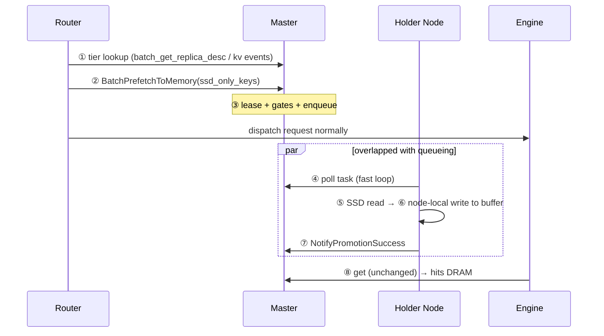
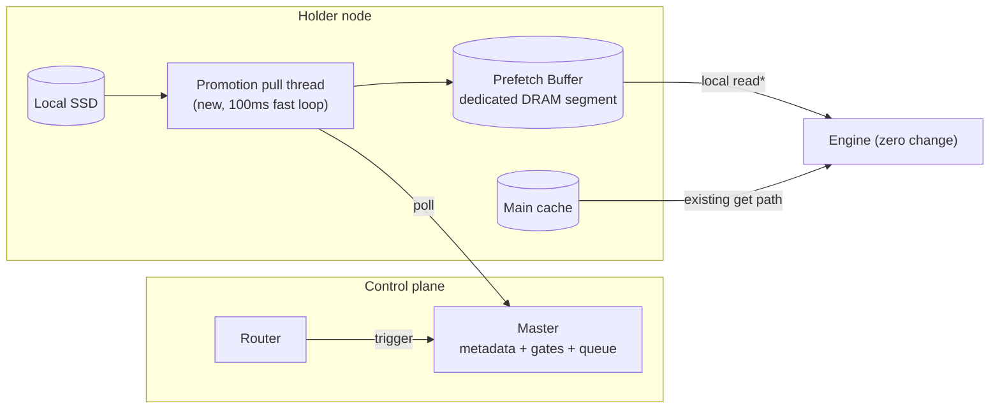
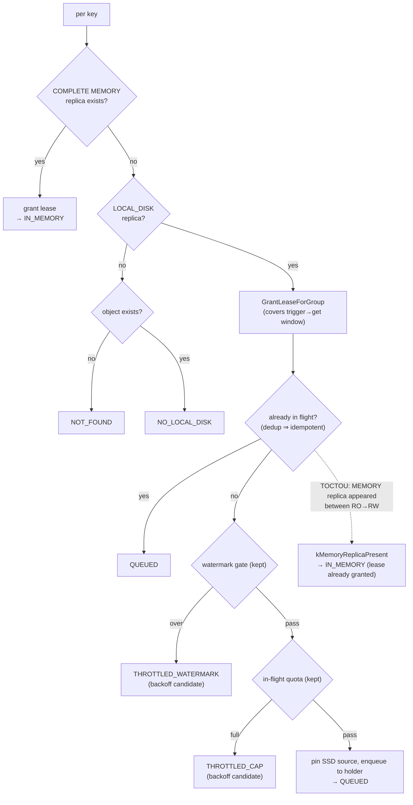
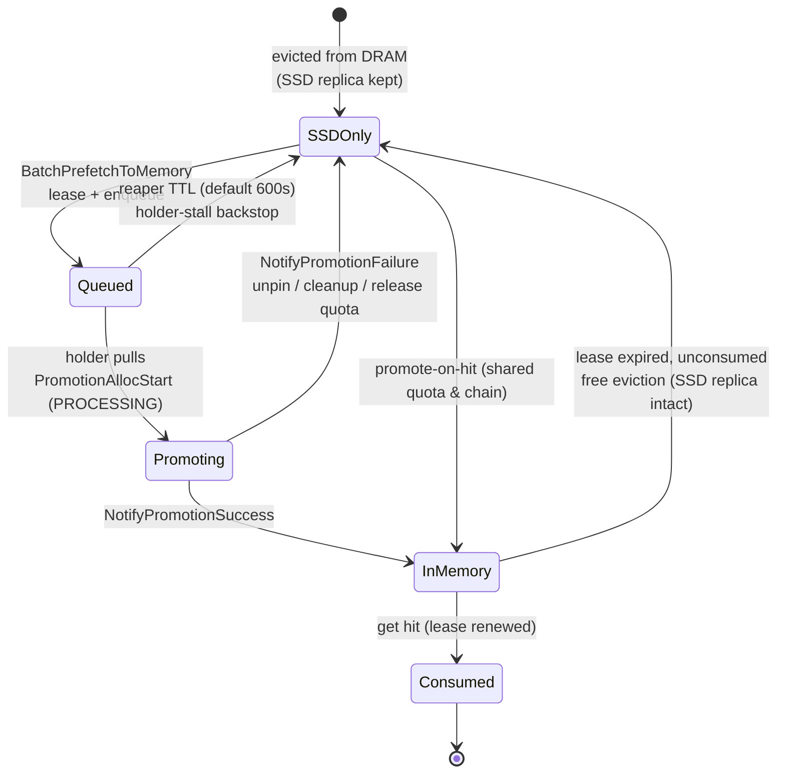

# [Issue #3417] [RFC]: Explicit SSD→DRAM Prefetch Trigger for Mooncake Store

source: https://github.com/kvcache-ai/Mooncake/issues/3417
state: open | updated: 2026-09-18T11:42:05Z
labels: RFC

## 正文

# [RFC]: Explicit SSD→DRAM Prefetch Trigger for Mooncake Store

**TL;DR**: the router — the first to know a request will hit — explicitly triggers the SSD→DRAM move *before* the request enters the engine: triggering stays inside the mainline gates, execution reuses the mainline promotion chain, data lands in a dedicated transit buffer sized by pipeline depth, and a lease is granted at enqueue — moving IO off the `get` critical path. If the window is missed or memory pressure exceeds the gates, it falls back to today's SSD read: pure acceleration, zero correctness impact.

---

## 1. Purpose

In the three-tier KV pool, DRAM pressure evicts KV to SSD; the next hit reads SSD **on the request critical path**. The router is the first to know a request will hit — and whether the data sits on SSD.

| | Today | This RFC |
|---|---|---|
| When is the SSD read paid | Inside engine `get()` | Inside the router→engine queueing window |
| Who triggers | Nobody (promotion-on-hit is even later) | Router, or engine SDK without a router |
| Engine change | — | **Zero** |
| If the move doesn't finish in time | — | Falls back to today's SSD read, no side effects |

---

## 2. Architecture

\* local read requires tier-affinity scheduling; otherwise it degrades to a cross-node DRAM read (still beats a critical-path SSD read).

**Three core decisions**:

| Decision | What | Why |
|---|---|---|
| ① Static prefetch buffer (soft partition) | Dedicated mounted DRAM segment; prefetch lands strictly here, no fallback to main cache | Turns "living off idle DRAM" into a size-computable transit area (`window × rate × key size`, typically ≪10% of DRAM) |
| ② Dedicated promotion pull thread | Split off the 10s heartbeat thread (1 task/tick, shared with offload writes) → 100ms loop, single sequential worker (~100-200 keys/s/holder) | Today's cadence can never fit a second-scale router window; sequential execution is a natural SSD concurrency cap |
| ③ Lease at trigger time | Trigger RPC grants lease at enqueue | Mainline `NotifyPromotionSuccess` grants no lease; PR2646's self-reported 82% evicted-before-use is consistent with this gap |

**What the buffer does / does not buy** (soft partition, v1):

| Dimension | v1 |
|---|---|
| Admission (pass the watermark gate under pressure) | ❌ not guaranteed — gate runs before enqueue; v1 scopes itself to *moderate* pressure |
| Landing isolation (never consumes main-cache headroom) | ✅ |
| Landing exclusivity (buffer used by prefetch only) | ❌ ordinary puts may overflow in → then prefetch THROTTLEs (safe degradation); exclusivity = optional hard-partition follow-up |

---

## 3. Details (brief)

**Trigger RPC** — `BatchPrefetchToMemory(keys) → per-key status`:

| Status | Meaning |
|---|---|
| `IN_MEMORY` | already in DRAM (lease refreshed) |
| `QUEUED` | lease granted + enqueued (idempotent: re-trigger is a no-op) |
| `THROTTLED_WATERMARK` / `THROTTLED_CAP` | gate rejected, backoff candidate recorded |
| `NO_LOCAL_DISK` / `NOT_FOUND` | nothing to prefetch / unknown key |

**Gate policy vs mainline promotion**:

| Gate | promote-on-hit | explicit prefetch |
|---|---|---|
| sketch frequency | kept | **skipped** (explicit call *is* the hotness signal) |
| watermark / dedup / in-flight quota | kept | **kept, shared** — no bypass, no priority |

**Per-key decision flow** (all inside the mainline gates):

**Key lifecycle** (failure handling visible at a glance):

**Key configs** (all default-off / safe): `enable_prefetch_trigger=false` · `prefetch_buffer_segment` · `prefetch_strict_buffer=true` · `promotion_pull_interval_ms=100` · `promotion_max_per_pull=32`.

**Prerequisites**: `enable_offload=true` — either offload mode works (proactive PutEnd-time offload by default, or eviction-time with `offload_on_evict=true`); with offload fully disabled there are no SSD replicas and the feature silently no-ops.

**Rollout safety**: two phases — ① roll out binaries with the switch off, ② enable after full rollout. **The `trigger_source` wire change is already live the moment binaries roll (phase ①) — it rides `PromotionObjectHeartbeat` for on-hit promotion traffic too, even with the switch off — so the wire-compat test gates phase ①, not just the feature.** The field is `struct_pack::compatible`-wrapped (in-tree precedent exists); a bidirectional wire-compat round-trip test gates the release, with a versioned RPC (`PromotionObjectHeartbeatV2`) as fallback.

**Known boundaries (honest list)**: buffer ≠ extra SSD bandwidth · hot keys reside in buffer via lease renewal (soft-partition degradation, absorbed by sizing headroom) · sustained full DRAM ⇒ heavy THROTTLED by design · mounting the buffer dilutes the global watermark reading shared by the on-hit gate and eviction trigger (companion fix scoped) · single-worker throughput is an architectural cap, to be validated against the target trigger rate at M0.

---

## 4. Relationship to PR2646

PR2646 pioneered this capability (exist-triggered), and this RFC owes it a great deal — including most of the pitfalls below, which its authors documented openly. We chose not to rebase it, mainly because its trade-offs were made for a DRAM-not-full regime, while we target exactly the opposite:

- **Task registration outside the mainline gates**: PR2646 queued work through its own registry, skipping the watermark/quota gates. That is harmless when DRAM has headroom; under sustained pressure, ungated prefetch competes with puts for DRAM headroom and with offload writes for SSD bandwidth (its own write-up records eviction spinning and offload starvation), and the client-side throttle then mutes the feature under load. → *We keep triggering inside the gates, skipping only the sketch frequency check.*
- **Landing on main-cache free space**: fine with spare DRAM; under pressure it becomes zero-sum against puts. → *A small reserved buffer with strict landing, so prefetch never consumes main-cache headroom.*
- **Evaluation regime**: its positive numbers were measured with DRAM not full (its doc notes the cooldown never engaged) — complementary to, but different from, our target scenario. → *We start with M0 measurement on real, pressured workloads and gate the rollout on that data.*
- **Rebase cost**: the branch has since drifted ~237 commits (multi-tenancy, quota, HA OpLog), totals +2494 lines, and includes a get-side wait (`ssd_get_wait_ms`) on the TTFT path that we would rather avoid. → *Reuse the mainline promotion chain end-to-end; zero engine change.*

Side by side:

| | PR2646 | This RFC |
|---|---|---|
| Admission gates | own task registry, outside mainline gates | inside the gates, only sketch-frequency skipped |
| Trigger point | engine-side exist probe | router (earliest point that knows) |
| Landing spot | main cache free space | reserved buffer, strict |
| Evidence | positive numbers from DRAM-not-full envs; TTFT −3.2%, no ablation | M0 measurement plan first; go/no-go before code |
| Cost | +2494 lines, 237 commits of drift | reuses the mainline promotion chain end-to-end |

*All PR2646 figures quoted above (TTFT −3.2%, DRAM-not-full positive results, eviction rates) are taken from that PR's own design doc — self-reported, not independently verified; the mechanism-level claims in this RFC were checked against current mainline code.*

Its valuable byproducts (e.g. the offload-ordering fix) are already in mainline via #2799/#2818.

---

## 5. Plan

| Milestone | Content |
|---|---|
| **M0** (pre-code) | Measure on real load: watermark time series · SSD-only share at get · trigger→get window · target rate vs single-worker ceiling → go/no-go + buffer sizing |
| **M1** (v1) | Trigger RPC + pull-thread split + soft-partition buffer + SDK; default off, single-cluster gray release |
| **M2** | Ablation review → tuning → optional hard partition, per-client rate limit, buffer-level watermark |
| **M3** (separate RFC) | Route B: streaming layer-wise SSD consumption, with engine/connector cooperation |

If M0 shows the DRAM watermark is essentially always pinned, the right answer is to skip this feature and invest directly in route B.

---

## 6. Call for Discussion

This proposal sits at the boundary of Mooncake, routers, and inference engines, so we'd like broader input before locking the design:

1. **Ecosystem fit** — does the trigger contract (`BatchPrefetchToMemory` + tier lookup) match how routers (vLLM/SGLang/HiCache-style) actually make cache-aware scheduling decisions? Who else would consume this interface? And when multiple router instances trigger the same key, who dedups — shared state across instances, or tolerate duplicates against server-side idempotency?
2. **Operational reality** — is "moderate pressure usable, high pressure throttled" an acceptable availability envelope for your deployments, or is sustained-full DRAM the norm (which would push us toward route B sooner)?
3. **The watermark interaction** — mounting a reserved buffer perturbs the shared global watermark seen by on-hit promotion and eviction; we'd like maintainer input on the per-consumer readings proposed in the full design doc.
4. **M0 data** — if you run Mooncake under memory pressure, the four measurements above would directly shape this feature; contributions of traces/metrics are very welcome.

Comments, alternative designs, and operational experience are all welcome — please discuss here before we proceed to implementation.

## 评论 (2)

### github-actions[bot] · 2026-08-13

Thanks for opening this issue, @LujhCoconut!

| Field | Value |
|-------|-------|
| **Issue** | #3417 |
| **GitHub user ID** | `101535776` |
| **Reporter** | @LujhCoconut |

A maintainer will triage this when possible. To help us respond faster, please include:

- Mooncake version or commit SHA
- Environment (OS, CUDA/driver, RDMA stack if relevant)
- Steps to reproduce and expected vs. actual behavior

Useful links: [Documentation](https://kvcache-ai.github.io/Mooncake/) · [Contributing guide](https://github.com/kvcache-ai/Mooncake/blob/main/CONTRIBUTING.md)

> This message was posted automatically by the issue bot.

### DHX98 · 2026-09-18

Hi, @LujhCoconut

We implemented SSD prefetch-on-exist (#2213) on current main and measured it on DSv4-Flash + vllm-ascend. A design RFC and a PR follow; posting here first because #3417 is the closest related work.

How it relates to your three core decisions and the gate table:

**1. Lease.** You wrote: *"Mainline `NotifyPromotionSuccess` grants no lease; PR2646's self-reported 82% evicted-before-use is consistent with this gap."* We grant the normal `default_kv_lease_ttl` read lease in `NotifyPromotionSuccess` for prefetch promotions. We chose commit-time over your *"Trigger RPC grants lease at enqueue"* for one reason: a failed or dropped promotion then leaves no dangling lease.

**2. Gates (your gate-policy table).** On quota we do exactly what your table says — *"kept, shared — no bypass, no priority"*: prefetch draws from the same `promotion_in_flight_` cap and the same per-key `promotion_tasks` entry as promotion-on-hit, so double promotion is impossible. On the frequency sketch we agree with *"skipped (explicit call *is* the hotness signal)"*. The one real divergence is the watermark gate: instead of rejecting at admission, a DRAM-saturation cooldown (`NO_AVAILABLE_HANDLE` → backoff) makes prefetch yield to eviction. If you want the watermark gate at admission, it is ~5 lines in `RegisterPrefetchTask` — say which way and we will do it.

**3. Cadence.** You wrote: *"Today's cadence can never fit a second-scale router window."* We removed the wait entirely instead of accelerating it: execution starts immediately from the trigger on a bounded 4-thread pool — no heartbeat or pull thread in the path.

The static prefetch buffer (*"Dedicated mounted DRAM segment; prefetch lands strictly here"*) is not in this version; it reads as an orthogonal follow-up on top of the same machinery.

The `ExistOptions` API follows your suggestion on #2213.

Measurement setup: fill the store with long prefixes, let them evict to SSD, replay the same prefixes. Arm A = SSD offload only, arm B = offload + prefetch, `promotion_on_hit` off in both, same dataset/seed.

- concurrency 2: TTFT median +5.2%, mean +5.1%, p99 +22.0%
- concurrency 4 (store DRAM-starved, ~97.5% full): median +85.2%, mean +81.4%, p99 +44.9%

The mechanism behind the spread: without prefetch, every queued request pays a serial SSD read on the critical path, so arm A's TTFT degrades roughly linearly with queue depth; with prefetch those reads happen inside the queueing window and TTFT stays flat. Same run, mechanism side: promotions completed 503 / failed 860 under saturation, cooldown yielded ~2.1k times — prefetch defers to eviction by design.

Scope split: the router-side `BatchPrefetchToMemory` is your surface. `RegisterPrefetchTask` plus the shared promotion chain is the enqueue-and-execute machinery a router RPC needs; if this merges, a router-trigger PR on top of it has our review support.

Credit: concept RFC #2213 (@Pz1116), first implementation #2646 (@huangdong2022). Reviews welcome from you and @huangtingwei9988 on the design RFC and the PR.
