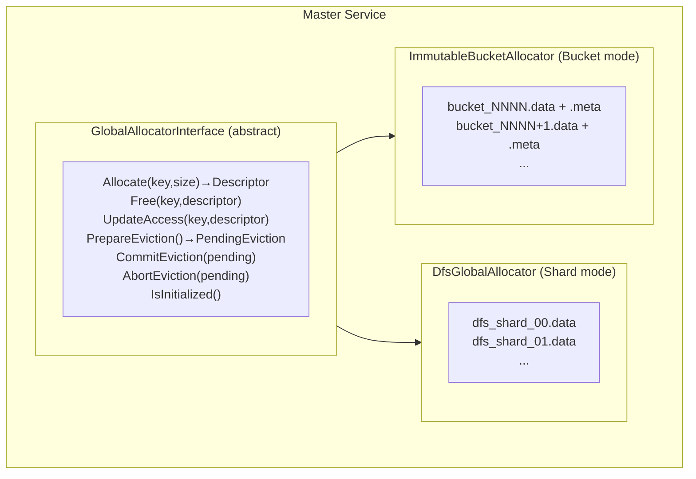

# [Issue #3641] [RFC]: DFS replica: extract GlobalAllocator interface and add ImmutableBucketAllocator

source: https://github.com/kvcache-ai/Mooncake/issues/3641
state: open | updated: 2026-09-17T14:51:45Z
labels: RFC

## 正文

### Changes proposed

## 1. Background

The current DFS uses a **fixed-shard layout** managed by `OffsetAllocator`. While stable, this design has two limitations:

- **Inflexible capacity scaling**: The number of shards is fixed at initialization. Scaling total capacity requires rebuilding the entire DFS instance, which is disruptive in production environments.
- **Suboptimal I/O pattern**: `OffsetAllocator` performs **in-place updates** (cover writes) within shard files. This results in random-write I/O  compared to an append-only model.

By **abstracting the allocation logic into a `GlobalAllocatorInterface`**, we can introduce alternative allocation strategies without modifying core DFS replica logic. This lays the groundwork for a bucket-based, append-only allocator that addresses both scalability and I/O efficiency.

## 2. Design

We extract the allocation logic into a pluggable `GlobalAllocatorInterface` and introduce a new backend, `ImmutableBucketAllocator`. This enables DFS to support both the existing shard-based layout and a new append-only bucket model, addressing shard-mode limitations in capacity scaling and write I/O efficiency.

The design of `ImmutableBucketAllocator` is inspired by the bucket-based allocation model already used in Mooncake's *local SSD replica* implementation. That model has demonstrated good write amplification characteristics and simple lifecycle management in local storage. This PR extends the same concept to DFS, adapting it to a distributed setting with persistent metadata and bucket-level LRU eviction.

> **Note:** Mode selection is controlled via the `MOONCAKE_DFS_ALLOCATOR_TYPE` configuration option (`shard` or `bucket`).

### 2.1 Architecture Overview



### 2.2 `GlobalAllocatorInterface` Definition

```cpp
class GlobalAllocatorInterface {
public:
    virtual ~GlobalAllocatorInterface() = default;

    // Lifecycle
    virtual tl::expected<void, ErrorCode> Init() = 0;
    virtual bool IsInitialized() const = 0;

    // Space allocation
    virtual tl::expected<DistributedFSDescriptor, ErrorCode>
    Allocate(const std::string& key, uint64_t size) = 0;

    // Space release
    virtual void Free(const std::string& key,
                      const DistributedFSDescriptor& descriptor) = 0;

    // Access tracking (for LRU)
    virtual void UpdateAccess(const std::string& key,
                              const DistributedFSDescriptor& descriptor) = 0;

    // Eviction control
    virtual bool IsEvictionEnabled() const = 0;
    virtual std::chrono::seconds GetEvictionCheckInterval() const = 0;

    struct EvictionCandidate {
        std::string key;
        DistributedFSDescriptor descriptor;
    };

    struct PendingEviction {
        std::vector<EvictionCandidate> candidates;
        // ... pending state
    };

    virtual PendingEviction PrepareEviction() = 0;
    virtual void CommitEviction(PendingEviction&& pending) = 0;
    virtual void AbortEviction(PendingEviction&& pending) = 0;

    // Capacity introspection
    virtual uint64_t GetTotalCapacity() const = 0;
    virtual uint64_t GetUsedBytes() const = 0;
};
```

This interface decouples allocation policy, eviction policy, and access tracking from DFS replica implementation details, allowing the Master to select the allocation strategy via configuration.

## 2.3 `DistributedFSDescriptor` Extension

The existing `DistributedFSDescriptor` is reused as-is. No new fields are introduced, ensuring backward compatibility.

### 2.3.1 Descriptor Structure

```cpp
struct DistributedFSDescriptor {
    std::string file_path;     // File path
    uint64_t offset = 0;       // In-file offset
    uint64_t object_size = 0;  // Original data size
    uint64_t aligned_size = 0; // Aligned size
    int shard_idx = 0;         // Mode-dependent semantics (see below)
    YLT_REFL(DistributedFSDescriptor, file_path, offset, object_size,
             aligned_size, shard_idx);
};
```

### 2.3.2 Semantic Convention

| Mode | `shard_idx` Meaning | `file_path` Example |
|------|---------------------|---------------------|
| **Shard Mode** | Shard index | `dfs_shard_00.data` |
| **ImmutableBucket Mode** | Bucket ID | `bucket_0000.data` |

This reuse avoids descriptor proliferation and keeps serialization logic unchanged.

## 2.4 `DfsGlobalAllocator` Refactoring (Shard Mode)

The existing `DfsGlobalAllocator` is refactored to **implement `GlobalAllocatorInterface`**, but its internal logic remains unchanged.

```cpp
class DfsGlobalAllocator : public GlobalAllocatorInterface {
public:
    tl::expected<void, ErrorCode> Init() override;
    tl::expected<DistributedFSDescriptor, ErrorCode>
    Allocate(const std::string& key, uint64_t size) override;
    void Free(const std::string& key,
              const DistributedFSDescriptor& descriptor) override;
    void UpdateAccess(const std::string& key,
                      const DistributedFSDescriptor& descriptor) override;
    // ... other interface implementations

private:
    // Existing implementation unchanged
    std::string mount_path_;
    int shard_count_ = 0;
    uint64_t alignment_ = 4096;
    std::vector<std::unique_ptr<ShardState>> shards_;
    std::unique_ptr<FileSystemAdapter> fs_adapter_;
    // ...
};
```

This refactoring is purely structural: **no behavioral changes are introduced in shard mode**, which remains the default allocator.

## 2.5 `ImmutableBucketAllocator` Design

`ImmutableBucketAllocator` is a new implementation of `GlobalAllocatorInterface`. Its design is directly inspired by the **bucket allocation model used in Mooncake's local SSD replica**, adapted to DFS with persistent metadata and bucket-level LRU eviction.

### 2.5.1 Bucket File Layout

```
{fsdir}/
├── bucket_0000.data    # Data file (pre-allocated, 256 MiB)
├── bucket_0000.meta    # Metadata file (YLT-serialized)
├── bucket_0001.data
├── bucket_0001.meta
└── ...
```

### 2.5.2 Data File Internal Layout

```
bucket_0000.data:
┌────────────────────────────────────────────────────────────┐
│ [key_size(8B)][key][value] ← 4096-aligned                 │
│ [key_size(8B)][key][value] ← 4096-aligned                 │
│ ...                                                        │
└────────────────────────────────────────────────────────────┘
```

Allocation within a bucket is performed by **atomically bumping a tail offset**, ensuring append-only, immutable-write semantics.

### 2.5.3 Metadata File Format

```cpp
struct BucketMetadata {
    int64_t meta_size;
    int64_t data_size;
    std::vector<std::string> keys;
    std::vector<BucketObjectMetadata> metadatas;
    // BucketObjectMetadata: { offset, key_size, data_size }
};
YLT_REFL(BucketMetadata, data_size, keys, metadatas);
```

Metadata persistence enables fast restart without data file scanning, accurate reconstruction of bucket LRU state, and consistent eviction decisions across Master restarts.

### 2.5.4 Key Characteristics

- **Immutable Write Semantics**: Strict append-only writes within 256 MiB pre-allocated buckets; no in-place updates (cover writes).
- **Capacity Scalability**: Buckets are created dynamically on demand, allowing the DFS instance to scale capacity online without rebuilding.
- **Reduced Locking**: Allocation requires only an atomic tail-offset bump. Locking is limited to bucket creation and metadata updates, reducing contention compared to `OffsetAllocator`.
- **Bucket-Level LRU**: Eviction operates at bucket granularity, replacing the key-level LRU of shard mode.
- **Recovery**: Allocator metadata is persisted in `allocator.meta`, enabling restart without data file scanning.

## 3. Configuration & Mode Selection

```toml
[dfs]
global_allocator = "bucket"  # "shard" (default) or "bucket"
bucket_size_mb = 256
```

A factory instantiates the appropriate `GlobalAllocatorInterface` implementation at Master startup based on this setting.

## 4. Compatibility & Migration

- Shard mode (`DfsGlobalAllocator`) remains the default and is fully backward compatible.
- Shard and bucket modes are mutually exclusive per DFS instance.
- No cross-mode migration is provided in this version; existing deployments continue using shard mode unless explicitly reconfigured.

## 5. Trade-offs

| Aspect | Shard Mode (`DfsGlobalAllocator`) | Bucket Mode (`ImmutableBucketAllocator`) |
|--------|-----------------------------------|------------------------------------------|
| **Capacity Scaling** | Fixed shard count; resizing requires full rebuild | ✅ Dynamic bucket creation; scale capacity online |
| **Write I/O Pattern** | In-place random writes (cover write) | ✅ Append-only sequential writes |
| **Eviction Granularity** | Key-level LRU | Bucket-level LRU |
| **Restart Recovery** | Rebuild from in-memory state | Load from `allocator.meta` |


## 6. References

- PR: https://github.com/kvcache-ai/Mooncake/pull/2683
- Related: POSIX / Local SSD backend bucket allocation model
- PR：https://github.com/kvcache-ai/Mooncake/pull/4124

### Before submitting a new issue...

- [x] Make sure you already searched for relevant issues and read the [documentation](https://kvcache-ai.github.io/Mooncake/)

## 评论 (6)

### github-actions[bot] · 2026-08-24

Thanks for opening this issue, @yangzhxdxfl!

| Field | Value |
|-------|-------|
| **Issue** | #3641 |
| **GitHub user ID** | `22934625` |
| **Reporter** | @yangzhxdxfl |

A maintainer will triage this when possible. To help us respond faster, please include:

- Mooncake version or commit SHA
- Environment (OS, CUDA/driver, RDMA stack if relevant)
- Steps to reproduce and expected vs. actual behavior

Useful links: [Documentation](https://kvcache-ai.github.io/Mooncake/) · [Contributing guide](https://github.com/kvcache-ai/Mooncake/blob/main/CONTRIBUTING.md)

> This message was posted automatically by the issue bot.

### LujhCoconut · 2026-08-25

This makes sense to me. cc @fcczzz .

### fcczzz · 2026-08-25

Overall, the other parts of the proposal look good to me, especially the allocator abstraction and keeping the existing shard mode as the default. However, I think one important part is still unclear: who owns and writes an open bucket?

In the local SSD backend, the client already owns a batch of object data, so it can build and write a complete bucket and then persist the bucket metadata. The current DFS path is different: the Master only allocates a descriptor, while each client writes an individual object's value directly with WriteAt and later calls PutEnd/UpsertEnd. There is currently no single actor that naturally owns all data in a bucket.

Is the intended model that:

1. the Master owns an open bucket, reserves an offset for each object, and multiple clients write their objects into it;
2. each client owns and seals its own buckets; or
3. a new aggregation/writer component builds the buckets?

If multiple clients write into a Master-managed bucket, the writes may complete out of order, so the bucket is only logically append-only and cannot be treated as immutable until it is sealed. We would also need to define the OPEN -> SEALED state transition, failed writes and holes, who writes the key prefix and metadata, how PutEnd commits an entry, and how an open bucket is recovered after
a client or Master failure.

I think clarifying the bucket writer and ownership model should come before finalizing the allocator interface.

### sun-baoshan-sunshine · 2026-09-02

@yangzhxdxfl Has development on this project started yet? 👍

### wp-bc · 2026-09-10

> Overall, the other parts of the proposal look good to me, especially the allocator abstraction and keeping the existing shard mode as the default. However, I think one important part is still unclear: who owns and writes an open bucket?
> 
> In the local SSD backend, the client already owns a batch of object data, so it can build and write a complete bucket and then persist the bucket metadata. The current DFS path is different: the Master only allocates a descriptor, while each client writes an individual object's value directly with WriteAt and later calls PutEnd/UpsertEnd. There is currently no single actor that naturally owns all data in a bucket.
> 
> Is the intended model that:
> 
> 1. the Master owns an open bucket, reserves an offset for each object, and multiple clients write their objects into it;
> 2. each client owns and seals its own buckets; or
> 3. a new aggregation/writer component builds the buckets?
> 
> If multiple clients write into a Master-managed bucket, the writes may complete out of order, so the bucket is only logically append-only and cannot be treated as immutable until it is sealed. We would also need to define the OPEN -> SEALED state transition, failed writes and holes, who writes the key prefix and metadata, how PutEnd commits an entry, and how an open bucket is recovered after a client or Master failure.
> 
> I think clarifying the bucket writer and ownership model should come before finalizing the allocator interface.

@fcczzz Thanks for raising this.  The implementation in PR #3902 chooses model (1): the Master is the sole owner of Bucket allocation and metadata, while clients are range writers only.
The Master-side `ImmutableBucketAllocator` creates Bucket files, owns one active Bucket, and serializes tail reservations under the allocator mutex.  Each reservation contains a complete, non-overlapping entry range.  A client cannot choose a Bucket or an offset;  it receives a `DistributedFSDescriptor` and writes `"[value][padding]"` into that assigned range.  No additional aggregator component or per-client Bucket ownership is introduced.
Write completion is tracked per entry rather than per Bucket:
- `PutStart` / `BatchPutStart` creates a `PENDING` entry and a `PROCESSING` DFS replica.
- The client writes only its assigned entry range.
- On success, `PutEnd(DFS)` calls `MarkCommitted` before changing the replica to `COMPLETE`.
- On failure, `PutRevoke(DFS)` tombstones the entry and removes the processing replica.
- If a client disappears without finalizing, the existing processing timeout path eventually removes the replica and tombstones the reservation.
Multiple clients may therefore write different entries in the same active Bucket, and their writes may complete out of order.  Allocation order determines the physical offsets, while per-entry commit state determines visibility.
Sealing means that the Bucket is closed to further allocation;  it does not require every previously reserved entry to have completed.  Once a Bucket is sealed, the Master writes its `. meta` snapshot, which records the Bucket layout and all entries that are committed at that point.  Pending entries are excluded from the snapshot.  If a pending entry completes after sealing, `MarkCommitted` marks the sealed Bucket metadata dirty, and the maintenance path rewrites its `. meta` snapshot.
The Master is the only metadata writer.  Clients write the entry header, key, value bytes, and padding, while the Master persists the sealed Bucket's `. meta` snapshot.  The active Bucket deliberately has no metadata snapshot.  After an abrupt standalone Master restart, the active Bucket is discarded, and only committed entries present in sealed Bucket metadata are recovered.

### yangzhxdxfl · 2026-09-11

> [@yangzhxdxfl](https://github.com/yangzhxdxfl) Has development on this project started yet? 👍
@sun-baoshan-sunshine 
Yes, development is already finished. I've opened a PR with the implementation here: 
https://github.com/kvcache-ai/Mooncake/pull/3902
