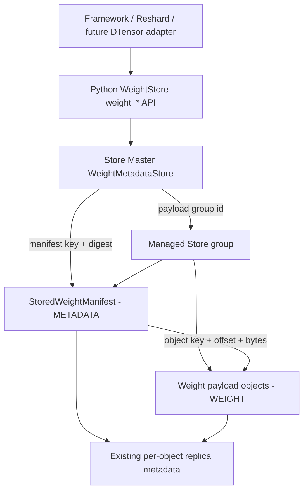

# [Issue #4017] [RFC]: Managing Model Weights as First-Class Citizens in Mooncake Store

source: https://github.com/kvcache-ai/Mooncake/issues/4017
state: open | updated: 2026-09-14T09:58:02Z
labels: RFC

## 正文

## Summary

This document proposes introducing revision-level Weight Management in Mooncake
Store. A complete and immutable model weight revision is the sole management
aggregate root, with Store uniformly responsible for discovery, availability,
residency policy, read leases, generation replacement, migration, deletion,
and Master HA recovery.

The design continues to use the existing `StoredWeightManifest` to describe
Tensors, fragments, aliases, and object ranges, without creating another copy
of management metadata for each Tensor. Store Master stores only the lightweight
`WeightRevisionMetadata`, which locates and validates the manifest, while the
manifest in turn locates the actual payload:

```text
WeightRevisionMetadata -> StoredWeightManifest -> Store payload objects
```

The manifest and all payloads reside in the same Store group. This group is the
unified lifecycle boundary; ordinary Store eviction, single-key removal, and
cleanup cannot split a managed weight revision into a state where some parts
remain while others have been deleted.

## Background and Motivation

Mooncake can already save and load model weights through a manifest, but the
current unmanaged path still has the following limitations:

1. The caller must know the manifest object key in advance, and Store cannot
   discover weights by model and revision.
2. Store sees several ordinary objects and cannot express that these objects
   jointly constitute one indivisible weight revision.
3. Ordinary eviction or single-key deletion may act on group members
   independently, without revision-level lifecycle guarantees.
4. The manifest describes only Tensor content and location, and is not suitable
   for mutable availability, residency, lease, operation, and policy state.
5. Store cannot express weights that reside partly in memory and partly in cold
   storage, nor can it migrate them safely and automatically in response to
   memory pressure and access events.
6. After a Master restart or failover, there is no unified revision state or
   operation progress from which to recover.

The main difference between model weights and ordinary KV data is that model
weights are typically large, immutable, loaded repeatedly by multiple workers,
and must be published, read, migrated, and deleted as a complete revision.
Therefore, this RFC proposes promoting the Weight Revision to a first-class
managed Store resource instead of continuing to treat Tensors as independent
keys.

## Relationship to Existing RFCs

This RFC builds on existing Weight and Reshard RFCs and does not replace their
data paths or semantic contracts:

- [RFC #2282: Unified KVCache and Model Weight Management in Mooncake Store](https://github.com/kvcache-ai/Mooncake/issues/2282)
  proposed that KVCache and Weight share the Store resource substrate while
  retaining separate lifecycle policies, with file/file-shard-level Weight
  import, hard pinning, and startup loading as the first phase. This RFC
  continues its Weight Lifecycle Management direction by promoting file-level
  `WEIGHT` objects into revision-level managed resources. A file-level
  importer/loader can remain an input adapter for WeightStore, but does not own
  the revision metadata authority.
- [RFC #3111: Manifest-driven heterogeneous model weight resharding and storage](https://github.com/kvcache-ai/Mooncake/issues/3111)
  defined Placement, Runtime Binding, `StoredWeightManifest`, N-D Reshard, and
  the runtime-to-Store and Store-to-runtime data paths. This RFC directly reuses
  those manifest and fragment contracts instead of redefining Reshard; its new
  scope is revision discovery, readiness, residency, leases, migration,
  deletion, and HA recovery.
- [RFC #3747: COO-format sparse weight transfer for RL](https://github.com/kvcache-ai/Mooncake/issues/3747)
  and [RFC #3953: Transfer COO sparse updates as structured objects](https://github.com/kvcache-ai/Mooncake/issues/3953)
  define the object format, range planning, and application semantics for
  sparse deltas. An adapter may materialize a sparse update into a new complete
  generation and pass it to this RFC's `weight_upsert` workflow. A delta-backed
  revision that directly depends on base payloads needs a separate protocol for
  dependency retention, chain compaction, and reclamation.

## Goals

- Discover model weights through a stable revision identity without requiring
  callers to retain the manifest key.
- Manage readiness, residency, leases, migration, and deletion at the complete
  revision level.
- Reuse the existing Tensor and fragment semantics in the manifest without
  duplicating Tensor metadata.
- Support HOT, COLD, and MIXED residency split by complete Tensor affinity units.
- Support explicit migration and bounded, recoverable automatic promotion and
  demotion.
- Keep existing readable replicas safe during concurrent reads, migration, and
  deletion.
- Support HA recovery through the existing Store Master OpLog and snapshot.
- Converge on a single managed `weight_*` API without retaining public entry
  points that bypass the revision lifecycle.
- Support serialized, idempotent, recoverable generation replacement within a
  lineage.
- Preserve an evolution path for a future DTensor-native adapter without binding
  the current management plane to a specific framework.

## Terminology

- **Weight Revision**: a complete model weight version consisting of one
  immutable manifest and all payload objects referenced by it.
- **Revision Identity**: the five-tuple that uniquely identifies a Weight
  Revision.
- **Manifest**: an immutable object describing Tensors, fragments, aliases,
  source placement, and object ranges.
- **Managed Group**: the Store group shared by the manifest and all payloads,
  serving as the lifecycle boundary.
- **Residency**: the aggregate physical state of all required payloads in the
  memory and cold tiers.
- **Affinity Unit**: a complete Tensor or alias group that cannot be split during
  migration.
- **Revision Lease**: a short lease that prevents deletion and release of
  existing replicas during a read.
- **Lineage**: `(tenant_id, namespace, resource_id, revision)`, covering every
  `weight_generation` of that logical revision.
- **Replacement Claim**: the single persisted successor transaction for a
  lineage, recording `request_id`, base, target, mode, and phase.

## Overall Architecture



### Data Authority Boundaries

| Data authority | Location | Responsible for | Not responsible for |
| --- | --- | --- | --- |
| `WeightMetadataStore` | Active Master memory, HA OpLog, Master snapshot | revision discovery, policy, availability, residency summary, operation, lease, manifest reference, lineage claim, generation watermark | Tensor shape, fragment geometry, physical replica address, serving active head |
| `StoredWeightManifest` | hard-pinned Store `METADATA` object | Tensor, fragment, alias, placement, and payload range | lifecycle, lease, live replica state |
| Store object metadata | existing Master per-key metadata | memory, local disk, DFS, and NoF replicas and their readability | revision discovery, Tensor semantics, serving activation |

`WeightRevisionMetadata` resides outside the managed group. This allows the
management plane to query state, continue an operation, or retain a tombstone
even when payloads are COLD, partially damaged, being deleted, or already
physically deleted.

The manifest and payloads reside in the same group, with the manifest committed
last. Under every payload residency, the manifest always retains at least one
hard-pinned, memory-readable replica; therefore, `COLD` describes only payloads
and does not include the manifest.

This group is a logical lifecycle boundary, not a cross-object physical
transaction. During migration, some payloads may temporarily be HOT while
others are COLD, but the operation does not publish the terminal state or allow
conflicting operations until whole-group validation is complete.

The lineage claim and committed generation watermark provide ordering, CAS
fencing, and recovery only. They do not identify the serving active head;
traffic switching and rollback remain responsibilities of the serving control
plane.

### Internal Store Code Organization

Weight Management belongs in `mooncake-store`, but its domain logic should not
accumulate in the generic `master_service.cpp`. The implementation is split by
state authority, decisions, and side-effect orchestration into the following
translation units:

```text
mooncake-store/
├── include/
│   ├── weight_management.h
│   ├── weight_metadata_store.h
│   ├── weight_residency_planner.h
│   └── master_service.h
└── src/
    ├── weight_metadata_store.cpp
    ├── weight_residency_planner.cpp
    ├── master_service_weight_management.cpp
    ├── master_service_weight_lifecycle.cpp
    └── master_service.cpp
```

The responsibility boundaries are as follows:

- `weight_management.h` defines the identity, policy, metadata, lease,
  operation, and wire contracts;
- `weight_metadata_store.cpp` implements the state machines for revision
  metadata, generation, lease, operation, snapshot, and reverse indexes, without
  directly modifying Store objects;
- `weight_residency_planner.cpp` implements side-effect-free MIXED/AUTO
  decisions;
- `master_service_weight_management.cpp` handles import, query, policy update,
  lease, operation creation, and durable publication;
- `master_service_weight_lifecycle.cpp` handles reconciliation, physical
  residency changes, managed-group protection, and deletion;
- `master_service.cpp` retains the ordinary Store main flow, generic
  group/eviction primitives, and the small number of integration points that
  invoke Weight guards and reconciliation.

This split only moves out-of-line `MasterService` method definitions. It does
not introduce a second service, repository, or metadata authority, nor does it
change the public API, lock ordering, serialization, or runtime semantics.
`master_service.h` continues to declare the unified `MasterService` interface
and private state.

The RPC, native client, configuration, OpLog, snapshot, and standby files retain
only the necessary Weight wiring at their respective boundaries. Consolidating
copies of that code into Weight files would create a second adapter or HA
authority and is therefore outside the scope of this split.

## Revision Identity and Object Layout

A revision uses the following identity:

```text
(tenant_id, namespace, resource_id, revision, weight_generation)
```

Removing `weight_generation` gives the lineage:

```text
(tenant_id, namespace, resource_id, revision)
```

Generations within a lineage increase strictly. The target generation of
`weight_upsert` must be greater than both the base generation and the lineage's
committed watermark. The watermark prevents an older generation from
re-entering after retries or failover; it is not a pointer to the currently
served revision.

The canonical manifest key is:

```text
weights/<namespace>/<resource_id>/<revision>/<weight_generation>/manifest
```

Each path component is UTF-8 URL encoded. After a revision is published, the
following fields are immutable:

- manifest key and manifest SHA-256;
- payload group ID;
- SHA-256 of sorted payload keys;
- payload count;
- logical payload bytes;
- affinity count and digest.

Master validates the object type, group membership, payload count, logical
bytes, and payload-key digest, but does not parse the Tensor manifest body.
Python `weight_get` validates the manifest identity and SHA-256 before planning
and transfer.

## State Model

Availability, observed residency, and operation are three orthogonal
dimensions:

| Dimension | Values | Meaning |
| --- | --- | --- |
| Availability | `IMPORTING`, `READY`, `DEGRADED`, `DELETING`, `DELETED` | whether the revision is complete and can be safely discovered and read |
| Residency | `UNKNOWN`, `HOT`, `COLD`, `MIXED`, `ABSENT` | aggregate physical residency of the required payloads |
| Operation | optional operation ID referring to `MIGRATING` or `REPAIRING` | the currently persisted non-terminal background operation |

Primary invariants:

- `IMPORTING` corresponds to `UNKNOWN` and is invisible to ordinary discovery
  and reads.
- `READY` corresponds only to `HOT`, `COLD`, or `MIXED`.
- `READY` means the manifest and every required payload have at least one
  readable replica; it does not require observed residency to equal preferred
  residency.
- `DEGRADED` means at least one required member has lost all readable replicas.
- `DELETED` corresponds to `ABSENT`, with no active lease or active operation.
- `MIGRATING` is an operation kind, not a residency. A revision whose observed
  residency is `MIXED` may be migrating toward `COLD`.
- A terminal operation remains queryable by ID, but revision metadata clears
  the active `operation_id`.

Every mutation uses `expected_metadata_generation` for CAS fencing. A stale
caller receives `STALE_GENERATION` and cannot overwrite a newer revision state.

## Residency Policy

Each revision persists the following policy:

```python
@dataclass(frozen=True)
class WeightStoragePolicy:
    preferred_residency: WeightResidencyState = WeightResidencyState.MIXED
    mixed_hot_ratio: float = 0.5
    migration_mode: WeightMigrationMode = WeightMigrationMode.AUTO
```

Policy resolution precedence is:

```text
weight_put(policy=...)
    > WeightStore(default_policy=...)
    > Store Master cluster default
```

### Preferred Residency

- `HOT`: every required payload has a readable memory replica.
- `COLD`: every required payload has a readable cold replica, and reads do not
  depend on a memory replica.
- `MIXED`: some complete affinity units are HOT and the remainder are COLD.

The `MIXED` ratio is defined as:

```text
hot logical payload bytes / total logical payload bytes
```

`0 < mixed_hot_ratio < 1`, with a default of `0.5`. The algorithm selects
complete affinity units so that the actual HOT bytes are as close as possible
to the target; it cannot split a Tensor or alias group to achieve an exact
ratio. If the model structure makes the target impossible to satisfy exactly,
metadata returns the actual `observed_hot_ratio`.

### Migration Mode

- `PINNED`: after initial preferred convergence completes, fix the current
  residency and reject subsequent residency changes.
- `MANUAL`: after initial preferred convergence completes, accept only explicit
  `weight_migrate` requests.
- `AUTO`: after initial preferred convergence completes, allow automatic
  promotion and demotion based on access and memory pressure, while also
  accepting explicit migration.

`PINNED` constrains physical residency but does not prevent explicit revision
deletion when there is no active lease or operation. The first version supports
only explicit deletion and therefore does not add a retention policy with only
one possible value.

In AUTO mode, `preferred_residency` is the convergence target rather than a hard
memory floor. Memory pressure may temporarily make an AUTO revision colder than
preferred; later access or the removal of pressure converges it back toward the
preferred state. Use `PINNED` when hard residency guarantees are required.

## Python API

The only public management entry point remains
`mooncake.reshard.weight.WeightStore`:

| API | Semantics |
| --- | --- |
| `weight_put` | upload payloads, commit the manifest last, and publish the revision |
| `weight_get` | acquire a revision lease, resolve the manifest, and load or Reshard into the target layout |
| `weight_is_exist` | return `True` only when the exact revision is `READY` and readable |
| `weight_get_metadata` | get lightweight revision metadata and the manifest reference |
| `weight_get_size` | return the logical payload bytes validated at commit time |
| `weight_list` | discover revisions by namespace/resource with pagination, without reading the complete manifest |
| `weight_update_policy` | update only the policy, using metadata generation fencing |
| `weight_upsert` | replace a base revision with a higher generation in the same lineage |
| `weight_migrate` | create an explicit residency migration operation |
| `weight_get_operation` | query an asynchronous operation's target, progress, and error |
| `weight_remove` | explicitly delete the whole group and retain a queryable tombstone |

Example:

```python
policy = WeightStoragePolicy(
    preferred_residency=WeightResidencyState.MIXED,
    mixed_hot_ratio=0.5,
    migration_mode=WeightMigrationMode.AUTO,
)

with weight_store.weight_put(snapshot, adapter, policy=policy) as writer:
    identity = writer.identity
    for tensor_id, tensor in tensors:
        writer.weight_put_tensor(tensor_id, tensor)

view = weight_store.weight_get_metadata(identity)
manifest = weight_store.weight_get(identity, target_placement, target_bindings)

updated = weight_store.weight_update_policy(
    identity,
    policy=new_policy,
    expected_metadata_generation=view.metadata.metadata_generation,
)

with weight_store.weight_upsert(
    next_snapshot,
    adapter,
    replacing=identity,
    expected_metadata_generation=updated.metadata_generation,
    mode=WeightUpsertMode.PUT_FIRST,
    request_id="rollout-2026-09-11-001",
    policy=new_policy,
) as successor:
    for tensor_id, tensor in next_tensors:
        successor.weight_put_tensor(tensor_id, tensor)
next_identity = successor.identity

operation = weight_store.weight_migrate(
    identity,
    target=WeightResidencyState.COLD,
    expected_metadata_generation=updated.metadata_generation,
)
operation = weight_store.weight_get_operation(operation.operation_id)
```

## Lifecycle and Data Flow

### Import and READY Publication

```text
weight_put(policy)
  -> BeginWeightImport
  -> write all payloads into Store memory replicas
  -> commit the immutable StoredWeightManifest last
  -> CommitWeightImport validates the complete group
  -> durable publish: READY + HOT
  -> if preferred != HOT, also create MIGRATING(target=preferred)
  -> weight_put returns; reconciliation converges preferred asynchronously
```

Every import first forms a complete HOT revision. `READY + HOT` is the
consistency checkpoint: once published, the revision is readable. COLD/MIXED is
a subsequent physical migration and should not delay READY.

If preferred is COLD or MIXED, READY metadata and the initial MIGRATING
operation are published in the same durable mutation. Initial convergence
applies to PINNED, MANUAL, and AUTO; migration mode controls only the behavior
after initial convergence completes.

Failure at any payload, manifest, or commit stage must not publish READY. A
retry of the same identity uses generation fencing and must not create a
duplicate group, manifest, or operation.

### Get and Revision Lease

```text
identity
  -> get exact metadata
  -> acquire generation-fenced revision lease
  -> read and verify manifest
  -> plan target ranges / Reshard
  -> transfer payload
  -> release lease
```

The lease is released on success, exception, and cancellation paths, and
expires by TTL after a caller crash. An active revision lease:

- prevents revision deletion;
- prevents release of existing readable replicas;
- does not prevent migration from creating and validating new replicas.

A revision lease does not replace framework allocation guards, runtime binding
generation, or Store per-object read leases; these mechanisms protect different
ownership boundaries.

### Generation Replacement

`weight_upsert(snapshot, adapter, *, replacing, expected_metadata_generation,
mode=WeightUpsertMode.PUT_FIRST, tenant_id="default", policy=None,
request_id=None)` accepts only a target with the same lineage as `replacing`
and a higher generation. When the caller omits `request_id`, `WeightStore`
computes a deterministic hash of the canonical base identity, target identity,
mode, and `expected_metadata_generation`. Retrying the same arguments after a
lost begin response therefore derives the same ID. An explicit `request_id` is
used unchanged. The same request with the same immutable arguments returns the
existing claim or resumes its current phase. A different request cannot create
a second concurrent successor for the lineage.

`PUT_FIRST` is the default:

```text
durable claim -> import target -> target READY
              -> durable fence/retire base -> drain existing base leases
              -> delete base -> commit lineage watermark
```

The base remains readable until the target reaches `READY`. A target upload or
commit failure terminates the claim and leaves the base intact. After target
publication, new base leases and lease renewals are rejected while existing
leases drain. Peak storage approaches two complete revisions.

`DELETE_FIRST` is the explicit capacity-saving mode:

```text
durable claim -> require no base lease or operation -> fence and delete base
              -> allow target import -> target READY -> commit lineage watermark
```

An active lease or lifecycle operation returns `BUSY` before deletion has side
effects. Target payload import is not allowed until the base has been deleted,
which lowers peak storage but creates an unavailable interval before target
`READY`. A target failure cannot be rolled back by Store to the deleted base.
Recovery resumes the persisted phase with the original `request_id`.

### Residency Migration

`weight_migrate` persists the operation before performing physical side effects:

- to COLD: create and validate cold replicas before releasing memory replicas;
- to HOT: create and validate memory replicas for every required payload;
- to MIXED: promote the complete affinity units selected by the planner and
  safely demote the remaining units.

Migration may complete in batches. Each round limits the number of members and
logical bytes, but even if a complete affinity unit exceeds the per-round limit,
at least one unit must be allowed to make progress; a Tensor cannot be split to
satisfy the limit.

If an operation fails while the existing data remains readable, the revision
stays `READY`; the error and progress remain in the operation so reconciliation
can retry. The revision enters `DEGRADED` only when a required payload loses all
readable replicas.

### Automatic Migration

Automatic migration reuses the bounded Weight reconciliation loop on the active
Master. A candidate must satisfy:

```text
availability == READY
migration_mode == AUTO
operation_id is None
active_lease_count == 0
```

Under memory pressure, candidates are sorted deterministically by persisted
last-access time, releasable HOT bytes, and stable revision identity, and move
incrementally through `HOT -> MIXED -> COLD`. When a COLD/MIXED revision is
accessed, the system persists a promotion operation before granting a lease for
the new generation.

Cooldown, per-round member limits, and byte limits bound oscillation and
background amplification. After failover, processing continues from the
persisted operation and actual replica state instead of recreating the group or
restarting the counters.

### Delete and Ordinary Eviction

The first version supports only explicit whole-group deletion:

```text
READY/DEGRADED
  -> DELETING, reject new leases
  -> delete payloads in batches
  -> delete the manifest last
  -> verify that the group is empty
  -> DELETED + ABSENT tombstone
```

Deletion returns `BUSY` while an active lease or migration exists. A failed
deletion batch retains `DELETING` and its progress; retry or failover continues
from the remaining members.

Ordinary `BatchEvict`, quota eviction, single-key remove, and cleanup must
recognize and skip a managed group. Releasing memory replicas after cold
durability exists is residency migration, not logical Weight eviction.

## Concurrency, Consistency, and Error Handling

- Every revision mutation carries `expected_metadata_generation`.
- Only one active operation is allowed for a revision at a time.
- Only one non-terminal replacement claim is allowed for a lineage. Its target
  generation must be greater than the base and committed watermark.
- Replacement is idempotent by `request_id`. The same ID must carry identical
  arguments; a competing request returns `CONFLICT` or `BUSY` rather than
  creating another successor.
- Every state that authorizes discovery, reads, or destructive actions follows
  durable-before-visible ordering.
- Metadata stores only an optional active operation ID; the kind, target,
  progress, cursor, and error message live in a separate operation record.
- Operation IDs and progress remain stable and monotonic across retries, Master
  restarts, and failover.
- Duplicate requests return the existing committed result without creating a
  second group, operation, or tombstone.

Primary errors include:

- `INVALID_ARGUMENT`
- `NOT_FOUND`
- `NOT_READY`
- `CONFLICT`
- `STALE_GENERATION`
- `BUSY`
- `LEASE_EXPIRED`
- `DURABILITY_FAILED`
- `POLICY_UNSATISFIABLE`

## HA and Upgrade

Weight metadata, leases, operations, lineage claims, and generation watermarks
are persisted through the existing Master HA mechanism:

- a mutation enters the OpLog first and becomes visible to the active Master
  only after it is durable;
- standby replays a separate weight-metadata namespace and does not encode the
  records as fabricated object metadata;
- the Master snapshot adds an optional `weight_metadata` section;
- restoration from an old snapshot without that section yields an empty state;
  an invalid schema, when present, fails closed;
- group reverse indexes are rebuilt from authoritative records after restore.
- restoration resumes target import, base-lease drain, or deletion from the
  persisted claim phase and observed group/revision state; replay cannot lower
  a generation watermark or create a new successor.

Clusters using HA with the etcd batch OpLog use two independent gates.
`weight_management_oplog_capability_confirmed` continues to cover ordinary
Weight metadata OpTypes 8–11 with its existing upgrade and fail-closed
semantics. Lineage claims use OpType 12, so `weight_upsert` additionally requires
`weight_lineage_oplog_capability_confirmed=true`. During a rolling upgrade,
upgrade every standby to replay OpType 12 before enabling the new flag on the
active configuration. Until that flag is confirmed, only lineage mutations
fail closed; ordinary Weight mutations already allowed by the original flag and
Store KV reads and writes remain available.

## Configuration

Master provides the cluster defaults:

```yaml
default_weight_preferred_residency: "mixed"
default_weight_mixed_hot_ratio: 0.5
default_weight_migration_mode: "auto"
weight_management_oplog_capability_confirmed: false
weight_lineage_oplog_capability_confirmed: false
weight_migration_cooldown_ms: 30000
weight_migration_max_members_per_round: 64
weight_migration_max_bytes_per_round: 1073741824
```

Invalid residency, migration mode, MIXED ratio, or zero batch limit fails closed
at startup. Cluster defaults affect only subsequent new revisions; a published
revision always uses its own persisted policy.

## API Convergence and Handling Existing Data

`WeightStore` no longer provides an unmanaged public path. Applications can
publish a revision only through `weight_put`, discover revisions through
`weight_get_metadata` or `weight_list`, and load them through `weight_get` under
revision lease protection. The manifest key, payload plan, and lower-level
transfer primitives are internal implementation details and cannot serve as an
application-level identity or lifecycle entry point.

Therefore, `load_manifest`, which operates directly by manifest key, and the
old entry points `begin_weight_snapshot`, `plan_upload`, `upload`,
`commit_upload`, `plan_load`, and `load` are removed directly, with no deprecated
wrapper. The generic `MooncakeDistributedStore` also no longer exposes a Weight
writer shortcut; callers construct `WeightStore` explicitly, keeping the
management boundary between ordinary KV data and Weight data clear.

The policy mutation is replaced directly by `weight_update_policy`; there is
no alias or deprecated wrapper for the old name.

Existing unmanaged data is not added to revision metadata automatically. Data
that must remain in use has to be republished as an explicit revision through
`weight_put` before it can receive discovery, lease, whole-group migration, and
deletion guarantees.

## Relationship to Reshard, Transfer Engine, and DTensor

Source fragments are preserved when written to Store and are not converted
prematurely into the target TP/PP/DP/EP layout. The actual Reshard occurs in
`weight_get`:

```text
identity -> metadata -> manifest/source ranges
         -> target placement/bindings -> Store transfer
```

This RFC reuses the current Store registered-buffer put/get primitives and does
not depend on merging another Transfer Engine Reshard PR. If WeightStore supports
DTensor-native input in the future, only the DTensor adapter needs to generate
canonical placement, binding, and manifest data; revision metadata, policy,
lease, and lifecycle APIs do not need to change.

An adapter may apply a #3747 or #3953 COO sparse update to a base and produce a
new complete snapshot, then submit that higher generation through
`weight_upsert`. This RFC does not treat a delta object as an independently
servable complete revision. If a target manifest directly references base
payloads and deltas, dependency leases, base retention, maximum chain depth,
and compaction require a separate design.

## Observability and Performance Boundaries

At minimum, expose the following metrics:

- revision counts for each availability and residency state;
- active operation, failure, and retry counts;
- migration processed bytes, remaining bytes, and duration;
- active and expired lease counts;
- replacement claim counts, failures, and recoveries by mode and phase;
- trigger reasons for AUTO demotion and promotion;
- the number of ordinary eviction/remove operations skipped by the
  managed-group guard.

Metadata queries do not read the complete manifest. AUTO candidate selection
and reconciliation are bounded per round and do not perform a full revision
scan within a single ordinary Store key request. The MIXED planner uses the
affinity summary generated from the manifest and selects complete units
deterministically.

## Safety Invariants

1. Metadata can reference only one immutable manifest identity.
2. READY is not published until the payloads and manifest are committed
   completely and pass group validation.
3. The manifest reference and payload summary are immutable after READY.
4. A stale generation must not overwrite a newer state.
5. An active lease prevents deletion and release of existing replicas.
6. The last memory replica is not released until a cold replica has been
   validated as readable.
7. The generic Store lifecycle must not partially process a managed group.
8. A terminal state has no active lease or active operation.
9. Metadata does not store Tensors, fragments, runtime addresses, or framework
   objects.
10. After failover, the next action is determined jointly by persisted state and
    actual replicas, not by trusting stale progress alone.
11. A lineage claim or watermark must not be interpreted as the serving active
    head.
12. `PUT_FIRST` must not retire the base before target READY. `DELETE_FIRST`
    must not delete the base before leases and operations are absent, or allow
    target import before base deletion.

## Acceptance Plan

### Contract and API

- strictly validate identity, digest, policy, and state combinations;
- the public methods of `WeightStore` contain only the eleven `weight_*` APIs
  defined in this RFC; payload planning, manifest-key lookup, and buffer
  registration helpers are internal implementation details;
- `weight_update_policy` is the only policy mutation name, with no old-name
  wrapper;
- the generic `MooncakeDistributedStore` does not expose a Weight writer
  shortcut;
- the public
  `weight_put -> weight_get_metadata -> weight_get -> weight_remove` path passes;
- `weight_is_exist` returns the correct result for every availability state and
  while MIGRATING;
- list pagination, operation query, same-value retry, and stale generation pass.
- `weight_upsert` validates lineage and generation; retrying one request is
  idempotent, and a competing successor is rejected.

### Lifecycle and Migration

- READY must first be published as HOT and then converge asynchronously toward
  preferred;
- every valid HOT/COLD/MIXED migration path passes;
- MIXED defaults to 50%, supports override, and does not split Tensor/alias
  affinity;
- the manifest remains memory-readable in COLD/MIXED;
- new replicas can be created while an active lease exists, but existing
  replicas cannot be released and the revision cannot be deleted;
- cold write/validation failure does not damage a still-readable READY revision;
- migration and deletion for a large group advance in batches and recover from
  the interruption point.
- `PUT_FIRST` preserves the base on target failure, fences it only after target
  READY, and deletes it after lease drain. `DELETE_FIRST` deletes the base only
  when leases and operations are absent, then permits target import while
  exposing its unavailable and non-rollback window.

### HA and Non-Regression

- metadata, leases, operations, tombstones, lineage claims, and watermarks can
  be recovered through the OpLog/snapshot;
- duplicate/reordered retries are idempotent, and an old generation fails
  closed;
- ordinary Weight metadata mutations are rejected until the original capability
  flag is confirmed; `weight_upsert` is separately rejected until the lineage
  flag is confirmed;
- ordinary Store and KVCache behavior does not regress;
- operation IDs and progress remain stable after a Master restart/failover.
- replacement resumes from its original phase after a Master restart/failover,
  and the lineage still has only one successor.

### Environment Validation

- Linux native Store build and targeted CTest;
- full Python Reshard/WeightStore contract suite;
- at least one managed Weight E2E using a real Store Master and native binding;
- COLD/MIXED, lease, failure-injection, and restart-recovery tests with real cold
  replicas;
- claim RDMA support only after validation on a real-HCA, two-node data plane;
- explicitly record a long-running migration/lease/recovery soak as a pre-merge
  or subsequent release gate.

## Questions for Community Feedback

1. Do we agree that the revision should be the sole management aggregate root,
   with three authority layers for metadata, manifest, and object metadata?
2. Do we agree that the manifest should always remain memory-readable, while
   COLD/MIXED accounts only for payloads?
3. Should OpTypes 8–11 and lineage OpType 12 use separate capability flags, with
   every standby upgraded before lineage mutations are enabled?


## 评论 (1)

### github-actions[bot] · 2026-09-10

Thanks for opening this issue, @Bo-Vincent!

| Field | Value |
|-------|-------|
| **Issue** | #4017 |
| **GitHub user ID** | `205891898` |
| **Reporter** | @Bo-Vincent |

A maintainer will triage this when possible. To help us respond faster, please include:

- Mooncake version or commit SHA
- Environment (OS, CUDA/driver, RDMA stack if relevant)
- Steps to reproduce and expected vs. actual behavior

Useful links: [Documentation](https://kvcache-ai.github.io/Mooncake/) · [Contributing guide](https://github.com/kvcache-ai/Mooncake/blob/main/CONTRIBUTING.md)

> This message was posted automatically by the issue bot.
