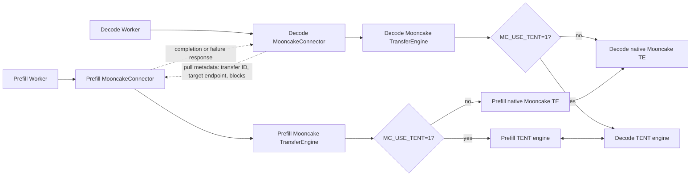

# [Issue #4149] [RFC]: Native TENT Integration with the vLLM Mooncake KV Connector

source: https://github.com/kvcache-ai/Mooncake/issues/4149
state: closed | updated: 2026-09-16T01:31:32Z
labels: RFC

## 正文

# RFC: Native TENT Integration with the vLLM Mooncake KV Connector

This RFC proposes integrating TENT as a native data-plane implementation of
the Mooncake Transfer Engine API used by vLLM's in-tree Mooncake KV Connector.
The Mooncake Connector remains responsible for request coordination, KV
metadata exchange, and readiness control. TENT is used only to move KV blocks
between Prefill and Decode workers.

The implementation is contained in Mooncake/TENT. vLLM continues to use its
unchanged in-tree Mooncake Connector and its existing Transfer Engine API.
TENT selection occurs transparently inside Mooncake.

## Goals

- Run real vLLM PD inference with separate Prefill and Decode workers.
- Ensure Decode does not execute until every required KV block is ready.
- Handle transfer failure, timeout, cancellation, worker failure, and shutdown.
- Support concurrent KV transfers without endpoint or transport corruption.
- Report KV throughput, transfer latency, request latency, and TTFT against a
  clearly defined baseline.
- Preserve native Mooncake as the default implementation and configuration.

## Architecture



The Connector is the only vLLM KV Connector. Mooncake selects its internal
implementation at initialization: native Mooncake remains the default, while
`MC_USE_TENT=1` enables the TENT path. This does not change vLLM's connector
configuration or import any TENT-specific code into vLLM.

## Proposed Design

### Mooncake/TENT Repository

Mooncake preserves the existing Connector-facing `TransferEngine` surface:

- initialization and endpoint discovery;
- GPU memory registration and deregistration;
- segment open and close;
- batch allocation, submission, status, cancellation, and release;
- endpoint and transport lifecycle management;
- metrics and failure observability.

TENT owns its native resources and implements bounded concurrent work. In
TENT mode, Mooncake's existing `TransferEngine` surface delegates to the
TENT-native engine internally; callers, including vLLM, retain the same API.
A temporary lack of transport capacity is queued or back-pressured according to
the configured limit; it must not be converted into an unrecoverable request
failure without retry policy.

Every transfer path must release batch and segment resources on success,
failure, timeout, cancellation, peer failure, and process shutdown. Cleanup
must be idempotent and safe after partial initialization.

TENT remains implemented in native Mooncake/TENT code; this is not a Python
monkey patch. vLLM imports only Mooncake's existing API and does not import
TENT classes. No vLLM production code change is required.

The unchanged Connector flow remains responsible for:

1. registering and publishing Prefill KV memory;
2. associating transfer metadata with a request and transfer ID;
3. accepting Prefill-side writes into Decode-published KV memory;
4. waiting for required KV blocks before execution;
5. releasing request and transfer state after completion or abort.

## Configuration

Native Mooncake requires no new setting. TENT is explicitly opt-in:

```bash
MC_USE_TENT=1
MC_TENT_CONF=/path/to/tent.json
```

`MC_TENT_CONF` is required when `MC_USE_TENT=1` unless a documented default
TENT configuration is available. Mooncake/TENT is the only component that
reads this setting. TENT is not selected by any vLLM setting.

Timeout, cancellation grace, transport capacity, and retry policy are part of
the TENT configuration contract. Their public schema and defaults must be
documented by the Mooncake/TENT implementation rather than introduced as
vLLM-specific environment variables.

Configuration errors fail fast. Transport and device selection must be
configured through the TENT configuration contract rather than silently
ignored Connector arguments.

## Failure and Cleanup Semantics

The implementation must guarantee:

- incomplete KV blocks are never consumed by Decode;
- failed transfers mark the corresponding request unavailable;
- timeout triggers cancellation followed by bounded cleanup;
- cancellation failure is observable and does not leave an untracked batch;
- graceful worker shutdown unregisters memory and closes outstanding segments
  and batches;
- ungraceful process death is reclaimed by peer-visible expiry or lease TTL
  within a documented bound;
- repeated cleanup does not double-free resources;
- transfer, receive, expiry, and cleanup failures are measurable.

If Decode submission fails after Prefill has produced KV blocks, the control
plane must either cancel the transfer or expire the associated request state.
The implementation must not rely only on Python object destruction for cleanup.

## Implementation and Acceptance

The Mooncake/TENT change includes:

- transparent `MC_USE_TENT` selection inside Mooncake;
- a TENT-backed implementation behind the existing `TransferEngine` surface;
- concurrent transport and endpoint management;
- lifecycle, timeout, cancellation, and cleanup handling;
- metrics and native unit/integration tests.

Acceptance gates:

- single and concurrent transfers complete correctly;
- destination data is validated, not only marked complete;
- timeout, cancellation, peer failure, graceful shutdown, and forced process
  death reclaim resources within their documented bounds;
- no transport, endpoint, segment, batch, or registered-memory leaks remain;
- native Mooncake behavior remains unchanged;
- real vLLM PD inference succeeds without modifying vLLM;
- Prefill and Decode exchange KV blocks through TENT, and Decode waits for all
  required KV blocks;
- benchmark results include native Mooncake TE and TENT comparisons.

Proxy changes and benchmark harness updates are test infrastructure. They may
be submitted with the Mooncake integration tests, but they are not part of the
vLLM production Connector API.


### Before submitting a new issue...

- [ ] Make sure you already searched for relevant issues and read the [documentation](https://kvcache-ai.github.io/Mooncake/)

## 评论 (1)

### github-actions[bot] · 2026-09-16

Thanks for opening this issue, @RuixiangMa!

| Field | Value |
|-------|-------|
| **Issue** | #4149 |
| **GitHub user ID** | `27672240` |
| **Reporter** | @RuixiangMa |

A maintainer will triage this when possible. To help us respond faster, please include:

- Mooncake version or commit SHA
- Environment (OS, CUDA/driver, RDMA stack if relevant)
- Steps to reproduce and expected vs. actual behavior

Useful links: [Documentation](https://kvcache-ai.github.io/Mooncake/) · [Contributing guide](https://github.com/kvcache-ai/Mooncake/blob/main/CONTRIBUTING.md)

> This message was posted automatically by the issue bot.
