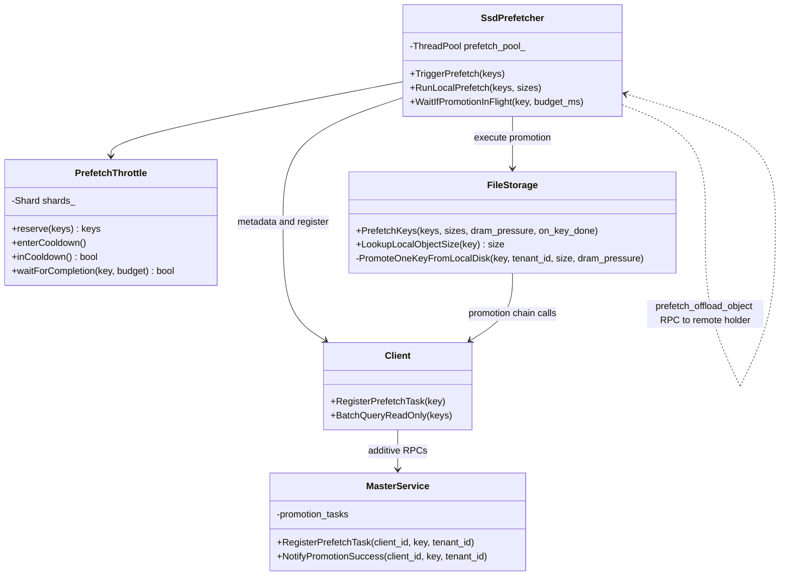
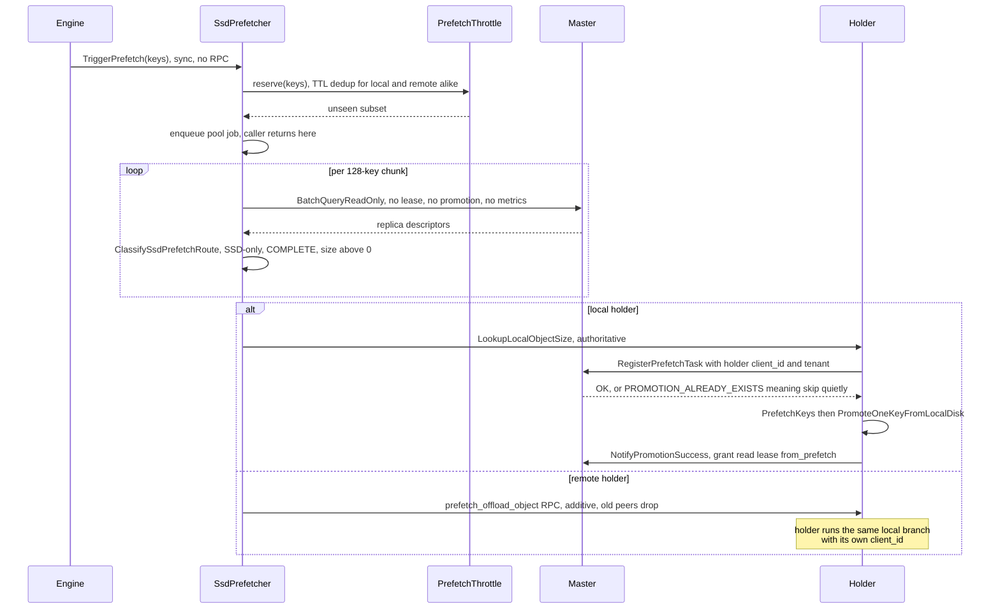
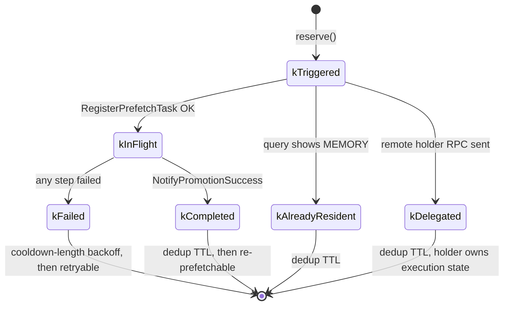
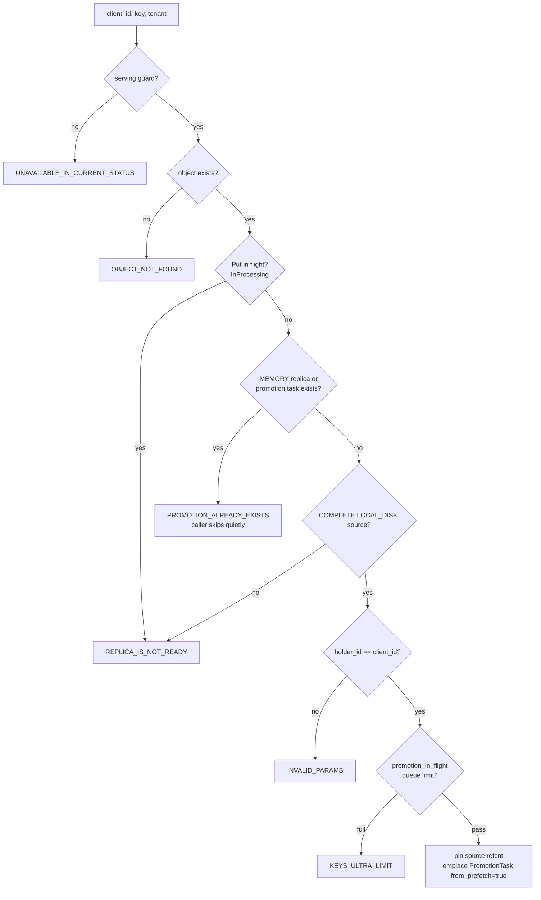
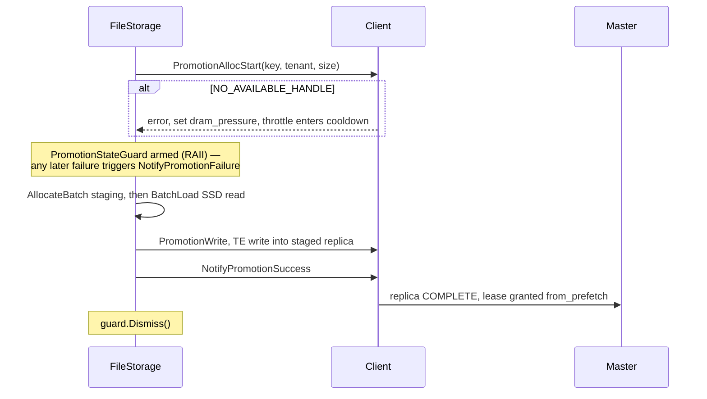

# [Issue #4271] [RFC]: SSD Prefetch-on-Exist — Design and Implementation

source: https://github.com/kvcache-ai/Mooncake/issues/4271
state: open | updated: 2026-09-22T05:38:04Z
labels: 

## 正文

## TL;DR

When a prefix-cache probe (`exist`) hits a key that only survives on SSD, Mooncake can start a best-effort SSD→DRAM promotion inside the probe→get queueing window, so the follow-up `get()` reads DRAM instead of SSD on the critical path. This RFC presents the implementation design: trigger throttling, master-side task registration, a promotion execution chain shared with promotion-on-hit, and the exist/get wiring. Concept RFC: #2213. Builds on the implementation pioneered in #2646. Several design decisions here (commit-time lease, shared in-flight quota, trigger-immediate execution) directly follow the critique in #3417, whose router-side explicit trigger remains the complementary next step on top of this machinery.

**Measured**: DSv4-Flash + vllm-ascend (A2), offload-only vs offload+prefetch, same dataset/seed, `promotion_on_hit=false`. Numbers are TTFT decrease relative to the offload-only baseline of the same round, computed as (baseline − prefetch) / baseline.

**Concurrency 2** (store DRAM comfortably sized):

| metric | TTFT decrease with prefetch |
|---|---:|
| median | **5.2%** |
| mean | **5.1%** |
| p99 | **22.0%** |

**Concurrency 4** (deliberately DRAM-constrained store, ~97.5% full):

| metric | TTFT decrease with prefetch |
|---|---:|
| median | **85.2%** |
| mean | **81.4%** |
| p99 | **44.9%** |

**NVIDIA H20**:

| metric | TTFT decrease with prefetch |
|---|---:|
| median | **27.4%** |
| mean | **6.7%** |
| p99 | **0.3%** |

Without prefetch, a queued request pays serial SSD reads on the critical path, so the baseline's TTFT grows roughly linearly with queue depth; with prefetch those reads happen inside the queueing window and TTFT stays flat. The decrease scales with queue depth and with the SSD-read share of TTFT; an idle, serial workload sees ≈ 0 decrease by design.

## Scope and non-goals

In: per-client trigger throttle, master `RegisterPrefetchTask` RPC, holder-local promotion execution, exist/get wiring, C/Python bindings, tests and CI. Out (follow-ups): router-side explicit trigger RPC (#3417's surface), dedicated prefetch buffer / soft partition, watermark-gate at admission (cooldown backoff is used instead; see discussion).

## Architecture

## End-to-end trigger flow

## Component 1 — PrefetchThrottle

Sharded (16) per-key state machine with lazy expiry: a hot probe is O(batch), never O(table).

Per-state dedup windows: healthy states block for `ssd_prefetch_dedup_ttl_sec` (default 30 s), `kFailed` only for `ssd_prefetch_cooldown_sec` (default 5 s). The memory-pressure cooldown opens on `NO_AVAILABLE_HANDLE`: while active, prefetch yields to eviction/offload by design. Measured on a saturated store: promotion completed 503 / failed 860, cooldown yielded ~2.1k times.

## Component 2 — Master: RegisterPrefetchTask

Skips promotion-on-hit admission (an explicit probe *is* the hotness signal — aligning with #3417's own framing) but **shares** the in-flight cap and per-key task entry with promotion-on-hit, so double promotion is impossible. Commit-time lease on `from_prefetch` tasks closes the evicted-before-use gap quoted in #3417 (no dangling lease on failure).

## Component 3 — Shared promotion execution chain

One chain, one failure-handling posture, shared verbatim with promotion-on-hit (`ProcessPromotionTasks`).

## Component 4 — exist/get wiring

- exist: `ExistOptions.prefetch_to_memory` + `enable_ssd_prefetch` → trigger. Sync cost: dedup lookup + pool enqueue. No RPC on the probe.
- get (`ssd_get_wait_ms > 0`, default off): one deadline shared by the whole batch; wait only on live local promotions (`kInFlight`/`kCompleted`); read-only re-queries. A batch headed for SSD also gets one demand-side promotion attempt for its disk keys (`ignore_cooldown` bypasses only the client-side throttle backoff — never a master-side gate: the shared in-flight cap, holder check, and dedup TTL still apply); SSD fallback is immediate.

## Relationship and differences (code level)

This RFC is the **implementation design** for the concept in #2213 and is
complementary to the router-side proposal in #3417. Concretely, at the
level of the code that ships:

| Decision point | #2213 (@Pz1116) | #3417 (@LujhCoconut) | This RFC |
|---|---|---|---|
| What it is | Concept RFC: exist-triggered prefetch + `ExistOptions` API shape (suggested by @LujhCoconut). No implementation design. | Router-side explicit trigger RFC. No code yet. | Complete component design + implementation + measurements |
| Trigger | `exist` probe (engine SDK) | `BatchPrefetchToMemory` RPC from the router | `exist` probe — the RFC's own "engine SDK without a router" row |
| Execution cadence | — | Dedicated promotion pull thread (100 ms loop, sequential) | No pull thread at all: bounded 4-thread pool starts execution immediately on trigger |
| Lease | — | Granted at enqueue ("Trigger RPC grants lease at enqueue") | Granted at commit (`NotifyPromotionSuccess`); a failed promotion never leaves a dangling lease |
| Gates | — | watermark / dedup / in-flight quota kept, shared | Sketch skipped (explicit probe is the hotness signal); quota shared identically; cooldown backoff instead of the watermark gate |
| Buffer | — | Dedicated prefetch buffer (soft partition) | None in v1 — orthogonal follow-up on the same machinery |
| Double-promotion safety | — | Same per-key task entry | Same per-key `promotion_tasks` entry + shared `promotion_in_flight_` cap — prefetch and promotion-on-hit cannot double-promote |

Two diagrams above carry the substance: the [trigger flow](#end-to-end-trigger-flow) shows the exist-probe path (no router, no pull thread), and the [throttle state machine](#component-1--prefetchthrottle) shows the dedup/cooldown semantics that replace the sketch and watermark gates. Where #3417's router RPC wants to land later, `RegisterPrefetchTask` plus the shared chain is exactly the enqueue-and-execute machinery it needs — the two are stages of one design, not competitors.

## Compatibility

No existing RPC signature changes; new RPCs are additive (old peers reject → no-op); read-only queries reuse pre-existing admin RPCs; all knobs default off (`enable_ssd_prefetch=false`, `ssd_get_wait_ms=0`).

## Testing

Unit: throttle state machine (11), master RPC semantics (5), read-only query wrappers (4). Integration: `test_prefetch_on_exist.py` with a negative control, wired into `scripts/ci/run_ssd_offload_smoke.sh` with its own master (`promotion_on_hit=false`). Benchmark: A/B methodology (fill → overflow → settle → measure), numbers above.

## 评论 (1)

### github-actions[bot] · 2026-09-22

Thanks for opening this issue, @DHX98!

| Field | Value |
|-------|-------|
| **Issue** | #4271 |
| **GitHub user ID** | `46540437` |
| **Reporter** | @DHX98 |

A maintainer will triage this when possible. To help us respond faster, please include:

- Mooncake version or commit SHA
- Environment (OS, CUDA/driver, RDMA stack if relevant)
- Steps to reproduce and expected vs. actual behavior

Useful links: [Documentation](https://kvcache-ai.github.io/Mooncake/) · [Contributing guide](https://github.com/kvcache-ai/Mooncake/blob/main/CONTRIBUTING.md)

> This message was posted automatically by the issue bot.
