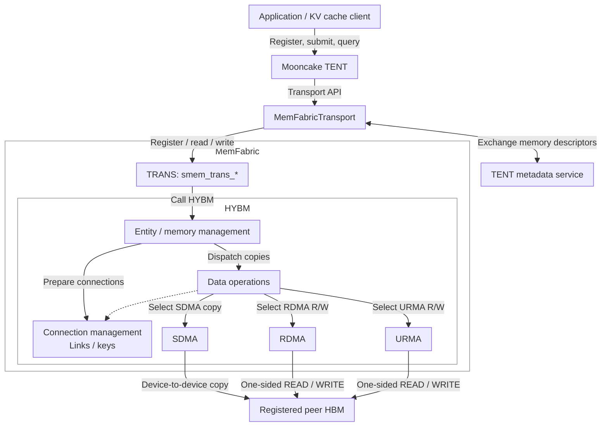

# [Issue #4282] [RFC]:  [TENT] Add a MemFabric Transport Backend via TRANS APIs

source: https://github.com/kvcache-ai/Mooncake/issues/4282
state: open | updated: 2026-09-23T02:04:55Z
labels: RFC

## 正文

### Changes proposed

## 1. Background and Motivation

In Prefill/Decode disaggregation and remote KV cache access, applications use the Mooncake Transfer Engine to register memory and perform READ/WRITE operations across processes and nodes. This RFC proposes adding `MemFabricTransport` to Mooncake TENT through MemFabric's `smem_trans_*` APIs, reusing its memory registration, connection establishment, and data transfer capabilities.

MemFabric is optimized for Ascend hardware, coordinating software with on-device SDMA, RDMA, and URMA capabilities. Its design is tailored to NPU memory and device interconnects, providing Mooncake with a unified hardware acceleration path for KV cache transfers and reducing the effort required to support different devices and protocols.

Applications continue to use Mooncake's memory registration, batch submission, and status query APIs. TENT handles request scheduling and status management, while MemFabric TRANS handles the underlying communication.

## 2. Technical Architecture

### 2.1 Protocol Stack

TENT identifies the target segment and memory range. TRANS resolves the remote instance and address, while HYBM handles memory mapping, connection establishment, and data movement. The diagram shows HYBM's host-initiated path: entity management owns memory, data operation, and connection resources. SDMA uses device copy capabilities, and the dashed arrow indicates that network data operations depend on connection management.

### 2.2 Main Components

| Component | Responsibilities and Resource Ownership |
|---|---|
| `MemFabricTransport` | Implements TENT `Transport`; manages registration records, SubBatches, task states, and a bounded submission queue. |
| `MemFabricContext` | Created and destroyed by the transport; owns one `smem_trans_t`, device configuration, and a dedicated worker thread, and manages references to TRANS initialization. |
| `MemFabricPeer` | Stores the TRANS `uniqueId`, instance identifier, and accessible memory ranges for a remote segment; delegates connection management and address translation to TRANS. |

### 2.3 API Mapping

| TENT API | TRANS Calls and Adapter Behavior |
|---|---|
| `install()` | Initialize the configuration and explicitly set `deviceId`, `role`, and `dataOpType`; call `smem_trans_init()` and `smem_trans_create(storeUrl, uniqueId, ...)`. |
| `addMemoryBuffer()` | Call `smem_trans_register_mem()`; on success, record the address range and advertise MemFabric support in `BufferDesc`. |
| `allocateSubBatch()` / `freeSubBatch()` | Allocate and reclaim task records in the adapter; defer reclamation while the worker still references them. |
| `submitTransferTasks()` | Validate the entire request set and reserve queue resources before atomically enqueueing it; the worker groups requests by peer and READ/WRITE operation, then calls `smem_trans_batch_read()` or `smem_trans_batch_write()`. |
| `getTransferStatus()` | Read task states maintained by the adapter; report `COMPLETED` and the transferred byte count only after the synchronous transfer succeeds. |
| `removeMemoryBuffer()` | Intended to map to `smem_trans_deregister_mem()`; the current implementation does not actually deregister memory, so the initial version rejects runtime deregistration. |
| `quiesce()` / `uninstall()` | Stop accepting work, wait for the worker and in-flight accesses to finish, then destroy the TRANS handle; the last instance holding an initialization reference calls uninit. |

## 3. Implementation and Validation

Add `MemFabricTransport` and integrate it with TENT's transport enumeration, `transport_loader.cpp`, selector, configuration parsing, and a `USE_MEMFABRIC` build option that is disabled by default. Configuration includes at least `store_url`, `unique_id`, `device_id`, the data transfer backend, and queue capacity.

Initial validation covers data integrity for HBM READ/WRITE and batch transfers between two processes, nonzero offsets and range checks, communication between peers with the same role, readiness progress when the target submits no application requests, rejection of the entire submission when the queue is full, repeated appends to a SubBatch, and normal shutdown. For RDMA and SDMA, separately record the actual selected path, runtime library versions, bandwidth, and P50/P99 latency.

### Before submitting a new issue...

- [x] Make sure you already searched for relevant issues and read the [documentation](https://kvcache-ai.github.io/Mooncake/)

## 评论 (2)

### github-actions[bot] · 2026-09-22

Thanks for opening this issue, @fadedzipper!

| Field | Value |
|-------|-------|
| **Issue** | #4282 |
| **GitHub user ID** | `52341146` |
| **Reporter** | @fadedzipper |

A maintainer will triage this when possible. To help us respond faster, please include:

- Mooncake version or commit SHA
- Environment (OS, CUDA/driver, RDMA stack if relevant)
- Steps to reproduce and expected vs. actual behavior

Useful links: [Documentation](https://kvcache-ai.github.io/Mooncake/) · [Contributing guide](https://github.com/kvcache-ai/Mooncake/blob/main/CONTRIBUTING.md)

> This message was posted automatically by the issue bot.

### ascend-direct-dev · 2026-09-23

Thanks for the RFC.

On Ascend, TENT already has an Ascend path: `ascend_direct_transport` (see `mooncake-transfer-engine/tent/.../ascend/ascend_direct_transport.*` and the design doc for Ascend Direct Transport). For Ascend deployments we expect traffic to go through **`ascend_direct_transport`**, rather than adding a separate MemFabric-backed TENT transport.

A parallel `MemFabricTransport` that applications select instead of Ascend Direct for Ascend hardware is not the direction we want.
