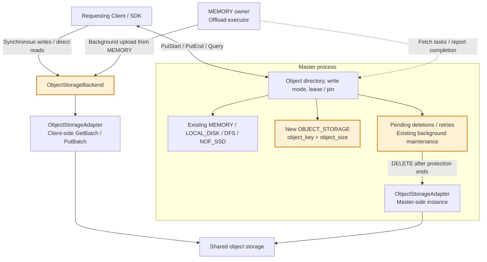
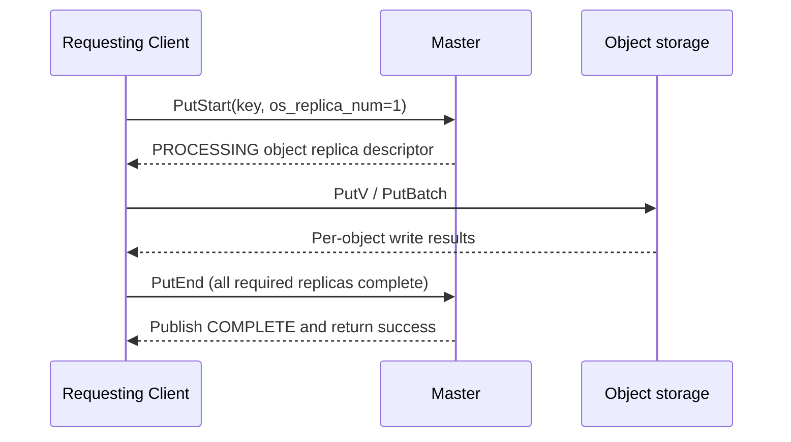
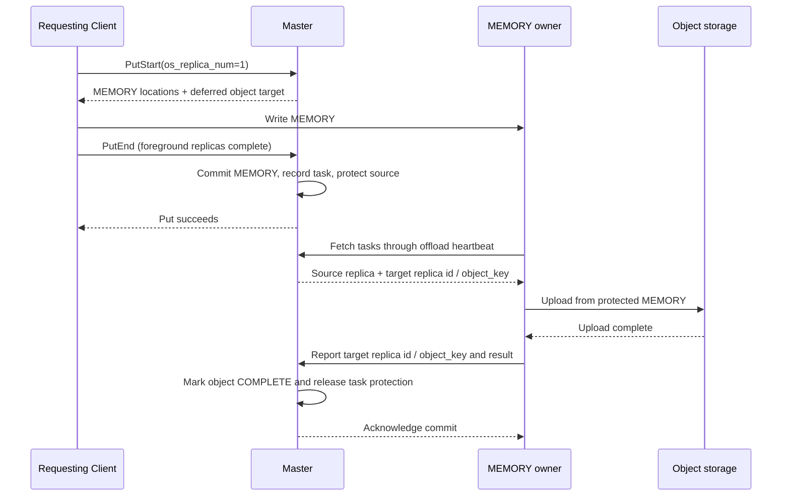
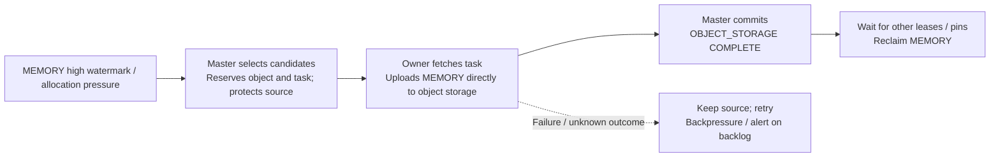
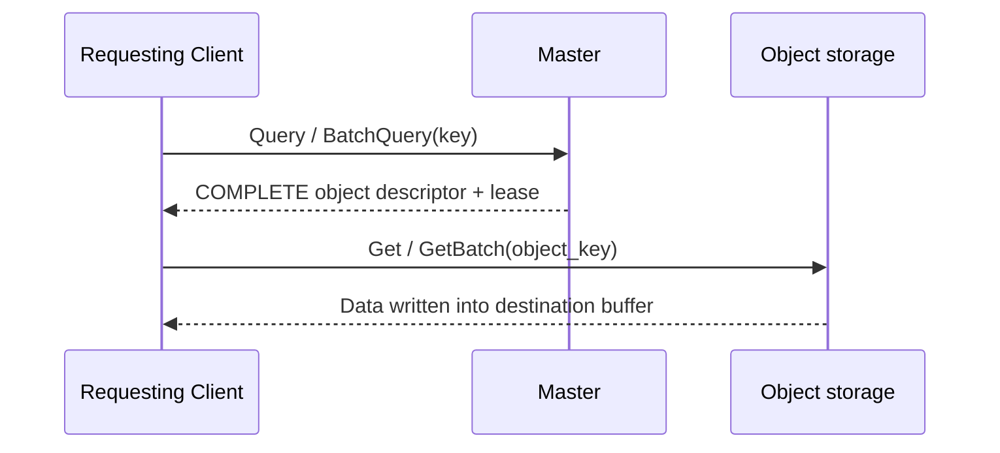

# [Issue #4296] [RFC]: [Store] Add object storage as a first-class replica tier

source: https://github.com/kvcache-ai/Mooncake/issues/4296
state: open | updated: 2026-09-24T03:15:20Z
labels: RFC

## 正文

### Changes proposed

# [RFC]: [Store] Add object storage as a first-class replica tier

This proposal introduces object storage as a first-class replica tier, reusing the [existing OSS adapter](https://kvcache-ai.github.io/Mooncake/design/store/oss-backend.html). The new types, configuration options, and protocol extensions below are proposed changes.

## 1. Goals and scope

The current object storage integration follows the FileStorage / LOCAL_DISK path: the MEMORY owner performs uploads, and reads also depend on that owner. This proposal introduces an `OBJECT_STORAGE` replica alongside MEMORY, LOCAL_DISK, DFS, and NOF_SSD:

- The Master manages object locations, replica states, and lifecycle; Clients access shared object storage directly using descriptors.
- The Master configures one of three write modes: synchronous writes, asynchronous replication after a memory write, or direct offload on memory eviction.
- Object replicas support deletion and background reclamation.
- Once an object replica is committed, other Clients can read it even after the original writer/owner goes offline.

The initial implementation reuses the OSS adapter while keeping the interface provider-neutral. Each Mooncake object maps to one backend object. Object aggregation, cascading MEMORY → SSD → object storage, a unified redesign of all external storage tiers, and general idempotency enhancements to the shared Start/End/Revoke protocol are out of scope.

## 2. Architecture



- Backends and adapters are in-process modules, with separate instances in each participating process. The Master does not carry object GET/PUT data traffic, but uses its own adapter for background DELETE operations.
- Deletion and retries reuse the Master's existing background maintenance mechanism, without requiring a dedicated GC thread or service. Only known pending deletions are processed; the entire bucket is not scanned.
- Both background modes reuse the owner's offload queue, heartbeat, and source-replica protection, extending them with an object-storage target and completion reporting. Reads no longer depend on the owner after the object replica is committed.
- As with DFS, the Master manages replicas while Clients access shared storage directly. Objects are addressed by key, without file-offset allocation or inheritance from the DFS allocator interface.

## 3. Metadata and configuration

### 3.1 Replica descriptor

```cpp
struct ObjectStorageDescriptor {
    std::string object_key;
    uint64_t object_size;
};

// Added to ReplicateConfig
size_t os_replica_num{0};
```

`ObjectStorageDescriptor` is added to the existing `Replica::Descriptor::descriptor_variant`. Replica `id` and `status` remain in the shared outer descriptor rather than being duplicated in the object descriptor.

Enabling object replicas requires support in the Master and all participating Clients. The initial implementation does not promise mixed-version operation with older releases.

- `os_replica_num` initially supports 0 or 1, defaulting to 0. A value of 1 requests one object replica according to the Master's policy. It is neither the object service's internal replication factor nor an indication that the replica is already complete.
- The initial write requires at least one MEMORY replica. After the object replica is committed, MEMORY replicas may be evicted under the normal protection rules.
- `object_key` is a backend object name allocated by the Master, separate from the application's key. The adapter handles prefixes and encoding.
- Upsert, Put after Remove, and reallocation after abandoning an old task use new object names, so late uploads or old deletion tasks cannot affect new data. Ordinary retries of the same task reuse its `object_key`. This does not introduce a user-facing multi-version KV API.
- Existing shared object-checksum metadata is reused; provider ETags are not treated as a generic content checksum.

Using a separate object name isolates successive values of the same application key. For example, if `Put(K)` follows `Remove(K)` before the old background DELETE finishes, using K for both backend objects would let the delayed DELETE remove the new data. The Master maps the application key to an `object_key`, so old tasks operate only on the old object. The same isolation applies to Upsert and late uploads.

### 3.2 Cluster-wide backend configuration

Initially, each cluster uses a single object storage backend. The Master publishes non-secret configuration to Clients: provider, endpoint, bucket/namespace, and prefix. Clients fetch and cache it during initialization. The Master uses the same storage target for reclamation; descriptors do not duplicate this configuration.

An object's full location is **the cluster-wide endpoint / bucket / prefix plus `object_key`**.

Client-side and Master-side adapters use credentials configured in their respective processes, reusing the existing OSS environment variables without introducing a credential service:

```text
MOONCAKE_OSS_ACCESS_KEY_ID
MOONCAKE_OSS_ACCESS_KEY_SECRET
MOONCAKE_OSS_SECURITY_TOKEN    # Optional, for temporary credentials
```

Clients need read/write access; Master-side reclamation needs delete access within the target bucket/prefix. They may use different identities. Secrets are not included in shared configuration or descriptors. The initial implementation retains credential loading at adapter initialization and does not introduce automatic credential refresh.

Backend configuration is fixed at cluster startup. Runtime target switching and multi-backend routing are not supported. Existing objects and upload/deletion tasks must not be reinterpreted against another namespace; descriptors, configuration caches, and tasks must not be reused across rebuilt clusters.

Object access does not require a local SSD mount. Background modes require an owner capable of fetching tasks and uploading objects.

The backend must make fully committed objects readable across Clients and support reads and repeated deletes by `object_key`. The adapter handles provider-specific differences.

### 3.3 Master write mode

A new Master option, `object_storage_write_mode`, defaults to `sync` and can be set through the configuration file or command line:

```text
--object_storage_write_mode=sync
# Options: sync / async / offload_on_evict
```

| Mode | Object upload timing | Foreground Put succeeds when | MEMORY handling |
| --- | --- | --- | --- |
| `sync` | The requesting Client uploads during the foreground Put | MEMORY, object storage, and all other required replicas are complete and committed by the Master | Normal eviction rules apply |
| `async` | After MEMORY is committed, its owner fetches an upload task | Foreground replicas are complete, and the Master has recorded the object task and protected its source | Task protection ends after object completion; MEMORY is not immediately evicted |
| `offload_on_evict` | The owner uploads when memory pressure or the high watermark triggers eviction | Foreground replicas are complete and the deferred object policy is recorded | MEMORY is reclaimed only after the object becomes COMPLETE and other protection permits it |

The option applies only to writes with `os_replica_num=1`; 0 preserves existing behavior. The mode is bound to the write. PutStart returns the required foreground replicas and deferred target, rather than reinterpreting in-flight tasks after a configuration change.

Both background modes verify during foreground admission that at least one MEMORY owner can fetch tasks and upload objects. The `sync` mode only requires object-write capability on the requesting Client.

**In either background mode, a successful Put does not guarantee that the data is already in object storage. Losing all valid replicas before the object is committed can still make the data unavailable.** Only the object replica is deferred; other requested foreground replicas must still complete.

For these keys, the object policy controls automatic offload scheduling to avoid duplicate dispatch through the existing LOCAL_DISK path. Tasks explicitly target OBJECT_STORAGE and do not register completion as LOCAL_DISK. Existing LOCAL_DISK replicas are unaffected.

## 4. Write paths

### 4.1 Synchronous writes



Data transfers for MEMORY and other replicas are omitted from the diagram. The Master creates object-replica metadata and allocates an `object_key`; the Client uploads through the existing adapter. Completion is determined per key, including per-key results within a batch. Failure of any required replica must not be reported as success for that key.

### 4.2 Asynchronous replication after a memory write



- Before PutEnd returns success, foreground replicas must be committed, the task recorded, and its source protected. Failure to register the task must not be reported as success.
- The owner is a Client holding the source MEMORY replica and capable of object uploads; it need not be the Client that initiated Put.
- The existing offload heartbeat is reused, with a default 10-second interval after each work round finishes. While queued or uploading, the object replica is PROCESSING and MEMORY remains readable.
- Successful replication releases only task protection. Later memory eviction can use the existing COMPLETE object for the same value without another upload.

### 4.3 Offload on memory eviction



The foreground Put records only the deferred policy. Object and task reservation occurs when eviction is triggered. Existing memory-eviction candidate rules are reused. An existing COMPLETE object for the same value avoids another upload, and an existing task avoids duplicate scheduling.

**Source memory must not be released merely to lower the watermark before the object is committed or while read/write tasks still reference it.** Memory watermarks must leave upload headroom, with bounds on queue size and protected bytes. If object storage cannot keep up, new Puts may be backpressured or fail; data is not automatically redirected to SSD.

## 5. Read path



All three write modes share this read path, retaining MEMORY preference. Uncommitted objects are not selected for reads.

- Support ordinary, batched, Python-buffer, and ranged-session entry points. Paths requiring staging use a byte budget; long reads must finish within their lease or renew it.
- Distinguish NotFound, permission errors, timeouts, short reads, and checksum failures. Report a replica as missing only after confirming that the exact object does not exist; network errors are not evidence of deletion.
- Foreground operations use the caller's execution context; background operations use the owner's offload executor. This proposal does not require a dedicated OSS thread pool.


### Before submitting a new issue...

- [x] Make sure you already searched for relevant issues and read the [documentation](https://kvcache-ai.github.io/Mooncake/)

## 评论 (2)

### github-actions[bot] · 2026-09-23

Thanks for opening this issue, @particle128!

| Field | Value |
|-------|-------|
| **Issue** | #4296 |
| **GitHub user ID** | `3041842` |
| **Reporter** | @particle128 |

A maintainer will triage this when possible. To help us respond faster, please include:

- Mooncake version or commit SHA
- Environment (OS, CUDA/driver, RDMA stack if relevant)
- Steps to reproduce and expected vs. actual behavior

Useful links: [Documentation](https://kvcache-ai.github.io/Mooncake/) · [Contributing guide](https://github.com/kvcache-ai/Mooncake/blob/main/CONTRIBUTING.md)

> This message was posted automatically by the issue bot.

### fcczzz · 2026-09-24

@particle128 Thanks for the proposal! Making object-storage replicas readable independently of the original owner would be a useful improvement.

Have you considered extending the existing DFS abstraction instead of introducing a new top-level `OBJECT_STORAGE` replica type? DFS already supports shard and bucket allocators, so perhaps an object-storage allocator could handle unique object-key allocation and deferred deletion, with the backend routing reads and writes through the existing object-storage adapter.

That would still require descriptor and I/O-path extensions, but both approaches seem to share the same core model: Master-managed replica metadata with direct Client access to shared storage. It would be helpful to include a comparison in the RFC—are there lifecycle or API requirements that make a separate replica type preferable, or is the main motivation to keep this change scoped?
