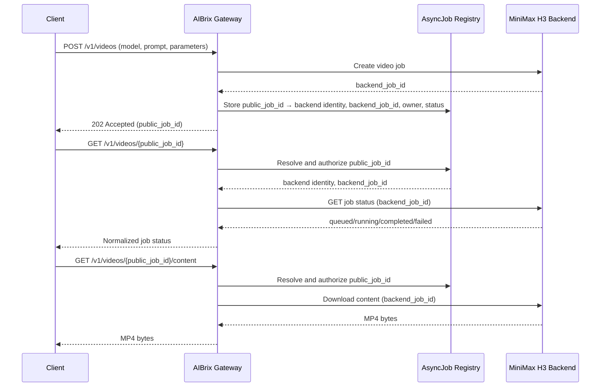

# [Issue #2674] [RFC]: Generalized Asynchronous Inference Job Lifecycle and Routing

source: https://github.com/vllm-project/aibrix/issues/2674
state: closed | updated: 2026-09-20T07:05:06Z
labels: 

## 正文

# [RFC]: Generalized Asynchronous Inference Job Lifecycle and Routing

## Summary

Introduce a shared asynchronous-job lifecycle for long-running inference in AIBrix. The lifecycle will persist job ownership and status, then route later status, cancellation, and result requests to the backend that owns the job.

## Motivation

The gateway currently selects a backend from `model` in the creation request. Later requests for an asynchronous operation usually contain only an ID, for example `GET /v1/responses/{response_id}` or a backend-specific job URL. They cannot be routed reliably after load balancing, a gateway restart, or pod replacement.

MiniMax H3 makes this gap concrete. vLLM-Omni and SGLang publish `/v1/videos` as an asynchronous job-polling API, while their direct-response variants return an MP4 in the creation response. AIBrix needs to preserve the relationship between an asynchronous video ID and its creating backend. This RFC treats such an API as one motivating asynchronous-workload example, not as an OpenAI API compatibility commitment.

OpenAI's [Responses background mode](https://developers.openai.com/api/docs/guides/background) is a representative API: clients create a response with `background: true`, then retrieve or cancel it by ID. The [Batch API](https://developers.openai.com/api/docs/guides/batch) uses the same create--poll--result pattern for offline work.

This capability would support:

- Long-running Responses requests, such as long-form generation.
- Asynchronous MiniMax H3 video-and-audio generation served by vLLM-Omni or SGLang.
- Image or multimodal backends that expose jobs rather than a single blocking request.
- Future backend-specific asynchronous APIs.

AIBrix already has durable state, status retrieval, and cancellation for Batch jobs. This RFC generalizes those primitives instead of duplicating them for each API.

## Proposed Change

Add an internal `AsyncJob` record in the metadata service:

```text
job_id, job_type, owner, model, backend_identity, backend_job_id, status, input_reference, output_reference, error, created_at, updated_at, expires_at
```

The initial lifecycle is `queued`, `running`, `succeeded`, `failed`, `cancelling`, `cancelled`, and `expired`.

The asynchronous-job lifecycle must:

1. Route a create request using the existing model router.
2. Persist the returned backend job ID and a stable backend identity.
3. Resolve a later job-ID request from the registry and proxy it to that backend.

The registry must enforce ownership, support TTL cleanup, and recover after gateway or worker restarts. Backend identity must be a stable service or worker identity, not only a pod IP.

### Example: MiniMax H3 asynchronous video generation

After this lifecycle is available, a MiniMax H3 client can submit `POST /v1/videos` to AIBrix. AIBrix routes the creation request to a compatible vLLM-Omni or SGLang backend, stores the relationship between its public job ID and the backend's job ID and identity, then returns the public ID. Later status, cancellation, and content requests are resolved through the registry before being proxied to the creating backend; they do not go through normal model load balancing.



## Alternatives Considered

- **Per-API implementations:** repeat persistence, authorization, routing, and recovery logic for every backend.
- **Normal load balancing for follow-up calls:** can send a job request to a backend that did not create it.
- **Expose a pod IP or encode it in the job ID:** leaks cluster topology and fails when pods are replaced.
- **Use Batch only:** does not support interactive, single-job workflows such as Responses background mode or video generation.
- **Build a workflow engine now:** is broader than durable asynchronous inference-job lifecycle management.


## 评论 (13)

### czczycz · 2026-09-07

My team is trying to use Aibrix as the unified gateway for our inference cluster and has encountered this problem when deploying video generation(Minimax H3) and 3D generation models.

### googs1025 · 2026-09-07

cc @Jeffwan @varungup90 

### varungup90 · 2026-09-07

I implemented this feature in our internal fork when the MiniMax M3 model was released. The initial implementation was done on a fairly tight timeline to unblock our internal production team, so it currently covers the core functionality but is still missing a few pieces, including expires_at and some additional metadata fields.

I’ll cherry-pick the relevant changes from our internal fork, clean them up, and publish a PR upstream.

My suggestion is to get the base implementation reviewed and merged first, and then we can follow up with the remaining metadata support and any additional improvements. Happy for you to help drive the follow-up work once the initial PR is in.

### czczycz · 2026-09-08

> I implemented this feature in our internal fork when the MiniMax M3 model was released. The initial implementation was done on a fairly tight timeline to unblock our internal production team, so it currently covers the core functionality but is still missing a few pieces, including expires_at and some additional metadata fields.
> 
> I’ll cherry-pick the relevant changes from our internal fork, clean them up, and publish a PR upstream.
> 
> My suggestion is to get the base implementation reviewed and merged first, and then we can follow up with the remaining metadata support and any additional improvements. Happy for you to help drive the follow-up work once the initial PR is in.

Thanks for the context — that sounds amazing.
The goal of this RFC is aligned with getting a minimal, reusable foundation merged first: persist the job-to-backend mapping and use it to route follow-up status, cancellation, and result requests reliably.
I agree that `expires_at`, richer metadata, and other lifecycle improvements can follow as incremental work. Once the PR is available, I'm happy to participate in the review and continue the follow-up work.

### varungup90 · 2026-09-08

@czczycz https://github.com/vllm-project/aibrix/pull/2686


### czczycz · 2026-09-09

> [@czczycz](https://github.com/czczycz) [#2686](https://github.com/vllm-project/aibrix/pull/2686)

@varungup90 Thanks for putting this together — this is a strong and pragmatic implementation of sticky routing for vLLM-Omni video jobs. I especially like that it covers the full lifecycle of the current Videos API: creation is pinned to a concrete pod, follow-up status/content/delete requests are routed back to that pod, and Redis makes the mapping available across gateway replicas. 
I found two reliability issues in the current implementation that may be worth addressing in this PR:
1. A Redis write failure can make a successfully created job unreachable.
  rememberVideoJobPod updates the local cache first and logs a Redis SET failure, but still lets the creation request succeed. If Redis is restarting or being upgraded, the backend job can be created successfully while its mapping is not persisted. After Redis recovers, there is no mechanism to replay the missed write, so another gateway replica—or the original replica after restart—cannot resolve the job.
  Could we define an explicit recovery strategy here? For example, persist the mapping before returning success, or retain failed writes and retry/reconcile them after Redis recovers. Since the backend job may already exist when persistence fails, the client-visible behavior should be well defined.
2. A transiently unavailable Pod currently causes the job mapping to be deleted.
  In pinVideoJobSubResource, a failed GetPod or a Pod that is temporarily NotReady removes the mapping and returns 404. A temporary cache, readiness, or network issue could therefore permanently lose the route to an in-progress job.
  It may be safer to preserve the mapping and return a retryable 503 when the Pod is temporarily unavailable. If the Pod is confirmed deleted, we can then return a terminal error with a clearer reason. This would avoid turning a transient infrastructure problem into a permanent “video not found” result.

Looking beyond this PR, I have two architectural questions for future evolution:
1. Could we introduce a reusable AsyncJob abstraction?
  This implementation is currently specific to /v1/videos and stores a video_id -> pod mapping. The same routing problem also exists for other asynchronous APIs, such as Responses background mode (background: true) for long-running text generation, plus future image, 3D, and other multimodal workloads.
  A small shared AsyncJob abstraction—containing public_job_id, job_type, owner, model, backend_identity, backend_job_id, status, and expires_at—could allow /v1/videos to be the first consumer while avoiding separate endpoint-specific implementations later.
2. Should AIBrix generate the external job ID?
  The current Redis key is based directly on the video_id returned by vLLM-Omni. The collision probability is extremely low, but AIBrix still depends on the backend’s ID-generation behavior. For example, vLLM-Omni generates the ID in its protocol layer: [videos.py](https://github.com/vllm-project/vllm-omni/blob/main/vllm_omni/entrypoints/openai/protocol/videos.py#L378-L380).
  A more general design could have AIBrix generate an opaque public_job_id and persist: `public_job_id -> backend_identity, backend_job_id, model, owner, expires_at`. The gateway would return and accept public_job_id externally, then translate it to the backend job ID internally. This fits naturally with the shared AsyncJob abstraction and removes backend-generated IDs from the cross-replica routing contract.

### czczycz · 2026-09-09

To make the possible `AsyncJob` direction more concrete, here is a minimal sketch for discussion. The intent is to keep endpoint-specific protocol handling outside of the common job lifecycle.

### AsyncJob

```text
AsyncJob {
    public_job_id       // Generated by AIBrix
    job_type            // video, response, image, etc.
    owner
    model

    backend_id          // Stable backend identity
    backend_job_id      // Job ID returned by the backend

    status              // pending, running, succeeded, failed, cancelled, expired
    error
    created_at
    updated_at
    expires_at
}
```

### AsyncJobManager

```text
// AsyncJobManager is backed by a pluggable AsyncJobStore.
// An in-memory map can be used for tests or local deployments, while Redis or
// another durable shared store can be used for production deployments.

AsyncJobManager(store) {
    Create(job_type, owner, model, backend_id) -> AsyncJob
    Get(public_job_id, owner) -> AsyncJob
    Update(public_job_id, changes) -> AsyncJob
    Delete(public_job_id, owner)
}
```

`Create` generates the `public_job_id` and stores an initial `pending` job. `Get` also validates ownership. The manager owns persistence and lifecycle semantics; API-specific handlers only translate requests and backend responses.

### Example: `POST /v1/videos`

```text
owner = authenticate(request)
backend = select_backend(request.model)

job = AsyncJobManager.Create(
    job_type   = "video",
    owner      = owner,
    model      = request.model,
    backend_id = backend.id
)

backend_response = backend.POST("/v1/videos", request)

if backend_response failed:
    AsyncJobManager.Update(job.public_job_id, {
        status: "failed",
        error: backend_response.error
    })
    return backend_response.error

AsyncJobManager.Update(job.public_job_id, {
    backend_job_id: backend_response.id,
    status: backend_response.status,
    expires_at: backend_response.expires_at
})

backend_response.id = job.public_job_id
return backend_response
```

### Example: `GET /v1/videos/{public_job_id}`

```text
owner = authenticate(request)
job = AsyncJobManager.Get(public_job_id, owner)
backend = resolve_backend(job.backend_id)

if backend is temporarily unavailable:
    return 503 RetryableError

backend_response = backend.GET(
    "/v1/videos/{job.backend_job_id}"
)

AsyncJobManager.Update(job.public_job_id, {
    status: backend_response.status,
    error: backend_response.error
})

backend_response.id = job.public_job_id
return backend_response
```

### Example: `GET /v1/videos/{public_job_id}/content`

```text
owner = authenticate(request)
job = AsyncJobManager.Get(public_job_id, owner)
backend = resolve_backend(job.backend_id)

if backend is temporarily unavailable:
    return 503 RetryableError

return backend.GET(
    "/v1/videos/{job.backend_job_id}/content"
)
```

With this separation, the Videos API only handles protocol translation, backend calls, and ID rewriting. The same `AsyncJobManager` can later support Responses background mode and other asynchronous image, 3D, or multimodal workloads.


### varungup90 · 2026-09-09

> 1. A Redis write failure can make a successfully created job unreachable.
>    rememberVideoJobPod updates the local cache first and logs a Redis SET failure, but still lets the creation request succeed. If Redis is restarting or being upgraded, the backend job can be created successfully while its mapping is not persisted. After Redis recovers, there is no mechanism to replay the missed write, so another gateway replica—or the original replica after restart—cannot resolve the job.
>    Could we define an explicit recovery strategy here? For example, persist the mapping before returning success, or retain failed writes and retry/reconcile them after Redis recovers. Since the backend job may already exist when persistence fails, the client-visible behavior should be well defined.

Good catch, but this was already addressed in `6085b9fa` (right before this comment). A quick rundown of where things stand:

* **Write order**: `rememberVideoJobPod` writes to Redis before updating the local cache, not after — see `pkg/plugins/gateway/gateway_video_routing.go` (L225-L230). The local entry is tagged with a `confirmed` boolean recording whether the Redis `SET` actually succeeded, so a failure isn't silently swallowed.
* **Replay/reconciliation**: `startVideoJobCacheSync` runs every 60s per replica (`pkg/plugins/gateway/gateway_video_routing.go` L80-L96, wired up in `gateway.go` L239). On each pass, `handleVideoJobCacheSyncMiss` (L153-L166) tells apart:
  * *"Redis genuinely no longer has this"* (`confirmed` entry missing $\rightarrow$ evict)
  * *"Our own write never landed"* (`unconfirmed` entry missing $\rightarrow$ retry `persistVideoJobToRedis`)
  
  So a `SET` failure during a Redis restart/upgrade self-heals within ~60s, for as long as the entry hasn't expired (up to the 7-day default TTL).
* **Client-visible behavior**: Already well-defined — creation success only depends on the backend pod succeeding, not on Redis, so the client always gets its ID back. A later `GET`/`DELETE` only 404s if neither the local cache nor Redis has the mapping at that point.

---

> **Remaining Edge Case**
> The retry state lives only in the in-memory cache of the replica that handled the create response. If that replica crashes/reschedules before the retry succeeds (i.e., the Redis outage outlasts that replica's remaining lifetime), the mapping is lost for good, since no other replica ever saw it. 

That's a much narrower window than "every failed write" (a normal Redis blip of a few seconds self-heals silently), but it's not zero. Given the retry window is already up to 7 days, I'd lean toward leaving this as-is unless we want to invest in a durable pending-write journal — happy to file a follow-up issue for that if you think it's worth tracking separately.

### varungup90 · 2026-09-09

> 2\. A transiently unavailable Pod currently causes the job mapping to be deleted.
>     In pinVideoJobSubResource, a failed GetPod or a Pod that is temporarily NotReady removes the mapping and returns 404. A temporary cache, readiness, or network issue could therefore permanently lose the route to an in-progress job.
>     It may be safer to preserve the mapping and return a retryable 503 when the Pod is temporarily unavailable. If the Pod is confirmed deleted, we can then return a terminal error with a clearer reason. This would avoid turning a transient infrastructure problem into a permanent “video not found” result.

Fixed in `8dca381f` — `pinVideoJobSubResource` now distinguishes terminal from transient pod unavailability instead of collapsing everything into a `404`:

* **Terminal (mapping forgotten, `404 video_not_found`)**: `GetPod` returns not-found/nil (the pod isn't in the informer cache at all), or the pod has a `DeletionTimestamp` set (`utils.IsPodTerminating`) — confirmed going away, won't come back under this name.
* **Transient (mapping preserved, new retryable `503 video_job_pod_unavailable`)**: The pod is found and isn't terminating but is `!IsPodReady` (readiness flap, restart, startup probe still pending), or has no routable address yet. The mapping stays intact so the next poll can land on the same pod once it recovers — the video itself lives on that pod's disk, so there's nowhere else to route it anyway.

Added `TestHandleVideoJobSubResourceHeaders_NotReadyPodReturns503AndKeepsMapping` and `TestHandleVideoJobSubResourceHeaders_TerminatingPodReturns404AndForgetsMapping` to lock in both branches; the existing `GetPod`-error test still asserts the terminal `404` path unchanged.

---

> **Reviewer Callout**
> This is a client-visible behavior change — a poll against a merely-`NotReady` pod now gets `503` instead of `404`, so it's worth double-checking any client/SDK code that branches on the specific status/error code for this endpoint.

### varungup90 · 2026-09-09

> To make the possible `AsyncJob` direction more concrete, here is a minimal sketch for discussion. The intent is to keep endpoint-specific protocol handling outside of the common job lifecycle.

The split is right: keep Videos as protocol translation, and keep a shared job record for identity, ownership, and pinning. The sketch still describes a different runtime than this gateway actually has.

Current gateway_video_routing is not a job manager. It is a sticky-route table: backend video_id → {pod, namespace, model, expiry}, plus Envoy ORIGINAL_DST pinning. Status, content, and most errors still live on the pod. List is a fan-out because each replica only knows its own disk. That constraint should drive the common type, not be treated as Videos-only glue.

What to keep from the sketch
A public id distinct from the backend id, with ownership on every follow-up.
A pluggable store (memory for tests, Redis for replicas). That already matches the local cache + Redis write-through.
Handlers that rewrite ids and talk protocol; a manager that owns persistence and “can I route this job?”
Treating a missing/unready pin as 503 with the mapping kept, vs a gone/terminating pod as terminal. That distinction is already load-bearing and should stay in the manager, not in Videos.
Where the sketch overreaches
1. Do not put status in the common lifecycle as source of truth.
For vLLM-Omni, the file and the real status are on the pod. If AsyncJob.status is updated on every GET, the store becomes a stale cache, and list-from-store will lie unless you refresh. Store identity, owner, pin, expiry, and maybe last_status as a hint. Let GET status still hit the backend.

2. Do not make the plugin the HTTP client for create / status / content.
The examples (backend.POST, backend.GET) fit a reverse-proxy handler. This path is Envoy ext_proc: create and content should keep flowing through Envoy. Video content in the plugin is a buffering/OOM problem. List is already the one justified ImmediateResponse fan-out; don’t spread that pattern.

3. Create-pending-then-call does not map onto ext_proc.
The plugin never “calls the backend” on POST. Envoy continues the request; the plugin sees the response later. A pending row created in RequestBody, then filled in ResponseBody, needs request_id → public_job_id correlation, GC for never-completed pending rows, and a rule that failed creates that never returned an id must not stay in the store. The lower-risk first step is: record the job only after a successful create response (today’s recordVideoJobPodFromResponse), and mint the public id at that point.

4. backend_id is underspecified, and Videos needs pod granularity.
If backend_id is a model or service, follow-ups land on the wrong replica and 404. For video, the pin is pod_name + pod_namespace (IP can change; pod identity should not). Responses background jobs may only need a service. Put pin granularity on the job (pod vs service vs none), or keep an opaque routing_key. Don’t make Videos’ local-disk rule the generic meaning of backend_id.

5. List is the real API hole.
The manager has Create/Get/Update/Delete and no List. GET /v1/videos today merges backend lists and would leak/mix backend ids after rewriting. With public ids and owners, list should come from the store (List(owner, job_type, model)), not from pods. Mixing store-list and fan-out-list will be inconsistent. Decide one: store is the catalog; backends remain the workers.

6. ID rewrite is a path mutation, not only a JSON field swap.
GET/DELETE must change :path from /v1/videos/{public} to /v1/videos/{backend} (and not rewrite /content bodies). That belongs in the Videos handler. Also: unguessable public ids; 404 for both missing and wrong owner; compare-and-swap or “don’t clobber terminal state” on Update; DELETE should proxy to the pod first, then drop the store row on 2xx/404, same as now.

Suggested shape
Keep AsyncJob small:

public_job_id, job_type, owner, model
pin (pod / service / none) + backend_job_id
expires_at, timestamps
optional last_error / last_status (cache only)
Keep AsyncJobManager as store + lookup + authz + pin resolution (the 503 vs 404 policy). Videos keeps: routing on create, JSON/path id rewrite, list query, DELETE eviction. Do not introduce a status state machine until a second API (Responses background) actually needs gateway-owned state.

If the goal is “make the next job type cheap,” extract the store and the public/backend id pair first, still Envoy-pinned, still video-specific pin semantics. The HTTP-client job orchestrator in the sketch is a different gateway, and it would fight this file’s existing edge cases rather than reuse them.

### czczycz · 2026-09-10

Thanks @varungup90 for the detailed feedback. I agree that the previous sketch overreached in a few important ways: it described the gateway plugin as an HTTP job orchestrator, treated status as gateway-owned state, and did not model the existing Envoy `ext_proc` request/response flow accurately.

Based on your suggestions, I would narrow the first abstraction to durable routing metadata. Backend services remain the source of truth for job status and results, while `AsyncJobRegistry` owns public identity, ownership, persistence, and Pod pinning. The Videos handler continues to perform protocol-specific path/ID rewriting, and Envoy remains responsible for proxying requests and streaming content.

The first version can also avoid a generic status state machine and use only four operations: `Register`, `Get`, `List`, and `Delete`.

### AsyncJobRecord

```text
AsyncJobRecord {
    public_job_id       // Generated by AIBrix; opaque and unguessable
    job_type            // video, response, image, etc.
    owner
    model
    backend_job_id      // Job ID returned by the backend

    backend_pod {
        namespace
        name
        uid             // Prevent routing to a replacement Pod with the same name
    }

    created_at
    expires_at
}
```

The first version uses Pod-level routing because video state and results exist only on the Pod that created the job. The Pod UID prevents accidentally routing an old job to a replacement Pod with the same namespace and name. Service-level routing can be added later if a backend explicitly guarantees shared job state across replicas.

### AsyncJobRegistry

```text
// AsyncJobRegistry uses a pluggable store.
// An in-memory map can be used for tests and local deployments.
// Redis or another shared durable store should be used in production.

AsyncJobRegistry(store) {
    Register(
        job_type,
        owner,
        model,
        backend_job_id,
        backend_pod,
        expires_at
    ) -> AsyncJobRecord

    Get(public_job_id, owner) -> AsyncJobRecord

    List(owner, job_type, model) -> []AsyncJobRecord

    Delete(public_job_id, owner)
}
```

`Register` generates `public_job_id` and persists the routing record after the backend has returned a successful creation response. It does not create or execute the backend job. `Get` validates ownership and returns the backend job ID and Pod routing target. Missing records and ownership mismatches should both return 404.

### Videos API integration

#### `POST /v1/videos` → `Register`

```text
Request phase:

owner = authenticate(request)
pod = select_backend_pod(request.model)

pin Envoy request to pod
continue request to backend
```

```text
Response phase:

if backend response is successful:
    job = AsyncJobRegistry.Register(
        job_type       = "video",
        owner          = owner,
        model          = request.model,
        backend_job_id = response.id,
        backend_pod    = {
            namespace: pod.namespace,
            name: pod.name,
            uid: pod.uid
        },
        expires_at     = response.expires_at
    )

    response.id = job.public_job_id
    continue response to client
```

`Register` must succeed before the successful backend response is forwarded to the client. This follows the current `ext_proc` model: the plugin does not call the backend itself; it records and rewrites the job after observing the backend response.

#### `GET /v1/videos/{public_job_id}` → `Get`

```text
owner = authenticate(request)
job = AsyncJobRegistry.Get(public_job_id, owner)
pod = get_pod(job.backend_pod.namespace, job.backend_pod.name)

if pod is temporarily unavailable:
    return 503 RetryableError

if pod.uid != job.backend_pod.uid:
    return BackendLost

rewrite path:
    /v1/videos/{public_job_id}
    ->
    /v1/videos/{job.backend_job_id}

pin request to pod
continue request through Envoy

rewrite response.id to public_job_id
```

#### `GET /v1/videos/{public_job_id}/content` → `Get`

```text
owner = authenticate(request)
job = AsyncJobRegistry.Get(public_job_id, owner)
pod = validate_backend_pod(job.backend_pod)

rewrite path:
    /v1/videos/{public_job_id}/content
    ->
    /v1/videos/{job.backend_job_id}/content

pin request to pod
continue request through Envoy
```

The plugin does not read or buffer video content; Envoy streams it directly from the backend Pod to the client.

#### `GET /v1/videos` → `List`

```text
owner = authenticate(request)

jobs = AsyncJobRegistry.List(
    owner    = owner,
    job_type = "video",
    model    = request.model
)
```

The store is the authoritative catalog for public IDs and ownership. If realtime backend status is required:

```text
group jobs by backend_pod
fetch status from the corresponding backend Pods
filter results using jobs.backend_job_id
rewrite backend IDs to public IDs
merge and return results
```

Backend Pods remain the source of truth for current status.

#### `DELETE /v1/videos/{public_job_id}` → `Get + Delete`

```text
owner = authenticate(request)
job = AsyncJobRegistry.Get(public_job_id, owner)
pod = validate_backend_pod(job.backend_pod)

rewrite path:
    /v1/videos/{public_job_id}
    ->
    /v1/videos/{job.backend_job_id}

pin DELETE request to pod
continue request through Envoy

if backend returns 2xx or 404:
    AsyncJobRegistry.Delete(public_job_id, owner)
```

The job record is retained when the backend returns 5xx or the Pod is temporarily unavailable, allowing the client to retry.

This keeps the first abstraction intentionally small:

- `AsyncJobRegistry` is a durable and authorized routing catalog, not a workflow engine.
- The Videos handler owns JSON and `:path` ID rewriting.
- Envoy owns backend proxying and content streaming.
- Backend Pods remain authoritative for current status and results.
- The Store is authoritative for public IDs, ownership, expiry, and backend Pod association.

Does this look closer to the abstraction you had in mind? The main open question I still see is list behavior: my preference is for the Store to define which jobs are visible to the owner, with backend fan-out used only to enrich those records with realtime status rather than as the public job catalog itself.
If we reach an agreement on the overall design, I can first provide a basic implementation PR.


### varungup90 · 2026-09-12

Yes — this is much closer to the abstraction I had in mind.

The role split is right: `AsyncJobRegistry` as a durable, authorized routing catalog; the Videos handler as protocol / ID rewriting; Envoy as proxy and content stream; backend pods as the source of truth for status and bytes. Registering only after a successful create response, dropping the status state machine, and returning 404 for both missing and wrong-owner all map onto the current `ext_proc` path.

**List:** yes — the store defines which jobs are visible to the owner. Backend fan-out should only enrich those records with realtime status, not act as the public catalog. Once AIBrix mints `public_job_id`, today’s merge-every-pod list would leak backend IDs and mix jobs the gateway never registered.

That is a client-visible change: jobs created off-gateway, or whose mapping never landed, will not appear. That’s acceptable, but it should be explicit. Enrichment also needs a failure rule — if one pod 503s, return the store rows anyway with unknown / omitted status rather than failing the whole list or dropping those jobs.

`List(owner, job_type, model)` is not a cheap extra method. Today Redis is `video_id → {pod, namespace, model, expiry}`. A production List needs a real secondary index (for example a ZSET by `created_at`), not `SCAN`. Public IDs and list are coupled: ID rewriting cannot ship without fixing list in the same change.

A few remaining points before a first PR:

**1. Keep pin resolution in the registry.** The sketch still has GET status doing `get_pod` + UID check, and content doing `validate_backend_pod`. The 503-versus-terminal policy is load-bearing and should be one function, e.g. `ResolvePin(record) → pod | retryable | terminal`. Videos should only rewrite `:path` / JSON and continue Envoy.

Current behavior to preserve, with UID as an added terminal case:

| Condition | Client | Mapping |
| --- | --- | --- |
| NotReady / no address | 503, retryable | keep |
| Informer miss / terminating | 404 (or `BackendLost`) | forget |
| `pod.uid != record.uid` | 404 (or `BackendLost`) | forget |
| Missing / wrong owner | 404 | unchanged |

`BackendLost` needs an HTTP mapping. 404 matches today’s client-visible “gone” behavior; 410 is nicer if we want “we knew this job, the artifact is gone” distinct from “unknown / not yours.” Either is fine — mixing `BackendLost`, 404, and 503 without a table will leak into every handler.

**2. “Register must succeed before forwarding success” is stricter than the current video path, and the failure mode is still underspecified.** Today create success follows the backend; a Redis failure stays replica-local and retries. Blocking the client on `Register` is cleaner for public IDs (do not return an ID that cannot be resolved), but a Redis blip then yields the opposite orphan: backend job exists, client got 5xx, nobody has a public ID.

We should pick one:

- Fail the client (and optionally best-effort `DELETE` the backend job), or
- Keep confirmed / retry write-through, but never return `public_job_id` unless the record is persisted, or
- Persist first, then rewrite; if persist fails, `ImmediateResponse` 5xx and do not emit a public ID.

I would not fail a successful video create on a short Redis blip unless compensation is defined. Public IDs do force a stronger write than today’s backend-id keys, because the client cannot later present the backend ID.

**3. `backend_pod` is right for Videos v1, too video-shaped if this type is meant to be reused.** For local-disk jobs, pin is `{namespace, name, uid}` — UID is a good addition the current mapping does not have. Responses background mode may only need a service. Hardcoding `backend_pod` on `AsyncJobRecord` makes `job_type` look generic while the pin is not. A small `pin` with kind `pod | service | none` now is cheaper than renaming the field later. If the first PR is video-only, we should say that and not treat `job_type` as the extension point.

Other details that should be in the first version, not follow-ups:

- Owner comes from the existing API-key user, including unauthenticated clusters where owner is empty. Empty-owner-means-shared is a real policy choice.
- Default TTL when `expires_at` is missing (today, 7 days).
- Path rewrite must preserve query strings (`/content?variant=mp4`) and rewrite JSON `id` on status (and delete if present), not content bodies.
- `DELETE`: proxy first; drop the store row on 2xx/404; keep it on 5xx/unavailable; also drop it on terminal pin loss so a gone pod does not leave a zombie catalog entry.
- Minting `public_job_id` at response time is the right `ext_proc` mapping; create still uses the request-phase `TargetPod()`. No pending-row GC needed.

**First PR:** close enough to implement, but I would not start with a fully generic registry plus list enrichment. Extract the store, public/backend ID pair, owner, pod+uid pin, Register-after-response, path rewrite, and store-backed List. Leave realtime list enrichment and service-level pins for a follow-up. List can initially return store metadata (`id`, `model`, `created_at`, `expires_at`) without fan-out; that already gives a correct catalog. Fan-out is only required if the Videos list contract must include live backend status.

So: yes on store-as-catalog, backends only enrich. The remaining design work is the index, the pin-error table, and what happens when `Register` cannot persist — not another layer of job orchestration. Happy to review a first implementation PR along those lines.

### czczycz · 2026-09-17

@varungup90 Thanks for the design feedback. I opened #2740 with the first implementation:
- A reusable AsyncJobRegistry with in-memory and Redis backends.
- Owner-scoped public IDs, TTL, Pod UID pinning, and store-backed listing.
- /v1/videos integration for create, status, content, list, and delete.

Backend Pods remain the source of truth for job status and content, while the registry only owns identity, authorization, persistence, and routing metadata.
Responses background mode and service-level routing can be added as follow-up work. Feedback on the current scope and implementation is welcome.
