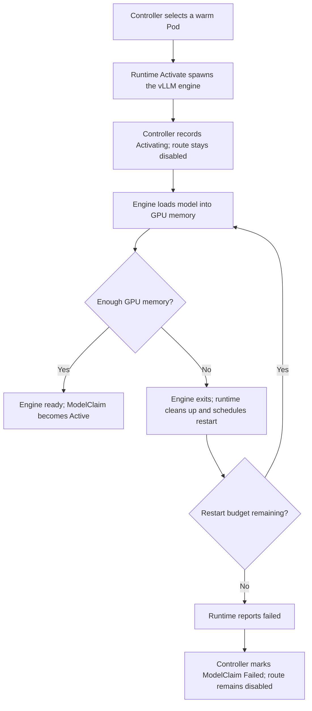
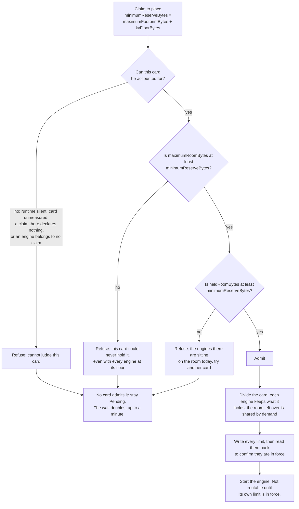

# [Issue #2744] [Feature] Check free GPU memory before ModelClaim activation

source: https://github.com/vllm-project/aibrix/issues/2744
state: open | updated: 2026-09-23T21:12:24Z
labels: triage/needs-information, kind/feature, area/website, area/runtime, area/installation, area/orchestration

## 正文

### 🚀 Feature Description and Motivation

### Problem
Previously, ModelClaim ranked warm Pods using their observed free HBM but did not check whether a Pod had enough memory to start the requested model. A Pod with a cached artifact could be selected even when its free HBM was too low.
If the engine encountered GPU OOM while loading the model, `Activate` could already have returned after spawning the process. The model remained non-routable while the runtime retried it on the same Pod. After the restart budget was exhausted, the runtime and ModelClaim reported a terminal failure; placement did not automatically try another Pod.

### Solution
Add optional spec.requiredHBMBytesPerGPU, expressed in bytes. When set, placement filters out Pods whose runtime snapshot has no GPU memory observation or whose available HBM is below the requested amount before applying artifact locality and load ranking. For multi-GPU placement, the existing snapshot summary uses the least free HBM across the required GPU group.
Claims that omit the field retain the previous placement behavior. If no Pod has confirmed sufficient capacity, the claim waits for a later reconciliation instead of calling Activate. The API schema, generated clients, tests, and ModelClaim documentation are updated.
This is a placement precheck, not a memory reservation. Concurrent activations and later KV usage can still change available HBM.

### Use Case

No response

### Proposed Solution

_No response_

### Area

Not sure

## 评论 (4)

### github-actions[bot] · 2026-09-17

<!-- aibrix-bot-needs-info -->
Please complete these required sections: `Feature Description and Motivation`.

### github-actions[bot] · 2026-09-17

<!-- aibrix-bot-guide -->
Thanks for contributing to AIBrix! Please review the [contribution guide](https://github.com/vllm-project/aibrix/blob/main/CONTRIBUTING.md) and make sure this issue contains enough context for maintainers to reproduce or evaluate it.

### Zeyu-ZEYU · 2026-09-21

**Update:** the field names below are the earlier byte-count ones. The shape is settled, and the comment below says where it landed.

Hi @jiangxiaobin96, thanks for filing this. We have been working on the same
problem under #2290, and we would rather combine the two efforts than land a
competing PR. Below is where we ended up and why, so we can settle the field
shape between us.

For context, we opened #2647 against this on 1 September, and the review there
is what pushed us into the rework described below. That PR now carries the
first part of it, so there is a diff to read alongside this comment rather than
a proposal on its own. The design below is the whole of where it goes, and the
section at the end says which part is in the PR today.

## The problem, as we see it

The controller picks a pod, spawns the engine, and only finds out the model
does not fit when the engine runs out of memory. By then the claim has spent
its restart budget on that one pod. So placement has to answer "will this fit"
before `Activate`. The hard part is deciding what "fit" means.

Free HBM is the obvious candidate, and it is the one that caught us out. Free
memory is not room. It is only memory nobody has touched yet. It does not
include memory already promised to an instance whose engine is still loading,
and on our pool an engine takes tens of seconds to get there. It also moves
with traffic once the engine is serving. @varungup90 raised exactly this as the
first blocker on the first version of #2647.

## What we add

Two figures are declared by the user, because neither can be derived from the
artifact. Everything else the control plane works out for itself.

| Name | Source | What it is |
|---|---|---|
| `perGPU.maximumFootprintBytes` | declared | Non-KV memory one instance holds on a device: weights, captured CUDA graphs, activation workspaces, allocator retention. |
| `perGPU.kvFloorBytes` | declared | The KV cache one instance must keep to serve at all. |
| `hbmUsableBytes` | measured by the runtime | NVML v2 total, less what the driver reserves. Per card, measured once. |
| `kvUsedBytes` | read from kvcached | The KV an engine has actually mapped, pages in use and reserve together. |
| `minimumReserveBytes` | derived | `maximumFootprintBytes + kvFloorBytes`. What one instance takes and does not give back while it is awake. |
| `maximumRoomBytes` | derived | `hbmUsableBytes` less every recorded instance's `maximumFootprintBytes + kvFloorBytes`. The most this card could ever offer. |
| `kvHeldBytes` | derived, per engine | `max(kvFloorBytes, kvUsedBytes)`. What an engine keeps whatever else happens, because lowering a KV limit evicts nothing. |
| `heldRoomBytes` | derived | `hbmUsableBytes` less every recorded instance's `maximumFootprintBytes + kvHeldBytes`. What this card can offer right now. |

Nothing here reads free memory. An instance is charged from the moment it is
recorded in `status`, not from the moment its engine gets around to allocating,
so an activating instance is never invisible to the next admission.

## The decision

## Why two figures and not one

The two gates ask different questions, and they need different inputs.

`maximumRoomBytes` asks whether the card could ever hold the model. It uses the
floor, because the floor is the least an engine can be squeezed to. A card that
fails this gate will never take the model, however long the claim waits.

`heldRoomBytes` asks whether the card can hold the model today. It uses what
each engine has actually mapped, because lowering a KV limit does not evict a
mapped page. A card that fails only this gate is worth trying again later.

One figure can express the first question or the second, but not both. It also
cannot say which part of a model's memory is squeezable. That distinction is
what lets the control plane later divide a card between the engines on it,
rather than leaving every engine at its floor with the remainder unspent.

## What we have verified

One H20, measured at 95.33 GiB usable, two 1.5B models each declaring a 30 GiB
footprint and a 10 GiB floor. This was a run with the whole design applied, not
with #2647 alone.

- Both are admitted. Each engine comes up with its allocator holding about
  76 GiB, and is pulled down to 17.67 GiB before it is made routable.
- The two footprints and the two KV limits come to 95.33 GiB exactly, so
  nothing is promised twice and nothing is left unspent.
- A third claim of the same size is refused at the first gate, with a message
  naming the roomiest pod that still could not hold it.
- Deleting one claim gives its room back to the other within a few seconds,
  without that claim being touched.

## A question back

How do you expect users to arrive at a value for `requiredHBMBytesPerGPU`?

We ask because our shape wants the same total, split in two. Declaring more
than an instance needs wastes room and is safe, while declaring less is not. A
rough upper bound from one run is therefore enough, and no precise measurement
is needed. If your users already have a way to reach that number, splitting it
into the two parts should be a small extra step. If they do not, then that
difficulty is one our shape shares, and it is worth solving together before
either field lands.

Separately, @varungup90 suggested `resource.Quantity` (`40Gi`) over raw bytes
on #2745. We agree it reads better for a field that has to be filled in by
hand. Two things give us pause about doing it in this one field. Nothing else
in the repository's API uses `resource.Quantity` yet, and no CRD here uses CEL,
which is what a positive-value check would need once the schema type becomes a
string. The figures this is compared against are also raw bytes: what the
runtime measures for a card, what kvcached reports, and the limit recorded in
status. Changing only the spec would split the units, and an operator checking
a limit against a floor would convert in their head.

Our preference is to move the whole ModelClaim API over in one follow-up rather
than make this one field the exception. We are happy to be overruled on that.

## How would you like to proceed?

We would like to avoid two open PRs for one field, and we are happy either way:

- You take this shape into #2745, and we review and help.
- #2647 carries it, you review, and #2745 closes.
- Something in between, if you see a third shape that covers both.

Whichever it is, only one of the two should carry the field. #2647 today has
the declaration, the account and the first gate, and nothing that writes a KV
limit. The held-room gate and the dividing come in three later changes, so
there is no need to take the whole line of work to settle this one.

cc @Jeffwan @varungup90, since this settles a `v1alpha1` field shape.

### Zeyu-ZEYU · 2026-09-23

An update after talking this through with @jiangxiaobin96. We agreed to keep
this issue, to not pursue #2745, and to land the two-figure design in #2647,
which now resolves this issue.

What #2647 does, in short:

- A claim declares `perGPU.maximumFootprint` and `perGPU.kvFloor` as
  quantities, such as `30Gi` and `10Gi`. `perGPU` is optional. A claim without
  it is accepted and not placed, and its `Scheduled` condition reads
  `InvalidPerGPU`.
- Placement keeps an account per card instead of reading free HBM. A model is
  admitted only where the card could ever hold it and can hold it now, which
  covers the case this issue describes: a pod with a cached artifact and too
  little memory is no longer chosen.
- When a model lands, the card is divided between the engines on it, and every
  new limit is confirmed before the model starts. An engine is routable only
  while it is held to its limit.

The commits that declare the per-GPU cost and admit against it are co-authored
with @jiangxiaobin96, since #2745 took that step first. Thank you for filing
this, and for working it out together.

The follow-ups, such as dividing a card again when its engines change and
backing off from a claim that cannot be placed, will be tracked under #2290.
