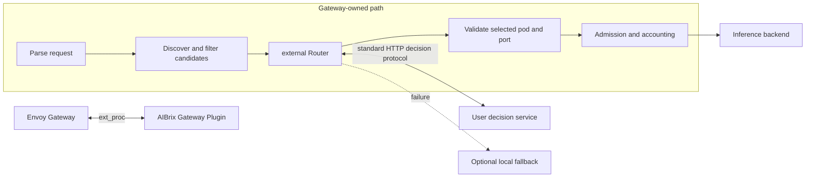
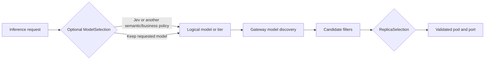
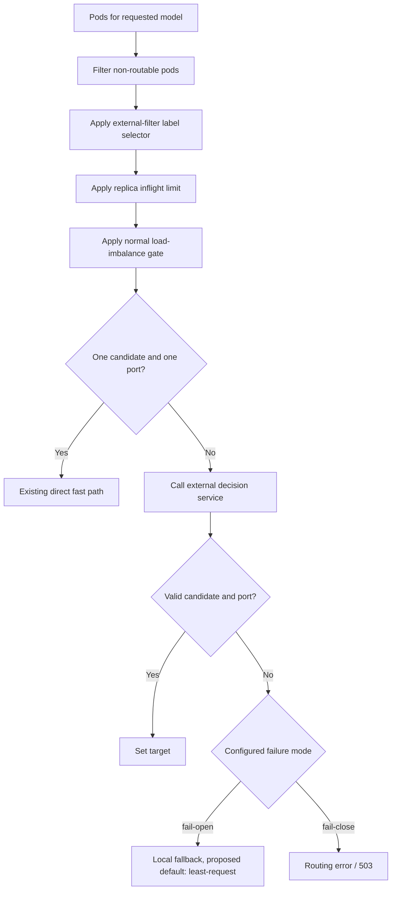

# [Issue #2826] [RFC]: Support external routing decisions in the Gateway plugin

source: https://github.com/vllm-project/aibrix/issues/2826
state: open | updated: 2026-09-27T07:59:33Z
labels: area/gateway, kind/feature, area/website, area/installation

## 正文

Area: **Gateway**

## Summary

I'd like to get feedback on an optional `external` routing strategy for the AIBrix Gateway plugin.

Today the Gateway ships multiple in-process routing algorithms. They work well for common policies, but users with domain-specific scheduling logic must add that logic to the Gateway codebase. The proposal is to keep discovery, health filtering, admission, accounting, and target validation inside AIBrix while allowing a user-operated HTTP service to select one target from an AIBrix-provided candidate set.

This issue is for design discussion. Before writing code, I'd like to settle the extension point, protocol, security boundary, and failure behavior with the community.



## Motivation

Different deployments may need routing policies that are too environment-specific to become built-in Gateway algorithms, for example:

- Jev-style semantic routing that selects a model tier from request difficulty and confidence;
- proprietary cost, topology, or accelerator-aware placement;
- internal policies based on tenant tier, geography, SLA, cost center, compliance, or experiment cohort;
- routing based on telemetry maintained by another control plane;
- rapid algorithm iteration without rebuilding the Gateway plugin;
- integration with an existing organization-wide scheduling service.

An out-of-process decision service gives users this flexibility, but it also places a network call on the routing hot path. AIBrix therefore needs a narrow and standardized contract with explicit latency, validation, security, and fallback semantics rather than a generic webhook that can mutate arbitrary request state.

The closest related issues I found are:

- #1803, which added `external-filter` label filtering before routing;
- #868, which established the current pluggable `Router`, `RoutingContext`, and `PodList` abstractions;
- #1858, which discussed external load balancing and multi-port data-parallel endpoints.

None of them defines an out-of-process target-selection protocol for the Gateway.

Jev is a current example of why an external decision boundary is useful. Its [model-routing example](https://jev-agent.com/use-cases/llm-model-routing) classifies a request before choosing a model tier, and [LiteLLM's auto-routing documentation](https://github.com/BerriAI/litellm-docs/blob/main/docs/proxy/auto_routing.md) includes Jev among its classifier options. That decision happens earlier than AIBrix's current pod router and usually needs request text or a semantic representation. The RFC should distinguish that use case from selecting a replica after the model is already known.

## Proposed Change

### 1. Separate model selection from replica selection

There are two possible extension points:



- `ModelSelection` runs before model discovery and may choose a logical model, tier, or serving pool. Jev-style routing belongs here.
- `ReplicaSelection` runs after model discovery and chooses one pod and port from a Gateway-filtered candidate set. The current `types.Router` interface belongs here.

The concrete v1 protocol below covers `ReplicaSelection`. It must not claim direct Jev support because the hook runs after model selection and excludes raw prompts. The community should decide whether this RFC should also define `ModelSelection`, and whether that hook can receive explicitly opted-in prompt text, an upstream-derived semantic feature, or only trusted policy attributes.

### 2. Add a standalone `external` Router

The first version would implement the existing `types.Router` interface. It would not implement `PodScorer`, so it would be selected as a standalone strategy and would not participate in weighted combinations such as `external:1,prefix-cache:2`.

The existing request path would remain authoritative:



The external service would not be allowed to:

- introduce an arbitrary IP address or URL;
- bypass Gateway health, label, or inflight filtering;
- mutate the inference request or response;
- receive raw prompts, request bodies, authorization headers, or arbitrary client headers;
- replace PD or SLO routing in the initial version.

The request may include a bounded `policyContext` populated from operator-approved sources. This lets an internal service use business attributes such as tenant tier, workload class, region, compliance zone, or cost center without receiving arbitrary headers or credentials.

### 3. Use one operator-configured endpoint

The proposed v1 scope uses one Gateway-level endpoint configured by the operator. A client request cannot provide or override the URL. This avoids SSRF, unbounded connection pools, and per-request trust decisions.

Tentative defaults for discussion:

| Setting | Proposed default |
|---|---:|
| HTTP decision timeout | `10ms` |
| Failure mode | `fail-open` |
| Local fallback | `least-request` |
| Maximum external inflight requests | `256` per Gateway replica |
| Maximum request / response size | `1MiB` / `64KiB` |
| Consecutive failures before opening circuit | `5` |
| Circuit open duration | `1s` |

The HTTP client would reuse connections, propagate cancellation, disable redirects and compression, and never retry automatically. A non-blocking bulkhead and per-replica circuit breaker would prevent an unavailable decision service from consuming Gateway resources.

### 4. Standardize the wire protocol

The protocol would use its own DTOs instead of serializing internal Go or Kubernetes objects. The proposed **AIBrix External Routing Protocol v1** would have an OpenAPI 3.1 schema.

Proposed media type:

```text
application/vnd.aibrix.external-routing+json;version=1
```

Example request:

```json
{
  "apiVersion": "routing.aibrix.ai/v1",
  "kind": "RoutingDecisionRequest",
  "metadata": {
    "requestId": "req-123"
  },
  "spec": {
    "decisionType": "ReplicaSelection",
    "model": "llama-3",
    "requestPath": "/v1/chat/completions",
    "stream": true,
    "promptBytes": 1024,
    "policyContext": {
      "attributes": {
        "tenantTier": "gold",
        "workloadClass": "interactive",
        "region": "cn-east"
      }
    },
    "candidates": [
      {
        "id": "default/llama-3-abc",
        "address": "10.0.1.12",
        "ports": [8000],
        "labels": {
          "model.aibrix.ai/name": "llama-3"
        },
        "metrics": {
          "runningRequests": 4,
          "engineUtilization": 0.61,
          "kvCacheUsage": 0.48
        }
      }
    ]
  }
}
```

Example response:

```json
{
  "apiVersion": "routing.aibrix.ai/v1",
  "kind": "RoutingDecisionResponse",
  "metadata": {
    "requestId": "req-123",
    "decisionId": "decision-456"
  },
  "status": {
    "target": {
      "id": "default/llama-3-abc",
      "port": 8000
    }
  }
}
```

Key protocol rules:

- only `200 OK` represents a valid decision;
- v1 `decisionType` is `ReplicaSelection`; model selection needs a separate kind or protocol version;
- the response must echo `requestId`;
- target identity is `namespace/name` and must be in the supplied candidate list;
- a returned port must belong to that candidate;
- optional unavailable values are omitted rather than sent as `null` or zero;
- candidate order has no preference semantics;
- unknown fields are ignored, while missing or invalid required fields are rejected;
- non-finite metrics are omitted and utilization values use the range `[0,1]`;
- `policyContext.attributes` is an optional, size-bounded string map populated only from operator-allowlisted trusted sources;
- protocol errors may use RFC 9457 Problem Details, but their body is never forwarded to the inference client;
- additive optional fields are compatible within v1; required-field, type, unit, or semantic changes require a new protocol version.

The full proposal would publish `docs/api/external-router-v1.openapi.yaml` as the machine-readable contract and use its examples as conformance fixtures.

### 5. Validate every decision inside Gateway

The Gateway would construct a lookup table from the exact candidate slice sent in the request. It would accept only a matching candidate ID and discovered port, then call the existing `RoutingContext.SetTargetPod` and `SetTargetPort` methods. A response-provided address would never be accepted.

### 6. Make behavior observable

The proposed metrics cover decision outcomes, decision duration, fallback reasons, inflight calls, and circuit state. Labels would use fixed enumerations only; endpoint URLs, request IDs, decision IDs, models, and pod names would not be added as labels.

## Performance and Feasibility

This can work when the service is deployed close to Gateway, but it adds a synchronous HTTP exchange before the inference request is forwarded. The proposal limits that cost with:

- a short configurable deadline, proposed default `10ms`;
- persistent connections and no retries;
- a compact DTO instead of Kubernetes Pod serialization;
- bounded request and response sizes;
- a non-blocking bulkhead and circuit breaker;
- the existing single-candidate fast path;
- configurable fail-open behavior.

Benchmarks should cover at least 8, 32, and 128 candidates and report payload size, allocations, and latency. A later transport such as gRPC, HTTP/2, or a Unix domain socket could retain the same decision semantics if HTTP/JSON is not sufficient.

## Questions for the Community

1. Should this RFC cover only `ReplicaSelection`, or also define the earlier `ModelSelection` hook needed by Jev-style routers?
2. If model selection is in scope, may it receive opted-in prompt text, or only derived semantic features and trusted business attributes?
3. Is a terminal target selector the right replica-selection abstraction, or should the service return per-candidate scores for multi-strategy composition?
4. Which internal attributes should Gateway expose, and should `policyContext` be an allowlisted map or a fixed typed schema?
5. Should the single-candidate fast path bypass external policy, or should strict deployments be able to require a call?
6. Is one Gateway-level endpoint sufficient for v1, or is per-model configuration required initially?
7. Is HTTP/JSON the right first transport?
8. Which request features and pod metrics are necessary without exposing prompts or making routing too expensive?
9. Should fail-open with `least-request` be the default, or should fallback require explicit opt-in?
10. Are the proposed timeout, bulkhead, and circuit-breaker defaults reasonable?
11. What authentication should v1 require: bearer token, mTLS, Kubernetes identity, or deployment-level NetworkPolicy?
12. Should OpenAPI 3.1 be the normative protocol schema?
13. Should the first protocol version be `v1` or `v1alpha1`?


## 评论 (2)

### github-actions[bot] · 2026-09-27

<!-- aibrix-bot-needs-info -->
Please complete these required sections: `Proposed Change`.

### github-actions[bot] · 2026-09-27

<!-- aibrix-bot-guide -->
Thanks for contributing to AIBrix! Please review the [contribution guide](https://github.com/vllm-project/aibrix/blob/main/CONTRIBUTING.md) and make sure this issue contains enough context for maintainers to reproduce or evaluate it.

