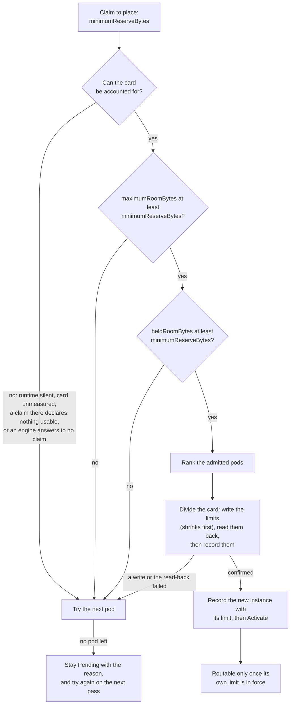

# [PR #2647] [API][Docs] Place a ModelClaim only where its card has room, and hold each engine to its share

source: https://github.com/vllm-project/aibrix/pull/2647
state: open | updated: 2026-09-24T19:38:20Z
labels: kind/documentation, area/testing, area/website, area/runtime, area/installation, area/orchestration

## 正文

## Pull Request Description

The controller picks a warm pod and starts the engine, and only finds out that
the model does not fit when the engine runs out of memory. By then, the claim
has spent its restart budget on that one pod, and placement does not try another.
When several models share a card, nothing divides it between them either. Each
engine starts under whatever limit its own KV allocator chose, which is most of
the card.

This PR makes placement answer "does it fit" before `Activate`, and makes the
answer hold afterwards. A claim declares what one instance costs on a GPU. The
controller keeps an account per card, and admits a model only where the account
shows room. When the model lands, the card is divided between the engines on
it, and each engine stays routable only while it is held to its share.

### What a claim declares

```yaml
spec:
  perGPU:
    maximumFootprint: 30Gi   # non-KV memory one instance holds on a device
    kvFloor: 10Gi            # the KV one instance needs to serve at all
```

Neither figure can be derived from the artifact. Most of the gap between an
artifact and what an engine holds is allocator retention, which does not scale
with the weights. Declaring more than an instance needs wastes room and is
safe. Declaring less is not.

`perGPU` is optional in the schema. A claim without it, or with a figure that is
not positive, is accepted and not placed. Its `Scheduled` condition reads
`InvalidPerGPU` and names the figure. When `perGPU` is given, both figures are
required.

The field is optional so that a claim stored before it existed stays valid. A
required field would make the API server refuse every update to such a claim
except to its status. Without CRD validation ratcheting, which is on by default
only from Kubernetes 1.30, that includes removing the controller's finalizer,
so the claim could not be deleted. An engine that such a claim already runs
keeps its route, and its card is left unaccountable until the claim declares
its cost.

### What the control plane works out

| Name | Source | What it is |
|---|---|---|
| `hbmUsableBytes` | runtime | NVML v2 total, less what the driver reserves. A multi-GPU pod is sized by its smallest card. |
| `kvUsedBytes` | runtime | The KV an engine has mapped in kvcached, pages in use and in reserve. |
| `minimumReserveBytes` | derived | `maximumFootprint + kvFloor`. What one instance takes and does not give back while it is awake. |
| `kvHeldBytes` | derived, per engine | `max(kvFloor, kvUsedBytes)`. Lowering a KV limit evicts nothing, so an engine keeps at least this. |
| `maximumRoomBytes` | derived | `hbmUsableBytes` less every recorded instance's `maximumFootprint + kvFloor`. The most the card could ever offer. |
| `heldRoomBytes` | derived | `hbmUsableBytes` less every recorded instance's `maximumFootprint + kvHeldBytes`. What the card can offer now. |
| `kvLimitBytes` | derived, per engine | `kvHeldBytes` plus its part of what is left over. Recorded in `status.instances[].kvLimitBytes`. |

Nothing here reads free HBM. An instance is charged from the moment it is
recorded in `status`, so an engine that is still loading is never invisible to
the next admission. The snapshot covers the other direction: a live engine that
no recorded instance answers for makes its card unaccountable.

A pod is accounted for if it requests `nvidia.com/gpu` or its runtime reports
GPUs. The second covers GPUs from a dynamic resource claim.

### How a model is placed



The first gate asks whether the card could ever hold the model, with every
engine squeezed to its floor. A card that fails it will not take the model,
however long the claim waits. The second gate asks whether the card can hold
the model now. Lowering a limit does not evict a mapped page, so a card whose
room is held by the engines on it fails the second gate and not the first.

The division keeps each engine's `kvHeldBytes`, and shares out the rest by
demand. An engine's weight is one plus its running and waiting requests, with
the requests capped at four, as the pool policy caps them. The limits spend the
card exactly, so an engine that grows into its new limit cannot grow into a
neighbour's memory. Shrinks are written before grows. A write alone proves
nothing: kvcached's CLI exits 0 even when the segment does not exist. So the
limits are read back from a fresh snapshot. Only then are they recorded on the
claims, with the new instance last. A division that fails part way changes no
record.

Ranking uses the same account. A pod that already has the artifact ranks first.
Every ranked pod has passed both gates, so the choice is between cards that all
fit, and a cached artifact saves the download. Next comes the roomiest card by
`maximumRoomBytes`, which does not move with traffic. On the roomiest card, the
neighbours give up the least when it is divided. Free HBM and the older
tie-breakers only break ties.

### Holding each engine to its limit

An engine becomes routable only when the limit in its segment is the one its
instance records. It stays routable only while that limit is no larger than the
record. An engine held to more, as when a restart puts its allocator's default
back, is taken off the route with a `KVLimitNotHeld` Event. It is pulled back to
its record, and then routed again.

An instance is recorded before its engine starts, so the account charges it at
once. Sometimes the runtime then has no engine for it, for example if the
controller stopped between the two steps. The controller then starts the engine
again. This is safe, because the runtime starts a model only once. If the start
fails, the instance is dropped and the card is freed.

The health loop always shrinks an engine to its record. It grows an engine only
while the engine is off the route. A larger record for a serving engine comes
from a division whose writes have not all landed, and growing it outside that
order could hand it memory that a neighbour has not given back.

The `reclaim` policy of the pool annotation stands down on any pod where a claim
records a limit, since two writers on one allocator would only overwrite each
other. The feature page marks `reclaim` as superseded.

### What an operator sees

A refusal names the roomiest pod that still could not hold the model, the gate
it failed, and that card's account:

```
no warm pod can hold this model, which needs 40.0 GiB on a card:
warm-runtime-pool-zeyu-69846d7fdf-nxk2t can offer at most 15.3 GiB, even with
every engine on it at its floor (the card holds 95.3 GiB, and 80.0 GiB of it is
promised to 2 instance(s))
```

The cards are blamed only when they are the reason. With no candidate at all, or
with the model already on every candidate, the message stays the generic one,
so an operator is not sent to look at GPU memory. `Scheduled` is set to `True`
with reason `Placed` once an instance is recorded. The Events are
`InvalidPerGPU`, `NoMatchingPods`, `KVLimitSet` (on the claim of each engine a
division moved), `KVLimitFailed` and `KVLimitNotHeld`. A refusal Event is
raised only when the refusal changes.

### Checked on hardware

This branch as it stands ran on one H20, which the runtime measures at 95.33 GiB
usable. Two 1.5B models each declared `maximumFootprint: 30Gi` and
`kvFloor: 10Gi`.

- kvcached started the first engine at 80.0 GiB. It was held to 65.3 GiB, the
  card less its footprint, before it was routable.
- When the second model arrived, the first engine was held to 17.7 GiB and read
  back before the second was recorded. It kept its route throughout. The second
  engine was pulled from 80.0 GiB to 17.7 GiB before it was routable. The
  footprints and the limits came to 95.33 GiB exactly.
- A third claim of the same size was refused with the message above. It was
  tried again every 10 seconds, and no engine was started for it. After the
  first claim was deleted, the third was placed within a few seconds of the
  first engine exiting.
- A 21.7 GiB limit was written into a serving engine behind the controller's
  back. The engine was taken off the route, pulled back to 17.7 GiB, and routed
  again within about 2 seconds. Its neighbour was untouched.
- A claim with no `perGPU`, and one with `kvFloor: "0"`, were both accepted and
  never placed, with one `InvalidPerGPU` Event each. A `perGPU` without its
  `kvFloor` was refused by the API server.
- An engine was stopped through the runtime, without the controller. The
  controller started it again 4 seconds later. The new engine came up at
  80.0 GiB and was pulled down to its record of 17.7 GiB. Only then was it
  routed, 48 seconds after the stop. Its neighbour kept its route.

The integration suite runs the real controller against a real API server. Its
ten ModelClaim specs include a claim with no `perGPU`.

### What this PR does not do

The first two are the next PRs under #2290, each with its own issue.

- The card is divided only when a model is placed on it. When a model leaves,
  its room waits for the next model placed on that card. Dividing a card again
  on a timer, and whenever the engines on it change, is online KV budgeting.
- A claim that cannot be placed is tried again every 10 seconds, whatever the
  reason. Backing off, and saying when no card could ever hold the model, is
  the PR after that.
- An engine starts under its allocator's own default, and it is pulled down
  once it is ready (#2770). It is not routable before then, so it takes no
  traffic, but nothing stops it from mapping more while it loads.
- Sleeping does not free a seat. An instance that is asleep keeps its place in
  the account at its full declared cost, because the assignment has to survive
  the sleep for a wake to find its engine again.
- The declaration is trusted. Checking it against what an engine actually uses
  needs `hbm_peak_bytes`, which reads 0 today. NVML reports host PIDs, and the
  runtime walks the container's process tree.

## Related Issues

Resolves: #2744
Part of #2290
Related: #2770

Supersedes #2745, as agreed with @jiangxiaobin96, who co-authored the commits
that declare the per-GPU cost and admit against it.


## 评论 (8)

### Jeffwan · 2026-09-01

/cc @varungup90 

### varungup90 · 2026-09-01

### **Blockers**

#### **1. In-flight activations are invisible to admission**

`Activate()` spawns the engine, but vLLM takes ~20s on download/profiling/CUDA graphs before NVML `hbm_free_bytes` reflects the memory drop. Because controller-runtime processes reconciles sequentially, Claim B runs immediately after Claim A's `Activate()`. Claim B sees Claim A’s `Activating` instance in `computePodLoad`, but still admits Claim A's pod because NVML hasn't updated yet.

* **Fix:** After `collectPlacementStates`, debit `footprint + FloorBytes` from `HBMFreeBytes` for each `Activating` instance on that pod based on `status.instances`. Only rely on pure NVML for `Active` instances to prevent double-counting.

#### **2. `Scheduled=False` persists after a successful placement**

`Scheduled` is only written in the select-failure path as `False` (e.g., `InsufficientCapacity`). After recovering from an `InsufficientCapacity` state, a subsequent reconcile that successfully binds a pod leaves `Scheduled=False` / `InsufficientCapacity` attached to an `Active` claim.

* **Fix:** Set `Scheduled=True` when `ensureActivated` appends an instance (or when desired replicas are met), or clear/derive it dynamically in `recomputeReadiness`.

#### **3. Footprint shrinkage, topology blindness & unit mismatch in multi-GPU (TP/PP)**

* **Footprint Shrinkage:** `engine_hbm_peak_bytes` is an instantaneous process reading, not a high-water mark. `recordObservedFootprint` currently overwrites this value on every snapshot. Idle allocator page returns or kvcached vs. NVML skews will shrink stored size, causing subsequent scale-ups to pass `podFits` with inadequate headroom.
* **Fix:** For a given `ArtifactURL`, keep `max(existing.Bytes, footprint)`.


* **Topology/Config Blindness:** Matching footprints strictly by `ArtifactURL` ignores changes in `TP`/`PP` topology or engine configs (which alter CUDA graphs and memory retention). Reusing a per-GPU footprint measured under `TP=2` for a `TP=1` deployment of the same model will under-reserve memory and cause an OOM.
* **Fix:** Key or validate stored observed footprints against a configuration fingerprint (artifact URL + TP/PP topology + engine flags), not just the `ArtifactURL`.


* **Multi-GPU Unit Mismatch:** In `placementStateFromSnapshot`, `HBMPeakBytes - KVUsedBytes` subtracts the entire engine's `KVUsedBytes` from a per-GPU `HBMPeakBytes`. On multi-GPU setups (TP/PP > 1), this understates the per-rank non-KV cost.
* **Fix:** Avoid using this calculation as a hard admission filter when `len(accelerators) != 1` until both metrics share the same per-device scope.


#### **4. Silently bypassing admission checks & applying unestablished floors on multi-GPU pods**

* **Bypassing Admission Checks:** In [[snapshot.go](https://github.com/vllm-project/aibrix/pull/2647)](https://github.com/vllm-project/aibrix/pull/2647), when reported accelerator counts do not match `parallelism`, `placementStateFromSnapshot` early-returns before computing `MaxFootprintBytes`. This leaves `MemoryKnown = false`, which triggers the "missing info admits" fallback and silently disables HBM checks for multi-GPU models most susceptible to OOMs.
* **Fix:** Ensure accelerator count mismatches do not silently drop `MemoryKnown` into an unconditionally admitted state without explicit fallback handling or surfacing a warning state.


* **Unapplied Multi-GPU KV Floor:** `poolFloorBytes` adds a KV floor for every candidate pod during placement, even though the pool policy controller explicitly skips snapshots for multi-GPU pods (`len(accelerators) != 1`). A TP/PP pool can trigger `InsufficientCapacity` based on a floor guarantee the controller never actually establishes.
* **Fix:** Apply the same single-GPU eligibility check (`len(accelerators) == 1`) when resolving the placement floor.


---

### **Missing Test Coverage**

* **Reconcile Invariants:** Add a reconcile-level test asserting that when a pod has `MemoryKnown` and `HBMFreeBytes < footprint`:
1. Sets `Scheduled=False` / `InsufficientCapacity`
2. Does **not** call `Activate`
3. Does **not** flip the claim to `Failed`


* **Concurrency Debit:** Add a test verifying that debiting an `Activating` instance on a neighboring claim prevents a second consecutive reconcile loop from selecting the same pod.

---

### **Non-Blocking Nits**

* **Documentation Conflict:** The troubleshooting doc mentions `status.observedFootprint` is "the size being reserved," which contradicts earlier documentation stating it is not a reservation. Clarify that it represents the *size used for the fit check*.
* **Limitations Addendum:** Note in the PR's "Known Limitations" that brand-new, unmeasured models use the largest candidate footprint as a stand-in, meaning a large model introduced into a pool of small models may still fail-open.

### Jeffwan · 2026-09-04

after reviewing the api change, I feel it's a little bit weird. why do you embed artifact to footprint status? this doesn't seem reasonable

### Zeyu-ZEYU · 2026-09-21

**Update:** the scope below is out of date. This PR now also divides the card and holds each engine to its limit. See the description, and my reply further down.

I have reworked this rather than closed it, and the diff you reviewed is gone.
@varungup90, your three blockers are the reason the design changed, so here is
where each of them went. Thank you both for the time you put into the first
version.

**1. In-flight activations are invisible to admission.** Fixed, by a different
route than the one suggested. We no longer read free HBM at all, for placement
or for anything else. Placement keeps a per-pod account instead: what the
runtime measures the card can hold, less what is already promised to the
instances recorded in `status`. An instance is charged from the moment it is
recorded rather than from the moment its engine gets around to allocating, so
an activating engine is never invisible to the next admission.

**2. `Scheduled=False` persists after a successful placement.** Fixed. The
condition is set to `True` with reason `Placed` when an instance is recorded,
naming the pod it landed on.

**3. Footprint shrinkage, topology blindness, and the multi-GPU unit
mismatch.** These are gone rather than fixed. The controller no longer measures
or stores a footprint anywhere. `status.observedFootprintBytes` is removed, and
with it the artifact-keyed reuse, the high-water-mark question, and the
per-device versus whole-engine unit mismatch. A claim declares its per-GPU cost
in `spec` instead.

@Jeffwan, that last point is what your "let's hold the api change" was pointing
at. Nothing measured is embedded in status any more. The new field is two
figures in `spec`, and the description above sets out what they are and how
placement decides from them.

It does overlap with @jiangxiaobin96's #2744 and #2745, which propose a single
`requiredHBMBytesPerGPU` filtered against observed free HBM. We are raising the
difference on that issue, and we would rather the two of us settle the field
shape before either version lands.

## Scope

This is the first of four changes. It decides whether a card can hold a model,
and refuses the card when it cannot. It does not yet hold an engine to a limit,
so the account is a reservation in the control plane and not in the hardware:
nothing here stops an engine already on the card from growing its KV cache into
the space held for another instance. That is the next change, and the page says
so rather than leaving it to be discovered.

### Zeyu-ZEYU · 2026-09-23

Thanks for the second pass. Both blockers are addressed, and the shape question
is settled on #2744. @jiangxiaobin96 and I agreed to keep the two figures, to
not pursue #2745, and to carry the whole placement flow here. That changed the
scope of this PR, which is also the answer to your first design point: it now
divides the card and holds every engine to a limit, so the two figures are used
apart. The description is rewritten to match. Point by point below.

## Blockers

**1. Snapshot engines with no status row.** Fixed. The ledger takes the
snapshots as well as the status rows. Status stays the source for an instance
whose engine has not started. The snapshot is the source for engines nobody
claimed: a live engine that no recorded instance answers for makes the card
unaccountable, and the claim tries the next pod. A dead engine does not, since
its memory is back with the card.

The reconcile test you asked for is
`TestReconcileRefusesACardRunningAnEngineNoClaimAnswersFor`: an engine in the
snapshot, no matching `status.instances`, and the second claim is not placed.
The ledger cases are `TestLedgerHasAHoleWhenAnEngineAnswersToNoClaim`,
`TestLedgerAcceptsACardWhoseEnginesAllAnswerToAClaim` and
`TestLedgerIgnoresAnEngineThatIsNoLongerAlive`.

**2. The API shape while #2744 was open.** Settled on #2744 first, as you
asked. The fields are `resource.Quantity`, and `perGPU` is optional, with
fail-closed placement for that claim, as you suggested.

You were right that `required` does not fix the upgrade window, and it is worse
than that. I checked on the repo's envtest API server, which is Kubernetes 1.29
without validation ratcheting. A claim stored before the field existed can
still have its status updated, but every other update is refused with
`spec.perGPU: Required value`. That includes removing the controller's
finalizer, so deleting the claim hangs until someone adds a declaration. With
the field optional, such a claim stays valid. The controller does not place it,
reports `InvalidPerGPU` on `Scheduled`, and leaves an engine it already runs on
its route. The integration suite now creates a claim with no `perGPU` against a
real API server, and checks that it is accepted and never placed. A `perGPU`
that is given still has to carry both figures.

The godoc's "divide the card" is accurate now, since this PR does divide it.

## Design improvements

**1. One number until the second gate exists.** The second gate and the
division are both here now, so the figures are used apart.
`maximumRoomBytes` charges every instance its floor. `heldRoomBytes` charges
`max(kvFloor, kvUsedBytes)`, because lowering a limit evicts nothing. The
division keeps each engine's held KV, and it never touches a footprint. This is
the PR that divides the card, which is where you said the split belongs.

**2. `resource.Quantity`, and optional on the first landing.** Both done, see
blocker 2.

**3. Check the declaration after the first run.** Agreed, and not in this PR.
The signal it needs is missing: `hbm_peak_bytes` reads 0 for every engine,
because NVML reports host PIDs and the runtime walks the container's process
tree. Fixing that comes first. The check then goes on the #2290 roadmap, keyed
by the artifact, the TP/PP topology and the engine arguments, as you say.

**4. Rank with the same account.** Done. Among admitted pods, the roomiest card
by `maximumRoomBytes` wins, not free HBM. I kept one thing ahead of it: a pod
that already has the artifact ranks first. Every ranked pod has passed both
gates, so the choice is between cards that all fit, and the cached one saves
the download. Among the rest, the roomiest card is the one whose neighbours give
up the least when it is divided, so its read-back is the least likely to fail.
Free HBM and the older tie-breakers now only break ties. I did not switch to
packing. If you want best-fit, I will send it as a follow-up with a test that
shows the packing.

**5. Sleep does not free a seat.** On the feature page, close to your wording.

**6. One KV floor.** On a pod where a claim records a limit, the claim's floor
is the only floor. The pool annotation's `reclaim` stands down there, and the
feature page marks it as superseded. A card's KV is `hbmUsableBytes`
less every engine's footprint, divided as above, not a capacity typed into the
Deployment.

**7. Show the account.** The refusal carries it now, for example `the card
holds 95.3 GiB, and 80.0 GiB of it is promised to 2 instance(s)`, or `held by`
for the second gate. A status payload is more API surface, so I would rather
open it as its own issue on the #2290 roadmap than add it here. Tell me if you
would prefer it in this PR.

The four things you would not change are unchanged.

## Out of scope

Each of these gets its own issue and PR under #2290: dividing a card again on a
timer and whenever its engines change, backing off from a claim that cannot be
placed, faster readiness, and a 503 from the gateway for a claim that is not
placed yet.

@Jeffwan, the API change you held on 4 September is now two quantities in
`spec`, optional, and agreed on #2744. Could you take another look?

The CI workflows on this push are waiting for approval, since the branch is on a
fork. Could a maintainer approve them?

### cursor[bot] · 2026-09-23

Design and code review.

The admission model holds up. A claim declares what one instance costs on a GPU, the controller charges that cost from the moment the instance is recorded, and a card that cannot be measured is refused. Keep the two gates. `maximumRoomBytes` is whether the card could ever hold the model with every engine at its floor. `heldRoomBytes` is whether it can hold the model now, because lowering a limit does not evict a mapped page. Leaving `spec.perGPU` optional, and refusing a missing or non-positive declaration from the controller, is also the right compatibility choice. A required field would make a claim stored before this change undeletable on clusters without CRD validation ratcheting.

What does not hold yet is the order around a failed or crashed placement. A division writes the neighbours' new limits before it knows the plan succeeded, the health loop will not grow a serving engine back, and this PR removed the periodic redivision. A reservation written before `Activate` can also stick with no engine behind it. Details are on the lines below.

One snapshot per pod per reconcile is enough. `collectPlacementStates` reads through the 5-second cache, `freshSnapshots` reads again for the ledger, `arrangeCard` reads the winner once more, and `reconcileInstanceHealth` reads it again. The account is the reason the cache is bypassed. Use the fresh snapshot for the ledger, the rank, and the health check. `rankByRoom` copying `maximumRoomBytes` onto `PodPlacementState` goes away with that.

The spare-KV split in `planKVLimits` can stay. It spends the card exactly, and the completion term stays with the pool policy.

This still does not apply the limit before the new engine maps memory. The process starts under kvcached's default and is pulled down only after the segment exists. Until then it can map into a neighbour's share. That is the hole left for #2770. The account cannot make `Activate` safe while the limit is applied afterwards.

### Zeyu-ZEYU · 2026-09-23

Thanks for the review. I replied on each line. In short:

- Fixed: the reservation with no engine (0a34c3e5), recording limits after the
  read-back (d91bebb6), a fresh read and retry on conflict (77b74e27),
  `NoMatchingPods` only on change (bc841a9d), and pods whose runtime reports
  GPUs without requesting `nvidia.com/gpu` (fb5ec81a). Each fix has a test that
  fails without it.
- Not changed: routing on `KVUsedBytes`. An engine taken off the route may
  never shrink, so it may never come back.
- One snapshot per reconcile: agreed as a direction. Admission and the division
  already read fresh. The cached reading only feeds the artifact check and the
  tie-breakers. The online KV budgeting PR will merge the reads.
- #2770: agreed. The account cannot close that window.

All seven hardware tests pass on this head. A new one stops an engine behind
the controller's back. It checks that the engine is started again, held to its
limit, and routed.


### Zeyu-ZEYU · 2026-09-24

Two of the failed checks came from this PR. Both are fixed in the two new commits:

- Verify Generated Code: the per-GPU apply configuration is now the generator's own output.
- Installation E2E: the mock runtime reports one card with no memory, for the single-GPU pool policy. This PR took it for a GPU it could not measure, so the lifecycle test's claim was never placed. A card with no memory is no longer counted.

Python 3.11 failed in a batch test, which this PR does not touch. Python 3.10 was cancelled when 3.11 failed.

## Review (20)

### gemini-code-assist[bot] · 2026-09-01 · COMMENTED

## Code Review

This pull request introduces HBM capacity-aware placement for model claims by tracking the non-KV GPU memory footprint (ObservedFootprintBytes) of ready model instances and comparing it against candidate pods' free HBM and pool guaranteed KV floors. It also updates CRD schemas, documentation, and adds comprehensive unit tests. The feedback highlights a potential issue where updating Spec.ArtifactURL to a different model does not clear or update Status.ObservedFootprintBytes, which could lead to incorrect sizing and OOMs on the selected pod.

### Jeffwan · 2026-09-01 · APPROVED

thanks for the improvemnet

### Jeffwan · 2026-09-04 · CHANGES_REQUESTED

let's hold the api change 

### varungup90 · 2026-09-21 · CHANGES_REQUESTED

Thanks for the rewrite. The three blockers from the first version are actually gone: in-flight activations are charged from `status`, `Scheduled=True`/`Placed` is set on a successful bind, and the measured-footprint / topology / TP unit-mismatch problems disappeared with `status.observedFootprintBytes`.

I still want changes before this lands. The account has a hole of the same class as blocker 1, and the required two-field API should not be locked in while the shape is still in dispute with #2744.

## Previous blockers

| Earlier blocker | This version |
|---|---|
| In-flight `Activating` invisible to NVML | Charged from `status.instances` via a per-pod ledger; free HBM is no longer the admit signal |
| `Scheduled=False` stuck after a later success | `Scheduled=True` / `Placed` is set when the instance is recorded |
| Measured footprint shrink / topology / TP unit mismatch | `status.observedFootprintBytes` is gone; the claim declares cost instead |
| `MemoryKnown=false` fail-open | Unmeasured / silent / undeclared-neighbor pods are refused |

## Blockers on this version

### 1. Snapshot-resident engines with no status row are treated as free

`collectPodLedgers` only charges `status.instances`. After this change, free HBM is no longer a backstop. If `Activate` succeeds and the instance never lands in status (annotation patch / status conflict), or the snapshot shows an engine that belongs to no claim, the next claim sees a full card.

The write-up on #2744 already treats “engine belongs to no claim” as unjudgeable. That belongs in this PR, not a later one. Status remains the source for in-flight activations; the snapshot is the source for orphans.

Please fail closed on snapshot models with no matching instance, and add a reconcile test: engine present in the snapshot, no matching `status.instances`, second claim must not be placed.

### 2. Do not land a required two-field raw-byte API while the shape is still open

`perGPU.maximumFootprintBytes` + `perGPU.kvFloorBytes` as required `int64`s is a v1alpha1 compatibility surface. #2744 still proposes one optional `requiredHBMBytesPerGPU`, and switching to `resource.Quantity` (`40Gi`) later is a breaking type change.

Requiring the object also does not do what the PR claims. New applies are rejected, but stored claims without `perGPU` still decode, still punch a hole, and still make that card unusable to every new claim until they are rewritten. The upgrade window is the poison state the required marker was meant to prevent.

Please settle the field with #2744 before merging the CRD. If this shape wins, I still want `resource.Quantity` on the operator-facing fields before they become required.

## Design improvements

The rewrite is the right *kind* of design (declare a cost, keep an account, ignore free HBM). These are the parts I would still change.

**1. Do not split the spec until the second gate exists.**

This PR only asks one question: `maximumFootprint + kvFloor` versus card size minus the same sum for everyone already recorded. That is a single reserve. The two fields only pay off later, when KV is squeezed (`maximumRoom` vs `heldRoom`) and limits are written. Landing two required ints now forces every claim author to invent a split they cannot observe or enforce. One number is enough for *this* change. Split the API in the PR that actually divides the card.

The spec godoc also says placement will “divide the card.” This PR only admits. That sentence should wait for the PR that writes KV limits.

**2. Use `resource.Quantity`, and do not make it required on the first landing.**

`40Gi` is what people can get right; `42949672960` is not. Safer sequence: optional + fail-closed for *that* claim’s own placement; only require it once there is a conversion or migrate-all path.

**3. After the first successful run, check the declaration instead of trusting it forever.**

Under-declaring is silent and then OOM. The numbers cannot be derived from the artifact, but they can be compared to `hbm_peak` / kvcached once the engine is Active. If observed non-KV is above `maximumFootprintBytes`, set a condition and stop using the too-small figure for later admits. Bind that check to more than `artifactURL` (TP/PP and the engine args that change graphs and KV), or the topology-blindness issue from the first review comes back as an operator footgun.

**4. Rank with the same account you admit with.**

After the filter, ranking still prefers higher free HBM. Free HBM moves with traffic; `maximumRoomBytes` does not. Rank (and pack) by remaining room, then locality, then name. Otherwise two pods that both “fit” are ordered by a signal this PR just argued is not room.

**5. Be explicit that sleep does not free a placement slot.**

Sleeping instances are still charged at full reserve. That matches today’s ModelClaim rule (keep the assignment so a wake does not double-activate). It does *not* match the intuition that idle sleep makes room for another model. Say that on the feature page: sleep can free KV for neighbors; it cannot free a seat for a new claim.

**6. One KV floor, not two.**

Pool policy already has `guaranteedFloorPercent` / `capacityBytes`. The claim now has `kvFloorBytes`. If those disagree, admission and reclaim will fight. When the card is actually divided, the claim floor should be the floor the pool policy is not allowed to go below, and pool capacity should be `hbmUsable` minus everyone’s footprint — not a third independent number on the Deployment.

**7. Show the account on status.**

Operators will debug “needs 40 GiB, warm-1 can offer 15 GiB” with no object that shows card size, owed bytes, or who is charged. Put `hbmUsableBytes` / `owedBytes` / `maximumRoomBytes` on the pool or the claim condition payload. Otherwise the ledger is real in the controller and imaginary in `kubectl`.

What I would **not** change: charging from status at record time, fail-closed on an unmeasured card, sizing a multi-GPU pod by its smallest card, and refusing to treat free HBM as room.

The smallest design that is still honest for this PR: **one optional Quantity, status ledger + snapshot hole-punch, rank by remaining room**. The two-field split, hardware limits, and card division are the next PRs, not this one.


### Zeyu-ZEYU · 2026-09-23 · COMMENTED

(no text)

### Zeyu-ZEYU · 2026-09-23 · COMMENTED

(no text)

### Zeyu-ZEYU · 2026-09-23 · COMMENTED

(no text)

### cursor[bot] · 2026-09-23 · COMMENTED

(no text)

### cursor[bot] · 2026-09-23 · COMMENTED

(no text)

### cursor[bot] · 2026-09-23 · COMMENTED

(no text)

### cursor[bot] · 2026-09-23 · COMMENTED

(no text)

### cursor[bot] · 2026-09-23 · COMMENTED

(no text)

### cursor[bot] · 2026-09-23 · COMMENTED

(no text)

### Zeyu-ZEYU · 2026-09-23 · COMMENTED

(no text)

### Zeyu-ZEYU · 2026-09-23 · COMMENTED

(no text)

### Zeyu-ZEYU · 2026-09-23 · COMMENTED

(no text)

### Zeyu-ZEYU · 2026-09-23 · COMMENTED

(no text)

### Zeyu-ZEYU · 2026-09-23 · COMMENTED

(no text)

### Zeyu-ZEYU · 2026-09-23 · COMMENTED

(no text)

### varungup90 · 2026-09-24 · APPROVED

(no text)
