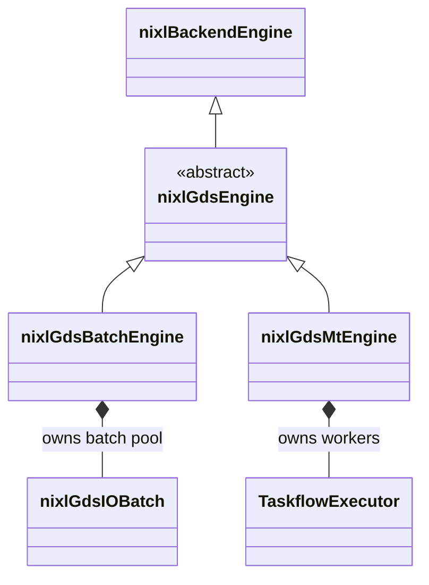
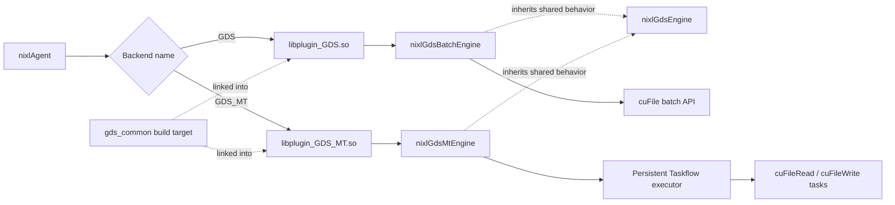

# [Issue #1855] Consolidate GDS and GDS_MT under cuda_gds

source: https://github.com/ai-dynamo/nixl/issues/1855
state: closed | updated: 2026-09-23T02:36:35Z
labels: 

## 正文

## What I’d like to change

We currently have `GDS` and `GDS_MT` in separate plugin directories. They intentionally submit I/O differently, but most of the surrounding cuFile code is duplicated: driver setup, file and buffer registration, metadata, `queryMem`, validation, and request preparation.

I’d like to move the standalone `gds_mt` implementation under `src/plugins/cuda_gds` and share that common plumbing. Both backend names would remain available:

- `GDS` would continue to use the cuFile batch API.
- `GDS_MT` would continue to use its Taskflow executor and one `cuFileRead`/`cuFileWrite` task per request.

This should make it less likely that registration or lifetime fixes land in one backend but not the other. As part of the merge, I also want the shared-fd file handles and pooled GDS batch handles to have clear ownership, since the current GDS paths can otherwise invalidate or reclaim objects too early.

The existing backend names, memory types, configuration defaults, path-mode behavior, and static/dynamic plugin support should stay compatible. The initialization options should also be visible through `get_backend_options`.

## Related follow-up work

While working on the consolidation, I found a few areas that may be worth improving later. They are not required to merge the plugins, and each one changes runtime behavior enough to deserve its own hardware testing and review:

- **Spreading a GDS batch across submitting CPUs:** Today `GDS` submits a cuFile batch from one CPU. A future performance change could divide a large batch across several worker threads/CPUs so the storage stack has a chance to use more NVMe hardware queues. That introduces new scheduling, CPU-affinity, concurrency, and tuning decisions, so I don’t want to mix it into a source-code consolidation.

- **How requests larger than `max_request_size` are represented:** With the default 16 MiB limit, a 32 or 64 MiB transfer is submitted as multiple chunks. The current GDS code advances the memory pointer for each chunk, while cuFile also provides `devPtr_offset` for expressing an offset from a base pointer. It may be worth testing separately whether the choice of representation affects registration reuse or performance across cuFile versions and direct/compatibility paths. This consolidation does not change that behavior or assume that one representation is better.

- **Existing completion and release behavior:** This consolidation preserves behavior that predates it. `postXfer()` is asynchronous in both backends: `GDS` submits the cuFile batch and returns while I/O is in progress, and `GDS_MT` schedules its Taskflow work and returns `NIXL_IN_PROG`. Their status and release behavior differs today:
  - `GDS::checkXfer()` asks cuFile for all remaining batch events and can wait. NIXL's `releaseXferReq()` calls `checkXfer()` before attempting backend cancellation, so releasing an active GDS request can wait there.
  - `GDS_MT::checkXfer()` uses a zero-duration future poll and does not wait, but `GDS_MT::releaseReqH()` destroys the request, whose destructor waits for the Taskflow future when work is still active.

  The [NIXL Backend Guide](https://github.com/ai-dynamo/nixl/blob/main/docs/BackendGuide.md#transfer-operations) says that `postXfer()` should not wait for transfer completion and that `releaseXferReq()` should be nonblocking and asynchronous. It does not separately state that `checkXfer()` must be nonblocking, but a wait there can make release block because the agent calls it first. A separate change can evaluate whether and how to make these existing completion and active-release paths fully nonblocking, including safe cancellation and request/buffer lifetimes.

Before opening the upstream PR, I’ll run the focused GDS/GDS_MT tests, static and dynamic builds, 64 MiB data-consistency checks, and a baseline-versus-change benchmark on GDS hardware.

I have a draft implementation and initial GH200 results in my fork for review: https://github.com/maheshrbapatu/nixl/pull/1

## 评论 (2)

### maheshrbapatu · 2026-06-30

## Proposed design

The main distinction is that this becomes **one shared implementation under `src/plugins/cuda_gds`, while still exposing two public NIXL plugins**.

Applications can continue to use either `createBackend("GDS", ...)` or `createBackend("GDS_MT", ...)`. The consolidation is internal and should not require an application change.

### Class structure

| Component | Responsibility |
| --- | --- |
| `nixlGdsEngine` | Shared cuFile driver lifecycle, file/buffer registration, metadata, `queryMem`, validation, and request preparation |
| `nixlGdsBatchEngine` | Existing GDS cuFile batch submission, completion, and batch pooling |
| `nixlGdsMtEngine` | Existing GDS_MT persistent Taskflow executor and one `cuFileRead`/`cuFileWrite` task per request |
| Plugin entry points | Preserve the separate `GDS` and `GDS_MT` names for discovery and backend creation |

### Build and runtime flow

Meson would build the shared base and RAII utilities once as the common target, then link them into two distinct plugin entry points. Dynamic builds still produce two plugin libraries, and static builds still register two plugin creators. Taskflow remains a dependency of `GDS_MT` only.

### Ownership and compatibility

- Registered descriptors for the same fd share the underlying cuFile file handle. The cache keeps a non-owning reference, and the final registered descriptor performs deregistration.
- The GDS batch engine owns its preallocated batch objects for its entire lifetime. Request handles only borrow active batch pointers and return them to the pool once.
- Driver, file, and buffer resources use one shared RAII implementation instead of two copies that can drift apart.

The public backend names, supported memory types, configuration defaults, GDS batch strategy, GDS_MT Taskflow strategy, static/dynamic loading, path-mode behavior, and existing mutual-exclusion rule remain unchanged.

The performance and API changes described in the issue’s **Related follow-up work** section are intentionally not part of this consolidation.

### maheshrbapatu · 2026-07-02

## GB200 performance validation

Independent validation now covers **512 KiB, 1 MiB, and 16 MiB** sequential direct-VRAM I/O on 8 NVMe drives and 4 GB200 GPUs, with 16 entries/workers and a 16 GiB working set per drive. Throughput below is aggregate GiB/s. GDSIO is a matched cross-run reference; baseline and PR1 were measured in paired, alternating-order rounds.

Only x6 and x0 are shown because they match the two NIXL execution models: GDS uses the cuFile batch API and is compared with x6 `GPU_BATCH`; GDS_MT issues synchronous `cuFileRead`/`cuFileWrite` operations from multiple workers and is compared with x0 `GPUD`. The other GDSIO modes use CPU/page-cache staging, asynchronous stream APIs, or vectored APIs that these NIXL backends do not use, so they are not like-for-like references.

**Test system:** dual-socket NVIDIA Grace (144 Neoverse-V2 cores), 4 x GB200 GPUs, and 8 x Samsung 3.5 TB NVMe drives using ext4, with two drives mapped to each GPU. The software stack was Linux 6.14 aarch64 with 64 KiB pages, NVIDIA driver 580.105.08, CUDA 13.0, cuFile 1.19.0.76, and `nvidia_fs` 2.26.

| I/O size | NIXL path / GDSIO mode | READ GDSIO (GiB/s) | READ baseline (GiB/s) | READ this PR (GiB/s) | WRITE GDSIO (GiB/s) | WRITE baseline (GiB/s) | WRITE this PR (GiB/s) |
| ---: | --- | ---: | ---: | ---: | ---: | ---: | ---: |
| 512 KiB | GDS batch / x6 | 49.549 | 35.749 | 35.722 | 30.672 | 29.802 | 29.873 |
| 512 KiB | GDS_MT / x0 | 49.049 | 39.896 | 39.818 | 30.664 | 30.044 | 29.906 |
| 1 MiB | GDS batch / x6 | 49.624 | 43.379 | 43.395 | 30.536 | 30.405 | 30.387 |
| 1 MiB | GDS_MT / x0 | 49.368 | 44.125 | 44.094 | 30.806 | 30.282 | 30.275 |
| 16 MiB | GDS batch / x6 | 49.511 | 47.680 | 47.596 | 30.593 | 30.730 | 30.723 |
| 16 MiB | GDS_MT / x0 | 49.404 | 48.931 | 48.978 | 30.776 | 30.769 | 30.732 |

The read gap versus GDSIO shrinks as I/O size grows, while writes remain close to the matched GDSIO reference. PR1 follows the same size curve as baseline. The one result worth extending is **512 KiB GDS_MT WRITE**: its three paired runs were consistently slightly lower and need additional rounds before making a size-specific regression claim.

All **8/8 consistency cases** and **704/704 corrected performance processes** passed. The 1 MiB point used five paired rounds; 512 KiB and 16 MiB used three. Full methodology, base values, CPU results, pair ranges, and artifact details are in the [independent GB200 report](https://github.com/maheshrbapatu/nixl/pull/1#issuecomment-4861853943).
