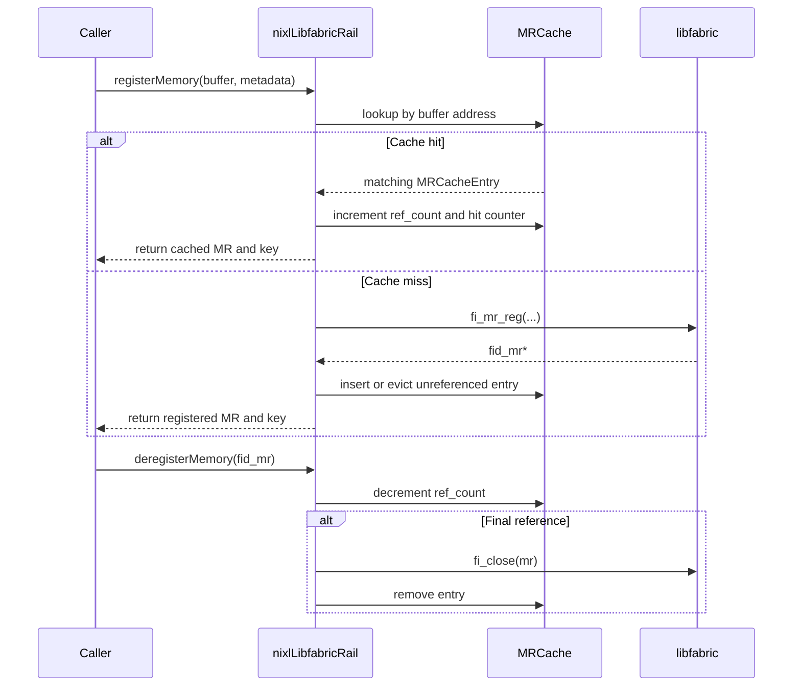

# [PR #1224] perf(libfabric): cache memory registrations to avoid repeated fi_mr_reg calls

source: https://github.com/ai-dynamo/nixl/pull/1224
state: open | updated: 2026-09-23T06:41:05Z
labels: external-contribution, size/L

## 正文

## Summary

This PR implements a reference-counted cache for memory registrations (`fi_mr_reg`) to avoid repeated expensive registration calls for the same GPU buffers.

### Changes

**Files Modified:**
- `src/utils/libfabric/libfabric_rail.h` - Add `MRCacheEntry` struct and cache members
- `src/utils/libfabric/libfabric_rail.cpp` - Implement cache logic in `registerMemory()`/`deregisterMemory()`

### Research Basis

Based on [He et al. "An efficient design for fast memory registration in RDMA" (JNCA 2009)](https://cis.temple.edu/~he/publications/Journals/JNCA-2009.pdf):

> "The cost of memory registration is so huge that it is much higher than the latency of RDMA operation itself. MRRC improves total cost by up to 70%."

### Implementation Details

```cpp
// MRCacheEntry structure
struct MRCacheEntry {
    struct fid_mr *mr;
    uint64_t key;
    std::atomic<uint32_t> ref_count;
    size_t length;
    nixl_mem_t mem_type;
    int gpu_id;
};

// Cache lookup in registerMemory()
uintptr_t buf_addr = reinterpret_cast<uintptr_t>(buffer);
auto it = mr_cache_.find(buf_addr);
if (it != mr_cache_.end() && entry_matches(it->second, len, mem_type, gpu_id)) {
    entry.ref_count.fetch_add(1);
    *mr = entry.mr;
    mr_cache_hits_++;
    return NIXL_SUCCESS;  // Cache hit - skip fi_mr_reg
}
// Cache miss - perform registration and add to cache
```

### Why This Might Help

- Memory registration involves kernel calls and page pinning
- KV cache buffers may be reused across requests
- Cache hit avoids expensive registration overhead

### Cache Statistics API

Included instrumentation to measure cache effectiveness:

```cpp
uint64_t getMRCacheHits() const;
uint64_t getMRCacheMisses() const;
size_t getMRCacheSize() const;
```

### Reviewer Concern Addressed

> "I don't think it'll be a perf improvement because I don't think MR happens in the hot path."

**Response:** This PR includes instrumentation to measure cache hits/misses. If cache hit rate is low, it confirms the reviewer's hypothesis and this optimization can be dropped. If hit rate is high, it validates that MR is in the hot path.

## Test Plan

- [ ] Unit tests pass
- [ ] Integration tests with EFA provider
- [ ] Check cache hit rate in logs: `grep "MRRC cache" logs`
- [ ] Benchmark comparison with baseline (results pending)

<!-- This is an auto-generated comment: release notes by coderabbit.ai -->
## Summary by CodeRabbit

* **New Features**
  * Added a memory-registration cache with bounded capacity, reference-counted entries, safe concurrent handling, and eviction of unused entries.
  * Added cache hit, miss, and size metrics for improved visibility into registration performance.
  * Registrations now reuse cached entries when available and validate required keys.

* **Bug Fixes**
  * Improved buffer-assignment bounds validation and diagnostic logging during pool expansion.
<!-- end of auto-generated comment: release notes by coderabbit.ai -->

## 评论 (13)

### copy-pr-bot[bot] · 2026-01-16

This pull request requires additional validation before any workflows can run on NVIDIA's runners.

Pull request vetters can view their responsibilities [here](https://docs.gha-runners.nvidia.com/cpr/vetters).

Contributors can view more details about this message [here](https://docs.gha-runners.nvidia.com/cpr/contributors).


### github-actions[bot] · 2026-01-16

👋 Hi dmvevents! Thank you for contributing to ai-dynamo/nixl.

Your PR reviewers will review your contribution then trigger the CI to test your changes.

🚀

### brminich · 2026-01-19

/ok to test c9f5f1131785f416ce3ce755f37ad7453646cdcc

### brminich · 2026-01-19

/build

### dmvevents · 2026-02-03

## Proactive Bug Fix: Double-Free Vulnerability

During internal code review, we discovered a resource management bug in `deregisterMemory()` that needed fixing before merge.

### The Bug

**Location:** `libfabric_rail.cpp`, `deregisterMemory()` function (lines 1454-1485)

**Problem:**
```cpp
// Old code:
for (auto it = mr_cache_.begin(); it != mr_cache_.end(); ++it) {
    if (it->second.mr == mr) {
        // Handle ref count, may return early or break
        break;
    }
}
// Falls through even if mr NOT in cache
int ret = fi_close(&mr->fid);  // ❌ Closes even if not our MR!
```

If an MR pointer not in our cache was passed, we still called `fi_close()`, causing:
1. Potential double-free if MR was already closed elsewhere
2. Closing MRs that belong to other rails
3. Undefined behavior depending on libfabric provider

### The Fix

```cpp
// New code:
bool found_in_cache = false;
bool should_close = false;
for (auto it = mr_cache_.begin(); it != mr_cache_.end(); ++it) {
    if (it->second.mr == mr) {
        found_in_cache = true;
        uint32_t prev_count = it->second.ref_count.fetch_sub(1, ...);
        if (prev_count == 1) {
            should_close = true;
            // ...
        }
        break;
    }
}

if (!found_in_cache) {
    NIXL_ERROR << "MRRC: Attempted to deregister uncached MR";
    return NIXL_ERR_NOT_FOUND;
}

if (should_close) {
    int ret = fi_close(&mr->fid);  // ✅ Only close if we own it
    // ...
}
```

**Result:** Only close MRs that were in our cache and had their last reference decremented. Return error if trying to deregister an uncached MR.

### Testing

We verified this fix handles the case where:
1. Caller passes an MR pointer from another rail or already-closed MR
2. MR not found in cache (loop completes without finding it)
3. New behavior: Returns `NIXL_ERR_NOT_FOUND`, no close attempted
4. Old behavior: Calls `fi_close()` anyway, potential double-free

**Commit:** d3fc536

Thank you for your patience while we ensure this is production-ready.

### dmvevents · 2026-04-11

Hi team — this PR proposes a reference-counted cache for `fi_mr_reg` calls to avoid repeated registration of the same memory regions. In our disaggregated inference testing on EFA, we observed `fi_mr_reg` as a hot path (~50-100μs per call due to GDR memory pinning).

This optimization remains unique — #960 (merged Nov 2025) added CUDA memory registration support via `fi_mr_regattr`, which is the foundation this caching layer builds on. The cache itself (avoiding re-registration of already-pinned regions) is not covered by any merged PR.

Is there interest in this approach? I can rebase against current main and update the implementation to work with the threading model changes from #1272 and #1457 if so.


### coderabbitai[bot] · 2026-05-05

<!-- This is an auto-generated comment: summarize by coderabbit.ai -->
<!-- review_stack_entry_start -->

[](https://app.coderabbit.ai/change-stack/ai-dynamo/nixl/pull/1224?utm_source=github_walkthrough&utm_medium=github&utm_campaign=change_stack)

<!-- review_stack_entry_end -->
<!-- This is an auto-generated comment: review paused by coderabbit.ai -->

> [!NOTE]
> ## Reviews paused
> 
> It looks like this branch is under active development. To avoid overwhelming you with review comments due to an influx of new commits, CodeRabbit has automatically paused this review. You can configure this behavior by changing the `reviews.auto_review.auto_pause_after_reviewed_commits` setting.
> 
> Use the following commands to manage reviews:
> - `@coderabbitai resume` to resume automatic reviews.
> - `@coderabbitai review` to trigger a single review.
> 
> Use the checkboxes below for quick actions:
> - [ ] <!-- {"checkboxId": "7f6cc2e2-2e4e-497a-8c31-c9e4573e93d1"} --> ▶️ Resume reviews
> - [ ] <!-- {"checkboxId": "e9bb8d72-00e8-4f67-9cb2-caf3b22574fe"} --> 🔍 Trigger review

<!-- end of auto-generated comment: review paused by coderabbit.ai -->
<!-- walkthrough_start -->

<details>
<summary>📝 Walkthrough</summary>

## Walkthrough

Adds a reference-counted memory-registration cache to `nixlLibfabricRail`. The cache supports lookup, bounded insertion, eviction, concurrent insertion handling, key validation, deregistration, and metrics. It also reformats an out-of-bounds log message.

### Changes

**MR cache integration**

|Layer / File(s)|Summary|
|---|---|
|**MR cache contracts, storage, and accessors** <br> `src/utils/libfabric/libfabric_rail.h`, `src/utils/libfabric/libfabric_rail.cpp`|Adds `MRCacheEntry`, cache storage, mutex protection, hit and miss counters, and public cache accessors.|
|**Registration lookup, insertion, and eviction** <br> `src/utils/libfabric/libfabric_rail.cpp`|`registerMemory()` reuses matching entries, validates metadata and MR keys, maintains reference counts, enforces `NIXL_MR_CACHE_MAX_ENTRIES`, evicts unreferenced entries, and handles concurrent insertion.|
|**Deregistration and reference counting** <br> `src/utils/libfabric/libfabric_rail.cpp`|`deregisterMemory()` decrements cached references and closes the MR after the final reference. It reports missing entries and close failures.|
|**ControlRequestPool logging** <br> `src/utils/libfabric/libfabric_rail.cpp`|Reformats the out-of-bounds buffer-assignment log fields.|

**Estimated code review effort:** 4 (Complex) | ~45 minutes

**Suggested reviewers:** `aranadive`, `fengjica`

### Sequence Diagram(s)



</details>

<!-- walkthrough_end -->
<!-- pre_merge_checks_walkthrough_start -->

<details>
<summary>🚥 Pre-merge checks | ✅ 4 | ❌ 1</summary>

### ❌ Failed checks (1 warning)

|     Check name     | Status     | Explanation                                                                           | Resolution                                                                         |
| :----------------: | :--------- | :------------------------------------------------------------------------------------ | :--------------------------------------------------------------------------------- |
| Docstring Coverage | ⚠️ Warning | Docstring coverage is 40.00% which is insufficient. The required threshold is 80.00%. | Write docstrings for the functions missing them to satisfy the coverage threshold. |

<details>
<summary>✅ Passed checks (4 passed)</summary>

|         Check name         | Status   | Explanation                                                                                                                              |
| :------------------------: | :------- | :--------------------------------------------------------------------------------------------------------------------------------------- |
|         Title check        | ✅ Passed | The title clearly and concisely identifies the main change: caching libfabric memory registrations to avoid repeated registration calls. |
|      Description check     | ✅ Passed | The description explains what changed, why it matters, and how the cache works, with a test plan that is present but still pending.      |
|     Linked Issues check    | ✅ Passed | Check skipped because no linked issues were found for this pull request.                                                                 |
| Out of Scope Changes check | ✅ Passed | Check skipped because no linked issues were found for this pull request.                                                                 |

</details>

</details>

<!-- pre_merge_checks_walkthrough_end -->
<!-- finishing_touch_checkbox_start -->

<details>
<summary>✨ Finishing Touches</summary>

<details>
<summary>🧪 Generate unit tests (beta)</summary>

- [ ] <!-- {"checkboxId": "f47ac10b-58cc-4372-a567-0e02b2c3d479", "radioGroupId": "utg-output-choice-group-unknown_comment_id"} -->   Create PR with unit tests

</details>

</details>

<!-- finishing_touch_checkbox_end -->
<!-- tips_start -->

---


<sub>Comment `@coderabbitai help` to get the list of available commands.</sub>

<!-- tips_end -->

### dmvevents · 2026-05-06

Thanks to CodeRabbit for the careful pass — all three real findings addressed in [`9dcae64`](https://github.com/ai-dynamo/nixl/pull/1224/commits/9dcae64):

1. **Parameter-mismatch silent MR leak** — `try_emplace` is a no-op when the key already exists, so the freshly-registered MR was returned to the caller but never cached. New behavior: on mismatch with `ref_count == 0`, evict the stale entry (and only erase the slot if `fi_close` succeeds) so the later `try_emplace` actually inserts. On mismatch with an active refcount, fail with `NIXL_ERR_INVALID_PARAM` — replacing an actively-mapped MR with a different length is a caller bug we shouldn't paper over.

2. **`std::stoul` exception escape** — the env-var parse helper is now `noexcept` with `try/catch`; on `invalid_argument`, `out_of_range`, or a value of `0` we log a `WARN` and fall back to the 1024-entry default. No more chance of an exception propagating out of the magic-static initializer into `registerMemory`.

3. **Eviction erases on `fi_close` failure** — loop now continues past failed closes instead of erasing the slot, preserving our only handle to the libfabric resource. If nothing can be evicted, the freshly-allocated `mr` is closed and we return `NIXL_ERR_BACKEND`.

Also applied the `const std::lock_guard` nit in `getMRCacheSize`, `registerMemory`, and `deregisterMemory`.

Build passes: full `ninja -C builddir` rebuild of `libplugin_LIBFABRIC.so` clean.


### dmvevents · 2026-06-10

Thanks for the careful review. Pushed `f3d131f` addressing the three open threads.

**`libfabric_rail.cpp:1530` — try_emplace late-race leak (Major)**
Confirmed. Captured `inserted` from `try_emplace`, and on the late-hit path:
- `fi_close()` the redundant locally-registered MR (so the libfabric handle and any pinned GDR memory don't leak),
- bump the cached entry's `ref_count` so the existing entry stays alive for the caller's later `deregisterMemory()`,
- return the cached `mr` / `key` to the caller via `*mr_out` / `*key_out`,
- correct the metrics: this call ends up as a hit, so increment `mr_cache_hits_` and decrement `mr_cache_misses_` (we already incremented misses on the optimistic miss path before re-acquiring the lock).

**`libfabric_rail.cpp:1578` — log-level / O(n) deregister scan (Major)**
Two parts:
- *Log level:* agreed, demoted to `NIXL_DEBUG`. The rail manager (`libfabric_rail_manager.cpp:826-832`) already tolerates per-rail `NIXL_ERR_NOT_FOUND` for cross-rail / cleanup paths, so the ERROR was noise on legitimate flows.
- *O(1) secondary index (`unordered_map<fid_mr*, uintptr_t> mr_to_addr_`):* deferring to a follow-up. It's a structural change you flagged "Heavy lift" — it touches every `mr_cache_` insert/erase site (registerMemory hit-validate path, eviction, deregister, late-race hit) and needs its own correctness pass. I'd rather land the leak fix and the log-noise fix on this PR and open a separate change for the index so it gets a clean diff and its own test pass.

**`libfabric_rail.h:326` — Doxygen `@return` tags (Trivial)**
Done. `getMRCacheHits()` / `getMRCacheMisses()` / `getMRCacheSize()` now use `@brief` + `@return` blocks per the coding guideline.

| Thread | Action | Commit |
|---|---|---|
| `libfabric_rail.cpp:1530` | Fixed (late-race close + return cached entry + metric correction) | `f3d131f` |
| `libfabric_rail.cpp:1578` | Log demoted to DEBUG; secondary index deferred to follow-up | `f3d131f` |
| `libfabric_rail.h:326` | Doxygen `@return` tags added | `f3d131f` |

### dmvevents · 2026-06-10

clang-format follow-up in [`5c0c005`](https://github.com/dmvevents/nixl/commit/5c0c005) — 4 long-line wraps + a `} catch` block reflow per the project's clang-format-19 rule. Diff stays in scope (only lines we already touched in `f3d131f`). CI should clear now.


### dmvevents · 2026-07-20

Friendly ping @yexiangd @fengjica — this one is green and ready for a maintainer look whenever you have a moment:

- All CI checks pass (clang-format, pre-commit, copyright, python-checks x4).
- CodeRabbit review completed; the three findings were addressed in 9dcae64 / f3d131f / 5c0c005.
- Scope is tight: caches libfabric MR registrations to avoid repeated `fi_mr_regattr` on the hot path (perf-only, no API change).

No rush — just flagging that it's unblocked on our side and waiting on a review. Happy to rebase if you'd prefer it fresher against main.


### coderabbitai[bot] · 2026-08-12

<!-- This is an auto-generated comment by CodeRabbit -->
> [!NOTE]
> GitHub couldn't provide a complete incremental comparison for this pull request, so CodeRabbit is performing a full review instead. This review may take a little longer.

### dmvevents · 2026-08-12

Rebased onto current `main` (merge commit 42e6563, conflict was the new `pollForCompletions()` declaration vs the MRRC members in `libfabric_rail.h` — both kept). Full-file compile check against the merged tree passes. The branch is conflict-free again; could a maintainer re-trigger CI (`/ok to test`)?

## Review (11)

### coderabbitai[bot] · 2026-05-05 · COMMENTED

**Actionable comments posted: 6**

> [!CAUTION]
> Some comments are outside the diff and can’t be posted inline due to platform limitations.
> 
> 
> 
> <details>
> <summary>⚠️ Outside diff range comments (1)</summary><blockquote>
> 
> <details>
> <summary>src/utils/libfabric/libfabric_rail.cpp (1)</summary><blockquote>
> 
> `667-696`: _⚠️ Potential issue_ | _🔴 Critical_ | _🏗️ Heavy lift_
> 
> **Cached MRs are leaked at rail destruction — close domain will fail with `-FI_EBUSY`.**
> 
> `cleanup()` walks endpoint/CQ/AV/control pool/domain, but never iterates `mr_cache_`. Any registrations the user did not pair with a `deregisterMemory` (e.g., abnormal shutdown, partial cleanup paths) will remain bound to `domain`. The comment on Step 4 explicitly states "Close domain AFTER all MRs ... are closed", but cached MRs are unreachable from the user once the rail is destroyed and we never close them ourselves. `fi_close(&domain->fid)` will then typically return `-FI_EBUSY`, and the `fid_mr` resources leak.
> 
> <details>
> <summary>🔧 Suggested fix — drain the MR cache before closing the domain</summary>
> 
> ```diff
>      control_request_pool_.cleanup();
> +
> +    // Drain the MR cache while the domain is still valid.
> +    {
> +        const std::lock_guard<std::mutex> lock(mr_cache_mutex_);
> +        for (auto &kv : mr_cache_) {
> +            if (kv.second.mr) {
> +                int ret = fi_close(&kv.second.mr->fid);
> +                if (ret) {
> +                    NIXL_WARN << "fi_close cached MR failed for rail " << rail_id << ": "
> +                              << fi_strerror(-ret);
> +                }
> +            }
> +        }
> +        mr_cache_.clear();
> +    }
> +
>      // STEP 4: Close domain AFTER all MRs, endpoint, CQ, AV are closed
>      if (domain) {
> ```
> </details>
> 
> <details>
> <summary>🤖 Prompt for AI Agents</summary>
> 
> ```
> Verify each finding against current code. Fix only still-valid issues, skip the
> rest with a brief reason, keep changes minimal, and validate.
> 
> In `@src/utils/libfabric/libfabric_rail.cpp` around lines 667 - 696, The MR cache
> (mr_cache_) is never drained, so leftover fid_mr registrations leak and cause
> fi_close(&domain->fid) to fail with -FI_EBUSY; before closing domain in the
> destructor/cleanup path (where cleanup() and the block referencing rail_id and
> domain live), iterate and drain mr_cache_, call deregisterMemory (or directly
> fi_close on each fid_mr) for every cached MR, handle/log errors per-MR, and
> remove entries from mr_cache_ (set to nullptr/erase) so all MRs are released
> prior to the fi_close(&domain->fid) call; ensure this runs on all
> shutdown/partial cleanup paths so domain closure succeeds.
> ```
> 
> </details>
> 
> </blockquote></details>
> 
> </blockquote></details>

<details>
<summary>🤖 Prompt for all review comments with AI agents</summary>

```
Verify each finding against current code. Fix only still-valid issues, skip the
rest with a brief reason, keep changes minimal, and validate.

Inline comments:
In `@src/utils/libfabric/libfabric_rail.cpp`:
- Around line 1273-1277: Change non-const std::lock_guard usages to const to
enforce const-correctness: in getMRCacheSize() replace
"std::lock_guard<std::mutex> lock(mr_cache_mutex_);" with "const
std::lock_guard<std::mutex> lock(mr_cache_mutex_);" so the guard isn't
modifiable after construction; apply the same pattern to the other lock_guard
declarations called out in this review (the similar mutex guard usages at the
other occurrences noted) ensuring each local lock variable is declared const and
still locks the appropriate mutex (e.g., mr_cache_mutex_ or the corresponding
mutex in those scopes).
- Around line 1316-1320: The code path that logs a WARN on parameter mismatch
then calls fi_mr_regattr leaks the new fid_mr because
mr_cache_.try_emplace(buf_addr, ...) is a no-op when the key exists; fix by
either failing fast or evicting the cached entry before registering a
replacement: in the registration function (the block that calls fi_mr_regattr
and assigns *mr_out), check mr_cache_ for buf_addr and if metadata
(length/mem_type/device_id) differ then either return an error to the caller, or
if you choose to replace, ensure you first verify the cached entry's ref_count
is zero, call fi_close on its fid_mr (or otherwise free it), erase the map
entry, then call fi_mr_regattr and insert the new fid_mr into mr_cache_ (or use
operator[] to overwrite) so the new MR is tracked; also ensure deregisterMemory
(which scans by fid_mr) will find and close entries as before.
- Around line 1437-1441: The environment parsing for NIXL_MR_CACHE_MAX_ENTRIES
in the static lambda can throw via std::stoul and silently convert types; change
the lambda used to initialize max_cache_entries so it defensively parses the env
var (use std::from_chars or strtoull) and handles invalid/empty/out-of-range
values without throwing, returning the constant
NIXL_MR_CACHE_MAX_ENTRIES_DEFAULT on error, clamp the parsed value into a safe
size_t range (and treat 0 as the default or minimum of 1), and ensure the
initializer does not throw so calls to registerMemory and other code paths are
safe; update references to NIXL_MR_CACHE_MAX_ENTRIES_DEFAULT and
max_cache_entries accordingly.
- Around line 1450-1465: The eviction loop currently erases the cache entry even
if fi_close(&it->second.mr->fid) fails, which leaks the MR; change the logic so
that you only erase and set evicted = true when fi_close returns 0.
Specifically, in the loop over mr_cache_ (the block referencing
it->second.ref_count, fi_close, it->second.mr->fid and evicted), if fi_close
fails simply log the error and continue to the next candidate (do not erase or
break); only call mr_cache_.erase(it) and break when fi_close succeeds. This
ensures failed closes are not removed from mr_cache_ and preserves existing
behavior of falling through to the "cache full" error if no successful eviction
occurs.
- Around line 1499-1530: The current deregister path does an O(n) scan while
holding mr_cache_mutex_ (iterating mr_cache_ to match fid_mr*), which is slow;
add a secondary index (e.g., unordered_map<fid_mr*, uintptr_t> mr_to_addr_)
updated in lockstep wherever mr_cache_ is inserted/erased, then in the
deregister function first lock mr_cache_mutex_, lookup the fid_mr* in
mr_to_addr_ to get the buffer key, use that key to directly find and update
mr_cache_ (adjust ref_count, erase both maps and set should_close) to make
lookup O(1). Also change the log level where the MR is not found from NIXL_ERROR
to a non-error level (NIXL_DEBUG or NIXL_WARN) so legitimate cross-rail/cleanup
cases don’t spam errors.

In `@src/utils/libfabric/libfabric_rail.h`:
- Around line 311-326: Update the comments for the public MR-cache accessors to
use Doxygen block style with `@return` tags: replace the one-line comments above
getMRCacheHits(), getMRCacheMisses(), and getMRCacheSize() with /** ... */
blocks that include a short description and a `@return` describing the returned
value (e.g., number of MR cache hits, number of MR cache misses, current MR
cache size respectively), ensuring each accessor's comment uses the Doxygen
`@return` tag.

---

Outside diff comments:
In `@src/utils/libfabric/libfabric_rail.cpp`:
- Around line 667-696: The MR cache (mr_cache_) is never drained, so leftover
fid_mr registrations leak and cause fi_close(&domain->fid) to fail with
-FI_EBUSY; before closing domain in the destructor/cleanup path (where cleanup()
and the block referencing rail_id and domain live), iterate and drain mr_cache_,
call deregisterMemory (or directly fi_close on each fid_mr) for every cached MR,
handle/log errors per-MR, and remove entries from mr_cache_ (set to
nullptr/erase) so all MRs are released prior to the fi_close(&domain->fid) call;
ensure this runs on all shutdown/partial cleanup paths so domain closure
succeeds.
```

</details>

<details>
<summary>🪄 Autofix (Beta)</summary>

Fix all unresolved CodeRabbit comments on this PR:

- [ ] <!-- {"checkboxId": "4b0d0e0a-96d7-4f10-b296-3a18ea78f0b9"} --> Push a commit to this branch (recommended)
- [ ] <!-- {"checkboxId": "ff5b1114-7d8c-49e6-8ac1-43f82af23a33"} --> Create a new PR with the fixes

</details>

---

<details>
<summary>ℹ️ Review info</summary>

<details>
<summary>⚙️ Run configuration</summary>

**Configuration used**: Path: .coderabbit.yaml

**Review profile**: ASSERTIVE

**Plan**: Pro

**Run ID**: `0643e798-e70f-4411-ac59-b4ce60ffb0a9`

</details>

<details>
<summary>📥 Commits</summary>

Reviewing files that changed from the base of the PR and between f34ce83d60e1bed0ce247c0df7b485a5bb89fcf9 and 24db0ff471936a98af8e9af8cdb8d536240e3392.

</details>

<details>
<summary>📒 Files selected for processing (2)</summary>

* `src/utils/libfabric/libfabric_rail.cpp`
* `src/utils/libfabric/libfabric_rail.h`

</details>

</details>

<!-- This is an auto-generated comment by CodeRabbit for review status -->

### coderabbitai[bot] · 2026-05-06 · COMMENTED

**Actionable comments posted: 1**

> [!CAUTION]
> Some comments are outside the diff and can’t be posted inline due to platform limitations.
> 
> 
> 
> <details>
> <summary>⚠️ Outside diff range comments (2)</summary><blockquote>
> 
> <details>
> <summary>src/utils/libfabric/libfabric_rail.cpp (2)</summary><blockquote>
> 
> `634-696`: _⚠️ Potential issue_ | _🟠 Major_ | _⚡ Quick win_
> 
> **`cleanup()` must flush `mr_cache_` before closing the domain.**
> 
> Before this PR, every MR was closed immediately in `deregisterMemory`. The new cache retains `fid_mr*` handles beyond individual deregister calls. `cleanup()` does not iterate `mr_cache_` before calling `fi_close(&domain->fid)` at line 674. Any handles still in the cache at that point are never explicitly closed, causing:
> 
> 1. **MR/GDR-memory leak** — `fi_close` is never called on the cached handles.
> 2. **Domain-close failure** — EFA and other providers return `-FI_EBUSY` if `fi_close(domain)` is called while domain-owned objects (MRs) are still open; the domain then leaks too.
> 
> Add a cache flush between the pool cleanup (line 670) and the domain close (line 674):
> 
> <details>
> <summary>🔧 Proposed addition to cleanup()</summary>
> 
> ```cpp
>     // Flush MR cache before closing domain; warn on any still-referenced entries.
>     {
>         const std::lock_guard<std::mutex> lock(mr_cache_mutex_);
>         for (auto &[addr, entry] : mr_cache_) {
>             if (entry.ref_count.load(std::memory_order_acquire) > 0) {
>                 NIXL_WARN << "cleanup: MR still referenced (addr=" << (void *)addr
>                           << " ref_count=" << entry.ref_count.load() << ") on rail " << rail_id;
>             }
>             const int ret = fi_close(&entry.mr->fid);
>             if (ret != 0) {
>                 NIXL_WARN << "cleanup: fi_close failed for MR addr=" << (void *)addr
>                           << " on rail " << rail_id << ": " << fi_strerror(-ret);
>             }
>         }
>         mr_cache_.clear();
>     }
> 
>     // STEP 4: Close domain AFTER all MRs, endpoint, CQ, AV are closed
> ```
> </details>
> 
> <details>
> <summary>🤖 Prompt for AI Agents</summary>
> 
> ```
> Verify each finding against current code. Fix only still-valid issues, skip the
> rest with a brief reason, keep changes minimal, and validate.
> 
> In `@src/utils/libfabric/libfabric_rail.cpp` around lines 634 - 696, The cleanup()
> function must flush mr_cache_ before closing the domain: after
> control_request_pool_.cleanup() and before calling fi_close(&domain->fid), lock
> mr_cache_mutex_, iterate mr_cache_ entries, log a NIXL_WARN if
> entry.ref_count.load(...) > 0, call fi_close(&entry.mr->fid) for each entry and
> log failures with fi_strerror(-ret), then clear mr_cache_; finally proceed to
> close domain, fabric, etc., ensuring no MR handles remain open when
> fi_close(domain) is invoked.
> ```
> 
> </details>
> 
> ---
> 
> `1301-1495`: _⚠️ Potential issue_ | _🔴 Critical_ | _⚡ Quick win_
> 
> **CI failure: clang-format violations block merge.**
> 
> The `Clang Format Check` pipeline step fails with formatting differences in the new cache code. Run `clang-format-diff-19 -p1 -style=file -i` on the diff (or `clang-format -i src/utils/libfabric/libfabric_rail.cpp`) to fix all reported differences before merge.
> 
> <details>
> <summary>🤖 Prompt for AI Agents</summary>
> 
> ```
> Verify each finding against current code. Fix only still-valid issues, skip the
> rest with a brief reason, keep changes minimal, and validate.
> 
> In `@src/utils/libfabric/libfabric_rail.cpp` around lines 1301 - 1495, The CI
> failure is due to clang-format violations in the newly added MR cache code; run
> the project's formatter (e.g. clang-format-diff-19 -p1 -style=file -i or
> clang-format -i src/utils/libfabric/libfabric_rail.cpp) and commit the resulting
> formatting changes so mr_cache_, mr_cache_mutex_, and the surrounding
> registration block (the code that performs fi_mr_regattr / fi_mr_bind /
> fi_mr_enable and the cache eviction logic) match the repository's style; ensure
> only whitespace/formatting changes are made and no logic in the fi_mr_*
> registration path or the MR cache handling is altered.
> ```
> 
> </details>
> 
> </blockquote></details>
> 
> </blockquote></details>

<details>
<summary>🤖 Prompt for all review comments with AI agents</summary>

```
Verify each finding against current code. Fix only still-valid issues, skip the
rest with a brief reason, keep changes minimal, and validate.

Inline comments:
In `@src/utils/libfabric/libfabric_rail.cpp`:
- Around line 1524-1530: The code calls mr_cache_.try_emplace(buf_addr, mr,
actual_key, length, mem_type, device_id) and unconditionally returns the local
mr even if try_emplace was a no-op due to a concurrent insert, leaking the
locally-created fid_mr; change this by checking the try_emplace result (the
inserted flag), and if inserted==false then close the local mr (call fi_close on
the fid_mr held by mr) and instead retrieve the existing cached entry for
buf_addr to set *mr_out and *key_out; also update metrics to reflect a late
cache hit (increment mr_cache_hits_ and decrement mr_cache_misses_ if you want
accurate counts) so deregisterMemory(mr) will find and manage the cached MR
rather than leaking resources.

---

Outside diff comments:
In `@src/utils/libfabric/libfabric_rail.cpp`:
- Around line 634-696: The cleanup() function must flush mr_cache_ before
closing the domain: after control_request_pool_.cleanup() and before calling
fi_close(&domain->fid), lock mr_cache_mutex_, iterate mr_cache_ entries, log a
NIXL_WARN if entry.ref_count.load(...) > 0, call fi_close(&entry.mr->fid) for
each entry and log failures with fi_strerror(-ret), then clear mr_cache_;
finally proceed to close domain, fabric, etc., ensuring no MR handles remain
open when fi_close(domain) is invoked.
- Around line 1301-1495: The CI failure is due to clang-format violations in the
newly added MR cache code; run the project's formatter (e.g.
clang-format-diff-19 -p1 -style=file -i or clang-format -i
src/utils/libfabric/libfabric_rail.cpp) and commit the resulting formatting
changes so mr_cache_, mr_cache_mutex_, and the surrounding registration block
(the code that performs fi_mr_regattr / fi_mr_bind / fi_mr_enable and the cache
eviction logic) match the repository's style; ensure only whitespace/formatting
changes are made and no logic in the fi_mr_* registration path or the MR cache
handling is altered.
```

</details>

<details>
<summary>🪄 Autofix (Beta)</summary>

Fix all unresolved CodeRabbit comments on this PR:

- [ ] <!-- {"checkboxId": "4b0d0e0a-96d7-4f10-b296-3a18ea78f0b9"} --> Push a commit to this branch (recommended)
- [ ] <!-- {"checkboxId": "ff5b1114-7d8c-49e6-8ac1-43f82af23a33"} --> Create a new PR with the fixes

</details>

---

<details>
<summary>ℹ️ Review info</summary>

<details>
<summary>⚙️ Run configuration</summary>

**Configuration used**: Path: .coderabbit.yaml

**Review profile**: ASSERTIVE

**Plan**: Pro

**Run ID**: `dd786c3c-842e-46ee-8a2d-b645ff1c8696`

</details>

<details>
<summary>📥 Commits</summary>

Reviewing files that changed from the base of the PR and between 24db0ff471936a98af8e9af8cdb8d536240e3392 and 9dcae643bbcb2ca1b6cdf2a4321c1d41024fc450.

</details>

<details>
<summary>📒 Files selected for processing (1)</summary>

* `src/utils/libfabric/libfabric_rail.cpp`

</details>

</details>

<!-- This is an auto-generated comment by CodeRabbit for review status -->

### coderabbitai[bot] · 2026-06-10 · COMMENTED


> [!CAUTION]
> Some comments are outside the diff and can’t be posted inline due to platform limitations.
> 
> 
> 
> <details>
> <summary>⚠️ Outside diff range comments (3)</summary><blockquote>
> 
> <details>
> <summary>src/utils/libfabric/libfabric_rail.cpp (3)</summary><blockquote>
> 
> `1452-1550`: _⚠️ Potential issue_ | _🟠 Major_ | _⚡ Quick win_
> 
> **Rail teardown never releases `mr_cache_` entries.**
> 
> This block makes the rail own live `fid_mr *` handles, but `cleanup()` only drains the request pools
> before closing the domain. Any MR still parked in `mr_cache_` at destruction remains open, which can
> leak pinned memory/provider state and turn domain shutdown into a best-effort warning path.
> 
> <details>
> <summary>🔧 Suggested follow-up</summary>
> 
> ```diff
>  void
>  nixlLibfabricRail::cleanup() {
>      NIXL_TRACE << "Starting cleanup for rail " << rail_id;
> @@
>      NIXL_TRACE << "Cleaning up request pools for rail " << rail_id;
>      control_request_pool_.cleanup();
> +
> +    {
> +        const std::lock_guard<std::mutex> lock(mr_cache_mutex_);
> +        for (auto it = mr_cache_.begin(); it != mr_cache_.end();) {
> +            const int close_ret = fi_close(&it->second.mr->fid);
> +            if (close_ret != 0) {
> +                NIXL_WARN << "fi_close MR cache entry failed for rail " << rail_id
> +                          << ": " << fi_strerror(-close_ret);
> +                ++it;
> +                continue;
> +            }
> +            it = mr_cache_.erase(it);
> +        }
> +    }
> ```
> </details>
> 
> <details>
> <summary>🤖 Prompt for AI Agents</summary>
> 
> ```
> Verify each finding against current code. Fix only still-valid issues, skip the
> rest with a brief reason, keep changes minimal, and validate.
> 
> In `@src/utils/libfabric/libfabric_rail.cpp` around lines 1452 - 1550, The rail's
> cleanup() currently doesn't release MR entries in mr_cache_, leaking fid_mr
> handles and pinned memory; modify cleanup() to lock mr_cache_mutex_, iterate all
> entries in mr_cache_, call fi_close(&entry.second.mr->fid) for each (log errors
> but continue), reset/refcount as needed, erase/clear the map, and only then
> proceed to close the domain and other resources; ensure you use mr_cache_mutex_
> to protect access and avoid races with registerMemory()/deregisterMemory(), and
> handle non-zero fi_close returns similarly to eviction code to avoid losing the
> last handle.
> ```
> 
> </details>
> 
> <!-- cr-comment:v1:e6cfb1e40bf22d88f6b0fb0a -->
> 
> ---
> 
> `1487-1519`: _⚠️ Potential issue_ | _🟠 Major_ | _🏗️ Heavy lift_
> 
> **Last-reference deregistration defeats the cache.**
> 
> When `prev_count == 1`, this path erases and closes the MR immediately. That leaves no steady-state
> `ref_count == 0` entries for the eviction/reuse path above, so the next `registerMemory()` for the
> same buffer still pays a fresh `fi_mr_regattr`. In practice this turns the MR cache into
> overlapping-use deduplication instead of reusable registration caching.
> 
>   
> 
> 
> Also applies to: 1578-1584
> 
> <details>
> <summary>🤖 Prompt for AI Agents</summary>
> 
> ```
> Verify each finding against current code. Fix only still-valid issues, skip the
> rest with a brief reason, keep changes minimal, and validate.
> 
> In `@src/utils/libfabric/libfabric_rail.cpp` around lines 1487 - 1519, The
> deregistration path is prematurely closing and erasing MR entries when
> prev_count == 1 which prevents keeping ref_count==0 cache slots for reuse;
> change the logic in the deregistration/decrement path (the code that checks
> prev_count and currently calls fi_close(&mr->fid) and erases from mr_cache_) to
> instead decrement to 0 and leave the mr_cache_ entry intact (do not call
> fi_close or erase) so the eviction/reuse loop (which checks
> it->second.ref_count.load(... ) == 0 and calls fi_close only during eviction)
> can reuse that registration; ensure you only call fi_close when actually
> evicting in the eviction loop and avoid double-closing entries when
> registerMemory() or eviction replaces an entry.
> ```
> 
> </details>
> 
> <!-- cr-comment:v1:c2df97bcaec5aa474585986f -->
> 
> ---
> 
> `1466-1478`: _⚠️ Potential issue_ | _🟠 Major_
> 
> **Fix `NIXL_MR_CACHE_MAX_ENTRIES` parsing to reject trailing characters in `src/utils/libfabric/libfabric_rail.cpp` (lines ~1466-1478)**
> 
> `std::stoul(max_str)` parses a valid unsigned prefix and stops at the first non-numeric character without throwing, so values like `"1G"` (or `"1024foo"`) get accepted as `1`/`1024` instead of falling back to the default.
> 
> <details>
> <summary>🩹 Minimal fix</summary>
> 
> ```diff
>              try {
> -                const unsigned long parsed = std::stoul(max_str);
> -                if (parsed == 0) {
> +                size_t parsed_chars = 0;
> +                const unsigned long parsed = std::stoul(max_str, &parsed_chars);
> +                if (parsed_chars != std::strlen(max_str) || parsed == 0) {
>                      NIXL_WARN << "NIXL_MR_CACHE_MAX_ENTRIES=0 is invalid; "
>                                   "falling back to default";
>                      return NIXL_MR_CACHE_MAX_ENTRIES_DEFAULT;
>                  }
>                  return parsed;
> ```
> </details>
> 
> <details>
> <summary>🤖 Prompt for AI Agents</summary>
> 
> ```
> Verify each finding against current code. Fix only still-valid issues, skip the
> rest with a brief reason, keep changes minimal, and validate.
> 
> In `@src/utils/libfabric/libfabric_rail.cpp` around lines 1466 - 1478, The current
> parsing of max_str using std::stoul accepts strings with trailing non-digit
> characters (e.g., "1G"); update the parsing in the function that reads
> NIXL_MR_CACHE_MAX_ENTRIES (where max_str is used and
> NIXL_MR_CACHE_MAX_ENTRIES_DEFAULT is returned) to use the std::stoul overload
> with a size_t pos argument (e.g., std::size_t pos) and reject the value unless
> pos == max_str.size(); keep the existing zero check (parsed == 0) and exception
> handling but treat any case where pos != max_str.size() as a parse failure that
> logs the same warning and returns NIXL_MR_CACHE_MAX_ENTRIES_DEFAULT.
> ```
> 
> </details>
> 
> <!-- cr-comment:v1:aef1318b9467ee76a9e14c71 -->
> 
> </blockquote></details>
> 
> </blockquote></details>

<details>
<summary>🤖 Prompt for all review comments with AI agents</summary>

```
Verify each finding against current code. Fix only still-valid issues, skip the
rest with a brief reason, keep changes minimal, and validate.

Outside diff comments:
In `@src/utils/libfabric/libfabric_rail.cpp`:
- Around line 1452-1550: The rail's cleanup() currently doesn't release MR
entries in mr_cache_, leaking fid_mr handles and pinned memory; modify cleanup()
to lock mr_cache_mutex_, iterate all entries in mr_cache_, call
fi_close(&entry.second.mr->fid) for each (log errors but continue),
reset/refcount as needed, erase/clear the map, and only then proceed to close
the domain and other resources; ensure you use mr_cache_mutex_ to protect access
and avoid races with registerMemory()/deregisterMemory(), and handle non-zero
fi_close returns similarly to eviction code to avoid losing the last handle.
- Around line 1487-1519: The deregistration path is prematurely closing and
erasing MR entries when prev_count == 1 which prevents keeping ref_count==0
cache slots for reuse; change the logic in the deregistration/decrement path
(the code that checks prev_count and currently calls fi_close(&mr->fid) and
erases from mr_cache_) to instead decrement to 0 and leave the mr_cache_ entry
intact (do not call fi_close or erase) so the eviction/reuse loop (which checks
it->second.ref_count.load(... ) == 0 and calls fi_close only during eviction)
can reuse that registration; ensure you only call fi_close when actually
evicting in the eviction loop and avoid double-closing entries when
registerMemory() or eviction replaces an entry.
- Around line 1466-1478: The current parsing of max_str using std::stoul accepts
strings with trailing non-digit characters (e.g., "1G"); update the parsing in
the function that reads NIXL_MR_CACHE_MAX_ENTRIES (where max_str is used and
NIXL_MR_CACHE_MAX_ENTRIES_DEFAULT is returned) to use the std::stoul overload
with a size_t pos argument (e.g., std::size_t pos) and reject the value unless
pos == max_str.size(); keep the existing zero check (parsed == 0) and exception
handling but treat any case where pos != max_str.size() as a parse failure that
logs the same warning and returns NIXL_MR_CACHE_MAX_ENTRIES_DEFAULT.
```

</details>

---

<details>
<summary>ℹ️ Review info</summary>

<details>
<summary>⚙️ Run configuration</summary>

**Configuration used**: Path: .coderabbit.yaml

**Review profile**: ASSERTIVE

**Plan**: Enterprise

**Run ID**: `1a872849-78ff-4c82-93f1-a87129050fd0`

</details>

<details>
<summary>📥 Commits</summary>

Reviewing files that changed from the base of the PR and between f3d131fd05b7eadd778e8809f5b02496435946ab and 5c0c005122bda24e48b6221d4c01084ff7237fda.

</details>

<details>
<summary>📒 Files selected for processing (1)</summary>

* `src/utils/libfabric/libfabric_rail.cpp`

</details>

</details>

<!-- This is an auto-generated comment by CodeRabbit for review status -->

### coderabbitai[bot] · 2026-08-12 · COMMENTED

<!-- coderabbit-cli-agent-hint:v3
After fixes: `coderabbit review '-''-agent'`. Missing? Ask user; `curl -fsSL https://cli.coderabbit.ai/install.sh | CRS=ghr1 sh`.
-->

**Actionable comments posted: 2**

<details>
<summary>🤖 Prompt for all review comments with AI agents</summary>

```
Verify each finding against current code. Fix only still-valid issues, skip the
rest with a brief reason, keep changes minimal, and validate.

Inline comments:
In `@src/utils/libfabric/libfabric_rail.cpp`:
- Around line 1770-1813: The MR cache must support uncached registrations: in
src/utils/libfabric/libfabric_rail.cpp lines 1770-1813, update
deregisterMemory() so the not-found path closes mr with fi_close() and returns
NIXL_SUCCESS, handling close failures consistently; in
src/utils/libfabric/libfabric_rail.cpp lines 1683-1719, update registerMemory()
so when no cache entry can be evicted it retains and returns the freshly
registered MR uncached with NIXL_SUCCESS instead of closing it and returning
NIXL_ERR_BACKEND.
```

</details>

<details>
<summary>🪄 Autofix</summary>

Fix all unresolved CodeRabbit comments on this PR:

- [ ] <!-- {"checkboxId": "4b0d0e0a-96d7-4f10-b296-3a18ea78f0b9"} --> Push a commit to this branch (recommended)
- [ ] <!-- {"checkboxId": "ff5b1114-7d8c-49e6-8ac1-43f82af23a33"} --> Create a new PR with the fixes

</details>

---

<details>
<summary>ℹ️ Review info</summary>

<details>
<summary>⚙️ Run configuration</summary>

**Configuration used**: Path: .coderabbit.yaml

**Review profile**: ASSERTIVE

**Plan**: Pro Plus

**Run ID**: `ecf02587-c978-42cc-a5ce-44a4147f1f5c`

</details>

<details>
<summary>📥 Commits</summary>

Reviewing files that changed from the base of the PR and between c345fe3ea8d68efd76bf095b7a9c79ecd9b9ffc4 and 42e6563b5277d38e3cf239dcf4a920827919de2d.

</details>

<details>
<summary>📒 Files selected for processing (2)</summary>

* `src/utils/libfabric/libfabric_rail.cpp`
* `src/utils/libfabric/libfabric_rail.h`

</details>

</details>

<!-- This is an auto-generated comment by CodeRabbit for review status -->

### dmvevents · 2026-08-19 · COMMENTED

(no text)

### dmvevents · 2026-08-19 · COMMENTED

(no text)

### dmvevents · 2026-08-19 · COMMENTED

(no text)

### coderabbitai[bot] · 2026-08-19 · COMMENTED

(no text)

### coderabbitai[bot] · 2026-08-19 · COMMENTED

(no text)

### coderabbitai[bot] · 2026-08-19 · COMMENTED

(no text)

### rongbingzhou · 2026-09-23 · COMMENTED

(no text)
