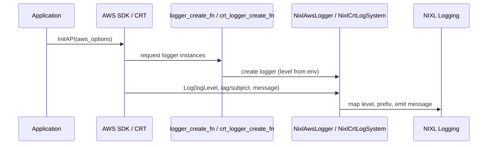

# [PR #1369] obj: route AWS SDK logs through NIXL logging macros

source: https://github.com/ai-dynamo/nixl/pull/1369
state: open | updated: 2026-09-23T19:54:32Z
labels: external-contribution, size/L

## 正文

Install a custom NixlAwsLogger (LogSystemInterface) on SDKOptions so AWS SDK internal messages (connection failures, retries, MPU progress) flow through NIXL_ERROR/WARN/INFO/DEBUG/TRACE instead of being silently discarded.  The logger level is gated by NIXL_LOG_LEVEL so no overhead is incurred below the configured verbosity.

Also add NIXL_ERROR statements to previously-silent failure paths in both the regular and CRT S3 client callbacks (putObjectAsync offset guard, put/get outcome errors).

Sample [AWS:] lines:
  [AWS:Aws_Init_Cleanup] Initiate AWS SDK for C++ with Version:1.11.760                                                                                                                                                                                    
  [AWS:CurlHttpClient] Initializing Curl library with version: 8.12.1                                                                                                                                                                                      
  [AWS:Aws::Endpoint::DefaultEndpointProvider] Endpoint rules engine evaluated: https://bucket*.amazonaws.com
  [AWS:AWSClient] Request Successfully signed
  [AWS:AWSClient] Request returned successful response.
  Sample [CRT:] lines:
  [CRT:libcrypto_resolve] Compiled with libcrypto OpenSSL 3.5.1
  [CRT:tls-handler] static: Initializing TLS using s2n.
  [CRT:event-loop] Initializing edge-triggered epoll

<!-- This is an auto-generated comment: release notes by coderabbit.ai -->
## Summary by CodeRabbit

* **Bug Fixes**
  * Rejects non-zero offsets for S3 object operations and logs an error when such requests occur.
  * Improved error logging for failed S3 uploads and downloads.

* **Chores**
  * Centralized AWS SDK/CRT logging integrated with the app logging system for consistent formatting.
  * Logging now respects the configured environment log level for consistent diagnostics.
<!-- end of auto-generated comment: release notes by coderabbit.ai -->
<!-- devin-review-badge-begin -->

---

<a href="https://nvidia.devinenterprise.com/review/ai-dynamo/nixl/pull/1369" target="_blank">
  <picture>
    <source media="(prefers-color-scheme: dark)" srcset="https://static.devin.ai/assets/gh-open-in-devin-review-dark.svg?v=1">
    
  </picture>
</a>
<!-- devin-review-badge-end -->


## 评论 (17)

### github-actions[bot] · 2026-02-25

👋 Hi aranadive! Thank you for contributing to ai-dynamo/nixl.

Your PR reviewers will review your contribution then trigger the CI to test your changes.

🚀

### copy-pr-bot[bot] · 2026-02-25

This pull request requires additional validation before any workflows can run on NVIDIA's runners.

Pull request vetters can view their responsibilities [here](https://docs.gha-runners.nvidia.com/cpr/vetters).

Contributors can view more details about this message [here](https://docs.gha-runners.nvidia.com/cpr/contributors).


### coderabbitai[bot] · 2026-03-02

<!-- This is an auto-generated comment: summarize by coderabbit.ai -->
<!-- This is an auto-generated comment: review paused by coderabbit.ai -->

> [!NOTE]
> ## Reviews paused
> 
> It looks like this branch is under active development. To avoid overwhelming you with review comments due to an influx of new commits, CodeRabbit has automatically paused this review. You can configure this behavior by changing the `reviews.auto_review.auto_pause_after_reviewed_commits` setting.
> 
> Use the following commands to manage reviews:
> - `@coderabbitai resume` to resume automatic reviews.
> - `@coderabbitai review` to trigger a single review.
> 
> Use the checkboxes below for quick actions:
> - [ ] <!-- {"checkboxId": "7f6cc2e2-2e4e-497a-8c31-c9e4573e93d1"} --> ▶️ Resume reviews
> - [ ] <!-- {"checkboxId": "e9bb8d72-00e8-4f67-9cb2-caf3b22574fe"} --> 🔍 Trigger review

<!-- end of auto-generated comment: review paused by coderabbit.ai -->
<!-- walkthrough_start -->

<details>
<summary>📝 Walkthrough</summary>

## Walkthrough

Adds an AWS SDK/CRT → NIXL logging bridge and configures AWS SDK initialization to use it; updates S3 clients to reject non‑zero Put offsets and to log async Get/Put failures.

## Changes

|Cohort / File(s)|Summary|
|---|---|
|**S3 client updates** <br> `src/plugins/obj/s3/client.cpp`, `src/plugins/obj/s3_crt/client.cpp`|Enforce rejection of non‑zero offsets for PutObjectAsync (error logged, callback invoked with failure); add error logging in async PutObject/GetObject callbacks when outcomes are unsuccessful.|
|**AWS SDK logging bridge** <br> `src/utils/object/s3/aws_sdk_log.h`|New header introducing `getNixlAwsLogLevel()`, `NixlAwsLogger`, and `NixlCrtLogSystem` to map AWS SDK/CRT log levels to NIXL macros, strip trailing newlines for CRT, and hold atomic log level state.|
|**AWS SDK init configuration** <br> `src/utils/object/s3/aws_sdk_init.h`|Update header guard and include new logging header; configure `aws_options->loggingOptions.logger_create_fn` and `crt_logger_create_fn` to instantiate Nixl loggers using env-derived log level before calling `Aws::InitAPI`.|

## Sequence Diagram



## Estimated code review effort

🎯 4 (Complex) | ⏱️ ~45 minutes

## Poem

> 🐇 I tunneled logs from AWS to my den,  
> > Prefixes snug so I can read them when.  
> > Puts refuse offsets that leap and stray,  
> > Failed gets and puts now tell where they sway.  
> > A rabbit hops, and logs find their way.

</details>

<!-- walkthrough_end -->


<!-- pre_merge_checks_walkthrough_start -->

<details>
<summary>🚥 Pre-merge checks | ✅ 2 | ❌ 1</summary>

### ❌ Failed checks (1 warning)

|     Check name     | Status     | Explanation                                                                           | Resolution                                                                         |
| :----------------: | :--------- | :------------------------------------------------------------------------------------ | :--------------------------------------------------------------------------------- |
| Docstring Coverage | ⚠️ Warning | Docstring coverage is 23.53% which is insufficient. The required threshold is 80.00%. | Write docstrings for the functions missing them to satisfy the coverage threshold. |

<details>
<summary>✅ Passed checks (2 passed)</summary>

|     Check name    | Status   | Explanation                                                                                                                                          |
| :---------------: | :------- | :--------------------------------------------------------------------------------------------------------------------------------------------------- |
|    Title check    | ✅ Passed | The title accurately describes the main change: routing AWS SDK logs through NIXL logging macros, which is the core objective across multiple files. |
| Description check | ✅ Passed | PR description follows the required template with clear 'What?', 'Why?', and 'How?' sections explaining the logging integration changes.             |

</details>

<sub>✏️ Tip: You can configure your own custom pre-merge checks in the settings.</sub>

</details>

<!-- pre_merge_checks_walkthrough_end -->

<!-- finishing_touch_checkbox_start -->

<details>
<summary>✨ Finishing Touches</summary>

<details>
<summary>🧪 Generate unit tests (beta)</summary>

- [ ] <!-- {"checkboxId": "f47ac10b-58cc-4372-a567-0e02b2c3d479", "radioGroupId": "utg-output-choice-group-unknown_comment_id"} -->   Create PR with unit tests

</details>

</details>

<!-- finishing_touch_checkbox_end -->

<!-- tips_start -->

---

Thanks for using [CodeRabbit](https://coderabbit.ai?utm_source=oss&utm_medium=github&utm_campaign=ai-dynamo/nixl&utm_content=1369)! It's free for OSS, and your support helps us grow. If you like it, consider giving us a shout-out.

<details>
<summary>❤️ Share</summary>

- [X](https://twitter.com/intent/tweet?text=I%20just%20used%20%40coderabbitai%20for%20my%20code%20review%2C%20and%20it%27s%20fantastic%21%20It%27s%20free%20for%20OSS%20and%20offers%20a%20free%20trial%20for%20the%20proprietary%20code.%20Check%20it%20out%3A&url=https%3A//coderabbit.ai)
- [Mastodon](https://mastodon.social/share?text=I%20just%20used%20%40coderabbitai%20for%20my%20code%20review%2C%20and%20it%27s%20fantastic%21%20It%27s%20free%20for%20OSS%20and%20offers%20a%20free%20trial%20for%20the%20proprietary%20code.%20Check%20it%20out%3A%20https%3A%2F%2Fcoderabbit.ai)
- [Reddit](https://www.reddit.com/submit?title=Great%20tool%20for%20code%20review%20-%20CodeRabbit&text=I%20just%20used%20CodeRabbit%20for%20my%20code%20review%2C%20and%20it%27s%20fantastic%21%20It%27s%20free%20for%20OSS%20and%20offers%20a%20free%20trial%20for%20proprietary%20code.%20Check%20it%20out%3A%20https%3A//coderabbit.ai)
- [LinkedIn](https://www.linkedin.com/sharing/share-offsite/?url=https%3A%2F%2Fcoderabbit.ai&mini=true&title=Great%20tool%20for%20code%20review%20-%20CodeRabbit&summary=I%20just%20used%20CodeRabbit%20for%20my%20code%20review%2C%20and%20it%27s%20fantastic%21%20It%27s%20free%20for%20OSS%20and%20offers%20a%20free%20trial%20for%20proprietary%20code)

</details>

<sub>Comment `@coderabbitai help` to get the list of available commands and usage tips.</sub>

<!-- tips_end -->

<!-- internal state start -->


<!-- DwQgtGAEAqAWCWBnSTIEMB26CuAXA9mAOYCmGJATmriQCaQDG+Ats2bgFyQAOFk+AIwBWJBrngA3EsgEBPRvlqU0AgfFwA6NPEgQAfACgjoCEYDEZyAAUASpETZWaCrKPR1AGxJdBQrhXw8EkgAQQB1AGVICIARAGlID3wiZFxYAOwiWEgAOQBJAA0AGUTkongMIkhmNAYA5AAKW0gzAEYAZgA2AE4ASkhIAxzHAUouDp7IQBQCSABVGyKuWFxcbkQOAHoN8rTsAQ0mZg3tMFpZDDRmfA2MeAAPDw3ubA9Hie6Bg1nEMfQqC9okmCM0QgQoDGCAn+DFgPmEYDQAHdEGAkkRypVIIAkwkguGcpFwkChmBhXBqFU+ETxuGw6343DIAG5IDYSBJ4CREZQ6RIpBgANbUaQAJgA7AAaSCI1oeWjcXAUSVQ5gVeAw5lFFQkDx0kh3GgUC4eMBMDAK+ACPDwfAYSWIeAALxIGyKzIAwhQSELaFxhQAGYWdMABsDCgCs0Fa3Q4rWFHDDAA4AFpGGLSOrweXWjBcPIYRB417INCMWkEZi5e4eELIoplSiQBrwZjcLxsM0VKrhKKxBJ1ogRWQFkjMPMGgBmtRI/Rt0XiAHkszbkKDQpE5wkKgajdVpIg0KRGqbyGJs5BJ/APNhPYhJZ7zdJJcwXuJuM5CdhW/g0PReMkb4g/TOMEI7qDQ9DsiW+TFAA+gAojYNjzjYGxhCENg5BseQ5AAYvOGwxHBABCswAOIbNANghG6cEoPmNA/vw45EiQnb2Je7AePIgKIAwzhKLQGgwLAwRoqQFCAJgEyBSBQAj4PauDyKgRDekS8jQUUMFFPOpFaXBABqcElAQ6ASPg8D0PgMkiYxoxJIiuIiQoGDjvARDXnQkAyXJCmyEJIS0LQyAafBiHIfY1IjuwqT4DwnrsoEiBcWA9peGa57aFeno8NQsDIBSclpI5wSeu5HjOOgGD0G6NjQNE7SMB4HLpXxrwCLU/KNM8uDzsIoi4CEiDnAwTHjj8hLufxkqYL+eDbCQhKBLghwgRQAQUIBGjmJYbosO2uAro4NQuEYISvHFVkWZ5hz7cW2XjgEFZpMEzRoHgsD4HwDTOJgP5AkBVV/MEbp5BsNAFs5Cr4B4ChOFV6wGFAABEGz4PyuKxeDhK0KKrSTgmAhI58yMbJal60ETgwk2jGO4tIhKdIz7QkAmnRI0YOSxfFHJcnw44kHQ7UMPykpMEokDc5ykA8QwtL2jakqfeggXqNmaAwzd0VA3F0jsFtBgWJAu2sOou6IPuh72EdzjyA0NpcSgzG0iQ44vL0RhQDh9yQDZSh8JNFD0BcKqYhSSKIDBiC0PyMGqpo2QmeO0P2RdIhiM5fLiDaXAhRENhujBszQHkRQRDB85EQAUnBbrQDBETtDB3b1/EMHYXkdcABJCVTuSfTUTVOpAGAvDDeJVLAM1NaHWA5FWNaIP24kcBwPFvst2RyHRUO0NgDBsaaEMwhVABUGD9+rjp0NAB6QAAvLit8APyP1UXBI0/ROriFJ+lFUBaekuMgcgMkJaiFYlIdAw9R48HMmaBsDQVRrU+sgPUSBxCYgDvQCkc8HgelwP2Qcw5mAr37L0fW+hjDgCgGQSyzE3oEGIGQZQ4FYb7S4LwfgfVTxSBkPIMWyhVDqC0DoShJgoBwFQKgTAOBGGkHIFQVhmszT+CRFbJwLg1IKD9ioNQmhtC6DAIYKhpgDCIHBE8K8GJECo2EBsRA7QNgMCanrBg3BuAcAMEjbxBtLAhDyEwhRqkHAaPkPgZix9KjSA9qEQKnlfYNgqM47A4sk58BujaG4VYYJog0LALaUA4IuU+hCIONowBOgCKNcaYC05ZywBSbqvU6mDWGlKdQ2QZGUHWn/KUIksDhLGgtSAIAH5+gKbEgSkBulKzEmxCo9pxZWDwM0/qrSMAjVah4IW6NET9P4HgFaKBgH4EJA4BgEJzauw8BMgKUyZl8DmTPRZwRSILVWWIdZmz1bbI6n0sgBzlosGCKgc+Zy96XMQNciZnNGCTyiTFHgewmojVdhs+p7EiAXBpDefgfA9TcE+qw9gqtpDMkiZbYCiRmzqE8iZH8gJ6nqz/hiKoM06LdS8pfWg1Bsz622qEDwBpeXLlps9aWohyqKOzMgcJ0y7iEooKwpWzwBAoumR2cQ0TEZ93IEYIoFRpBwswKQH0kAADUnQNjBiMHBAszZVICLAeyKWLs0mcEgAAWToPARwXifGI1MeYhgljMgLNsUIexjc6i4CcS4s0Bx3GeO8ezQ2/jAksM8iE46YSInwsPDE+cWAmncIGkNDZkpz4YAqZQWKgyamgvwA5AlKLPDyDEp5NAxYsAPMqvQcVaLTyznvNefM0znAOy3hUMy/I2Liq2Ts9pRVJw6hIBMotkACQfLLcNSU8BmLiqWkcxt4KLl7mudNHtyC+BsHNgeEFyAO30FGGkkFGAZ1zqcguv5iIOnFUBStKSVsz3mwitQWk/KDDABqLcfmBYYKuS8IYHI84chwSgxsGD+76YIY4vqw1yAKV0C4Oa4U1q/S2vtTUJRigSpsh5tM8c7quDesBH6lNHsg0WKtDqCN/Uo3HGRJHaOsdbjx2TT4tNAT5GZvoNmm2TFjUIpiW6fNwQEn+2wPxc8j1IAV0rjBKwRQyLYSbpEFucQ275C7rTXO+dC7F1LuXKuNc64NzM2XXsVmO4wW7jqu5dFkmpKVuHYTMdcn5J1WOAIu8IRrh7PEFlB8bSuXcoolBdE6LqG7L2BovQuCHG6qJZIOS2Tai8vAEsBJcHVlrMkIoZWPB5cvXJ4ZC8V69kXPUx9ZROxdZlRoDtFAYJ1C9DQBDWB2VPKIP15cBwlU5PrMN0bQoJu0xWzQSsDwF5LwbOymr+DCFDhoBWX9RU0jUESI1iZcQBbcFCMiFeeZstWDyA0E+oX8BLnzEBccBpnKpevNQFBEyrA3koJAv8RAqAVjQYSZxXoR73cgugGgdxTbsrQfazEiBYB4FoE2rA457JbU+AKs6wrutiqckoZxP0qdyoJUSzyKrkVqg1eILViAYmwqZ0qugTw2cjRJYpTF2KPLIF5sEK4gJXJ0H1ga8ghG1NmvNa0Vo1r2iUfENR66tHnUMbdUSljPr2MBogGAIwwaNg8Zsb4fjDjBMRyjuF5IeSJOpr8dJ5hiis3W00XKoj3ODB3OLMPKW3YNxJZnjQaHIqsAadR/Ybj4heP27EAJ0LLvFtEDyY5S7EIzRUEHka9lUILKW0j72aPVQzsJychpGv9hjsjiErd+Q2oopmgRjq6r886tEAa1IJr+W6LT2CIOjFNR3FsRCtpXSRQDJGQ1eyAIGB9pcooJVtVwQGh8R+GABZZAFL/Vpu1jgsxU/rA4EvTspD6uNaXdkJQk4Xy0zCM4DAML++LyW1wcgDkdOoGfskgbED0LAD21+l+l41+t+lQ9+A4Leo48CFAk4EIpOug0QBAuKaIV2w+mWBYPoHAwOKoI0mOCq8kRqbyBCD+w+eWGBUAeQLYbY7A8edIhCCoXozAzWkA/YPBEgaAfBvQLWkAOEV4uO9BBgAwUAMQSA68MIRqJkjeNQdQ8kkAtIbEJYvALs3sSMAA2t2BwMAOPHoAALpIwMFepoBrDxa9JeDD6IpMBrTSCEpVSz6FAlAqH1CNg4TUDqxYgIRIQ2CShwTXoBFhTBGQAf6GhYhoQYSSh5hJxYjYR4SShpiWhEBYiEQkSkSSjQBUAQhYiUTURwTkI6oHZKpHbEL/5SxAHIAgHsiYjgEVjn7QE6gIGsorw1TQBVEnZjiUBoFrpSGYFUifRGq4H2HlYUiEErwkHs7kGEo/DIDUH9hD7ah5Z9rRALSrGNaSHSGQBMGthd4HS8HJAbFpJGy1RmwWyl6AxiG0iwA8F17SxyHUAwhzqxTKG1DeEaGYjaGuR3CQD6HdFGEOClpmFEzsr2gqhSp4HlbT7cBsQNC+GFgbChHrThFBGSjREYCxHoQ5AJHFLJG4TzhpEkAZEUQFEkBZHERkRlH7FUhb42EKiZRsQAHj7IDNHXH3oyAuxjEvGIDyGRYyGvEby7iRJIAVgZDgy2HV7srdHcmWxpAZBZC5AeHVDfFqENAhSBHISSghRxEElqmwQpGknGmaTZFkT6keEwTFE0T9DPEFgzT8RXy/iegAnSATJ5hBa3H0BYLIDaE/DpQXFV6JbTbbwDFTjdr0BY4YJVC3APA176y9Q/AUACE750gAFj6GqboLQ1Y7a0HrHCHh4OT5kD7iSNRdq3gllbYeCHbJBEInaVnmySjPGqrqpbiRmXKbG8CSBCgClCk+zagMgbToD1Hphb6jCCRGDk5CosIyrU7BC05SpsGKZ87Kp8Dtns4i4cjB5QB3LEaQAAAGFQ4+kBK8bRsBvW8BN+hZMMfe22A+axI+R5mWwcLhU4x5CZHgkcjctur5deFIiGwQR51utufGGejuWeImEWR5/mcSZqR5dRtZBZ6IDYHCQu55F+V+HRd+t5iBxC/RqBU4r5FI75gpn5R535v5ME/5T+QFHEx5YFV+EFsaUFQm2esFwxUAyyaq7Oh8Coe82BXAR5LaaopsZZv+aFFADQrROF+FnR+Fz5cJHgvQjIcF+xvF6qbAaQigIlclMBuFN5Ox+BKxd5GxAl/AMkW+Sg6l3F1gmFOlH0iFZkFkpxA4nBlwslj22FhlCleFJl5WaIz5osy48Ok8fAJ848oV9EWF84jJnYjJXBkAAAZLejcUlZcDONZVdHZZpY5QtM5SJa5fQHwQZe0f5cZXeX/CFc5EfBFZAFFQeDFfVafGktRoyZKBoN1dld0rlRpZgVpezk5XpceSVVymVT5ZeUZUQAgcpcFY1i1eFafNFXVctZFe1dQJ1Vyjkugn8CkL1WtP1fZUNSNCNS5eZPQPcRIYdTZSQHlYNVvgIZtmwMwKMBQCJTMcQeWGqMAOVVeeiAFXeXoCpTBA9TxU9f2edcVZdQOW8Y8f9TNXNY/gtcPktcapFatZZcfJFcwIgEQGpXBfuQhSJchRUTQQRU2RhXxSNIjZVbNRwN0b0SOERYMaRVgORW+HFlRdkg4rRVfgBR0gxV4ExSnjAaxZnhxTBW7rAANTxZhQJRQEJZ9CJWJfvISOTczdwXTXAQzYFTDJMapeDQ5TTbuLpYhTrdeXrdVWZYPrsf0JZVZH1bZXLSbdpYVaNUeeNRENseZZbYDVVXbfgYbbdcdflabdDWNbDZNVAfJbrcjcHXeejTjY1WCXUjkJcCQMnQ1SfJtbgNtQIbtRDPiIBFZc7fda7adWbUVVHW5ddY8aHS7SdZDS9SOO9Z9bgEQXMQwH9VNXHVbQndqCDYbWDZXS3dLh7RdW5WvPDd5bHX5fHUpSjUnWtRjY1VjWFWvSfHjQTXZVAJzDQFwFXZ2cRXFgyqrKKjeFdJlsBTlEVKBWLWnqWpLc7tLbnrLeoVVA2JzZRdRXzf+frIbJ6pgNhhDF7CLSEEaLIJUhzKhuhgYIrkakRqrsKO0AACzkba4Oo0biySzNpMbG6QCdxuSwD+rsyBrGLiIap0KyKEAya+70DKIepUAOTyaaJbwCJUBCL6KiJGJQbUJsLqCxxBQwR4N0CRx4hKqGKUMCMMDCgCDdDtDCgkCxitAMDjgJhhjCgJh+hoM/jjjKOdBeijCijCjdACCBQTDCiBjSP8MQDSy4z4wWMJjdDq5oDjgKOtAJhKNyOihoBhjdBhi0CdBoAkB+iihhgMCiiaO0CtC2NUOMydDMysxaOiiqAJhoP+iaNJORPhNhh+gCDq6ihGPtDjhBMCCoPCjxMCPtDdBRP+imMZPCi0CKPjjtDBN1OtB+jdC0B+gtO0ABO0AJgEytBhidBhhoANRiICPaMQidCmNhiigGNoMCD8wTPMzjhyMkCdAFPdBtOtBoOijdCih+gdBqN+i2N2NQA3RCMWQRxiO0AwS0LVP2PaEwRsAUCkAjYiTCzO6SOEiUIGAADewxSMSAtgRESQwsdAxs+0Vg8k4ESMXAK6Pw4ooLSA84OVcSGASLGUq6aLAwSMBODAACnYu0Mk96RFRoVIQouLILAwhLzF4t6ebFji0FMccceSdLwxDLQJBAhYOE2A6KMquLwoBLvLQJk+MqYQHSMQ+AJL5olQiAuLrQPLkAAAvuK4y4/Xbs/exa/a7u/dyxK3y6curIK8K8uCq2K2q4S1K8uDK2kHKwq1vkq7i1rry5q2q0jNbq2GGvmBGlGiNkqnGs1JoG4twMaxK0jPy+a0K0OvmCq1qwy0jPa/mI67AM66S261wBRp68mz6xYn69YoG47s4mG4mpG1wPS9G7Gx4Bawm8q76Mm3a/G91hm1m4qykLi3mwy+q8MV64SwIjYLouoGEAEDQGDu4LgF4Liyi1naC+VAWKpqIPyKyA4EKk25AHoWqzW7y0jAocLBnWwLi0jNOyLYe/yEjC20CU6TSFu4JQuya0jC2r9PUqe3AMEJziLbULLL7g7EoLxJOYoU5OSFgERv4EtGxKGQkGiKkOkIEKqY3uGV4fJK2QgDCMcv+k4cECy0COgKoaBs+EKpmCLcBYgBoNe7a0CTLiQKe4iJ/p2FR8+56KaIDp6HO+rKi9R0jJ9G5BUOrCu0e5nae9+3R2q4Owy3uym5e8e3R+/J2661UOS8oKQMx9G3e7SJx/izx6+9itmKe4p8lhS6QFh6gxoGGO0AAKR9JqjZBSL5jYBMbiV6zCR0YACO2A8Ano/a6Q0gH0soWHOjGgfofoVnlHN7SMN40MVoNop747tK0s8r2bKQ54SsA6bbC5Ko5sn6I4tM+44gUK8g86TtVApnyp/n0Mgk6n+7tH9HjHlQNXKbfHGIgnPz/Icnp7xLKXyrEnyb0nQ77XnXCnE5mYGKl7TXjL1IWnXAj7kXen8ep7zQgHGY32aXrwTa8HHnXnPndMzB/ZzxCOFUAA5GEJPLgE/Md5KKd7ALIJdyIcd53E2pd/YP1Aua+6qJiOKuGZ2XHuN2phR5NzR7RvV4aEx5F6xylm5B5Np9x8+y1wJ3WUNyJ+/Ct0ye+xJ8MaYeK0jEu7gLYGmEB2NwZ+/Gg+0JZ3s2GBU+OEYwIFo+GF6PMy7ALKgxE2gyQKKAwAIKc2gJ0K0CQMc2en490JkwwDoy7N0Lo5OK0AIGg60Op7j12vj7VJ4PJ0CYowwOg36CQGgwE4UwmKKO0O0FE6U144GAwB0C42U6oAIJz9s2k6oHQN0CQGM9Yzr6KC08KGgO4307QF0Ar7joELKJC/K/yLYLD0+0CYCLQDYEK4T6t/UkJ1e7N0rZH0SxZLHxgOeyQEn7i3N6C9H5n86wlUq7nyn9gCQAYP21czrO85QF85exHM89M/YwwvgDBG+M7BI6tk6VI4C0C4rwWFYG9D8LQCELgKyC6lyLQLC+oLtEK7gEi2GNX1Q23x3yPyQN3+Ns30YkAA -->

<!-- internal state end -->

### aranadive · 2026-03-03

/ok to test d71fa8b

### aranadive · 2026-03-03

/build

### aranadive · 2026-03-03

/ok to test 6663e86

### aranadive · 2026-03-10

/ok to test 955c4cc

### aranadive · 2026-03-10

/ok to test 4f845a0

### aranadive · 2026-03-10

/ok to test 51f197b

### aranadive · 2026-03-12

/ok to test afe82ca

### aranadive · 2026-03-17

/ok to test 26f3315

### aranadive · 2026-03-18

/build

### aranadive · 2026-03-18

/build

### aranadive · 2026-03-18

/build

### aranadive · 2026-03-19

/build

### aranadive · 2026-03-20

/build

### aranadive · 2026-03-20

/build

## Review (13)

### coderabbitai[bot] · 2026-03-02 · COMMENTED

**Actionable comments posted: 1**

> [!CAUTION]
> Some comments are outside the diff and can’t be posted inline due to platform limitations.
> 
> 
> 
> <details>
> <summary>⚠️ Outside diff range comments (1)</summary><blockquote>
> 
> <details>
> <summary>src/plugins/obj/s3_crt/client.cpp (1)</summary><blockquote>
> 
> `58-60`: _⚠️ Potential issue_ | _🟡 Minor_
> 
> **Add missing error log for rejected non-zero PUT offset in CRT path.**
> 
> This branch still returns `callback(false)` silently. Please log the rejection (same as the non-CRT client) so failure diagnosis is consistent across both S3 backends.
> 
> <details>
> <summary>Proposed fix</summary>
> 
> ```diff
>      if (offset != 0) {
> +        NIXL_ERROR << "putObjectAsync (CRT): non-zero offset not supported (offset=" << offset
> +                   << ")";
>          callback(false);
>          return;
>      }
> ```
> </details>
> 
> <details>
> <summary>🤖 Prompt for AI Agents</summary>
> 
> ```
> Verify each finding against the current code and only fix it if needed.
> 
> In `@src/plugins/obj/s3_crt/client.cpp` around lines 58 - 60, The branch that
> rejects a non-zero PUT offset (the if (offset != 0) path that currently just
> calls callback(false)) lacks an error log; add a log call before callback(false)
> that mirrors the non-CRT client's error message for rejected non-zero PUT
> offsets so failures are diagnosable. Locate the check using "offset != 0" in
> src/plugins/obj/s3_crt/client.cpp and insert the same logging call/format used
> by the non-CRT client (i.e., the error-level message that explains the PUT
> offset was rejected), then leave the existing callback(false) behavior
> unchanged.
> ```
> 
> </details>
> 
> </blockquote></details>
> 
> </blockquote></details>

<details>
<summary>🤖 Prompt for all review comments with AI agents</summary>

```
Verify each finding against the current code and only fix it if needed.

Inline comments:
In `@src/utils/object/s3/aws_sdk_log.h`:
- Around line 18-19: The header guard currently uses OBJ_PLUGIN_AWS_SDK_LOG_H;
replace it with the repository-path form NIXL_SRC_UTILS_OBJECT_S3_AWS_SDK_LOG_H
by updating the `#ifndef` and `#define` macros (and the matching `#endif` comment if
present) in aws_sdk_log.h so the guard matches the project standard; locate
occurrences of OBJ_PLUGIN_AWS_SDK_LOG_H in the file and rename them to
NIXL_SRC_UTILS_OBJECT_S3_AWS_SDK_LOG_H.

---

Outside diff comments:
In `@src/plugins/obj/s3_crt/client.cpp`:
- Around line 58-60: The branch that rejects a non-zero PUT offset (the if
(offset != 0) path that currently just calls callback(false)) lacks an error
log; add a log call before callback(false) that mirrors the non-CRT client's
error message for rejected non-zero PUT offsets so failures are diagnosable.
Locate the check using "offset != 0" in src/plugins/obj/s3_crt/client.cpp and
insert the same logging call/format used by the non-CRT client (i.e., the
error-level message that explains the PUT offset was rejected), then leave the
existing callback(false) behavior unchanged.
```

</details>

---

<details>
<summary>ℹ️ Review info</summary>

**Configuration used**: Path: .coderabbit.yaml

**Review profile**: ASSERTIVE

**Plan**: Pro

<details>
<summary>📥 Commits</summary>

Reviewing files that changed from the base of the PR and between 63c494e17f48c6a7042a8f041d71fff336e8431a and c2b932e121cf852804adf2e6eabe729bdd136226.

</details>

<details>
<summary>📒 Files selected for processing (4)</summary>

* `src/plugins/obj/s3/client.cpp`
* `src/plugins/obj/s3_crt/client.cpp`
* `src/utils/object/s3/aws_sdk_init.h`
* `src/utils/object/s3/aws_sdk_log.h`

</details>

</details>

<!-- This is an auto-generated comment by CodeRabbit for review status -->

### coderabbitai[bot] · 2026-03-03 · COMMENTED

**Actionable comments posted: 1**

<details>
<summary>🤖 Prompt for all review comments with AI agents</summary>

```
Verify each finding against the current code and only fix it if needed.

Inline comments:
In `@src/utils/object/s3/aws_sdk_init.h`:
- Around line 43-48: Resolve the log level once inside the init routine and
capture it by value for both logger factories so they use the identical resolved
level; specifically call getNixlAwsLogLevel() once into a local variable (e.g.,
auto resolved_level = getNixlAwsLogLevel()) in the scope that sets
aws_options->loggingOptions, then change
aws_options->loggingOptions.logger_create_fn and
aws_options->loggingOptions.crt_logger_create_fn to capture that resolved_level
and pass it to NixlAwsLogger and NixlCrtLogSystem respectively (referencing
logger_create_fn, crt_logger_create_fn, NixlAwsLogger, NixlCrtLogSystem and
getNixlAwsLogLevel).
```

</details>

---

<details>
<summary>ℹ️ Review info</summary>

**Configuration used**: Path: .coderabbit.yaml

**Review profile**: ASSERTIVE

**Plan**: Pro

<details>
<summary>📥 Commits</summary>

Reviewing files that changed from the base of the PR and between c2b932e121cf852804adf2e6eabe729bdd136226 and d71fa8bd8911afb91832c27a595d6ae075c785d1.

</details>

<details>
<summary>📒 Files selected for processing (3)</summary>

* `src/plugins/obj/s3_crt/client.cpp`
* `src/utils/object/s3/aws_sdk_init.h`
* `src/utils/object/s3/aws_sdk_log.h`

</details>

</details>

<!-- This is an auto-generated comment by CodeRabbit for review status -->

### coderabbitai[bot] · 2026-03-03 · COMMENTED


> [!CAUTION]
> Some comments are outside the diff and can’t be posted inline due to platform limitations.
> 
> 
> 
> <details>
> <summary>⚠️ Outside diff range comments (1)</summary><blockquote>
> 
> <details>
> <summary>src/utils/object/s3/aws_sdk_init.h (1)</summary><blockquote>
> 
> `18-19`: _⚠️ Potential issue_ | _🟡 Minor_
> 
> **Header guard does not follow naming convention.**
> 
> Per project conventions, header guards should use the full repository-relative path in uppercase, with slashes replaced by underscores, prefixed by `NIXL_`, and suffixed with `_H`.
> 
> For `src/utils/object/s3/aws_sdk_init.h`, the guard should be `NIXL_SRC_UTILS_OBJECT_S3_AWS_SDK_INIT_H`.
> 
> 
> 
> <details>
> <summary>🔧 Proposed fix</summary>
> 
> ```diff
> -#ifndef OBJ_PLUGIN_AWS_SDK_INIT_H
> -#define OBJ_PLUGIN_AWS_SDK_INIT_H
> +#ifndef NIXL_SRC_UTILS_OBJECT_S3_AWS_SDK_INIT_H
> +#define NIXL_SRC_UTILS_OBJECT_S3_AWS_SDK_INIT_H
> ```
> 
> And at the end of the file:
> 
> ```diff
> -#endif // OBJ_PLUGIN_AWS_SDK_INIT_H
> +#endif // NIXL_SRC_UTILS_OBJECT_S3_AWS_SDK_INIT_H
> ```
> 
> </details>
> 
> Based on learnings: "Enforce header guards to include the full repository-relative path in uppercase, with slashes replaced by underscores, prefixed by NIXL_, and suffixed with _H."
> 
> <details>
> <summary>🤖 Prompt for AI Agents</summary>
> 
> ```
> Verify each finding against the current code and only fix it if needed.
> 
> In `@src/utils/object/s3/aws_sdk_init.h` around lines 18 - 19, The header guard
> OBJ_PLUGIN_AWS_SDK_INIT_H does not follow project convention; replace it with
> NIXL_SRC_UTILS_OBJECT_S3_AWS_SDK_INIT_H at the top of the file and update the
> corresponding `#endif` comment at the end to match (use `#endif` //
> NIXL_SRC_UTILS_OBJECT_S3_AWS_SDK_INIT_H) so the guard uses the full
> repo-relative path in uppercase with underscores.
> ```
> 
> </details>
> 
> </blockquote></details>
> 
> </blockquote></details>

<details>
<summary>🤖 Prompt for all review comments with AI agents</summary>

```
Verify each finding against the current code and only fix it if needed.

Outside diff comments:
In `@src/utils/object/s3/aws_sdk_init.h`:
- Around line 18-19: The header guard OBJ_PLUGIN_AWS_SDK_INIT_H does not follow
project convention; replace it with NIXL_SRC_UTILS_OBJECT_S3_AWS_SDK_INIT_H at
the top of the file and update the corresponding `#endif` comment at the end to
match (use `#endif` // NIXL_SRC_UTILS_OBJECT_S3_AWS_SDK_INIT_H) so the guard uses
the full repo-relative path in uppercase with underscores.
```

</details>

---

<details>
<summary>ℹ️ Review info</summary>

**Configuration used**: Path: .coderabbit.yaml

**Review profile**: ASSERTIVE

**Plan**: Pro

<details>
<summary>📥 Commits</summary>

Reviewing files that changed from the base of the PR and between d71fa8bd8911afb91832c27a595d6ae075c785d1 and 6663e86527bb842085635c0750b1176e3f5db232.

</details>

<details>
<summary>📒 Files selected for processing (1)</summary>

* `src/utils/object/s3/aws_sdk_init.h`

</details>

</details>

<!-- This is an auto-generated comment by CodeRabbit for review status -->

### coderabbitai[bot] · 2026-03-09 · COMMENTED

**Actionable comments posted: 2**

<details>
<summary>🤖 Prompt for all review comments with AI agents</summary>

```
Verify each finding against the current code and only fix it if needed.

Inline comments:
In `@src/utils/object/s3/aws_sdk_log.h`:
- Around line 120-146: NixlAwsLogger::dispatch currently streams the raw const
char* tag which can be null; change it to normalize a null tag to the same
fallback used elsewhere (e.g. "?") before streaming so the NIXL_* logging
operators never receive a null pointer. Locate
dispatch(Aws::Utils::Logging::LogLevel logLevel, const char *tag, const char
*msg) and, at the top, replace direct use of tag with a local normalizedTag (or
similar) that checks for tag==nullptr and assigns "?" when null, then use
normalizedTag in all NIXL_* log streams.
- Around line 35-57: The getNixlAwsLogLevel() implementation duplicates the NIXL
log-level parsing logic; instead import and reuse the canonical parser/config
from src/utils/common/nixl_log.cpp (the symbols kLogLevelMap and
kDefaultLogLevel) so AWS log-levels follow the single source of truth. Replace
the hard-coded if/else checks in getNixlAwsLogLevel() by calling the existing
parser or lookup using kLogLevelMap (falling back to kDefaultLogLevel), then map
that canonical NIXL level to Aws::Utils::Logging::LogLevel and return it.
```

</details>

---

<details>
<summary>ℹ️ Review info</summary>

<details>
<summary>⚙️ Run configuration</summary>

**Configuration used**: Path: .coderabbit.yaml

**Review profile**: ASSERTIVE

**Plan**: Pro

**Run ID**: `c98ed897-e9cb-4a26-b205-4d07468d328f`

</details>

<details>
<summary>📥 Commits</summary>

Reviewing files that changed from the base of the PR and between 6663e86527bb842085635c0750b1176e3f5db232 and 39c72072842d93f3d69c109d0d9d59d88b1565a3.

</details>

<details>
<summary>📒 Files selected for processing (4)</summary>

* `src/plugins/obj/s3/client.cpp`
* `src/plugins/obj/s3_crt/client.cpp`
* `src/utils/object/s3/aws_sdk_init.h`
* `src/utils/object/s3/aws_sdk_log.h`

</details>

</details>

<!-- This is an auto-generated comment by CodeRabbit for review status -->

### aranadive · 2026-03-09 · COMMENTED

(no text)

### aranadive · 2026-03-09 · COMMENTED

(no text)

### coderabbitai[bot] · 2026-03-09 · COMMENTED

(no text)

### coderabbitai[bot] · 2026-03-09 · COMMENTED

(no text)

### coderabbitai[bot] · 2026-03-09 · COMMENTED

**Actionable comments posted: 1**

<details>
<summary>🤖 Prompt for all review comments with AI agents</summary>

```
Verify each finding against the current code and only fix it if needed.

Inline comments:
In `@src/utils/object/s3/aws_sdk_init.h`:
- Around line 21-25: The header aws_sdk_init.h uses std::make_shared (seen
around lines 45 and 48) but doesn't include <memory>, relying on transitive AWS
headers; add an explicit `#include` <memory> at the top of
src/utils/object/s3/aws_sdk_init.h so the calls in functions/classes that call
std::make_shared compile robustly even if upstream headers change.
```

</details>

---

<details>
<summary>ℹ️ Review info</summary>

<details>
<summary>⚙️ Run configuration</summary>

**Configuration used**: Path: .coderabbit.yaml

**Review profile**: ASSERTIVE

**Plan**: Pro

**Run ID**: `422b2a91-b11d-460c-91bb-471b4567f87b`

</details>

<details>
<summary>📥 Commits</summary>

Reviewing files that changed from the base of the PR and between 39c72072842d93f3d69c109d0d9d59d88b1565a3 and 28ce67257f24bfe5a3efc2e60b9f3147970131c0.

</details>

<details>
<summary>📒 Files selected for processing (2)</summary>

* `src/utils/object/s3/aws_sdk_init.h`
* `src/utils/object/s3/aws_sdk_log.h`

</details>

</details>

<!-- This is an auto-generated comment by CodeRabbit for review status -->

### aranadive · 2026-03-10 · COMMENTED

(no text)

### coderabbitai[bot] · 2026-03-10 · COMMENTED

(no text)

### devin-ai-integration[bot] · 2026-04-17 · COMMENTED

## ✅ Devin Review: No Issues Found

Devin Review analyzed this PR and found no potential bugs to report.

View in Devin Review to see 4 additional findings.

<!-- devin-review-badge-begin -->
<a href="https://nvidia.devinenterprise.com/review/ai-dynamo/nixl/pull/1369" target="_blank">
  <picture>
    <source media="(prefers-color-scheme: dark)" srcset="https://static.devin.ai/assets/gh-open-in-devin-review-dark.svg?v=1">
    
  </picture>
</a>
<!-- devin-review-badge-end -->

### benlwalker · 2026-09-23 · APPROVED

(no text)
