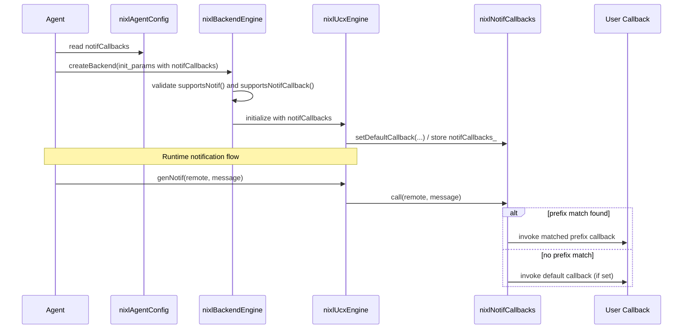

# [PR #1455] Add Notif Callbacks

source: https://github.com/ai-dynamo/nixl/pull/1455
state: open | updated: 2026-09-15T14:03:58Z
labels: external-contribution, size/L

## 正文

## What?
Add configurable user-defined callbacks for received notifications.

The callbacks are called on the context of the thread that receives the notifications with the understanding that any non-trivial work needs to be handed off to a different thread (this leaves a choice of whether the inter-thread communication overhead is warranted).

A callback can be registered for a "tag", the prefix of the notification message (these prefixes of the notifications do not have a delimiter; the expected main use case is for a small number of equal-length prefixes to be registered).

The set of callbacks is determined at agent creation time as changing later is not a current requirement (this allows the data structure with the callbacks to be `const` meaning it never requires any locking).

In this PR the backend-specific part is implemented and tested for the UCX backend.


<!-- This is an auto-generated comment: release notes by coderabbit.ai -->
## Summary by CodeRabbit

* **New Features**
  * Notification callback system with prefix-based routing and configurable default handler.
  * Backend API exposes an optional notification-callback capability; UCX backend implements and uses it.
  * Configuration now carries default and prefix-specific notification callbacks into backend initialization.

* **Bug Fixes**
  * Backends are rejected when callbacks are configured but the backend lacks notification/callback support.

* **Tests**
  * Added tests validating callback registration, routing, default fallback, and threaded behavior.
<!-- end of auto-generated comment: release notes by coderabbit.ai -->

## 评论 (34)

### github-actions[bot] · 2026-03-24

👋 Hi ColinNV! Thank you for contributing to ai-dynamo/nixl.

Your PR reviewers will review your contribution then trigger the CI to test your changes.

🚀

### coderabbitai[bot] · 2026-03-24

<!-- This is an auto-generated comment: summarize by coderabbit.ai -->
<!-- This is an auto-generated comment: review paused by coderabbit.ai -->

> [!NOTE]
> ## Reviews paused
> 
> It looks like this branch is under active development. To avoid overwhelming you with review comments due to an influx of new commits, CodeRabbit has automatically paused this review. You can configure this behavior by changing the `reviews.auto_review.auto_pause_after_reviewed_commits` setting.
> 
> Use the following commands to manage reviews:
> - `@coderabbitai resume` to resume automatic reviews.
> - `@coderabbitai review` to trigger a single review.
> 
> Use the checkboxes below for quick actions:
> - [ ] <!-- {"checkboxId": "7f6cc2e2-2e4e-497a-8c31-c9e4573e93d1"} --> ▶️ Resume reviews
> - [ ] <!-- {"checkboxId": "e9bb8d72-00e8-4f67-9cb2-caf3b22574fe"} --> 🔍 Trigger review

<!-- end of auto-generated comment: review paused by coderabbit.ai -->
<!-- walkthrough_start -->

<details>
<summary>📝 Walkthrough</summary>

## Walkthrough

Adds a prefix-based notification callback dispatcher, exposes it via agent/backend init, and integrates it into the UCX backend. Backends can advertise callback support; configured callbacks are validated and dispatched at runtime. New unit tests cover registration failures, default-callback, and prefix matching behavior.

## Changes

|Cohort / File(s)|Summary|
|---|---|
|**Callback core** <br> `src/api/cpp/backend/notif_callbacks.h`|New callback types and `nixlNotifCallbacks` class: default callback, prefix registrations with validation, common-prefix tracking, binary-search fast-path and linear-scan fallback; methods: `addCallback`, `setDefaultCallback`, `call`, and query helpers.|
|**API integration & params** <br> `src/api/cpp/backend/backend_aux.h`, `src/api/cpp/backend/backend_engine.h`, `src/api/cpp/nixl_params.h`|Added `notifCallbacks` field to `nixlBackendInitParams` and `nixlAgentConfig`; updated include guards/includes; added virtual `supportsNotifCallback()` (default false) to `nixlBackendEngine`.|
|**Agent logic** <br> `src/core/nixl_agent.cpp`|Forwards `config_.notifCallbacks` into backend init; tightens capability checks: remote-capable backends must support notif, and configured callbacks require `supportsNotifCallback()`.|
|**UCX plugin** <br> `src/plugins/ucx/ucx_backend.h`, `src/plugins/ucx/ucx_backend.cpp`|UCX engine overrides `supportsNotifCallback()` (returns true), stores `notifCallbacks_`, adds `setDefaultCallback()` helper (provides default forwarding to `appendNotif`), and dispatches received AM notifications via `notifCallbacks_.call(...)`.|
|**Build / install** <br> `meson.build`|Installs new public header `src/api/cpp/backend/notif_callbacks.h` into `prefix_inc + '/backend'` when header installation is enabled.|
|**Tests** <br> `test/gtest/meson.build`, `test/gtest/notif_callbacks.cpp`|Adds test source and new GoogleTest suite covering invalid registrations, default-callback behavior, prefix matching (binary and linear), using promise/future sync to assert callbacks invoked and notification queue cleared.|

## Sequence Diagram



## Estimated code review effort

🎯 4 (Complex) | ⏱️ ~50 minutes

</details>

<!-- walkthrough_end -->
<!-- pre_merge_checks_walkthrough_start -->

<details>
<summary>🚥 Pre-merge checks | ✅ 2 | ❌ 1</summary>

### ❌ Failed checks (1 warning)

|     Check name     | Status     | Explanation                                                                           | Resolution                                                                         |
| :----------------: | :--------- | :------------------------------------------------------------------------------------ | :--------------------------------------------------------------------------------- |
| Docstring Coverage | ⚠️ Warning | Docstring coverage is 18.18% which is insufficient. The required threshold is 80.00%. | Write docstrings for the functions missing them to satisfy the coverage threshold. |

<details>
<summary>✅ Passed checks (2 passed)</summary>

|     Check name    | Status   | Explanation                                                                                                                                                                                                                                                                 |
| :---------------: | :------- | :-------------------------------------------------------------------------------------------------------------------------------------------------------------------------------------------------------------------------------------------------------------------------- |
|    Title check    | ✅ Passed | The title 'Add Notif Callbacks' clearly and concisely summarizes the main feature addition across all changed files—implementing configurable notification callbacks throughout the codebase.                                                                               |
| Description check | ✅ Passed | The PR description covers all required template sections: 'What?' explains the feature (callbacks for received notifications), 'Why?' provides justification (determined at agent creation for const data structure), and covers additional context about design decisions. |

</details>

<sub>✏️ Tip: You can configure your own custom pre-merge checks in the settings.</sub>

</details>

<!-- pre_merge_checks_walkthrough_end -->
<!-- finishing_touch_checkbox_start -->

<details>
<summary>✨ Finishing Touches</summary>

<details>
<summary>🧪 Generate unit tests (beta)</summary>

- [ ] <!-- {"checkboxId": "f47ac10b-58cc-4372-a567-0e02b2c3d479", "radioGroupId": "utg-output-choice-group-unknown_comment_id"} -->   Create PR with unit tests

</details>

</details>

<!-- finishing_touch_checkbox_end -->
<!-- tips_start -->

---


<sub>Comment `@coderabbitai help` to get the list of available commands.</sub>

<!-- tips_end -->

### ColinNV · 2026-03-24

/build

### ColinNV · 2026-03-24

/build

### ColinNV · 2026-03-25

/build

### ColinNV · 2026-03-25

/build

### ColinNV · 2026-03-28

/build

### ColinNV · 2026-04-07

/build

### ColinNV · 2026-04-09

/build

### ColinNV · 2026-04-12

/build

### ColinNV · 2026-04-12

/build

### ColinNV · 2026-04-13

/build

### ColinNV · 2026-04-13

/build

### aranadive · 2026-04-13

@ColinNV please add nixlbench support as well in the PR.

### brminich · 2026-04-13

> @ColinNV please add nixlbench support as well in the PR.

let's target it for a separate PR, as this one is already quite large

### mkhazraee · 2026-04-13

LGTM as long as the polling getNotifs is the fallback for a notification that didn't match (I think it is). Other than that just a minor comment to update a comment about what that map means.

### ColinNV · 2026-04-14

/build

### ColinNV · 2026-04-14

/build

### ColinNV · 2026-04-14

/build

### ColinNV · 2026-04-23

/build

### ColinNV · 2026-05-05

/build

### ColinNV · 2026-05-05

/build

### ColinNV · 2026-05-13

/build

### brminich · 2026-06-04

/build

### ColinNV · 2026-06-11

/build

### ColinNV · 2026-06-15

/build

### ColinNV · 2026-06-30

/build

### ColinNV · 2026-07-20

/build

### svc-nixl · 2026-07-20

🤖 **CI Triage Agent** — `nixl-ci-gpu` · commit `1314cce1`

**TL;DR:** The `nixl-ci-gpu` #2847 "Run Nixlbench tests" stage (v1.22.x branch) was killed with exit code 143 after Jenkins SIGTERM'd it, but the real cause is a ~17-minute hang in the UCCL backend's teardown after the "UCCL / ETCD / READ / DRAM→VRAM" benchmark — the process printed "Engine destroyed" at 11:59:49 and then produced zero output until the 12:17:08 kill. Investigate the UCCL engine destroy / connection-close path rather than raising the timeout.

<details><summary>Full analysis</summary>

**Summary:** Stage 318 ("Run Nixlbench tests", v1.22.x) aborted with exit code 143 (SIGTERM) after Jenkins timed it out; the UCCL nixlbench worker hung during shutdown of the ETCD/UCCL READ DRAM→VRAM iteration.

**Root cause:** This is a HANG, not a slow test. The last meaningful application log line is at `11:59:49.436` — `Engine destroyed` and `[WARN ... event_loop rdma/epoll_client.h:207] Error/HUP on connection: 1.1.101.1:46199` for the `UCCL --op_type READ --initiator_seg_type DRAM --target_seg_type VRAM` ETCD run. The very next benchmark in the loop (UCCL READ DRAM→DRAM) never emitted a single line (no "Connecting to ETCD"/"Creating Engine"). There is then a ~17.3-minute gap of complete silence until `12:17:08.620 Sending interrupt signal to process` → `script returned exit code 143`. So one or both UCCL workers deadlocked in the engine-destroy / RDMA connection-teardown path after the transfer completed (the transfer results were already printed). The subsequent Jenkins channel-closed and `enroot export failed` messages are downstream symptoms of the node being torn down. Note the parallel ucx-master branch's Nixlbench stage (356) passed in ~590s, so this is specific to the UCCL teardown exercised on this run.

**Implicated commit:** Not definitively identified from logs. The UCCL transfer/connection path was most recently changed by `[REDACTED:Hex High Entropy String]` "Enable local xfer for UCCL backend (#1428)" and `[REDACTED:Hex High Entropy String]` "UCCL: Simplify and Optimize for batch transfers (#1271)", both by Pravein Govindan Kannan — the UCCL engine/connection lifecycle is the area to audit for the deadlock.

**File:** `src/plugins/uccl/uccl_backend.cpp` (UCCL engine destroy / disconnect path; hang occurs after "Engine destroyed" is logged). The `Error/HUP on connection` originates from `rdma/epoll_client.h:207` in the UCCL/RDMA layer.

**Suggested fix:** Do NOT raise the Jenkins time limit — that only masks the hang. Reproduce the `UCCL` `READ DRAM→VRAM` ETCD two-worker run in isolation and capture stack traces of both nixlbench processes (e.g. `gdb -p`/`py-spy`/`pstack`) at the hang point. Focus on the UCCL engine-destroy / connection-close sequence: a likely candidate is a join/wait on the UCCL progress thread or an ETCD rendezvous barrier that blocks when the peer has already closed its connection (the `Error/HUP on connection` immediately precedes the silence). Add a bounded timeout/interrupt to the teardown wait and ensure both peers exit the barrier symmetrically. As a CI stop-gap, wrap each nixlbench invocation in a `timeout` so a single hung iteration fails fast with diagnostics instead of consuming the whole stage budget.

**Related:** PRs touching the implicated path: #1428 (Enable local xfer for UCCL backend), #1271 (UCCL simplify/optimize batch transfers), #1151 (Fix UCCL's consistency checks), #895 (Add UCCL backend). No existing issue found for this specific teardown hang.

</details>


> 🛡️ This comment had 1 potential secret(s) redacted (Hex High Entropy String). See request_id `8045db7e-df15-40be-a1dc-df5179eb58db` in the triage console for the audit trail.

<!-- triage-agent request_id: 8045db7e-df15-40be-a1dc-df5179eb58db -->
<!-- triage-agent-bot -->

### ColinNV · 2026-08-04

/build

### ColinNV · 2026-08-04

/build

### ColinNV · 2026-09-15

/build

### svc-nixl · 2026-09-15

🤖 **CI Triage Agent** — `nixl-ci-build-container-pr` · commit `e55f25c1`

**TL;DR:** All four parallel `Build image` stages fail at the same Dockerfile step — `uv pip install torch` against `https://download.pytorch.org/whl/cu134`, an index that has no cp312 wheels — because the base image was bumped to `cuda13.4` and the index URL is derived mechanically from `CUDA_VERSION`. Pin/map the PyTorch index to a version that actually publishes wheels (e.g. `cu130`) instead of computing `cu134` from `CUDA_VERSION`.

<details><summary>Full analysis</summary>

**Summary:** Container build fails in `contrib/Dockerfile` at the PyTorch install step; identical failure in all 4 parallel `Build image` stages (x86 and arm64), so the whole `Parallel` stage fails.

**Root cause:** Line 336 of `contrib/Dockerfile` builds the wheel index as `https://download.pytorch.org/whl/cu$(echo $CUDA_VERSION | cut -d. -f1,2 | tr -d .)`. With the base image now at `26.08-cuda13.4-devel-ubuntu24.04`, `CUDA_VERSION=13.4` yields `cu134`, an index that carries no modern torch wheels. uv reports exactly this:

```
error: No solution found when resolving dependencies
  cause: Because all versions of torch have no wheels with a matching Python ABI tag (e.g., `cp312`) ...
hint: `torch` was found on https://download.pytorch.org/whl/cu134, but not at the requested version
hint: You require CPython 3.12 (`cp312`), but we only found wheels for `torch` (v2.0.1) with the
      following Python ABI tags: `cp38`, `cp39`, `cp310`, `cp311`
subprocess exited with status 1
Error: building at STEP "RUN if /usr/bin/python${DEFAULT_PYTHON_VERSION} -c "import torch; ...": exit status 1
```

The base image ships no torch, so the `if` probe fails and the `else` branch (the broken index) is always taken. This is a deterministic build error, not a hang or infra problem — the logs show continuous progress right up to the failing RUN, and the failure is reproduced identically on all four build variants.

**Implicated commit:** `[REDACTED:Hex High Entropy String]` — "build: bump CUDA and CI base images, stop restating them across CI (#2205)", NirWolfer (bumped `BASE_IMAGE_TAG`/`CUOBJ_DEV_IMAGE` to `cuda13.4`, which is what turns the derived index into the nonexistent `cu134`). The fragile derivation itself predates it.

**File:** `contrib/Dockerfile:336` (RUN block at lines 333–338; base image tags at lines 17 and 23)

**Suggested fix:** Stop deriving the wheel index from the exact CUDA patch version. Either:
1. Introduce an explicit `ARG TORCH_CUDA_INDEX=cu130` (the newest index PyTorch actually publishes cp312 wheels for) and use `export UV_INDEX="https://download.pytorch.org/whl/${TORCH_CUDA_INDEX}"`, keeping it bumped deliberately alongside `BASE_IMAGE_TAG`; or
2. Map CUDA major/minor to the nearest supported index and fail loudly if the mapping is missing, rather than silently constructing a URL that resolves to a stale torch 2.0.1.

Adding `--index-strategy unsafe-best-match` (as uv's hint suggests) would let it fall back to PyPI, but that gets you the default-CUDA build rather than a CUDA 13 one — prefer the explicit pin. Also worth asserting the installed torch is `>=2.7` after install so a wrong index fails at build time with a clear message.

**Related:** #2205 (CUDA/base image bump that exposed this); #2250 ("build: bump DOCA to 3.5") touches the same base-image plumbing and will hit the same wall until the index is fixed.

</details>


> 🛡️ This comment had 1 potential secret(s) redacted (Hex High Entropy String). See request_id `ba62c27c-95b5-46fa-b79f-fe877008c7e2` in the triage console for the audit trail.

<!-- triage-agent request_id: ba62c27c-95b5-46fa-b79f-fe877008c7e2 -->
<!-- triage-agent gha_run_id: status:SC_kwDOODt2nc8AAAAMnsBQ-w -->
<!-- triage-agent-bot -->

### svc-nixl · 2026-09-15

🤖 **CI Triage Agent** — `nixl-ci-build-container-pr` · commit `e55f25c1`

**TL;DR:** All four parallel `Build image` stages died at the same Dockerfile step — `uv pip install torch torchvision torchaudio` against `https://download.pytorch.org/whl/cu134`, an index that has no cp312 torch wheels — because the index URL is derived mechanically from `CUDA_VERSION` (13.4) after the base image was bumped to CUDA 13.4. Pin/map the wheel index to a published CUDA channel (or add a PyPI fallback with `--index-strategy unsafe-best-match`).

<details><summary>Full analysis</summary>

**Summary:** `nixl-ci-build-container-pr` #649: every parallel container build failed at Dockerfile STEP "install PyTorch" with `uv` exiting 1 (`Error: building at STEP "RUN if ... uv pip install --system torch torchvision torchaudio ..." : exit status 1`).

**Root cause:** Not related to the PR's code. The Dockerfile computes the PyTorch wheel index from the CUDA version of the base image:

```
export UV_INDEX="https://download.pytorch.org/whl/cu$(echo $CUDA_VERSION | cut -d. -f1,2 | tr -d .)"
```

With `BASE_IMAGE_TAG=26.08-cuda13.4-devel-ubuntu24.04`, `CUDA_VERSION=13.4` → `cu134`. uv reports from that index:

```
error: No solution found when resolving dependencies
  cause: Because all versions of torch have no wheels with a matching Python ABI tag (e.g., `cp312`) ...
hint: `torch` was found on https://download.pytorch.org/whl/cu134, but not at the requested version
hint: You require CPython 3.12 (`cp312`), but we only found wheels for `torch` (v2.0.1) with ABI tags: cp38, cp39, cp310, cp311
```

So the `cu134` channel does not publish cp312 wheels for a usable torch. The fallback branch is reached at all because this base image has no system torch ≥2.7 (the `import torch` probe fails), and uv is additionally pinned to a single index (`UV_INDEX` with default `first-index` strategy), so it cannot fall back to PyPI. The build reached the step normally — UCX, libfabric, aws-sdk-cpp, azure-sdk, gusli all built fine, with no timestamp gaps — so this is a hard dependency-resolution failure, not a hang or an infra fault.

**Implicated commit:** `[REDACTED:Hex High Entropy String]` — NirWolfer, "build: bump CUDA and CI base images, stop restating them across CI (#2205)" (moved the base image to `cuda13.4`, making the derived index `cu134`).

**File:** `contrib/Dockerfile:333-338` (index derivation on line 336; base image tag at `contrib/Dockerfile:17`)

**Suggested fix:** Stop deriving the wheel channel blindly from `CUDA_VERSION`. Either of:

1. Introduce an explicit build arg, e.g. `ARG TORCH_CUDA_CHANNEL="cu130"`, and use it instead of the `cut`/`tr` expression — keeping it as a deliberate, reviewable pin that tracks whatever channel PyTorch actually publishes cp312 wheels for.
2. Or make the fallback resilient by adding PyPI as a secondary index and allowing cross-index resolution:
   ```
   uv pip install --system \
       --index "https://download.pytorch.org/whl/cu${CH}" \
       --index https://pypi.org/simple \
       --index-strategy unsafe-best-match \
       torch torchvision torchaudio
   ```
   (uv's `--torch-backend=auto` is another option and picks a valid channel for the detected driver/CUDA.)

Also worth asserting explicitly: if no valid channel exists for the base image's CUDA, fail with a clear message rather than a confusing resolver error.

**Related:** none found (no existing issue/PR matches this error signature).

</details>


> 🛡️ This comment had 1 potential secret(s) redacted (Hex High Entropy String). See request_id `145a3d80-91a2-45af-90d9-d14adb94ef4b` in the triage console for the audit trail.

<!-- triage-agent request_id: 145a3d80-91a2-45af-90d9-d14adb94ef4b -->
<!-- triage-agent gha_run_id: status:SC_kwDOODt2nc8AAAAMnsnsog -->
<!-- triage-agent-bot -->

## Review (60)

### coderabbitai[bot] · 2026-03-24 · COMMENTED

**Actionable comments posted: 4**

<details>
<summary>🤖 Prompt for all review comments with AI agents</summary>

```
Verify each finding against the current code and only fix it if needed.

Inline comments:
In `@src/api/cpp/backend/notif_callbacks.h`:
- Around line 89-90: The private helper member functions call_default,
call_binary_search, and call_linear_scan violate the header naming convention;
rename them to lowerCamelCase (e.g., callDefault, callBinarySearch,
callLinearScan) and update all declarations and definitions and any call sites
(both in this header and corresponding implementation files) to use the new
names so the class compiles and follows the repository convention.
- Around line 62-75: Replace the assert-based guards in addCallback(const
std::string &prefix, const nixl_notif_callback_t &callback) with explicit
runtime validation: throw std::invalid_argument (or another appropriate
exception) if prefix.empty() or if callback is empty, check callbacks_ for exact
duplicates or prefix-overlap (e.g., an existing prefix is a prefix of the new
one or vice-versa) and reject with an error to avoid silent shadowing, then
update common_size_ as before only after the validated insert; also update the
dispatch logic that compares prefixes and invokes callbacks to defensively
verify the chosen callback is non-empty and that prefix comparisons don't rely
on empty prefixes (treat empty prefix as invalid), so runtime errors cannot
occur in release builds.
- Around line 20-24: The header notif_callbacks.h uses std::sort and
std::lower_bound but doesn't include <algorithm>, causing downstream consumers
to fail when include order changes; add a direct include for <algorithm> near
the other includes in notif_callbacks.h so that symbols used by functions that
call std::sort and std::lower_bound are guaranteed to be declared.

In `@test/gtest/notif_callbacks.cpp`:
- Around line 34-45: The helper createBackend() (and similar setup helpers like
loadMetadataFrom()) uses ASSERT_* which only returns from the helper and can
leave members like backend, memories, params uninitialized; change these
ASSERT_EQ/ASSERT_NE calls to EXPECT_EQ/EXPECT_NE so failures are recorded but
allow proper teardown, or keep ASSERT_* but ensure callers wrap the call with
ASSERT_NO_FATAL_FAILURE(agent1.createBackend()) so setup failures propagate and
abort the test—update references in the helper for agent.getPluginParams,
agent.createBackend, and any tests constructing agentPair to use
ASSERT_NO_FATAL_FAILURE when calling these helpers.
```

</details>

---

<details>
<summary>ℹ️ Review info</summary>

<details>
<summary>⚙️ Run configuration</summary>

**Configuration used**: Path: .coderabbit.yaml

**Review profile**: ASSERTIVE

**Plan**: Pro

**Run ID**: `f0342f18-6e58-49d5-a247-065073088f37`

</details>

<details>
<summary>📥 Commits</summary>

Reviewing files that changed from the base of the PR and between 8e32438127ea8e5143ace7c6f7ca01cac08f5e57 and 48329aaeb1e5d646317edc7961717f210089fba0.

</details>

<details>
<summary>📒 Files selected for processing (10)</summary>

* `meson.build`
* `src/api/cpp/backend/backend_aux.h`
* `src/api/cpp/backend/backend_engine.h`
* `src/api/cpp/backend/notif_callbacks.h`
* `src/api/cpp/nixl_params.h`
* `src/core/nixl_agent.cpp`
* `src/plugins/ucx/ucx_backend.cpp`
* `src/plugins/ucx/ucx_backend.h`
* `test/gtest/meson.build`
* `test/gtest/notif_callbacks.cpp`

</details>

</details>

<!-- This is an auto-generated comment by CodeRabbit for review status -->

### coderabbitai[bot] · 2026-03-24 · COMMENTED

**Actionable comments posted: 3**

<details>
<summary>♻️ Duplicate comments (1)</summary><blockquote>

<details>
<summary>src/api/cpp/backend/notif_callbacks.h (1)</summary><blockquote>

`62-76`: _⚠️ Potential issue_ | _🟠 Major_

**Replace assertions with runtime validation in `addCallback()`.**

The assertions on lines 64-65 provide no protection in release builds (when `NDEBUG` is defined), allowing invalid state to persist:
- An empty prefix would match unintended messages
- A null `std::function` causes undefined behavior when invoked

Since this is a public configuration API, consider throwing `std::invalid_argument` or returning an error status instead of silently accepting broken state in release builds.

<details>
<summary>🤖 Prompt for AI Agents</summary>

```
Verify each finding against the current code and only fix it if needed.

In `@src/api/cpp/backend/notif_callbacks.h` around lines 62 - 76, In
addCallback(), replace the assert-based validation with runtime checks that
throw std::invalid_argument when inputs are invalid: if prefix.empty() throw
std::invalid_argument("addCallback: prefix must not be empty"), and if !callback
(or callback == nullptr) throw std::invalid_argument("addCallback: callback must
be non-null"); keep the rest of the logic that emplaces into callbacks_ and
updates common_size_/sorting intact (i.e., callbacks_.emplace_back(prefix,
callback); then adjust common_size_ and sort as before), and include the
necessary <stdexcept> header or project equivalent for exceptions.
```

</details>

</blockquote></details>

</blockquote></details>

<details>
<summary>🤖 Prompt for all review comments with AI agents</summary>

```
Verify each finding against the current code and only fix it if needed.

Inline comments:
In `@src/api/cpp/backend/notif_callbacks.h`:
- Around line 29-41: Add Doxygen comment blocks describing the public struct
nixlNotifCallback and its members: explain the struct represents a registered
notification callback pair (prefix and callback function), document the
constructor parameters, and document the std::string prefix and
nixl_notif_callback_t callback members; also add a brief comment for the
operator< overload describing it provides lexicographical ordering by prefix for
use in sorted containers. Place these comments immediately above the struct
definition and the operator< declaration so they appear in generated API docs.
- Around line 43-87: Add Doxygen-style comments to the public API of class
nixlNotifCallbacks: document the class purpose and thread-safety/ownership
expectations, then add per-method docs for hasAnyCallback(),
hasDefaultCallback(), setDefaultCallback(const nixl_notif_callback_t&),
addCallback(const std::string&, const nixl_notif_callback_t&), and
call(std::string&&, std::string&&). For each method include a brief description,
`@param` tags describing parameters (e.g. prefix meaning and callback
requirements), `@return` or `@retval` for booleans, `@note` for behaviors like
noexcept on has* methods, assert preconditions in addCallback, the logic that
setDefaultCallback installs the fallback, and that call selects
callDefault/callBinarySearch/callLinearScan based on callbacks_ and
common_size_. Keep comments concise and follow Doxygen style (/** ... */) above
each public declaration.
- Around line 101-107: The std::lower_bound call that searches callbacks_ is
confusing because the lambda comparator for nixlNotifCallback vs std::string
captures prefix and ignores the std::string parameter r; update the comparator
used in the lower_bound invocation in notif_callbacks (the lambda comparing
nixlNotifCallback::prefix) so the unused parameter is marked [[maybe_unused]] or
unnamed, and pass the actual search key (prefix or a std::string_view of prefix)
to std::lower_bound instead of message so the key and comparator match;
reference the lower_bound call, callbacks_, nixlNotifCallback and the lambda
comparator when making this change.

---

Duplicate comments:
In `@src/api/cpp/backend/notif_callbacks.h`:
- Around line 62-76: In addCallback(), replace the assert-based validation with
runtime checks that throw std::invalid_argument when inputs are invalid: if
prefix.empty() throw std::invalid_argument("addCallback: prefix must not be
empty"), and if !callback (or callback == nullptr) throw
std::invalid_argument("addCallback: callback must be non-null"); keep the rest
of the logic that emplaces into callbacks_ and updates common_size_/sorting
intact (i.e., callbacks_.emplace_back(prefix, callback); then adjust
common_size_ and sort as before), and include the necessary <stdexcept> header
or project equivalent for exceptions.
```

</details>

---

<details>
<summary>ℹ️ Review info</summary>

<details>
<summary>⚙️ Run configuration</summary>

**Configuration used**: Path: .coderabbit.yaml

**Review profile**: ASSERTIVE

**Plan**: Pro

**Run ID**: `966628e4-62b0-4cbe-b546-c792c77cf01a`

</details>

<details>
<summary>📥 Commits</summary>

Reviewing files that changed from the base of the PR and between 48329aaeb1e5d646317edc7961717f210089fba0 and e79bb30bb6f5894ae3173530fd9b59af6e4d350d.

</details>

<details>
<summary>📒 Files selected for processing (1)</summary>

* `src/api/cpp/backend/notif_callbacks.h`

</details>

</details>

<!-- This is an auto-generated comment by CodeRabbit for review status -->

### guy-ealey-morag · 2026-03-24 · COMMENTED

(no text)

### ColinNV · 2026-03-25 · COMMENTED

(no text)

### ColinNV · 2026-03-25 · COMMENTED

(no text)

### ColinNV · 2026-03-25 · COMMENTED

(no text)

### ColinNV · 2026-03-25 · COMMENTED

(no text)

### ColinNV · 2026-03-25 · COMMENTED

(no text)

### coderabbitai[bot] · 2026-03-25 · COMMENTED

**Actionable comments posted: 3**

<details>
<summary>♻️ Duplicate comments (1)</summary><blockquote>

<details>
<summary>test/gtest/notif_callbacks.cpp (1)</summary><blockquote>

`34-45`: _⚠️ Potential issue_ | _🟡 Minor_

**Wrap helper calls with `ASSERT_NO_FATAL_FAILURE` to propagate setup failures.**

The `ASSERT_*` macros in `createBackend()` and `loadMetadataFrom()` only return from the helper function, not from the test. If an assertion fails, construction continues with partially initialized state (e.g., `backend` remains `nullptr`), potentially causing confusing secondary failures.


<details>
<summary>Recommended fix in agentPair constructor</summary>

```diff
     explicit agentPair(const nixlAgentConfig &cfg) : agent1(name1, cfg), agent2(name2, cfg) {
-        agent1.createBackend();
-        agent2.createBackend();
-        agent1.loadMetadataFrom(agent2, name2);
+        ASSERT_NO_FATAL_FAILURE(agent1.createBackend());
+        ASSERT_NO_FATAL_FAILURE(agent2.createBackend());
+        ASSERT_NO_FATAL_FAILURE(agent1.loadMetadataFrom(agent2, name2));
     }
```

Note: `ASSERT_NO_FATAL_FAILURE` cannot be used directly in a constructor. Consider moving initialization to a separate `init()` method called from each test, or use a test fixture with `SetUp()`.
</details>


Also applies to: 47-60

<details>
<summary>🤖 Prompt for AI Agents</summary>

```
Verify each finding against the current code and only fix it if needed.

In `@test/gtest/notif_callbacks.cpp` around lines 34 - 45, The helper functions
(createBackend and loadMetadataFrom) use ASSERT_* which only returns from the
helper and won't halt the test on failure; wrap their calls with
ASSERT_NO_FATAL_FAILURE so failures propagate to the test, and refactor
initialization out of the agentPair constructor into a separate init() method
(or use a test fixture SetUp()) so ASSERT_NO_FATAL_FAILURE can be used from each
test; update tests to call agentPair::init() (or rely on SetUp) and replace
direct helper calls with ASSERT_NO_FATAL_FAILURE(createBackend()) and
ASSERT_NO_FATAL_FAILURE(loadMetadataFrom()) to prevent continuing with partially
initialized state.
```

</details>

</blockquote></details>

</blockquote></details>

<details>
<summary>🤖 Prompt for all review comments with AI agents</summary>

```
Verify each finding against the current code and only fix it if needed.

Inline comments:
In `@src/api/cpp/backend/notif_callbacks.h`:
- Around line 105-108: The single long return statement in isPrefixOf violates
the 100-character line limit; refactor the function by breaking the logic across
multiple lines (e.g., compute prefix.size() and string.size() into local
variables or split the boolean expression onto separate lines) so each line is
<=100 chars while preserving the semantics and noexcept; update the return to
use the shortened lines inside the static bool isPrefixOf(const std::string
&prefix, const std::string &string) noexcept function.
- Around line 90-98: Run clang-format on the header to fix the formatting
mismatch: apply clang-format -i to src/api/cpp/backend/notif_callbacks.h and
commit the result; if clang-format still flags the throw message lines inside
checkNewCallback (function name: checkNewCallback) then break or rewrap the long
string literals (the two throw std::runtime_error messages: "Empty notification
callback function not allowed with prefix" and "Empty notification callback
prefix is not allowed") into the style clang-format expects (e.g., split into
concatenated literal parts or reflow to shorter lines) and re-run clang-format
until CI passes.

In `@test/gtest/notif_callbacks.cpp`:
- Around line 97-99: Add a codespell ignore comment or rename the literal to a
variable to silence CI for the intentional test strings; specifically update the
EXPECT_THROW calls that call cbs.addCallback("f", ...), cbs.addCallback("fo",
...), and cbs.addCallback("foo", ...) by either prefixing the line(s) with the
codespell ignore directive or replacing the string literals with named constants
(e.g., overlap_prefix_f/overlap_prefix_fo) used in cbs.addCallback to make the
intent explicit and avoid the codespell false positive.

---

Duplicate comments:
In `@test/gtest/notif_callbacks.cpp`:
- Around line 34-45: The helper functions (createBackend and loadMetadataFrom)
use ASSERT_* which only returns from the helper and won't halt the test on
failure; wrap their calls with ASSERT_NO_FATAL_FAILURE so failures propagate to
the test, and refactor initialization out of the agentPair constructor into a
separate init() method (or use a test fixture SetUp()) so
ASSERT_NO_FATAL_FAILURE can be used from each test; update tests to call
agentPair::init() (or rely on SetUp) and replace direct helper calls with
ASSERT_NO_FATAL_FAILURE(createBackend()) and
ASSERT_NO_FATAL_FAILURE(loadMetadataFrom()) to prevent continuing with partially
initialized state.
```

</details>

---

<details>
<summary>ℹ️ Review info</summary>

<details>
<summary>⚙️ Run configuration</summary>

**Configuration used**: Path: .coderabbit.yaml

**Review profile**: ASSERTIVE

**Plan**: Pro

**Run ID**: `27fd40d0-4f93-46a5-bed9-29867e29dfdf`

</details>

<details>
<summary>📥 Commits</summary>

Reviewing files that changed from the base of the PR and between e79bb30bb6f5894ae3173530fd9b59af6e4d350d and 5c426b6a2f73bde7dcb8d664ae4684b1cb0e7531.

</details>

<details>
<summary>📒 Files selected for processing (3)</summary>

* `src/api/cpp/backend/notif_callbacks.h`
* `src/core/nixl_agent.cpp`
* `test/gtest/notif_callbacks.cpp`

</details>

</details>

<!-- This is an auto-generated comment by CodeRabbit for review status -->

### guy-ealey-morag · 2026-03-25 · COMMENTED

(no text)

### ColinNV · 2026-03-25 · COMMENTED

(no text)

### guy-ealey-morag · 2026-03-25 · COMMENTED

(no text)

### ColinNV · 2026-03-25 · COMMENTED

(no text)

### coderabbitai[bot] · 2026-03-25 · COMMENTED

**Actionable comments posted: 1**

<details>
<summary>🤖 Prompt for all review comments with AI agents</summary>

```
Verify each finding against the current code and only fix it if needed.

Inline comments:
In `@test/gtest/notif_callbacks.cpp`:
- Line 85: The test assertion references the incorrect constant name
NILX_SUCCESS; update the assertion in notif_callbacks.cpp (the ASSERT_EQ(status,
NILX_SUCCESS) line) to use the correctly spelled constant NIXL_SUCCESS so the
test compares status against the intended success constant.
```

</details>

---

<details>
<summary>ℹ️ Review info</summary>

<details>
<summary>⚙️ Run configuration</summary>

**Configuration used**: Path: .coderabbit.yaml

**Review profile**: ASSERTIVE

**Plan**: Pro

**Run ID**: `433a50c3-278a-4056-81b7-85424d7345f8`

</details>

<details>
<summary>📥 Commits</summary>

Reviewing files that changed from the base of the PR and between 2edcd21c948d82298bc2a65a954206e397f9ba6e and 09c4ad507a3481a7ca630247edd6c8c8af41ce6d.

</details>

<details>
<summary>📒 Files selected for processing (1)</summary>

* `test/gtest/notif_callbacks.cpp`

</details>

</details>

<!-- This is an auto-generated comment by CodeRabbit for review status -->

### guy-ealey-morag · 2026-03-25 · DISMISSED

(no text)

### iyastreb · 2026-03-30 · COMMENTED

(no text)

### ColinNV · 2026-03-30 · COMMENTED

(no text)

### ColinNV · 2026-03-30 · COMMENTED

(no text)

### ColinNV · 2026-03-30 · COMMENTED

(no text)

### ColinNV · 2026-03-30 · COMMENTED

(no text)

### ColinNV · 2026-03-30 · COMMENTED

(no text)

### ColinNV · 2026-03-30 · COMMENTED

(no text)

### ColinNV · 2026-03-30 · COMMENTED

(no text)

### tvegas1 · 2026-03-30 · COMMENTED

(no text)

### ColinNV · 2026-03-30 · COMMENTED

(no text)

### ColinNV · 2026-03-30 · COMMENTED

(no text)

### ColinNV · 2026-03-30 · COMMENTED

(no text)

### iyastreb · 2026-03-31 · COMMENTED

(no text)

### ColinNV · 2026-03-31 · COMMENTED

(no text)

### ColinNV · 2026-03-31 · COMMENTED

(no text)

### ColinNV · 2026-03-31 · COMMENTED

(no text)

### ColinNV · 2026-03-31 · COMMENTED

(no text)

### ColinNV · 2026-03-31 · COMMENTED

(no text)

### ColinNV · 2026-03-31 · COMMENTED

(no text)

### brminich · 2026-03-31 · COMMENTED

(no text)

### iyastreb · 2026-03-31 · COMMENTED

(no text)

### iyastreb · 2026-03-31 · COMMENTED

(no text)

### ColinNV · 2026-04-01 · COMMENTED

(no text)

### ColinNV · 2026-04-01 · COMMENTED

(no text)

### guy-ealey-morag · 2026-04-13 · DISMISSED

(no text)

### tvegas1 · 2026-04-13 · DISMISSED

(no text)

### mkhazraee · 2026-04-13 · COMMENTED

(no text)

### mkhazraee · 2026-04-13 · DISMISSED

(no text)

### ColinNV · 2026-04-14 · COMMENTED

(no text)

### rakhmets · 2026-04-14 · COMMENTED

(no text)

### ColinNV · 2026-04-14 · COMMENTED

(no text)

### ColinNV · 2026-04-14 · COMMENTED

(no text)

### rakhmets · 2026-04-14 · COMMENTED

(no text)

### guy-ealey-morag · 2026-04-14 · DISMISSED

(no text)

### rakhmets · 2026-04-14 · COMMENTED

(no text)

### yosefe · 2026-04-23 · COMMENTED

API LGTM

### guy-ealey-morag · 2026-04-27 · COMMENTED

(no text)

### guy-ealey-morag · 2026-04-27 · DISMISSED

(no text)

### iyastreb · 2026-04-28 · DISMISSED

(no text)

### tvegas1 · 2026-04-28 · DISMISSED

(no text)

### mkhazraee · 2026-04-28 · DISMISSED

(no text)

### mkhazraee · 2026-05-13 · APPROVED

(no text)

### mkhazraee · 2026-05-13 · DISMISSED

(no text)

### tvegas1 · 2026-06-04 · DISMISSED

(no text)

### guy-ealey-morag · 2026-06-11 · DISMISSED

(no text)
