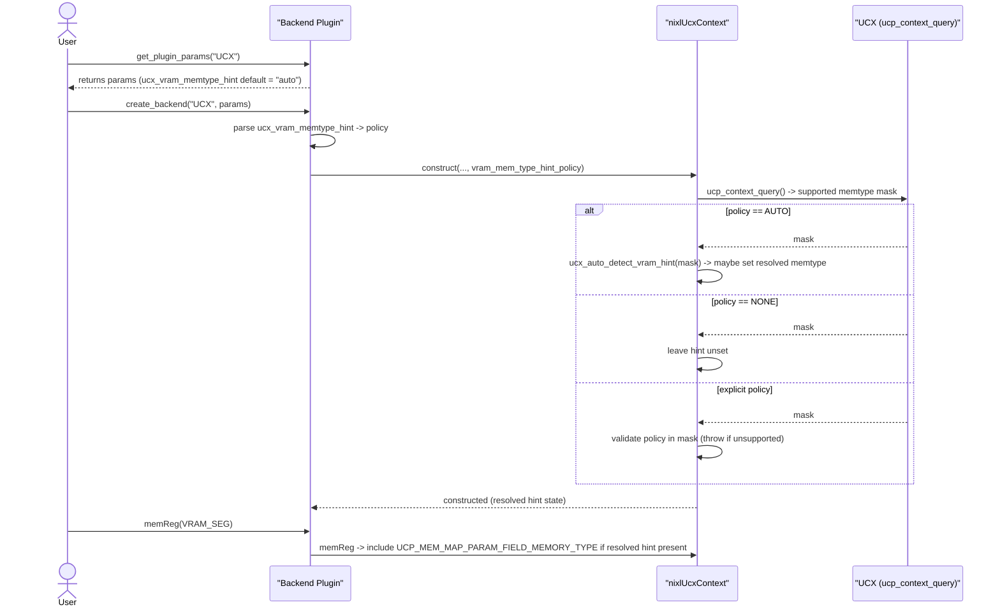

# [PR #1536] NIXL/UCX: enforce VRAM memtype hint query behavior and add tests

source: https://github.com/ai-dynamo/nixl/pull/1536
state: open | updated: 2026-09-23T14:09:11Z
labels: external-contribution, size/L

## 正文

## What?
This PR hardens UCX VRAM memtype hint handling and aligns documentation and
tests with runtime behavior.

- Enforce fail-fast behavior when an explicit `ucx_vram_memtype_hint` is set
  but UCX context memory types cannot be queried.
- Keep `auto` and `none` as non-failing modes that proceed without hinting
  when memory-type queries are unavailable.
- Document the exact supported values for `ucx_vram_memtype_hint`:
  `auto`, `none`, `cuda`, `cuda-managed`, `rocm`, `ze-device`.
- Clarify case-sensitive parsing and failure behavior for explicit hints.
- Add gtests to verify default parameter exposure and rejection of
  case-mismatched values (e.g. `CUDA`).
- Suppress expected error logs in negative-path tests to avoid triggering
  global log-failure checks.

## Why?
Previous behavior around explicit VRAM memtype hints was not fully documented
or covered by tests, which could lead to confusion and fragile failure paths.

This change improves correctness and predictability by:
- Making explicit-hint behavior deterministic when UCX cannot report
  memory-type capabilities.
- Ensuring documentation reflects actual accepted values and parsing rules.
- Adding regression coverage for default and invalid-input paths.

## How?
- Update UCX memory-type resolution to require a successful UCX context
  memory-type query for explicit hint modes.
- Keep `auto` and `none` permissive when queries are unavailable.
- Update backend and Python documentation to reflect exact values and
  failure semantics.
- Add UCX backend parameter tests covering:
  - default `ucx_vram_memtype_hint` exposure (`auto`)
  - rejection of case-mismatched hint values
- Add log-ignore guards for expected error paths in negative tests.

## Testing performed
- Ran the targeted gtest suite via the Meson test wrapper.
- Result: **12 tests from 3 suites passed, 0 failed**.

## Credits
Co-authored-by: Daniel Socek <daniel.socek@intel.com>

<!-- This is an auto-generated comment: release notes by coderabbit.ai -->
## Summary by CodeRabbit

* **Documentation**
  * Added docs for UCX backend initialization parameters and how to override them; documented ucx_error_handling_mode and ucx_vram_memtype_hint, accepted values, defaults, case-sensitivity, and failure semantics.

* **New Features**
  * Added ucx_vram_memtype_hint backend option to control VRAM memory-type hinting (auto, none, explicit accelerator hints; default: auto). Hint is resolved at backend init and applied to VRAM registrations when available.

* **Tests**
  * Added tests verifying ucx_vram_memtype_hint default, case-sensitive handling, and behavior when explicit hints are unsupported or unqueryable.
<!-- end of auto-generated comment: release notes by coderabbit.ai -->

## 评论 (6)

### copy-pr-bot[bot] · 2026-04-15

This pull request requires additional validation before any workflows can run on NVIDIA's runners.

Pull request vetters can view their responsibilities [here](https://docs.gha-runners.nvidia.com/cpr/vetters).

Contributors can view more details about this message [here](https://docs.gha-runners.nvidia.com/cpr/contributors).


### github-actions[bot] · 2026-04-15

👋 Hi yafshar! Thank you for contributing to ai-dynamo/nixl.

Your PR reviewers will review your contribution then trigger the CI to test your changes.

🚀

### coderabbitai[bot] · 2026-04-15

<!-- This is an auto-generated comment: summarize by coderabbit.ai -->
<!-- This is an auto-generated comment: review paused by coderabbit.ai -->

> [!NOTE]
> ## Reviews paused
> 
> It looks like this branch is under active development. To avoid overwhelming you with review comments due to an influx of new commits, CodeRabbit has automatically paused this review. You can configure this behavior by changing the `reviews.auto_review.auto_pause_after_reviewed_commits` setting.
> 
> Use the following commands to manage reviews:
> - `@coderabbitai resume` to resume automatic reviews.
> - `@coderabbitai review` to trigger a single review.
> 
> Use the checkboxes below for quick actions:
> - [ ] <!-- {"checkboxId": "7f6cc2e2-2e4e-497a-8c31-c9e4573e93d1"} --> ▶️ Resume reviews
> - [ ] <!-- {"checkboxId": "e9bb8d72-00e8-4f67-9cb2-caf3b22574fe"} --> 🔍 Trigger review

<!-- end of auto-generated comment: review paused by coderabbit.ai -->
<!-- walkthrough_start -->

<details>
<summary>📝 Walkthrough</summary>

## Walkthrough

Adds a UCX backend initialization option `ucx_vram_memtype_hint` with parsing and string↔enum helpers; UCX context now queries supported memory types during construction, resolves a memtype hint (AUTO/NONE/explicit), validates it, and applies a resolved memtype when registering VRAM segments.

## Changes

|Cohort / File(s)|Summary|
|---|---|
|**Documentation** <br> `docs/BackendGuide.md`, `docs/python_api.md`|New docs describing backend init params and usage: `ucx_vram_memtype_hint` and `ucx_error_handling_mode`, accepted values (`auto`, `none`, `cuda`, `cuda-managed`, `rocm`, `ze-device`), case-sensitive matching, and failure behavior for explicit hints.|
|**UCX core utils & API** <br> `src/plugins/ucx/ucx_utils.h`, `src/plugins/ucx/ucx_utils.cpp`|Add `nixl_ucx_vram_memtype_hint_t` enum and param name constant; implement string↔enum helpers, policy→memtype mapping, `ucx_auto_detect_vram_hint`, supported-memtype tracking, `resolveMemoryTypeConfig()`, store resolved hint, and set memory type param during VRAM `memReg()`.|
|**Backend init** <br> `src/plugins/ucx/ucx_backend.cpp`|Read `ucx_vram_memtype_hint` plugin param in `nixlUcxEngine` constructor (default AUTO) and pass the policy into `nixlUcxContext`.|
|**Examples** <br> `examples/device/ep/csrc/nixl_ep.cpp`|Example UCX init params now include `ucx_vram_memtype_hint = "auto"`.|
|**Tests** <br> `test/gtest/error_handling.cpp`|Add constants and tests verifying the new default `"auto"`, behavior for explicit hints (expect failure when unsupported or unqueryable), and helper to set the plugin directory.|

## Sequence Diagram(s)



## Estimated code review effort

🎯 4 (Complex) | ⏱️ ~45 minutes

## Poem

> 🐇 I hopped through docs and C++ code bright,  
> I sniffed at memtypes in the UCX light.  
> Auto, none, or names precise,  
> I nudge the hints and check for lice.  
> Backend springs to life—oh what a sight!

</details>

<!-- walkthrough_end -->
<!-- pre_merge_checks_walkthrough_start -->

<details>
<summary>🚥 Pre-merge checks | ✅ 2 | ❌ 1</summary>

### ❌ Failed checks (1 warning)

|     Check name     | Status     | Explanation                                                                          | Resolution                                                                         |
| :----------------: | :--------- | :----------------------------------------------------------------------------------- | :--------------------------------------------------------------------------------- |
| Docstring Coverage | ⚠️ Warning | Docstring coverage is 8.33% which is insufficient. The required threshold is 80.00%. | Write docstrings for the functions missing them to satisfy the coverage threshold. |

<details>
<summary>✅ Passed checks (2 passed)</summary>

|     Check name    | Status   | Explanation                                                                                                                       |
| :---------------: | :------- | :-------------------------------------------------------------------------------------------------------------------------------- |
|    Title check    | ✅ Passed | The title clearly and specifically describes the main change: enforcing VRAM memtype hint query behavior in UCX and adding tests. |
| Description check | ✅ Passed | The description follows the required template with clear What, Why, and How sections, plus testing details and credits.           |

</details>

<sub>✏️ Tip: You can configure your own custom pre-merge checks in the settings.</sub>

</details>

<!-- pre_merge_checks_walkthrough_end -->
<!-- finishing_touch_checkbox_start -->

<details>
<summary>✨ Finishing Touches</summary>

<details>
<summary>🧪 Generate unit tests (beta)</summary>

- [ ] <!-- {"checkboxId": "f47ac10b-58cc-4372-a567-0e02b2c3d479", "radioGroupId": "utg-output-choice-group-unknown_comment_id"} -->   Create PR with unit tests

</details>

</details>

<!-- finishing_touch_checkbox_end -->
<!-- tips_start -->

---


<sub>Comment `@coderabbitai help` to get the list of available commands.</sub>

<!-- tips_end -->

### yafshar · 2026-04-17

> why is it needed? Isn't it enough to check if GPU memory type is not detected as host?
> I'd not expectd that rocm memory can be detected as cuda

This PR is needed beyond any single platform: memory-type auto-detection can be unreliable or ambiguous when allocations come from external runtimes/allocators, cross-context boundaries, or incomplete cache coverage. In those cases, relying on automatic detection alone can misclassify VRAM and fail registration.
So instead of changing UCX global slowpath behavior (which has broader performance/correctness tradeoffs), we allow explicit memtype hints from the integration layer. The init-time fail-fast check validates that the requested explicit hint is actually supported by the current UCX context (from ucp_context_query memory_types), while the host-detection check remains a separate runtime guard on the mapped allocation.
In short: one check validates configured capability early, the other validates runtime outcome.

This NIXL change was motivated by the discussion in UCX PR 11332: https://github.com/openucx/ucx/pull/11332. We are not changing UCX slowpath/cache semantics here; instead, we add an integration-level explicit memtype hint with early capability validation to reduce reliance on auto-detection in ambiguous runtime environments.

### yafshar · 2026-05-08

Hi @brminich, @mkhazraee just pinging for visibility. It’s been open for a few weeks and I wanted to check if you had a chance to look, or if there’s anything I can do to help move it forward.

### brminich · 2026-09-23

@yafshar sorry for the delay, can you pls fix merge conflicts?

## Review (6)

### coderabbitai[bot] · 2026-04-15 · COMMENTED

**Actionable comments posted: 3**

> [!CAUTION]
> Some comments are outside the diff and can’t be posted inline due to platform limitations.
> 
> 
> 
> <details>
> <summary>⚠️ Outside diff range comments (1)</summary><blockquote>
> 
> <details>
> <summary>src/plugins/ucx/ucx_backend.cpp (1)</summary><blockquote>
> 
> `849-869`: _⚠️ Potential issue_ | _🟡 Minor_
> 
> **Run clang-format on the new UCX hint parsing block.**
> 
> This hunk is currently tripping the clang-format check, so CI stays red until it is reformatted.
> 
> As per coding guidelines, "Enforce formatting constraints: 4-space indentation, max 100 char lines, braces on same line (including if/for/try/catch), and break long function signatures/calls across lines."
> 
> <details>
> <summary>🤖 Prompt for AI Agents</summary>
> 
> ```
> Verify each finding against the current code and only fix it if needed.
> 
> In `@src/plugins/ucx/ucx_backend.cpp` around lines 849 - 869, Reformat the new UCX
> hint parsing block to satisfy clang-format: enforce 4-space indentation, max
> 100-char lines, braces on same line, and break long calls/initializers across
> lines; specifically adjust the nixl_ucx_vram_memtype_hint_t declaration and the
> vram_memtype_hint_it lookup/assignment so lines do not exceed 100 chars and
> align with 4-space indent, and reflow the uc =
> std::make_unique<nixlUcxContext>(...) call arguments (devs,
> init_params.enableProgTh, num_workers, init_params.syncMode,
> num_device_channels, engine_config, vram_memtype_hint_policy) onto separate
> indented lines so the call fits formatting rules, then run clang-format to apply
> the project's style.
> ```
> 
> </details>
> 
> </blockquote></details>
> 
> </blockquote></details>

<details>
<summary>🤖 Prompt for all review comments with AI agents</summary>

```
Verify each finding against the current code and only fix it if needed.

Inline comments:
In `@docs/python_api.md`:
- Around line 60-66: Update the ucx_vram_memtype_hint docs to document the
additional failure path: besides the case where UCX context memory types cannot
be queried, explicitly mention that if UCX context is queried but does not
advertise the requested memory type (e.g., user selects
`cuda`/`rocm`/`ze-device` but UCX reports no such memtype), backend creation
will be rejected for those explicit hints; reference the same behavior described
in BackendGuide.md and the ucx_utils.cpp logic to keep the doc consistent with
implementation.

In `@test/gtest/error_handling.cpp`:
- Around line 26-29: The new pointer constant declarations
(ucx_err_handling_mode_key, ucx_err_handling_mode_peer,
ucx_vram_memtype_hint_key, ucx_vram_memtype_hint_auto) are misformatted and
failing clang-format; reformat them to match the project's pointer spacing style
(adjust spacing around the '*' to be consistent with existing constants) and run
clang-format to apply the repository style so the declarations conform to the
file's formatting rules.
- Around line 441-484: Set the plugin directory and add a runtime-negative case:
ensure these tests set the same NIXL_PLUGIN_DIR used by TestErrorHandling (so
UCX is discovered) before calling agent.getAvailPlugins (mirror the setup at
TestErrorHandling lines that export NIXL_PLUGIN_DIR), and replace the
rejected-from-parser hint ("CUDA") with two things: 1) keep the existing
RejectsCaseMismatchedVramHint test but set the env/plugin dir so it doesn't
GTEST_SKIP, and 2) add a new negative test that sets
params[nixl::ucx_vram_memtype_hint_key] to a syntactically valid hint string
(one accepted by nixl::ucx_vram_memtype_hint_from_string) so that code reaches
nixlUcxContext::resolveMemoryTypeConfig() and triggers the intended runtime
failure path; locate params by the symbol params and the parser by
nixl::ucx_vram_memtype_hint_from_string and the runtime logic by
nixlUcxContext::resolveMemoryTypeConfig when making changes.

---

Outside diff comments:
In `@src/plugins/ucx/ucx_backend.cpp`:
- Around line 849-869: Reformat the new UCX hint parsing block to satisfy
clang-format: enforce 4-space indentation, max 100-char lines, braces on same
line, and break long calls/initializers across lines; specifically adjust the
nixl_ucx_vram_memtype_hint_t declaration and the vram_memtype_hint_it
lookup/assignment so lines do not exceed 100 chars and align with 4-space
indent, and reflow the uc = std::make_unique<nixlUcxContext>(...) call arguments
(devs, init_params.enableProgTh, num_workers, init_params.syncMode,
num_device_channels, engine_config, vram_memtype_hint_policy) onto separate
indented lines so the call fits formatting rules, then run clang-format to apply
the project's style.
```

</details>

<details>
<summary>🪄 Autofix (Beta)</summary>

Fix all unresolved CodeRabbit comments on this PR:

- [ ] <!-- {"checkboxId": "4b0d0e0a-96d7-4f10-b296-3a18ea78f0b9"} --> Push a commit to this branch (recommended)
- [ ] <!-- {"checkboxId": "ff5b1114-7d8c-49e6-8ac1-43f82af23a33"} --> Create a new PR with the fixes

</details>

---

<details>
<summary>ℹ️ Review info</summary>

<details>
<summary>⚙️ Run configuration</summary>

**Configuration used**: Path: .coderabbit.yaml

**Review profile**: ASSERTIVE

**Plan**: Pro

**Run ID**: `0912178a-5e1f-4234-9199-e54269f2b338`

</details>

<details>
<summary>📥 Commits</summary>

Reviewing files that changed from the base of the PR and between 3096b2dacc37580c3095f9519423dd730892f1ff and 3dc53956ebbe0733086cb9cc3f8c02b4dfcc6212.

</details>

<details>
<summary>📒 Files selected for processing (7)</summary>

* `docs/BackendGuide.md`
* `docs/python_api.md`
* `examples/device/ep/csrc/nixl_ep.cpp`
* `src/plugins/ucx/ucx_backend.cpp`
* `src/plugins/ucx/ucx_utils.cpp`
* `src/plugins/ucx/ucx_utils.h`
* `test/gtest/error_handling.cpp`

</details>

</details>

<!-- This is an auto-generated comment by CodeRabbit for review status -->

### coderabbitai[bot] · 2026-04-15 · COMMENTED

**Actionable comments posted: 1**

<details>
<summary>🤖 Prompt for all review comments with AI agents</summary>

```
Verify each finding against the current code and only fix it if needed.

Inline comments:
In `@test/gtest/error_handling.cpp`:
- Around line 502-544: The loop currently only sets
found_runtime_unsupported_path when lig_expected_runtime_unsupported reports a
match; update the failure handling after calling agent.createBackend(...) so
that if status != NIXL_SUCCESS and backend==nullptr you also treat a matched
lig_expected_runtime_query_failure as a covered runtime-negative path: check
lig_expected_runtime_query_failure.getIgnoredCount() > 0 (in addition to the
existing lig_expected_runtime_unsupported check) and set
found_runtime_unsupported_path = true and break; reference this change around
the createBackend/status/backend handling block.
```

</details>

<details>
<summary>🪄 Autofix (Beta)</summary>

Fix all unresolved CodeRabbit comments on this PR:

- [ ] <!-- {"checkboxId": "4b0d0e0a-96d7-4f10-b296-3a18ea78f0b9"} --> Push a commit to this branch (recommended)
- [ ] <!-- {"checkboxId": "ff5b1114-7d8c-49e6-8ac1-43f82af23a33"} --> Create a new PR with the fixes

</details>

---

<details>
<summary>ℹ️ Review info</summary>

<details>
<summary>⚙️ Run configuration</summary>

**Configuration used**: Path: .coderabbit.yaml

**Review profile**: ASSERTIVE

**Plan**: Pro

**Run ID**: `264439e5-867b-47c3-9183-806e663789e7`

</details>

<details>
<summary>📥 Commits</summary>

Reviewing files that changed from the base of the PR and between 3dc53956ebbe0733086cb9cc3f8c02b4dfcc6212 and 2063699ddb51f1a4f7009207f3ea4bb730ecbada.

</details>

<details>
<summary>📒 Files selected for processing (3)</summary>

* `docs/python_api.md`
* `src/plugins/ucx/ucx_backend.cpp`
* `test/gtest/error_handling.cpp`

</details>

</details>

<!-- This is an auto-generated comment by CodeRabbit for review status -->

### coderabbitai[bot] · 2026-04-15 · COMMENTED

**Actionable comments posted: 1**

<details>
<summary>🤖 Prompt for all review comments with AI agents</summary>

```
Verify each finding against the current code and only fix it if needed.

Inline comments:
In `@src/plugins/ucx/ucx_utils.cpp`:
- Around line 467-475: In ucx_memory_type_to_string, the bounds check uses
`mem_type_index > static_cast<unsigned>(UCS_MEMORY_TYPE_LAST)` which is
off-by-one; change the comparison to `>=
static_cast<unsigned>(UCS_MEMORY_TYPE_LAST)` so that when mem_type ==
UCS_MEMORY_TYPE_LAST we return "invalid" instead of indexing
`ucs_memory_type_names` out-of-bounds; update the check around the
`mem_type_index` variable in the ucx_memory_type_to_string function accordingly.
```

</details>

<details>
<summary>🪄 Autofix (Beta)</summary>

Fix all unresolved CodeRabbit comments on this PR:

- [ ] <!-- {"checkboxId": "4b0d0e0a-96d7-4f10-b296-3a18ea78f0b9"} --> Push a commit to this branch (recommended)
- [ ] <!-- {"checkboxId": "ff5b1114-7d8c-49e6-8ac1-43f82af23a33"} --> Create a new PR with the fixes

</details>

---

<details>
<summary>ℹ️ Review info</summary>

<details>
<summary>⚙️ Run configuration</summary>

**Configuration used**: Path: .coderabbit.yaml

**Review profile**: ASSERTIVE

**Plan**: Pro

**Run ID**: `b92f7346-d303-43fe-985d-17b2ad7e6791`

</details>

<details>
<summary>📥 Commits</summary>

Reviewing files that changed from the base of the PR and between 2063699ddb51f1a4f7009207f3ea4bb730ecbada and f6da73ee6e809945294ff2a7e50a5afd2cd630b2.

</details>

<details>
<summary>📒 Files selected for processing (2)</summary>

* `src/plugins/ucx/ucx_utils.cpp`
* `src/plugins/ucx/ucx_utils.h`

</details>

</details>

<!-- This is an auto-generated comment by CodeRabbit for review status -->

### coderabbitai[bot] · 2026-04-15 · COMMENTED


> [!CAUTION]
> Some comments are outside the diff and can’t be posted inline due to platform limitations.
> 
> 
> 
> <details>
> <summary>⚠️ Outside diff range comments (1)</summary><blockquote>
> 
> <details>
> <summary>src/plugins/ucx/ucx_utils.cpp (1)</summary><blockquote>
> 
> `579-586`: _⚠️ Potential issue_ | _🟠 Major_
> 
> **Constructor leaks UCX context if `resolveMemoryTypeConfig()` throws.**
> 
> At line 579, `ucp_init()` acquires a UCX context. At line 585, `resolveMemoryTypeConfig()` can throw. If it does, the constructor never completes, the destructor is not invoked, and `ucp_cleanup(ctx)` at line 589 never runs.
> 
> <details>
> <summary>Suggested fix</summary>
> 
> ```diff
>      const auto status = ucp_init(&ucp_params, config.getUcpConfig(), &ctx);
>      if (status != UCS_OK) {
>          throw std::runtime_error("Failed to create UCX context: " +
>                                   std::string(ucs_status_string(status)));
>      }
> -
> -    resolveMemoryTypeConfig();
> +    try {
> +        resolveMemoryTypeConfig();
> +    }
> +    catch (...) {
> +        ucp_cleanup(ctx);
> +        ctx = nullptr;
> +        throw;
> +    }
>  }
> ```
> </details>
> 
> <details>
> <summary>🤖 Prompt for AI Agents</summary>
> 
> ```
> Verify each finding against the current code and only fix it if needed.
> 
> In `@src/plugins/ucx/ucx_utils.cpp` around lines 579 - 586, The constructor
> currently calls ucp_init(...) to set ctx and then calls
> resolveMemoryTypeConfig(), which may throw and leak the UCX context; fix by
> ensuring ctx is cleaned up on exceptional exit—either wrap ctx in a RAII guard
> (e.g., a small local scope guard or std::unique_ptr with a custom deleter that
> calls ucp_cleanup) immediately after successful ucp_init, or surround
> resolveMemoryTypeConfig() with a try/catch that calls ucp_cleanup(ctx) and
> rethrows; update symbols: ucp_init, ctx, resolveMemoryTypeConfig, and
> ucp_cleanup so ctx is always cleaned if construction fails.
> ```
> 
> </details>
> 
> </blockquote></details>
> 
> </blockquote></details>

<details>
<summary>♻️ Duplicate comments (1)</summary><blockquote>

<details>
<summary>test/gtest/error_handling.cpp (1)</summary><blockquote>

`532-546`: _⚠️ Potential issue_ | _🟠 Major_

**Unexpected backend failures are still silently converted into skip.**

When `createBackend()` fails but neither expected runtime log is matched, the test currently keeps looping and can end in `GTEST_SKIP()` instead of failing. This can hide real regressions in the new fail-fast path.

 

<details>
<summary>Suggested tightening</summary>

```diff
-    bool found_runtime_unsupported_path = false;
+    bool found_expected_runtime_failure = false;
@@
         nixlBackendH *backend = nullptr;
         const auto status = agent.createBackend(*it, params, backend);
         if (status != NIXL_SUCCESS) {
             EXPECT_EQ(nullptr, backend);
-            if ((backend == nullptr) &&
-                ((lig_expected_runtime_unsupported.getIgnoredCount() > 0) ||
-                 (lig_expected_runtime_query_failure.getIgnoredCount() > 0))) {
-                found_runtime_unsupported_path = true;
-                break;
-            }
+            const bool saw_runtime_unsupported =
+                lig_expected_runtime_unsupported.getIgnoredCount() > 0;
+            const bool saw_runtime_query_failure =
+                lig_expected_runtime_query_failure.getIgnoredCount() > 0;
+            ASSERT_TRUE(saw_runtime_unsupported || saw_runtime_query_failure)
+                << "createBackend() failed for hint '" << hint
+                << "' without expected runtime failure path";
+            found_expected_runtime_failure = true;
+            break;
         }
@@
-    if (!found_runtime_unsupported_path) {
+    if (!found_expected_runtime_failure) {
         GTEST_SKIP()
-            << "No explicit hint exercised the unsupported-memtype runtime path on this system";
+            << "No explicit hint exercised an expected runtime failure path on this system";
     }
```
</details>

<details>
<summary>🤖 Prompt for AI Agents</summary>

```
Verify each finding against the current code and only fix it if needed.

In `@test/gtest/error_handling.cpp` around lines 532 - 546, When createBackend()
fails (status != NIXL_SUCCESS) and backend == nullptr but neither
lig_expected_runtime_unsupported nor lig_expected_runtime_query_failure show
ignored hits, don't allow the loop to continue into a GTEST_SKIP; instead fail
the test immediately. In the block guarded by "if (status != NIXL_SUCCESS)"
check the condition where backend == nullptr and both
lig_expected_runtime_unsupported.getIgnoredCount() == 0 and
lig_expected_runtime_query_failure.getIgnoredCount() == 0, and call GTEST_FAIL()
(or ASSERT/FAIL) with a clear message and exit the test rather than setting
found_runtime_unsupported_path or continuing the loop; keep the existing path
that sets found_runtime_unsupported_path when an expected ignored count is
present.
```

</details>

</blockquote></details>

</blockquote></details>

<details>
<summary>🤖 Prompt for all review comments with AI agents</summary>

```
Verify each finding against the current code and only fix it if needed.

Outside diff comments:
In `@src/plugins/ucx/ucx_utils.cpp`:
- Around line 579-586: The constructor currently calls ucp_init(...) to set ctx
and then calls resolveMemoryTypeConfig(), which may throw and leak the UCX
context; fix by ensuring ctx is cleaned up on exceptional exit—either wrap ctx
in a RAII guard (e.g., a small local scope guard or std::unique_ptr with a
custom deleter that calls ucp_cleanup) immediately after successful ucp_init, or
surround resolveMemoryTypeConfig() with a try/catch that calls ucp_cleanup(ctx)
and rethrows; update symbols: ucp_init, ctx, resolveMemoryTypeConfig, and
ucp_cleanup so ctx is always cleaned if construction fails.

---

Duplicate comments:
In `@test/gtest/error_handling.cpp`:
- Around line 532-546: When createBackend() fails (status != NIXL_SUCCESS) and
backend == nullptr but neither lig_expected_runtime_unsupported nor
lig_expected_runtime_query_failure show ignored hits, don't allow the loop to
continue into a GTEST_SKIP; instead fail the test immediately. In the block
guarded by "if (status != NIXL_SUCCESS)" check the condition where backend ==
nullptr and both lig_expected_runtime_unsupported.getIgnoredCount() == 0 and
lig_expected_runtime_query_failure.getIgnoredCount() == 0, and call GTEST_FAIL()
(or ASSERT/FAIL) with a clear message and exit the test rather than setting
found_runtime_unsupported_path or continuing the loop; keep the existing path
that sets found_runtime_unsupported_path when an expected ignored count is
present.
```

</details>

---

<details>
<summary>ℹ️ Review info</summary>

<details>
<summary>⚙️ Run configuration</summary>

**Configuration used**: Path: .coderabbit.yaml

**Review profile**: ASSERTIVE

**Plan**: Pro

**Run ID**: `9db16a46-f3e7-4b09-a374-87bd004606fd`

</details>

<details>
<summary>📥 Commits</summary>

Reviewing files that changed from the base of the PR and between f6da73ee6e809945294ff2a7e50a5afd2cd630b2 and 29be75966c2bebf69163cd148a8d2a41c0f938ae.

</details>

<details>
<summary>📒 Files selected for processing (2)</summary>

* `src/plugins/ucx/ucx_utils.cpp`
* `test/gtest/error_handling.cpp`

</details>

</details>

<!-- This is an auto-generated comment by CodeRabbit for review status -->

### coderabbitai[bot] · 2026-04-16 · COMMENTED

**Actionable comments posted: 1**

<details>
<summary>🤖 Prompt for all review comments with AI agents</summary>

```
Verify each finding against the current code and only fix it if needed.

Inline comments:
In `@src/plugins/ucx/ucx_utils.cpp`:
- Around line 584-590: The catch qualifier in the try/catch around
resolveMemoryTypeConfig() is not on its own line; update the block in the
function containing resolveMemoryTypeConfig() so the catch is on a separate line
(i.e., place "catch (...)" on its own line), preserving the ucp_cleanup(ctx)
call and rethrow behavior that currently follows in the catch block.
```

</details>

<details>
<summary>🪄 Autofix (Beta)</summary>

Fix all unresolved CodeRabbit comments on this PR:

- [ ] <!-- {"checkboxId": "4b0d0e0a-96d7-4f10-b296-3a18ea78f0b9"} --> Push a commit to this branch (recommended)
- [ ] <!-- {"checkboxId": "ff5b1114-7d8c-49e6-8ac1-43f82af23a33"} --> Create a new PR with the fixes

</details>

---

<details>
<summary>ℹ️ Review info</summary>

<details>
<summary>⚙️ Run configuration</summary>

**Configuration used**: Path: .coderabbit.yaml

**Review profile**: ASSERTIVE

**Plan**: Pro

**Run ID**: `10865e65-3ecd-40b1-9e95-60fbfb0c3c14`

</details>

<details>
<summary>📥 Commits</summary>

Reviewing files that changed from the base of the PR and between 29be75966c2bebf69163cd148a8d2a41c0f938ae and 3380f8e0964288e16e9b9bb2ae3d442ad5c4ed6c.

</details>

<details>
<summary>📒 Files selected for processing (2)</summary>

* `src/plugins/ucx/ucx_utils.cpp`
* `test/gtest/error_handling.cpp`

</details>

</details>

<!-- This is an auto-generated comment by CodeRabbit for review status -->

### brminich · 2026-04-17 · COMMENTED

why is it needed? Isn't it enough to check if GPU memory type is not detected as host?
I'd not expectd that rocm memory can be detected as cuda
