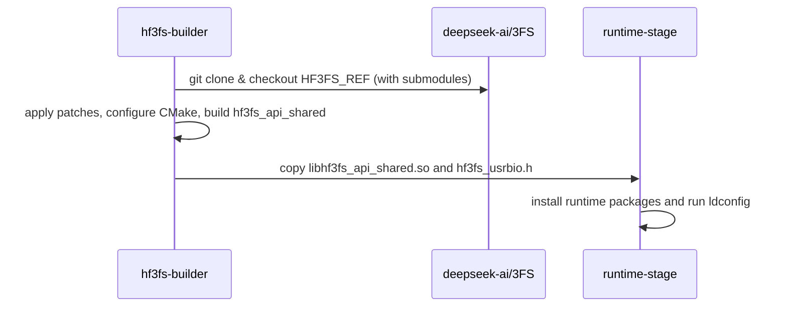

# [PR #1645] PLUGINS/HF3FS: drop dead null check on member address in checkXfer

source: https://github.com/ai-dynamo/nixl/pull/1645
state: open | updated: 2026-09-23T19:54:31Z
labels: external-contribution, size/M

## 正文

## Summary

Two commits, fixing the HF3FS plugin build on Ubuntu 24.04 and making sure CI catches future HF3FS regressions:

**1. `PLUGINS/HF3FS: drop dead null check on member address in checkXfer`**

`ior` is declared as a value member of `nixlHf3fsBackendReqH` in `src/plugins/hf3fs/hf3fs_backend.h`:

```cpp
class nixlHf3fsBackendReqH : public nixlBackendReqH {
    public:
        std::list<nixlHf3fsIO *> io_list;
        hf3fs_ior ior;                       // value member, not a pointer
        uint32_t completed_ios = 0;
        ...
};
```

so `&hf3fs_handle->ior` (address-of a value member of a non-null object) can never be `nullptr`, and the `if (&hf3fs_handle->ior == nullptr)` check in `nixlHf3fsEngine::checkXfer` is unreachable. gcc-13 (default on Ubuntu 24.04) flags this under `-Werror=address` and fails the HF3FS plugin build.

**2. `contrib/Dockerfile: build HF3FS client library in a separate stage`**

- CI currently builds NIXL with all plugins enabled, but `libhf3fs_api_shared.so` / `hf3fs_usrbio.h` are not present in the image. `src/plugins/meson.build` uses `cc.find_library('hf3fs_api_shared', required: false)`, so the plugin is silently skipped and HF3FS-only build breakage (like commit 1) reaches `main` without anyone noticing.
- Add a `hf3fs-builder` stage that builds `deepseek-ai/3FS`'s `hf3fs_api_shared` target and copies the resulting `.so` + header into the final image so the plugin is compiled and link-checked by CI.
- 3FS source is clang-only and Ubuntu 24.04's gcc-13 `<chrono>` headers trip a consteval check in folly. The builder pins `clang-14 + gcc-12`'s libstdc++ via a single-version `--gcc-toolchain` symlink. Only `hf3fs_api_shared` is built; the storage server, fuse, and FoundationDB pieces are not needed for the client lib.
- `HF3FS_REF` is pinned to a specific 3FS commit so rebuilds are reproducible. Override at build time if needed.

Marking as **WIP / draft**: I haven't run the full HF3FS test suite against a real 3FS cluster, and I haven't validated the multi-stage Dockerfile end-to-end against the real CI runner yet — only confirmed it builds locally with the same toolchain pins.

## Test plan

- [x] `ninja -C build` succeeds on Ubuntu 24.04 with gcc-13 (`-Denable_plugins=POSIX,OBJ,HF3FS`)
- [x] `libplugin_HF3FS.so` produced; `ldd` shows `libhf3fs_api_shared.so` resolved
- [ ] `docker build -f contrib/Dockerfile .` produces an image where `libplugin_HF3FS.so` is present under `$NIXL_PLUGIN_DIR`
- [ ] Run `test/unit/plugins/hf3fs/nixl_hf3fs_test` against an actual 3FS mount

🤖 Generated with [Claude Code](https://claude.com/claude-code)


<!-- This is an auto-generated comment: release notes by coderabbit.ai -->
## Summary by CodeRabbit

* **Chores**
  * Docker build now includes a multi-stage HF3FS build with a configurable build reference and HF3FS runtime libraries in the final image.

* **Bug Fixes**
  * HF3FS backend IO transfer handling improved: removed a faulty initialization check, added stricter thread-state validation, and clarified error propagation and cleanup during IO failure.
<!-- end of auto-generated comment: release notes by coderabbit.ai -->

## 评论 (22)

### copy-pr-bot[bot] · 2026-05-15

This pull request requires additional validation before any workflows can run on NVIDIA's runners.

Pull request vetters can view their responsibilities [here](https://docs.gha-runners.nvidia.com/cpr/vetters).

Contributors can view more details about this message [here](https://docs.gha-runners.nvidia.com/cpr/contributors).


### github-actions[bot] · 2026-05-15

👋 Hi lluki! Thank you for contributing to ai-dynamo/nixl.

Your PR reviewers will review your contribution then trigger the CI to test your changes.

🚀

### brminich · 2026-05-22

/build

### brminich · 2026-05-22

/ok to test 948d51efae1c90f523b6d2209a7e88f4faf06f49

### coderabbitai[bot] · 2026-05-28

<!-- This is an auto-generated comment: summarize by coderabbit.ai -->
<!-- review_stack_entry_start -->

[](https://app.coderabbit.ai/change-stack/ai-dynamo/nixl/pull/1645?utm_source=github_walkthrough&utm_medium=github&utm_campaign=change_stack)

<!-- review_stack_entry_end -->
<!-- This is an auto-generated comment: review paused by coderabbit.ai -->

> [!NOTE]
> ## Reviews paused
> 
> It looks like this branch is under active development. To avoid overwhelming you with review comments due to an influx of new commits, CodeRabbit has automatically paused this review. You can configure this behavior by changing the `reviews.auto_review.auto_pause_after_reviewed_commits` setting.
> 
> Use the following commands to manage reviews:
> - `@coderabbitai resume` to resume automatic reviews.
> - `@coderabbitai review` to trigger a single review.
> 
> Use the checkboxes below for quick actions:
> - [ ] <!-- {"checkboxId": "7f6cc2e2-2e4e-497a-8c31-c9e4573e93d1"} --> ▶️ Resume reviews
> - [ ] <!-- {"checkboxId": "e9bb8d72-00e8-4f67-9cb2-caf3b22574fe"} --> 🔍 Trigger review

<!-- end of auto-generated comment: review paused by coderabbit.ai -->
<!-- walkthrough_start -->

<details>
<summary>📝 Walkthrough</summary>

## Walkthrough

Adds a multi-stage HF3FS build to the Dockerfile (builder + runtime integration) and simplifies the hf3fs backend transfer check by removing an IOR initialization guard and using thread/error/completion state for progress and success.

## Changes

**HF3FS Multi-Stage Docker Build**

|Layer / File(s)|Summary|
|---|---|
|**HF3FS Builder Stage** <br> `contrib/Dockerfile`|Introduces `HF3FS_REF`, installs build deps, recreates `libibverbs` symlink, forces `clang-14` to use a GCC-12 toolchain via CMake flags, clones `deepseek-ai/3FS` (with submodules), applies patches, configures CMake, and builds `hf3fs_api_shared`.|
|**Runtime Stage Integration** <br> `contrib/Dockerfile`|Installs HF3FS runtime packages, copies `libhf3fs_api_shared.so` and `hf3fs_usrbio.h` from the builder stage into `/usr/lib` and `/usr/include/hf3fs/`, and runs `ldconfig`.|

**IO Transfer Handler Simplification**

|Layer / File(s)|Summary|
|---|---|
|**Remove IO Initialization Guard** <br> `src/plugins/hf3fs/hf3fs_backend.cpp`|Removes the prior `hf3fs_handle->ior` initialization/null check from `checkXfer`; `checkXfer` now validates `io_status.thread`, returns recorded `io_status.error_status` when present (after `cleanupIOThread`), otherwise returns `NIXL_IN_PROG` until `completed_ios == num_ios`, then cleans up and returns `NIXL_SUCCESS`.|

## Sequence Diagram(s)



## Estimated code review effort

🎯 4 (Complex) | ⏱️ ~45 minutes

## Poem

> 🐰 I stitched a builder stage with careful, tiny hops,  
> Cloned branches, patched the bits, and fixed some symlink props.  
> A guard hopped out the doorway, threads now dance in line,  
> Libraries land, ldconfig hums — the runtime looks fine.  
> Hops and builds, a rabbit's cheer for code that came in kind.

</details>

<!-- walkthrough_end -->
<!-- pre_merge_checks_walkthrough_start -->

<details>
<summary>🚥 Pre-merge checks | ✅ 5</summary>

<details>
<summary>✅ Passed checks (5 passed)</summary>

|         Check name         | Status   | Explanation                                                                                                                                                                                                                                         |
| :------------------------: | :------- | :-------------------------------------------------------------------------------------------------------------------------------------------------------------------------------------------------------------------------------------------------- |
|         Title check        | ✅ Passed | The title 'PLUGINS/HF3FS: drop dead null check on member address in checkXfer' clearly describes the primary change in the first commit and reflects the main substantive code modification in the changeset.                                       |
|      Description check     | ✅ Passed | The PR description provides comprehensive coverage with clear sections explaining both commits, the rationale for changes, technical details, and test status, though the template sections are not explicitly labeled per the repository template. |
|     Docstring Coverage     | ✅ Passed | No functions found in the changed files to evaluate docstring coverage. Skipping docstring coverage check.                                                                                                                                          |
|     Linked Issues check    | ✅ Passed | Check skipped because no linked issues were found for this pull request.                                                                                                                                                                            |
| Out of Scope Changes check | ✅ Passed | Check skipped because no linked issues were found for this pull request.                                                                                                                                                                            |

</details>

<sub>✏️ Tip: You can configure your own custom pre-merge checks in the settings.</sub>

</details>

<!-- pre_merge_checks_walkthrough_end -->
<!-- finishing_touch_checkbox_start -->

<details>
<summary>✨ Finishing Touches</summary>

<details>
<summary>🧪 Generate unit tests (beta)</summary>

- [ ] <!-- {"checkboxId": "f47ac10b-58cc-4372-a567-0e02b2c3d479", "radioGroupId": "utg-output-choice-group-unknown_comment_id"} -->   Create PR with unit tests

</details>

</details>

<!-- finishing_touch_checkbox_end -->
<!-- tips_start -->

---


<sub>Comment `@coderabbitai help` to get the list of available commands and usage tips.</sub>

<!-- tips_end -->
<!-- internal state start -->


<!-- DwQgtGAEAqAWCWBnSTIEMB26CuAXA9mAOYCmGJATmriQCaQDG+Ats2bgFyQAOFk+AIwBWJBrngA3EsgEBPRvlqU0AgfFwA6NPEgQAfACgjoCEYDEZyAAUASpETZWaCrKPR1AGxJcrAGQCqAOIAkgByAMoA9AASAGIAzLHhXLQU+NyQSmj0GNgeHoywogDW/FhszAKU6LSp0sjwWAxFDMUAGgBm1ZAGoY5VFFwAjABsACwArJCAKAT2+NgUDN6QHfAAHpGwHfEdiGDNJWtdFGBZtGC5+fstpYBJhJC4zqSckMzaWD0Agniw+IOQ+WwxR0sxsJAk8BIAHdKIguBIpBhitRpAAmADsABpIFChh5aNxcBRsQIKMxGvBmjNIL4VCQPHDICQ1jQKBg0B59vgMET4AI8PBudjEPAAF4kSIAWWpAGEKCQUbQuKiAAyokZgFUTMBDCbQFUATg4kw4E3iAC1ID1/DZfFxYLhcNw4ZFIkR1LBsAINExmJFtKdZOzmPhIhh1h5Itw8pHRpMrQZwo9cNhGekyG4EMhbAoee9kLgofgFKx1HCjEMAJTWAIhCIxBJJFJpDJnSCXAoHVplV4kSrVbJ1RANJo3TrdAxQMEhqTITCQbAYeVoZoqLyFEooLDhtYeaLbXYAUQw7vIHA4XfaxwesGoD2kNHoADItjtEAB9W8YWheMB6QV8AAvIB7YxoSFAaAmUCvrs74ASgfwoHOkASBy2AkL2/Z8PgHTthG+5vgAQiuxRkLQYIAI7RJAAAUGD4Lg6A8PgjSspWwrFmWNRDsgDCYPRjFVKB+TgQA3JARAMAwOrxLR/j8jy2CQKiYwaCqYzVh0HhoEQBZFBu3aLkofBgAA6pQaQUIBg7ysO6DfowaCpnQN4YXEiThDwHjYKekD8vA+IPMWHTaB4GhGKi1ZMDyFB8pEAAi+CtJQqxeFw/mBe5SSMB4kI8gCfJUC4W5MYgJDcM4KL2I8pBQZAny1MhMF7BlxmvHk4hgIgNUYQQfnYAF9BKOVZUkMUYDaJEHkAOTIM175oNw8Dvogt7yvQjwUM89n0Ew3DyLg+m2R1jREJAGiIMWmD0EU2TVKxxaHRhqzsgU8BvLVl2QDKwQlktXhzg5uVItcJR6W5jaedw3mnpBPRQKEDHSL2l1YLw4KCqmHjyM5u0MBoL20O+uWks4sg0dN82Lctq3OHQ03YvKFEDetXAhQyJDseg+T4FCp2uV5PmNEFfkYSKXg8tj9jAtw3AucLP04kUWBPTleWMSTmwKm1MLyugAhlTycOTtYjQFvg+AeKuws0Qw2knjqYw7UxECSdJBCW9bWCILIzDA6UfVuzqkUi2gEgsfQQdDLJwDNGk9F6EhDjI9ykDyYuKbKap6nidyUuq3b6sFaTxWoBlmiQFl4TvjYh6xEhPCNOQG1XfYcsMPAqwMJAHkluSjHXY5WBCfgUgULFtRkMbUCSs4pH0KZwRWJEqRoB0LxOYdiG3sgAmQBQi4Cx0MaV5D97dfYA00OgRD5gP+8KgUvd26mrLtohx/5PIqG5bQioC8wE6XUeqQESslCgqUMKp1VorA+GByAQTcA+Ly84aKb1+CceU3A/iPmqtQVMlYuDwzwhgIQaBdAyn6oNS+UkSB0GQKndOiks5qSdnzQ6EkpIyWdtDIWGBswAHlwjBDaJiARhEABSmIq7UloNyEg09i68NPO+KuF1iy8EUNgJY9BB74noKtXmyASZUyWitNadB1EP0uh4KQ9BZhyPIIouR4CqGBTALhaKvIBAJSSqRCBAUMKQU0bQbR/N3o6Qwuw2ASiYaNFUZDKxsw96yBIIxRxCi6o2EPjQbqkRFzqCjHE/hmwDyIDDBGT8ZT3y5IHrfM2A8sArhTByHu2UQwZ2pCktJmR5HhQMBYb6LA2A8mQA4JwLgjCfHyH3dgc49aGIoIxX0bxvzANkOudgsVpAcCMFAUk5JwzNC4AAIkiK1E5dUDkUmOZAM5+AA6PWQQaMYAAOWgEwhgkBCiQIYDADQqg6BMVE8QBAjFoKiVUBo0DohIK815HQxghQ6CqEYiKDSXOIThSgpzIgPJFrUxgnyBBoHiEMTFJtsX/HuY88+jE1QfPiKiAQJy9l/mMOAKAZF+C4U3oQUgCD/4rPYFwXg/BhCiHELOPy8gmDGRUGoTQ2hdDspMFAOAqBUDzj5cQMgyhcHCp5FwKgUJL4TPkHIBQ8rVDqC0DofQRgDBqqMF42KPiwH+Mgbsk5PqBmWE+MEXVgrcHjLeMVHChRMCkEQEYAABq6uKHqUqBNje/U1rE0ihKWMhJQtBKT/1jc1MArVKCpu6pE525DoqrCIAsNcGFY1VxrnXVNrV0BbUcOwWiSgQodUgLGt4jRY3Vj6m2mRhcu3OHECFMQyAOhpGYP24azo6HjUmh5WNkE4AYRLXwcttUGkcgZKfXubalBy2/GQDu0hGaiGXLkgWi4x4inkfQWNJM+RjwNqmpQUgPDpBGYxH2ftGilCZizFyHREL+1OtiKDixkbxvtkQR2qa+rOSYoEGUMpg5BU9reYWEJyFVrrbg2NrsuEeytgRjAsbIgylnqRFY2ldLYjtvI8GbTPJYKuoxVW4GHwuXlLhGijQX55pPJfAQIZQkAy5otaGkJkDYGdESBUi6Kq4AOIgNj3Ia0LGRtE76jGSDYkHq1TjhbqnU3MXTWgaGnhpP6dulYjRWlwPEGwPBtVBzICrl1dundKT7wzu9DCJMiryAqq0SJOmFBLUQyY6zZjabrXUamweVm3zvlTBQNQ+ANCwFTfOlgAtd3eYwg9ewshup9mLpFyIYnvJKABElaggp+FmYcnA5A77aDVvgEQMtj19LkFNallyEWyYN3lO6WraXHV+vqh4Vk7XuTmwFkoO2lVxDrZ5UyNY2ClkuUQtGAQuVu7sHUEpvZkBEbkFokmgJ6421PE7aMyI+6U4YGxuJeiB2juPijF6C7VqMJXfENISs/TfCNGRquE8dAuAAGp0QqkiJqIwh5uoRINYoDC8oITQiZB0eDLxoiDdgAYH1rLJymAMIgRYRS+HlOaqU7LJLkrfh9LLb1vrBkBqDfqlyobpsRoR9GowwQsCxp3HuMpx5TzeAvGOY4sbsSqwpOIDkYo1tYFrc4Dat4B6Oj7ISFyfUx6d3kFl2CX4fwkD/ABVNUI0DIEADgEWv4A6/FLQQAuAQyuEpyS8/NY0vmqfb38/4/ipp3qLMgD8ZyWP7ZeccFBU30VNZopY9DMjwHlGIfOxYf7wD/uISTsbBQrWTKmDQh1lz2Y18rB+KY2SA3kN1P4LlK/4Gr/gxAGgLJ/D7ymRAqa0Hr2qHxfIoe7YKlyNwYIAi4AN+HT2EKAUDPYgYkUCgfMyot4WPw/toQRG+HfGEd8tgBGBFTaFgo8aWDQzSXQOC+Ax8PxXEUXruRmBv7H2ZoxFCAgFSNgqxCgMsl4JgMphkKrEvjeA3s7PKK3sfrGqfm0OfuEP4NhoeOEOEJuotgLitvqh1htqrFttpFQLtsfhGsyIDidnwGdqDhDjdr0PIkYLDuQLxF+KQEqJAMjujmACMFjjjm8Hji1oTpCKat8mTlwJKHQPAI4NTr6nToYE6pykyA5BGjqgKsLrtMMiKvvGgONo4GGharKvjlQDakqvaqqhoRqg0IDDgAQELlQS5Iai8EoI8IEvoS1udn4mamYUYYjjIBYdaoqnaiqmoQANoADeJyVAiOwQtAJyHACRUaJA74byAgKotAIwKkIw8QEwEwJymIJymmsAqRJyCa7qfiyaXgpRJy5aSynBJAqRQwBoZRZErRqR6IqIZRouLgVRDUtAvWTatcsQGWDk5CY2/aRau6qagCK28AwCFabah0d4h6+QfmZ8Z65UZEV6Smt6DA96yMqs76fIn6lABs6W1WIGSI2IS0qB22DsQwYwdGMGkmfU5CWGOGQwqIeG1G7wCB8wRAMSDGaATG5GxAlGFsQJQ6zGOkcWl4DCeAS6dCK6Y0E08AU0SQGWjEjakMzakxtETW2AEmZ0Dg0mWicmZmssuUyMmm2mumGA+mtkXW9AFmAstuH4NmE29m7a06zSA+jRcqJAhE/6rQMoT+Xgaw6gsgVRCAYJJyAAvpiPEYkaQMkVUZqZkSCq8uiLQEMOiDCmqPEI0RUVUTUb4uApAo0c0bgD0RwG8fEF0d+E6bqK8gMaYWTFUf4NwGXmcfpC9O5qFl5l9iLFsQUP5ogIFl3CFjyGFvVs4EcfFkpmVgNCtietlPyeKiIGIM7LdG1CVoujycWpmcZKmlVj7LVhptQLAHFoPD1v2viANkNhoKKfjhKX4tKcwM/nKbgAqWkWwHmo4KqeqekUkSkWkbqe+B0OiOiJMGgJMAIPELQK8hafWVUYzgwMzqeKzmUuzrBJzqRNzgwLLPaZtI6XDqkWMOiBMG6bQE6W8iqN6ealUdLinqrqWk3hhEvnYF7j7nrmGDGFwcgOjKDN2K7sgEoF4I+BxEfIuGIB1mmigKwAoSiFLCXoGb1lXuWqPnXrAKvreige3jwJIfMIgFLAXn8Lmv2nhTXgPkPhQCPqmBlpPnwEhvPipkvivtrOrvwE9HvkgBhM5L1r6M/o+P/qmhID/o4NJSLF4ZQIcjumkjCAnmgWfhfqEFfjYDflMbtFAQvsjppRge+FgTgXgZup2UoN2VKTKcyPKVUf+lCKqQALocoQCaH0DaF4D8p6puH6HoVGqZBpKhTuH45+SSmlCDHyC6mhFg5WERHKoOpqp9zqBwSjHviSHQiv4OlRGeVQArjwohSFGrmiAkAgrxAGj/EdCvITB0LvKVWFENUjBoAjANXoivIjAFVpUMDEqkpfICAGgkBFEdFqgMCvJDCGjApgojWgoGivLxAqhDDGnzW9UaEMpmjMorU1WvJagqjxAjAjACBjAGj3kMCGggp1WenxCvIMD/HnUbVeW5GTUTC0AdBrW0DxBkqTUjB8QAoGgCATAdCojzm0ACCvKVXVUdUqhoAYQOrqFeUrIZWl4fg5UwhEzcqpUaHozvhsBbSZEol95LIFUGCxEGBWgnJIC2B2Xzy9mAZWDv6PipErAchlSYiU13JIACJjwTxKAYCs3swc1c0nIuLdSxQnjSljyRLS6sivRJgois2xFqmi1ik2AKrqCmRpA0BWAUDuC4ANFszs2mai2GJ5C0B022BC0m2c1U15rkSLhgJJiS26Qyg3Cs1EjoR213IO3ZIYAG1eDu0lCe0Hym322l7+3xTSAnHwCEgdbB2tCh3e2i3+x0DBDDjoSIAu2s0+o+0nLaTdSJ3FBggOAraICs3RFc1WgU1Wh113KXihBoBsC52B0YSXilHV111NGMXJ3h3113J0H2x66t36TiCG0YTTR+BBBhBRBVzNjpChXZBB4GSlCpwVADDcS2Qjir1p7TQ5QKgUBSxKCICx1VCca8ARLFQS6VYqzBn54Xwo2NL0DCZeCzoALAlUnlqJlSBg6vCKBBZ8TUElQFw8HSBOad0D13IyZtGnKu5sinSQMD0JGiB6aDYGY20cw+310nJ/CDZuYeDF1N0t2nLj0NFd2q31213ION3N2wN3LR2n2xTx2pwd3YPd34Wph93sNU1D2YAj2nIuY5gn2x0sNoxpAQgn1/TyjKwii/1MAy21RGZz7OD2CSqkEA7aQUiSYCA77pW4Bxb8Z64cjPSIQ32GOiCwBHKtJeGhSNkOSEqcOGO/A+QxKqw0B9naTXxlTIV7Z0zvyMRD2UieDyDaRVBeD0Byx8D8blTv7qB/AHRm5eMKJIM4MwO53wPhgnipPd00WsnoPyiYMi1QO4OxSngchEN0O50iPMPUGsr12UN13UM4O0MkMMNJQS38zS3KCkA5NU1OPcNd28OHbD11OnKIwrBIXUFzrzAOTCygMZH0CQIbbghoRVTi28iSYKM9OZLhAyxPFnQbOu0KCKPt03Adk8N3K2SWwCjci53a3qAYRHOnQzPRPBlTMaPkjDj8xPSLp9SIDtaIAdAHT6TbNUC1T17SC/D4gXNDPQP44ZPOBZNEB9N3J4PlOEM3DEP0Ni0dObO6T1N12NM11wvVFYtVOnKcHzyQAZ3JzcEh2XM9396DMlN8PshjN3LF3Sxx1yycmiBOQH7/Zp30BIB0s4iUCmNGQrCISHSoDRgzICbdSwslPpNwNIuIOMvosEOVNtMF2gbp2Z3SCfDDj1CAaEtWjEuQDNPd2tM4sCJokRrhB7QYTu0ZH0tJ2MsDNcBe3904NssCOcs3DcuywuRVB8QYZCv6siuGvIC6ySsOTwY3hysnyKuaCosnKqt3KZMauktauvQ6s4vzC4ACIdBOvpiushHGtlTDhmsUNc1uX52F24C2CMOiMcsnLHWIqFEMDDXApoDtV3UTDA0dCnV/yohoATAjAjVjAkBTvjuk4PWvKohTVrzrn5ETAqgMDbDAodX7VwptGNtu7Ns2Bt250PVoDqh0LoijCg2g20CwrqSfJvGfXoiTUkCnXxD9uLmbsGkMDoik4jBDC0A1WGhjDLk5EkAAqogTDZAsoGAqmFXkWZEE2kDvjE3Y12FeV8rvgVTOQj6ZH5WI3xFNtWACt0CfC4BghE6Y0M3qDSkZypETAIdI1FV+U4dkf4fvgYeGBpWsSUCvSceSEvoYAk2MREcnJQixQ0DalpG7V0BvIajA39tgD3mbvFoGkdCaj/tMpjDxAMAzvvKqmId8dsgciCcYzCdccOT6BAA== -->

<!-- internal state end -->

### ofer · 2026-05-31

/ok to test c51ba31

### ofer · 2026-06-01

/ok to test 02d532b

### ofer · 2026-06-04

/ok to test 3512391

### ofer · 2026-06-04

/build

### ofer · 2026-06-04

/ok to test bee0945

### ofer · 2026-06-05

/build

### ofer · 2026-06-07

/ok to test fdd9d70

### ofer · 2026-06-10

/ok to test dae8206

### ofer · 2026-06-15

/build

### ofer · 2026-06-16

/ok to test 605c58c

### lluki · 2026-06-16

/build

### lluki · 2026-06-16

/ok to test 9f1ca4e010058afdbe7c392562b9a7aa3f026d59

### ofer · 2026-06-16

/ok to test 9f1ca4e

### ofer · 2026-06-16

/build

### ofer · 2026-06-17

/ok to test 20c7df0

### ofer · 2026-06-17

/build

### ofer · 2026-06-22

/ok to test d8b116b

## Review (8)

### ofer · 2026-05-26 · DISMISSED

(no text)

### coderabbitai[bot] · 2026-05-28 · COMMENTED

**Actionable comments posted: 2**

<details>
<summary>🤖 Prompt for all review comments with AI agents</summary>

```
Verify each finding against current code. Fix only still-valid issues, skip the
rest with a brief reason, keep changes minimal, and validate.

Inline comments:
In `@contrib/Dockerfile`:
- Around line 43-49: Replace the hardcoded path used in the RUN ln -sf
libibverbs.so.1 /usr/lib/x86_64-linux-gnu/libibverbs.so with a multiarch-aware
path so the symlink works on non-x86_64 images; e.g. use dpkg-architecture to
compute DEB_HOST_MULTIARCH and create the link at /usr/lib/$(dpkg-architecture
-q DEB_HOST_MULTIARCH)/libibverbs.so (update the RUN ln command that references
libibverbs.so.1 accordingly).
- Around line 19-23: The ARG HF3FS_REF currently defaults to the mutable branch
"main", which makes CI builds non-deterministic; change the ARG value to an
immutable commit SHA (replace ARG HF3FS_REF="main" with the specific commit SHA)
and ensure wherever HF3FS_REF is used (e.g., the git checkout ${HF3FS_REF} step)
will now checkout that fixed commit so builds are reproducible; update any
documentation or build scripts that reference HF3FS_REF to reflect that it
should be set to a commit SHA for deterministic CI.
```

</details>

<details>
<summary>🪄 Autofix (Beta)</summary>

Fix all unresolved CodeRabbit comments on this PR:

- [ ] <!-- {"checkboxId": "4b0d0e0a-96d7-4f10-b296-3a18ea78f0b9"} --> Push a commit to this branch (recommended)
- [ ] <!-- {"checkboxId": "ff5b1114-7d8c-49e6-8ac1-43f82af23a33"} --> Create a new PR with the fixes

</details>

---

<details>
<summary>ℹ️ Review info</summary>

<details>
<summary>⚙️ Run configuration</summary>

**Configuration used**: Path: .coderabbit.yaml

**Review profile**: ASSERTIVE

**Plan**: Pro

**Run ID**: `a6e1805e-02a8-42ca-b70b-dc150ef42ab9`

</details>

<details>
<summary>📥 Commits</summary>

Reviewing files that changed from the base of the PR and between 3009db5d0184745a9eecf123d619555b34e5dbe6 and ac88fa63b3ece233912f85ee8de2635e6a65e786.

</details>

<details>
<summary>📒 Files selected for processing (2)</summary>

* `contrib/Dockerfile`
* `src/plugins/hf3fs/hf3fs_backend.cpp`

</details>

<details>
<summary>💤 Files with no reviewable changes (1)</summary>

* src/plugins/hf3fs/hf3fs_backend.cpp

</details>

</details>

<!-- This is an auto-generated comment by CodeRabbit for review status -->

### coderabbitai[bot] · 2026-05-31 · COMMENTED

**Actionable comments posted: 1**

<details>
<summary>🤖 Prompt for all review comments with AI agents</summary>

```
Verify each finding against current code. Fix only still-valid issues, skip the
rest with a brief reason, keep changes minimal, and validate.

Inline comments:
In `@contrib/Dockerfile`:
- Around line 50-54: The two commands creating
/opt/gcc12-only/lib/gcc/x86_64-linux-gnu and linking
/usr/lib/gcc/x86_64-linux-gnu/12 are using a hardcoded "x86_64-linux-gnu"
triplet; change them to compute the multiarch triplet (e.g. via
dpkg-architecture -qDEB_HOST_MULTIARCH or a shell variable like DEB_MULTIARCH)
and use that variable in both mkdir and ln so the paths become
/opt/gcc12-only/lib/gcc/${DEB_MULTIARCH} and /usr/lib/gcc/${DEB_MULTIARCH}/12,
keeping the same mkdir -p and ln -sfn commands but substituting the hardcoded
string for the computed variable.
```

</details>

<details>
<summary>🪄 Autofix (Beta)</summary>

Fix all unresolved CodeRabbit comments on this PR:

- [ ] <!-- {"checkboxId": "4b0d0e0a-96d7-4f10-b296-3a18ea78f0b9"} --> Push a commit to this branch (recommended)
- [ ] <!-- {"checkboxId": "ff5b1114-7d8c-49e6-8ac1-43f82af23a33"} --> Create a new PR with the fixes

</details>

---

<details>
<summary>ℹ️ Review info</summary>

<details>
<summary>⚙️ Run configuration</summary>

**Configuration used**: Path: .coderabbit.yaml

**Review profile**: ASSERTIVE

**Plan**: Pro

**Run ID**: `9f84004b-d024-40ab-bbad-cb721f02b27c`

</details>

<details>
<summary>📥 Commits</summary>

Reviewing files that changed from the base of the PR and between ac88fa63b3ece233912f85ee8de2635e6a65e786 and c51ba31eb9e351902c810952b69e3b98301179e3.

</details>

<details>
<summary>📒 Files selected for processing (2)</summary>

* `contrib/Dockerfile`
* `src/plugins/hf3fs/hf3fs_backend.cpp`

</details>

<details>
<summary>💤 Files with no reviewable changes (1)</summary>

* src/plugins/hf3fs/hf3fs_backend.cpp

</details>

</details>

<!-- This is an auto-generated comment by CodeRabbit for review status -->

### coderabbitai[bot] · 2026-05-31 · COMMENTED

**Actionable comments posted: 1**

<details>
<summary>🤖 Prompt for all review comments with AI agents</summary>

```
Verify each finding against current code. Fix only still-valid issues, skip the
rest with a brief reason, keep changes minimal, and validate.

Inline comments:
In `@contrib/Dockerfile`:
- Around line 155-156: The Dockerfile copies libhf3fs_api_shared.so and
hf3fs_usrbio.h but omits hf3fs_usrbio.so, so add a COPY that places
hf3fs_usrbio.so (the runtime plugin) into /usr/lib/ from the same build
stage/source directory used for libhf3fs_api_shared.so; ensure both
hf3fs_usrbio.so and libhf3fs_api_shared.so are installed under /usr/lib/
alongside the existing hf3fs_usrbio.h so the HF3FS plugin can load at runtime.
```

</details>

<details>
<summary>🪄 Autofix (Beta)</summary>

Fix all unresolved CodeRabbit comments on this PR:

- [ ] <!-- {"checkboxId": "4b0d0e0a-96d7-4f10-b296-3a18ea78f0b9"} --> Push a commit to this branch (recommended)
- [ ] <!-- {"checkboxId": "ff5b1114-7d8c-49e6-8ac1-43f82af23a33"} --> Create a new PR with the fixes

</details>

---

<details>
<summary>ℹ️ Review info</summary>

<details>
<summary>⚙️ Run configuration</summary>

**Configuration used**: Path: .coderabbit.yaml

**Review profile**: ASSERTIVE

**Plan**: Pro

**Run ID**: `04e4b053-7e91-45d3-ad06-1987b7df3d44`

</details>

<details>
<summary>📥 Commits</summary>

Reviewing files that changed from the base of the PR and between c51ba31eb9e351902c810952b69e3b98301179e3 and 02d532b01918050366b4975c0923f815838c1297.

</details>

<details>
<summary>📒 Files selected for processing (2)</summary>

* `contrib/Dockerfile`
* `src/plugins/hf3fs/hf3fs_backend.cpp`

</details>

<details>
<summary>💤 Files with no reviewable changes (1)</summary>

* src/plugins/hf3fs/hf3fs_backend.cpp

</details>

</details>

<!-- This is an auto-generated comment by CodeRabbit for review status -->

### aranadive · 2026-06-04 · COMMENTED

(no text)

### coderabbitai[bot] · 2026-06-04 · COMMENTED

(no text)

### lluki · 2026-06-09 · COMMENTED

(no text)

### benlwalker · 2026-09-23 · COMMENTED

The description still says this is WIP and that the Dockerfile
stage hasn't been validated against the CI runner. Is that still
accurate? The squash subject will also only describe the hf3fs
change, not the new 3FS build stage in `contrib/Dockerfile`.
