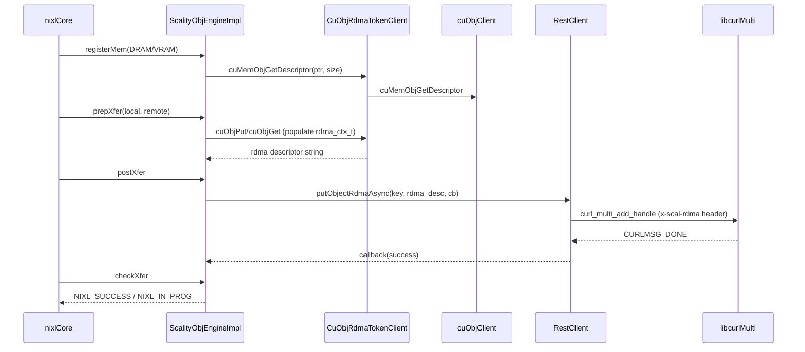

# [PR #1778] Introduce Scality AI Connector

source: https://github.com/ai-dynamo/nixl/pull/1778
state: open | updated: 2026-09-17T22:37:32Z
labels: external-contribution, size/XXL

## 正文

## What?

Adds a new NIXL **OBJ-plugin accelerated engine, "Scality AI Connector"**, that moves object data to and from a Scality endpoint over **RDMA** (cuObject DC transport), using a header-only HTTP request to carry the command.

The PR includes:

- **The engine** (`src/plugins/obj/rest_accel/scality_ai_connector/`): a two-plane design where object bytes move over RDMA (GPU-direct capable) while a header-only HTTP `PUT`/`GET` carries the cuObject RDMA descriptor in an `x-scal-rdma` header. The HTTP control-plane client (`RestClient`) drives all requests with libcurl's multi interface from a single poller thread, dispatching completion callbacks to a worker pool sized by `num_threads`.
- **Build detection**: discovers the version-suffixed `cuobjclient-<ver>` pkg-config name so the accelerated engines build without hard-coding a CUDA version.
- **Unit tests**: HTTP wire-format tests (correct `PUT`/`GET`/`HEAD`, header, empty body, against a loopback server, no RDMA/cuObject required) and concurrency tests (poller keeps more requests in flight than its thread count; teardown with outstanding requests fires every callback exactly once).
- **nixlbench integration**: wires up the OBJ accelerated path (flags, REST object pre-population/cleanup, kvbench args) so the engine can be benchmarked. Object **pre-population** for READ benchmarks is seeded concurrently (OpenMP); teardown uses nixlbench's standard RAII deregistration/cleanup.

## Why?

Scality's AI Connector speaks its own REST dialect and is **not** S3-compatible, so the existing `s3`/`s3_crt` engines cannot target it. This engine lets NIXL move large buffers (often in GPU memory) to and from a Scality store over RDMA/GPUDirect, with HTTP used purely as a lightweight control plane. The nixlbench and test changes make the new path measurable and verifiable in CI without requiring RDMA hardware.

## How?

- **Two independent channels.** Data plane is RDMA (zero-copy, GPU-direct); control plane is an HTTP request with an empty body whose `x-scal-rdma` header carries the RDMA token. Scality performs the actual RDMA transfer against the registered buffer.
- **Concurrency.** A single dedicated poller thread owns the curl multi handle and runs the non-blocking event loop, so in-flight request count is decoupled from the thread count (curl only carries the header-only command; bulk data is on RDMA). Completion callbacks are offloaded to a `num_threads`-sized worker pool so a slow callback cannot stall the loop.
- **Multi-GPU correctness.** `registerMem`/`deregisterMem` set the current CUDA device to the buffer's GPU before `cuMemObjGet`/`PutDescriptor`, so multi-GPU registrations do not fail cuFile's device-memory check.
- **DC-only transport** via a thin `CuObjRdmaTokenClient` wrapper over NVIDIA `cuObjClient` (`CUOBJ_PROTO_RDMA_DC_V1`), behind the `iRdmaTokenClient` seam (also the test-injection point). The `cuObject` stack is required at build and run time; without it the engine is not compiled in.

<!-- This is an auto-generated comment: release notes by coderabbit.ai -->
## Summary by CodeRabbit

## Release Notes

* **New Features**
  * Added Scality AI Connector: REST-based accelerated OBJ backend supporting RDMA-style PUT/GET and HTTP HEAD object existence checks
  * Added CLI options to enable/configure accelerated OBJ: `--obj_accelerated_enable`, `--obj_accelerated_type`, `--obj_num_threads`
* **Bug Fixes**
  * Improved CUDA device handling with explicit device selection and safer device-id validation
  * Enhanced OBJ benchmark setup by parallelizing object pre-population
* **Documentation**
  * Added backend guide for Scality AI Connector
* **Tests**
  * Expanded REST client unit tests for formatting, concurrency, and teardown behavior
* **Build/Chores**
  * Improved cuobjclient discovery and linked libcurl where required
<!-- end of auto-generated comment: release notes by coderabbit.ai -->

## 评论 (4)

### github-actions[bot] · 2026-06-15

👋 Hi oliviergaraud! Thank you for contributing to ai-dynamo/nixl.

Your PR reviewers will review your contribution then trigger the CI to test your changes.

🚀

### coderabbitai[bot] · 2026-06-15

<!-- This is an auto-generated comment: summarize by coderabbit.ai -->
<!-- review_stack_entry_start -->

[](https://app.coderabbit.ai/change-stack/ai-dynamo/nixl/pull/1778?utm_source=github_walkthrough&utm_medium=github&utm_campaign=change_stack)

<!-- review_stack_entry_end -->
<!-- This is an auto-generated comment: review paused by coderabbit.ai -->

> [!NOTE]
> ## Reviews paused
> 
> It looks like this branch is under active development. To avoid overwhelming you with review comments due to an influx of new commits, CodeRabbit has automatically paused this review. You can configure this behavior by changing the `reviews.auto_review.auto_pause_after_reviewed_commits` setting.
> 
> Use the following commands to manage reviews:
> - `@coderabbitai resume` to resume automatic reviews.
> - `@coderabbitai review` to trigger a single review.
> 
> Use the checkboxes below for quick actions:
> - [ ] <!-- {"checkboxId": "7f6cc2e2-2e4e-497a-8c31-c9e4573e93d1"} --> ▶️ Resume reviews
> - [ ] <!-- {"checkboxId": "e9bb8d72-00e8-4f67-9cb2-caf3b22574fe"} --> 🔍 Trigger review

<!-- end of auto-generated comment: review paused by coderabbit.ai -->
<!-- walkthrough_start -->

<details>
<summary>📝 Walkthrough</summary>

## Walkthrough

Adds a new "Scality AI Connector" OBJ backend plugin that uses NVIDIA cuObject RDMA DC protocol for the data plane and libcurl-based HTTP REST for the control plane. Includes abstract interfaces, async RestClient and CuObjRdmaTokenClient implementations, a full ScalityObjEngineImpl, build system wiring (flexible cuobjclient discovery, libcurl detection), benchmark tooling support, unit and concurrency tests, and plugin documentation.

## Changes

**Scality AI Connector OBJ Backend**

|Layer / File(s)|Summary|
|---|---|
|**Build system: cuobjclient discovery, libcurl, and Scality static lib** <br> `meson.build`, `src/plugins/obj/meson.build`, `benchmark/nixlbench/src/utils/meson.build`|Replaces hardcoded `cuobjclient-13.1` dependency with dynamic highest-version discovery via pkg-config; adds conditional libcurl detection to build the Scality AI Connector static library and wire it into the OBJ plugin via `obj_link_whole`; adds libcurl as a required benchmark utils dependency.|
|**Abstract interfaces: iRestClient and iRdmaTokenClient** <br> `src/plugins/obj/rest_accel/scality_ai_connector/client.h`, `src/plugins/obj/rest_accel/scality_ai_connector/rdma_token_client.h`|Defines `iRestClient` interface with async RDMA PUT/GET and HTTP HEAD existence-check callback operations; defines `iRdmaTokenClient` interface with pure-virtual methods for RDMA memory descriptor registration/deregistration and transfer initiation; declares concrete `RestClient` using libcurl curl_multi with poller thread and asio callback pool.|
|**RestClient: libcurl multi async implementation** <br> `src/plugins/obj/rest_accel/scality_ai_connector/client.cpp`|Implements `RestClient` using `curl_multi` with a dedicated poller thread and an `asio::thread_pool` for callback dispatch; manages per-request `RequestCtx` lifecycle, validates inputs, injects RDMA headers, handles shutdown with inflight request abort.|
|**CuObjRdmaTokenClient: cuObject RDMA wrapper** <br> `src/plugins/obj/rest_accel/scality_ai_connector/cuobj_rdma_token_client.h`, `src/plugins/obj/rest_accel/scality_ai_connector/cuobj_rdma_token_client.cpp`|Thin `iRdmaTokenClient` implementation wrapping `cuObjClient` initialized with `CUOBJ_PROTO_RDMA_DC_V1`, forwarding all descriptor and transfer calls to the underlying client.|
|**ScalityObjEngineImpl: full backend engine** <br> `src/plugins/obj/rest_accel/scality_ai_connector/engine_impl.h`, `src/plugins/obj/rest_accel/scality_ai_connector/engine_impl.cpp`|Implements `nixlObjEngineImpl` lifecycle: memory registration for OBJ/DRAM/VRAM segments with cuObject descriptor registration and CUDA device guarding, prepXfer/postXfer async RDMA transfer dispatch, checkXfer/releaseReqH future aggregation and completion polling, queryMem via REST HEAD checks with 30s per-descriptor timeout.|
|**Benchmark tooling: REST OBJ config, helpers, and worker** <br> `benchmark/kvbench/commands/args.py`, `benchmark/kvbench/commands/nixlbench.py`, `benchmark/nixlbench/src/utils/utils.h`, `benchmark/nixlbench/src/utils/utils.cpp`, `benchmark/nixlbench/src/worker/nixl/nixl_worker.cpp`|Adds `obj_accelerated_enable/type/num_threads` CLI options and benchmark parameters; extends `xferBenchConfig` with `isRestBackend()`, `putObjRest`, and `rmObjRest` (libcurl PUT/DELETE with transient-error retry); wires `num_threads` into backend params, adds CUDA device validation in `getVramDescCuda`, parallelizes READ-mode object pre-population via OpenMP with atomic failure tracking.|
|**Tests, concurrency validation, and plugin README** <br> `test/gtest/unit/obj/meson.build`, `test/gtest/unit/obj/rest_client.cpp`, `test/gtest/unit/obj/rest_client_concurrency.cpp`, `src/plugins/obj/rest_accel/scality_ai_connector/README.md`|Adds libcurl build guard for test compilation; wire-format unit tests via `TcpServer` for PUT/GET/HEAD request format and status-code mapping; concurrency tests via `HoldingTcpServer` verifying concurrent in-flight request limits and teardown callback guarantees; README documenting two-plane RDMA/HTTP design, selection criteria vs. S3/S3-CRT, prerequisites, config parameters, concurrency model, transfer workflow steps, limitations, troubleshooting table, and contributor source layout.|

## Sequence Diagram(s)



## Estimated code review effort

🎯 5 (Critical) | ⏱️ ~120 minutes

## Possibly related PRs

- [ai-dynamo/nixl#1638](https://github.com/ai-dynamo/nixl/pull/1638): Both PRs modify `benchmark/nixlbench/src/worker/nixl/nixl_worker.cpp` in the OBJ backend path—main PR refactors `allocateMemory`/object prepopulation while retrieved PR fixes OBJ `obj_dev_id` computation and remote descriptor construction in the same file.

## Suggested reviewers

- w1ldptr
- vvenkates27
- brminich
- ovidiusm
- ofer

## Poem

> 🐇 Hippity-hop, a new plugin hops in,
> RDMA for data, HTTP for spin,
> Scality AI Connector, two planes in one,
> cuObject tokens and curl get it done!
> The rabbit rejoices—fast transfers begin! 🚀

</details>

<!-- walkthrough_end -->
<!-- pre_merge_checks_walkthrough_start -->

<details>
<summary>🚥 Pre-merge checks | ✅ 4 | ❌ 1</summary>

### ❌ Failed checks (1 warning)

|     Check name     | Status     | Explanation                                                                           | Resolution                                                                         |
| :----------------: | :--------- | :------------------------------------------------------------------------------------ | :--------------------------------------------------------------------------------- |
| Docstring Coverage | ⚠️ Warning | Docstring coverage is 27.18% which is insufficient. The required threshold is 80.00%. | Write docstrings for the functions missing them to satisfy the coverage threshold. |

<details>
<summary>✅ Passed checks (4 passed)</summary>

|         Check name         | Status   | Explanation                                                                                                                                                                                                                                                                               |
| :------------------------: | :------- | :---------------------------------------------------------------------------------------------------------------------------------------------------------------------------------------------------------------------------------------------------------------------------------------- |
|         Title check        | ✅ Passed | The title 'Introduce Scality AI Connector' directly summarizes the main change: adding a new OBJ-plugin accelerated engine. It is clear, specific, and accurately reflects the primary objective of the changeset.                                                                        |
|      Description check     | ✅ Passed | The PR description comprehensively covers all three required sections (What, Why, How) with detailed technical explanations of the engine design, motivation, and implementation approach including two-plane architecture, concurrency model, multi-GPU support, and integration points. |
|     Linked Issues check    | ✅ Passed | Check skipped because no linked issues were found for this pull request.                                                                                                                                                                                                                  |
| Out of Scope Changes check | ✅ Passed | Check skipped because no linked issues were found for this pull request.                                                                                                                                                                                                                  |

</details>

<sub>✏️ Tip: You can configure your own custom pre-merge checks in the settings.</sub>

</details>

<!-- pre_merge_checks_walkthrough_end -->
<!-- finishing_touch_checkbox_start -->

<details>
<summary>✨ Finishing Touches</summary>

<details>
<summary>🧪 Generate unit tests (beta)</summary>

- [ ] <!-- {"checkboxId": "f47ac10b-58cc-4372-a567-0e02b2c3d479", "radioGroupId": "utg-output-choice-group-unknown_comment_id"} -->   Create PR with unit tests

</details>

</details>

<!-- finishing_touch_checkbox_end -->
<!-- tips_start -->

---


<sub>Comment `@coderabbitai help` to get the list of available commands.</sub>

<!-- tips_end -->

### copy-pr-bot[bot] · 2026-06-15

This pull request requires additional validation before any workflows can run on NVIDIA's runners.

Pull request vetters can view their responsibilities [here](https://docs.gha-runners.nvidia.com/cpr/vetters).

Contributors can view more details about this message [here](https://docs.gha-runners.nvidia.com/cpr/contributors).


### oliviergaraud · 2026-06-25

thanks for your review @ColinNV it should be better now.

## Review (7)

### coderabbitai[bot] · 2026-06-15 · COMMENTED

**Actionable comments posted: 15**

<details>
<summary>🤖 Prompt for all review comments with AI agents</summary>

```
Verify each finding against current code. Fix only still-valid issues, skip the
rest with a brief reason, keep changes minimal, and validate.

Inline comments:
In `@benchmark/nixlbench/src/utils/utils.cpp`:
- Around line 852-856: The isRestBackend() method currently returns true based
only on the backend type and accelerator type match, but it fails to check if
acceleration is actually enabled via the obj_accelerated_enable flag. This
inconsistency allows REST setup and cleanup to run even when acceleration is
disabled, while the worker backend respects the obj_accelerated_enable setting.
Modify the return statement in isRestBackend() to include an additional
condition that checks obj_accelerated_enable is true, ensuring the method
returns true only when both the backend/type requirements are met AND
acceleration is explicitly enabled.
- Around line 1409-1416: The curl setup in the REST operations lacks timeout
configuration, allowing stalled endpoints to block indefinitely. Add two
additional curl_easy_setopt calls after the existing options to set
CURLOPT_CONNECTTIMEOUT_MS and CURLOPT_TIMEOUT_MS with appropriate timeout values
(e.g., 30000 milliseconds). This should be applied in the curl configuration
section shown in the diff where other CURLOPT settings like CURLOPT_URL and
CURLOPT_WRITEFUNCTION are being configured, ensuring both putObjRest() and
rmObjRest() have explicit timeout protection before their respective
curl_easy_perform() calls execute.

In `@src/plugins/obj/meson.build`:
- Around line 59-79: The `curl_dep` dependency is only attached to the
`scality_connector_lib` static library, but when this library is added to
`obj_link_whole`, Meson does not automatically propagate its transitive
dependencies to the final OBJ plugin target. Add `curl_dep` to the dependencies
list of the final OBJ plugin target (likely `obj_backend_lib` or similar) when
the Scality engine is enabled. This ensures that `libcurl` symbols are
explicitly available during linking of the final plugin, not just within the
static library itself.

In `@src/plugins/obj/rest_accel/scality_ai_connector/client.cpp`:
- Line 1: The client.cpp file is missing the required SPDX copyright header at
the top of the file, which is causing CI copyright checks to fail. Add the SPDX
copyright header comment block at the very beginning of the file, before the
`#include` "client.h" statement. The header should follow your project's standard
SPDX license format to satisfy the copyright validation requirements.
- Around line 291-294: The callback invocation `ctx->bool_cb(false)` at this
location lacks a null/empty check before being called. When `std::function` is
empty, calling it directly throws `std::bad_function_call` and crashes the
thread. Add a guard condition to check if `ctx->bool_cb` is valid before
invoking it, following the same pattern already implemented in the
`finishRequest` method which safely guards callback invocations with null checks
(as seen in lines 109–110 and 133–134).

In `@src/plugins/obj/rest_accel/scality_ai_connector/client.h`:
- Line 1: The file is missing the required SPDX copyright header block at the
beginning, which is causing the CI pipeline to fail. Add the SPDX copyright
header (as required by your project's standards) before the existing `#ifndef`
guard that starts with NIXL_OBJ_PLUGIN_REST_SCALITY_AI_CONNECTOR_CLIENT_H. The
header should be placed at the very top of the file, before any other content or
preprocessor directives.
- Around line 1-2: The header guard macros in both the `#ifndef` and `#define`
statements are missing the `SRC_` path component that should be included for
full repository-relative path consistency. Update both occurrences of
`NIXL_OBJ_PLUGIN_REST_SCALITY_AI_CONNECTOR_CLIENT_H` to include the complete
path from the repository root, changing it to
`NIXL_SRC_PLUGINS_OBJ_REST_ACCEL_SCALITY_AI_CONNECTOR_CLIENT_H` to match the
file's actual location in the src directory hierarchy and follow the
repository's header guard naming convention.

In `@src/plugins/obj/rest_accel/scality_ai_connector/cuobj_rdma_token_client.h`:
- Around line 18-19: Update the header guard macros to use the full
repository-relative path in uppercase form with underscores as separators.
Replace the current guards that start with
NIXL_OBJ_PLUGIN_REST_SCALITY_AI_CONNECTOR_CUOBJ_RDMA_TOKEN_CLIENT_H with the
complete path-based form that accurately reflects the file's location
(src/plugins/obj/rest_accel/scality_ai_connector/cuobj_rdma_token_client.h)
converted to uppercase with the NIXL_ prefix and _H suffix, ensuring consistency
with repository coding guidelines for header guards.

In `@src/plugins/obj/rest_accel/scality_ai_connector/engine_impl.cpp`:
- Line 1: The file engine_impl.cpp is missing a required SPDX license header
that is needed to pass repository copyright/SPDX checks. Add the appropriate
SPDX license header comment at the very beginning of the file, before the
`#include` "engine_impl.h" statement. This header should follow the repository's
standard format for SPDX identifiers and copyright information.
- Around line 262-268: The ScalityObjEngineImpl constructor does not validate
that init_params is not null before dereferencing it in the else branch. When
connector_client is not injected and init_params is null, the code will crash
when attempting to access init_params->customParams. Add a null check for
init_params before the else block, and either handle the null case appropriately
(by setting a default value, throwing an exception, or using a fallback
initialization) or add an assertion to document the requirement that init_params
must be non-null when connector_client is not provided. Ensure the RestClient
instantiation only occurs when init_params is valid.

In `@src/plugins/obj/rest_accel/scality_ai_connector/engine_impl.h`:
- Line 1: The file engine_impl.h is missing the required SPDX/copyright header
block at the beginning. Add the standard SPDX license header and copyright
notice before the existing `#ifndef`
NIXL_OBJ_PLUGIN_REST_SCALITY_AI_CONNECTOR_ENGINE_IMPL_H guard. This header block
should include the appropriate SPDX license identifier and copyright information
to resolve the copyright check failure.
- Around line 1-2: The header guard macros at the top of the file (lines 1-2) do
not reflect the full repository-relative path of the file. Update both the
`#ifndef` and `#define` macros to encode the complete path from the repository root.
Convert the file path
src/plugins/obj/rest_accel/scality_ai_connector/engine_impl.h to an uppercase
macro format by replacing path separators with underscores and appending _H.
Ensure the macro name follows the full-path naming convention expected by the
codebase standards rather than the currently abbreviated form.

In `@src/plugins/obj/rest_accel/scality_ai_connector/rdma_token_client.h`:
- Around line 18-19: The header guard does not match the full
repository-relative path of the file. Update both the `#ifndef` and `#define`
guards (currently using
`NIXL_OBJ_PLUGIN_REST_SCALITY_AI_CONNECTOR_RDMA_TOKEN_CLIENT_H`) to reflect the
complete path-based naming convention by converting the full file path
`src/plugins/obj/rest_accel/scality_ai_connector/rdma_token_client.h` into
uppercase snake case with the `NIXL_` prefix and `_H` suffix, ensuring all path
components and underscores in directory names are properly preserved.

In `@src/plugins/obj/rest_accel/scality_ai_connector/README.md`:
- Line 30: The markdown file contains fenced code blocks without explicit
language identifiers, which violates the MD040 rule. At line 30 and line 97 in
the README.md file, add appropriate language identifiers to the opening
backticks of each fenced code block (for example, use `text` for plain text
blocks, `ini` or `sh` for configuration/shell script blocks). This satisfies the
markdownlint requirement for explicit language specification in code fences.

In `@test/gtest/unit/obj/rest_client.cpp`:
- Line 59: The clang-format style gate is failing because of incorrect spacing
in the brace initialization of the sockaddr_in struct variable. In
test/gtest/unit/obj/rest_client.cpp at line 59-59, change `struct sockaddr_in
addr {};` to `struct sockaddr_in addr{};` by removing the space between the
variable name and the opening brace. Apply the identical change in
test/gtest/unit/obj/rest_client_concurrency.cpp at line 61-61, changing `struct
sockaddr_in addr {};` to `struct sockaddr_in addr{};`.
```

</details>

<details>
<summary>🪄 Autofix (Beta)</summary>

Fix all unresolved CodeRabbit comments on this PR:

- [ ] <!-- {"checkboxId": "4b0d0e0a-96d7-4f10-b296-3a18ea78f0b9"} --> Push a commit to this branch (recommended)
- [ ] <!-- {"checkboxId": "ff5b1114-7d8c-49e6-8ac1-43f82af23a33"} --> Create a new PR with the fixes

</details>

---

<details>
<summary>ℹ️ Review info</summary>

<details>
<summary>⚙️ Run configuration</summary>

**Configuration used**: Path: .coderabbit.yaml

**Review profile**: ASSERTIVE

**Plan**: Enterprise

**Run ID**: `8d5fd530-e545-4d8b-9ea0-f631187ca4aa`

</details>

<details>
<summary>📥 Commits</summary>

Reviewing files that changed from the base of the PR and between 03ea9a22a9dd8225f8485fedc54e1d44e6ee5d88 and e484f58ccbf764e706e83d8e8a1065131d5c24cc.

</details>

<details>
<summary>📒 Files selected for processing (19)</summary>

* `benchmark/kvbench/commands/args.py`
* `benchmark/kvbench/commands/nixlbench.py`
* `benchmark/nixlbench/src/utils/meson.build`
* `benchmark/nixlbench/src/utils/utils.cpp`
* `benchmark/nixlbench/src/utils/utils.h`
* `benchmark/nixlbench/src/worker/nixl/nixl_worker.cpp`
* `meson.build`
* `src/plugins/obj/meson.build`
* `src/plugins/obj/rest_accel/scality_ai_connector/README.md`
* `src/plugins/obj/rest_accel/scality_ai_connector/client.cpp`
* `src/plugins/obj/rest_accel/scality_ai_connector/client.h`
* `src/plugins/obj/rest_accel/scality_ai_connector/cuobj_rdma_token_client.cpp`
* `src/plugins/obj/rest_accel/scality_ai_connector/cuobj_rdma_token_client.h`
* `src/plugins/obj/rest_accel/scality_ai_connector/engine_impl.cpp`
* `src/plugins/obj/rest_accel/scality_ai_connector/engine_impl.h`
* `src/plugins/obj/rest_accel/scality_ai_connector/rdma_token_client.h`
* `test/gtest/unit/obj/meson.build`
* `test/gtest/unit/obj/rest_client.cpp`
* `test/gtest/unit/obj/rest_client_concurrency.cpp`

</details>

</details>

<!-- This is an auto-generated comment by CodeRabbit for review status -->

### coderabbitai[bot] · 2026-06-15 · COMMENTED

**Actionable comments posted: 4**

<details>
<summary>♻️ Duplicate comments (1)</summary><blockquote>

<details>
<summary>src/plugins/obj/rest_accel/scality_ai_connector/engine_impl.cpp (1)</summary><blockquote>

`280-290`: _⚠️ Potential issue_ | _🔴 Critical_ | _⚡ Quick win_

**Validate `init_params` with a runtime check.**

The `assert` at line 287-288 only fires in debug builds. In release builds, if `init_params` is null when no `connector_client` is injected, line 289 will dereference null and crash. Replace the assert with a runtime check that throws or logs an error.


<details>
<summary>🔒 Proposed fix with exception</summary>

```diff
 ScalityObjEngineImpl::ScalityObjEngineImpl(const nixlBackendInitParams *init_params,
                                            std::shared_ptr<iRestClient> connector_client) {
     if (connector_client) {
         connectorClient_ = connector_client;
     } else {
-        // init_params is only optional when a client is injected (the test seam);
-        // the production constructor always supplies a non-null init_params.
-        assert(init_params != nullptr &&
-               "init_params must be non-null when no RestClient is injected");
+        if (!init_params || !init_params->customParams) {
+            throw std::invalid_argument(
+                "ScalityObjEngineImpl: init_params and customParams required when "
+                "connector_client not provided");
+        }
         connectorClient_ = std::make_shared<RestClient>(init_params->customParams);
     }
```
</details>

<details>
<summary>🤖 Prompt for AI Agents</summary>

```
Verify each finding against current code. Fix only still-valid issues, skip the
rest with a brief reason, keep changes minimal, and validate.

In `@src/plugins/obj/rest_accel/scality_ai_connector/engine_impl.cpp` around lines
280 - 290, The assert statement in the ScalityObjEngineImpl constructor only
validates init_params at debug time, but the code will crash in release builds
if init_params is null when connector_client is not injected. Replace the assert
with a runtime check that throws an exception or handles the error, ensuring
that when the else branch is executed (no connector_client provided),
init_params is validated as non-null before it is dereferenced on the line that
calls std::make_shared<RestClient>(init_params->customParams).
```

</details>

<!-- cr-comment:v1:08533beb7251aa8c2877770f -->

</blockquote></details>

</blockquote></details>

<details>
<summary>🤖 Prompt for all review comments with AI agents</summary>

```
Verify each finding against current code. Fix only still-valid issues, skip the
rest with a brief reason, keep changes minimal, and validate.

Inline comments:
In `@benchmark/nixlbench/src/utils/utils.cpp`:
- Around line 1410-1423: Add CURLOPT_NOSIGNAL to both multithreaded libcurl
request paths to prevent signal handler races between threads. In the PUT
request configuration block starting around line 1410 (where CURLOPT_URL,
CURLOPT_UPLOAD, and timeout options are set), add a curl_easy_setopt call to set
CURLOPT_NOSIGNAL to 1L. Additionally, locate the DELETE request configuration at
line 1460 and apply the same CURLOPT_NOSIGNAL setting there to ensure consistent
signal handling behavior across all multithreaded libcurl requests.

In `@src/plugins/obj/rest_accel/scality_ai_connector/client.cpp`:
- Line 214: Add the const qualifier to the std::lock_guard variable declaration
to improve const-correctness. Change the lock_guard declaration from
`std::lock_guard<std::mutex> lk(queueMtx_);` to `const
std::lock_guard<std::mutex> lk(queueMtx_);` since the lock guard object itself
is not modified after creation. This same change should be applied at all
locations where similar lock_guard declarations exist in the same file.
- Line 51: The restMethod enum values use PascalCase (Put, Get, Head) instead of
the required UPPER_SNAKE_CASE naming convention. Update the enum definition by
renaming the values to PUT, GET, and HEAD, then update all six usages of these
enum values throughout the file: in the switch statement cases, in the
conditional check for HEAD method, and in the assignments where method values
are set based on upload/download operations.

In `@src/plugins/obj/rest_accel/scality_ai_connector/engine_impl.cpp`:
- Around line 539-563: The lambda callback in the checkObjectExistsAsync call
captures stack variables resp and has_error by reference, which creates a
lifetime safety issue if the callback executes after the queryMem function
returns (e.g., during timeout handling). To fix this, wrap resp and has_error in
shared_ptr objects and update the lambda capture list to capture these
shared_ptr objects by value instead of using stack references. This ensures the
data remains valid throughout the callback's lifetime, regardless of execution
timing.

---

Duplicate comments:
In `@src/plugins/obj/rest_accel/scality_ai_connector/engine_impl.cpp`:
- Around line 280-290: The assert statement in the ScalityObjEngineImpl
constructor only validates init_params at debug time, but the code will crash in
release builds if init_params is null when connector_client is not injected.
Replace the assert with a runtime check that throws an exception or handles the
error, ensuring that when the else branch is executed (no connector_client
provided), init_params is validated as non-null before it is dereferenced on the
line that calls std::make_shared<RestClient>(init_params->customParams).
```

</details>

<details>
<summary>🪄 Autofix (Beta)</summary>

Fix all unresolved CodeRabbit comments on this PR:

- [ ] <!-- {"checkboxId": "4b0d0e0a-96d7-4f10-b296-3a18ea78f0b9"} --> Push a commit to this branch (recommended)
- [ ] <!-- {"checkboxId": "ff5b1114-7d8c-49e6-8ac1-43f82af23a33"} --> Create a new PR with the fixes

</details>

---

<details>
<summary>ℹ️ Review info</summary>

<details>
<summary>⚙️ Run configuration</summary>

**Configuration used**: Path: .coderabbit.yaml

**Review profile**: ASSERTIVE

**Plan**: Enterprise

**Run ID**: `b439d961-5259-4ba5-91fe-bb390358b891`

</details>

<details>
<summary>📥 Commits</summary>

Reviewing files that changed from the base of the PR and between e484f58ccbf764e706e83d8e8a1065131d5c24cc and 834b06294a6193d213086f0c51aff16c2b45efce.

</details>

<details>
<summary>📒 Files selected for processing (18)</summary>

* `benchmark/kvbench/commands/args.py`
* `benchmark/kvbench/commands/nixlbench.py`
* `benchmark/nixlbench/src/utils/meson.build`
* `benchmark/nixlbench/src/utils/utils.cpp`
* `benchmark/nixlbench/src/utils/utils.h`
* `benchmark/nixlbench/src/worker/nixl/nixl_worker.cpp`
* `src/plugins/obj/meson.build`
* `src/plugins/obj/rest_accel/scality_ai_connector/README.md`
* `src/plugins/obj/rest_accel/scality_ai_connector/client.cpp`
* `src/plugins/obj/rest_accel/scality_ai_connector/client.h`
* `src/plugins/obj/rest_accel/scality_ai_connector/cuobj_rdma_token_client.cpp`
* `src/plugins/obj/rest_accel/scality_ai_connector/cuobj_rdma_token_client.h`
* `src/plugins/obj/rest_accel/scality_ai_connector/engine_impl.cpp`
* `src/plugins/obj/rest_accel/scality_ai_connector/engine_impl.h`
* `src/plugins/obj/rest_accel/scality_ai_connector/rdma_token_client.h`
* `test/gtest/unit/obj/meson.build`
* `test/gtest/unit/obj/rest_client.cpp`
* `test/gtest/unit/obj/rest_client_concurrency.cpp`

</details>

</details>

<!-- This is an auto-generated comment by CodeRabbit for review status -->

### coderabbitai[bot] · 2026-06-15 · COMMENTED

**Actionable comments posted: 10**

<details>
<summary>🤖 Prompt for all review comments with AI agents</summary>

```
Verify each finding against current code. Fix only still-valid issues, skip the
rest with a brief reason, keep changes minimal, and validate.

Inline comments:
In `@benchmark/kvbench/commands/args.py`:
- Around line 293-298: The --obj_num_threads option in the click.option
decorator currently uses type=int which allows negative values, but the
downstream C++ field expects an unsigned type (size_t). Replace type=int with
type=click.IntRange(min=0) to enforce a non-negative constraint at the CLI
boundary, rejecting any negative values provided by the user.

In `@benchmark/nixlbench/src/utils/utils.cpp`:
- Around line 852-857: The isRestBackend() method does not account for CRT
precedence, which causes inconsistency between the backends used for
pre-population/cleanup and actual data transfer. When obj_crt_min_limit is
greater than 0, the worker uses CRT for transfers, but isRestBackend() still
routes through raw REST for scality_ai_connector acceleration, seeding/deleting
from a different path. Fix this by adding a condition to isRestBackend() that
returns false when obj_crt_min_limit > 0, ensuring that CRT precedence is
mirrored and the pre-population/cleanup operations use the same backend path as
the actual transfers.
- Around line 1400-1401: The memory usage is scaling dangerously as num_threads
× buffer_size because putObjRest() allocates a full buffer_size payload vector
for each concurrent call from the OpenMP parallel loop in nixl_worker.cpp.
Replace the pre-allocated payload vector at lines 1400-1401 in utils.cpp with a
streaming approach: modify the restCurlReadBody callback (which already exists
at line 1351 and supports pattern-based reads) to generate the fixed byte
pattern on-the-fly instead of reading from a pre-materialized buffer, or reuse a
small bounded chunk buffer that gets refilled across multiple read callbacks.
Alternatively, if streaming cannot be implemented immediately, add an OpenMP
concurrency constraint in the parallel loop at lines 993-1005 in nixl_worker.cpp
to limit the number of concurrent putObjRest() calls until the upload path is
refactored to be memory-bounded.

In `@benchmark/nixlbench/src/worker/nixl/nixl_worker.cpp`:
- Around line 1006-1008: The code block where put_failed.load() is checked exits
immediately without cleaning up successfully created objects. Before calling
exit(EXIT_FAILURE), iterate through obj_names and call rmObj() on each object in
a best-effort manner (handling any failures gracefully) to ensure that any
objects created by earlier PUTs are cleaned up before the process terminates.
This prevents leaving benchmark objects behind when pre-population fails partway
through.
- Around line 545-552: The device ID validation in getVramDescCuda() at lines
545–550 executes after cudaSetDevice(devid) is already called in getVramDesc()
at line 655, causing CUDA errors instead of graceful returns for invalid device
IDs. Move the device validation logic (checking for both negative and
out-of-range devid values against the CUDA device count) from getVramDescCuda()
to getVramDesc() immediately before the cudaSetDevice(devid) call at line 655 to
catch invalid devices early. Apply the same validation before line 657 in the
VMM path. After relocating this validation to getVramDesc(), remove the
now-redundant device count checks from getVramDescCuda().

In `@src/plugins/obj/rest_accel/scality_ai_connector/client.cpp`:
- Around line 334-340: RDMA descriptors are sensitive transfer capability
metadata and should not be logged in their raw form across multiple logging
sites. At src/plugins/obj/rest_accel/scality_ai_connector/client.cpp lines
334-340, replace the rdma_desc debug field in the NIXL_DEBUG log statement with
a redacted representation such as rdma_desc_len or a ternary that logs presence
status (e.g., "rdma_desc_present" or the descriptor length) instead of the
actual descriptor content. Apply the same redaction pattern at
src/plugins/obj/rest_accel/scality_ai_connector/client.cpp lines 369-375 where
the GET debug field logs rdma_desc. At
src/plugins/obj/rest_accel/scality_ai_connector/engine_impl.cpp lines 427-431,
replace the req.rdma_desc field in the prepXfer debug log with descriptor length
or presence information instead of the raw descriptor value.
- Around line 42-47: The parseNumThreads() function does not validate that the
parsed num_threads value is greater than zero. When a user provides
num_threads=0, the condition params->count("num_threads") > 0 evaluates true
(checking key existence, not value), causing std::stoul("0") to return 0, which
initializes the thread pool with zero threads and causes all posted callbacks to
hang indefinitely. Modify parseNumThreads() to validate that the parsed value is
greater than 0, and if it is 0 or not present, fall back to std::max(2u,
std::thread::hardware_concurrency() / 4). Apply the same validation fix at the
other location mentioned in the comment (lines 164-166).
- Around line 80-101: The buildEasy() method in RestClient lacks timeout
configuration for libcurl easy handles, which allows stalled endpoints to keep
requests in-flight indefinitely. Add bounded timeout options using
curl_easy_setopt calls within the buildEasy() function to set both connection
timeout (CURLOPT_CONNECTTIMEOUT_MS) and overall request timeout
(CURLOPT_TIMEOUT_MS) values. Since buildEasy() is the sole configuration point
for all easy handles used in PUT/upload and HEAD/checkObjectExistsAsync paths,
adding these timeouts here will apply to all HTTP operations and prevent
requests from hanging indefinitely.

In `@src/plugins/obj/rest_accel/scality_ai_connector/engine_impl.cpp`:
- Around line 526-563: The timeout handling loop uses a fresh kQueryTimeout of
30 seconds for each future in the futures array. This causes the total wait time
to potentially be 30s multiplied by the number of descriptors rather than a
single 30-second aggregate timeout. Fix this by capturing the start time before
entering the timeout checking loop, then in each iteration calculating the
elapsed time and using the remaining time (or zero if already elapsed) in the
wait_for call. Ensure that once the aggregate deadline passes, any remaining
futures are immediately treated as timeouts without additional waiting.

In `@test/gtest/unit/obj/rest_client_concurrency.cpp`:
- Around line 169-171: The send() call in the teardown response path uses flags
value 0, which allows SIGPIPE to be raised if the peer socket is already closed
(which can happen when the client is destroyed with outstanding requests).
Replace the flags argument (currently 0) with MSG_NOSIGNAL to prevent the
SIGPIPE signal from being raised and killing the test process when sending to a
closed socket.
```

</details>

<details>
<summary>🪄 Autofix (Beta)</summary>

Fix all unresolved CodeRabbit comments on this PR:

- [ ] <!-- {"checkboxId": "4b0d0e0a-96d7-4f10-b296-3a18ea78f0b9"} --> Push a commit to this branch (recommended)
- [ ] <!-- {"checkboxId": "ff5b1114-7d8c-49e6-8ac1-43f82af23a33"} --> Create a new PR with the fixes

</details>

---

<details>
<summary>ℹ️ Review info</summary>

<details>
<summary>⚙️ Run configuration</summary>

**Configuration used**: Path: .coderabbit.yaml

**Review profile**: ASSERTIVE

**Plan**: Enterprise

**Run ID**: `dc8d2549-3975-47d5-8c81-92f10aec55dc`

</details>

<details>
<summary>📥 Commits</summary>

Reviewing files that changed from the base of the PR and between 834b06294a6193d213086f0c51aff16c2b45efce and 2c5f4afc741b972e5470ab4a018f3eb678d5db70.

</details>

<details>
<summary>📒 Files selected for processing (18)</summary>

* `benchmark/kvbench/commands/args.py`
* `benchmark/kvbench/commands/nixlbench.py`
* `benchmark/nixlbench/src/utils/meson.build`
* `benchmark/nixlbench/src/utils/utils.cpp`
* `benchmark/nixlbench/src/utils/utils.h`
* `benchmark/nixlbench/src/worker/nixl/nixl_worker.cpp`
* `src/plugins/obj/meson.build`
* `src/plugins/obj/rest_accel/scality_ai_connector/README.md`
* `src/plugins/obj/rest_accel/scality_ai_connector/client.cpp`
* `src/plugins/obj/rest_accel/scality_ai_connector/client.h`
* `src/plugins/obj/rest_accel/scality_ai_connector/cuobj_rdma_token_client.cpp`
* `src/plugins/obj/rest_accel/scality_ai_connector/cuobj_rdma_token_client.h`
* `src/plugins/obj/rest_accel/scality_ai_connector/engine_impl.cpp`
* `src/plugins/obj/rest_accel/scality_ai_connector/engine_impl.h`
* `src/plugins/obj/rest_accel/scality_ai_connector/rdma_token_client.h`
* `test/gtest/unit/obj/meson.build`
* `test/gtest/unit/obj/rest_client.cpp`
* `test/gtest/unit/obj/rest_client_concurrency.cpp`

</details>

</details>

<!-- This is an auto-generated comment by CodeRabbit for review status -->

### coderabbitai[bot] · 2026-06-15 · COMMENTED

**Actionable comments posted: 2**

<details>
<summary>🤖 Prompt for all review comments with AI agents</summary>

```
Verify each finding against current code. Fix only still-valid issues, skip the
rest with a brief reason, keep changes minimal, and validate.

Inline comments:
In `@benchmark/nixlbench/src/utils/utils.cpp`:
- Around line 1411-1427: The `putObjRest()` and `rmObjRest()` functions
configure HTTPS curl requests but do not apply the
`xferBenchConfig::obj_ca_bundle` configuration parameter, causing TLS
verification failures on private-CA endpoints. Add a `CURLOPT_CAINFO`
curl_easy_setopt call after the `CURLOPT_URL` configuration in both functions to
conditionally set the CA bundle path if `obj_ca_bundle` is configured, ensuring
consistent TLS verification behavior across the REST and S3 code paths.

In `@src/plugins/obj/rest_accel/scality_ai_connector/engine_impl.cpp`:
- Around line 369-375: The memory leak occurs in the error handling block when
cuMemObjPutDescriptor fails. The current code calls mem_md_ptr.release() which
surrenders ownership without deleting the underlying nixlScalityObjMetadata
object. Replace the release() call with proper cleanup that actually deletes the
metadata object. Since mem_md_ptr appears to be a smart pointer (likely
unique_ptr), either call reset() to explicitly delete the object, or remove the
release() call entirely to allow the smart pointer's destructor to handle
cleanup when the pointer goes out of scope.
```

</details>

<details>
<summary>🪄 Autofix (Beta)</summary>

Fix all unresolved CodeRabbit comments on this PR:

- [ ] <!-- {"checkboxId": "4b0d0e0a-96d7-4f10-b296-3a18ea78f0b9"} --> Push a commit to this branch (recommended)
- [ ] <!-- {"checkboxId": "ff5b1114-7d8c-49e6-8ac1-43f82af23a33"} --> Create a new PR with the fixes

</details>

---

<details>
<summary>ℹ️ Review info</summary>

<details>
<summary>⚙️ Run configuration</summary>

**Configuration used**: Path: .coderabbit.yaml

**Review profile**: ASSERTIVE

**Plan**: Enterprise

**Run ID**: `bbf49439-8a45-47de-938b-5035abc050fa`

</details>

<details>
<summary>📥 Commits</summary>

Reviewing files that changed from the base of the PR and between 2c5f4afc741b972e5470ab4a018f3eb678d5db70 and e22aa7817a7fdc15618276e29d5ce04dedd67035.

</details>

<details>
<summary>📒 Files selected for processing (18)</summary>

* `benchmark/kvbench/commands/args.py`
* `benchmark/kvbench/commands/nixlbench.py`
* `benchmark/nixlbench/src/utils/meson.build`
* `benchmark/nixlbench/src/utils/utils.cpp`
* `benchmark/nixlbench/src/utils/utils.h`
* `benchmark/nixlbench/src/worker/nixl/nixl_worker.cpp`
* `src/plugins/obj/meson.build`
* `src/plugins/obj/rest_accel/scality_ai_connector/README.md`
* `src/plugins/obj/rest_accel/scality_ai_connector/client.cpp`
* `src/plugins/obj/rest_accel/scality_ai_connector/client.h`
* `src/plugins/obj/rest_accel/scality_ai_connector/cuobj_rdma_token_client.cpp`
* `src/plugins/obj/rest_accel/scality_ai_connector/cuobj_rdma_token_client.h`
* `src/plugins/obj/rest_accel/scality_ai_connector/engine_impl.cpp`
* `src/plugins/obj/rest_accel/scality_ai_connector/engine_impl.h`
* `src/plugins/obj/rest_accel/scality_ai_connector/rdma_token_client.h`
* `test/gtest/unit/obj/meson.build`
* `test/gtest/unit/obj/rest_client.cpp`
* `test/gtest/unit/obj/rest_client_concurrency.cpp`

</details>

</details>

<!-- This is an auto-generated comment by CodeRabbit for review status -->

### coderabbitai[bot] · 2026-06-16 · COMMENTED

**Actionable comments posted: 1**

<details>
<summary>🤖 Prompt for all review comments with AI agents</summary>

```
Verify each finding against current code. Fix only still-valid issues, skip the
rest with a brief reason, keep changes minimal, and validate.

Inline comments:
In `@benchmark/kvbench/commands/nixlbench.py`:
- Around line 363-365: The boolean flags declared with is_flag=True in the Click
command arguments (obj_accelerated_enable, check_consistency, recreate_xfer, and
enable_pt) are being serialized incorrectly in the _params() method around lines
363-365. Instead of rendering them as --flag_name value, boolean flags should be
included as just --flag_name when True and omitted entirely when False. Modify
the _params() method to conditionally include boolean flag names without values
when their values are True, and exclude them when False, ensuring Click's flag
parsing interprets them correctly.
```

</details>

<details>
<summary>🪄 Autofix (Beta)</summary>

Fix all unresolved CodeRabbit comments on this PR:

- [ ] <!-- {"checkboxId": "4b0d0e0a-96d7-4f10-b296-3a18ea78f0b9"} --> Push a commit to this branch (recommended)
- [ ] <!-- {"checkboxId": "ff5b1114-7d8c-49e6-8ac1-43f82af23a33"} --> Create a new PR with the fixes

</details>

---

<details>
<summary>ℹ️ Review info</summary>

<details>
<summary>⚙️ Run configuration</summary>

**Configuration used**: Path: .coderabbit.yaml

**Review profile**: ASSERTIVE

**Plan**: Enterprise

**Run ID**: `8b270917-6e41-430f-bbbe-3ecdeab2d9af`

</details>

<details>
<summary>📥 Commits</summary>

Reviewing files that changed from the base of the PR and between e22aa7817a7fdc15618276e29d5ce04dedd67035 and de075207f5c6c02cf9b4354e6d735bbb4e6b2446.

</details>

<details>
<summary>📒 Files selected for processing (18)</summary>

* `benchmark/kvbench/commands/args.py`
* `benchmark/kvbench/commands/nixlbench.py`
* `benchmark/nixlbench/src/utils/meson.build`
* `benchmark/nixlbench/src/utils/utils.cpp`
* `benchmark/nixlbench/src/utils/utils.h`
* `benchmark/nixlbench/src/worker/nixl/nixl_worker.cpp`
* `src/plugins/obj/meson.build`
* `src/plugins/obj/rest_accel/scality_ai_connector/README.md`
* `src/plugins/obj/rest_accel/scality_ai_connector/client.cpp`
* `src/plugins/obj/rest_accel/scality_ai_connector/client.h`
* `src/plugins/obj/rest_accel/scality_ai_connector/cuobj_rdma_token_client.cpp`
* `src/plugins/obj/rest_accel/scality_ai_connector/cuobj_rdma_token_client.h`
* `src/plugins/obj/rest_accel/scality_ai_connector/engine_impl.cpp`
* `src/plugins/obj/rest_accel/scality_ai_connector/engine_impl.h`
* `src/plugins/obj/rest_accel/scality_ai_connector/rdma_token_client.h`
* `test/gtest/unit/obj/meson.build`
* `test/gtest/unit/obj/rest_client.cpp`
* `test/gtest/unit/obj/rest_client_concurrency.cpp`

</details>

</details>

<!-- This is an auto-generated comment by CodeRabbit for review status -->

### ColinNV · 2026-06-25 · COMMENTED

(no text)

### aranadive · 2026-09-17 · COMMENTED

(no text)
