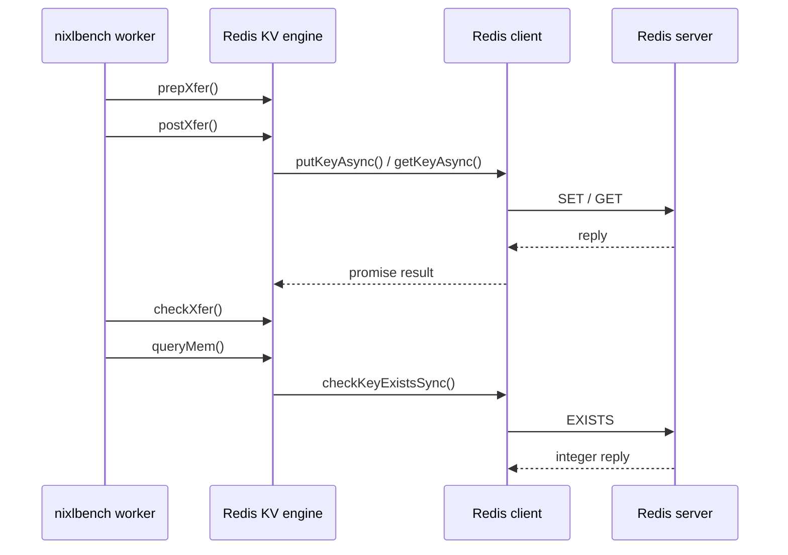

# [PR #1791] feat(redis): add Redis backend with async transfers and nixlbench support

source: https://github.com/ai-dynamo/nixl/pull/1791
state: open | updated: 2026-09-24T01:03:53Z
labels: external-contribution, size/XXL

## 正文

```markdown
## What?

This PR adds a production `REDIS` storage backend to NIXL, together with build, test, documentation, and nixlbench integration.

The implementation is Redis-specific and follows the direct backend structure used by plugins such as INFINIA:

```text
nixlBackendEngine
└── nixlRedisKVEngine
    └── iRedisClient
        └── hiredisAsyncClient
```

There is intentionally no generic KV backend layer or installed KV plugin API.

### Redis backend

- Registers the dynamic or static plugin as backend name `REDIS`.
- Supports `DRAM_SEG` and `OBJ_SEG`.
- Implements asynchronous `NIXL_WRITE` and `NIXL_READ` using Redis `SET` and `GET`.
- Implements synchronous `queryMem()` using Redis `EXISTS`.
- Uses a dedicated hiredis/libevent async connection for transfers.
- Uses a separate blocking hiredis connection for synchronous existence checks.
- Maps descriptor `metaInfo` to the Redis key, falling back to the decimal `devId`.
- Resolves all transfer keys before dispatching commands, preventing partially submitted transfers.
- Exposes asynchronous completion through the normal NIXL `postXfer()` / `checkXfer()` request-handle lifecycle.

The internal `iRedisClient` interface isolates hiredis/libevent and provides a deterministic unit-test seam. It is not intended as a generic KV extension API.

### Configuration

Connection settings are resolved once into an internal `RedisConfig` and passed to `hiredisAsyncClient`.

Configuration precedence is:

1. Valid NIXL backend parameters
2. Corresponding `REDIS_*` environment variables
3. Built-in defaults

| Backend parameter | Environment fallback | Default |
|-------------------|----------------------|---------|
| `host` | `REDIS_HOST` | `localhost` |
| `port` | `REDIS_PORT` | `6379` |
| `username` | `REDIS_USERNAME` | empty |
| `password` | `REDIS_PASSWORD` | empty |
| `db` | none | `0` |

Authentication behavior:

- Empty password: do not send `AUTH`; intended for Redis deployments that permit unauthenticated access.
- Password only: send `AUTH password` for the default/legacy user.
- Username and password: send ACL-style `AUTH username password`.
- Username without password: reject backend creation.

Explicit empty username or password parameters override environment fallbacks.

### nixlbench integration

- Adds `REDIS` as a nixlbench storage backend.
- Uses Redis keys carried in descriptor metadata.
- Seeds Redis keys before READ benchmarks.
- Adds Redis dependency handling to the nixlbench build.
- Adds `--redis-only` container build support for a static REDIS-focused image.

### Build integration

- Supports dynamic `[libplugin_REDIS.so](http://libplugin_redis.so/)` builds.
- Supports static REDIS plugin registration.
- Requires hiredis, libevent, and libevent-pthreads.
- Skips the plugin with a warning when dependencies are unavailable during a default all-plugin build.
- Fails configuration when REDIS is explicitly requested but its dependencies are unavailable.
- Does not require a Redis-specific ASIO executor or thread pool.

## Why?

Redis is widely deployed as a low-latency byte-oriented store and naturally fits NIXL’s storage descriptor model.

This backend enables applications and benchmarks to access Redis through the normal NIXL registration and transfer APIs without introducing a speculative generic KV framework. The direct `nixlBackendEngine` implementation keeps the plugin consistent with established NIXL backend architecture while retaining a small client boundary for hiredis isolation and testing.

## Transfer flow

### WRITE / READ

```text
nixlAgent
  → nixlRedisKVEngine::prepXfer()
      validates operation, descriptor counts, and memory types
  → nixlRedisKVEngine::postXfer()
      resolves every Redis key
      creates promise/future state
      issues async SET or GET commands
      returns NIXL_IN_PROG
  → nixlRedisKVEngine::checkXfer()
      polls completion futures
      returns NIXL_IN_PROG, NIXL_SUCCESS, or backend error
```

### queryMem

```text
nixlAgent
  → nixlRedisKVEngine::queryMem()
  → iRedisClient::checkKeyExistsSync()
  → Redis EXISTS on the blocking connection
```

The synchronous connection keeps `queryMem()` independent from the asynchronous transfer event loop.

## Testing

Redis unit coverage includes:

- Backend capabilities and supported memory types
- Default and parameter-based `RedisConfig` resolution
- Backend-parameter precedence over environment variables
- Unauthenticated and ACL credential validation
- Registration and key selection
- `queryMem()` found, missing, and error responses
- Transfer validation
- Asynchronous READ/WRITE polling and failures
- Null request handles
- Prevention of partial command dispatch

Validation performed:

- [x] Dynamic REDIS/full project build
- [x] Static REDIS/NIXL build
- [x] Redis unit tests: 11 passed
- [x] `git diff --check`
- [x] Live nixlbench READ/WRITE smoke test requires an available Redis server

```
# nixlbench result
build-nixlbench/nixlbench   --backend REDIS --op_type WRITE   --start_block_size 131072 --max_block_size 131072  --start_batch_size=1  --max_batch_size=64   --num_iter 1000   --warmup_iter 10   --num_threads 4
```


## 评论 (11)

### copy-pr-bot[bot] · 2026-06-17

This pull request requires additional validation before any workflows can run on NVIDIA's runners.

Pull request vetters can view their responsibilities [here](https://docs.gha-runners.nvidia.com/cpr/vetters).

Contributors can view more details about this message [here](https://docs.gha-runners.nvidia.com/cpr/contributors).


### github-actions[bot] · 2026-06-17

👋 Hi gaowayne! Thank you for contributing to ai-dynamo/nixl.

Your PR reviewers will review your contribution then trigger the CI to test your changes.

🚀

### coderabbitai[bot] · 2026-06-18

<!-- This is an auto-generated comment: summarize by coderabbit.ai -->
<!-- review_stack_entry_start -->

[](https://app.coderabbit.ai/change-stack/ai-dynamo/nixl/pull/1791?utm_source=github_walkthrough&utm_medium=github&utm_campaign=change_stack)

<!-- review_stack_entry_end -->
<!-- This is an auto-generated comment: review paused by coderabbit.ai -->

> [!NOTE]
> ## Reviews paused
> 
> It looks like this branch is under active development. To avoid overwhelming you with review comments due to an influx of new commits, CodeRabbit has automatically paused this review. You can configure this behavior by changing the `reviews.auto_review.auto_pause_after_reviewed_commits` setting.
> 
> Use the following commands to manage reviews:
> - `@coderabbitai resume` to resume automatic reviews.
> - `@coderabbitai review` to trigger a single review.
> 
> Use the checkboxes below for quick actions:
> - [ ] <!-- {"checkboxId": "7f6cc2e2-2e4e-497a-8c31-c9e4573e93d1"} --> ▶️ Resume reviews
> - [ ] <!-- {"checkboxId": "e9bb8d72-00e8-4f67-9cb2-caf3b22574fe"} --> 🔍 Trigger review

<!-- end of auto-generated comment: review paused by coderabbit.ai -->
<!-- walkthrough_start -->

<details>
<summary>📝 Walkthrough</summary>

## Walkthrough

Adds a Redis-backed KV plugin layer, wires it into the build and plugin system, extends nixlbench for Redis-backed storage checks, and adds documentation plus unit coverage for the new Redis path.

## Changes

**Redis KV Plugin and Benchmark Integration**

|Layer / File(s)|Summary|
|---|---|
|**KV abstraction** <br> `src/plugins/kv/kv_backend.h`, `src/plugins/kv/kv_backend.cpp`|Defines the KV store interface, backend engine contract, and delegating KV engine wrapper.|
|**Redis contracts** <br> `src/plugins/kv/redis/redis_engine.h`, `src/plugins/kv/redis/redis_executor.h`, `src/plugins/kv/redis/client.h`, `src/plugins/kv/redis/engine_impl.h`|Declares the Redis client interface, thread-pool executor, Redis engine, and Redis engine implementation headers.|
|**hiredis client implementation** <br> `src/plugins/kv/redis/client.cpp`|Implements the async and sync Redis client paths, including connection setup, callbacks, async commands, existence checks, and fallback stubs.|
|**Redis engine implementation** <br> `src/plugins/kv/redis/engine_impl.cpp`, `src/plugins/kv/redis/redis_engine.cpp`|Implements Redis-backed memory registration, query, transfer preparation, async transfer scheduling, request polling, and engine construction.|
|**Plugin wiring and build** <br> `src/plugins/kv/kv_plugin.cpp`, `src/plugins/kv/meson.build`, `src/plugins/kv/redis/meson.build`, `src/plugins/meson.build`, `meson.build`, `src/core/meson.build`, `src/core/nixl_plugin_manager.cpp`, `benchmark/nixlbench/src/utils/meson.build`|Wires the Redis plugin into Meson, static registration, exported dependency handling, and plugin entry points.|
|**nixlbench Redis support** <br> `benchmark/nixlbench/contrib/Dockerfile`, `benchmark/nixlbench/contrib/build.sh`, `benchmark/nixlbench/src/utils/utils.h`, `benchmark/nixlbench/src/utils/utils.cpp`, `benchmark/nixlbench/src/worker/nixl/nixl_worker.cpp`|Adds Redis backend constants and seeding helpers, updates worker Redis handling, and extends Docker and benchmark build configuration.|
|**Documentation and tests** <br> `src/plugins/kv/README.md`, `src/plugins/kv/redis/README.md`, `test/gtest/unit/meson.build`, `test/gtest/unit/redis/meson.build`, `test/gtest/unit/redis/redis.cpp`|Adds KV and Redis plugin documentation and Redis unit test coverage.|

## Sequence Diagram(s)



## Estimated code review effort

🎯 5 (Critical) | ⏱️ ~120 minutes

</details>

<!-- walkthrough_end -->
<!-- pre_merge_checks_walkthrough_start -->

<details>
<summary>🚥 Pre-merge checks | ✅ 4 | ❌ 1</summary>

### ❌ Failed checks (1 warning)

|     Check name     | Status     | Explanation                                                                           | Resolution                                                                         |
| :----------------: | :--------- | :------------------------------------------------------------------------------------ | :--------------------------------------------------------------------------------- |
| Docstring Coverage | ⚠️ Warning | Docstring coverage is 13.33% which is insufficient. The required threshold is 80.00%. | Write docstrings for the functions missing them to satisfy the coverage threshold. |

<details>
<summary>✅ Passed checks (4 passed)</summary>

|         Check name         | Status   | Explanation                                                                                                                              |
| :------------------------: | :------- | :--------------------------------------------------------------------------------------------------------------------------------------- |
|     Linked Issues check    | ✅ Passed | Check skipped because no linked issues were found for this pull request.                                                                 |
| Out of Scope Changes check | ✅ Passed | Check skipped because no linked issues were found for this pull request.                                                                 |
|         Title check        | ✅ Passed | The title clearly summarizes the Redis backend implementation and nixlbench integration, which are the main changes in the pull request. |
|      Description check     | ✅ Passed | The description covers What, Why, and How, and includes architecture, configuration, testing, and validation details.                    |

</details>

</details>

<!-- pre_merge_checks_walkthrough_end -->
<!-- finishing_touch_checkbox_start -->

<details>
<summary>✨ Finishing Touches</summary>

<details>
<summary>🧪 Generate unit tests (beta)</summary>

- [ ] <!-- {"checkboxId": "f47ac10b-58cc-4372-a567-0e02b2c3d479", "radioGroupId": "utg-output-choice-group-unknown_comment_id"} -->   Create PR with unit tests

</details>

</details>

<!-- finishing_touch_checkbox_end -->
<!-- tips_start -->

---


<sub>Comment `@coderabbitai help` to get the list of available commands.</sub>

<!-- tips_end -->

### hxieustc · 2026-06-26

@coderabbitai review

### coderabbitai[bot] · 2026-06-26

<!-- This is an auto-generated reply by CodeRabbit -->
<!-- CodeRabbit review command invocation: 29ca3b06-d99b-47cf-8734-5e9a5fc1201b -->
<details>
<summary>✅ Action performed</summary>

Review finished.

> Note: CodeRabbit is an incremental review system and does not re-review already reviewed commits. This command is applicable only when automatic reviews are paused.

</details>

### aranadive · 2026-08-13

@gaowayne can you update the PR based on the comments?

### gaowayne · 2026-08-14

> @gaowayne can you update the PR based on the comments?

sure, will follow up on these

### brminich · 2026-08-21

@gaowayne can you pls fix conflict?

### gaowayne · 2026-08-24

> @gaowayne can you pls fix conflict?

yeah, working on that

### gaowayne · 2026-08-24

> @gaowayne can you pls fix conflict?
@brminich I resolved recent comments, could you please help check what else we need take care?

### gaowayne · 2026-08-28

@hxieustc @aranadive @brminich @ofer hello team, I already resolved all the comment recently. thank you so much for all the comments

## Review (20)

### coderabbitai[bot] · 2026-06-18 · COMMENTED

**Actionable comments posted: 12**

<details>
<summary>🤖 Prompt for all review comments with AI agents</summary>

```
Verify each finding against current code. Fix only still-valid issues, skip the
rest with a brief reason, keep changes minimal, and validate.

Inline comments:
In `@benchmark/nixlbench/src/utils/utils.cpp`:
- Around line 1333-1342: The synchronous redisConnect call in the connection
block has no timeout mechanism and could block indefinitely if the Redis server
is unreachable or unresponsive. Replace the redisConnect function call with
redisConnectWithTimeout and provide an appropriate timeout value (in seconds and
microseconds as separate parameters) to ensure the connection attempt fails
gracefully within a reasonable time frame instead of blocking indefinitely.
- Around line 1319-1323: The port conversion using std::atoi silently returns 0
for invalid input strings, which would cause the code to attempt connecting to
port 0 instead of falling back to the default port 6379. Replace the std::atoi
call with std::stoi wrapped in a try-catch block to properly handle invalid port
strings, and ensure that if an exception is caught or the port value is invalid
(e.g., outside the valid port range 1-65535), the code either uses the default
port or logs an appropriate error message. This ensures that invalid REDIS_PORT
environment variable values are caught and handled gracefully rather than
silently defaulting to port 0.

In `@benchmark/nixlbench/src/utils/utils.h`:
- Line 97: Replace the preprocessor macro `XFERBENCH_BACKEND_REDIS` with a
`constexpr inline std::string_view` constant following the repository convention
for backend constants. Use lowercase naming as `xferbench_backend_redis` for the
new constant. Update all usages of `XFERBENCH_BACKEND_REDIS` throughout the
codebase to use the new constant, applying `.data()` or `std::string`
conversions where necessary for comparisons and string operations.

In `@benchmark/nixlbench/src/worker/nixl/nixl_worker.cpp`:
- Around line 1259-1263: The assignment of redis_remote.metaInfo = iov.metaInfo
on line 1262 is redundant because redis_remote is already copy-constructed from
iov on line 1260 via the xferBenchIOV constructor, which automatically copies
all member variables including metaInfo. Remove the redundant metaInfo
assignment line to eliminate unnecessary duplication.
- Around line 1048-1049: The descriptor list creation at lines 1048-1049 uses a
two-step pattern (constructing an empty list with DRAM_SEG, then calling
iovListToNixlRegDlist) which differs from the consistent pattern used elsewhere
in the file at lines 990, 1021, and 1098. Replace the two-line pattern with the
single-line assignment pattern where nixl_reg_dlist_t desc_list is directly
assigned the result of calling iovListToNixlRegDlist with the iov_list and
appropriate segment type, ensuring consistency across all similar descriptor
list creations in the file.

In `@src/plugins/kv/kv_backend.cpp`:
- Around line 21-26: Replace the debug-only assert statement in the nixlKVEngine
constructor that validates impl_ is non-null with actual runtime validation
(such as throwing a std::invalid_argument exception or logging an error and
exiting the program). The current assert will be stripped from release builds,
allowing a null impl_ to be assigned to impl_ and then crash on the first method
call. Use a proper if-check followed by error handling to ensure the validation
persists in both debug and release builds.

In `@src/plugins/kv/kv_backend.h`:
- Around line 18-19: Replace the generic header guard macro `KV_BACKEND_H` with
a repository-scoped guard following the convention `NIXL_<PATH>_H` where PATH
represents the full repository-relative path. For the file at
src/plugins/kv/kv_backend.h, update both the `#ifndef` and `#define` directives
at lines 18-19, and ensure the corresponding closing `#endif` at line 161
references the same new guard macro name.

In `@src/plugins/kv/redis/client.cpp`:
- Around line 313-320: The Redis GET reply handling in the memcpy section marks
success even when the payload is truncated due to insufficient buffer capacity.
The current logic uses std::min to determine copy_len but sets success to true
regardless of whether copy_len is smaller than r->len, allowing truncated data
to be silently treated as successful. Fix this by only setting success to true
when the entire reply was copied without truncation, which means adding a check
to verify that copy_len equals r->len before marking the operation as
successful, and handle the case where copy_len is 0 or truncation occurred as a
failure condition.

In `@src/plugins/kv/redis/client.h`:
- Around line 27-28: The header guard KV_PLUGIN_REDIS_CLIENT_H does not follow
the repository-wide convention that uses the full repository-relative path
format with the NIXL_ prefix. Replace KV_PLUGIN_REDIS_CLIENT_H with the
full-path header guard format (NIXL_SRC_PLUGINS_KV_REDIS_CLIENT_H) in both the
opening `#ifndef` and `#define` directives at the top of the file, and update any
corresponding `#endif` closing guard to match this new convention consistently
throughout the file.

In `@src/plugins/kv/redis/engine_impl.cpp`:
- Around line 180-183: In the getSupportedMems() validation block where
NIXL_ERR_NOT_SUPPORTED is returned, the out parameter is not initialized before
the early return statement. This leaves the out parameter in an uninitialized
state when the error path is taken, potentially exposing stale data to callers.
Initialize the out parameter to a safe default value (typically a null pointer
or default-initialized value) immediately before the return
NIXL_ERR_NOT_SUPPORTED statement to ensure all code paths properly initialize
output parameters.
- Around line 298-333: The loop in the Redis engine implementation performs both
key validation and command dispatch within the same loop iteration. To avoid
partial side effects when validation fails on a later descriptor, refactor this
into two separate passes: first validate that all redis_key lookups from
devIdToRedisKey_ succeed for every descriptor in the loop, returning
NIXL_ERR_INVALID_PARAM immediately if any key is missing, and only after all
keys are validated should the second loop dispatch the putKeyAsync or
getKeyAsync commands.

In `@src/plugins/kv/redis/engine_impl.h`:
- Around line 23-24: Update the header guard to follow the repository convention
of using the full repository-relative path format prefixed with NIXL. Replace
the current guard `KV_PLUGIN_REDIS_ENGINE_IMPL_H` at lines 23-24 with the
appropriate guard name derived from the full repository-relative path of the
file (src/plugins/kv/redis/engine_impl.h). Also update the corresponding closing
endif guard at line 89 to match the new guard name convention.
```

</details>

<details>
<summary>🪄 Autofix (Beta)</summary>

Fix all unresolved CodeRabbit comments on this PR:

- [ ] <!-- {"checkboxId": "4b0d0e0a-96d7-4f10-b296-3a18ea78f0b9"} --> Push a commit to this branch (recommended)
- [ ] <!-- {"checkboxId": "ff5b1114-7d8c-49e6-8ac1-43f82af23a33"} --> Create a new PR with the fixes

</details>

---

<details>
<summary>ℹ️ Review info</summary>

<details>
<summary>⚙️ Run configuration</summary>

**Configuration used**: Path: .coderabbit.yaml

**Review profile**: ASSERTIVE

**Plan**: Enterprise

**Run ID**: `1a791ca5-8787-4268-b14c-a6a0d9461302`

</details>

<details>
<summary>📥 Commits</summary>

Reviewing files that changed from the base of the PR and between 1f4468faec77165dea7b9ebc67420d7e170c3fcf and dc629dce623b1d878b98d3c308a1e5636881c9ab.

</details>

<details>
<summary>📒 Files selected for processing (24)</summary>

* `benchmark/nixlbench/contrib/Dockerfile`
* `benchmark/nixlbench/contrib/build.sh`
* `benchmark/nixlbench/src/utils/meson.build`
* `benchmark/nixlbench/src/utils/utils.cpp`
* `benchmark/nixlbench/src/utils/utils.h`
* `benchmark/nixlbench/src/worker/nixl/nixl_worker.cpp`
* `meson.build`
* `src/core/meson.build`
* `src/core/nixl_plugin_manager.cpp`
* `src/plugins/kv/README.md`
* `src/plugins/kv/kv_backend.cpp`
* `src/plugins/kv/kv_backend.h`
* `src/plugins/kv/kv_plugin.cpp`
* `src/plugins/kv/meson.build`
* `src/plugins/kv/redis/README.md`
* `src/plugins/kv/redis/client.cpp`
* `src/plugins/kv/redis/client.h`
* `src/plugins/kv/redis/engine_impl.cpp`
* `src/plugins/kv/redis/engine_impl.h`
* `src/plugins/kv/redis/meson.build`
* `src/plugins/kv/redis/redis_engine.cpp`
* `src/plugins/kv/redis/redis_engine.h`
* `src/plugins/kv/redis/redis_executor.h`
* `src/plugins/meson.build`

</details>

</details>

<!-- This is an auto-generated comment by CodeRabbit for review status -->

### coderabbitai[bot] · 2026-06-22 · COMMENTED

**Actionable comments posted: 11**

> [!CAUTION]
> Some comments are outside the diff and can’t be posted inline due to platform limitations.
> 
> 
> 
> <details>
> <summary>⚠️ Outside diff range comments (1)</summary><blockquote>
> 
> <details>
> <summary>benchmark/nixlbench/contrib/Dockerfile (1)</summary><blockquote>
> 
> `29-53`: _⚠️ Potential issue_ | _🟠 Major_ | _⚡ Quick win_
> 
> **Harden apt install with `--no-install-recommends`.**
> 
> This layer currently installs recommended packages implicitly, which unnecessarily expands image footprint and package exposure.
> 
> 
> 
> 
> 
> 
> 
> <details>
> <summary>🔧 Suggested patch</summary>
> 
> ```diff
>  RUN apt-get update -y && \
> -    DEBIAN_FRONTEND=noninteractive apt-get -y install \
> +    DEBIAN_FRONTEND=noninteractive apt-get -y install --no-install-recommends \
>      ninja-build \
>      pybind11-dev \
>      libclang-dev \
> @@
>      build-essential \
>      libhiredis-dev \
>      libevent-dev \
> -    redis-tools
> +    redis-tools && \
> +    rm -rf /var/lib/apt/lists/*
> ```
> </details>
> 
> <details>
> <summary>🤖 Prompt for AI Agents</summary>
> 
> ```
> Verify each finding against current code. Fix only still-valid issues, skip the
> rest with a brief reason, keep changes minimal, and validate.
> 
> In `@benchmark/nixlbench/contrib/Dockerfile` around lines 29 - 53, The apt-get
> install command in the RUN statement is missing the --no-install-recommends
> flag, which causes unnecessary recommended packages to be installed, increasing
> the Docker image footprint and security exposure. Add the
> --no-install-recommends flag to the apt-get install command that installs
> packages including ninja-build, pybind11-dev, libclang-dev, and the other build
> and runtime dependencies. Place this flag after the -y option and before the
> package list to ensure only explicitly requested packages are installed.
> ```
> 
> </details>
> 
> <!-- cr-comment:v1:f7bf32900884049df0be6573 -->
> 
> _Source: Linters/SAST tools_
> 
> </blockquote></details>
> 
> </blockquote></details>

<details>
<summary>🤖 Prompt for all review comments with AI agents</summary>

```
Verify each finding against current code. Fix only still-valid issues, skip the
rest with a brief reason, keep changes minimal, and validate.

Inline comments:
In `@benchmark/nixlbench/src/worker/nixl/nixl_worker.cpp`:
- Around line 1036-1041: The current code uses `continue` when
xferBenchUtils::putRedis fails during READ mode seeding, which skips the current
device descriptor but leaves downstream code expecting a complete per-device
`remote_regs_` list indexed by device position. This creates a mismatch between
the number of devices processed and the size of the `remote_regs_` list, causing
potential out-of-bounds access. Replace the `continue` statement with a
fail-fast mechanism (such as `return` or `break`) that exits the loop
immediately when Redis seeding fails, ensuring the device descriptor count
remains consistent with the indexing expectations in downstream code.

In `@src/plugins/kv/kv_backend.h`:
- Line 79: The destructor for the nixlKVEngine class is overriding a virtual
base destructor but is not explicitly marked with the override keyword. Add the
override keyword to the virtual destructor declaration of nixlKVEngine to
explicitly indicate that it overrides a base class virtual destructor, placing
it after the destructor signature and before the semicolon.

In `@src/plugins/kv/redis/client.cpp`:
- Line 221: The Redis client source file has formatting mismatches that
clang-format can automatically correct. Run clang-format on the client.cpp file
in the Redis plugin directory to fix the formatting inconsistencies that are
causing CI failures. This will ensure the code adheres to the project's coding
style guidelines.
- Around line 162-167: The AUTH and SELECT commands in the async initialization
are issued with nullptr callbacks, causing authentication and database selection
failures to be silently ignored. Create proper callback handler functions for
these commands that validate their responses and check for errors. Modify the
redisAsyncCommand calls for both "AUTH %s" and "SELECT %d" to pass these
callback handlers instead of nullptr, and ensure the client connection state is
only marked as ready after both AUTH (if password is provided) and SELECT (if db
is non-zero) commands complete successfully.

In `@src/plugins/kv/redis/client.h`:
- Around line 1-127: The header file src/plugins/kv/redis/client.h does not
conform to the project's code formatting standards as reported by
clang-format-diff-19 in CI. Run clang-format on the entire file to automatically
reformat it according to the project's style conventions. This should resolve
any formatting issues in the hiredisAsyncClient class definition and related
code.

In `@src/plugins/kv/redis/engine_impl.cpp`:
- Around line 91-95: The if statement checking `remote_agent != local_agent` is
missing braces around its body, which violates coding guidelines requiring
braces for all control statements. Add opening and closing braces around the
NIXL_WARN logging statement that follows the if condition to comply with the
style requirements.

In `@src/plugins/kv/redis/engine_impl.h`:
- Around line 45-55: The method declarations in the RedisEngine class
(specifically getSupportedMems, registerMem, deregisterMem, and queryMem) in
engine_impl.h do not conform to the repository's clang-format formatting
standards as verified by CI. Run clang-format on the entire engine_impl.h file
to automatically reformat these declarations according to the established coding
guidelines, which will resolve the CI formatting deltas reported in the
declaration block at lines 45-55 and also at lines 74-76.

In `@src/plugins/kv/redis/meson.build`:
- Around line 105-110: The redis_backend_lib shared_library call is missing
compile_flags that are present in the static build path, causing inconsistent
compilation between static and shared plugin artifacts. Locate the compile_flags
variable used in the static REDIS build definition in the same file, then add
these flags to the cpp_args parameter in the redis_backend_lib shared_library
call to ensure both static and shared builds use the same compiler flags.

In `@src/plugins/kv/redis/redis_engine.h`:
- Around line 1-103: The redis_engine.h file has formatting drift detected by
clang-format-diff-19, which is causing CI to fail. Run clang-format on the
redis_engine.h file using the project's clang-format configuration to
automatically fix all formatting issues in the file. This should resolve the
formatting drift in the copyright headers, includes, class definitions
iRedisClient and nixlRedisKVEngine, method declarations, and overall code style
to match the project standards.

In `@src/plugins/kv/redis/redis_executor.h`:
- Around line 1-53: The header file redis_executor.h containing the
redisThreadPoolExecutor class requires code formatting updates as flagged by the
project's clang-format CI checks. Run clang-format on this file to automatically
apply the required formatting changes and align it with the project's coding
style guidelines.
- Around line 34-37: The method name WaitUntilStopped uses PascalCase but the
repository convention requires lowerCamelCase for member methods. Rename the
method from WaitUntilStopped to waitUntilStopped in the redis_executor.h file,
and then search for and update all call sites throughout the codebase where
WaitUntilStopped is invoked to use the new lowercase name waitUntilStopped
instead.

---

Outside diff comments:
In `@benchmark/nixlbench/contrib/Dockerfile`:
- Around line 29-53: The apt-get install command in the RUN statement is missing
the --no-install-recommends flag, which causes unnecessary recommended packages
to be installed, increasing the Docker image footprint and security exposure.
Add the --no-install-recommends flag to the apt-get install command that
installs packages including ninja-build, pybind11-dev, libclang-dev, and the
other build and runtime dependencies. Place this flag after the -y option and
before the package list to ensure only explicitly requested packages are
installed.
```

</details>

<details>
<summary>🪄 Autofix (Beta)</summary>

Fix all unresolved CodeRabbit comments on this PR:

- [ ] <!-- {"checkboxId": "4b0d0e0a-96d7-4f10-b296-3a18ea78f0b9"} --> Push a commit to this branch (recommended)
- [ ] <!-- {"checkboxId": "ff5b1114-7d8c-49e6-8ac1-43f82af23a33"} --> Create a new PR with the fixes

</details>

---

<details>
<summary>ℹ️ Review info</summary>

<details>
<summary>⚙️ Run configuration</summary>

**Configuration used**: Path: .coderabbit.yaml

**Review profile**: ASSERTIVE

**Plan**: Enterprise

**Run ID**: `23a86fa0-b1c2-421f-a0d3-56f4eae8784a`

</details>

<details>
<summary>📥 Commits</summary>

Reviewing files that changed from the base of the PR and between dc629dce623b1d878b98d3c308a1e5636881c9ab and b3af2976f3cb8de85acd72ef094a402a4c5dc9b9.

</details>

<details>
<summary>📒 Files selected for processing (24)</summary>

* `benchmark/nixlbench/contrib/Dockerfile`
* `benchmark/nixlbench/contrib/build.sh`
* `benchmark/nixlbench/src/utils/meson.build`
* `benchmark/nixlbench/src/utils/utils.cpp`
* `benchmark/nixlbench/src/utils/utils.h`
* `benchmark/nixlbench/src/worker/nixl/nixl_worker.cpp`
* `meson.build`
* `src/core/meson.build`
* `src/core/nixl_plugin_manager.cpp`
* `src/plugins/kv/README.md`
* `src/plugins/kv/kv_backend.cpp`
* `src/plugins/kv/kv_backend.h`
* `src/plugins/kv/kv_plugin.cpp`
* `src/plugins/kv/meson.build`
* `src/plugins/kv/redis/README.md`
* `src/plugins/kv/redis/client.cpp`
* `src/plugins/kv/redis/client.h`
* `src/plugins/kv/redis/engine_impl.cpp`
* `src/plugins/kv/redis/engine_impl.h`
* `src/plugins/kv/redis/meson.build`
* `src/plugins/kv/redis/redis_engine.cpp`
* `src/plugins/kv/redis/redis_engine.h`
* `src/plugins/kv/redis/redis_executor.h`
* `src/plugins/meson.build`

</details>

</details>

<!-- This is an auto-generated comment by CodeRabbit for review status -->

### coderabbitai[bot] · 2026-06-22 · COMMENTED

**Actionable comments posted: 6**

> [!CAUTION]
> Some comments are outside the diff and can’t be posted inline due to platform limitations.
> 
> 
> 
> <details>
> <summary>⚠️ Outside diff range comments (1)</summary><blockquote>
> 
> <details>
> <summary>benchmark/nixlbench/contrib/Dockerfile (1)</summary><blockquote>
> 
> `29-53`: _⚠️ Potential issue_ | _🟡 Minor_ | _⚡ Quick win_
> 
> **Use `--no-install-recommends` in the base apt install layer.**
> 
> Line 30 installs many packages without `--no-install-recommends`, which increases image size/surface area unnecessarily.
> 
> 
> 
> 
> 
> 
> <details>
> <summary>♻️ Minimal fix</summary>
> 
> ```diff
>  RUN apt-get update -y && \
> -    DEBIAN_FRONTEND=noninteractive apt-get -y install \
> +    DEBIAN_FRONTEND=noninteractive apt-get -y install --no-install-recommends \
>      ninja-build \
>      pybind11-dev \
> @@
> -    redis-tools
> +    redis-tools && \
> +    rm -rf /var/lib/apt/lists/*
> ```
> </details>
> 
> <details>
> <summary>🤖 Prompt for AI Agents</summary>
> 
> ```
> Verify each finding against current code. Fix only still-valid issues, skip the
> rest with a brief reason, keep changes minimal, and validate.
> 
> In `@benchmark/nixlbench/contrib/Dockerfile` around lines 29 - 53, The apt-get
> install command in the RUN layer that installs packages like ninja-build,
> pybind11-dev, libclang-dev, cmake, and others is missing the
> --no-install-recommends flag. Add --no-install-recommends to the apt-get install
> command (after the -y flag and before the package list) to prevent the
> installation of recommended packages that are not strictly required, which will
> reduce the Docker image size and surface area.
> ```
> 
> </details>
> 
> <!-- cr-comment:v1:938ad25f62a14479d14e408e -->
> 
> _Source: Linters/SAST tools_
> 
> </blockquote></details>
> 
> </blockquote></details>

<details>
<summary>🤖 Prompt for all review comments with AI agents</summary>

```
Verify each finding against current code. Fix only still-valid issues, skip the
rest with a brief reason, keep changes minimal, and validate.

Inline comments:
In `@benchmark/nixlbench/contrib/Dockerfile`:
- Around line 125-126: The Dockerfile ARG declarations for NIXL_ENABLE_PLUGINS
and NIXL_STATIC_PLUGINS are hardcoded to "REDIS", which restricts plugin
building and duplicates the --redis-only flag intent from the build script.
Either change both ARG assignments to use empty strings as values (allowing
Meson to build all plugins by default) or remove the --redis-only option from
the build script if Redis-only is the intended behavior. Clarify the intent and
ensure the Dockerfile defaults and build script flags are not redundant.

In `@benchmark/nixlbench/src/utils/utils.cpp`:
- Line 67: The backend option documentation at line 67 lists GUSLI as a valid
backend option along with REDIS and AZURE_BLOB, but the actual printed backend
list at lines 683-684 omits GUSLI. To fix this inconsistency, add GUSLI to the
backend list string that is printed at lines 683-684 so that it matches the
documented options shown in the help message at line 67, ensuring users see a
complete and accurate list of available backends when viewing configuration
output.

In `@src/plugins/kv/README.md`:
- Around line 49-52: The file map entry for the `iRedisClient` interface is
incorrectly documented as being in `redis_engine.h/.cpp` when it actually
resides in `src/plugins/kv/redis/client.h`. Update the mapping entry for
`iRedisClient` on line 49 to reflect the correct file location in
`client.h/.cpp` instead of `redis_engine.h/.cpp`.

In `@src/plugins/kv/redis/client.cpp`:
- Around line 176-183: The code is calling redisAsyncFree(asyncContext_)
immediately after redisAsyncDisconnect(asyncContext_), which causes a
double-free memory error. The hiredis async API automatically frees the context
when redisAsyncDisconnect() completes its callback, so the subsequent
redisAsyncFree() call is redundant and dangerous. Remove the
redisAsyncFree(asyncContext_) call that follows
redisAsyncDisconnect(asyncContext_) in the constructor timeout path where
connected_.load() is false. Apply this same fix pattern to any other locations
in the code where this redundant call pattern exists.

In `@src/plugins/kv/redis/meson.build`:
- Around line 62-68: The REDIS plugin build silently skips with a warning for
shared builds even when explicitly requested by the user, while static builds
properly fail with an error. Modify the condition on line 62 that currently only
checks if 'REDIS' is in static_plugins to also check if REDIS is explicitly
enabled for shared builds (check the get_option or similar mechanism for REDIS
explicit enablement). When REDIS is explicitly requested in any form and the
required dependencies (hiredis_async_dep or libevent_dep) are missing, throw an
error instead of just warning and skipping. Only allow the silent skip with a
warning when REDIS was not explicitly requested by the user.

In `@src/plugins/kv/redis/README.md`:
- Line 61: The documentation on line 61 of the README.md file incorrectly
implies that the `db` parameter can be configured via environment variables, but
the actual implementation in src/plugins/kv/redis/client.cpp only reads `db`
from custom params. Reword line 61 to clarify that `db` is configured through
NIXL custom params only, while keeping the distinction that `host`, `port`, and
`password` can come from either custom params or their respective environment
variables (REDIS_HOST, REDIS_PORT, REDIS_PASSWORD).

---

Outside diff comments:
In `@benchmark/nixlbench/contrib/Dockerfile`:
- Around line 29-53: The apt-get install command in the RUN layer that installs
packages like ninja-build, pybind11-dev, libclang-dev, cmake, and others is
missing the --no-install-recommends flag. Add --no-install-recommends to the
apt-get install command (after the -y flag and before the package list) to
prevent the installation of recommended packages that are not strictly required,
which will reduce the Docker image size and surface area.
```

</details>

<details>
<summary>🪄 Autofix (Beta)</summary>

Fix all unresolved CodeRabbit comments on this PR:

- [ ] <!-- {"checkboxId": "4b0d0e0a-96d7-4f10-b296-3a18ea78f0b9"} --> Push a commit to this branch (recommended)
- [ ] <!-- {"checkboxId": "ff5b1114-7d8c-49e6-8ac1-43f82af23a33"} --> Create a new PR with the fixes

</details>

---

<details>
<summary>ℹ️ Review info</summary>

<details>
<summary>⚙️ Run configuration</summary>

**Configuration used**: Path: .coderabbit.yaml

**Review profile**: ASSERTIVE

**Plan**: Enterprise

**Run ID**: `029f983b-216b-41e8-a2b6-96d6a47a757a`

</details>

<details>
<summary>📥 Commits</summary>

Reviewing files that changed from the base of the PR and between b3af2976f3cb8de85acd72ef094a402a4c5dc9b9 and b1b1b03e62da458b869ffe5c182030c05707ee20.

</details>

<details>
<summary>📒 Files selected for processing (24)</summary>

* `benchmark/nixlbench/contrib/Dockerfile`
* `benchmark/nixlbench/contrib/build.sh`
* `benchmark/nixlbench/src/utils/meson.build`
* `benchmark/nixlbench/src/utils/utils.cpp`
* `benchmark/nixlbench/src/utils/utils.h`
* `benchmark/nixlbench/src/worker/nixl/nixl_worker.cpp`
* `meson.build`
* `src/core/meson.build`
* `src/core/nixl_plugin_manager.cpp`
* `src/plugins/kv/README.md`
* `src/plugins/kv/kv_backend.cpp`
* `src/plugins/kv/kv_backend.h`
* `src/plugins/kv/kv_plugin.cpp`
* `src/plugins/kv/meson.build`
* `src/plugins/kv/redis/README.md`
* `src/plugins/kv/redis/client.cpp`
* `src/plugins/kv/redis/client.h`
* `src/plugins/kv/redis/engine_impl.cpp`
* `src/plugins/kv/redis/engine_impl.h`
* `src/plugins/kv/redis/meson.build`
* `src/plugins/kv/redis/redis_engine.cpp`
* `src/plugins/kv/redis/redis_engine.h`
* `src/plugins/kv/redis/redis_executor.h`
* `src/plugins/meson.build`

</details>

</details>

<!-- This is an auto-generated comment by CodeRabbit for review status -->

### ColinNV · 2026-06-23 · COMMENTED

(no text)

### coderabbitai[bot] · 2026-06-23 · COMMENTED

(no text)

### coderabbitai[bot] · 2026-06-23 · COMMENTED

**Actionable comments posted: 3**

<details>
<summary>♻️ Duplicate comments (8)</summary><blockquote>

<details>
<summary>src/plugins/kv/kv_backend.h (2)</summary><blockquote>

`79-79`: _📐 Maintainability & Code Quality_ | _🟡 Minor_ | _⚡ Quick win_

**Mark the overriding destructor with `override`.**

`nixlKVEngine` derives from `nixlBackendEngine`; the destructor declaration should be `~nixlKVEngine() override;`.
As per path instructions, overridden virtual methods should explicitly use `override`.

<details>
<summary>🤖 Prompt for AI Agents</summary>

```
Verify each finding against current code. Fix only still-valid issues, skip the
rest with a brief reason, keep changes minimal, and validate.

In `@src/plugins/kv/kv_backend.h` at line 79, The destructor declaration for the
nixlKVEngine class is missing the override keyword. Since nixlKVEngine derives
from nixlBackendEngine and overrides its virtual destructor, add the override
keyword to the destructor declaration. Modify the ~nixlKVEngine destructor to
include override after the empty parameter list to explicitly indicate it is
overriding a base class virtual method, following the codebase convention for
overridden virtual methods.
```

</details>

<!-- cr-comment:v1:c0d4003f3699708cc6ae77ac -->

_Source: Path instructions_

---

`18-19`: _📐 Maintainability & Code Quality_ | _🟡 Minor_ | _⚡ Quick win_

**Use the repository-relative header guard macro.**

`KV_BACKEND_H` is too generic and can collide across headers. Use
`NIXL_SRC_PLUGINS_KV_KV_BACKEND_H` consistently in `#ifndef/#define/#endif`.
As per path instructions, headers should use traditional include guards; based on learnings, this repo uses full repository-relative `NIXL_<PATH>_H` guards.
     


Also applies to: 161-161

<details>
<summary>🤖 Prompt for AI Agents</summary>

```
Verify each finding against current code. Fix only still-valid issues, skip the
rest with a brief reason, keep changes minimal, and validate.

In `@src/plugins/kv/kv_backend.h` around lines 18 - 19, Replace the generic header
guard macro KV_BACKEND_H with the repository-relative macro
NIXL_SRC_PLUGINS_KV_KV_BACKEND_H to prevent collisions with other headers.
Update the `#ifndef` directive at the top of the file, the corresponding `#define`
directive, and the matching `#endif` at the end of the file to use the new
fully-qualified macro name NIXL_SRC_PLUGINS_KV_KV_BACKEND_H instead of the
generic KV_BACKEND_H.
```

</details>

<!-- cr-comment:v1:ef35119a005cc11fe919db80 -->

_Sources: Path instructions, Learnings_

</blockquote></details>
<details>
<summary>src/plugins/kv/redis/redis_executor.h (1)</summary><blockquote>

`34-37`: _📐 Maintainability & Code Quality_ | _🟡 Minor_ | _⚡ Quick win_

**Normalize method naming to lower camel case.**

`WaitUntilStopped` breaks the file’s own naming pattern (`waitUntilIdle`) and the repo convention. Rename it to `waitUntilStopped` and update call sites.
As per path instructions, functions/methods should use lower camel case.

<details>
<summary>🤖 Prompt for AI Agents</summary>

```
Verify each finding against current code. Fix only still-valid issues, skip the
rest with a brief reason, keep changes minimal, and validate.

In `@src/plugins/kv/redis/redis_executor.h` around lines 34 - 37, The method
`WaitUntilStopped` uses upper camel case naming which violates the repository
convention of lower camel case (as seen in the same file with `waitUntilIdle`).
Rename the method `WaitUntilStopped` to `waitUntilStopped` in its definition,
and update all call sites throughout the codebase that invoke this method to use
the new lower camel case name.
```

</details>

<!-- cr-comment:v1:bf3d7bcef3add2cb93d9a9df -->

_Source: Path instructions_

</blockquote></details>
<details>
<summary>src/plugins/kv/redis/client.h (1)</summary><blockquote>

`27-28`: _📐 Maintainability & Code Quality_ | _🟡 Minor_ | _⚡ Quick win_

**Adopt the full repository-path header guard.**

Replace `KV_PLUGIN_REDIS_CLIENT_H` with `NIXL_SRC_PLUGINS_KV_REDIS_CLIENT_H` in the opening and closing guard.
As per path instructions, use traditional include guards; based on learnings, this repo standard is full-path `NIXL_<PATH>_H`.
     


Also applies to: 127-127

<details>
<summary>🤖 Prompt for AI Agents</summary>

```
Verify each finding against current code. Fix only still-valid issues, skip the
rest with a brief reason, keep changes minimal, and validate.

In `@src/plugins/kv/redis/client.h` around lines 27 - 28, The header guard macro
KV_PLUGIN_REDIS_CLIENT_H does not follow the repository's full-path naming
convention. Replace KV_PLUGIN_REDIS_CLIENT_H with
NIXL_SRC_PLUGINS_KV_REDIS_CLIENT_H in both locations: the opening `#ifndef` and
`#define` directives at the top of the file, and the closing `#endif` comment at the
bottom of the file. This ensures consistency with the repository standard of
using full-path prefixes in the format NIXL_<PATH>_H for all header guards.
```

</details>

<!-- cr-comment:v1:70a1362b481ff999e3e31030 -->

_Sources: Path instructions, Learnings_

</blockquote></details>
<details>
<summary>src/plugins/kv/redis/README.md (1)</summary><blockquote>

`61-61`: _📐 Maintainability & Code Quality_ | _🟡 Minor_ | _⚡ Quick win_

**Clarify the `db` configuration source.**

This line currently implies `db` may come from env vars, but only `REDIS_HOST/PORT/PASSWORD` are listed. Please explicitly separate: `db` from NIXL params, others from params or env fallback.

<details>
<summary>🤖 Prompt for AI Agents</summary>

```
Verify each finding against current code. Fix only still-valid issues, skip the
rest with a brief reason, keep changes minimal, and validate.

In `@src/plugins/kv/redis/README.md` at line 61, The documentation line describing
connection settings is ambiguous about where the `db` parameter is configured.
Currently it lists `db` alongside other parameters but then only provides
environment variable names for `host`, `port`, and `password`, leaving `db`'s
source unclear. Revise this line to explicitly separate the configuration
sources: clearly state which parameters come from NIXL custom params only, and
which can fall back to environment variables. If `db` has a corresponding
environment variable like `REDIS_DB`, include it; otherwise explicitly note that
`db` only comes from NIXL params to eliminate confusion.
```

</details>

<!-- cr-comment:v1:1e1bde657eb70a9a01c7b38e -->

</blockquote></details>
<details>
<summary>src/plugins/kv/redis/engine_impl.h (2)</summary><blockquote>

`42-76`: _📐 Maintainability & Code Quality_ | _🟠 Major_ | _⚡ Quick win_

**Resolve the clang-format drift in declaration blocks.**

CI is still reporting formatting deltas in this range (return-type/signature wrapping), which will keep the format check red until fixed.
As per path instructions, keep declaration formatting consistent (including return-type line breaks), and pipeline failures explicitly flag this range.

<details>
<summary>🤖 Prompt for AI Agents</summary>

```
Verify each finding against current code. Fix only still-valid issues, skip the
rest with a brief reason, keep changes minimal, and validate.

In `@src/plugins/kv/redis/engine_impl.h` around lines 42 - 76, The method
declarations in the nixlRedisKVEngineImpl class (including registerMem,
deregisterMem, queryMem, prepXfer, postXfer, checkXfer, and releaseReqH) have
inconsistent clang-format formatting with respect to return-type line breaks and
signature wrapping. Apply clang-format rules consistently across all
declarations in this range to ensure uniform formatting of return types,
parameter list alignment, and line breaks. Verify that the formatting matches
the project's clang-format configuration and that CI formatting checks pass
after the changes.
```

</details>

<!-- cr-comment:v1:c80b422706a45c4f24cfae2c -->

_Sources: Path instructions, Pipeline failures_

---

`23-24`: _📐 Maintainability & Code Quality_ | _🟡 Minor_ | _⚡ Quick win_

**Use the repo-standard include guard macro.**

`KV_PLUGIN_REDIS_ENGINE_IMPL_H` should be updated to
`NIXL_SRC_PLUGINS_KV_REDIS_ENGINE_IMPL_H` for consistency and collision safety.
As per path instructions, headers should use traditional path-derived guards; based on learnings, this repo enforces full-path `NIXL_<PATH>_H`.
     


Also applies to: 89-89

<details>
<summary>🤖 Prompt for AI Agents</summary>

```
Verify each finding against current code. Fix only still-valid issues, skip the
rest with a brief reason, keep changes minimal, and validate.

In `@src/plugins/kv/redis/engine_impl.h` around lines 23 - 24, The include guard
macro KV_PLUGIN_REDIS_ENGINE_IMPL_H does not follow the repository's standard
naming convention. Replace all occurrences of this macro name with
NIXL_SRC_PLUGINS_KV_REDIS_ENGINE_IMPL_H throughout the file, including in the
`#ifndef` directive at the top, the `#define` directive on the following line, and
the corresponding `#endif` directive at the end of the file (around line 89). This
ensures consistency with the repo's full-path-derived include guard convention
for collision safety.
```

</details>

<!-- cr-comment:v1:ef5032046d2e5b11925f8744 -->

_Sources: Path instructions, Learnings_

</blockquote></details>
<details>
<summary>src/plugins/kv/kv_backend.cpp (1)</summary><blockquote>

`21-26`: _🩺 Stability & Availability_ | _🟠 Major_ | _⚡ Quick win_

**Replace debug-only `assert` with release-safe validation.**

`impl_` is only protected by `assert`, so release builds can construct with null and crash later on delegated calls.

<details>
<summary>Suggested fix</summary>

```diff
 `#include` "kv_backend.h"
 `#include` <cassert>
+#include <stdexcept>
@@
 nixlKVEngine::nixlKVEngine(const nixlBackendInitParams *init_params,
                            std::unique_ptr<nixlKVEngineImpl> impl)
     : nixlBackendEngine(init_params),
       impl_(std::move(impl)) {
+    if (!impl_) {
+        throw std::invalid_argument("nixlKVEngine requires a non-null nixlKVEngineImpl");
+    }
     assert(impl_ && "nixlKVEngine requires a non-null nixlKVEngineImpl");
 }
```
</details>

<details>
<summary>🤖 Prompt for AI Agents</summary>

```
Verify each finding against current code. Fix only still-valid issues, skip the
rest with a brief reason, keep changes minimal, and validate.

In `@src/plugins/kv/kv_backend.cpp` around lines 21 - 26, The assert statement
protecting impl_ in the nixlKVEngine constructor only executes in debug builds
and is stripped in release builds, allowing null impl_ to pass through and cause
crashes on later delegated calls. Replace the assert in the nixlKVEngine
constructor with release-safe validation, such as throwing an exception if impl_
is null, to ensure the null check is enforced consistently across both debug and
release builds.
```

</details>

<!-- cr-comment:v1:cc62e336871132f9a8943d01 -->

</blockquote></details>

</blockquote></details>

<details>
<summary>🤖 Prompt for all review comments with AI agents</summary>

```
Verify each finding against current code. Fix only still-valid issues, skip the
rest with a brief reason, keep changes minimal, and validate.

Inline comments:
In `@benchmark/nixlbench/src/utils/utils.cpp`:
- Line 827: The checkConsistency() function's storage WRITE path at line 827
does not properly handle the Redis backend before attempting to use pread() for
validation. Redis stores keys in metaInfo rather than file descriptors, which
causes the validation to fail when using --backend=REDIS with --op_type=WRITE
and --check_consistency=1. Add a Redis-specific validation branch within
checkConsistency() that handles Redis GET validation using the metaInfo keys, or
explicitly reject the Redis backend option in WRITE consistency validation mode
before reaching the pread() call.

In `@benchmark/nixlbench/src/worker/nixl/nixl_worker.cpp`:
- Around line 1258-1262: In the Redis backend branch of
prepareTransferDescriptors(), the redis_remote descriptor is not applying the
block_size parameter like the file and GUSLI storage paths do. After setting
redis_remote.addr to 0 and redis_remote.metaInfo to iov.metaInfo, add a line to
set redis_remote.len to the block_size value to ensure the configured benchmark
block size is respected for Redis transfers instead of using the default iov
length.

In `@src/plugins/kv/redis/client.cpp`:
- Around line 334-387: The redisAsyncContext is not thread-safe and must only be
accessed from the event-loop thread (eventLoopThread_), but putKeyAsync and
getKeyAsync are calling redisAsyncCommand directly from caller threads without
synchronization. To fix this, you need to marshal the redisAsyncCommand calls
onto the event-loop thread instead of executing them directly. Use a mechanism
like event_base_once to schedule the command execution on the event loop, or
implement a thread-safe command queue with a wakeup mechanism. This ensures all
asyncContext_ accesses happen only within the event-loop thread that runs
event_base_dispatch.

---

Duplicate comments:
In `@src/plugins/kv/kv_backend.cpp`:
- Around line 21-26: The assert statement protecting impl_ in the nixlKVEngine
constructor only executes in debug builds and is stripped in release builds,
allowing null impl_ to pass through and cause crashes on later delegated calls.
Replace the assert in the nixlKVEngine constructor with release-safe validation,
such as throwing an exception if impl_ is null, to ensure the null check is
enforced consistently across both debug and release builds.

In `@src/plugins/kv/kv_backend.h`:
- Line 79: The destructor declaration for the nixlKVEngine class is missing the
override keyword. Since nixlKVEngine derives from nixlBackendEngine and
overrides its virtual destructor, add the override keyword to the destructor
declaration. Modify the ~nixlKVEngine destructor to include override after the
empty parameter list to explicitly indicate it is overriding a base class
virtual method, following the codebase convention for overridden virtual
methods.
- Around line 18-19: Replace the generic header guard macro KV_BACKEND_H with
the repository-relative macro NIXL_SRC_PLUGINS_KV_KV_BACKEND_H to prevent
collisions with other headers. Update the `#ifndef` directive at the top of the
file, the corresponding `#define` directive, and the matching `#endif` at the end of
the file to use the new fully-qualified macro name
NIXL_SRC_PLUGINS_KV_KV_BACKEND_H instead of the generic KV_BACKEND_H.

In `@src/plugins/kv/redis/client.h`:
- Around line 27-28: The header guard macro KV_PLUGIN_REDIS_CLIENT_H does not
follow the repository's full-path naming convention. Replace
KV_PLUGIN_REDIS_CLIENT_H with NIXL_SRC_PLUGINS_KV_REDIS_CLIENT_H in both
locations: the opening `#ifndef` and `#define` directives at the top of the file,
and the closing `#endif` comment at the bottom of the file. This ensures
consistency with the repository standard of using full-path prefixes in the
format NIXL_<PATH>_H for all header guards.

In `@src/plugins/kv/redis/engine_impl.h`:
- Around line 42-76: The method declarations in the nixlRedisKVEngineImpl class
(including registerMem, deregisterMem, queryMem, prepXfer, postXfer, checkXfer,
and releaseReqH) have inconsistent clang-format formatting with respect to
return-type line breaks and signature wrapping. Apply clang-format rules
consistently across all declarations in this range to ensure uniform formatting
of return types, parameter list alignment, and line breaks. Verify that the
formatting matches the project's clang-format configuration and that CI
formatting checks pass after the changes.
- Around line 23-24: The include guard macro KV_PLUGIN_REDIS_ENGINE_IMPL_H does
not follow the repository's standard naming convention. Replace all occurrences
of this macro name with NIXL_SRC_PLUGINS_KV_REDIS_ENGINE_IMPL_H throughout the
file, including in the `#ifndef` directive at the top, the `#define` directive on
the following line, and the corresponding `#endif` directive at the end of the
file (around line 89). This ensures consistency with the repo's
full-path-derived include guard convention for collision safety.

In `@src/plugins/kv/redis/README.md`:
- Line 61: The documentation line describing connection settings is ambiguous
about where the `db` parameter is configured. Currently it lists `db` alongside
other parameters but then only provides environment variable names for `host`,
`port`, and `password`, leaving `db`'s source unclear. Revise this line to
explicitly separate the configuration sources: clearly state which parameters
come from NIXL custom params only, and which can fall back to environment
variables. If `db` has a corresponding environment variable like `REDIS_DB`,
include it; otherwise explicitly note that `db` only comes from NIXL params to
eliminate confusion.

In `@src/plugins/kv/redis/redis_executor.h`:
- Around line 34-37: The method `WaitUntilStopped` uses upper camel case naming
which violates the repository convention of lower camel case (as seen in the
same file with `waitUntilIdle`). Rename the method `WaitUntilStopped` to
`waitUntilStopped` in its definition, and update all call sites throughout the
codebase that invoke this method to use the new lower camel case name.
```

</details>

<details>
<summary>🪄 Autofix (Beta)</summary>

Fix all unresolved CodeRabbit comments on this PR:

- [ ] <!-- {"checkboxId": "4b0d0e0a-96d7-4f10-b296-3a18ea78f0b9"} --> Push a commit to this branch (recommended)
- [ ] <!-- {"checkboxId": "ff5b1114-7d8c-49e6-8ac1-43f82af23a33"} --> Create a new PR with the fixes

</details>

---

<details>
<summary>ℹ️ Review info</summary>

<details>
<summary>⚙️ Run configuration</summary>

**Configuration used**: Path: .coderabbit.yaml

**Review profile**: ASSERTIVE

**Plan**: Enterprise

**Run ID**: `1e6a6197-765e-4ba6-aab1-be92a9ec1875`

</details>

<details>
<summary>📥 Commits</summary>

Reviewing files that changed from the base of the PR and between b1b1b03e62da458b869ffe5c182030c05707ee20 and 0eb91e057bb76811ae083d30ff7a7911c11af976.

</details>

<details>
<summary>📒 Files selected for processing (24)</summary>

* `benchmark/nixlbench/contrib/Dockerfile`
* `benchmark/nixlbench/contrib/build.sh`
* `benchmark/nixlbench/src/utils/meson.build`
* `benchmark/nixlbench/src/utils/utils.cpp`
* `benchmark/nixlbench/src/utils/utils.h`
* `benchmark/nixlbench/src/worker/nixl/nixl_worker.cpp`
* `meson.build`
* `src/core/meson.build`
* `src/core/nixl_plugin_manager.cpp`
* `src/plugins/kv/README.md`
* `src/plugins/kv/kv_backend.cpp`
* `src/plugins/kv/kv_backend.h`
* `src/plugins/kv/kv_plugin.cpp`
* `src/plugins/kv/meson.build`
* `src/plugins/kv/redis/README.md`
* `src/plugins/kv/redis/client.cpp`
* `src/plugins/kv/redis/client.h`
* `src/plugins/kv/redis/engine_impl.cpp`
* `src/plugins/kv/redis/engine_impl.h`
* `src/plugins/kv/redis/meson.build`
* `src/plugins/kv/redis/redis_engine.cpp`
* `src/plugins/kv/redis/redis_engine.h`
* `src/plugins/kv/redis/redis_executor.h`
* `src/plugins/meson.build`

</details>

</details>

<!-- This is an auto-generated comment by CodeRabbit for review status -->

### coderabbitai[bot] · 2026-06-25 · COMMENTED

**Actionable comments posted: 6**

> [!CAUTION]
> Some comments are outside the diff and can’t be posted inline due to platform limitations.
> 
> 
> 
> <details>
> <summary>⚠️ Outside diff range comments (1)</summary><blockquote>
> 
> <details>
> <summary>benchmark/nixlbench/contrib/Dockerfile (1)</summary><blockquote>
> 
> `29-53`: _📐 Maintainability & Code Quality_ | _🟡 Minor_ | _⚡ Quick win_
> 
> **Trim recommended packages from this apt layer.**
> 
> This install step still omits `--no-install-recommends`, which pulls extra packages into the benchmark image for no functional benefit.
> 
> <details>
> <summary>♻️ Minimal fix</summary>
> 
> ```diff
>  RUN apt-get update -y && \
> -    DEBIAN_FRONTEND=noninteractive apt-get -y install \
> +    DEBIAN_FRONTEND=noninteractive apt-get -y install --no-install-recommends \
> ```
> </details>
> 
> <details>
> <summary>🤖 Prompt for AI Agents</summary>
> 
> ```
> Verify each finding against current code. Fix only still-valid issues, skip the
> rest with a brief reason, keep changes minimal, and validate.
> 
> In `@benchmark/nixlbench/contrib/Dockerfile` around lines 29 - 53, The apt install
> step in the Dockerfile is still pulling recommended packages, which bloats the
> benchmark image. Update the RUN apt-get install block to use the same
> minimal-install approach by adding the no-recommends option to the package
> installation command, keeping the existing package list in the nixlbench contrib
> Dockerfile unchanged.
> ```
> 
> </details>
> 
> <!-- cr-comment:v1:301d4905ae878111fce11eb5 -->
> 
> _Source: Linters/SAST tools_
> 
> </blockquote></details>
> 
> </blockquote></details>

<details>
<summary>♻️ Duplicate comments (3)</summary><blockquote>

<details>
<summary>src/plugins/kv/redis/README.md (1)</summary><blockquote>

`61-61`: _📐 Maintainability & Code Quality_ | _🟡 Minor_ | _⚡ Quick win_

**Clarify the `db` config source.**

This still reads as if `db` can come from the env-var fallback list. Split `db` out explicitly so only `host`/`port`/`password` are env-backed and `db` stays custom-params only.

<details>
<summary>🤖 Prompt for AI Agents</summary>

```
Verify each finding against current code. Fix only still-valid issues, skip the
rest with a brief reason, keep changes minimal, and validate.

In `@src/plugins/kv/redis/README.md` at line 61, Clarify the Redis connection
settings documentation so `db` is not implied to be sourced from environment
variables. Update the README text around the Redis constructor settings to
explicitly separate `db` as a NIXL custom param only, while keeping `host`,
`port`, and `password` as the env-backed fields (`REDIS_HOST`, `REDIS_PORT`,
`REDIS_PASSWORD`).
```

</details>

<!-- cr-comment:v1:bcfef312144177ef4f90abf2 -->

</blockquote></details>
<details>
<summary>src/plugins/kv/redis/meson.build (2)</summary><blockquote>

`105-110`: _🎯 Functional Correctness_ | _🟠 Major_ | _⚡ Quick win_

**Keep `compile_flags` in the shared REDIS build.**

The shared path still drops the repo-wide `compile_flags` used by the static path, so the two artifacts can compile under different warning/feature settings.

<details>
<summary>Suggested fix</summary>

```diff
     redis_backend_lib = shared_library(
         'REDIS',
         redis_sources,
         dependencies: redis_plugin_deps,
-        cpp_args: compile_defs_redis + ['-fPIC'],
+        cpp_args: compile_defs_redis + compile_flags + ['-fPIC'],
         include_directories: [nixl_inc_dirs, utils_inc_dirs],
         install: true,
```
</details>

<details>
<summary>🤖 Prompt for AI Agents</summary>

```
Verify each finding against current code. Fix only still-valid issues, skip the
rest with a brief reason, keep changes minimal, and validate.

In `@src/plugins/kv/redis/meson.build` around lines 105 - 110, The shared REDIS
build in meson.build is missing the repo-wide compile_flags that the static path
already uses, so the two artifacts can be built with different compiler
settings. Update the shared_library definition for redis_backend_lib to include
the same compile_flags used by the static REDIS target, keeping the shared and
static builds aligned under the same warning/feature configuration.
```

</details>

<!-- cr-comment:v1:04476774be014afbaaed27f5 -->

---

`62-68`: _🎯 Functional Correctness_ | _🟠 Major_ | _⚡ Quick win_

**Fail when REDIS is explicitly requested but its deps are missing.**

This still turns `-Denable_plugins=REDIS` into a warning + skip because only the static-plugin path errors. The build can therefore succeed without the backend the caller asked for.

<details>
<summary>Suggested fix</summary>

```diff
 if not hiredis_async_dep.found() or not libevent_dep.found()
-    if 'REDIS' in static_plugins
+    if is_explicit_enable
+        error('REDIS plugin requested but hiredis and libevent are required. Install libhiredis-dev and libevent-dev (or equivalent), then reconfigure.')
+    elif 'REDIS' in static_plugins
         error('REDIS static plugin requested but hiredis and libevent are required. Install libhiredis-dev and libevent-dev (or equivalent), then reconfigure.')
     endif
     warning('hiredis-async or libevent not available, skipping REDIS plugin build')
     subdir_done()
 endif
```
</details>

<details>
<summary>🤖 Prompt for AI Agents</summary>

```
Verify each finding against current code. Fix only still-valid issues, skip the
rest with a brief reason, keep changes minimal, and validate.

In `@src/plugins/kv/redis/meson.build` around lines 62 - 68, The REDIS plugin
check in meson.build only errors for the static_plugins path, so an explicit
REDIS request can still fall through to warning() and subdir_done(). Update the
dependency gate around the REDIS build logic to fail whenever REDIS is
explicitly enabled through enable_plugins or static_plugins and either
hiredis_async_dep or libevent_dep is missing, using the existing REDIS plugin
selection symbols to detect the request before skipping the subdir.
```

</details>

<!-- cr-comment:v1:6f3e7f4ffc3f4e46128fe235 -->

</blockquote></details>

</blockquote></details>

<details>
<summary>🤖 Prompt for all review comments with AI agents</summary>

```
Verify each finding against current code. Fix only still-valid issues, skip the
rest with a brief reason, keep changes minimal, and validate.

Inline comments:
In `@src/plugins/kv/kv_backend.h`:
- Around line 29-159: Add Doxygen-style type documentation for the public KV API
in this header: `iKVStore`, `nixlKVEngineImpl`, and `nixlKVEngine` currently
lack class-level `/** ... */` comments. Document the intended ownership and
lifecycle semantics for `put`, `get`, `registerMem`, `deregisterMem`,
`prepXfer`, `postXfer`, `checkXfer`, and `releaseReqH`, and clarify how request
handles and the `impl_` ownership are managed so the exported interfaces are
properly described.

In `@src/plugins/kv/meson.build`:
- Line 1: The SPDX copyright header in this new meson.build file should use a
single year instead of a range. Update the top-of-file copyright text in
src/plugins/kv/meson.build to match the repo convention for new build-related
files, using 2026 only and keeping the SPDX header format consistent.

In `@src/plugins/kv/redis/engine_impl.cpp`:
- Around line 177-195: `nixlRedisKVEngineImpl::registerMem` currently accepts
`OBJ_SEG` and returns success even though `isValidPrepXferParams` only allows
`DRAM_SEG` for local transfers. Update the local registration path so `OBJ_SEG`
is rejected with a failure code while keeping any remote `OBJ_SEG` support in
`getSupportedMems` intact; use the existing `registerMem`, `getSupportedMems`,
and `isValidPrepXferParams` logic to keep the registration contract consistent
with transfer validation.
- Around line 257-263: Initialize the output handle on the failure path in
`prepXfer()` by clearing `handle` before the `isValidPrepXferParams()`
validation check, so a failed validation cannot leave a stale request pointer
behind. Update the `engine_impl.cpp` `prepXfer` logic to set `handle` to
null/empty up front, then keep the existing `nixlRedisBackendReqH` allocation
and `release()` assignment only on the success path.

In `@src/plugins/kv/redis/meson.build`:
- Line 1: The copyright header in the new meson.build file should use a
single-year notice instead of a range. Update the SPDX-FileCopyrightText header
at the top of the file to use 2026 only, following the repo’s convention for new
build-related files; locate it by the SPDX copyright line in this meson.build
file.
- Line 123: The redis_backend_interface declaration is missing the
redis_plugin_deps re-export, so the static REDIS path does not inherit the
hiredis/libevent/asio dependencies. Update redis_backend_interface in the
meson.build for the redis backend to include redis_plugin_deps via the
dependencies argument alongside link_with so downstream consumers in
src/core/meson.build get the full dependency set.

---

Outside diff comments:
In `@benchmark/nixlbench/contrib/Dockerfile`:
- Around line 29-53: The apt install step in the Dockerfile is still pulling
recommended packages, which bloats the benchmark image. Update the RUN apt-get
install block to use the same minimal-install approach by adding the
no-recommends option to the package installation command, keeping the existing
package list in the nixlbench contrib Dockerfile unchanged.

---

Duplicate comments:
In `@src/plugins/kv/redis/meson.build`:
- Around line 105-110: The shared REDIS build in meson.build is missing the
repo-wide compile_flags that the static path already uses, so the two artifacts
can be built with different compiler settings. Update the shared_library
definition for redis_backend_lib to include the same compile_flags used by the
static REDIS target, keeping the shared and static builds aligned under the same
warning/feature configuration.
- Around line 62-68: The REDIS plugin check in meson.build only errors for the
static_plugins path, so an explicit REDIS request can still fall through to
warning() and subdir_done(). Update the dependency gate around the REDIS build
logic to fail whenever REDIS is explicitly enabled through enable_plugins or
static_plugins and either hiredis_async_dep or libevent_dep is missing, using
the existing REDIS plugin selection symbols to detect the request before
skipping the subdir.

In `@src/plugins/kv/redis/README.md`:
- Line 61: Clarify the Redis connection settings documentation so `db` is not
implied to be sourced from environment variables. Update the README text around
the Redis constructor settings to explicitly separate `db` as a NIXL custom
param only, while keeping `host`, `port`, and `password` as the env-backed
fields (`REDIS_HOST`, `REDIS_PORT`, `REDIS_PASSWORD`).
```

</details>

<details>
<summary>🪄 Autofix (Beta)</summary>

Fix all unresolved CodeRabbit comments on this PR:

- [ ] <!-- {"checkboxId": "4b0d0e0a-96d7-4f10-b296-3a18ea78f0b9"} --> Push a commit to this branch (recommended)
- [ ] <!-- {"checkboxId": "ff5b1114-7d8c-49e6-8ac1-43f82af23a33"} --> Create a new PR with the fixes

</details>

---

<details>
<summary>ℹ️ Review info</summary>

<details>
<summary>⚙️ Run configuration</summary>

**Configuration used**: Path: .coderabbit.yaml

**Review profile**: ASSERTIVE

**Plan**: Enterprise

**Run ID**: `d231e727-e41d-470b-969f-7e95fb55b800`

</details>

<details>
<summary>📥 Commits</summary>

Reviewing files that changed from the base of the PR and between 0eb91e057bb76811ae083d30ff7a7911c11af976 and 8b203b2c018886fc187e787c810c503d3690463c.

</details>

<details>
<summary>📒 Files selected for processing (24)</summary>

* `benchmark/nixlbench/contrib/Dockerfile`
* `benchmark/nixlbench/contrib/build.sh`
* `benchmark/nixlbench/src/utils/meson.build`
* `benchmark/nixlbench/src/utils/utils.cpp`
* `benchmark/nixlbench/src/utils/utils.h`
* `benchmark/nixlbench/src/worker/nixl/nixl_worker.cpp`
* `meson.build`
* `src/core/meson.build`
* `src/core/nixl_plugin_manager.cpp`
* `src/plugins/kv/README.md`
* `src/plugins/kv/kv_backend.cpp`
* `src/plugins/kv/kv_backend.h`
* `src/plugins/kv/kv_plugin.cpp`
* `src/plugins/kv/meson.build`
* `src/plugins/kv/redis/README.md`
* `src/plugins/kv/redis/client.cpp`
* `src/plugins/kv/redis/client.h`
* `src/plugins/kv/redis/engine_impl.cpp`
* `src/plugins/kv/redis/engine_impl.h`
* `src/plugins/kv/redis/meson.build`
* `src/plugins/kv/redis/redis_engine.cpp`
* `src/plugins/kv/redis/redis_engine.h`
* `src/plugins/kv/redis/redis_executor.h`
* `src/plugins/meson.build`

</details>

</details>

<!-- This is an auto-generated comment by CodeRabbit for review status -->

### coderabbitai[bot] · 2026-06-26 · COMMENTED

**Actionable comments posted: 6**

<details>
<summary>🤖 Prompt for all review comments with AI agents</summary>

```
Verify each finding against current code. Fix only still-valid issues, skip the
rest with a brief reason, keep changes minimal, and validate.

Inline comments:
In `@benchmark/nixlbench/src/utils/meson.build`:
- Around line 28-29: The nixlbench Meson setup currently makes hiredis mandatory
through the utils dependency list, which breaks non-Redis builds. Update the
build so Redis support is optional by gating the Redis helpers behind a Meson
option or isolating them in a Redis-only translation unit, and adjust the setup
in the meson build for the utils target so only Redis-enabled builds require
hiredis while UCX/POSIX/OBJ-only builds still configure cleanly.

In `@src/plugins/kv/kv_plugin.cpp`:
- Around line 23-25: The file-local state in kv_plugin.cpp uses static for
internal linkage, but this codebase prefers an anonymous namespace in .cpp
files. Move supported_segments (and any other file-local symbols like the
redis_plugin_t alias if needed) into an anonymous namespace so the internal
linkage is explicit and consistent with the repo style.

In `@src/plugins/kv/redis/client.cpp`:
- Around line 95-104: The getRedisDB helper currently accepts partially parsed
or negative db values because it relies on std::stoi without verifying the whole
string or enforcing a non-negative range. Update getRedisDB in the Redis client
to validate the db parameter the same way as the port parsing: parse the full
custom_params->at("db") string, reject any trailing characters or malformed
input, and only return the value when it is an integer >= 0. Keep the existing
warning/fallback behavior for invalid input.
- Around line 155-157: The Redis client initialization in client.cpp should fail
fast if libevent threading setup does not succeed. In RedisClient’s constructor
or initialization path around evthread_use_pthreads() and event_base_new(),
check the return value from evthread_use_pthreads() and throw an exception
immediately when it indicates failure instead of proceeding to create
eventBase_. This keeps later cross-thread uses like event_base_once() and
event_base_loopbreak() from running on an unprotected base.

In `@src/plugins/kv/redis/engine_impl.cpp`:
- Around line 154-165: The Redis engine constructors in nixlRedisKVEngineImpl
have an initializer-list wrapping style that does not match clang-format. Update
the constructor definitions for nixlRedisKVEngineImpl so the executor_ and
redisClient_ initializer formatting follows the repository’s formatter output,
keeping the same symbols but adjusting only whitespace/wrapping to satisfy CI
format checks.

In `@src/plugins/kv/redis/engine_impl.h`:
- Around line 88-90: The registration cache in nixlKVEngineImpl is keyed only by
devId, so multiple registerMem calls on the same device can overwrite each other
and break later queryMem or transfer lookups. Update the state in
nixlKVEngineImpl to track each registration by a unique per-registration
identity from the full descriptor instead of just devId, and adjust
registerMem/queryMem/unregister logic to use that identity consistently. Keep
the Redis key mapping aligned with the specific registered region rather than
the device alone.
```

</details>

<details>
<summary>🪄 Autofix (Beta)</summary>

Fix all unresolved CodeRabbit comments on this PR:

- [ ] <!-- {"checkboxId": "4b0d0e0a-96d7-4f10-b296-3a18ea78f0b9"} --> Push a commit to this branch (recommended)
- [ ] <!-- {"checkboxId": "ff5b1114-7d8c-49e6-8ac1-43f82af23a33"} --> Create a new PR with the fixes

</details>

---

<details>
<summary>ℹ️ Review info</summary>

<details>
<summary>⚙️ Run configuration</summary>

**Configuration used**: Path: .coderabbit.yaml

**Review profile**: ASSERTIVE

**Plan**: Enterprise

**Run ID**: `ab9462d4-7569-442f-b8a8-7d36c2a549e9`

</details>

<details>
<summary>📥 Commits</summary>

Reviewing files that changed from the base of the PR and between 0eb91e057bb76811ae083d30ff7a7911c11af976 and ace488f5836b1b60f7fa408345c9ea94e15a1d62.

</details>

<details>
<summary>📒 Files selected for processing (27)</summary>

* `benchmark/nixlbench/contrib/Dockerfile`
* `benchmark/nixlbench/contrib/build.sh`
* `benchmark/nixlbench/src/utils/meson.build`
* `benchmark/nixlbench/src/utils/utils.cpp`
* `benchmark/nixlbench/src/utils/utils.h`
* `benchmark/nixlbench/src/worker/nixl/nixl_worker.cpp`
* `meson.build`
* `src/core/meson.build`
* `src/core/nixl_plugin_manager.cpp`
* `src/plugins/kv/README.md`
* `src/plugins/kv/kv_backend.cpp`
* `src/plugins/kv/kv_backend.h`
* `src/plugins/kv/kv_plugin.cpp`
* `src/plugins/kv/meson.build`
* `src/plugins/kv/redis/README.md`
* `src/plugins/kv/redis/client.cpp`
* `src/plugins/kv/redis/client.h`
* `src/plugins/kv/redis/engine_impl.cpp`
* `src/plugins/kv/redis/engine_impl.h`
* `src/plugins/kv/redis/meson.build`
* `src/plugins/kv/redis/redis_engine.cpp`
* `src/plugins/kv/redis/redis_engine.h`
* `src/plugins/kv/redis/redis_executor.h`
* `src/plugins/meson.build`
* `test/gtest/unit/meson.build`
* `test/gtest/unit/redis/meson.build`
* `test/gtest/unit/redis/redis.cpp`

</details>

</details>

<!-- This is an auto-generated comment by CodeRabbit for review status -->

### ofer · 2026-07-23 · COMMENTED

(no text)

### ofer · 2026-08-03 · COMMENTED

(no text)

### gaowayne · 2026-08-14 · COMMENTED

(no text)

### gaowayne · 2026-08-15 · COMMENTED

(no text)

### aranadive · 2026-08-16 · CHANGES_REQUESTED

Lets fix the conflicts and these comments. Also update the test/nixl/test_plugin.cpp test. 

### coderabbitai[bot] · 2026-08-16 · COMMENTED

(no text)

### gaowayne · 2026-08-24 · COMMENTED

(no text)

### gaowayne · 2026-08-24 · COMMENTED

(no text)

### gaowayne · 2026-08-24 · COMMENTED

(no text)

### gaowayne · 2026-08-28 · COMMENTED

(no text)

### ColinNV · 2026-09-15 · COMMENTED

(no text)

### gaowayne · 2026-09-24 · COMMENTED

(no text)
