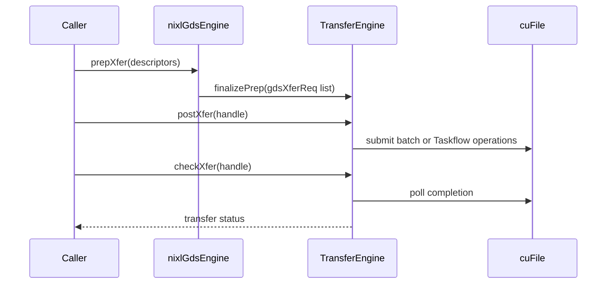

# [PR #1856] Consolidate GDS and GDS_MT under cuda_gds

source: https://github.com/ai-dynamo/nixl/pull/1856
state: closed | updated: 2026-09-23T02:36:34Z
labels: external-contribution, size/XXL

## 正文

## What?

Consolidate the standalone `GDS_MT` sources into `src/plugins/cuda_gds` while preserving both public backend names and exposing both transfer strategies through the primary `GDS` name.

* `GDS` uses the cuFile batch engine by default and accepts `mode=batch` or `mode=mt` to select the batch or multi-threaded engine.
* `GDS_MT` continues to expose the multi-threaded engine as a compatibility backend name while downstream users migrate to `GDS` with `mode=mt`.
* Both backends share the cuFile driver lifecycle, file and buffer registration, metadata, `queryMem`, validation, and request preparation.
* Shared file descriptors use refcounted file-handle ownership, and the GDS engine owns its pooled batch handles for their full lifetime.
* Existing backend options and their defaults are exposed through `get_backend_options`.
* Build wiring, CODEOWNERS, documentation, and focused GDS tests are updated for the consolidated source layout.

### Backend selection

| Backend | Parameters | Transfer engine |
| -- | -- | -- |
| `GDS` | none or `mode=batch` | cuFile batch |
| `GDS` | `mode=mt` | Multi-threaded Taskflow |
| `GDS_MT` | none | Multi-threaded Taskflow compatibility entry point |

## Why?

The two backends intentionally submit I/O differently, but the surrounding cuFile integration was duplicated across separate plugin directories. Keeping that code in sync made registration and lifetime fixes easy to apply to one backend but miss in the other.

This change gives the common behavior one implementation, exposes both strategies through `GDS`, and retains `GDS_MT` as a compatibility path.

Closes ai-dynamo/nixl#1855.

## How?

`nixlGdsEngine` is now the abstract shared base. `nixlGdsBatchEngine` and `nixlGdsMtEngine` inherit from it and implement only their backend-specific preparation, posting, completion, and release behavior.

Meson builds a shared internal GDS engine archive and two plugin entry points. `GDS` links both concrete engines and selects one from `mode`; `GDS_MT` is a thin MT-only compatibility entry point. Dynamic and static discovery continue to expose both backend names. Because `GDS` now supports `mode=mt`, Taskflow is required when either entry point is built.

The class and runtime flow diagrams are in the [issue design comment](<https://github.com/ai-dynamo/nixl/issues/1855#issuecomment-4845868169>).

### Compatibility and scope

This PR preserves the backend names, plugin versions, supported memory types, path-mode behavior, GDS/GDS_MT mutual exclusion, and existing completion/release behavior. Existing `GDS` calls without `mode` still select the batch strategy, and existing `GDS_MT` calls still select the Taskflow MT strategy. `GDS` adds the optional `mode=batch|mt` selector and advertises the parameters for both strategies.

`GDS_MT` is not removed in this PR. Consumers can migrate to `GDS` with `mode=mt`; the standalone compatibility name can be removed in a later release after downstream users have migrated.

Multi-CPU batch submission, DRAM-path changes, split-request `devPtr_offset` handling, and nonblocking release/cancellation redesign are intentionally left for follow-up changes.

### Validation

* GCC 13/Meson build with warnings as errors using CUDA 13.3, cuFile 1.18, and Taskflow 3.10.
* Dynamic focused GDS/GDS_MT suite: 18 passed; one unrelated plugin-manager fixture skipped.
* Static build containing both plugin names: mode, discovery, and default tests passed 7/7.
* Optimized dynamic build of both plugin entry points passed.
* Both legacy path-mode round-trip smoke tests passed.
* Eight 64 MiB direct-I/O consistency cases passed across base/PR, GDS/GDS_MT, and READ/WRITE. GDS used `batch_limit=1` to force four sub-batches.
* Independent GB200 validation on 8 NVMe and 4 GPUs covered 512 KiB, 1 MiB, and 16 MiB sequential direct-VRAM I/O at depth 16. The corrected matrices completed 8/8 consistency cases and 704/704 performance processes. PR1 tracked its exact base at every size, with one follow-up signal: 512 KiB GDS_MT WRITE was `-0.461%` across three pairs and needs more rounds before calling it a regression. An earlier same-file six-pair 32/64 MiB control also found no reproducible slowdown.
* `git diff --check` passed.

One baseline GDS READ sweep hit the existing NVFS `nvfs_bio:209` assertion; its immediate baseline retry passed, and no PR run failed.

#### GB200 performance by I/O size

**Test system:** dual-socket NVIDIA Grace (144 Neoverse-V2 cores), 4 x GB200 GPUs, and 8 x Samsung 3.5 TB NVMe drives using ext4, with two drives mapped to each GPU. The software stack was Linux 6.14 aarch64 with 64 KiB pages, NVIDIA driver 580.105.08, CUDA 13.0, cuFile 1.19.0.76, and `nvidia_fs` 2.26.

Sequential direct-VRAM I/O across 8 NVMe drives and 4 GB200 GPUs, with 16 entries/workers and a 16 GiB working set per drive. Throughput is aggregate GiB/s. The 1 MiB point used five paired base/PR1 rounds; 512 KiB and 16 MiB used three. GDSIO is a matched cross-run reference; baseline and PR1 were measured in paired, alternating-order rounds.

Only x6 and x0 are shown because they match the two NIXL execution models: GDS uses the cuFile batch API and is compared with x6 `GPU_BATCH`; GDS_MT issues synchronous `cuFileRead`/`cuFileWrite` operations from multiple workers and is compared with x0 `GPUD`. The other GDSIO modes use CPU/page-cache staging, asynchronous stream APIs, or vectored APIs that these NIXL backends do not use, so they are not like-for-like references.

<!-- linear:table-colwidths:100,100,100,100,100,100,100,100 -->
| I/O size | NIXL path / GDSIO mode | READ GDSIO (GiB/s) | READ baseline (GiB/s) | READ this PR (GiB/s) | WRITE GDSIO (GiB/s) | WRITE baseline (GiB/s) | WRITE this PR (GiB/s) |
| -- | -- | -- | -- | -- | -- | -- | -- |
| 512 KiB | GDS batch / x6 | 49.549 | 35.749 | 35.722 | 30.672 | 29.802 | 29.873 |
| 512 KiB | GDS_MT / x0 | 49.049 | 39.896 | 39.818 | 30.664 | 30.044 | 29.906 |
| 1 MiB | GDS batch / x6 | 49.624 | 43.379 | 43.395 | 30.536 | 30.405 | 30.387 |
| 1 MiB | GDS_MT / x0 | 49.368 | 44.125 | 44.094 | 30.806 | 30.282 | 30.275 |
| 16 MiB | GDS batch / x6 | 49.511 | 47.680 | 47.596 | 30.593 | 30.730 | 30.723 |
| 16 MiB | GDS_MT / x0 | 49.404 | 48.931 | 48.978 | 30.776 | 30.769 | 30.732 |

The read gap versus GDSIO shrinks as I/O size grows, while writes remain close to the matched GDSIO reference. PR1 follows the same size curve as baseline. All 8 consistency cases and 704 corrected performance processes passed. Full methodology, base values, pair ranges, CPU results, and retained-artifact details are in the [independent GB200 report](<https://github.com/maheshrbapatu/nixl/pull/1#issuecomment-4861853943>).

## Summary by CodeRabbit

* **New Features**
  * Added batch/MT selection to **GDS** through `mode=batch|mt`, with batch remaining the default.
  * Preserved **GDS_MT** as a multi-threaded compatibility backend and exposed mode-specific defaults, including the MT thread count derived from available CPU concurrency.
* **Bug Fixes**
  * Enforced mutual exclusivity: **GDS** and **GDS_MT** cannot both be created in the same agent.
  * Improved correctness for file-backed transfers, including repeated `FILE_SEG` registrations against the same underlying file.
* **Documentation**
  * Expanded the CUDA GDS README with configuration tables for both backends.
* **Tests**
  * Added/expanded hardware-gated end-to-end and validation tests for round-trips and mutual exclusivity.

<!-- This is an auto-generated comment: release notes by coderabbit.ai -->

## Summary by CodeRabbit

* **New Features**
  * Added unified CUDA GDS support with selectable batch and multithreaded transfer modes.
  * Added configurable batch limits, request sizing, and worker-thread counts.
  * Improved file and memory registration handling for reliable transfers.
  * Added backend validation for supported transfer combinations and modes.

* **Documentation**
  * Expanded GDS documentation with mode selection, configuration, and usage guidance.

* **Tests**
  * Added end-to-end coverage for plugin creation, transfers, configuration, validation, and cleanup.

<!-- end of auto-generated comment: release notes by coderabbit.ai -->

## 评论 (46)

### copy-pr-bot[bot] · 2026-06-30

This pull request requires additional validation before any workflows can run on NVIDIA's runners.

Pull request vetters can view their responsibilities [here](https://docs.gha-runners.nvidia.com/cpr/vetters).

Contributors can view more details about this message [here](https://docs.gha-runners.nvidia.com/cpr/contributors).


### github-actions[bot] · 2026-06-30

👋 Hi maheshrbapatu! Thank you for contributing to ai-dynamo/nixl.

Your PR reviewers will review your contribution then trigger the CI to test your changes.

🚀

### sbates130272 · 2026-06-30

@maheshrbapatu I am tracking this because if it gets merged it will impact the AIS_MT and hip_ais plugins that enable DGS/AIS for AMD GPUs that I am working on a PR for. See issue #1781.

### coderabbitai[bot] · 2026-06-30

<!-- This is an auto-generated comment: summarize by coderabbit.ai -->
<!-- review_stack_entry_start -->

[](https://app.coderabbit.ai/change-stack/ai-dynamo/nixl/pull/1856?utm_source=github_walkthrough&utm_medium=github&utm_campaign=change_stack)

<!-- review_stack_entry_end -->
<!-- This is an auto-generated comment: review paused by coderabbit.ai -->

> [!NOTE]
> ## Reviews paused
> 
> It looks like this branch is under active development. To avoid overwhelming you with review comments due to an influx of new commits, CodeRabbit has automatically paused this review. You can configure this behavior by changing the `reviews.auto_review.auto_pause_after_reviewed_commits` setting.
> 
> Use the following commands to manage reviews:
> - `@coderabbitai resume` to resume automatic reviews.
> - `@coderabbitai review` to trigger a single review.
> 
> Use the checkboxes below for quick actions:
> - [ ] <!-- {"checkboxId": "7f6cc2e2-2e4e-497a-8c31-c9e4573e93d1"} --> ▶️ Resume reviews
> - [ ] <!-- {"checkboxId": "e9bb8d72-00e8-4f67-9cb2-caf3b22574fe"} --> 🔍 Trigger review

<!-- end of auto-generated comment: review paused by coderabbit.ai -->
<!-- walkthrough_start -->

<details>
<summary>📝 Walkthrough</summary>

## Walkthrough

The PR consolidates GDS and GDS_MT under `cuda_gds`. Shared cuFile resources, metadata, and transfer preparation support separate batch and Taskflow engines. Build wiring, plugin options, documentation, and integration tests are updated.

### Changes

**GDS/GDS_MT Plugin Consolidation**

|Layer / File(s)|Summary|
|---|---|
|**RAII resources and shared backend** <br> `src/plugins/cuda_gds/gds_utils.*`, `src/plugins/cuda_gds/gds_backend.*`|Adds RAII cuFile wrappers and shared metadata registration, deregistration, capability handling, and transfer preparation.|
|**Batch transfer backend** <br> `src/plugins/cuda_gds/gds_batch_engine.*`|Adds pooled cuFile batch handling, request splitting, submission, polling, cancellation, and release.|
|**Multithreaded transfer backend** <br> `src/plugins/cuda_gds/gds_mt_engine.*`|Adds Taskflow-based cuFile operations with configurable worker counts and asynchronous completion polling.|
|**Plugin wiring and build consolidation** <br> `src/plugins/cuda_gds/gds_plugin.cpp`, `src/plugins/cuda_gds/gds_mt_plugin.cpp`, `src/plugins/cuda_gds/meson.build`, `src/plugins/meson.build`, `CODEOWNERS`|Selects batch or multithreaded engines, passes backend options, consolidates Meson targets, and removes the standalone GDS_MT ownership entry.|
|**Documentation and integration validation** <br> `src/plugins/cuda_gds/README.md`, `src/utils/file/README.md`, `test/gtest/gds.cpp`, `test/gtest/meson.build`, `test/unit/plugins/*/nixl_*_test.cpp`|Documents modes and configuration, adds GDS-family tests, and adjusts no-argument smoke-test behavior.|

**Estimated code review effort:** 4 (Complex) | ~60 minutes

### Sequence Diagram(s)



**Possibly related issues**

- ai-dynamo/nixl#2032 — The issue concerns the refactored GDS_MT transfer path and the new `gdsXferReq` request representation.

**Possibly related PRs**

- [ai-dynamo/nixl#1946](https://github.com/ai-dynamo/nixl/pull/1946) — Documents the same GDS and GDS_MT backend modes and transfer workflows.
- [ai-dynamo/nixl#2062](https://github.com/ai-dynamo/nixl/pull/2062) — Relates to replacing the former GDS_MT metadata and transfer-preparation path.

**Suggested reviewers:** `brminich`

</details>

<!-- walkthrough_end -->
<!-- pre_merge_checks_walkthrough_start -->

<details>
<summary>🚥 Pre-merge checks | ✅ 4 | ❌ 1</summary>

### ❌ Failed checks (1 warning)

|     Check name     | Status     | Explanation                                                                           | Resolution                                                                         |
| :----------------: | :--------- | :------------------------------------------------------------------------------------ | :--------------------------------------------------------------------------------- |
| Docstring Coverage | ⚠️ Warning | Docstring coverage is 18.68% which is insufficient. The required threshold is 80.00%. | Write docstrings for the functions missing them to satisfy the coverage threshold. |

<details>
<summary>✅ Passed checks (4 passed)</summary>

|         Check name         | Status   | Explanation                                                                                                                                                       |
| :------------------------: | :------- | :---------------------------------------------------------------------------------------------------------------------------------------------------------------- |
|     Linked Issues check    | ✅ Passed | The changes satisfy issue `#1855` by sharing cuFile infrastructure while preserving both backend names, transfer strategies, options, ownership, and build support. |
| Out of Scope Changes check | ✅ Passed | The source, build, documentation, ownership, and test changes are directly related to consolidating GDS and GDS_MT under cuda_gds.                                |
|         Title check        | ✅ Passed | The title clearly and concisely summarizes the main change: consolidating GDS and GDS_MT under cuda_gds.                                                          |
|      Description check     | ✅ Passed | The description includes complete What, Why, and How sections with scope, compatibility, design, and validation details.                                          |

</details>

</details>

<!-- pre_merge_checks_walkthrough_end -->
<!-- finishing_touch_checkbox_start -->

<details>
<summary>✨ Finishing Touches 💡 1</summary>

<!-- finishing_touch_suggestion:fix_ci -->
<details open>
<summary>🛠️ Fix failing CI checks 💡</summary>

- [ ] <!-- {"checkboxId": "6d21cfe8-ec3f-40e2-9222-b8318b64d3b0", "radioGroupId": "fix-ci-output-choice-group-unknown_comment_id"} -->   Create stacked PR
- [ ] <!-- {"checkboxId": "9f0d24fb-b419-4f01-baf0-8b26b6424f34", "radioGroupId": "fix-ci-output-choice-group-unknown_comment_id"} -->   Commit on current branch

</details>
<details>
<summary>🧪 Generate unit tests (beta)</summary>

- [ ] <!-- {"checkboxId": "f47ac10b-58cc-4372-a567-0e02b2c3d479", "radioGroupId": "utg-output-choice-group-unknown_comment_id"} -->   Create PR with unit tests

</details>

</details>

<!-- finishing_touch_checkbox_end -->
<!-- tips_start -->

---


<sub>Comment `@coderabbitai help` to get the list of available commands.</sub>

<!-- tips_end -->

### svc-nixl · 2026-06-30

👀 Investigating [`PR Size Check`](https://github.com/ai-dynamo/nixl/actions/runs/28467574276/job/84371241154)…

<!-- triage-agent-bot -->

### svc-nixl · 2026-06-30

🤖 **CI Triage Agent** — `PR Size Check` · commit `18529142`

This is a clear and straightforward failure. The logs are complete and unambiguous.

**Summary:** The "PR Size Check" GitHub Actions job failed because PR #1856 exceeds the repository's 500-line modification limit.

**Root cause:** The workflow counts lines added to existing (modified) files, excluding subprojects, via:
```
git show --numstat --pretty="" --diff-filter=M -- . ':(exclude)subprojects/*' | awk '{s+=$1} END {print s}'
```
For this PR the count came to **503 lines**, which is 3 over the hard cap of 500. The check is working as designed:
```
❌ PR size check failed!
This PR adds 503 lines (excluding subprojects), which exceeds the maximum of 500 lines.
##[error]Process completed with exit code 1.
```
This is **not** a flaky test, infra problem, or hang — it's a policy gate intentionally failing because the change is too large. There were no large time gaps in the log (entire job ran in ~1 second), so nothing is hung.

**Implicated commit:** [REDACTED:Hex High Entropy String] (the head commit of PR #1856 on branch `gds-batch-taskflow`). No buggy source code is involved — this is the size policy, not a code defect.

**File:** The PR Size Check workflow (e.g. `.github/workflows/*pr-size*.yml`) — the gate script shown in the run group. The failure pertains to the PR's own diff, not a specific source line.

**Suggested fix:** This is a real policy violation, not a CI bug. Choose one:
- **Split the PR** into smaller logical pieces so each stays under 500 modified lines (preferred — the gds-batch-taskflow work can likely be staged).
- Move qualifying generated/vendored content under `subprojects/` if appropriate, since that path is excluded from the count.
- If a maintainer deems this PR legitimately needs to exceed the limit, request an exception/override per the repo's contribution policy (or a maintainer can adjust/bypass the threshold) — but this should be a deliberate decision, not an automatic raise.

Note: only 3 lines over, so trimming whitespace/comment churn or splitting off a tiny refactor may be enough to pass.

**Related:** PR #1856 (this PR). No related issues found relevant to a code defect, since this is a size-policy gate.


> 🛡️ This comment had 1 potential secret(s) redacted (Hex High Entropy String). See request_id `14c94626-ee0b-4de7-8020-ebc98a73630b` in the triage console for the audit trail.

<!-- triage-agent request_id: 14c94626-ee0b-4de7-8020-ebc98a73630b -->
<!-- triage-agent-bot -->

### sbates130272 · 2026-07-20

@maheshrbapatu I have some patches coming to enable AMD AIS_MT plugin. I would prefer to do that after this work is merged if it is going to get merged. So I do not cause you more refactor work. Can you comment on your ETA for addressing @ofer review comments? That way I can determine if I need to move forward based on main or your PR. Thanks!

### maheshrbapatu · 2026-07-20

> @maheshrbapatu I have some patches coming to enable AMD AIS_MT plugin. I would prefer to do that after this work is merged if it is going to get merged. So I do not cause you more refactor work. Can you comment on your ETA for addressing @ofer review comments? That way I can determine if I need to move forward based on main or your PR. Thanks!

Hi @sbates130272  appreciate you flagging this!

I'm currently running performance benchmarks to validate there are no regressions before addressing @ofer's review comments. Hardware availability is the main constraint, so realistically I'm looking at **~2 weeks** before this is ready to merge.

If you're able to share your target timeline, I'd love to sync up and make sure we're not stepping on each other's toes.


### sbates130272 · 2026-07-21

@maheshrbapatu I am probably at about the same timeline. Let me work up my PR on top of yours and then my testing helps you. Stay tuned. 

### maheshrbapatu · 2026-08-10

### H100 performance results

| I/O size | NIXL path | READ baseline GB/s | READ baseline CPU | READ PR GB/s | READ PR CPU | WRITE baseline GB/s | WRITE baseline CPU | WRITE PR GB/s | WRITE PR CPU |
|---|---|---:|---:|---:|---:|---:|---:|---:|---:|
| 1 MiB | GDS batch | 10.631076 | 121.77% | 10.639171 | 121.83% | 6.049401 | 111.40% | 6.053428 | 111.23% |
| 1 MiB | GDS_MT (32) | 11.702507 | 191.59% | 11.696630 | 192.98% | 5.929846 | 150.28% | 5.972819 | 150.29% |
| 4 MiB | GDS batch | 11.349297 | 83.96% | 11.360970 | 83.90% | 6.036027 | 87.57% | 6.034320 | 87.10% |
| 4 MiB | GDS_MT (32) | 11.874692 | 140.44% | 11.879912 | 140.42% | 5.797791 | 121.43% | 5.930050 | 121.19% |

### svc-nixl · 2026-08-10

🤖 **CI Triage Agent** — `PR Size Check` · commit `f850ed01`

**TL;DR:** The "PR Size Check" gate failed because PR #1856 modifies 570 lines in existing files (excluding subprojects), exceeding the workflow's hard 500-line limit; either split the PR or reduce the diff to ≤500 lines.

<details><summary>Full analysis</summary>

**Summary:** The `check-pr-size` job in `.github/workflows/pr-size-check.yml` exited 1 because the PR's modified-line count (570) exceeds the configured 500-line maximum.

**Root cause:** The workflow computes added lines to modified files via `git show --numstat --pretty="" --diff-filter=M -- . ':(exclude)subprojects/*' | awk '{s+=$1}'` and fails if the result is >500. For this PR that sum is 570, so the guard triggered `exit 1`. This is a deliberate size-policy gate, not a code/test defect — the check ran once, produced output immediately, and failed instantly (no hang, no timeout).

**Implicated commit:** [REDACTED:Hex High Entropy String] (PR #1856, branch `gds-batch-taskflow`) — the PR content itself is the cause; no infrastructure regression.

**File:** `.github/workflows/pr-size-check.yml` (the `check-pr-size` step running the `LINES_CHANGED` computation)

**Suggested fix:** Reduce the PR size to within the 500-line limit — split PR #1856 into smaller, logically separated PRs (e.g. separate the GDS batch taskflow implementation from tests/refactors). Note the check only counts lines in **modified** (`--diff-filter=M`) files, so moving net-new code into new files would not count against this limit; that's a legitimate way to structure the split. If the limit is genuinely too strict for this feature, raise the threshold in `pr-size-check.yml` in a separate maintainer-approved change rather than working around the gate.

**Related:** none

</details>


> 🛡️ This comment had 1 potential secret(s) redacted (Hex High Entropy String). See request_id `31dd7426-d004-46df-9d32-03d2f3c1c060` in the triage console for the audit trail.

<!-- triage-agent request_id: 31dd7426-d004-46df-9d32-03d2f3c1c060 -->
<!-- triage-agent gha_run_id: 31417471517 -->
<!-- triage-agent-bot -->

### svc-nixl · 2026-08-10

🤖 **CI Triage Agent** — `PR Size Check` · commit `bba30e2c`

**TL;DR:** The "PR Size Check" workflow failed because PR #1856 modifies 682 lines in existing files (excluding subprojects), exceeding the hard 500-line limit enforced by `.github/workflows/pr-size-check.yml`. Either split the PR into smaller ones or adjust/waive the limit.

<details><summary>Full analysis</summary>

**Summary:** The `check-pr-size` job failed with exit code 1: "This PR adds 682 lines (excluding subprojects), which exceeds the maximum of 500 lines."

**Root cause:** This is a policy check, not a bug. The workflow computes `LINES_CHANGED` via `git show --numstat --pretty="" --diff-filter=M -- . ':(exclude)subprojects/*'` and calls `exit 1` when the count exceeds 500. For this PR the count is 682, so the step intentionally fails. (Note: the check only counts modifications to existing files — `--diff-filter=M` — so newly added files aren't included in this 682.)

**Implicated commit:** [REDACTED:Hex High Entropy String] (PR #1856, branch `gds-batch-taskflow`) — the PR content itself is oversized; no defective commit in the workflow.

**File:** `.github/workflows/pr-size-check.yml` (the `LINES_CHANGED` / `-gt 500` gate)

**Suggested fix:** This is working as intended — the fix is to reduce the PR's footprint, not the CI. Concrete options:
- Split PR #1856 into smaller, self-contained PRs each under the 500-modified-line limit (preferred).
- If the change is legitimately atomic and cannot be split (e.g., a large generated/refactor change), have a maintainer waive the check or raise the threshold in `.github/workflows/pr-size-check.yml`.
- If large mechanical edits are inflating the count, consider whether any of them belong under `subprojects/` (which is already excluded).

**Related:** none

Note: the checkout log contains a redacted git auth header (`AUTHORIZATION: basic ***`) which is masked by GitHub — no action needed, but do not un-redact it.

</details>


> 🛡️ This comment had 1 potential secret(s) redacted (Hex High Entropy String). See request_id `e6e2208f-803e-4d42-a798-30a9ba3c1410` in the triage console for the audit trail.

<!-- triage-agent request_id: e6e2208f-803e-4d42-a798-30a9ba3c1410 -->
<!-- triage-agent gha_run_id: 31421205644 -->
<!-- triage-agent-bot -->

### svc-nixl · 2026-08-10

🤖 **CI Triage Agent** — `PR Size Check` · commit `0fe79bad`

**TL;DR:** The "PR Size Check" gate failed because PR #1856 modifies 686 lines in existing files (excluding subprojects), exceeding the workflow's hard 500-line cap. Split the PR into smaller pieces (or, if justified, raise/waive the limit in the workflow).

<details><summary>Full analysis</summary>

**Summary:** The `check-pr-size` job in `.github/workflows/pr-size-check.yml` exited with code 1 because the PR exceeds the 500-line change limit.

**Root cause:** The workflow computes `LINES_CHANGED` via `git show --numstat --pretty="" --diff-filter=M -- . ':(exclude)subprojects/*'` and fails when the result is `> 500`. For merge commit `dff6a4e` (PR #1856, branch `gds-batch-taskflow`) this evaluated to **686 lines**, so the script printed "❌ PR size check failed!" and `exit 1`. This is a policy gate, not a build/test error — the checkout and run steps all succeeded.

**Implicated commit:** PR #1856 head `[REDACTED:Hex High Entropy String]` (merge commit `[REDACTED:Hex High Entropy String]`). No single "bug" commit — the PR is simply too large.

**File:** `.github/workflows/pr-size-check.yml` (the `check-pr-size` step; failure emitted at run log 2026-08-10T21:22:40.0364Z)

**Suggested fix:** Reduce the PR's footprint below 500 changed lines — split `gds-batch-taskflow` into smaller, reviewable PRs (e.g. separate the GDS batch taskflow logic from tests/docs/refactors). Note the check counts only *modifications* to existing files (`--diff-filter=M`), so moving new functionality into new files, or landing prerequisite refactors separately, will lower the count. If this PR genuinely must be large, get maintainer sign-off to either raise the `500` threshold in `pr-size-check.yml` or add an explicit override/label-based bypass; do not silently bump the limit as a default. This is not a hang or timeout — no time-limit change is relevant.

**Related:** none found.

</details>


> 🛡️ This comment had 1 potential secret(s) redacted (Hex High Entropy String). See request_id `fee353bf-3844-4469-b4d4-90f8cb7ed64a` in the triage console for the audit trail.

<!-- triage-agent request_id: fee353bf-3844-4469-b4d4-90f8cb7ed64a -->
<!-- triage-agent gha_run_id: 31433539829 -->
<!-- triage-agent-bot -->

### svc-nixl · 2026-08-31

🤖 **CI Triage Agent** — `PR Size Check` · commit `d4feb85a`

**TL;DR:** The "PR Size Check" GitHub Actions job failed because PR #1856 modifies 684 lines in existing files (excluding subprojects), exceeding the workflow's hard limit of 500. The fix is to split the PR into smaller pieces (or adjust the limit if intentional).

<details><summary>Full analysis</summary>

**Summary:** The `check-pr-size` job in `.github/workflows/pr-size-check.yml` exited 1 because the PR's line-change count exceeds the configured 500-line maximum.

**Root cause:** The workflow computes `LINES_CHANGED` via `git show --numstat --pretty="" --diff-filter=M -- . ':(exclude)subprojects/*'` and errors if the sum is greater than 500. For this PR it computed **684 added lines to modified files**, so the guard fired:
```
❌ PR size check failed!
This PR adds 684 lines (excluding subprojects), which exceeds the maximum of 500 lines.
##[error]Process completed with exit code 1.
```
This is an intentional size-policy gate doing its job — not a build/test/infra failure. Note also the check only counts `--diff-filter=M` (modified files) added lines, so brand-new files aren't counted; the 684 is purely additions to pre-existing files.

**Implicated commit:** [REDACTED:Hex High Entropy String] (the PR head merged as 6fc047e) — i.e. the PR content itself, not a specific regressing commit.

**File:** `.github/workflows/pr-size-check.yml` (the `LINES_CHANGED > 500` guard)

**Suggested fix:** This is a legitimate policy trip, so resolve it at the PR level rather than "fixing" CI:
- Split PR #1856 (`gds-batch-taskflow`) into smaller, reviewable PRs so each stays under the 500-line limit; or
- If the large change is unavoidable/justified, get a maintainer to bypass this check or raise/override the limit in `.github/workflows/pr-size-check.yml`. Many teams also add a label-based skip (e.g. `size-override`) for such cases.

No source-code investigation or infra telemetry is warranted here — the check is a deliberate gate and behaved as designed.

**Related:** none

</details>


> 🛡️ This comment had 1 potential secret(s) redacted (Hex High Entropy String). See request_id `e5b315a7-0ad0-4e91-bc4b-242f7dc6d27f` in the triage console for the audit trail.

<!-- triage-agent request_id: e5b315a7-0ad0-4e91-bc4b-242f7dc6d27f -->
<!-- triage-agent gha_run_id: 33446527594 -->
<!-- triage-agent-bot -->

### svc-nixl · 2026-09-16

🤖 **CI Triage Agent** — `PR Size Check` · commit `05a7c2cf`

**TL;DR:** This isn't a code or infra defect — the `PR Size Check` policy gate failed because PR #1856 adds 684 lines to existing (modified) files, over the repo's hard 500-line cap; the fix is to split the PR into smaller reviewable pieces.

<details><summary>Full analysis</summary>

**Summary:** GitHub Actions job `check-pr-size` in workflow `PR Size Check` exited 1 with "❌ PR size check failed! This PR adds 684 lines (excluding subprojects), which exceeds the maximum of 500 lines."

**Root cause:** The workflow computes added lines on the PR merge commit with `git show --numstat --pretty="" --diff-filter=M -- . ':(exclude)subprojects/*'` and fails hard when the sum exceeds 500. For merge commit `f05e522` (branch `gds-batch-taskflow`, head `05a7c2c`) the sum is 684, so the gate tripped. There is no build, compile, or test error anywhere in the log — checkout succeeded and the only failing step is the size assertion. Note the counter uses `--diff-filter=M`, so all 684 lines come from edits to *pre-existing* files; brand-new files are not counted at all.

**Implicated commit:** No defective commit — the gate itself was added in `16dcb7db` "[CI] Add new CI test to detect large PRs (#627)" by Daniel Pressler. The commit that trips it is the PR head `[REDACTED:Hex High Entropy String]` on `gds-batch-taskflow`.

**File:** `.github/workflows/pr-size-check.yml:21` (the `LINES_CHANGED` computation) and `:23` (the `-gt 500` threshold)

**Suggested fix:** Split PR #1856 into a stack of smaller PRs under 500 modified-file lines each — e.g. separate the GDS batch taskflow core change from test/benchmark/plugin-glue changes and land them sequentially. Two things worth knowing before restructuring: (1) moving code into *new* files doesn't count, since `--diff-filter=M` only sums modifications to existing files, so extracting the new taskflow implementation into its own file will drop the counted total substantially; (2) if the change is genuinely atomic and cannot be decomposed, this needs a maintainer decision rather than a code fix — the workflow has no bypass label or override path, so either add one (e.g. skip the step when a `size-override` label is present) or ask a maintainer to merge with the check administratively overridden. Do not raise the 500 constant to accommodate a single PR; that weakens the gate for everyone.

**Related:** PR #1856 (the failing PR); gate introduced by #627. Other currently-open PRs surfaced by search that are likely hitting or near the same gate: #2215, #2200, #1793, #2243 — if several large PRs are routinely blocked, that's an argument for adding a documented override mechanism to the workflow.

</details>


> 🛡️ This comment had 1 potential secret(s) redacted (Hex High Entropy String). See request_id `0bde966c-b76a-4915-8cc1-7acaa980006e` in the triage console for the audit trail.

<!-- triage-agent request_id: 0bde966c-b76a-4915-8cc1-7acaa980006e -->
<!-- triage-agent gha_run_id: 35129733133 -->
<!-- triage-agent-bot -->

### aranadive · 2026-09-16

/build

### aranadive · 2026-09-16

/ok to test 05a7c2c

### svc-nixl · 2026-09-16

🤖 **CI Triage Agent** — `nixl-ci-non-gpu` · commit `05a7c2cf`

**TL;DR:** PR #1856 added a new `taskflow` meson dependency backed by a `[wrap-git]` subproject, and the CI containers cannot `git clone https://github.com/taskflow/taskflow.git` (no credentials/egress), so `meson setup` aborts; on the agents that *did* build, the PR's new GDS gtests then fail because their expected "GDS init failed" error logs aren't suppressed. Convert `subprojects/taskflow.wrap` to a `[wrap-file]` tarball (as was done for liburing) and wrap the GDS `createBackend` errors in a `LogIgnoreGuard`.

<details><summary>Full analysis</summary>

**Summary:** Two distinct failures in build #3099: `Build` stages 387 (x86_64/ubuntu24) and 392 (aarch64) fail at `meson setup` resolving the new `taskflow` dependency; `Test CPP` stages 485 and 498 fail with 13 GDS-related gtest cases returning exit code 42.

**Root cause:**
1. Build (primary/blocking) — `meson.build:233` now does `dependency('taskflow', fallback: ['taskflow', 'taskflow_dep'])`. `taskflow` is not installed in the images (`Run-time dependency taskflow found: NO (tried pkgconfig and cmake)`), so meson falls back to `subprojects/taskflow.wrap`, which is a `[wrap-git]` entry. The clone fails:
   - `Cloning into 'taskflow'... fatal: could not read Username for 'https://github.com': No such device or address`
   - `meson.build:233:16: ERROR: Git command failed: [... 'clone', '--depth', '1', '--branch', 'v3.10.0', 'https://github.com/taskflow/taskflow.git', 'taskflow']`
   Note the `liburing` fallback in the same run succeeded because it is a tarball wrap (`Downloading liburing source from https://github.com/axboe/liburing/archive/.../liburing-2.14.tar.gz`) — the sandbox permits HTTPS tarball fetches but anonymous `git clone` gets an auth prompt and dies. The build stages that passed are the images where the dep resolves without the git fallback.
2. Test CPP — the new/expanded GDS tests call `tryCreate()` (`test/gtest/gds.cpp:165-171`), which calls `agent.createBackend()` bare. On non-GPU agents that logs `gds_backend.cpp:71 GDS: error initializing GPU Direct Storage driver: error=5011` and `nixl_agent.cpp:349 createBackend: backend initialization error`. The gtest harness's unexpected-warning/error detector counts these ("ATTENTION: Problem count is 2") and returns exit code 42, so the case is reported FAILED even though it reports `[ SKIPPED ]`. Contrast `GdsMode.RejectsUnknownMode` (`gds.cpp:244-250`), which passes because it wraps the same messages in `gtest::LogIgnoreGuard`. `MetadataExchangeTestFixture.LocalNonLocalMDExchange` trips the same detector on the GDS init error.

**Implicated commit:** [REDACTED:Hex High Entropy String] (branch `gds-batch-taskflow`, PR #1856); GDS test scaffolding from a4f45749 "GDS: expose MT engine through mode parameter" (maheshrbapatu)

**File:** `subprojects/taskflow.wrap:1-4` and `meson.build:233`; `test/gtest/gds.cpp:165-171` (and skip sites at 262, 278, 292, 306, 323, 389)

**Suggested fix:**
1. Replace the git wrap with a tarball wrap so it works in the network-restricted CI, mirroring the liburing precedent (PR #1577):
   ```
   [wrap-file]
   directory = taskflow-3.10.0
   source_url = https://github.com/taskflow/taskflow/archive/refs/tags/v3.10.0.tar.gz
   source_filename = taskflow-3.10.0.tar.gz
   source_hash = <sha256 of the release tarball>
   patch_directory = taskflow
   [provide]
   taskflow = taskflow_dep
   ```
   Taskflow is header-only, so also consider making it `required: false` with a build-time guard, or vendoring the headers, so a fetch outage can never break `meson setup`.
2. In `tryCreate()`, install `gtest::LogIgnoreGuard` entries for `"GDS: error initializing GPU Direct Storage driver: error=5011"` (or a prefix match) and `"createBackend: backend initialization error for '<name>'"` before calling `createBackend`, so hardware-gated skips on non-GPU agents don't trip the harness's exit-42 error detector. Do the same for the GDS init error path exercised by `MetadataExchangeTestFixture.LocalNonLocalMDExchange`.

**Related:** PR #1856 (this change); PR #1577 "Use liburing wrap" — the tarball-wrap pattern to follow

</details>


> 🛡️ This comment had 1 potential secret(s) redacted (Hex High Entropy String). See request_id `a6e782a2-8a74-43ef-934f-365b70a24bad` in the triage console for the audit trail.

<!-- triage-agent request_id: a6e782a2-8a74-43ef-934f-365b70a24bad -->
<!-- triage-agent gha_run_id: status:SC_kwDOODt2nc8AAAAMpeWO-w -->
<!-- triage-agent-bot -->

### svc-nixl · 2026-09-16

🤖 **CI Triage Agent** — `AWS NIXL Validation` · commit `05a7c2cf`

**TL;DR:** The AWS (GPU-less) validation job "failed" 13 gtests that actually all SKIPPED — the new GDS tests probe backend availability by calling `createBackend()` without a `LogIgnoreGuard`, so the resulting `cuFile`/GDS init ERROR logs trip the harness's `LogProblemCounter` and each test exits 42. Wrap the probe in `gtest::LogIgnoreGuard` (or gate on `gtest::hasCudaGpu()`) as `GdsMode.RejectsUnknownMode` already does.

<details><summary>Full analysis</summary>

**Summary:** `gtest-parallel ./bin/gtest` reported `FAILED TESTS (13/263)` — 12 `Gds*` cases plus `MetadataExchangeTestFixture.LocalNonLocalMDExchange` — all with "returned with exit code 42", causing the AWS Batch NIXL test job to end FAILED and the workflow to `exit 1`.

**Root cause:** Not a functional test failure. The runner (`ip-192-168-37-131`, AWS Batch) has no GPU: `cuInit Failed, error CUDA_ERROR_NO_DEVICE` → `gds_backend.cpp:71] GDS: error initializing GPU Direct Storage driver: error=5011` → `nixl_agent.cpp:349] createBackend: backend initialization error for 'GDS'/'GDS_MT'`. The GDS tests handle this correctly at the gtest level (`../test/gtest/gds.cpp:263/279/293/307/324/389: Skipped … GDS backend unavailable (no cuFile/GDS)` → `[  SKIPPED ]`, `[  PASSED  ] 0 tests`), but `test/gtest/main.cpp:105-109` turns *any* un-ignored absl WARNING/ERROR into process exit code 42, and each skipped test logged "Problem count is 2". The availability probe `tryCreate()` (`test/gtest/gds.cpp:165-171`) calls `agent.createBackend()` with no `LogIgnoreGuard`, unlike `GdsMode.RejectsUnknownMode`, which does guard its expected errors (`test/gtest/gds.cpp:244-246`). `MetadataExchangeTestFixture.LocalNonLocalMDExchange` fails the same way (problem count 1 from the same GDS init error) while reporting `[  PASSED  ] 1 test`. The `AWS_BATCH_JOB_ID` ignore list in `main.cpp:89-91` only covers the UCX-version warning, not the no-GPU GDS errors.

**Implicated commit:** The GDS test suite on this branch — `bcecfc2e` "Consolidate GDS backends under cuda_gds" and `a4f45749` "GDS: expose MT engine through mode parameter" (maheshrbapatu), brought into this run by merge `05a7c2cf` (Vishwanath Venkatesan, PR #1856).

**File:** `test/gtest/gds.cpp:165-171` (`tryCreate`, used at :262, :278, :292, :306, :323, :388); harness gate at `test/gtest/main.cpp:105-109`

**Suggested fix:** Make the availability probe log-clean on non-GPU hosts:
1. In `tryCreate()`, install guards around the `createBackend` call, e.g. `const gtest::LogIgnoreGuard init_err("GDS: error initializing GPU Direct Storage driver");` and `const gtest::LogIgnoreGuard create_err("createBackend: backend initialization error for '" + name + "'");` — mirroring `GdsMode.RejectsUnknownMode`.
2. Optionally short-circuit earlier: `if (!gtest::hasCudaGpu()) GTEST_SKIP() << "no CUDA device";` in the hardware-gated `GdsBackend`/`GdsMode` cases so `createBackend` is never attempted without a GPU.
3. For `MetadataExchangeTestFixture.LocalNonLocalMDExchange`, either guard its GDS backend creation the same way or add the GDS-init-error regex to the `NIXL_CI_NON_GPU`/`AWS_BATCH_JOB_ID` ignore lists in `test/gtest/main.cpp:86-95` (and ensure the AWS job exports `NIXL_CI_NON_GPU`).

**Related:** PR #1856 (this change); PR #1909 "TEST/GTEST: Fail on unexpectedly skipped tests" and PR #1743 "TEST/GTEST: Run in single process" touch the same skip/exit-code handling.

</details>

<!-- triage-agent request_id: 40b92a39-61ea-495a-94c5-b2884f561e56 -->
<!-- triage-agent gha_run_id: 35149838558 -->
<!-- triage-agent-bot -->

### svc-nixl · 2026-09-18

🤖 **CI Triage Agent** — `PR Size Check` · commit `b16bbed9`

**TL;DR:** This is not a build or test failure — the `PR Size Check` policy gate intentionally failed because PR #1856 adds 712 lines to existing files, exceeding the hard-coded 500-line limit; the fix is to split the PR (or get a maintainer waiver), not to change CI.

<details><summary>Full analysis</summary>

**Summary:** The `check-pr-size` job in the `PR Size Check` workflow exited 1 with "❌ PR size check failed! This PR adds 712 lines (excluding subprojects), which exceeds the maximum of 500 lines."

**Root cause:** The workflow computes added lines on *modified* files only (`git show --numstat --pretty="" --diff-filter=M -- . ':(exclude)subprojects/*'`) and fails when the sum exceeds 500. For merge commit `2c16721` (PR head `b16bbed9`, branch `gds-batch-taskflow`, merged onto base `492aca7c`) that sum was 712, so `exit 1` was taken. Everything else in the run was healthy: checkout succeeded, the whole job ran in ~2 seconds (18:27:02 → 18:27:04) with no gaps, no timeout, no infra involvement. The only other log noise is benign Node 20 deprecation warnings from `actions/checkout@v3`. The gate itself is unchanged since it was introduced, so this is not a CI regression — it is the check doing its job against an oversized PR.

**Implicated commit:** No faulty commit. The gate was added in `16dcb7db` ("[CI] Add new CI test to detect large PRs (#627)", Daniel Pressler, 2025-08-14) and has not been touched since; the failure is caused by the size of PR #1856's own content at head `[REDACTED:Hex High Entropy String]`.

**File:** `.github/workflows/pr-size-check.yml:21-26` (threshold at line 23)

**Suggested fix:** Split PR #1856 into reviewable pieces under the 500-line budget — e.g. land the GDS batch/taskflow refactor separately from the tests and any mechanical or formatting churn, since the counter only sums *modified* existing files and moving new code into new files does not count against it. Two things worth checking before re-splitting: confirm none of the 712 lines are incidental reformatting or generated/vendored content that could be dropped or relocated outside `subprojects/`, and if the change genuinely cannot be decomposed, ask a maintainer for an explicit waiver rather than editing the threshold — raising the 500 limit in the workflow to unblock one PR would silently weaken the gate for every future PR.

**Related:** PR #1856 (this PR); gate introduced by PR #627 / commit `16dcb7db`. No existing issue tracks a waiver or exemption mechanism for this check — worth opening one if large-but-atomic PRs recur.

</details>


> 🛡️ This comment had 1 potential secret(s) redacted (Hex High Entropy String). See request_id `ed04cf67-b2d3-4b4c-9480-1bff444c8f23` in the triage console for the audit trail.

<!-- triage-agent request_id: ed04cf67-b2d3-4b4c-9480-1bff444c8f23 -->
<!-- triage-agent gha_run_id: 35380236834 -->
<!-- triage-agent-bot -->

### svc-nixl · 2026-09-21

🤖 **CI Triage Agent** — `PR Size Check` · commit `141c7ca1`

**TL;DR:** This isn't a broken build — the `PR Size Check` policy gate failed because PR #1856 adds 712 lines to already-existing files, over the workflow's hard 500-line cap. The fix is to split the PR (or get the limit/exclusion policy amended), not to change CI.

<details><summary>Full analysis</summary>

**Summary:** The `check-pr-size` job in the `PR Size Check` workflow exited 1 with "❌ PR size check failed! This PR adds 712 lines (excluding subprojects), which exceeds the maximum of 500 lines."

**Root cause:** Intentional policy enforcement. `.github/workflows/pr-size-check.yml` runs `git show --numstat --pretty="" --diff-filter=M -- . ':(exclude)subprojects/*'` on the PR merge commit (`6a8f5af`, merging `141c7ca` into `[REDACTED:Hex High Entropy String]`) and sums the added-lines column; the sum is 712, and line 23 fails the job for anything `> 500`. Everything else in the run succeeded (checkout completed normally, total runtime ~2 s, no hangs, no infra involvement). Note the check only counts additions to **modified** (`--diff-filter=M`) files — so all 712 lines are edits to existing files; brand-new files are not even counted, meaning the real change set is at least this large.

**Implicated commit:** [REDACTED:Hex High Entropy String] (PR #1856, branch `gds-batch-taskflow`) is the change that trips the gate. The gate itself was added in 16dcb7db, "[CI] Add new CI test to detect large PRs (#627)", Daniel Pressler.

**File:** `.github/workflows/pr-size-check.yml:21-26` (limit at line 23); the oversized diff is in PR #1856 itself.

**Suggested fix:** Split PR #1856 into reviewable pieces under 500 added lines each — e.g. land the GDS batch/taskflow refactor separately from the tests/examples and any mechanical or generated edits, stacking the PRs so each passes the gate. If the bulk of the 712 lines is genuinely unsplittable (e.g. a single generated or vendored file that lives outside `subprojects/`), ask a maintainer either to add that path to the `':(exclude)...'` pathspec on line 21 or to grant a one-off override/label-based bypass — but treat that as a policy decision, not a CI defect. Do not raise the 500 threshold just to unblock this PR.

**Related:** Gate introduced by https://github.com/ai-dynamo/nixl/pull/627; the same gate commonly blocks large feature PRs (e.g. #2215, #2200, #1793) — no existing issue reports the check as buggy.

</details>


> 🛡️ This comment had 1 potential secret(s) redacted (Hex High Entropy String). See request_id `b7527fb9-3c6c-48a1-95e5-acd6baf5db47` in the triage console for the audit trail.

<!-- triage-agent request_id: b7527fb9-3c6c-48a1-95e5-acd6baf5db47 -->
<!-- triage-agent gha_run_id: 35616166294 -->
<!-- triage-agent-bot -->

### aranadive · 2026-09-21

/ok to test 141c7ca

### aranadive · 2026-09-21

/build

### svc-nixl · 2026-09-21

🤖 **CI Triage Agent** — `nixl-ci-non-gpu` · commit `141c7ca1`

**TL;DR:** The new GDS consolidation gtests probe backend availability with `agent.createBackend()` without a `LogIgnoreGuard`, so on non-GPU runners the cuFile init error is counted by `LogProblemCounter` and the test binary exits 42 — the tests are actually SKIPPED, not failing. Wrap the availability probe (and the non-GPU CI allowlist in `main.cpp`) so the expected "GDS: error initializing GPU Direct Storage driver" / "createBackend: backend initialization error" messages are ignored.

<details><summary>Full analysis</summary>

**Summary:** 5 of the 7 `Test CPP` shards in nixl-ci-non-gpu #3129 failed; `gtest-parallel` reported 13/272 "FAILED TESTS" — 12 GDS tests plus `MetadataExchangeTestFixture.LocalNonLocalMDExchange` — each of which actually ran to `[ SKIPPED ]` / `[ PASSED ]` but returned exit code 42.

**Root cause:** Not a test assertion failure. On the non-GPU agents `cuInit` returns `CUDA_ERROR_NO_DEVICE`, so `gdsDriverHandle` construction throws and `nixlGdsEngine` logs `NIXL_ERROR << e.what()` → `GDS: error initializing GPU Direct Storage driver: error=5011` (`src/plugins/cuda_gds/gds_backend.cpp:74`), followed by `createBackend: backend initialization error for 'GDS'` (`src/api/cpp/nixl_agent.cpp:349`). `gtest::LogProblemCounter` (test/gtest/common.h:153) counts every un-ignored absl error, and `gtest::RunTests` returns **42** whenever the count is non-zero (`test/gtest/main.cpp:105-109`). The new GDS tests use `tryCreate()` (`test/gtest/unit/gds/gds.cpp:165-171`), which calls `createBackend` with **no** `gtest::LogIgnoreGuard` — unlike the sibling test `GdsMode.RejectsUnknownMode`, which correctly guards its expected messages (gds.cpp:244-250). Hence every hardware-gated GDS test skips cleanly but still poisons the problem counter; `MetadataExchangeTestFixture.LocalNonLocalMDExchange` trips on the same unguarded message (problem count 1). The two `Test CPP` shards that passed are the images where the cuda_gds plugin isn't built, so the message never appears.

**Implicated commit:** b16bbed9 "GDS: address consolidation review feedback" (maheshrbapatu), on branch `gds-batch-taskflow` / PR #1856 (series starting bcecfc2e "Consolidate GDS backends under cuda_gds"); head 141c7ca1.

**File:** `test/gtest/unit/gds/gds.cpp:165-171` (`tryCreate`), with the counted messages originating at `src/plugins/cuda_gds/gds_backend.cpp:74` and enforced by `test/gtest/main.cpp:105`.

**Suggested fix:**
1. Guard the availability probe inside `tryCreate` so the expected init errors don't count, e.g.:
```cpp
nixl_status_t
tryCreate(nixlAgent &agent, const std::string &name, nixlBackendH *&be,
          const nixl_b_params_t &params = {}) {
    const gtest::LogIgnoreGuard no_driver("GDS: error initializing GPU Direct Storage driver");
    const gtest::LogIgnoreGuard no_backend("createBackend: backend initialization error for '" +
                                           name + "'");
    return agent.createBackend(name, params, be);
}
```
2. Because the same message also fires from a non-GDS test (`MetadataExchangeTestFixture.LocalNonLocalMDExchange`, which creates all discoverable backends), add a matching regex to the `NIXL_CI_NON_GPU` ignore list in `test/gtest/main.cpp:93-95` (alongside `non_gpu_regex`), e.g. `"GDS: error initializing GPU Direct Storage driver: error=[0-9]+"` plus `"createBackend: backend initialization error for 'GDS(_MT)?'"`.
3. Optionally demote "no cuFile driver present" from `NIXL_ERROR` to `NIXL_WARN`/`NIXL_INFO` in `nixlGdsEngine`'s constructor, since a missing GPU is an expected configuration rather than an error — but keep (1)/(2) since the problem counter also inspects warnings.

**Related:** PR #1856 (Consolidate GDS and GDS_MT under cuda_gds — the PR under test); PR #2069 (cuda_gds: include cuFile error details in error messages — same log site).

</details>

<!-- triage-agent request_id: ee55c2bf-17b3-4b1a-964e-975606ce666d -->
<!-- triage-agent gha_run_id: status:SC_kwDOODt2nc8AAAAMtevYDg -->
<!-- triage-agent-bot -->

### svc-nixl · 2026-09-21

🤖 **CI Triage Agent** — `nixl-ci-gpu` · commit `141c7ca1`

**TL;DR:** The build silently lost io_uring support because the `liburing` meson wrap download failed with repeated HTTP 504s from github.com, and the "Run CPP tests" stage then ran `nixl_posix_test -U` (io_uring), which exits 1 with "this build does not include liburing support". Fix is to make liburing available in the CI image (or via an internal mirror) and/or make the io_uring test variant skip instead of fail when `HAVE_LIBURING` is absent.

<details><summary>Full analysis</summary>

**Summary:** Stage 176 "Run CPP tests" failed — `./bin/nixl_posix_test -n 128 -s 1048576 -U` exited 1 (`srun: error: mizu01: task 0: Exited with exit code 1`) with "Unsupported POSIX test queue configuration: io_uring was requested, but this build does not include liburing support."

**Root cause:** Not a code defect in the PR. In the "Compiling NIXL Docker Image" stage (#141), `meson setup` reported `Run-time dependency liburing found: NO`, then every attempt to fetch the wrap fallback failed:
- `Downloading liburing source from https://github.com/axboe/liburing/...` → `HTTP Error 504: Gateway Time-out` ×5
- fallback `https://github.com/mesonbuild/wrapdb/releases/download/liburing_2.14-1/...` → `HTTP Error 504` ×5
- `Subproject liburing is buildable: NO (disabling)`, `src/plugins/posix/meson.build:50: WARNING: liburing not found`, and the summary block prints `liburing : NO`.

Meson only *warns* when liburing is missing, so the build succeeded without `-DHAVE_LIBURING`. The POSIX test's `has_supported_test_queue(use_uring=true)` then returns false and the binary exits non-zero, failing the whole srun step. Other subprojects that use git clone (taskflow, prometheus-cpp) and the tomlplusplus download succeeded, so this is an intermittent/blocked HTTPS path to github.com release tarballs from the build container rather than a total network outage. There is no wall-clock/hang component — the log shows continuous activity throughout.

**Implicated commit:** unknown — the failure is environmental. The nearest relevant code is `8d11f2a2` (Lukas Humbel, "fix(posix): recover io_uring after I/O failures (#1942)") / `adf179a5`, which own the uring test path; neither introduced this failure.

**File:** `src/plugins/posix/meson.build:44-51` (liburing optional, warning only) and `test/unit/plugins/posix/nixl_posix_test.cpp:67-99` (`has_supported_test_queue` / `print_unsupported_test_queue_error`, hard-fails when uring requested); wrap definition at `subprojects/liburing.wrap:3,6`.

**Suggested fix:** Two changes, ideally both:
1. Make liburing deterministically available at build time — install `liburing-dev` in the CI/verification container (`contrib/Dockerfile`) so pkg-config finds it and the wrap is never needed, or point `source_url`/`source_fallback_url` in `subprojects/liburing.wrap` at the NVIDIA internal mirror already used for apt (see commit `029a8544`, "CI: Switch to the NVIDIA internal Ubuntu mirror").
2. Stop turning a missing optional dependency into a red build: either have the CI test driver skip the `run_uring` variant unless the build advertises liburing (e.g. gate on the meson summary / a generated config header), or have `nixl_posix_test -U` exit with a distinct "skipped" status (77) instead of 1 when `HAVE_LIBURING` is undefined. As a safety net, consider making `liburing` a required dependency for CI builds (`-Dliburing=enabled`) so the failure surfaces at configure time with a clear message rather than 8 minutes later in a test.

**Related:** none found — searches for io_uring/liburing wrap issues in this repo returned no matching issues or PRs.

</details>

<!-- triage-agent request_id: f7419ccb-cbbd-4961-9970-5445a1bef67e -->
<!-- triage-agent gha_run_id: status:SC_kwDOODt2nc8AAAAMtfrKyw -->
<!-- triage-agent-bot -->

### svc-nixl · 2026-09-21

🤖 **CI Triage Agent** — `AWS NIXL Validation` · commit `141c7ca1`

**TL;DR:** The new GDS gtests in PR #1856 call `agent.createBackend("GDS"/"GDS_MT")` to probe for hardware on a GPU-less AWS runner; the resulting `NIXL_ERROR` logs are counted by the gtest `LogProblemCounter` and make each binary exit 42, so 12 "SKIPPED" GDS tests (plus `MetadataExchangeTestFixture.LocalNonLocalMDExchange`) are reported as FAILED. Wrap the probe in a `gtest::LogIgnoreGuard` (or gate on `gtest::hasCudaGpu()` before creating the backend).

<details><summary>Full analysis</summary>

**Summary:** `gtest-parallel` reported 13/263 failed tests — all of them GDS-family tests that actually logged `[  SKIPPED ]` but returned exit code 42 — causing the "AWS NIXL Validation" job to exit 1.

**Root cause:** The AWS runner has no GPU (`cuInit Failed, error CUDA_ERROR_NO_DEVICE` / `cuFile initialization failed`). `nixlGdsEngine`'s constructor logs `NIXL_ERROR << e.what()` on driver-handle failure (`src/plugins/cuda_gds/gds_backend.cpp:74`), and `nixl_agent.cpp:349` then logs `createBackend: backend initialization error for 'GDS'`. The gtest harness installs `gtest::LogProblemCounter` (`test/gtest/common.h:153`), which counts every unignored absl WARNING/ERROR and makes the test binary exit 42 — the log shows `ATTENTION: Problem count is 2` immediately before each `returned with exit code 42`. The new hardware gate helper `tryCreate()` (`test/gtest/unit/gds/gds.cpp:165-171`) calls `createBackend` with no `LogIgnoreGuard`, unlike the sibling test `GdsMode.RejectsUnknownMode` which correctly guards its expected errors (`gds.cpp:244-250`). So the GTEST_SKIP path is correct but the process exit status is not. The same unguarded GDS init error accounts for `MetadataExchangeTestFixture.LocalNonLocalMDExchange` (`Problem count is 1`), which creates all discoverable backends.

**Implicated commit:** b16bbed9 "GDS: address consolidation review feedback" (maheshrbapatu), merged into the branch as 141c7ca1 (Adit Ranadive) — PR #1856

**File:** test/gtest/unit/gds/gds.cpp:165-171 (helper), with failing call sites at gds.cpp:262, 278, 292, 306, 323, 389; error origin src/plugins/cuda_gds/gds_backend.cpp:74

**Suggested fix:** Make the hardware probe log-clean. Either:
1. Skip before touching the backend: `if (!gtest::hasCudaGpu()) GTEST_SKIP() << "no CUDA device";` at the top of the hardware-gated tests, and/or
2. Guard the probe inside `tryCreate()`:
```cpp
nixl_status_t tryCreate(nixlAgent &agent, const std::string &name,
                        nixlBackendH *&be, const nixl_b_params_t &params = {}) {
    const gtest::LogIgnoreGuard drv("GPU Direct Storage");   // gds_backend.cpp:74
    const gtest::LogIgnoreGuard init(
        "createBackend: backend initialization error for '" + name + "'");
    return agent.createBackend(name, params, be);
}
```
Apply the same `LogIgnoreGuard` for the GDS init error in the metadata-exchange fixture that instantiates all available backends, so `LocalNonLocalMDExchange` stops returning 42 on GPU-less runners.

**Related:** PR #1856 (this change); PR #1909 "TEST/GTEST: Fail on unexpectedly skipped tests" touches the same skip/exit-status behavior and is worth coordinating with.

</details>

<!-- triage-agent request_id: dff08b88-32d3-4e40-bde6-52a03e8657e5 -->
<!-- triage-agent gha_run_id: 35616315375 -->
<!-- triage-agent-bot -->

### svc-nixl · 2026-09-21

🤖 **CI Triage Agent** — `PR Size Check` · commit `03222adc`

**TL;DR:** This is not a broken CI job — the `PR Size Check` policy gate failed because PR #1856 adds 716 lines to existing (modified) files, exceeding the repo's hard 500-line limit; the fix is to split the PR (or get the limit/exemption changed deliberately).

<details><summary>Full analysis</summary>

**Summary:** The `check-pr-size` job in the `PR Size Check` workflow exited 1 with "❌ PR size check failed! This PR adds 716 lines (excluding subprojects), which exceeds the maximum of 500 lines."

**Root cause:** The workflow's single step computes added lines on the PR merge commit with `git show --numstat --pretty="" --diff-filter=M -- . ':(exclude)subprojects/*'` and hard-fails when the sum exceeds 500. For merge commit `4a4e573` (merging `03222adc` / branch `gds-batch-taskflow` into `[REDACTED:Hex High Entropy String]`) the sum was 716, so `exit 1` fired. There is no build, test, or infrastructure fault anywhere in the log — checkout succeeded, the whole job ran in ~3 seconds, and the only failing command is the policy threshold comparison. Note the metric counts only lines added to **already existing** files (`--diff-filter=M` excludes newly added files), so 716 lines landed in pre-existing sources.

**Implicated commit:** No CI regression. The gate itself was introduced by `16dcb7db` ("[CI] Add new CI test to detect large PRs (#627)", Daniel Pressler, 2025-08-14); the commit tripping it is `[REDACTED:Hex High Entropy String]` on `gds-batch-taskflow` (PR #1856).

**File:** `.github/workflows/pr-size-check.yml:21-26` (threshold check at line 23)

**Suggested fix:** Split PR #1856 into smaller reviewable PRs — e.g. land the GDS batch/taskflow refactor of existing files separately from the new functionality, keeping each under 500 added lines in modified files. If the PR is genuinely indivisible (a mechanical refactor or generated/vendored update), don't silently raise the limit: add an explicit escape hatch to the workflow instead — either skip the job when a `large-pr-approved` label is present (`if: !contains(github.event.pull_request.labels.*.name, 'large-pr-approved')`) or exclude the specific generated paths the same way `subprojects/*` is already excluded on line 21. Also worth noting for whoever touches this workflow: `fetch-depth: 2` plus `git show` on the merge commit makes the metric sensitive to what the PR was rebased onto, and `--diff-filter=M` means a contributor can bypass the gate entirely by putting code in new files — both are latent weaknesses in the gate rather than causes of this failure.

**Related:** Gate added in https://github.com/ai-dynamo/nixl/pull/627; failing PR is https://github.com/ai-dynamo/nixl/pull/1856. No existing issue tracking size-check exemptions was found.

</details>


> 🛡️ This comment had 1 potential secret(s) redacted (Hex High Entropy String). See request_id `053eb78a-51f9-4c8e-90d7-237fef773d68` in the triage console for the audit trail.

<!-- triage-agent request_id: 053eb78a-51f9-4c8e-90d7-237fef773d68 -->
<!-- triage-agent gha_run_id: 35635127006 -->
<!-- triage-agent-bot -->

### aranadive · 2026-09-21

/ok to test 9b8676c

### svc-nixl · 2026-09-21

🤖 **CI Triage Agent** — `PR Size Check` · commit `9b8676c8`

**TL;DR:** The "PR Size Check" gate failed because PR #1856 adds 716 lines to already-existing files, over the workflow's hard 500-line cap; nothing is broken in CI — the PR must be split (or the cap deliberately raised/waived).

<details><summary>Full analysis</summary>

**Summary:** Job `check-pr-size` in workflow `PR Size Check` exited 1 with "❌ PR size check failed! This PR adds 716 lines (excluding subprojects), which exceeds the maximum of 500 lines."

**Root cause:** This is an intentional policy gate, not an infrastructure or code defect. The step computes added lines only for *modified* files (`git show --numstat --pretty="" --diff-filter=M -- . ':(exclude)subprojects/*'`) on the PR merge commit `f266fce` (merge of `9b8676c` into `26462736`) and fails when the sum exceeds 500. The measured sum was 716. The checkout is shallow (`fetch-depth: 2`) and the `git show` runs against the single merge commit, so the number reflects the full PR diff against the base — the branch `gds-batch-taskflow` genuinely exceeds the limit. Total runtime was ~2 seconds with no gaps, so there is no hang or timeout component here.

**Implicated commit:** [REDACTED:Hex High Entropy String] (PR #1856 head, branch `gds-batch-taskflow`); the gate itself was introduced in 16dcb7db, "[CI] Add new CI test to detect large PRs (#627)", Daniel Pressler.

**File:** .github/workflows/pr-size-check.yml:21-26

**Suggested fix:** Split PR #1856 into smaller reviewable PRs so that added lines in modified files stay under 500 — e.g. land the GDS batch/taskflow plumbing separately from the test/benchmark changes. Two notes worth flagging to the author and CI owners:
- The check counts only `--diff-filter=M` (modified) files, so moving large new code into brand-new files reduces the counted total without reducing real review burden — that is a loophole, not a recommended workaround, but it does mean a genuine restructure (new source file + small hooks into existing files) will legitimately pass.
- If the maintainers consider this PR indivisible, the intended escape hatch is a maintainer override/label rather than editing the 500 constant; the workflow currently has no skip label or `if:` bypass, so adding one (e.g. skip when the PR carries a `large-pr-approved` label) is the durable fix if these overrides recur.

**Related:** PR #627 (added this size gate); PR #1856 (the failing PR). No existing issue tracking size-gate overrides was found.

</details>


> 🛡️ This comment had 1 potential secret(s) redacted (Hex High Entropy String). See request_id `ae822cfc-4552-4318-b303-bd85d1b58d24` in the triage console for the audit trail.

<!-- triage-agent request_id: ae822cfc-4552-4318-b303-bd85d1b58d24 -->
<!-- triage-agent gha_run_id: 35651223676 -->
<!-- triage-agent-bot -->

### aranadive · 2026-09-21

/build

### svc-nixl · 2026-09-21

🤖 **CI Triage Agent** — `nixl-ci-non-gpu` · commit `9b8676c8`

**TL;DR:** `MetadataExchangeTestFixture.LocalNonLocalMDExchange` exits 42 in four `Test CPP` containers because the GDS driver-open failure message on non-GPU runners was reworded to `"GDS: error initializing GPU Direct Storage driver: error=..."` by this branch, but the test's `LogIgnoreGuard` still only whitelists the old `"cuFileDriverOpen failed"` text, so the gtest log checker flags it as an unexpected error. Fix: update the guard string in `test/gtest/metadata_exchange.cpp:572` to match the new message.

<details><summary>Full analysis</summary>

**Summary:** Four parallel `Test CPP` stages (#462, #449, #488, #475) failed with `FAILED TESTS (1/255): ./bin/gtest MetadataExchangeTestFixture.LocalNonLocalMDExchange` — the test body itself `[ OK ]`-passed but the process returned exit code 42.

**Root cause:** On the non-GPU CI containers `cuInit` fails (`CUDA_ERROR_NO_DEVICE`), so `cuFileDriverOpen()` fails and `gdsDriverHandle`'s constructor throws, which `nixlGdsEngine` logs via `NIXL_ERROR` as:
`E0921 20:39:14 gds_backend.cpp:74] GDS: error initializing GPU Direct Storage driver: error=5011`
The test wraps the `createBackend("GDS")` call in two `LogIgnoreGuard`s — `"cuFileDriverOpen failed"` and `"createBackend: backend initialization error for 'GDS'"`. The second matches; the first does not, because on this branch the message text in `gds_utils.cpp:65` is `"GDS: error initializing GPU Direct Storage driver: error=<n>"`, not `"cuFileDriverOpen failed"`. The gtest harness's fail-on-unexpected-log policy (introduced in #1288, "TEST/GTEST: Fail on unexpected error or warning log") then reports `ATTENTION: Problem count is 1` and returns exit code 42. Log evidence: the only `ATTENTION: Message is '...'` line names exactly that driver-init string. Stages that passed are the container variants where GDS never reaches driver open. This is a code/test-expectation mismatch, not flakiness or an infra fault — the log shows continuous activity with no stalls.

**Implicated commit:** `bcecfc2e` "Consolidate GDS backends under cuda_gds" (maheshrbapatu), carried on branch head `[REDACTED:Hex High Entropy String]` — it re-words `gds_utils.cpp` error strings without re-syncing the test guard that #2069 (`aecbc384`) had previously kept in step.

**File:** `test/gtest/metadata_exchange.cpp:572` (guard) vs. `src/plugins/cuda_gds/gds_utils.cpp:65` (message), surfaced at `src/plugins/cuda_gds/gds_backend.cpp:74`.

**Suggested fix:** Change the guard to match the emitted text, e.g.
```cpp
const LogIgnoreGuard lig1(
    std::regex("GDS: error initializing GPU Direct Storage driver: error=[0-9]+"));
```
(or a regex alternation covering both old and new wording so the test is robust across rebases). Then grep the rest of `test/` for the stale literal `"cuFileDriverOpen failed"` and update any other occurrences the same way — any test that creates a GDS backend on a non-GPU runner will hit this identical exit-42 path.

**Related:** PR #1856 (this change, "Consolidate GDS and GDS_MT under cuda_gds"); PR #2069 "cuda_gds: include cuFile error details in error messages" — the precedent for updating the message and its test guard together; PR #1288 introduced the fail-on-unexpected-log behaviour that converts this into a hard failure.

</details>


> 🛡️ This comment had 1 potential secret(s) redacted (Hex High Entropy String). See request_id `9f3e5555-ea9a-4fc0-9bb8-9121e67f4a3b` in the triage console for the audit trail.

<!-- triage-agent request_id: 9f3e5555-ea9a-4fc0-9bb8-9121e67f4a3b -->
<!-- triage-agent gha_run_id: status:SC_kwDOODt2nc8AAAAMt252qQ -->
<!-- triage-agent-bot -->

### svc-nixl · 2026-09-21

🤖 **CI Triage Agent** — `AWS NIXL Validation` · commit `9b8676c8`

**TL;DR:** The only failing item in the AWS validation run is `MetadataExchangeTestFixture.LocalNonLocalMDExchange`, which actually *passes* but exits 42 because PR #1856 renamed the GDS driver-init error text while the test still suppresses the old wording (`"cuFileDriverOpen failed"`); update the `LogIgnoreGuard` to match `"GDS: error initializing GPU Direct Storage driver"`.

<details><summary>Full analysis</summary>

**Summary:** `gtest-parallel` reported `1/246` failures — `./bin/gtest MetadataExchangeTestFixture.LocalNonLocalMDExchange returned with exit code 42` — which made the AWS Batch job terminate as FAILED and the workflow exit 1.

**Root cause:** The AWS Batch runner has no CUDA device (`cuInit Failed, error CUDA_ERROR_NO_DEVICE` / `cuFile initialization failed`), so `cuFileDriverOpen()` fails and `gdsDriverHandle` throws, logged as an ERROR by `nixlGdsEngine`:

```
E0921 20:56:32.890687 gds_backend.cpp:74] GDS: error initializing GPU Direct Storage driver: error=5011
ATTENTION: Unexpected NIXL warning or error detected!
```

The test deliberately tolerates this on GPU-less hosts, but its suppression list is keyed to the *pre-consolidation* message text. `test/gtest/metadata_exchange.cpp:572-573` installs `LogIgnoreGuard("cuFileDriverOpen failed")` and `LogIgnoreGuard("createBackend: backend initialization error for 'GDS'")`. The consolidated `cuda_gds` plugin now throws the string `"GDS: error initializing GPU Direct Storage driver: error=..."` (`src/plugins/cuda_gds/gds_utils.cpp:65`), which no longer matches the first guard. Only the agent-level message is matched, so `LogProblemCounter` records exactly one unmatched ERROR — consistent with the log's `ATTENTION: Problem count is 1` — and `gtest::RunTests` returns 42 (`test/gtest/main.cpp:105-109`) even though gtest itself reported `[ OK ]` / `[ PASSED ] 1 test`. The test then correctly fell back to POSIX, so this is purely a log-text mismatch, not a functional regression.

**Implicated commit:** `bcecfc2e` "Consolidate GDS backends under cuda_gds" (maheshrbapatu), with the current wording carried through `b16bbed9` and `03222adc` on PR #1856.

**File:** `test/gtest/metadata_exchange.cpp:572` (message source: `src/plugins/cuda_gds/gds_utils.cpp:65`, logged at `src/plugins/cuda_gds/gds_backend.cpp:74`)

**Suggested fix:** Update the guard in `LocalNonLocalMDExchange` to match the new text, e.g.:

```cpp
const gtest::LogIgnoreGuard lig1(
    std::regex("GDS: error initializing GPU Direct Storage driver|cuFileDriverOpen failed"));
const gtest::LogIgnoreGuard lig2("createBackend: backend initialization error for 'GDS'");
```

Two follow-ups worth folding in, since this class of breakage will recur as part of the same PR: grep the rest of `test/` for other `LogIgnoreGuard` strings referencing the old GDS/GDS_MT wording (`cuFileDriverOpen`, `cuFileHandleRegister`, `cuFileBufRegister`), and consider whether an unavailable-driver init should be `NIXL_WARN` rather than `NIXL_ERROR` — a backend that is simply absent on the host is an expected condition on GPU-less CI, and downgrading it would let the harness's problem counter stay meaningful without per-message allowlisting.

**Related:** PR #1856 (Consolidate GDS and GDS_MT under cuda_gds); PR #2069 (cuda_gds: include cuFile error details in error messages) touched the same message text.

</details>

<!-- triage-agent request_id: 8dff3e9c-83bb-4cb5-8d40-9d18ba84cc66 -->
<!-- triage-agent gha_run_id: 35651256535 -->
<!-- triage-agent-bot -->

### svc-nixl · 2026-09-21

🤖 **CI Triage Agent** — `PR Size Check` · commit `9cbe080f`

**TL;DR:** This isn't a build/test breakage — the `PR Size Check` policy gate failed because PR #1856 adds 768 lines to existing files, over the repo's hard 500-line limit; the fix is to split the PR (or get an explicit exemption), not to change CI.

<details><summary>Full analysis</summary>

**Summary:** The `check-pr-size` job in the `PR Size Check` workflow exited 1 with `❌ PR size check failed! This PR adds 768 lines (excluding subprojects), which exceeds the maximum of 500 lines.`

**Root cause:** Intentional policy enforcement, working as designed. The single step in `.github/workflows/pr-size-check.yml` computes added lines on the PR merge commit with `git show --numstat --pretty="" --diff-filter=M -- . ':(exclude)subprojects/*'` and pipes it through `awk '{s+=$1}'`, then hard-fails when the sum exceeds 500. For merge commit `89399a4` (PR head `9cbe080`, branch `gds-batch-taskflow`) that sum was 768, so the `exit 1` branch ran. There is no infrastructure or toolchain problem in the log: checkout succeeded, the whole job ran in ~2 seconds (21:50:40 → 21:50:42) with no gaps, and the only non-fatal messages are the unrelated `actions/checkout@v3` Node 20 deprecation warnings.

Two properties of the gate worth noting when interpreting the 768 figure:
- `--diff-filter=M` counts **only modified existing files** — brand-new files are excluded entirely. So 768 is lines added into pre-existing files, and the true PR diff is likely larger.
- The limit is an absolute threshold with no override label or path exemption, so any PR of this size fails regardless of content (e.g. generated code, vendored headers, or large test fixtures added to existing files all count).

**Implicated commit:** No code-defect commit. The gate itself was introduced by `16dcb7db` — Daniel Pressler, "[CI] Add new CI test to detect large PRs (#627)". The failing content is PR #1856 head `[REDACTED:Hex High Entropy String]` (GDS batch taskflow work).

**File:** `.github/workflows/pr-size-check.yml:21-26` (threshold check and `exit 1`)

**Suggested fix:** Split PR #1856 into reviewable pieces under 500 added lines each — a natural seam for a "gds batch taskflow" change is to land the taskflow/batch plumbing separately from the GDS backend wiring and the tests, stacking the PRs so each is independently reviewable. If the change genuinely cannot be decomposed, this needs a maintainer decision rather than a code change: either an explicit exemption to merge over the gate, or a workflow amendment adding an escape hatch (e.g. skip when a `size-override` label is present via `!contains(github.event.pull_request.labels.*.name, 'size-override')` on the step's `if:`). Do not simply raise the 500 constant to unblock one PR — that silently weakens the gate for every future PR. Separately, the maintainers may want to fix the `--diff-filter=M` blind spot, since a PR consisting entirely of new files currently reports 0 added lines and always passes.

**Related:** PR #1856 (the failing PR); gate added in PR #627 / commit `16dcb7db`. No existing issue tracks an override mechanism or the new-file blind spot in this check.

</details>


> 🛡️ This comment had 1 potential secret(s) redacted (Hex High Entropy String). See request_id `574bb14f-b761-40e6-a7a2-cc8b1dd691bb` in the triage console for the audit trail.

<!-- triage-agent request_id: 574bb14f-b761-40e6-a7a2-cc8b1dd691bb -->
<!-- triage-agent gha_run_id: 35659479139 -->
<!-- triage-agent-bot -->

### aranadive · 2026-09-22

/ok to test 9cbe080

### aranadive · 2026-09-22

/build

### svc-nixl · 2026-09-22

🤖 **CI Triage Agent** — `PR Size Check` · commit `40f165b3`

**TL;DR:** This isn't a broken build — the `PR Size Check` policy gate intentionally failed PR #1856 because it adds 768 lines to pre-existing files, above the hard 500-line limit. The fix is to split the PR (or move new code into new files, which the check ignores), not to change CI.

<details><summary>Full analysis</summary>

**Summary:** The `check-pr-size` job in the `PR Size Check` workflow exited 1 with `❌ PR size check failed! This PR adds 768 lines (excluding subprojects), which exceeds the maximum of 500 lines.`

**Root cause:** A deliberate repository policy gate, not a defect. `.github/workflows/pr-size-check.yml` sums the added-lines column of `git show --numstat --pretty="" --diff-filter=M -- . ':(exclude)subprojects/*'` on the PR merge commit (`5dd7453`, merging `40f165b` into `ed5cf65`) and fails when the total exceeds 500. For this PR the sum is 768. Everything else in the run is clean: checkout succeeded, the only other messages are benign Node 20 deprecation warnings. Note the `--diff-filter=M` filter means only lines added to **already-existing** files are counted — brand-new files contribute nothing to the 768.

**Implicated commit:** The failure is caused by the PR content itself, `[REDACTED:Hex High Entropy String]` (branch `gds-batch-taskflow`). The check that enforces it was added in `16dcb7db` — "[CI] Add new CI test to detect large PRs (#627)", Daniel Pressler.

**File:** `.github/workflows/pr-size-check.yml:21-26`

**Suggested fix:** Reduce the diff against existing files below 500 added lines:
- Split the GDS batch/taskflow work into stacked PRs — e.g. one PR for the taskflow plumbing and a follow-up for the GDS batch backend changes. This is the intended remedy and keeps review size manageable.
- Where reasonable, extract newly added logic into new source files instead of appending to existing ones; the check's `--diff-filter=M` means added files are not counted.
- Verify locally before pushing with the same command the workflow uses:
  `git show --numstat --pretty="" --diff-filter=M -- . ':(exclude)subprojects/*' | awk '{s+=$1} END {print s}'`

Do not raise the 500 threshold or add a bypass for this PR unless a maintainer explicitly signs off — the gate is working as designed. (Side observation, unrelated to this failure: the workflow pins `actions/checkout@v3`, which runs on a deprecated Node 20 target and is being force-migrated to Node 24; bumping to `@v4` would silence that warning.)

**Related:** Workflow introduced by PR #627. Other PRs that have hit the same gate: #2215, #2200, #1793, #2243.

</details>


> 🛡️ This comment had 1 potential secret(s) redacted (Hex High Entropy String). See request_id `940a778e-6d82-4b66-8063-1c811d76a68f` in the triage console for the audit trail.

<!-- triage-agent request_id: 940a778e-6d82-4b66-8063-1c811d76a68f -->
<!-- triage-agent gha_run_id: 35741553657 -->
<!-- triage-agent-bot -->

### aranadive · 2026-09-22

/ok to test 40f165b

### aranadive · 2026-09-22

/build

### svc-nixl · 2026-09-22

🤖 **CI Triage Agent** — `nixl-ci-build-container-pr` · commit `40f165b3`

**TL;DR:** Both failing container builds died on unauthenticated `git clone https://github.com/...` inside the image build — the fatal one is `meson setup` trying to fetch the new `taskflow` subproject via `[wrap-git]` (`fatal: could not read Username for 'https://github.com'`). Convert `subprojects/taskflow.wrap` to a `[wrap-file]` tarball wrap with a `source_hash` (like `liburing.wrap` already does), or pre-install taskflow headers in the container image.

<details><summary>Full analysis</summary>

**Summary:** Two of the four parallel "Build image" stages failed: one at `meson setup build` resolving the `taskflow` subproject, the other at the Dockerfile's `aws-sdk-cpp --recurse-submodules` clone — both with the same git auth/network error.

**Root cause:** `meson.build:233` unconditionally requires `dependency('taskflow', fallback: ['taskflow', 'taskflow_dep'])`, and `subprojects/taskflow.wrap` is a `[wrap-git]` wrap. Meson therefore runs `git clone --depth 1 --branch v3.10.0 https://github.com/taskflow/taskflow.git` during configure. Inside the podman/buildah build there is no git credential helper and no tty, so when GitHub refuses the anonymous fetch git falls back to prompting and dies:
- stage 233: `Cloning into 'taskflow'... fatal: could not read Username for 'https://github.com': No such device or address` → `ERROR: Subproject taskflow is buildable: NO` → `meson.build:233:16: ERROR: Git command failed: [... 'clone', '--depth', '1', '--branch', 'v3.10.0', 'https://github.com/taskflow/taskflow.git', ...]` → step exit status 1.
- stage 183 (separate, same class): the aws-sdk-cpp step cloned the top-level repo and 12 of 13 submodules fine, then `Cloning into '.../crt/s2n'...` was followed by `fatal: could not read Username for 'https://github.com'` for `aws-c-auth` → `Failed to recurse into submodule path 'crt/aws-crt-cpp'`, exit status 128.

Note the contrast in the same log: the `liburing` wrap succeeded ("Downloading liburing source from https://github.com/axboe/liburing/archive/refs/tags/liburing-2.14.tar.gz") because it is a tarball `[wrap-file]` download, not a git clone. Git-protocol clones are what break here (two other parallel variants happened to get through, so the clone path is flaky rather than always-blocked — but the git-clone dependency is the defect).

**Implicated commit:** [REDACTED:Hex High Entropy String] (branch `gds-batch-taskflow`, PR #1856 "Consolidate GDS and GDS_MT under cuda_gds") — introduces `meson.build:233` and `subprojects/taskflow.wrap`. Recent `meson.build` history (e6fb7714, 6c352ce2, …) contains no taskflow changes, so this is new in the PR.

**File:** `meson.build:233` and `subprojects/taskflow.wrap:1-4`

**Suggested fix:**
1. Replace the git wrap with a hashed tarball wrap so it uses Meson's download path (proven to work in this image):
```
[wrap-file]
directory = taskflow-3.10.0
source_url = https://github.com/taskflow/taskflow/archive/refs/tags/v3.10.0.tar.gz
source_filename = taskflow-3.10.0.tar.gz
source_hash = <sha256 of that tarball>
patch_directory = taskflow

[provide]
taskflow = taskflow_dep
```
2. Better still for container builds: add taskflow (header-only) to the Dockerfile alongside the other prebuilt deps, or vendor it under `subprojects/packagefiles`, so `meson setup` needs no network at all.
3. Make the dependency non-fatal while this lands: `dependency('taskflow', fallback: [...], required: false)` and guard the GDS/taskflow code path, so a network hiccup can't fail the whole image build.
4. For the aws-sdk-cpp step (pre-existing, unrelated to this PR but co-failing): pin submodules and add retry, e.g. `git clone --depth 1 ... && git -c ... submodule update --init --recursive --depth 1` wrapped in a retry loop, to survive intermittent GitHub anonymous-fetch refusals.

**Related:** PR #1856 (this change)

</details>


> 🛡️ This comment had 1 potential secret(s) redacted (Hex High Entropy String). See request_id `a1805d11-ad0a-4eff-b9ac-755e539f3ea5` in the triage console for the audit trail.

<!-- triage-agent request_id: a1805d11-ad0a-4eff-b9ac-755e539f3ea5 -->
<!-- triage-agent gha_run_id: status:SC_kwDOODt2nc8AAAAMuzJrxg -->
<!-- triage-agent-bot -->

### svc-nixl · 2026-09-22

🤖 **CI Triage Agent** — `PR Size Check` · commit `640b2aa6`

**TL;DR:** This isn't a code or infra defect — the `check-pr-size` gate intentionally failed because PR #1856 adds 768 lines to existing files, exceeding the workflow's hard 500-line limit; split the PR (or get the limit/exclusion adjusted) to make it pass.

<details><summary>Full analysis</summary>

**Summary:** The single step in the `PR Size Check` workflow (`check-pr-size`) exited 1 with "❌ PR size check failed! This PR adds 768 lines (excluding subprojects), which exceeds the maximum of 500 lines."

**Root cause:** Policy enforcement, not a bug. `.github/workflows/pr-size-check.yml` computes added lines on the PR merge commit with `git show --numstat --pretty="" --diff-filter=M -- . ':(exclude)subprojects/*'`, sums column 1 (additions), and fails hard if the total is `> 500`. For merge commit `bce0fe4` (`640b2aa` merged into `ed5cf65`, branch `gds-batch-taskflow`) the sum was 768, so the `exit 1` branch was taken. The checkout and everything else in the job succeeded (log runs 18:13:15 → 18:13:17, ~2 s total, no gaps, no timeout, no infra involvement). Note the check counts only additions to **modified** files (`--diff-filter=M`) — newly added files are not counted — so 768 lines were added into pre-existing files.

**Implicated commit:** The failing check itself was added in `16dcb7db` "[CI] Add new CI test to detect large PRs (#627)" by Daniel Pressler; the commit that trips it is the PR head `[REDACTED:Hex High Entropy String]` on `gds-batch-taskflow`.

**File:** `.github/workflows/pr-size-check.yml:21-26` (limit check at line 23)

**Suggested fix:** Split PR #1856 into reviewable pieces under 500 added lines each — e.g. land the GDS batch/taskflow refactor in stages (plumbing/API first, then the batch implementation, then tests). Where large blocks of code are being moved rather than newly written, moving them into new files instead of appending to existing ones also drops them out of this check, since it only counts `--diff-filter=M` modifications. If the reviewers judge 768 lines unavoidable for this change, the workflow has no bypass mechanism today, so it would need a repo-level change — e.g. add a `skip-size-check` label escape hatch or raise the threshold in `pr-size-check.yml` — rather than anything on the PR branch. Do not chase this as a CI infrastructure failure; the gate behaved exactly as written.

**Related:** PR #1856 (the PR under test); #627 introduced the check. Other open PRs likely hitting the same gate: #2215, #2200, #1793, #2243.

</details>


> 🛡️ This comment had 1 potential secret(s) redacted (Hex High Entropy String). See request_id `24fce4a7-6c8c-4a3e-ac9c-1df5cdafc807` in the triage console for the audit trail.

<!-- triage-agent request_id: 24fce4a7-6c8c-4a3e-ac9c-1df5cdafc807 -->
<!-- triage-agent gha_run_id: 35765720464 -->
<!-- triage-agent-bot -->

### svc-nixl · 2026-09-22

🤖 **CI Triage Agent** — `PR Size Check` · commit `e7107029`

**TL;DR:** This is not a build or infra failure — the repo's PR-size policy gate rejected PR #1856 because it adds 768 lines to existing files, above the hard 500-line limit; the fix is to split the PR (or get an explicit exemption), not to retry CI.

<details><summary>Full analysis</summary>

**Summary:** The `check-pr-size` job in the `PR Size Check` workflow exited 1 with "❌ PR size check failed! This PR adds 768 lines (excluding subprojects), which exceeds the maximum of 500 lines."

**Root cause:** `.github/workflows/pr-size-check.yml` computes added lines on the PR merge commit with `git show --numstat --pretty="" --diff-filter=M -- . ':(exclude)subprojects/*'` and fails hard when the sum exceeds 500. For merge commit `d58dcd8` (PR head `e710702` merged into `ed5cf65`) the sum was 768, so the `exit 1` branch at line 26 was taken. The whole job ran in under 3 seconds with no gaps, no compilation, and no test execution — checkout succeeded and the only error in the log is the policy gate. There is no code defect and no infrastructure problem here; the gate is working as designed against an oversized change set.

Two secondary notes visible in the log, neither of which caused the failure:
- `--diff-filter=M` counts only *modified* existing files, so the 768 figure excludes newly added files — the real change is at least that large.
- `actions/checkout@v3` is pinned and is being force-run on Node 24 (deprecation warning at the end of the log); worth bumping to `@v4` separately.

**Implicated commit:** The failing change is PR #1856 head `[REDACTED:Hex High Entropy String]` (branch `gds-batch-taskflow`). The gate itself was introduced by `16dcb7db` — "[CI] Add new CI test to detect large PRs (#627)", Daniel Pressler, 2025-08-14.

**File:** `.github/workflows/pr-size-check.yml:21-26` (threshold and `exit 1`)

**Suggested fix:** Split PR #1856 into reviewable pieces under the 500-modified-line limit — e.g. separate the GDS batch/taskflow core implementation from test and example/benchmark updates, landing them as a stacked series. Run `git diff --numstat --diff-filter=M origin/main...HEAD -- . ':(exclude)subprojects/*' | awk '{s+=$1} END {print s}'` locally to verify each piece before pushing. If the change genuinely cannot be decomposed (e.g. a mechanical refactor), raise it with the CI owners for an explicit exemption path rather than editing the 500 threshold for one PR — the workflow currently offers no label-based bypass, so adding an opt-out (e.g. skip when a `size-exempt` label is present) would be the right infra-side follow-up.

**Related:** PR #1856 (the failing PR); gate added in #627. No existing issue reports a false positive in this check.

</details>


> 🛡️ This comment had 1 potential secret(s) redacted (Hex High Entropy String). See request_id `c59f03c9-1f84-43a2-8a56-691385248d74` in the triage console for the audit trail.

<!-- triage-agent request_id: c59f03c9-1f84-43a2-8a56-691385248d74 -->
<!-- triage-agent gha_run_id: 35767779236 -->
<!-- triage-agent-bot -->

### aranadive · 2026-09-22

/ok to test e710702

### aranadive · 2026-09-22

/build

### svc-nixl · 2026-09-22

🤖 **CI Triage Agent** — `nixl-ci-build-container-pr` · commit `e7107029`

**TL;DR:** The container build died at Dockerfile step 37 because `git clone https://github.com/Azure/azure-sdk-for-cpp.git` failed with GitHub asking for credentials ("could not read Username… No such device or address") — a transient GitHub/network hiccup on one builder, not a code defect; retry the build and harden the clone with retries plus `GIT_TERMINAL_PROMPT=0`.

<details><summary>Full analysis</summary>

**Summary:** Stage "Build image" (node 229) of `nixl-ci-build-container-pr` #748 failed at Dockerfile STEP 37/73 with `exit status 128` from `git clone` of the Azure SDK for C++.

**Root cause:** Transient failure talking to github.com from that one build executor. The log shows:
```
[2/2] STEP 37/73: RUN git clone --depth 1 https://github.com/Azure/azure-sdk-for-cpp.git --branch azure-storage-blobs_12.15.0 ...
Cloning into 'azure-sdk-for-cpp'...
fatal: could not read Username for 'https://github.com': No such device or address
fatal: expected flush after ref listing
subprocess exited with status 128
```
The public anonymous ref-listing was rejected/interrupted, so git fell back to prompting for a username; with no TTY in the container that immediately aborts. Evidence this is environmental and not a repo/commit problem:
- The immediately preceding step 36 cloned `https://github.com/nvidia/gusli.git` successfully at 19:30:29, and earlier steps cloned abseil, grpc, etcd-cpp-apiv3 and aws-sdk-cpp from GitHub fine — so the builder had general GitHub connectivity moments before.
- Three other parallel "Build image" variants (nodes 198, 187, 222) built the same Dockerfile at the same commit and all succeeded.
- No hang: failure came ~1.3 s after the step started (19:30:45.597 → 19:30:46.787); the 25-minute stage duration is all legitimate compile activity with no gaps.
- PR #1856 / branch `gds-batch-taskflow` touches the GDS plugin, not `contrib/Dockerfile`, whose last change was 2026-09-16 (d2495941) and which has been building fine since.

**Implicated commit:** none — not a code regression (the failing step, `contrib/Dockerfile:218`, is unchanged by commit [REDACTED:Hex High Entropy String])

**File:** contrib/Dockerfile:218

**Suggested fix:** Retry build #748 — it should pass as-is. To stop this class of flake from failing 25-minute image builds, harden the third-party clones in `contrib/Dockerfile`:
1. Set `ENV GIT_TERMINAL_PROMPT=0` (and/or `GIT_ASKPASS=/bin/true`) before the clone block so a lost anonymous handshake fails loudly as a network error instead of a credential prompt.
2. Wrap each `git clone` in a bounded retry, e.g. `for i in 1 2 3; do git clone --depth 1 ... && break || { rm -rf azure-sdk-for-cpp; sleep $((i*10)); }; done` — apply to all of the GitHub clones at lines 161, 178, 201, 208, 213, 218, since any of them can hit this.
3. Longer term, pull these pinned dependencies through the internal mirror/cache already used for apt (see commit 029a8544, "CI: Switch to the NVIDIA internal Ubuntu mirror") so image builds don't depend on live github.com availability.

**Related:** none

</details>


> 🛡️ This comment had 1 potential secret(s) redacted (Hex High Entropy String). See request_id `ae1a9496-ceeb-477a-9323-c1392df32101` in the triage console for the audit trail.

<!-- triage-agent request_id: ae1a9496-ceeb-477a-9323-c1392df32101 -->
<!-- triage-agent gha_run_id: status:SC_kwDOODt2nc8AAAAMvEfJ1A -->
<!-- triage-agent-bot -->

### svc-nixl · 2026-09-22

🤖 **CI Triage Agent** — `nixl-ci-build-container-pr` · commit `e7107029`

**TL;DR:** One of the four parallel container builds died at Dockerfile step 34 because `git clone https://github.com/etcd-cpp-apiv3/etcd-cpp-apiv3.git` got an auth challenge from GitHub (`could not read Username ... No such device or address`) and aborted with exit 128 — a transient, unretried anonymous-clone failure unrelated to the PR; add retry/`GIT_TERMINAL_PROMPT=0` (and pin the ref) around that clone.

<details><summary>Full analysis</summary>

**Summary:** `nixl-ci-build-container-pr` #750 failed in the "Build image" stage (node 160) at Dockerfile STEP 34/73 — the etcd-cpp-apiv3 `git clone` exited 128.

**Root cause:** The image build reached the etcd-cpp-apiv3 layer normally (gRPC built and installed cleanly at 20:49:56, log shows continuous progress, no hang or timeout). At 20:50:14 the clone failed:

```
Cloning into 'etcd-cpp-apiv3'...
fatal: could not read Username for 'https://github.com': No such device or address
fatal: the remote end hung up unexpectedly
subprocess exited with status 128
Error: building at STEP "RUN git clone --depth 1 https://github.com/etcd-cpp-apiv3/etcd-cpp-apiv3.git ..." : exit status 128
```

That message means GitHub answered the unauthenticated fetch with a credential challenge (401/403/404 — typical of transient rate-limiting or a momentary backend error) rather than serving the repo; git then tried to prompt for a username, had no TTY, and bailed. It is not a DNS/egress outage: the two immediately preceding clones in the same layer sequence (`abseil-cpp`, `grpc`) succeeded from the same container, and three of the four parallel "Build image" stages (188, 209, 233) completed the same step fine. The PR content (`gds-batch-taskflow`, commit [REDACTED:Hex High Entropy String]) does not touch `contrib/Dockerfile` and cannot influence this step. The step is also fragile by construction: it has no retry (unlike the DOCA `wget --tries=3 --waitretry=5` on line 135) and no pinned ref, so any single hiccup from github.com fails the whole build.

**Implicated commit:** unknown — not a code regression; the failing step predates the recent `contrib/Dockerfile` commits (most recent: d2495941, NirWolfer, 2026-09-16)

**File:** contrib/Dockerfile:201

**Suggested fix:**
1. Re-run build #750 — this should pass as-is.
2. Harden the clone so a transient GitHub response doesn't kill a ~20-minute build, e.g.:
   ```dockerfile
   ENV GIT_TERMINAL_PROMPT=0
   RUN for i in 1 2 3; do \
           git clone --depth 1 --branch ${ETCD_CPP_TAG} \
               https://github.com/etcd-cpp-apiv3/etcd-cpp-apiv3.git && break || \
           { rm -rf etcd-cpp-apiv3; sleep $((i*10)); }; \
       done && \
       cd etcd-cpp-apiv3 && ...
   ```
   `GIT_TERMINAL_PROMPT=0` turns the confusing "could not read Username" into an explicit auth/HTTP error, and pinning `ETCD_CPP_TAG` (this clone currently tracks the default branch HEAD) makes the build reproducible.
3. Apply the same retry wrapper to the other unretried clones in the file (lines 161, 178, 208, 213, 218) — they share the identical failure mode.

**Related:** none

</details>


> 🛡️ This comment had 1 potential secret(s) redacted (Hex High Entropy String). See request_id `20a8322f-1845-42e5-b6f3-baf73d2e1901` in the triage console for the audit trail.

<!-- triage-agent request_id: 20a8322f-1845-42e5-b6f3-baf73d2e1901 -->
<!-- triage-agent gha_run_id: status:SC_kwDOODt2nc8AAAAMvLxD8A -->
<!-- triage-agent-bot -->

### sbates130272 · 2026-09-23

@maheshrbapatu dont slow down any merged but I'll try to confirm this works under the PR from @riley-dixon for AMD GPUs. We assumed as much so it should work fine. Thanks for doing this!

## Review (45)

### coderabbitai[bot] · 2026-06-30 · COMMENTED

**Actionable comments posted: 17**

<details>
<summary>🤖 Prompt for all review comments with AI agents</summary>

```
Verify each finding against current code. Fix only still-valid issues, skip the
rest with a brief reason, keep changes minimal, and validate.

Inline comments:
In `@src/plugins/cuda_gds/gds_backend.cpp`:
- Around line 31-46: The new internal types in gds_backend.cpp use PascalCase,
but the naming convention here requires lowerCamelCase for
types/functions/members. Rename FileSegData and MemSegData to lowerCamelCase
equivalents, and update all references in the nixlGdsMetadata-related code that
construct or store these structs so the identifiers stay consistent across the
backend implementation.
- Around line 190-196: The current validation in gds_backend.cpp allows
FILE_SEG-to-FILE_SEG transfers because the check in the backend path only
rejects when neither side is a file; update the logic around the existing
FILE_SEG type checks to require exactly one FILE_SEG endpoint and explicitly
return NIXL_ERR_INVALID_PARAM when both local and remote are FILE_SEG. Keep the
rest of the flow in the backend transfer handling unchanged, but ensure the
file/memory role selection derived from local.getType() and remote.getType()
cannot proceed for file-to-file cases.
- Around line 200-224: Validate that the memory and file descriptors describe
the same transfer length before creating each GdsXferReq in gds_backend.cpp. In
the loop that builds reqs, compare mem_desc.len and file_desc.len and return
NIXL_ERR_INVALID_PARAM (or equivalent) when they differ, so mismatched pairs are
rejected before reqs.push_back. Use the existing mem_desc/file_desc handling in
the transfer setup block to locate the check.
- Around line 220-224: `prepXfer` currently stores only the raw CUfileHandle_t
in `GdsXferReq`, which can let the underlying FILE_SEG owner be destroyed before
batch or Taskflow submission. Update `GdsXferReq` to hold a
std::shared_ptr<gdsFileHandle> alongside the copied request fields, set it from
`file_data->handle` in `prepXfer`, and change the batch/MT consumer paths to
read `req.file_handle->cu_fhandle` at submission time so the handle stays alive
until use.

In `@src/plugins/cuda_gds/gds_backend.h`:
- Line 37: The new transfer type name in the CUDA GDS backend header should
follow the lowerCamelCase naming rule. Rename GdsXferReq to gdsXferReq in the
type declaration and update all uses of that type across the CUDA GDS codebase,
especially any constructors, function signatures, or member declarations that
reference it, so the identifier remains consistent everywhere.
- Line 133: The header guard in gds_backend.h still uses the old short symbol,
so update the `#ifndef/`#define pair and the closing `#endif` comment to the
repository-relative guard NIXL_SRC_PLUGINS_CUDA_GDS_GDS_BACKEND_H. Make sure the
unique guard symbols in the file match exactly so the header uses the full
path-based naming convention consistently.

In `@src/plugins/cuda_gds/gds_batch_engine.cpp`:
- Around line 150-164: Mark failed or short-completed entries in
gds_batch_engine.cpp as inactive before exiting the loop in the batch-processing
path. In the CUfileIOEvents_t handling inside the batch engine function, when
event.status is not CUFILE_COMPLETE or event.ret does not match
params->u.batch.size, clear the corresponding batch entry’s active flag before
returning NIXL_ERR_BACKEND so the caller does not try to cancel an
already-reported event and can reclaim the pool entry safely. Use the existing
batch-entry bookkeeping around io_batch_events, event.cookie, and params to
locate and update the right entry.

In `@src/plugins/cuda_gds/gds_batch_engine.h`:
- Around line 17-18: The header guard in gds_batch_engine.h uses a short local
macro instead of the required repository-relative NIXL guard. Update the guard
symbols in the header so the existing `#ifndef`, `#define`, and closing `#endif`
comment all use NIXL_SRC_PLUGINS_CUDA_GDS_GDS_BATCH_ENGINE_H, matching the full
path-based convention used across the repo.

In `@src/plugins/cuda_gds/gds_mt_engine.cpp`:
- Around line 141-145: Make checkXfer safe after the transfer completes by
guarding against reuse of gds_handle->running_transfer after it has been
consumed. In gds_mt_engine.cpp, update checkXfer to call get() only once when
the future is ready, and then clear or reset the future state so later polls do
not call wait_for on an invalid future. Use the running_transfer member and
checkXfer as the key symbols to locate and fix the completion path.
- Around line 131-134: The postXfer path in gds_mt_engine.cpp is overwriting
nixlGdsMtReqH::running_transfer while a previous transfer may still be active,
which can invalidate the prior graph’s request storage. Update the gds_mt
engine’s postXfer logic to mirror the batch engine’s active repost guard: check
the existing running_transfer and only allow a new executor_->run(...) once the
prior future is ready/finished, otherwise reject the repost before touching the
Taskflow future.

In `@src/plugins/cuda_gds/gds_mt_engine.h`:
- Around line 17-18: The header guard in gds_mt_engine.h uses the wrong symbol;
update the include guard in the file’s top-level guard block to the
repository-relative NIXL form. Replace __GDS_MT_ENGINE_H with the full
path-derived guard name NIXL_SRC_PLUGINS_CUDA_GDS_GDS_MT_ENGINE_H, and ensure
the matching closing directive uses the same symbol so the guard stays
consistent.

In `@src/plugins/cuda_gds/gds_mt_plugin.cpp`:
- Around line 23-28: Wrap the translation-unit helper getGdsMtBackendOptions()
in an anonymous namespace so it has internal linkage, and keep gds_mt_plugin_t
outside if it needs external visibility; this fixes the .cpp helper rule
violation by making the file-local helper truly internal.

In `@src/plugins/cuda_gds/gds_plugin.cpp`:
- Around line 21-28: Wrap the file-local helper getGdsBackendOptions() in an
anonymous namespace so it has internal linkage, and keep the gds_plugin_t alias
outside only if it still needs external visibility. Make the change in the
source file around getGdsBackendOptions and any other internal-only helpers in
this .cpp to match docs/CodeStyle.md.

In `@src/plugins/cuda_gds/gds_utils.h`:
- Line 82: Update the header guard in gds_utils.h from the reserved
__GDS_UTILS_H form to the repository-relative guard
NIXL_SRC_PLUGINS_CUDA_GDS_GDS_UTILS_H, and make sure the top `#ifndef/`#define
pair and the closing `#endif` all match. Use the existing gds_utils.h guard
symbols as the only target, since the guard must follow the NIXL_ +
path-to-upper_snake_case convention.

In `@test/gtest/gds.cpp`:
- Around line 388-391: The shared-fd regression check in the test around
runWriteThenRead should not only verify NIXL_SUCCESS; it must prove the read
actually restored data. In the test case using mem.trim() and file_b.trim(),
clear the buffer before invoking runWriteThenRead and then assert the buffer
contents afterward match kPattern, so the nixlAgent boundary test validates
preserved transfer behavior rather than only backend success. Apply the same
change to the other shared-fd regression case referenced by the same helper
flow.
- Around line 1-456: This file is failing the repository format check, so
reformat the entire gds.cpp test file with clang-format before merging. Focus on
preserving the existing behavior contract tests while applying standard
formatting consistently across helpers like runTransfer, dramRoundTrip, and the
GdsBackend test cases. After formatting, ensure the file no longer differs from
the expected style.
- Around line 308-323: The setup in the GDS tests leaves successful
registrations live when a later step in the chained initialization fails, so
update the affected blocks in gtest/gds.cpp to track each registerMem success
separately and always unwind it before freeing buffers or closing fds. Use the
existing agent.registerMem, agent.deregisterMem, trim, and createXferReq flow,
but replace the short-circuit && pattern with explicit cleanup paths so any
successful registration is deregistered even if a subsequent registerMem or
posix_memalign step fails.
```

</details>

<details>
<summary>🪄 Autofix (Beta)</summary>

Fix all unresolved CodeRabbit comments on this PR:

- [ ] <!-- {"checkboxId": "4b0d0e0a-96d7-4f10-b296-3a18ea78f0b9"} --> Push a commit to this branch (recommended)
- [ ] <!-- {"checkboxId": "ff5b1114-7d8c-49e6-8ac1-43f82af23a33"} --> Create a new PR with the fixes

</details>

---

<details>
<summary>ℹ️ Review info</summary>

<details>
<summary>⚙️ Run configuration</summary>

**Configuration used**: Path: .coderabbit.yaml

**Review profile**: ASSERTIVE

**Plan**: Enterprise

**Run ID**: `80531f2d-11f6-434f-9d55-96943db1b4c6`

</details>

<details>
<summary>📥 Commits</summary>

Reviewing files that changed from the base of the PR and between 067097210da6f59f29cc4ee83292dc019ae5123b and 22f7b9fc49f69a78fa1f4d25907a91c704f8f69e.

</details>

<details>
<summary>📒 Files selected for processing (24)</summary>

* `CODEOWNERS`
* `src/plugins/cuda_gds/README.md`
* `src/plugins/cuda_gds/gds_backend.cpp`
* `src/plugins/cuda_gds/gds_backend.h`
* `src/plugins/cuda_gds/gds_batch_engine.cpp`
* `src/plugins/cuda_gds/gds_batch_engine.h`
* `src/plugins/cuda_gds/gds_mt_engine.cpp`
* `src/plugins/cuda_gds/gds_mt_engine.h`
* `src/plugins/cuda_gds/gds_mt_plugin.cpp`
* `src/plugins/cuda_gds/gds_plugin.cpp`
* `src/plugins/cuda_gds/gds_utils.cpp`
* `src/plugins/cuda_gds/gds_utils.h`
* `src/plugins/cuda_gds/meson.build`
* `src/plugins/gds_mt/gds_mt_backend.cpp`
* `src/plugins/gds_mt/gds_mt_backend.h`
* `src/plugins/gds_mt/gds_mt_utils.cpp`
* `src/plugins/gds_mt/gds_mt_utils.h`
* `src/plugins/gds_mt/meson.build`
* `src/plugins/meson.build`
* `src/utils/file/README.md`
* `test/gtest/gds.cpp`
* `test/gtest/meson.build`
* `test/unit/plugins/cuda_gds/nixl_gds_test.cpp`
* `test/unit/plugins/gds_mt/nixl_gds_mt_test.cpp`

</details>

<details>
<summary>💤 Files with no reviewable changes (6)</summary>

* src/plugins/gds_mt/gds_mt_backend.cpp
* src/plugins/gds_mt/gds_mt_utils.h
* src/plugins/gds_mt/gds_mt_backend.h
* src/plugins/gds_mt/gds_mt_utils.cpp
* CODEOWNERS
* src/plugins/gds_mt/meson.build

</details>

</details>

<!-- This is an auto-generated comment by CodeRabbit for review status -->

### coderabbitai[bot] · 2026-06-30 · COMMENTED

**Actionable comments posted: 1**

> [!CAUTION]
> Some comments are outside the diff and can’t be posted inline due to platform limitations.
> 
> 
> 
> <details>
> <summary>⚠️ Outside diff range comments (1)</summary><blockquote>
> 
> <details>
> <summary>src/plugins/cuda_gds/gds_mt_plugin.cpp (1)</summary><blockquote>
> 
> `40-50`: _🎯 Functional Correctness_ | _🟠 Major_ | _⚡ Quick win_
> 
> **Keep `nixl_plugin_fini()` in the dynamic-plugin branch.**
> 
> When `GDS_MT` is built as a static plugin, this translation unit is archived into the static library, so the generic C symbol `nixl_plugin_fini` is emitted even though the static entry point is `createStaticGDS_MTPlugin()`. That breaks the static/dynamic split and can collide with other static plugins that also carry a `nixl_plugin_fini` symbol.
> 
> 
> 
> 
> 
> <details>
> <summary>Proposed fix</summary>
> 
> ```diff
>  `#else`
>  extern "C" NIXL_PLUGIN_EXPORT nixlBackendPlugin *
>  nixl_plugin_init() {
>      return gds_mt_plugin_t::create(NIXL_PLUGIN_API_VERSION,
>                                     "GDS_MT",
>                                     "0.1.0",
>                                     getGdsMtBackendOptions(),
>                                     {DRAM_SEG, VRAM_SEG, FILE_SEG});
>  }
> -#endif
>  
>  extern "C" NIXL_PLUGIN_EXPORT void
>  nixl_plugin_fini() {}
> +#endif
> ```
> </details>
> 
> <details>
> <summary>🤖 Prompt for AI Agents</summary>
> 
> ```
> Verify each finding against current code. Fix only still-valid issues, skip the
> rest with a brief reason, keep changes minimal, and validate.
> 
> In `@src/plugins/cuda_gds/gds_mt_plugin.cpp` around lines 40 - 50,
> `nixl_plugin_fini()` is currently emitted unconditionally from
> `nixl_plugin_init()`’s translation unit, which causes the static plugin archive
> to export the generic cleanup symbol even though static builds use
> `createStaticGDS_MTPlugin()`. Move the `nixl_plugin_fini()` definition into the
> dynamic-plugin-only path for `gds_mt_plugin_t`/`nixl_plugin_init`, or guard it
> so it is compiled only when building the dynamic plugin variant, keeping the
> static and dynamic entry points separate.
> ```
> 
> </details>
> 
> <!-- cr-comment:v1:63108d55526520e9d00a33dc -->
> 
> </blockquote></details>
> 
> </blockquote></details>

<details>
<summary>🤖 Prompt for all review comments with AI agents</summary>

```
Verify each finding against current code. Fix only still-valid issues, skip the
rest with a brief reason, keep changes minimal, and validate.

Inline comments:
In `@src/plugins/meson.build`:
- Around line 49-58: The explicit GDS/GDS_MT enable path in the meson logic can
still be silently skipped when gds_path is unset, because cuda_gds/meson.build
exits via subdir_done() instead of failing. Update the gating around
enabled_plugins.get('GDS')/enabled_plugins.get('GDS_MT') and the cuda_gds subdir
handling so an explicitly requested plugin errors out when gds_path is empty,
rather than completing successfully without building the plugin.

---

Outside diff comments:
In `@src/plugins/cuda_gds/gds_mt_plugin.cpp`:
- Around line 40-50: `nixl_plugin_fini()` is currently emitted unconditionally
from `nixl_plugin_init()`’s translation unit, which causes the static plugin
archive to export the generic cleanup symbol even though static builds use
`createStaticGDS_MTPlugin()`. Move the `nixl_plugin_fini()` definition into the
dynamic-plugin-only path for `gds_mt_plugin_t`/`nixl_plugin_init`, or guard it
so it is compiled only when building the dynamic plugin variant, keeping the
static and dynamic entry points separate.
```

</details>

<details>
<summary>🪄 Autofix (Beta)</summary>

Fix all unresolved CodeRabbit comments on this PR:

- [ ] <!-- {"checkboxId": "4b0d0e0a-96d7-4f10-b296-3a18ea78f0b9"} --> Push a commit to this branch (recommended)
- [ ] <!-- {"checkboxId": "ff5b1114-7d8c-49e6-8ac1-43f82af23a33"} --> Create a new PR with the fixes

</details>

---

<details>
<summary>ℹ️ Review info</summary>

<details>
<summary>⚙️ Run configuration</summary>

**Configuration used**: Path: .coderabbit.yaml

**Review profile**: ASSERTIVE

**Plan**: Enterprise

**Run ID**: `4857ec8e-148f-4340-b27f-96a5e22ff2c9`

</details>

<details>
<summary>📥 Commits</summary>

Reviewing files that changed from the base of the PR and between 067097210da6f59f29cc4ee83292dc019ae5123b and 4400109c5a37bcb52d4cb3ba07bbca0206101c20.

</details>

<details>
<summary>📒 Files selected for processing (24)</summary>

* `CODEOWNERS`
* `src/plugins/cuda_gds/README.md`
* `src/plugins/cuda_gds/gds_backend.cpp`
* `src/plugins/cuda_gds/gds_backend.h`
* `src/plugins/cuda_gds/gds_batch_engine.cpp`
* `src/plugins/cuda_gds/gds_batch_engine.h`
* `src/plugins/cuda_gds/gds_mt_engine.cpp`
* `src/plugins/cuda_gds/gds_mt_engine.h`
* `src/plugins/cuda_gds/gds_mt_plugin.cpp`
* `src/plugins/cuda_gds/gds_plugin.cpp`
* `src/plugins/cuda_gds/gds_utils.cpp`
* `src/plugins/cuda_gds/gds_utils.h`
* `src/plugins/cuda_gds/meson.build`
* `src/plugins/gds_mt/gds_mt_backend.cpp`
* `src/plugins/gds_mt/gds_mt_backend.h`
* `src/plugins/gds_mt/gds_mt_utils.cpp`
* `src/plugins/gds_mt/gds_mt_utils.h`
* `src/plugins/gds_mt/meson.build`
* `src/plugins/meson.build`
* `src/utils/file/README.md`
* `test/gtest/gds.cpp`
* `test/gtest/meson.build`
* `test/unit/plugins/cuda_gds/nixl_gds_test.cpp`
* `test/unit/plugins/gds_mt/nixl_gds_mt_test.cpp`

</details>

<details>
<summary>💤 Files with no reviewable changes (6)</summary>

* src/plugins/gds_mt/meson.build
* src/plugins/gds_mt/gds_mt_utils.h
* src/plugins/gds_mt/gds_mt_utils.cpp
* CODEOWNERS
* src/plugins/gds_mt/gds_mt_backend.h
* src/plugins/gds_mt/gds_mt_backend.cpp

</details>

</details>

<!-- This is an auto-generated comment by CodeRabbit for review status -->

### coderabbitai[bot] · 2026-06-30 · COMMENTED

**Actionable comments posted: 1**

> [!CAUTION]
> Some comments are outside the diff and can’t be posted inline due to platform limitations.
> 
> 
> 
> <details>
> <summary>⚠️ Outside diff range comments (3)</summary><blockquote>
> 
> <details>
> <summary>src/plugins/cuda_gds/gds_backend.h (1)</summary><blockquote>
> 
> `37-42`: _📐 Maintainability & Code Quality_ | _🟡 Minor_ | _⚡ Quick win_
> 
> **Rename `file_offset` to lowerCamelCase.**
> 
> `gdsXferReq` is a public struct type in a touched `src/**/*.h`; its member should be `fileOffset` to match the member naming rule. As per path instructions, “Naming: lowerCamelCase for types/funcs/members.”
> 
> <details>
> <summary>🤖 Prompt for AI Agents</summary>
> 
> ```
> Verify each finding against current code. Fix only still-valid issues, skip the
> rest with a brief reason, keep changes minimal, and validate.
> 
> In `@src/plugins/cuda_gds/gds_backend.h` around lines 37 - 42, The public struct
> gdsXferReq currently uses a snake_case member name that violates the
> lowerCamelCase naming rule for members in touched headers. Rename the
> file_offset field to fileOffset in gdsXferReq and update any code that reads or
> writes that member to use the new name consistently.
> ```
> 
> </details>
> 
> <!-- cr-comment:v1:8614598a9157f5f6e3db7f51 -->
> 
> _Source: Path instructions_
> 
> </blockquote></details>
> <details>
> <summary>test/gtest/gds.cpp (1)</summary><blockquote>
> 
> `295-309`: _🎯 Functional Correctness_ | _🟡 Minor_ | _⚡ Quick win_
> 
> **Fail when setup registration does not happen.**
> 
> If either DRAM registration fails, this test skips the rejection assertion and still passes after cleanup. Keep the cleanup path, but record a non-fatal failure so the validation test cannot pass without exercising `createXferReq`.
> 
>   
> 
> <details>
> <summary>Proposed fix</summary>
> 
> ```diff
>      const bool da_registered = agent.registerMem(da, &ep) == NIXL_SUCCESS;
>      const bool db_registered = da_registered && agent.registerMem(db, &ep) == NIXL_SUCCESS;
> +    EXPECT_TRUE(da_registered) << "failed to register first DRAM descriptor";
> +    EXPECT_TRUE(db_registered) << "failed to register second DRAM descriptor";
>      if (da_registered && db_registered) {
> ```
> </details>
> 
> <details>
> <summary>🤖 Prompt for AI Agents</summary>
> 
> ```
> Verify each finding against current code. Fix only still-valid issues, skip the
> rest with a brief reason, keep changes minimal, and validate.
> 
> In `@test/gtest/gds.cpp` around lines 295 - 309, The GDS rejection test in
> gtest::LogIgnoreGuard setup currently skips the createXferReq validation
> whenever registerMem fails, which lets the test pass without exercising the
> expected failure path. In the gtest/gds.cpp test around the
> da_registered/db_registered setup, keep the cleanup behavior but add a non-fatal
> test failure or assertion when either registration does not succeed so the test
> cannot silently pass; preserve the existing EXPECT_NE/EXPECT_EQ checks on
> agent.createXferReq, validation_error, and prepare_error when registration
> succeeds.
> ```
> 
> </details>
> 
> <!-- cr-comment:v1:de4a5689b422e2d008cd479d -->
> 
> </blockquote></details>
> <details>
> <summary>src/plugins/cuda_gds/gds_batch_engine.cpp (1)</summary><blockquote>
> 
> `289-304`: _🗄️ Data Integrity & Integration_ | _🟠 Major_ | _⚡ Quick win_
> 
> **Validate file-offset overflow before chunking.**
> 
> Line 298 can wrap `req.file_offset + current_offset` when a descriptor starts near `SIZE_MAX`, causing a chunk to read/write the wrong file range. Reject requests where `file_offset + size` overflows before splitting.
> 
>    
> 
> <details>
> <summary>Proposed fix</summary>
> 
> ```diff
>      for (const gdsXferReq &req : reqs) {
>          if (!req.addr) {
>              return NIXL_ERR_INVALID_PARAM;
>          }
> +        if (req.size > std::numeric_limits<size_t>::max() - req.file_offset) {
> +            NIXL_ERROR << "GDS: file offset overflow for transfer size " << req.size;
> +            return NIXL_ERR_INVALID_PARAM;
> +        }
>  
>          const size_t chunks = (req.size / max_request_size) + ((req.size % max_request_size) != 0);
> ```
> </details>
> 
> <details>
> <summary>🤖 Prompt for AI Agents</summary>
> 
> ```
> Verify each finding against current code. Fix only still-valid issues, skip the
> rest with a brief reason, keep changes minimal, and validate.
> 
> In `@src/plugins/cuda_gds/gds_batch_engine.cpp` around lines 289 - 304, Validate
> the file offset before splitting requests in gds_batch_engine.cpp’s chunking
> loop inside the gds_batch_engine path that builds gdsXferReq chunks. Reject any
> request where req.file_offset + req.size would overflow size_t before entering
> the while loop, and only then compute chunk.file_offset from req.file_offset
> plus current_offset. Use the existing gdsXferReq/request_list flow to place the
> check as early as possible so oversized descriptors are not chunked.
> ```
> 
> </details>
> 
> <!-- cr-comment:v1:934e1ce5bf5f03fb46eaeb04 -->
> 
> </blockquote></details>
> 
> </blockquote></details>

<details>
<summary>🤖 Prompt for all review comments with AI agents</summary>

```
Verify each finding against current code. Fix only still-valid issues, skip the
rest with a brief reason, keep changes minimal, and validate.

Inline comments:
In `@src/plugins/cuda_gds/gds_backend.cpp`:
- Around line 35-41: The constructors in the gds_backend struct definitions use
initializer lists on the same line as the signature, which violates the C++
style rule. Update fileSegData and memSegData so their constructor initializer
lists are broken onto the next line before the colon, keeping the signatures and
initializers aligned with the project’s constructor formatting convention.

---

Outside diff comments:
In `@src/plugins/cuda_gds/gds_backend.h`:
- Around line 37-42: The public struct gdsXferReq currently uses a snake_case
member name that violates the lowerCamelCase naming rule for members in touched
headers. Rename the file_offset field to fileOffset in gdsXferReq and update any
code that reads or writes that member to use the new name consistently.

In `@src/plugins/cuda_gds/gds_batch_engine.cpp`:
- Around line 289-304: Validate the file offset before splitting requests in
gds_batch_engine.cpp’s chunking loop inside the gds_batch_engine path that
builds gdsXferReq chunks. Reject any request where req.file_offset + req.size
would overflow size_t before entering the while loop, and only then compute
chunk.file_offset from req.file_offset plus current_offset. Use the existing
gdsXferReq/request_list flow to place the check as early as possible so
oversized descriptors are not chunked.

In `@test/gtest/gds.cpp`:
- Around line 295-309: The GDS rejection test in gtest::LogIgnoreGuard setup
currently skips the createXferReq validation whenever registerMem fails, which
lets the test pass without exercising the expected failure path. In the
gtest/gds.cpp test around the da_registered/db_registered setup, keep the
cleanup behavior but add a non-fatal test failure or assertion when either
registration does not succeed so the test cannot silently pass; preserve the
existing EXPECT_NE/EXPECT_EQ checks on agent.createXferReq, validation_error,
and prepare_error when registration succeeds.
```

</details>

<details>
<summary>🪄 Autofix (Beta)</summary>

Fix all unresolved CodeRabbit comments on this PR:

- [ ] <!-- {"checkboxId": "4b0d0e0a-96d7-4f10-b296-3a18ea78f0b9"} --> Push a commit to this branch (recommended)
- [ ] <!-- {"checkboxId": "ff5b1114-7d8c-49e6-8ac1-43f82af23a33"} --> Create a new PR with the fixes

</details>

---

<details>
<summary>ℹ️ Review info</summary>

<details>
<summary>⚙️ Run configuration</summary>

**Configuration used**: Path: .coderabbit.yaml

**Review profile**: ASSERTIVE

**Plan**: Enterprise

**Run ID**: `ac9d6c94-d684-470b-8c0f-374e2db281dd`

</details>

<details>
<summary>📥 Commits</summary>

Reviewing files that changed from the base of the PR and between 4400109c5a37bcb52d4cb3ba07bbca0206101c20 and 18529142c306db5f26ad3db991059b442d11a65f.

</details>

<details>
<summary>📒 Files selected for processing (10)</summary>

* `src/plugins/cuda_gds/gds_backend.cpp`
* `src/plugins/cuda_gds/gds_backend.h`
* `src/plugins/cuda_gds/gds_batch_engine.cpp`
* `src/plugins/cuda_gds/gds_batch_engine.h`
* `src/plugins/cuda_gds/gds_mt_engine.cpp`
* `src/plugins/cuda_gds/gds_mt_engine.h`
* `src/plugins/cuda_gds/gds_mt_plugin.cpp`
* `src/plugins/cuda_gds/gds_plugin.cpp`
* `src/plugins/cuda_gds/gds_utils.h`
* `test/gtest/gds.cpp`

</details>

</details>

<!-- This is an auto-generated comment by CodeRabbit for review status -->

### coderabbitai[bot] · 2026-06-30 · COMMENTED


> [!CAUTION]
> Some comments are outside the diff and can’t be posted inline due to platform limitations.
> 
> 
> 
> <details>
> <summary>⚠️ Outside diff range comments (1)</summary><blockquote>
> 
> <details>
> <summary>src/plugins/cuda_gds/gds_batch_engine.cpp (1)</summary><blockquote>
> 
> `264-277`: _🗄️ Data Integrity & Integration_ | _🟠 Major_ | _⚡ Quick win_
> 
> **Reject transfers whose file range overflows `size_t`.**
> 
> `chunk.file_offset = req.file_offset + current_offset` assumes `req.file_offset + req.size` cannot wrap. Validate that range before chunking, otherwise a descriptor near `SIZE_MAX` can wrap and target the wrong file region.
> 
>    
> 
> <details>
> <summary>Proposed fix</summary>
> 
> ```diff
>          if (!req.addr) {
>              return NIXL_ERR_INVALID_PARAM;
>          }
> +        if (req.size > std::numeric_limits<size_t>::max() - req.file_offset) {
> +            return NIXL_ERR_INVALID_PARAM;
> +        }
>  
>          const size_t chunks = (req.size / max_request_size) + ((req.size % max_request_size) != 0);
> ```
> </details>
> 
> <details>
> <summary>🤖 Prompt for AI Agents</summary>
> 
> ```
> Verify each finding against current code. Fix only still-valid issues, skip the
> rest with a brief reason, keep changes minimal, and validate.
> 
> In `@src/plugins/cuda_gds/gds_batch_engine.cpp` around lines 264 - 277, Reject
> transfers whose file range can wrap `size_t` before chunking in
> `gds_batch_engine.cpp`. In the `gdsBatchEngine::...` request loop, validate that
> `req.file_offset + req.size` does not overflow (and that `req.file_offset`
> itself is valid) before computing `chunks` or later using `chunk.file_offset =
> req.file_offset + current_offset`. If the range would overflow, return
> `NIXL_ERR_INVALID_PARAM`.
> ```
> 
> </details>
> 
> <!-- cr-comment:v1:637535fccb58de91024edc8c -->
> 
> </blockquote></details>
> 
> </blockquote></details>

<details>
<summary>🤖 Prompt for all review comments with AI agents</summary>

```
Verify each finding against current code. Fix only still-valid issues, skip the
rest with a brief reason, keep changes minimal, and validate.

Outside diff comments:
In `@src/plugins/cuda_gds/gds_batch_engine.cpp`:
- Around line 264-277: Reject transfers whose file range can wrap `size_t`
before chunking in `gds_batch_engine.cpp`. In the `gdsBatchEngine::...` request
loop, validate that `req.file_offset + req.size` does not overflow (and that
`req.file_offset` itself is valid) before computing `chunks` or later using
`chunk.file_offset = req.file_offset + current_offset`. If the range would
overflow, return `NIXL_ERR_INVALID_PARAM`.
```

</details>

---

<details>
<summary>ℹ️ Review info</summary>

<details>
<summary>⚙️ Run configuration</summary>

**Configuration used**: Path: .coderabbit.yaml

**Review profile**: ASSERTIVE

**Plan**: Enterprise

**Run ID**: `7ca73ae9-d250-48ba-a115-f39af08a2248`

</details>

<details>
<summary>📥 Commits</summary>

Reviewing files that changed from the base of the PR and between 18529142c306db5f26ad3db991059b442d11a65f and 681a2707b2f823b853d141840aa72043b41060c3.

</details>

<details>
<summary>📒 Files selected for processing (10)</summary>

* `src/plugins/cuda_gds/gds_backend.cpp`
* `src/plugins/cuda_gds/gds_backend.h`
* `src/plugins/cuda_gds/gds_batch_engine.cpp`
* `src/plugins/cuda_gds/gds_batch_engine.h`
* `src/plugins/cuda_gds/gds_mt_engine.cpp`
* `src/plugins/cuda_gds/gds_mt_engine.h`
* `src/plugins/cuda_gds/gds_mt_plugin.cpp`
* `src/plugins/cuda_gds/gds_plugin.cpp`
* `src/plugins/cuda_gds/gds_utils.h`
* `test/gtest/gds.cpp`

</details>

</details>

<!-- This is an auto-generated comment by CodeRabbit for review status -->

### ofer · 2026-07-06 · COMMENTED

(no text)

### aranadive · 2026-07-21 · COMMENTED

(no text)

### coderabbitai[bot] · 2026-07-21 · COMMENTED

**Actionable comments posted: 1**

<details>
<summary>♻️ Duplicate comments (3)</summary><blockquote>

<details>
<summary>src/plugins/cuda_gds/gds_mt_engine.cpp (2)</summary><blockquote>

`137-146`: _🩺 Stability & Availability_ | _🔴 Critical_ | _⚡ Quick win_

**Make `checkXfer` safe after completion.**

Line 144 consumes the future via `get()`. A subsequent status poll (user may call `getXferStatus` repeatedly) then invokes `wait_for` on an invalid future, throwing `std::future_error`. Guard for an invalid/consumed future.


<details>
<summary>Proposed fix</summary>

```diff
     auto *gds_handle = static_cast<nixlGdsMtReqH *>(handle);
+    if (!gds_handle->running_transfer.valid()) {
+        return gds_handle->overall_status.load();
+    }
+
     if (gds_handle->running_transfer.wait_for(std::chrono::seconds(0)) !=
         std::future_status::ready) {
         return NIXL_IN_PROG;
     }
     gds_handle->running_transfer.get();
     return gds_handle->overall_status.load();
```
</details>

<details>
<summary>🤖 Prompt for AI Agents</summary>

```
Verify each finding against current code. Fix only still-valid issues, skip the
rest with a brief reason, keep changes minimal, and validate.

In `@src/plugins/cuda_gds/gds_mt_engine.cpp` around lines 137 - 146, Update
nixlGdsMtEngine::checkXfer to handle an invalid or already-consumed
running_transfer before calling wait_for, returning the stored overall_status
for completed transfers. Preserve NIXL_IN_PROG while a valid future is still
pending, and only call get() when the future is valid and ready.
```

</details>

<!-- cr-comment:v1:d776465a0fa1d4965b8af0a8 -->

---

`130-135`: _🩺 Stability & Availability_ | _🔴 Critical_ | _⚡ Quick win_

**Reject active reposts before overwriting the Taskflow future.**

`postXfer` reassigns `running_transfer` without checking whether the previous transfer is still in flight; the old future's shared state is dropped (not joined) while its graph still references `request_list`. Mirror the batch engine's active-repost guard and only proceed once a ready future is consumed.


<details>
<summary>Proposed fix</summary>

```diff
     auto *gds_handle = static_cast<nixlGdsMtReqH *>(handle);
 
+    if (gds_handle->running_transfer.valid()) {
+        if (gds_handle->running_transfer.wait_for(std::chrono::seconds(0)) !=
+            std::future_status::ready) {
+            return NIXL_ERR_REPOST_ACTIVE;
+        }
+        gds_handle->running_transfer.get();
+    }
+
     gds_handle->overall_status.store(NIXL_SUCCESS);
     gds_handle->running_transfer = executor_->run(gds_handle->taskflow);
```
</details>

<details>
<summary>🤖 Prompt for AI Agents</summary>

```
Verify each finding against current code. Fix only still-valid issues, skip the
rest with a brief reason, keep changes minimal, and validate.

In `@src/plugins/cuda_gds/gds_mt_engine.cpp` around lines 130 - 135, Update
postXfer to guard against an active running_transfer before assigning a new
executor_->run result: mirror the batch engine’s active-repost check, reject
reposts while the existing future is not ready, and consume the ready future
before launching the next taskflow. Preserve the existing status reset and
NIXL_IN_PROG return for accepted transfers.
```

</details>

<!-- cr-comment:v1:4e6b687fca5e3e6f089a1e19 -->

</blockquote></details>
<details>
<summary>src/plugins/meson.build (1)</summary><blockquote>

`49-58`: _📐 Maintainability & Code Quality_ | _🟠 Major_ | _⚡ Quick win_

**Don't silently skip explicitly enabled GDS/GDS_MT plugins when `gds_path` is unset.**

This gate treats only `disable_gds_backend` and missing CUDA as fatal, but `src/plugins/cuda_gds/meson.build` still calls `subdir_done()` when `get_option('gds_path') == ''`. An explicit `GDS`/`GDS_MT` enable therefore succeeds without producing the plugin or any error.


<details>
<summary>Proposed fix</summary>

```diff
 disable_gds_backend = get_option('disable_gds_backend')
+gds_path = get_option('gds_path')
 if enabled_plugins.get('GDS') or enabled_plugins.get('GDS_MT')
-    if (disable_gds_backend or not cuda_dep.found()) and is_explicit_enable
+    if (disable_gds_backend or not cuda_dep.found() or gds_path == '') and is_explicit_enable
         if disable_gds_backend
             error('GDS/GDS_MT plugin requested but GDS backend is disabled')
+        elif gds_path == ''
+            error('GDS/GDS_MT plugin requested but gds_path is not set')
         else
             error('GDS/GDS_MT plugin requested but CUDA dependency not found')
         endif
-    elif not disable_gds_backend and cuda_dep.found()
+    elif not disable_gds_backend and cuda_dep.found() and gds_path != ''
         subdir('cuda_gds')
     endif
 endif
```
</details>

<details>
<summary>🤖 Prompt for AI Agents</summary>

```
Verify each finding against current code. Fix only still-valid issues, skip the
rest with a brief reason, keep changes minimal, and validate.

In `@src/plugins/meson.build` around lines 49 - 58, Update the explicit GDS/GDS_MT
enablement gate for enabled_plugins so an unset gds_path is treated as a fatal
configuration error alongside disable_gds_backend and missing CUDA; otherwise
preserve the existing conditional subdir('cuda_gds') behavior for valid
configurations.
```

</details>

<!-- cr-comment:v1:2b80cdc0fa1554bdd0cc81ca -->

</blockquote></details>

</blockquote></details>

<details>
<summary>🤖 Prompt for all review comments with AI agents</summary>

```
Verify each finding against current code. Fix only still-valid issues, skip the
rest with a brief reason, keep changes minimal, and validate.

Inline comments:
In `@src/plugins/cuda_gds/gds_mt_engine.cpp`:
- Around line 44-72: Update both error logging paths in runCuFileOp for
cuFileRead and cuFileWrite to use the existing thread-safe nixl_strerror(errno)
helper instead of strerror(errno), preserving the current failure status and
return behavior.

---

Duplicate comments:
In `@src/plugins/cuda_gds/gds_mt_engine.cpp`:
- Around line 137-146: Update nixlGdsMtEngine::checkXfer to handle an invalid or
already-consumed running_transfer before calling wait_for, returning the stored
overall_status for completed transfers. Preserve NIXL_IN_PROG while a valid
future is still pending, and only call get() when the future is valid and ready.
- Around line 130-135: Update postXfer to guard against an active
running_transfer before assigning a new executor_->run result: mirror the batch
engine’s active-repost check, reject reposts while the existing future is not
ready, and consume the ready future before launching the next taskflow. Preserve
the existing status reset and NIXL_IN_PROG return for accepted transfers.

In `@src/plugins/meson.build`:
- Around line 49-58: Update the explicit GDS/GDS_MT enablement gate for
enabled_plugins so an unset gds_path is treated as a fatal configuration error
alongside disable_gds_backend and missing CUDA; otherwise preserve the existing
conditional subdir('cuda_gds') behavior for valid configurations.
```

</details>

<details>
<summary>🪄 Autofix (Beta)</summary>

Fix all unresolved CodeRabbit comments on this PR:

- [ ] <!-- {"checkboxId": "4b0d0e0a-96d7-4f10-b296-3a18ea78f0b9"} --> Push a commit to this branch (recommended)
- [ ] <!-- {"checkboxId": "ff5b1114-7d8c-49e6-8ac1-43f82af23a33"} --> Create a new PR with the fixes

</details>

---

<details>
<summary>ℹ️ Review info</summary>

<details>
<summary>⚙️ Run configuration</summary>

**Configuration used**: Path: .coderabbit.yaml

**Review profile**: ASSERTIVE

**Plan**: Enterprise

**Run ID**: `3479c34b-def1-42f3-845d-231d67184612`

</details>

<details>
<summary>📥 Commits</summary>

Reviewing files that changed from the base of the PR and between 681a2707b2f823b853d141840aa72043b41060c3 and a35d1008d0915c3136095c1dd3d1246c0a201ff5.

</details>

<details>
<summary>📒 Files selected for processing (24)</summary>

* `CODEOWNERS`
* `src/plugins/cuda_gds/README.md`
* `src/plugins/cuda_gds/gds_backend.cpp`
* `src/plugins/cuda_gds/gds_backend.h`
* `src/plugins/cuda_gds/gds_batch_engine.cpp`
* `src/plugins/cuda_gds/gds_batch_engine.h`
* `src/plugins/cuda_gds/gds_mt_engine.cpp`
* `src/plugins/cuda_gds/gds_mt_engine.h`
* `src/plugins/cuda_gds/gds_mt_plugin.cpp`
* `src/plugins/cuda_gds/gds_plugin.cpp`
* `src/plugins/cuda_gds/gds_utils.cpp`
* `src/plugins/cuda_gds/gds_utils.h`
* `src/plugins/cuda_gds/meson.build`
* `src/plugins/gds_mt/gds_mt_backend.cpp`
* `src/plugins/gds_mt/gds_mt_backend.h`
* `src/plugins/gds_mt/gds_mt_utils.cpp`
* `src/plugins/gds_mt/gds_mt_utils.h`
* `src/plugins/gds_mt/meson.build`
* `src/plugins/meson.build`
* `src/utils/file/README.md`
* `test/gtest/gds.cpp`
* `test/gtest/meson.build`
* `test/unit/plugins/cuda_gds/nixl_gds_test.cpp`
* `test/unit/plugins/gds_mt/nixl_gds_mt_test.cpp`

</details>

<details>
<summary>💤 Files with no reviewable changes (5)</summary>

* src/plugins/gds_mt/gds_mt_utils.h
* src/plugins/gds_mt/gds_mt_backend.h
* src/plugins/gds_mt/gds_mt_utils.cpp
* src/plugins/gds_mt/meson.build
* src/plugins/gds_mt/gds_mt_backend.cpp

</details>

</details>

<!-- This is an auto-generated comment by CodeRabbit for review status -->

### coderabbitai[bot] · 2026-08-10 · COMMENTED

**Actionable comments posted: 1**

<details>
<summary>🤖 Prompt for all review comments with AI agents</summary>

```
Verify each finding against current code. Fix only still-valid issues, skip the
rest with a brief reason, keep changes minimal, and validate.

Inline comments:
In `@src/plugins/meson.build`:
- Around line 49-58: Keep batch-only GDS independent of Taskflow: in
src/plugins/meson.build lines 49-58, require taskflow_proj only when building
the MT engine; in src/plugins/cuda_gds/meson.build lines 34-47, omit
gds_mt_engine.cpp and taskflow_proj for batch-only targets; and in
src/plugins/cuda_gds/gds_plugin.cpp lines 40-47, expose mode=mt only when MT
support is built.
```

</details>

<details>
<summary>🪄 Autofix</summary>

Fix all unresolved CodeRabbit comments on this PR:

- [ ] <!-- {"checkboxId": "4b0d0e0a-96d7-4f10-b296-3a18ea78f0b9"} --> Push a commit to this branch (recommended)
- [ ] <!-- {"checkboxId": "ff5b1114-7d8c-49e6-8ac1-43f82af23a33"} --> Create a new PR with the fixes

</details>

---

<details>
<summary>ℹ️ Review info</summary>

<details>
<summary>⚙️ Run configuration</summary>

**Configuration used**: Path: .coderabbit.yaml

**Review profile**: ASSERTIVE

**Plan**: Enterprise

**Run ID**: `9232e4ca-77d0-4a03-9899-a34fe09dbfb6`

</details>

<details>
<summary>📥 Commits</summary>

Reviewing files that changed from the base of the PR and between a35d1008d0915c3136095c1dd3d1246c0a201ff5 and f850ed0118983712c2e7db6ab683e36aec8842c0.

</details>

<details>
<summary>📒 Files selected for processing (5)</summary>

* `src/plugins/cuda_gds/README.md`
* `src/plugins/cuda_gds/gds_plugin.cpp`
* `src/plugins/cuda_gds/meson.build`
* `src/plugins/meson.build`
* `test/gtest/gds.cpp`

</details>

</details>

<!-- This is an auto-generated comment by CodeRabbit for review status -->

### maheshrbapatu · 2026-08-10 · COMMENTED

(no text)

### maheshrbapatu · 2026-08-13 · COMMENTED

(no text)

### vvenkates27 · 2026-08-28 · COMMENTED

Thanks for this consolidation work— shared engine and keeping the GDS_MT name is a good call until we are able to modify all integrations to use GDS with appropriate mode. I think from my experience the default for GDS should be mt as most people prefer that. But given we have mt separately we should do that when mt is removed.

releaseXferReq() isn't in this diff. What's new is GDS releaseReqH cancelling and pooling batch handles on abort-while-IN_PROG; today that path deletes/leaks instead of reuse. Cancel-on-post/check-error reuse I think we already had.

The one I'd like eyes on is recycling cancelled cuFile batches from releaseReqH — either we test cancel → submit on the same handle, or we keep the old "don't reuse on abort" behavior for now so abort stays compatible with current GDS.

### maheshrbapatu · 2026-08-31 · COMMENTED

(no text)

### maheshrbapatu · 2026-08-31 · COMMENTED

(no text)

### vvenkates27 · 2026-09-17 · DISMISSED

Overall this is ready once CI passes. 
@maheshrbapatu  need a follow up PR for documentation after this merges.

Docs: Fern still treats GDS and GDS_MT as two separate backends and never mentions mode. Please match src/plugins/cuda_gds/README.md in fern/docs/pages/user-guide/backends/gds.md and gds-mt.md.

GDS defaults to batch; mode=mt selects the MT engine. thread_count applies only with mode=mt; batch knobs apply only with mode=batch.
GDS_MT stays a compatibility name for the MT engine (thread_count only). createBackend("GDS") / createBackend("GDS_MT") defaults are unchanged.

### aranadive · 2026-09-17 · COMMENTED

(no text)

### aranadive · 2026-09-17 · COMMENTED

(no text)

### aranadive · 2026-09-17 · COMMENTED

(no text)

### aranadive · 2026-09-17 · COMMENTED

(no text)

### aranadive · 2026-09-17 · COMMENTED

(no text)

### ColinNV · 2026-09-17 · COMMENTED

(no text)

### maheshrbapatu · 2026-09-18 · COMMENTED

(no text)

### coderabbitai[bot] · 2026-09-18 · COMMENTED

(no text)

### maheshrbapatu · 2026-09-18 · COMMENTED

(no text)

### maheshrbapatu · 2026-09-18 · COMMENTED

(no text)

### maheshrbapatu · 2026-09-18 · COMMENTED

(no text)

### maheshrbapatu · 2026-09-18 · COMMENTED

(no text)

### aranadive · 2026-09-21 · COMMENTED

(no text)

### aranadive · 2026-09-21 · COMMENTED

(no text)

### maheshrbapatu · 2026-09-21 · COMMENTED

(no text)

### maheshrbapatu · 2026-09-21 · COMMENTED

(no text)

### coderabbitai[bot] · 2026-09-21 · COMMENTED

(no text)

### maheshrbapatu · 2026-09-21 · COMMENTED

(no text)

### maheshrbapatu · 2026-09-21 · COMMENTED

(no text)

### maheshrbapatu · 2026-09-21 · COMMENTED

(no text)

### maheshrbapatu · 2026-09-21 · COMMENTED

(no text)

### maheshrbapatu · 2026-09-21 · COMMENTED

(no text)

### coderabbitai[bot] · 2026-09-21 · COMMENTED

(no text)

### coderabbitai[bot] · 2026-09-21 · COMMENTED

(no text)

### coderabbitai[bot] · 2026-09-21 · COMMENTED

(no text)

### coderabbitai[bot] · 2026-09-21 · COMMENTED

(no text)

### coderabbitai[bot] · 2026-09-21 · COMMENTED

(no text)

### aranadive · 2026-09-21 · COMMENTED

(no text)

### coderabbitai[bot] · 2026-09-21 · COMMENTED

(no text)

### vvenkates27 · 2026-09-22 · APPROVED

(no text)

### aranadive · 2026-09-23 · APPROVED

(no text)
