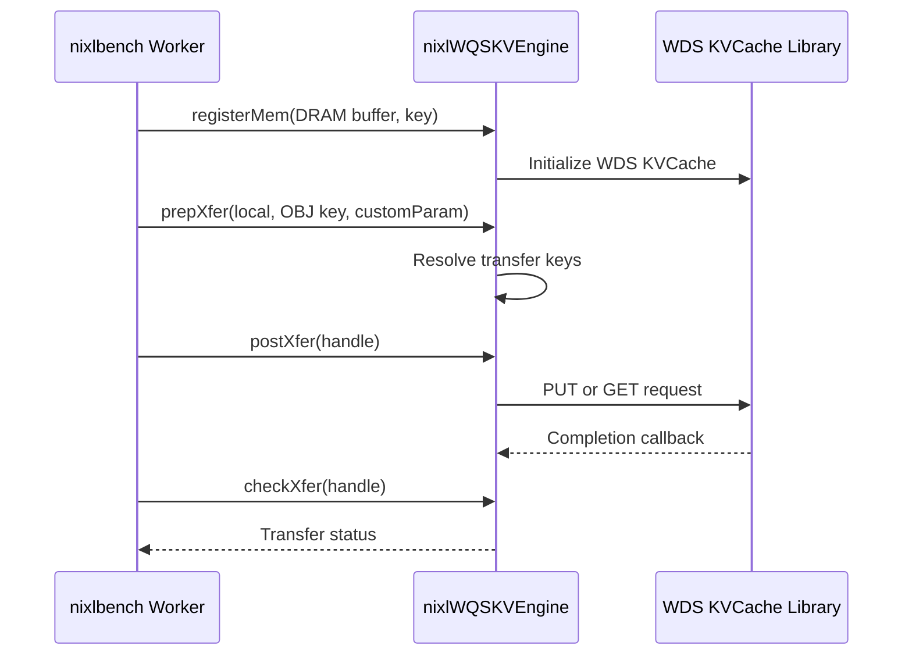

# [PR #1903] Add WQSKV backend plugin: NIXL backend over WDS KVCache vendor library

source: https://github.com/ai-dynamo/nixl/pull/1903
state: open | updated: 2026-09-17T02:55:27Z
labels: external-contribution, size/XXL

## 正文

## Summary

This PR introduces the WQSKV backend plugin — a new NIXL backend that wraps the
WDS KVCache vendor library (`libwclient_kvcache.so`) to provide local DRAM
`PUT`/`GET` operations against a WDS KVCache instance. It includes the plugin
implementation, nixlbench integration, documentation, and unit tests.

The implementation is organized into 4 commits:

### 1. `wqskv: add backend plugin wrapping WDS KVCache vendor API`

Core plugin implementation under `src/plugins/wqskv/`:

- **Plugin entry point** (`wqskv_plugin.cpp`): registers the `nixlWQSKVEngine`
  with the NIXL plugin API, versioned `0.1.0`, supporting `DRAM_SEG` only.
- **Backend engine** (`wqskv_backend.{h,cpp}`):
  - `registerMem` / `deregisterMem`: maps NIXL device IDs to vendor keys via
    `metaInfo` or falls back to `devId` stringification.
  - `prepXfer`: validates operation type and descriptor constraints; captures
    per-iteration key overrides from `opt_args->customParam` (used by
    nixlbench to inject unique keys per WRITE iteration).
  - `postXfer`: dispatches `NIXL_WRITE` → `wds_kvcache_put` and
    `NIXL_READ` → `wds_kvcache_get_vec` for each descriptor pair. Async
    completion via a per-request callback that decrements a shared pending
    counter. Synchronous vendor failures decrement counter inline.
  - `checkXfer`: returns `NIXL_IN_PROG` while pending > 0, `NIXL_SUCCESS`
    on clean completion, `NIXL_ERR_BACKEND` on first error.
  - `releaseReqH`: blocks on a condition variable until pending == 0, then
    frees the request handle.
  - `supportsRemote() = false`, `supportsLocal() = true`,
    `supportsNotif() = false`, `getSupportedMems() = {DRAM_SEG}`.
  - `wds_kvcache_init` is called at most once per process via `std::call_once`;
    subsequent `createBackend` calls reuse the global init state.
- **Build integration** (`src/plugins/meson.build`): conditionally enters the
  `wqskv` subdirectory when `libwclient_kvcache.so` and `jsoncpp` are both
  discoverable at configure time. New meson options `wqskv_lib_path` and
  `wqskv_inc_path` control custom library/header search paths.
- Adds `WQSKV` to the `all_plugins` list in the root `meson.build`.

### 2. `nixlbench: add WQSKV backend support`

Integrates the WQSKV backend into the nixlbench benchmarking tool:

- **New constant**: `XFERBENCH_BACKEND_WQSKV` in `utils.h`, recognized as a
  storage backend in `isStorageBackend()`.
- **Backend creation**: `createBackend` dispatches to `WQSKV` branch in
  `nixl_worker.cpp`.
- **Memory allocation**: storage backend path uses `metaInfo`-as-key `DRAM_SEG`
  descriptors.
- **WRITE workload** (`execWqskvWriteIterations`): each iteration gets a fresh
  key via a process-monotonic atomic sequence counter (`g_wqskv_write_seq`),
  satisfying the vendor constraint that `wds_kvcache_put` rejects overwrites.
  Keys are injected into `opt_args.customParam` and captured by the plugin at
  `prepXfer` time.
- **READ workload** (`execWqskvReadIterations`): cycles through a pool of 128
  pre-populated keys per block size, with a pre-populate phase
  (`execWqskvPrePopulate`) that runs before the READ benchmark loop.
- **Request lifecycle**: `execWqskvSingleIter` wraps
  `createXferReq` → `execSingleTransfer` → `releaseXferReq` with per-iteration
  key suffix injection.
- **Documentation**: adds WQSKV backend section to `benchmark/nixlbench/README.md`
  with setup instructions, constraints, and smoke-test examples.

### 3. `wqskv: add backend README and API documentation`

- **`src/plugins/wqskv/README.md`**: comprehensive documentation covering:
  - Plugin scope (DRAM_SEG, local-only)
  - Build requirements (two ABI implementations: `wqs-mock` for dev/CI, or
    the proprietary WDS client library for production)
  - Build-time configuration (`-Denable_plugins=WQSKV`,
    `-Dwqskv_lib_path=`, `-Dwqskv_inc_path=`)
  - Runtime config resolution (customParams → env var fallback)
  - JSON config schema shared with mooncake-store `wds_backend.cpp`
  - API reference for all overridden `nixlBackendEngine` methods
  - Python and C++ usage examples

### 4. `wqskv: add unit tests and extract helper functions`

- **Refactoring**: extracted pure helper functions from the anonymous namespace
  in `wqskv_backend.cpp` into a new `wqskv_helpers.{h,cpp}` TU:
  - `resolveConfigPath`: `customParams` priority over `WDS_BACKEND_CONFIG_PATH`
    env var, both unset returns empty.
  - `parseCustomParamKeys`: `\n`-delimited key blob parsing with count validation.
  - `isValidPrepXferParams`: validates operation type and memory segment.
  - `loadKVCacheOptionsFromJson`: loads vendor config from JSON with validation
    of `thread_mode`, `bind_cpus`, and optional fields.
- **Unit tests** (`test/gtest/unit/wqskv/wqskv.cpp`): 23 GoogleTest cases
  covering all helper functions across success and error paths:
  - `parseCustomParamKeys`: empty blob, non-positive count, single key, multiple
    keys, count mismatch, trailing-newline handling.
  - `resolveConfigPath`: customParam priority, env fallback, both unset.
  - `isValidPrepXferParams`: valid WRITE/READ, unknown op, non-DRAM segments.
  - `loadKVCacheOptionsFromJson`: complete config, event thread_mode, invalid
    thread_mode, non-existent file, malformed JSON, optional fields,
    non-numeric bind_cpus.
- Test target is gated identically to the plugin (conditional on `WQSKV` enable).

## Testing

- Unit tests: `ctest -R wqskv` (23 test cases, all pass)
- Plugin build: `meson setup build -Denable_plugins=WQSKV` (conditional on
  `libwclient_kvcache.so` + `jsoncpp` availability)
- Benchmark: `nixlbench --backend WQSKV --op_type WRITE` and
  `nixlbench --backend WQSKV --op_type READ`

Signed-off-by: Ye Rixu \<yerixu@expontech.com\>

<!-- This is an auto-generated comment: release notes by coderabbit.ai -->
## Summary by CodeRabbit

* **New Features**
  * Added support for the WQSKV backend/plugin, enabling READ/WRITE workflows with async per-descriptor completion and key-based PUT/GET behavior.
  * Extended benchmark backend selection so WQSKV is treated as a storage backend.
* **Documentation**
  * Added comprehensive WQSKV plugin documentation, including configuration via JSON and environment variable, required/optional settings, constraints, and example invocations.
* **Build/Configuration**
  * Added Meson options to locate the vendor library and headers; updated plugin allowlist and wiring so WQSKV can be enabled/validated.
* **Tests**
  * Added unit tests covering WQSKV helper parsing, config path resolution, parameter validation, and JSON option loading.
<!-- end of auto-generated comment: release notes by coderabbit.ai -->

## 评论 (7)

### copy-pr-bot[bot] · 2026-07-08

This pull request requires additional validation before any workflows can run on NVIDIA's runners.

Pull request vetters can view their responsibilities [here](https://docs.gha-runners.nvidia.com/cpr/vetters).

Contributors can view more details about this message [here](https://docs.gha-runners.nvidia.com/cpr/contributors).


### github-actions[bot] · 2026-07-08

👋 Hi rixuye! Thank you for contributing to ai-dynamo/nixl.

Your PR reviewers will review your contribution then trigger the CI to test your changes.

🚀

### coderabbitai[bot] · 2026-07-08

<!-- This is an auto-generated comment: summarize by coderabbit.ai -->
<!-- review_stack_entry_start -->

[](https://app.coderabbit.ai/change-stack/ai-dynamo/nixl/pull/1903?utm_source=github_walkthrough&utm_medium=github&utm_campaign=change_stack)

<!-- review_stack_entry_end -->
<!-- This is an auto-generated comment: review paused by coderabbit.ai -->

> [!NOTE]
> ## Reviews paused
> 
> It looks like this branch is under active development. To avoid overwhelming you with review comments due to an influx of new commits, CodeRabbit has automatically paused this review. You can configure this behavior by changing the `reviews.auto_review.auto_pause_after_reviewed_commits` setting.
> 
> Use the following commands to manage reviews:
> - `@coderabbitai resume` to resume automatic reviews.
> - `@coderabbitai review` to trigger a single review.
> 
> Use the checkboxes below for quick actions:
> - [ ] <!-- {"checkboxId": "7f6cc2e2-2e4e-497a-8c31-c9e4573e93d1"} --> ▶️ Resume reviews
> - [ ] <!-- {"checkboxId": "e9bb8d72-00e8-4f67-9cb2-caf3b22574fe"} --> 🔍 Trigger review

<!-- end of auto-generated comment: review paused by coderabbit.ai -->
<!-- walkthrough_start -->

<details>
<summary>📝 Walkthrough</summary>

## Walkthrough

This PR adds a WQSKV NIXL backend wrapping the WDS KVCache client for local DRAM-to-keyed-object transfers. It includes backend implementation, build wiring, nixlbench READ/WRITE integration, documentation, and helper unit tests.

### Changes

**WQSKV Backend Plugin**

|Layer / File(s)|Summary|
|---|---|
|**Build and plugin wiring** <br> `meson.build`, `meson_options.txt`, `src/plugins/...`, `test/gtest/unit/...`|Adds WQSKV plugin discovery, vendor library/include options, static/shared build rules, plugin entrypoints, and conditional unit-test linkage.|
|**Backend contracts and transfer engine** <br> `src/plugins/wqskv/wqskv_backend.*`|Defines `nixlWQSKVEngine` with local DRAM/OBJ capabilities, vendor initialization, key-based registration, asynchronous PUT/GET transfers, completion tracking, and lifecycle methods.|
|**Configuration and validation helpers** <br> `src/plugins/wqskv/wqskv_helpers.*`|Adds config-path resolution, JSON `KVCacheOptions` parsing, custom key parsing, and transfer segment validation.|
|**nixlbench execution integration** <br> `benchmark/nixlbench/src/utils/*`, `benchmark/nixlbench/src/worker/nixl/nixl_worker.cpp`|Adds WQSKV recognition, OBJ_SEG descriptor handling, per-iteration key suffixes, READ key pre-population, and dedicated READ/WRITE execution paths.|
|**Validation and usage documentation** <br> `test/gtest/unit/wqskv/*`, `src/plugins/wqskv/README.md`, `benchmark/nixlbench/README.md`|Adds helper tests and documents build requirements, runtime configuration, transfer semantics, key overrides, constraints, and benchmark commands.|

**Estimated code review effort:** 4 (Complex) | ~60 minutes

### Sequence Diagram(s)



**Suggested reviewers:** `aranadive`, `brminich`, `ovidiusm`

</details>

<!-- walkthrough_end -->
<!-- pre_merge_checks_walkthrough_start -->

<details>
<summary>🚥 Pre-merge checks | ✅ 4 | ❌ 1</summary>

### ❌ Failed checks (1 warning)

|     Check name     | Status     | Explanation                                                                          | Resolution                                                                         |
| :----------------: | :--------- | :----------------------------------------------------------------------------------- | :--------------------------------------------------------------------------------- |
| Docstring Coverage | ⚠️ Warning | Docstring coverage is 6.67% which is insufficient. The required threshold is 80.00%. | Write docstrings for the functions missing them to satisfy the coverage threshold. |

<details>
<summary>✅ Passed checks (4 passed)</summary>

|         Check name         | Status   | Explanation                                                                                                                                   |
| :------------------------: | :------- | :-------------------------------------------------------------------------------------------------------------------------------------------- |
|         Title check        | ✅ Passed | The title clearly summarizes the main change: adding the WQSKV backend plugin over the WDS KVCache vendor library.                            |
|      Description check     | ✅ Passed | The description is thorough and covers what, why, how, and testing, though it uses custom headings instead of the template's exact structure. |
|     Linked Issues check    | ✅ Passed | Check skipped because no linked issues were found for this pull request.                                                                      |
| Out of Scope Changes check | ✅ Passed | Check skipped because no linked issues were found for this pull request.                                                                      |

</details>

</details>

<!-- pre_merge_checks_walkthrough_end -->
<!-- finishing_touch_checkbox_start -->

<details>
<summary>✨ Finishing Touches</summary>

<details>
<summary>🧪 Generate unit tests (beta)</summary>

- [ ] <!-- {"checkboxId": "f47ac10b-58cc-4372-a567-0e02b2c3d479", "radioGroupId": "utg-output-choice-group-unknown_comment_id"} -->   Create PR with unit tests

</details>

</details>

<!-- finishing_touch_checkbox_end -->
<!-- tips_start -->

---


<sub>Comment `@coderabbitai help` to get the list of available commands.</sub>

<!-- tips_end -->

### hxieustc · 2026-07-22

@rixuye could you please provide `libwclient_kvcache.so` (or where we can download it) so we can test? Future CI workflow also needs a variant of this library.

### ofer · 2026-07-23

From what I understand from looking at the code, this is not a DRAM to DRAM plugin, it is a plugin that takes a key and data and moves it to storage.  It sounds like this is an OBJ_SEG plugin and should register both DRAM and OBJ_SEG memory types, that way it's clear that a key is required for the target instead of just a memory address. 

### rixuye · 2026-07-24

> @rixuye could you please provide `libwclient_kvcache.so` (or where we can download it) so we can test? Future CI workflow also needs a variant of this library.

Currently, this library has not been open-sourced. We have provided a mock repository for compilation and testing. https://github.com/expontech/wqs_mock

### rixuye · 2026-07-29

> From what I understand from looking at the code, this is not a DRAM to DRAM plugin, it is a plugin that takes a key and data and moves it to storage. It sounds like this is an OBJ_SEG plugin and should register both DRAM and OBJ_SEG memory types, that way it's clear that a key is required for the target instead of just a memory address.

What you said is correct. I should also register OBJ_SEG. This was something I overlooked.

## Review (4)

### coderabbitai[bot] · 2026-07-08 · COMMENTED

**Actionable comments posted: 15**

<details>
<summary>🤖 Prompt for all review comments with AI agents</summary>

```
Verify each finding against current code. Fix only still-valid issues, skip the
rest with a brief reason, keep changes minimal, and validate.

Inline comments:
In `@benchmark/nixlbench/src/worker/nixl/nixl_worker.cpp`:
- Around line 159-164: The WQSKV check in the backend selection logic is
redundant because isStorageBackend() already covers WQSKV. Simplify the
condition in nixl_worker.cpp by relying on isStorageBackend() alone and keep the
backend_name assignment in the existing backend selection block using
backendEqualsWqskv() only where needed for mapping to XFERBENCH_BACKEND_WQSKV.
- Around line 1968-2007: `execTransfer()` is using `local_desc`, `remote_desc`,
and `timer` without defining them, so this dispatch block will not compile. Add
the descriptor creation/setup and timer initialization in `execTransfer` before
the `backendEqualsWqskv` branch logic, ensuring those symbols are available to
both `execWqskvWriteIterations`, `execWqskvReadIterations`, and
`execTransferIterations`.

In `@src/plugins/meson.build`:
- Around line 36-54: The WQSKV enablement block only checks libwclient_kvcache
and jsoncpp, but it should also verify that kv_interface.h is available before
entering subdir('wqskv'). Add a header-discovery check alongside the existing
cpp.find_library and dependency('jsoncpp') logic, using wqskv_inc_path and a
friendly error() when the header is missing or the include path is wrong.
Reference the WQSKV plugin branch and the existing etcd-style header validation
pattern to keep the failure local and clear.

In `@src/plugins/wqskv/README.md`:
- Line 81: The README references the wrong implementation file for
loadKVCacheOptionsFromJson; update the documentation so it points to the actual
location in wqskv_helpers.cpp instead of wqskv_backend.cpp. Use the
loadKVCacheOptionsFromJson symbol to locate the mention and correct the file
reference wherever it appears in the wqskv README.
- Around line 22-23: The README still contains a placeholder repository URL for
wqs-mock; update the documentation entry in the wqskv README to use the real
GitHub link instead of the literal <owner> placeholder. Locate the bullet
mentioning wqs-mock and replace the placeholder URL with the correct repository
reference, keeping the surrounding descriptive text unchanged.

In `@src/plugins/wqskv/wqskv_backend.cpp`:
- Around line 81-93: The pending-decrement, first_error update, and notify_all
sequence is duplicated in wqskv_xfer_cb, resolveKey failure handling, and the
vendor sync-failure path. Extract that logic into a shared helper (for example,
completeSlot) near nixlWqskvBackendReqH and use it from all three places so the
atomic decrement, memory order, and mutex/condition_variable behavior stay
consistent.
- Around line 81-93: The wqskv transfer callback name breaks the file’s
lowerCamelCase convention, so rename wqskv_xfer_cb to a lowerCamelCase
identifier consistent with helpers like resolveKey and update its declaration
and all call sites accordingly. Keep the implementation in wqskv_backend.cpp
unchanged otherwise, and make sure any related function pointers or references
use the new name.
- Around line 157-158: The unconditional NIXL_INFO logging in WQSKVBackend
hot-path methods is too expensive for per-transfer calls. Move the registerMem,
prepXfer, and postXfer messages in WQSKVBackend to a lower verbosity such as
debug/trace, or guard them behind a log-level check so the formatting only
happens when enabled. Update the logging sites identified by the registerMem,
prepXfer, and postXfer paths to keep the same diagnostics without paying the
cost on every call.
- Around line 116-119: Initialize localAgent in the nixlWQSKVEngine constructor
member-initializer list instead of assigning it inside the body. Update
nixlWQSKVEngine(const nixlBackendInitParams *init_params) so localAgent is
directly initialized alongside the base nixlBackendEngine(init_params)
initialization, avoiding the default construction and copy-assignment currently
performed in the constructor body.
- Around line 325-334: releaseReqH can block forever because it waits on req->cv
until pending reaches zero with no timeout. Update nixlWQSKVEngine::releaseReqH
to use a bounded wait and handle timeout/error instead of waiting indefinitely,
so a missing vendor callback cannot stall the caller. Make sure the wait
condition still checks req->pending with the existing mutex/cv synchronization,
and only delete the nixlWqskvBackendReqH once the request is completed or the
timeout path has been handled safely.
- Around line 192-198: The loop in wqskv_backend.cpp defines an unused local key
in the response-building logic, which will trigger a warning-as-error build
failure. Remove the unnecessary key variable from the descs iteration in the
function that fills resp, and keep the existing exists check and
resp.emplace_back behavior unchanged.

In `@src/plugins/wqskv/wqskv_backend.h`:
- Around line 116-120: `getLocalAgent()` in `wqskv_backend.h` is flagged as
unused and unnecessarily copies `localAgent`; either remove the accessor if it
is not needed anywhere, or change the `getLocalAgent` method to return `const
std::string &` so it exposes the member without copying. Check the
`WQSKVBackend` class and any call sites before deciding whether to keep or
delete it.

In `@src/plugins/wqskv/wqskv_helpers.cpp`:
- Around line 100-114: The WQSKV bind_cpus parsing in wqskv_helpers.cpp accepts
partially numeric tokens because std::stoi does not reject trailing characters,
so update the token handling in the bind_cpus loop to verify full consumption
after parsing. In the code that fills opts.bind_cpus, use the parsed-length
result from std::stoi (or equivalent) and reject any token where not all
characters were consumed, logging the same NIXL_ERROR and returning false for
malformed values like "12abc" or mixed tokens.
- Around line 69-100: The WQSKV config parser in wqskv_helpers.cpp is treating
required fields as optional because Json::Value accessors like asUInt() and
asString() return default values when keys are missing. Update the parsing logic
in the config-load path to explicitly validate required keys such as poolid,
thread_num, wengine_conf, node_id, bvar_port, mem_size, and bind_cpus before
reading them, and return false with an NIXL_ERROR if any are absent or empty.
Keep the existing optional-field handling and mode validation, but make the
required-field checks part of the same parsing function so missing config fails
fast instead of silently zeroing options.

In `@src/plugins/wqskv/wqskv_helpers.h`:
- Around line 18-19: The header guard in wqskv_helpers.h does not match the
repository convention. Update the include guard around WQSKV_HELPERS_H to use
the NIXL_ prefix and derive it from the full repo-relative path in uppercase
with slashes replaced by underscores, ending in _H, and make sure the same
symbol is used consistently in the matching `#ifndef` and `#define`.
```

</details>

<details>
<summary>🪄 Autofix (Beta)</summary>

Fix all unresolved CodeRabbit comments on this PR:

- [ ] <!-- {"checkboxId": "4b0d0e0a-96d7-4f10-b296-3a18ea78f0b9"} --> Push a commit to this branch (recommended)
- [ ] <!-- {"checkboxId": "ff5b1114-7d8c-49e6-8ac1-43f82af23a33"} --> Create a new PR with the fixes

</details>

---

<details>
<summary>ℹ️ Review info</summary>

<details>
<summary>⚙️ Run configuration</summary>

**Configuration used**: Path: .coderabbit.yaml

**Review profile**: ASSERTIVE

**Plan**: Enterprise

**Run ID**: `69c4c2fb-fc15-4592-ae5e-bfe5ce553f35`

</details>

<details>
<summary>📥 Commits</summary>

Reviewing files that changed from the base of the PR and between 3e553d5a33d3c9980ab7e0be5d9683e751ea68bc and b568446e5b212e375beb185dfc1096d58f237865.

</details>

<details>
<summary>📒 Files selected for processing (17)</summary>

* `benchmark/nixlbench/README.md`
* `benchmark/nixlbench/src/utils/utils.cpp`
* `benchmark/nixlbench/src/utils/utils.h`
* `benchmark/nixlbench/src/worker/nixl/nixl_worker.cpp`
* `meson.build`
* `meson_options.txt`
* `src/plugins/meson.build`
* `src/plugins/wqskv/README.md`
* `src/plugins/wqskv/meson.build`
* `src/plugins/wqskv/wqskv_backend.cpp`
* `src/plugins/wqskv/wqskv_backend.h`
* `src/plugins/wqskv/wqskv_helpers.cpp`
* `src/plugins/wqskv/wqskv_helpers.h`
* `src/plugins/wqskv/wqskv_plugin.cpp`
* `test/gtest/unit/meson.build`
* `test/gtest/unit/wqskv/meson.build`
* `test/gtest/unit/wqskv/wqskv.cpp`

</details>

</details>

<!-- This is an auto-generated comment by CodeRabbit for review status -->

### coderabbitai[bot] · 2026-07-29 · COMMENTED

**Actionable comments posted: 1**

> [!CAUTION]
> Some comments are outside the diff and can’t be posted inline due to platform limitations.
> 
> 
> 
> <details>
> <summary>⚠️ Outside diff range comments (6)</summary><blockquote>
> 
> <details>
> <summary>src/plugins/wqskv/wqskv_backend.h (1)</summary><blockquote>
> 
> `131-131`: _📐 Maintainability & Code Quality_ | _🔵 Trivial_ | _⚡ Quick win_
> 
> **Add the required trailing underscore to `localAgent`.**
> 
> Rename it consistently and update `getLocalAgent()`.
> 
> As per path instructions, private members must end with a trailing underscore.
> 
> 
> 
> 
> 
> 
> <details>
> <summary>Suggested fix</summary>
> 
> ```diff
> -        return localAgent;
> +        return localAgent_;
> 
> -    std::string localAgent;
> +    std::string localAgent_;
> ```
> </details>
> 
> <details>
> <summary>🤖 Prompt for AI Agents</summary>
> 
> ```
> Verify each finding against current code. Fix only still-valid issues, skip the
> rest with a brief reason, keep changes minimal, and validate.
> 
> In `@src/plugins/wqskv/wqskv_backend.h` at line 131, Rename the private member
> localAgent to localAgent_ and update all references to it, including
> getLocalAgent(), while preserving the existing accessor behavior.
> ```
> 
> </details>
> 
> <!-- cr-comment:v1:841225b6be1ff3d8a1af52dc -->
> 
> _Source: Path instructions_
> 
> </blockquote></details>
> <details>
> <summary>src/plugins/wqskv/wqskv_helpers.h (1)</summary><blockquote>
> 
> `29-53`: _📐 Maintainability & Code Quality_ | _🔵 Trivial_ | _⚡ Quick win_
> 
> **Use Doxygen comments for public helper APIs.**
> 
> Convert these `//` documentation blocks to `/** ... */` comments so the public declarations follow the repository’s API-documentation convention.
> 
> As per path instructions, public APIs/functions must use Doxygen-style documentation.
> 
> <details>
> <summary>🤖 Prompt for AI Agents</summary>
> 
> ```
> Verify each finding against current code. Fix only still-valid issues, skip the
> rest with a brief reason, keep changes minimal, and validate.
> 
> In `@src/plugins/wqskv/wqskv_helpers.h` around lines 29 - 53, Convert the
> documentation blocks immediately preceding resolveConfigPath,
> loadKVCacheOptionsFromJson, parseCustomParamKeys, and isValidPrepXferParams from
> // comments to Doxygen-style /** ... */ comments, preserving their existing
> descriptions and declarations.
> ```
> 
> </details>
> 
> <!-- cr-comment:v1:08b055bdb3d2ad07386c3d9b -->
> 
> _Source: Path instructions_
> 
> </blockquote></details>
> <details>
> <summary>src/plugins/wqskv/wqskv_helpers.cpp (1)</summary><blockquote>
> 
> `125-127`: _🎯 Functional Correctness_ | _🟡 Minor_ | _⚡ Quick win_
> 
> **Clear `out` on every failure path.**
> 
> The early return for an empty blob or non-positive count leaves pre-existing keys intact, contradicting the declared contract and potentially exposing stale keys to callers.
> 
> 
> 
> 
> 
> 
> <details>
> <summary>Suggested fix</summary>
> 
> ```diff
>  bool
>  parseCustomParamKeys(const std::string &blob, int expected_count, std::vector<std::string> &out) {
> +    out.clear();
>      if (blob.empty() || expected_count <= 0) {
>          return false;
>      }
> -    out.clear();
> ```
> </details>
> 
> <details>
> <summary>🤖 Prompt for AI Agents</summary>
> 
> ```
> Verify each finding against current code. Fix only still-valid issues, skip the
> rest with a brief reason, keep changes minimal, and validate.
> 
> In `@src/plugins/wqskv/wqskv_helpers.cpp` around lines 125 - 127, Update
> parseCustomParamKeys so out is cleared before every failure return, including
> the blob.empty() or expected_count <= 0 guard. Ensure all other failure paths
> also leave out empty, while preserving successful parsing behavior.
> ```
> 
> </details>
> 
> <!-- cr-comment:v1:e7582a18942f9c55a0bad2e7 -->
> 
> </blockquote></details>
> <details>
> <summary>test/gtest/unit/wqskv/wqskv.cpp (2)</summary><blockquote>
> 
> `196-222`: _🎯 Functional Correctness_ | _🔵 Trivial_ | _⚡ Quick win_
> 
> **Add regression coverage for parser validation.**
> 
> The suite does not test missing required JSON keys or partially numeric tokens such as `"12abc"`; add both cases so the documented validation cannot regress.
> 
> 
> 
> 
> 
> 
> 
> 
> Also applies to: 285-295
> 
> <details>
> <summary>🤖 Prompt for AI Agents</summary>
> 
> ```
> Verify each finding against current code. Fix only still-valid issues, skip the
> rest with a brief reason, keep changes minimal, and validate.
> 
> In `@test/gtest/unit/wqskv/wqskv.cpp` around lines 196 - 222, Extend the
> WqskvLoadJson tests around ParsesValidConfig with regression cases for
> loadKVCacheOptionsFromJson: verify JSON missing each required key is rejected,
> and verify partially numeric bind CPU tokens such as "12abc" are rejected rather
> than partially parsed. Reuse writeTempJson and assert the parser returns false
> for both invalid configurations.
> ```
> 
> </details>
> 
> <!-- cr-comment:v1:8b552ffb1e3111d41db97412 -->
> 
> ---
> 
> `84-94`: _🩺 Stability & Availability_ | _🟡 Minor_ | _⚡ Quick win_
> 
> **Use the existing `ScopedEnv` helper instead of raw `unsetenv` in this fixture.** This keeps any pre-existing `WDS_BACKEND_CONFIG_PATH` value intact and avoids leaking state into later tests. The same applies to the env-dependent cases below.
> 
> <details>
> <summary>🤖 Prompt for AI Agents</summary>
> 
> ```
> Verify each finding against current code. Fix only still-valid issues, skip the
> rest with a brief reason, keep changes minimal, and validate.
> 
> In `@test/gtest/unit/wqskv/wqskv.cpp` around lines 84 - 94, Update the
> WqskvResolveConfigPath fixture and the env-dependent test cases to use the
> existing ScopedEnv helper for WDS_BACKEND_CONFIG_PATH instead of raw unsetenv
> calls. Ensure each test scopes and restores the environment variable so any
> pre-existing value is preserved and test state does not leak.
> ```
> 
> </details>
> 
> <!-- cr-comment:v1:754f5b4e5c7bb1cd9eb97737 -->
> 
> _Source: Learnings_
> 
> </blockquote></details>
> <details>
> <summary>src/plugins/wqskv/README.md (1)</summary><blockquote>
> 
> `104-106`: _📐 Maintainability & Code Quality_ | _🟡 Minor_ | _⚡ Quick win_
> 
> **Fix the config example path.** `config/wdsBachend*.json` should be `config/wdsBackend*.json`; the same typo also appears in `benchmark/nixlbench/README.md`.
> 
> <details>
> <summary>🤖 Prompt for AI Agents</summary>
> 
> ```
> Verify each finding against current code. Fix only still-valid issues, skip the
> rest with a brief reason, keep changes minimal, and validate.
> 
> In `@src/plugins/wqskv/README.md` around lines 104 - 106, Correct the
> configuration example path in the README from config/wdsBachend*.json to
> config/wdsBackend*.json, and apply the same spelling fix in
> benchmark/nixlbench/README.md.
> ```
> 
> </details>
> 
> <!-- cr-comment:v1:a3bf08af066974b2cc848fee -->
> 
> </blockquote></details>
> 
> </blockquote></details>

<details>
<summary>🤖 Prompt for all review comments with AI agents</summary>

```
Verify each finding against current code. Fix only still-valid issues, skip the
rest with a brief reason, keep changes minimal, and validate.

Inline comments:
In `@benchmark/nixlbench/src/worker/nixl/nixl_worker.cpp`:
- Around line 1497-1511: Thread terminate_ptr through execWqskvWriteIterations
and execWqskvReadIterations into execSingleTransfer, updating declarations and
call sites consistently. In execSingleTransfer, check the shutdown flag during
the NIXL_IN_PROG polling loop and stop polling when termination is requested,
preserving normal status handling otherwise.

---

Outside diff comments:
In `@src/plugins/wqskv/README.md`:
- Around line 104-106: Correct the configuration example path in the README from
config/wdsBachend*.json to config/wdsBackend*.json, and apply the same spelling
fix in benchmark/nixlbench/README.md.

In `@src/plugins/wqskv/wqskv_backend.h`:
- Line 131: Rename the private member localAgent to localAgent_ and update all
references to it, including getLocalAgent(), while preserving the existing
accessor behavior.

In `@src/plugins/wqskv/wqskv_helpers.cpp`:
- Around line 125-127: Update parseCustomParamKeys so out is cleared before
every failure return, including the blob.empty() or expected_count <= 0 guard.
Ensure all other failure paths also leave out empty, while preserving successful
parsing behavior.

In `@src/plugins/wqskv/wqskv_helpers.h`:
- Around line 29-53: Convert the documentation blocks immediately preceding
resolveConfigPath, loadKVCacheOptionsFromJson, parseCustomParamKeys, and
isValidPrepXferParams from // comments to Doxygen-style /** ... */ comments,
preserving their existing descriptions and declarations.

In `@test/gtest/unit/wqskv/wqskv.cpp`:
- Around line 196-222: Extend the WqskvLoadJson tests around ParsesValidConfig
with regression cases for loadKVCacheOptionsFromJson: verify JSON missing each
required key is rejected, and verify partially numeric bind CPU tokens such as
"12abc" are rejected rather than partially parsed. Reuse writeTempJson and
assert the parser returns false for both invalid configurations.
- Around line 84-94: Update the WqskvResolveConfigPath fixture and the
env-dependent test cases to use the existing ScopedEnv helper for
WDS_BACKEND_CONFIG_PATH instead of raw unsetenv calls. Ensure each test scopes
and restores the environment variable so any pre-existing value is preserved and
test state does not leak.
```

</details>

<details>
<summary>🪄 Autofix (Beta)</summary>

Fix all unresolved CodeRabbit comments on this PR:

- [ ] <!-- {"checkboxId": "4b0d0e0a-96d7-4f10-b296-3a18ea78f0b9"} --> Push a commit to this branch (recommended)
- [ ] <!-- {"checkboxId": "ff5b1114-7d8c-49e6-8ac1-43f82af23a33"} --> Create a new PR with the fixes

</details>

---

<details>
<summary>ℹ️ Review info</summary>

<details>
<summary>⚙️ Run configuration</summary>

**Configuration used**: Path: .coderabbit.yaml

**Review profile**: ASSERTIVE

**Plan**: Enterprise

**Run ID**: `6a573e7b-3733-4814-83d9-f4eb38e25d1b`

</details>

<details>
<summary>📥 Commits</summary>

Reviewing files that changed from the base of the PR and between b568446e5b212e375beb185dfc1096d58f237865 and b19e4a0d14384c9a8787be835904177b068ecc89.

</details>

<details>
<summary>📒 Files selected for processing (7)</summary>

* `benchmark/nixlbench/src/worker/nixl/nixl_worker.cpp`
* `src/plugins/wqskv/README.md`
* `src/plugins/wqskv/wqskv_backend.h`
* `src/plugins/wqskv/wqskv_helpers.cpp`
* `src/plugins/wqskv/wqskv_helpers.h`
* `src/plugins/wqskv/wqskv_plugin.cpp`
* `test/gtest/unit/wqskv/wqskv.cpp`

</details>

</details>

<!-- This is an auto-generated comment by CodeRabbit for review status -->

### coderabbitai[bot] · 2026-07-29 · COMMENTED

**Actionable comments posted: 1**

> [!CAUTION]
> Some comments are outside the diff and can’t be posted inline due to platform limitations.
> 
> 
> 
> <details>
> <summary>⚠️ Outside diff range comments (8)</summary><blockquote>
> 
> <details>
> <summary>src/plugins/wqskv/wqskv_backend.h (3)</summary><blockquote>
> 
> `49-118`: _📐 Maintainability & Code Quality_ | _🔵 Trivial_ | _⚡ Quick win_
> 
> **Document the public backend API with Doxygen comments.**
> 
> The newly declared public constructor, lifecycle methods, transfer methods, and capability methods have no method-level `@brief`/`@param`/`@return` documentation. Add concise Doxygen blocks for the public API.
> 
> <details>
> <summary>🤖 Prompt for AI Agents</summary>
> 
> ```
> Verify each finding against current code. Fix only still-valid issues, skip the
> rest with a brief reason, keep changes minimal, and validate.
> 
> In `@src/plugins/wqskv/wqskv_backend.h` around lines 49 - 118, Add concise Doxygen
> blocks to each newly declared public API member in nixlWQSKVEngine, including
> the constructor, memory registration/lifecycle methods, transfer methods,
> capability methods, connection methods, and metadata loading methods. Document
> parameters with `@param` and return values with `@return` where applicable, and
> include `@brief` descriptions while preserving the existing signatures and
> behavior.
> ```
> 
> </details>
> 
> <!-- cr-comment:v1:71afb17f11eebabfb46d2f0f -->
> 
> _Source: Path instructions_
> 
> ---
> 
> `129-131`: _📐 Maintainability & Code Quality_ | _🔵 Trivial_ | _⚡ Quick win_
> 
> **Use the required private-member naming convention.**
> 
> Rename `devIdToKey_` and `localAgent` to `dev_id_to_key_` and `local_agent_`, respectively, and update their uses in the implementation.
> 
> As per path instructions and retrieved repository learnings, backend-plugin private members use snake_case with a trailing underscore.
> 
> <details>
> <summary>🤖 Prompt for AI Agents</summary>
> 
> ```
> Verify each finding against current code. Fix only still-valid issues, skip the
> rest with a brief reason, keep changes minimal, and validate.
> 
> In `@src/plugins/wqskv/wqskv_backend.h` around lines 129 - 131, Rename the private
> members devIdToKey_ and localAgent in the backend class to dev_id_to_key_ and
> local_agent_, respectively, then update every reference to these members
> throughout the implementation while preserving their behavior.
> ```
> 
> </details>
> 
> <!-- cr-comment:v1:26b40b6f67ca7675bfd8d88f -->
> 
> _Sources: Path instructions, Learnings_
> 
> ---
> 
> `40-48`: _📐 Maintainability & Code Quality_ | _🟡 Minor_ | _⚡ Quick win_
> 
> **Rename the header guard to the repo convention.**  
> Use `NIXL_SRC_PLUGINS_WQSKV_WQSKV_BACKEND_H` instead of `WQSKV_BACKEND_H`.
> 
> <details>
> <summary>🤖 Prompt for AI Agents</summary>
> 
> ```
> Verify each finding against current code. Fix only still-valid issues, skip the
> rest with a brief reason, keep changes minimal, and validate.
> 
> In `@src/plugins/wqskv/wqskv_backend.h` around lines 40 - 48, Rename the header
> guard in wqskv_backend.h from WQSKV_BACKEND_H to
> NIXL_SRC_PLUGINS_WQSKV_WQSKV_BACKEND_H, updating both the `#ifndef` and matching
> `#define` while leaving the included headers unchanged.
> ```
> 
> </details>
> 
> <!-- cr-comment:v1:34ce8096fb951f1d3a8d0700 -->
> 
> _Source: Path instructions_
> 
> </blockquote></details>
> <details>
> <summary>test/gtest/unit/wqskv/wqskv.cpp (1)</summary><blockquote>
> 
> `84-94`: _🩺 Stability & Availability_ | _🟡 Minor_ | _⚡ Quick win_
> 
> **Use scoped environment isolation in this fixture.**
> 
> Raw `setenv`/`unsetenv` permanently discard any pre-existing `WDS_BACKEND_CONFIG_PATH` value and can race with other tests. Replace this fixture’s process-global mutation with `gtest::ScopedEnv` so the original value is restored automatically.
> 
> <details>
> <summary>🤖 Prompt for AI Agents</summary>
> 
> ```
> Verify each finding against current code. Fix only still-valid issues, skip the
> rest with a brief reason, keep changes minimal, and validate.
> 
> In `@test/gtest/unit/wqskv/wqskv.cpp` around lines 84 - 94, Update the
> WqskvResolveConfigPath fixture’s SetUp and TearDown methods to use
> gtest::ScopedEnv for WDS_BACKEND_CONFIG_PATH instead of direct setenv/unsetenv
> calls, ensuring the prior environment value is automatically restored and the
> fixture retains scoped isolation.
> ```
> 
> </details>
> 
> <!-- cr-comment:v1:f6e34648519df1787c525832 -->
> 
> _Source: Learnings_
> 
> </blockquote></details>
> <details>
> <summary>src/plugins/wqskv/wqskv_helpers.cpp (1)</summary><blockquote>
> 
> `125-128`: _🎯 Functional Correctness_ | _🟡 Minor_ | _⚡ Quick win_
> 
> **Clear `out` on every failure path.**
> 
> The empty-blob and non-positive-count checks return before `out.clear()`, leaving stale keys when callers reuse a non-empty vector despite the documented “clears on failure” contract.
> 
> <details>
> <summary>🤖 Prompt for AI Agents</summary>
> 
> ```
> Verify each finding against current code. Fix only still-valid issues, skip the
> rest with a brief reason, keep changes minimal, and validate.
> 
> In `@src/plugins/wqskv/wqskv_helpers.cpp` around lines 125 - 128, Update
> parseCustomParamKeys so out is cleared before every failure return, including
> the blob.empty() and expected_count <= 0 checks. Preserve the documented
> behavior that any failed parse leaves out empty, including all other existing
> failure paths.
> ```
> 
> </details>
> 
> <!-- cr-comment:v1:8c5660fb8b7721e7b593facb -->
> 
> </blockquote></details>
> <details>
> <summary>src/plugins/wqskv/wqskv_helpers.h (1)</summary><blockquote>
> 
> `29-55`: _📐 Maintainability & Code Quality_ | _🔵 Trivial_ | _⚡ Quick win_
> 
> **Use Doxygen blocks for these public helper APIs.**
> 
> Replace the `//` summaries with `/** ... */` comments containing `@brief` and applicable `@param`/`@return` documentation.
> 
> <details>
> <summary>🤖 Prompt for AI Agents</summary>
> 
> ```
> Verify each finding against current code. Fix only still-valid issues, skip the
> rest with a brief reason, keep changes minimal, and validate.
> 
> In `@src/plugins/wqskv/wqskv_helpers.h` around lines 29 - 55, Replace the four
> line-comment documentation blocks above resolveConfigPath,
> loadKVCacheOptionsFromJson, parseCustomParamKeys, and isValidPrepXferParams with
> Doxygen-style /** ... */ blocks. Add an `@brief` summary for each API, document
> every parameter with `@param`, and describe each return value with `@return` while
> preserving the existing behavioral details.
> ```
> 
> </details>
> 
> <!-- cr-comment:v1:be997cba14222dbd1ff1ca69 -->
> 
> _Source: Path instructions_
> 
> </blockquote></details>
> <details>
> <summary>src/plugins/wqskv/README.md (1)</summary><blockquote>
> 
> `104-106`: _📐 Maintainability & Code Quality_ | _🟡 Minor_ | _⚡ Quick win_
> 
> **Fix the configuration example filename typo.**
> 
> Change `config/wdsBachend*.json` to the correct `config/wdsBackend*.json` reference.
> 
> <details>
> <summary>🤖 Prompt for AI Agents</summary>
> 
> ```
> Verify each finding against current code. Fix only still-valid issues, skip the
> rest with a brief reason, keep changes minimal, and validate.
> 
> In `@src/plugins/wqskv/README.md` around lines 104 - 106, Correct the
> configuration example reference in the README by changing
> “config/wdsBachend*.json” to “config/wdsBackend*.json”; leave the surrounding
> documentation unchanged.
> ```
> 
> </details>
> 
> <!-- cr-comment:v1:82815865f870490169f8732a -->
> 
> </blockquote></details>
> <details>
> <summary>benchmark/nixlbench/src/worker/nixl/nixl_worker.cpp (1)</summary><blockquote>
> 
> `1417-1467`: _🗄️ Data Integrity & Integration_ | _🟠 Major_ | _⚡ Quick win_
> 
> **Deregistration order contradicts the documented local/remote ordering contract.**
> 
> `deregisterIterationMem` deregisters local memory first, then remote (lines 1452-1464). `deallocateMemory` (lines 1193-1195) explicitly documents the opposite requirement: deregister remote before local, "remote registrations may reference local buffers." Similarly, `registerIterationMem` registers local before remote (lines 1426-1438), the reverse of `allocateMemory`'s own remote-then-local sequencing. If the invariant behind that comment holds for per-iteration (de)registration too, deregistering local first could leave a remote registration referencing an already-deregistered local buffer.
> 
> <details>
> <summary>🛠️ Proposed fix to match the documented ordering</summary>
> 
> ```diff
>  static nixl_status_t
>  deregisterIterationMem(nixlAgent *agent,
>                         const std::vector<xferBenchIOV> &local_iov,
>                         const std::vector<xferBenchIOV> &remote_iov,
>                         nixlBackendH *backend_engine) {
>      nixl_opt_args_t reg_args;
>      reg_args.backends.push_back(backend_engine);
>  
> -    nixl_reg_dlist_t local_reg = iovListToNixlRegDlist(local_iov, GET_SEG_TYPE(true));
> -    nixl_status_t rc = agent->deregisterMem(local_reg, &reg_args);
> -    if (rc != NIXL_SUCCESS) {
> -        return rc;
> -    }
> -
>      if (xferBenchConfig::isStorageBackend()) {
>          nixl_reg_dlist_t remote_reg = iovListToNixlRegDlist(remote_iov, getRemoteSegType());
> -        rc = agent->deregisterMem(remote_reg, &reg_args);
> +        nixl_status_t rc = agent->deregisterMem(remote_reg, &reg_args);
>          if (rc != NIXL_SUCCESS) {
>              return rc;
>          }
>      }
>  
> +    nixl_reg_dlist_t local_reg = iovListToNixlRegDlist(local_iov, GET_SEG_TYPE(true));
> +    nixl_status_t rc = agent->deregisterMem(local_reg, &reg_args);
> +    if (rc != NIXL_SUCCESS) {
> +        return rc;
> +    }
> +
>      return NIXL_SUCCESS;
>  }
> ```
> </details>
> 
> <details>
> <summary>🤖 Prompt for AI Agents</summary>
> 
> ```
> Verify each finding against current code. Fix only still-valid issues, skip the
> rest with a brief reason, keep changes minimal, and validate.
> 
> In `@benchmark/nixlbench/src/worker/nixl/nixl_worker.cpp` around lines 1417 -
> 1467, Update registerIterationMem and deregisterIterationMem to follow the
> documented dependency ordering: register remote memory before local memory, and
> deregister remote memory before local memory. Preserve the existing
> storage-backend guard, error propagation, backend arguments, and success
> behavior while reordering the corresponding registerMem and deregisterMem calls.
> ```
> 
> </details>
> 
> <!-- cr-comment:v1:e92e90f45a5decd3f9ca74a1 -->
> 
> </blockquote></details>
> 
> </blockquote></details>

<details>
<summary>♻️ Duplicate comments (5)</summary><blockquote>

<details>
<summary>src/plugins/wqskv/wqskv_helpers.h (1)</summary><blockquote>

`18-19`: _📐 Maintainability & Code Quality_ | _🟠 Major_

**Use the mandated full-path include guard.**

`WQSKV_HELPERS_H` must be replaced consistently with `NIXL_SRC_PLUGINS_WQSKV_WQSKV_HELPERS_H` in the `#ifndef`, `#define`, and closing `#endif`.


Also applies to: 57-57

<details>
<summary>🤖 Prompt for AI Agents</summary>

```
Verify each finding against current code. Fix only still-valid issues, skip the
rest with a brief reason, keep changes minimal, and validate.

In `@src/plugins/wqskv/wqskv_helpers.h` around lines 18 - 19, Replace the
WQSKV_HELPERS_H include guard in wqskv_helpers.h with
NIXL_SRC_PLUGINS_WQSKV_WQSKV_HELPERS_H consistently in the `#ifndef`, `#define`, and
closing `#endif`.
```

</details>

<!-- cr-comment:v1:cdebccae4e6b31b622a620d1 -->

_Sources: Path instructions, Learnings_

</blockquote></details>
<details>
<summary>src/plugins/wqskv/README.md (2)</summary><blockquote>

`82-82`: _📐 Maintainability & Code Quality_ | _🟡 Minor_

**Point the documentation to `wqskv_helpers.cpp`.**

`loadKVCacheOptionsFromJson` is implemented in `wqskv_helpers.cpp`, not `wqskv_backend.cpp`.

<details>
<summary>🤖 Prompt for AI Agents</summary>

```
Verify each finding against current code. Fix only still-valid issues, skip the
rest with a brief reason, keep changes minimal, and validate.

In `@src/plugins/wqskv/README.md` at line 82, Update the documentation reference
for loadKVCacheOptionsFromJson to point to wqskv_helpers.cpp instead of
wqskv_backend.cpp, keeping the referenced function unchanged.
```

</details>

<!-- cr-comment:v1:bc0e98bc9c393891f38e0abf -->

---

`23-24`: _📐 Maintainability & Code Quality_ | _🟡 Minor_

**Replace the placeholder wqs-mock URL.**

Use the actual repository URL instead of `https://github.com/<owner>/wqs-mock` before merging.

<details>
<summary>🤖 Prompt for AI Agents</summary>

```
Verify each finding against current code. Fix only still-valid issues, skip the
rest with a brief reason, keep changes minimal, and validate.

In `@src/plugins/wqskv/README.md` around lines 23 - 24, Replace the placeholder
<owner> segment in the wqs-mock link in the README with the actual repository
URL, preserving the existing link text and description.
```

</details>

<!-- cr-comment:v1:7f1252e8c3d69d27b3aa84c2 -->

</blockquote></details>
<details>
<summary>src/plugins/wqskv/wqskv_helpers.cpp (2)</summary><blockquote>

`100-114`: _🎯 Functional Correctness_ | _🟡 Minor_

**Require full consumption of `bind_cpus` tokens.**

`std::stoi("12abc")` succeeds as `12`; validate the consumed character count and reject trailing garbage.

<details>
<summary>🤖 Prompt for AI Agents</summary>

```
Verify each finding against current code. Fix only still-valid issues, skip the
rest with a brief reason, keep changes minimal, and validate.

In `@src/plugins/wqskv/wqskv_helpers.cpp` around lines 100 - 114, Update the
bind_cpus parsing in the token loop to use std::stoi’s consumed-character
position and reject any token with trailing unparsed characters, including
whitespace or other garbage. Preserve the existing push_back behavior for fully
valid integer tokens and the current error logging and false return for invalid
tokens.
```

</details>

<!-- cr-comment:v1:4638985fde98ae71688046d9 -->

---

`69-100`: _🎯 Functional Correctness_ | _🟡 Minor_

**Reject missing required JSON keys before reading them.**

JsonCpp accessors default missing fields to zero or empty values, so malformed configurations silently populate `opts` instead of failing as documented.

<details>
<summary>🤖 Prompt for AI Agents</summary>

```
Verify each finding against current code. Fix only still-valid issues, skip the
rest with a brief reason, keep changes minimal, and validate.

In `@src/plugins/wqskv/wqskv_helpers.cpp` around lines 69 - 100, Update the
configuration parsing flow around the required fields in the shown helper to
validate that each mandatory JSON key exists before calling its accessor,
including poolid, thread_num, thread_mode, wengine_conf, node_id, bvar_port,
mem_size, and bind_cpus. Log an appropriate error and return false when any
required key is absent, while preserving the existing optional-field checks and
thread_mode validation.
```

</details>

<!-- cr-comment:v1:019e3685c4ae60b37ac3fce7 -->

</blockquote></details>

</blockquote></details>

<details>
<summary>🤖 Prompt for all review comments with AI agents</summary>

```
Verify each finding against current code. Fix only still-valid issues, skip the
rest with a brief reason, keep changes minimal, and validate.

Inline comments:
In `@src/plugins/wqskv/wqskv_plugin.cpp`:
- Line 32: Wrap the wqskv_plugin_t::create call in the static registration
branch across multiple lines so no line exceeds 100 characters, and apply the
same formatting to the create call in the dynamic nixl_plugin_init() branch.
Preserve all existing arguments and behavior.

---

Outside diff comments:
In `@benchmark/nixlbench/src/worker/nixl/nixl_worker.cpp`:
- Around line 1417-1467: Update registerIterationMem and deregisterIterationMem
to follow the documented dependency ordering: register remote memory before
local memory, and deregister remote memory before local memory. Preserve the
existing storage-backend guard, error propagation, backend arguments, and
success behavior while reordering the corresponding registerMem and
deregisterMem calls.

In `@src/plugins/wqskv/README.md`:
- Around line 104-106: Correct the configuration example reference in the README
by changing “config/wdsBachend*.json” to “config/wdsBackend*.json”; leave the
surrounding documentation unchanged.

In `@src/plugins/wqskv/wqskv_backend.h`:
- Around line 49-118: Add concise Doxygen blocks to each newly declared public
API member in nixlWQSKVEngine, including the constructor, memory
registration/lifecycle methods, transfer methods, capability methods, connection
methods, and metadata loading methods. Document parameters with `@param` and
return values with `@return` where applicable, and include `@brief` descriptions
while preserving the existing signatures and behavior.
- Around line 129-131: Rename the private members devIdToKey_ and localAgent in
the backend class to dev_id_to_key_ and local_agent_, respectively, then update
every reference to these members throughout the implementation while preserving
their behavior.
- Around line 40-48: Rename the header guard in wqskv_backend.h from
WQSKV_BACKEND_H to NIXL_SRC_PLUGINS_WQSKV_WQSKV_BACKEND_H, updating both the
`#ifndef` and matching `#define` while leaving the included headers unchanged.

In `@src/plugins/wqskv/wqskv_helpers.cpp`:
- Around line 125-128: Update parseCustomParamKeys so out is cleared before
every failure return, including the blob.empty() and expected_count <= 0 checks.
Preserve the documented behavior that any failed parse leaves out empty,
including all other existing failure paths.

In `@src/plugins/wqskv/wqskv_helpers.h`:
- Around line 29-55: Replace the four line-comment documentation blocks above
resolveConfigPath, loadKVCacheOptionsFromJson, parseCustomParamKeys, and
isValidPrepXferParams with Doxygen-style /** ... */ blocks. Add an `@brief`
summary for each API, document every parameter with `@param`, and describe each
return value with `@return` while preserving the existing behavioral details.

In `@test/gtest/unit/wqskv/wqskv.cpp`:
- Around line 84-94: Update the WqskvResolveConfigPath fixture’s SetUp and
TearDown methods to use gtest::ScopedEnv for WDS_BACKEND_CONFIG_PATH instead of
direct setenv/unsetenv calls, ensuring the prior environment value is
automatically restored and the fixture retains scoped isolation.

---

Duplicate comments:
In `@src/plugins/wqskv/README.md`:
- Line 82: Update the documentation reference for loadKVCacheOptionsFromJson to
point to wqskv_helpers.cpp instead of wqskv_backend.cpp, keeping the referenced
function unchanged.
- Around line 23-24: Replace the placeholder <owner> segment in the wqs-mock
link in the README with the actual repository URL, preserving the existing link
text and description.

In `@src/plugins/wqskv/wqskv_helpers.cpp`:
- Around line 100-114: Update the bind_cpus parsing in the token loop to use
std::stoi’s consumed-character position and reject any token with trailing
unparsed characters, including whitespace or other garbage. Preserve the
existing push_back behavior for fully valid integer tokens and the current error
logging and false return for invalid tokens.
- Around line 69-100: Update the configuration parsing flow around the required
fields in the shown helper to validate that each mandatory JSON key exists
before calling its accessor, including poolid, thread_num, thread_mode,
wengine_conf, node_id, bvar_port, mem_size, and bind_cpus. Log an appropriate
error and return false when any required key is absent, while preserving the
existing optional-field checks and thread_mode validation.

In `@src/plugins/wqskv/wqskv_helpers.h`:
- Around line 18-19: Replace the WQSKV_HELPERS_H include guard in
wqskv_helpers.h with NIXL_SRC_PLUGINS_WQSKV_WQSKV_HELPERS_H consistently in the
`#ifndef`, `#define`, and closing `#endif`.
```

</details>

<details>
<summary>🪄 Autofix (Beta)</summary>

Fix all unresolved CodeRabbit comments on this PR:

- [ ] <!-- {"checkboxId": "4b0d0e0a-96d7-4f10-b296-3a18ea78f0b9"} --> Push a commit to this branch (recommended)
- [ ] <!-- {"checkboxId": "ff5b1114-7d8c-49e6-8ac1-43f82af23a33"} --> Create a new PR with the fixes

</details>

---

<details>
<summary>ℹ️ Review info</summary>

<details>
<summary>⚙️ Run configuration</summary>

**Configuration used**: Path: .coderabbit.yaml

**Review profile**: ASSERTIVE

**Plan**: Enterprise

**Run ID**: `f20809b7-506c-463d-93f7-1e50e0480237`

</details>

<details>
<summary>📥 Commits</summary>

Reviewing files that changed from the base of the PR and between b19e4a0d14384c9a8787be835904177b068ecc89 and 2a7d941957fbd2b1e1b66d4f4808f09079355e47.

</details>

<details>
<summary>📒 Files selected for processing (7)</summary>

* `benchmark/nixlbench/src/worker/nixl/nixl_worker.cpp`
* `src/plugins/wqskv/README.md`
* `src/plugins/wqskv/wqskv_backend.h`
* `src/plugins/wqskv/wqskv_helpers.cpp`
* `src/plugins/wqskv/wqskv_helpers.h`
* `src/plugins/wqskv/wqskv_plugin.cpp`
* `test/gtest/unit/wqskv/wqskv.cpp`

</details>

</details>

<!-- This is an auto-generated comment by CodeRabbit for review status -->

### coderabbitai[bot] · 2026-07-30 · COMMENTED


> [!CAUTION]
> Some comments are outside the diff and can’t be posted inline due to platform limitations.
> 
> 
> 
> <details>
> <summary>⚠️ Outside diff range comments (4)</summary><blockquote>
> 
> <details>
> <summary>benchmark/nixlbench/src/worker/nixl/nixl_worker.cpp (2)</summary><blockquote>
> 
> `111-120`: _🎯 Functional Correctness_ | _🟠 Major_ | _⚡ Quick win_
> 
> **Canonicalize WQSKV once after parsing.**
> 
> This matcher accepts `wqskv` and whitespace-padded input, but `isStorageBackend()` only recognizes exact `WQSKV`. Those inputs therefore pre-populate with target `"initiator"` but execute transfers with target `"target"` and skip other storage behavior. Normalize `xferBenchConfig::backend` during config loading, then use exact comparisons everywhere.
> 
> <details>
> <summary>🤖 Prompt for AI Agents</summary>
> 
> ```
> Verify each finding against current code. Fix only still-valid issues, skip the
> rest with a brief reason, keep changes minimal, and validate.
> 
> In `@benchmark/nixlbench/src/worker/nixl/nixl_worker.cpp` around lines 111 - 120,
> Normalize xferBenchConfig::backend during configuration loading so trimmed,
> case-insensitive WQSKV input becomes the canonical XFERBENCH_BACKEND_WQSKV
> value. Then update backendEqualsWqskv and related backend checks such as
> isStorageBackend to use exact comparisons against the canonical value,
> preserving consistent target selection and storage behavior.
> ```
> 
> </details>
> 
> <!-- cr-comment:v1:9353b0f54d73ef30645371c5 -->
> 
> ---
> 
> `1964-2002`: _🎯 Functional Correctness_ | _🟠 Major_ | _⚡ Quick win_
> 
> **Abort READ setup when pre-population fails.**
> 
> Any create, post, or completion failure is only logged, then READ proceeds against keys that may not exist. Return an error from this helper and stop `transfer()`; only tolerate an existing-key response after confirming it is a compatible pre-existing value.
> 
> <details>
> <summary>🤖 Prompt for AI Agents</summary>
> 
> ```
> Verify each finding against current code. Fix only still-valid issues, skip the
> rest with a brief reason, keep changes minimal, and validate.
> 
> In `@benchmark/nixlbench/src/worker/nixl/nixl_worker.cpp` around lines 1964 -
> 2002, Update execWqskvPrePopulate to return an error status and treat any
> createXferReq, postXferReq, or completion failure as fatal, propagating the
> failure so transfer() stops before READ setup. Only continue for an existing-key
> response after validating that the pre-existing value has the expected length;
> otherwise propagate the error instead of merely logging it.
> ```
> 
> </details>
> 
> <!-- cr-comment:v1:bcc5e66506abecce35f93d20 -->
> 
> </blockquote></details>
> <details>
> <summary>benchmark/nixlbench/src/utils/utils.cpp (2)</summary><blockquote>
> 
> `559-588`: _🎯 Functional Correctness_ | _🟠 Major_ | _⚡ Quick win_
> 
> **Reject WQSKV consistency checks until KV readback is implemented.**
> 
> WQSKV now passes this storage validation, but `checkConsistency()` has no WQSKV branch: WRITE validation falls through to `pread(iov.devId, ..., iov.addr)`. WQSKV uses a key in `metaInfo`, `addr=0`, and a device ID—not a file descriptor—so this reads the wrong FD or fails. Reject `--check_consistency` for WQSKV, or add a KV GET-based validator.
> 
> <details>
> <summary>🤖 Prompt for AI Agents</summary>
> 
> ```
> Verify each finding against current code. Fix only still-valid issues, skip the
> rest with a brief reason, keep changes minimal, and validate.
> 
> In `@benchmark/nixlbench/src/utils/utils.cpp` around lines 559 - 588, Update the
> storage validation around check_consistency to reject WQSKV when consistency
> checks are enabled, before execution reaches checkConsistency(). Use the
> existing WQSKV backend identifier and emit a clear validation error, while
> preserving consistency checks for supported storage backends.
> ```
> 
> </details>
> 
> <!-- cr-comment:v1:12c8ed61a53d3082b7d902b7 -->
> 
> ---
> 
> `563-566`: _🩺 Stability & Availability_ | _🟡 Minor_ | _⚡ Quick win_
> 
> **Handle the single-block randomization case.**
> 
> `max_offset_in_blocks` is zero when there is one buffer per file, so byte-aligned mode evaluates modulo zero and aborts on the assertion. Return offset `0` when no alternate block exists.
> 
> <details>
> <summary>Proposed fix</summary>
> 
> ```diff
>  if (xferBenchConfig::randomize_location_mode ==
>      XFERBENCH_RANDOMIZE_LOCATION_MODE_BYTE_ALIGNED) {
> -    assert(max_offset_in_blocks > 0);
> +    if (max_offset_in_blocks == 0) {
> +        return 0;
> +    }
>      return default_rng_() % (max_offset_in_blocks * block_size);
>  }
> ```
> </details>
> 
> <details>
> <summary>🤖 Prompt for AI Agents</summary>
> 
> ```
> Verify each finding against current code. Fix only still-valid issues, skip the
> rest with a brief reason, keep changes minimal, and validate.
> 
> In `@benchmark/nixlbench/src/utils/utils.cpp` around lines 563 - 566, Update the
> random offset calculation in the surrounding randomize-location logic to return
> offset 0 when max_offset_in_blocks is zero, before performing byte-aligned
> modulo arithmetic; preserve the existing randomized behavior when alternate
> blocks are available.
> ```
> 
> </details>
> 
> <!-- cr-comment:v1:9d90424517108d41eb30af67 -->
> 
> </blockquote></details>
> 
> </blockquote></details>

<details>
<summary>🤖 Prompt for all review comments with AI agents</summary>

```
Verify each finding against current code. Fix only still-valid issues, skip the
rest with a brief reason, keep changes minimal, and validate.

Outside diff comments:
In `@benchmark/nixlbench/src/utils/utils.cpp`:
- Around line 559-588: Update the storage validation around check_consistency to
reject WQSKV when consistency checks are enabled, before execution reaches
checkConsistency(). Use the existing WQSKV backend identifier and emit a clear
validation error, while preserving consistency checks for supported storage
backends.
- Around line 563-566: Update the random offset calculation in the surrounding
randomize-location logic to return offset 0 when max_offset_in_blocks is zero,
before performing byte-aligned modulo arithmetic; preserve the existing
randomized behavior when alternate blocks are available.

In `@benchmark/nixlbench/src/worker/nixl/nixl_worker.cpp`:
- Around line 111-120: Normalize xferBenchConfig::backend during configuration
loading so trimmed, case-insensitive WQSKV input becomes the canonical
XFERBENCH_BACKEND_WQSKV value. Then update backendEqualsWqskv and related
backend checks such as isStorageBackend to use exact comparisons against the
canonical value, preserving consistent target selection and storage behavior.
- Around line 1964-2002: Update execWqskvPrePopulate to return an error status
and treat any createXferReq, postXferReq, or completion failure as fatal,
propagating the failure so transfer() stops before READ setup. Only continue for
an existing-key response after validating that the pre-existing value has the
expected length; otherwise propagate the error instead of merely logging it.
```

</details>

---

<details>
<summary>ℹ️ Review info</summary>

<details>
<summary>⚙️ Run configuration</summary>

**Configuration used**: Path: .coderabbit.yaml

**Review profile**: ASSERTIVE

**Plan**: Enterprise

**Run ID**: `b7441cb2-cfd0-460a-9fc6-6ef91982fd78`

</details>

<details>
<summary>📥 Commits</summary>

Reviewing files that changed from the base of the PR and between 2a7d941957fbd2b1e1b66d4f4808f09079355e47 and aab5bb8255a137c65ac69e1f92892b233be80b08.

</details>

<details>
<summary>📒 Files selected for processing (7)</summary>

* `benchmark/nixlbench/README.md`
* `benchmark/nixlbench/src/utils/utils.cpp`
* `benchmark/nixlbench/src/utils/utils.h`
* `benchmark/nixlbench/src/worker/nixl/nixl_worker.cpp`
* `meson.build`
* `meson_options.txt`
* `test/gtest/unit/meson.build`

</details>

</details>

<!-- This is an auto-generated comment by CodeRabbit for review status -->
