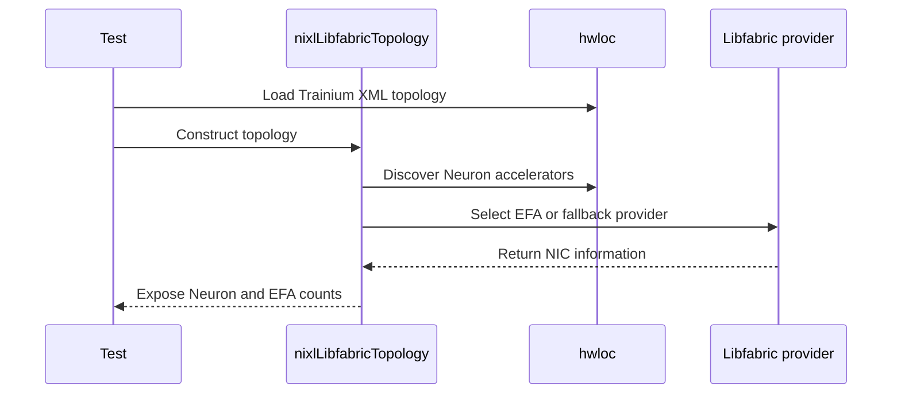

# [PR #1994] libfabric: preflight-check Neuron accelerator vs EFA NIC count

source: https://github.com/ai-dynamo/nixl/pull/1994
state: closed | updated: 2026-09-23T05:44:28Z
labels: external-contribution, size/XXL

## 正文

## What?

Adds a preflight check in `nixlLibfabricTopology::discoverTopology()` that emits an actionable log line at plugin init when the discovered Neuron accelerator count doesn't match the discovered EFA NIC count. The check distinguishes two failure modes:

1. **Wrong instance type** — e.g. `trn2.3xlarge` (4 Neuron devices, 1 host-level EFA, no per-Neuron-device EFA). Not supported for `FI_HMEM_NEURON` memory registration in hardware.
2. **Instance launched without EFA NICs** — e.g. default `aws ec2 run-instances` on `trn2.48xlarge` attaches only 1 ENA NIC, not the 16 EFA-typed NICs the plugin needs. User must attach EFA NICs explicitly via `--network-interfaces InterfaceType=efa` per `NetworkCardIndex`.

Also adds an "AWS Neuron (Trainium) requirements" section to `src/plugins/libfabric/README.md` with an instance-type table and an example `--network-interfaces` launch spec.

## Why?

The libfabric plugin's Neuron support (PR #1258) requires one EFA NIC per Neuron device to route `FI_HMEM_NEURON` memory registrations via peer-direct RDMA. Currently, when the Neuron/EFA topology doesn't satisfy this, both failure modes above surface as a mysterious `fi_mr_reg -EINVAL` deep inside `registerMem()`, which is hard to trace back to root cause without reading NIXL/EFA/libfabric source.

The Neuron support works cleanly on `trn2.48xlarge` with all 16 EFA NICs attached, but users on other Neuron instance types (or who forgot the launch-time EFA config) currently have no early warning that their configuration cannot support VRAM_SEG transfers.

This patch turns the mysterious deep-stack failure into a clear log line at plugin init time with actionable guidance ("wrong instance type" vs "instance launched without EFA NICs").

## How?

Adds ~48 lines in `nixlLibfabricTopology::discoverTopology()`, after `buildNicInfoMap()` populates `nic_info_map`. The check is gated on `num_aws_accel > 0 && num_nvidia_accel == 0` so it only fires on Neuron-only systems (no impact on CUDA or CUDA+Neuron hybrids).

Four cases:

- `efa_nic_count == 0` → `NIXL_WARN` recommending `--network-interfaces InterfaceType=efa` or noting unsupported instance types
- `0 < efa_nic_count < num_aws_accel` → `NIXL_WARN` distinguishing `trn2.3xlarge`-style (no per-device EFA in hardware) from partial-EFA-launch case
- `efa_nic_count > num_aws_accel && efa_nic_count % num_aws_accel != 0` → `NIXL_WARN` "not multiple, sub-optimal rail selection"
- Otherwise → `NIXL_INFO` one-line topology summary

Uses `NIXL_WARN` for mismatches (never `NIXL_ERROR` or `throw`, matching the existing sanity-check style for NVIDIA GPUs on P5en and for non-uniform NUMA / NIC bandwidth in the same file). No new API surface, no behavior change — mismatched configurations still fail at `fi_mr_reg` as before; this patch only adds a clearer diagnostic upstream of that failure.

## Testing

Tested on `trn2.48xlarge` (us-east-2) launched with 16 EFA NICs via `--network-interfaces InterfaceType=efa` for each `NetworkCardIndex` 0-15.

Built NIXL from source (`meson setup build -Denable_plugins=LIBFABRIC -Dlibfabric_path=/opt/amazon/efa` + `ninja -C build`) and ran the shipped `examples/cpp/nixl_example LIBFABRIC`, capturing NIXL logs at INFO level.

**Positive test (real 16 EFA / 16 Neuron):**

```
$ ls /sys/class/infiniband/ | wc -l   # 16
$ lspci | grep -c 'Elastic Fabric'    # 16
$ neuron-ls -j | jq length            # 16

I libfabric_topology.cpp:188] Discovered 16 EFA devices
I libfabric_topology.cpp:145] Neuron/EFA preflight: 16 Neuron device(s), 16 EFA NIC(s) (1 NIC(s) per Neuron device)
I libfabric_topology.cpp:308] Topology: 2 NUMA nodes, 16 NICs, 0 NVIDIA GPUs, 16 AWS accelerators
```

**Negative branches** — validated via a temporary test-only override honoring `NIXL_TEST_FORCE_AWS_ACCEL` env var, rebuilt, ran all cases, then removed the override before committing:

| Case | num_aws_accel (forced) | efa_nic_count | Expected branch | Result |
|------|------------------------|---------------|-----------------|--------|
| Positive (no override) | 16 | 16 | `NIXL_INFO` "1 NIC(s) per Neuron device" | ✅ PASS |
| Fewer EFA than Neuron | 32 | 16 | `NIXL_WARN` "trn2.3xlarge / launch config" | ✅ PASS |
| No Neurons (gated out) | 0 | 16 | correctly silent | ✅ PASS |
| Even multiple (2:1) | 8 | 16 | `NIXL_INFO` "2 NIC(s) per Neuron device" | ✅ PASS |
| Non-integer ratio | 5 | 16 | `NIXL_WARN` "not multiple, sub-optimal" | ✅ PASS |
| Much fewer EFA | 100 | 16 | `NIXL_WARN` "trn2.3xlarge / launch config" | ✅ PASS |

Cannot include automated CI tests: the topology-discovery path requires real hwloc + libfabric + EFA driver interaction that the existing `libfabric_topology_test.cpp` (a plain `main()` smoke test) doesn't mock. This matches the precedent from PR #1258, which merged the original Neuron support without a Neuron-specific gtest.

## Pre-submission checks

- [x] Code follows style guidelines (`.clang-format` applied; verified with `clang-format-19` matching CI)
- [x] Follows conventions in `docs/CodeStyle.md`
- [x] Existing tests pass (no test changes)
- [ ] New tests added for new functionality — see note above; no clean gtest possible without hwloc/libfabric mocking. Happy to add one if reviewers point at a suitable mocking pattern.
- [x] Documentation updated (`src/plugins/libfabric/README.md`)
- [x] PR template filled out completely
- [x] Commits are signed with DCO


<!-- This is an auto-generated comment: release notes by coderabbit.ai -->
## Summary by CodeRabbit

* **Documentation**
  * Added AWS Neuron (Trainium) requirements and troubleshooting guidance for Libfabric `FI_HMEM_NEURON`, including EFA NIC compatibility, launch configuration examples, and instance verification steps.
* **Bug Fixes**
  * Improved Neuron/EFA startup diagnostics with preflight warnings for missing, insufficient, or ratio-mismatched EFA NICs.
  * Added clearer warnings when Neuron is present but a non-EFA provider is selected (no `FI_HMEM_NEURON` memory registration).
  * Accelerator discovery now occurs earlier to improve reliability during provider fallback.
* **Tests**
  * Expanded Trainium topology unit tests with new hwloc fixtures for EFA and no-EFA scenarios and Neuron-specific validation.
<!-- end of auto-generated comment: release notes by coderabbit.ai -->

## 评论 (20)

### copy-pr-bot[bot] · 2026-07-26

This pull request requires additional validation before any workflows can run on NVIDIA's runners.

Pull request vetters can view their responsibilities [here](https://docs.gha-runners.nvidia.com/cpr/vetters).

Contributors can view more details about this message [here](https://docs.gha-runners.nvidia.com/cpr/contributors).


### github-actions[bot] · 2026-07-26

👋 Hi jimburtoft! Thank you for contributing to ai-dynamo/nixl.

Your PR reviewers will review your contribution then trigger the CI to test your changes.

🚀

### coderabbitai[bot] · 2026-07-26

<!-- This is an auto-generated comment: summarize by coderabbit.ai -->
<!-- review_stack_entry_start -->

[](https://app.coderabbit.ai/change-stack/ai-dynamo/nixl/pull/1994?utm_source=github_walkthrough&utm_medium=github&utm_campaign=change_stack)

<!-- review_stack_entry_end -->
<!-- This is an auto-generated comment: review paused by coderabbit.ai -->

> [!NOTE]
> ## Reviews paused
> 
> It looks like this branch is under active development. To avoid overwhelming you with review comments due to an influx of new commits, CodeRabbit has automatically paused this review. You can configure this behavior by changing the `reviews.auto_review.auto_pause_after_reviewed_commits` setting.
> 
> Use the following commands to manage reviews:
> - `@coderabbitai resume` to resume automatic reviews.
> - `@coderabbitai review` to trigger a single review.
> 
> Use the checkboxes below for quick actions:
> - [ ] <!-- {"checkboxId": "7f6cc2e2-2e4e-497a-8c31-c9e4573e93d1"} --> ▶️ Resume reviews
> - [ ] <!-- {"checkboxId": "e9bb8d72-00e8-4f67-9cb2-caf3b22574fe"} --> 🔍 Trigger review

<!-- end of auto-generated comment: review paused by coderabbit.ai -->
<!-- walkthrough_start -->

<details>
<summary>📝 Walkthrough</summary>

## Walkthrough

The Libfabric plugin documents AWS Neuron and EFA requirements. Topology discovery now performs early accelerator detection, reports Neuron-to-EFA mismatches across providers, and adds Trainium topology tests with EFA and no-EFA hwloc fixtures.

### Changes

**Neuron EFA diagnostics**

|Layer / File(s)|Summary|
|---|---|
|**Neuron/EFA requirements and preflight diagnostics** <br> `src/plugins/libfabric/README.md`, `src/utils/libfabric/libfabric_topology.cpp`|Documents Trainium EFA NIC requirements, discovers accelerators before provider selection, and reports Neuron/EFA mismatches for EFA and fallback providers.|
|**Trainium topology test coverage** <br> `test/unit/utils/libfabric/libfabric_topology_test.cpp`|Adds Neuron topology metadata, filtered command-line execution, default test ordering, count validation, and missing-EFA failure checks.|
|**Trainium hwloc topology fixtures** <br> `test/unit/utils/libfabric/topo/trn2*.xml`|Adds EFA, no-EFA, CPU, NUMA, PCI, NeuronDevice, storage, and hwloc metadata for Trainium topology tests.|

**Estimated code review effort:** 3 (Moderate) | ~25 minutes

### Sequence Diagram(s)



**Possibly related PRs**

- [ai-dynamo/nixl#1416](https://github.com/ai-dynamo/nixl/pull/1416): Updates the shared Libfabric provider and topology-discovery flow used for PCIe device mapping and EFA NIC count computation.

**Suggested reviewers:** `aranadive`, `brminich`

</details>

<!-- walkthrough_end -->
<!-- pre_merge_checks_walkthrough_start -->

<details>
<summary>🚥 Pre-merge checks | ✅ 5</summary>

<details>
<summary>✅ Passed checks (5 passed)</summary>

|         Check name         | Status   | Explanation                                                                                                              |
| :------------------------: | :------- | :----------------------------------------------------------------------------------------------------------------------- |
|         Title check        | ✅ Passed | The title is concise and matches the main change: a libfabric preflight comparing Neuron accelerator and EFA NIC counts. |
|      Description check     | ✅ Passed | The description includes the required What, Why, and How sections and covers the main change clearly.                    |
|     Docstring Coverage     | ✅ Passed | No functions found in the changed files to evaluate docstring coverage. Skipping docstring coverage check.               |
|     Linked Issues check    | ✅ Passed | Check skipped because no linked issues were found for this pull request.                                                 |
| Out of Scope Changes check | ✅ Passed | Check skipped because no linked issues were found for this pull request.                                                 |

</details>

</details>

<!-- pre_merge_checks_walkthrough_end -->
<!-- finishing_touch_checkbox_start -->

<details>
<summary>✨ Finishing Touches</summary>

<details>
<summary>🧪 Generate unit tests (beta)</summary>

- [ ] <!-- {"checkboxId": "f47ac10b-58cc-4372-a567-0e02b2c3d479", "radioGroupId": "utg-output-choice-group-unknown_comment_id"} -->   Create PR with unit tests

</details>

</details>

<!-- finishing_touch_checkbox_end -->
<!-- tips_start -->

---


<sub>Comment `@coderabbitai help` to get the list of available commands.</sub>

<!-- tips_end -->

### oa-aws · 2026-07-27

Starting review. A general question about testing. Is it possible to reuse the hwloc mocking capabilities in libfabric_topology_test.cpp? It requires an input topology file (by running "lstopo-no-graphics --of xml" on the target instance type), and it can mock any instance type. This required though adding test cases for Neuron in the main function. You can add your own topology array and ingest it, as it is done for NUMA-aware rail selection topology tests. The actual way to really test it, is by adding a wrapper script that runs the test with varying instance type parameter, and verifying stdout shows the expected info/warn message.

### jimburtoft · 2026-07-27

Thanks for the review pointer -- reusing the existing hwloc-mocking framework was straightforward once I found it. Pushed [`06a06679`](https://github.com/jimburtoft/nixl/commit/06a06679):

1. **Neuron topology test coverage**. Added `test/unit/utils/libfabric/topo/trn2.48xl-topo.xml` (captured on a real trn2.48xlarge in us-east-2 via `lstopo-no-graphics --whole-io --of xml` -- the `--whole-io` flag turned out to be required to expose the `1d0f:7364` Neuron PCI devices, which hwloc filters out by default). Added a `NeuronTopologyInfo` array and `testNeuronTopology()` / `testNeuronTopologies()` functions patterned on the existing `TopologyInfo` / `testNumaDramTopology()`. Wired into `main()`:
   - Default suite now runs `testNeuronTopologies()` in addition to the existing DRAM_SEG tests.
   - Added a `neuron:<instance>` CLI arg pattern so a wrapper script can invoke a single-topology run without exercising the DRAM_SEG rail-selection tests (which don't apply to Neuron-only topologies).

2. **Coverage.** The new test verifies `getNumAwsAccel() == 16`, `getTotalNicCount() == 16`, `getNumNvidiaAccel() == 0` when loading the trn2.48xl XML. The preflight fires as part of `nixlLibfabricTopology()` construction; log output is verifiable externally (e.g. `libfabric_topology_test neuron:trn2.48xl 2>&1 | grep "Neuron/EFA preflight"`) which matches your "wrapper script grepping stdout" suggestion.

3. **All existing tests still pass.** Ran the full default suite locally on the trn2.48xlarge -- basic topology, new Neuron topology, and NUMA-aware DRAM_SEG rail selection across all 8 existing GPU instance-type XMLs. Clang-format-19 clean; copyright check clean.

Two things I did NOT do that might warrant a follow-up:

- **Negative-case XML** (Neuron devices present but 0 or fewer-than-expected EFA NICs -- e.g. trn2.3xlarge, or trn2.48xlarge launched without the 16 EFA NICs). Would need to capture the XML on those hardware configs, which is straightforward but I skipped for scope. Happy to add if you'd like coverage of the WARN branches specifically.
- **Wrapper script that greps stdout for expected messages.** The current test asserts the counts; the WARN/INFO message contents are still verified by hand. Could add a bash wrapper that runs the binary and greps stderr, though this shifts test infrastructure. Let me know if you'd like this in this PR or as a follow-up.


### oa-aws · 2026-07-27

I think negative XML test is important here. It would best if we can capture lstopo for all instances/cases added in code. The bash wrapper can be done separately. Also I think topo files should be sanitized (see Code Rabbit comment, and compare to existing topo files). Thanks.

### jimburtoft · 2026-07-27

Two follow-up test/analysis items I wanted to flag proactively:

**GPU (NVIDIA-only) instances -- code review + integrated test pass:** The preflight is gated on `num_aws_accel > 0 && num_nvidia_accel == 0`, so it stays silent on any pure NVIDIA host. On the full test suite run I did before pushing 06a06679, all 8 existing GPU topology XMLs (p3dn/p4d/p5/p5en/p6-b200/g5/g6/c5n) continued to pass with no new output from our patch. Confirmed by tracing:
- On p5.48xl: `discoverAccelWithHwloc()` produces `num_aws_accel=8` AND `num_nvidia_accel=8` (the counter increments for both vendor types -- likely a pre-existing naming quirk, not something my patch introduced). The gate `num_nvidia_accel == 0` is false, preflight is skipped.
- The rest of `discoverTopology()` proceeds to `buildAccelToEfaMapping()` for NVIDIA as before.

**Trn3 -- code review only (no hardware access in any region I have):** Trn3 isn't offered in the us-east/us-west/sa-east/ap-southeast-4 regions I can launch in, so I can't capture a Trn3 lstopo XML the way I did for trn2.48xl. Walking through the logic against Trn3's likely topology:
- `isNeuronAccel()` already covers TRN3 device IDs (`0x7564`, `0x7565`, per PR #1258).
- Assuming Trn3 exposes N Neuron devices through hwloc paired with N EFA NICs at launch, the preflight fires the `NIXL_INFO` "1 NIC(s) per Neuron device" summary.
- Assuming Trn3.48xlarge default `run-instances` also attaches only 1 ENA and requires explicit `InterfaceType=efa` per NIC (same as trn2.48xlarge), our WARN would fire with a message that already references "On Trn3 attach the count matching the instance size" -- actionable.

Two concerns for Trn3 specifically that a Trn3-having reviewer could confirm:

1. **`0x7564` vs `0x7565` PCI enumeration.** If Trn3 exposes each Neuron chip as **two** PCI functions (one at `0x7564` and one at `0x7565`), `discoverAccelWithHwloc()` would count `num_aws_accel = 2*N` while `efa_nic_count = N`, and our WARN would misleadingly say "fewer EFA than Neuron". If Trn3 exposes one PCI function per chip (either `0x7564` OR `0x7565`), no false positive. I don't have visibility into which. Would appreciate a check on real Trn3 hardware, or a comment from whoever added those device IDs on the intended semantics.

2. **Trn3-specific WARN wording.** The "fewer EFA than Neuron" WARN currently names trn2.3xlarge as the example of "smaller instance without per-device EFA". If there's a "trn3.3xlarge"-style small instance with a similar limitation, the message would still be informative but not maximally specific. Easy to update if Trn3 has such an instance -- just needs the name.

If either of those is a concern for the PR, happy to update the wording or the counter logic. Otherwise, I'd propose merging as-is and following up with Trn3-specific test data in a subsequent PR once someone with Trn3 access can capture the lstopo XML.


### jimburtoft · 2026-07-27

Pushed [`a55d20c`](https://github.com/jimburtoft/nixl/commit/a55d20c) with the remaining review items addressed:

**1. Sanitize the trn2.48xl-topo.xml fixture** ([oa-aws](https://github.com/ai-dynamo/nixl/pull/1994#issuecomment-5093365279) + [coderabbitai](https://github.com/ai-dynamo/nixl/pull/1994#discussion_r3658028893)). Removed all non-topology metadata to match the conventions of the existing `p5.48xl-topo.xml` and `p5en.48xl-topo.xml` sanitized fixtures. Specifically stripped:
- `HostName` (contained private IP)
- 16 `Address` fields (MAC addresses -- one per EFA NIC)
- 5 storage `SerialNumber` fields
- 16 `NodeGUID` fields
- `DMIBoardAssetTag`, `DMIProductName`, `DMISysVendor`, etc.
- `OSName`, `OSRelease`, `ProcessName`, `LinuxCgroup`

Verified: no EC2 instance IDs, no AWS account IDs, no volume IDs, no AMI/subnet/VPC/SG/ENI IDs, no ARNs, no private IPs, no MAC addresses, no serial numbers, no internal hostnames. The only 12-digit numbers remaining are legitimate NUMA `local_memory` byte counts.

**2. Negative-case XMLs** ([oa-aws](https://github.com/ai-dynamo/nixl/pull/1994#issuecomment-5093365279)):
- **`trn2.48xl-no-efa-topo.xml`**: captured on a trn2.48xlarge launched with the AWS default `run-instances` invocation (single ENA NIC, no `--network-interfaces InterfaceType=efa`). Reveals 16 Neuron devices, 0 EFA NICs via hwloc. Exercises the "0 EFA NIC(s)" WARN branch of the preflight for the "instance launched wrong" case.
- **`trn2.3xl-topo.xml`**: captured on a trn2.3xlarge (also default-launched, no EFA NIC attached). Reveals 1 Neuron device, 0 EFA NICs via hwloc. Same WARN branch but with a single Neuron device, closer to the "smaller instance without per-device EFA" wording.
- Both sanitized to the same standard as trn2.48xl-topo.xml.

**3. Test coverage for the 0-EFA case:**

The plugin's `nixlLibfabricTopology` constructor **throws** when no libfabric provider can be selected (which is what happens when hwloc discovers 0 EFA NICs). This is a fatal end-state -- the preflight WARN would fire upstream of it in production, before construction throws.

Extended `testNeuronTopology()` to expect this throw when `expected_nic_count == 0`, and to fail if the plugin silently accepts an unusable topology. Both new negative-case topologies now covered:

```
1. Testing Neuron topology for instance type trn2.48xl
   SUCCESS: Neuron topology trn2.48xl loaded (16 Neuron device(s), 16 EFA NIC(s))
2. Testing Neuron topology for instance type trn2.48xl-no-efa
   SUCCESS: Neuron topology trn2.48xl-no-efa correctly threw at topology-discovery
            time (0 EFA NICs); in production the preflight WARN would fire before
            the throw.
3. Testing Neuron topology for instance type trn2.3xl
   SUCCESS: Neuron topology trn2.3xl correctly threw at topology-discovery time
            (0 EFA NICs); in production the preflight WARN would fire before the throw.
```

All 8 existing GPU DRAM_SEG rail-selection tests still pass. Clang-format-19 clean; copyright check clean; hwloc parses all 3 XMLs without warnings.

**Follow-up not in this PR:**
- Bash wrapper that runs the binary once per instance-type XML and greps stderr for the specific preflight message contents. oa-aws mentioned this could be a separate change ("The bash wrapper can be done separately"). Happy to open a follow-up PR for that whenever you want it.
- Positive-case negative-XML: a "trn2.3xlarge WITH `InterfaceType=efa` attached" fixture (would trigger the INFO summary path on a small instance). Skipped because the capacity block slot was exhausted; not strictly needed for coverage since the 16 EFA / 16 Neuron case already exercises that branch.


### jimburtoft · 2026-07-27

Pushed [`b0c6479`](https://github.com/jimburtoft/nixl/commit/b0c6479) addressing the last outside-diff CodeRabbit finding: dropped `static` from the `dummy` `TopologyInfo` in `testNeuronTopology()` so it's freshly constructed per call. As you noted, `fi_getinfo` only reads `nic_line_speed` today, but the stale `instance_type` / `topo_file` / `nic_count` fields were a real correctness landmine.

Extended the `TestEnvGuard` destructor to reset `curr_topology = nullptr` alongside `clearTesting()` and `unsetenv("HWLOC_XMLFILE")`. C++ destructor order runs the guard before the stack-local `dummy` goes out of scope, so `curr_topology` never dangles.

Verified locally on trn2.48xlarge: full suite passes -- basic topology, all 3 Neuron topologies, all 8 GPU DRAM_SEG topologies. Clang-format-19 clean.

If there's anything else, let me know. Otherwise the PR is ready for another look from @oa-aws.


### jimburtoft · 2026-07-27

Trimmed the XML fixtures in [`82ef396`](https://github.com/jimburtoft/nixl/commit/82ef396) to match the sanitization level of the existing `p5.48xl-topo.xml` / `p5en.48xl-topo.xml` reference fixtures, which strip all CPU-hierarchy elements (`Core`, `PU`, `L1Cache`, `L2Cache`, `L3Cache`) and retain only the PCIe topology + NUMA node structure that the NIXL topology discovery actually reads.

Size delta:

| Fixture | Before | After | Change |
|---------|--------|-------|--------|
| `trn2.48xl-topo.xml` | 2491 lines | 1237 lines | **-50%** |
| `trn2.48xl-no-efa-topo.xml` | 2275 lines | 1021 lines | **-55%** |
| `trn2.3xl-topo.xml` | 373 lines | 292 lines | -22% |

Confirmed on a trn2.48xlarge that the full test suite continues to pass with the trimmed fixtures (basic topology, all 3 Neuron topologies, all 8 GPU DRAM_SEG rail-selection tests).

**On the `size/XXL` label**: the label comes from an external `pull-request-size` GitHub App with a `XXL >= 1000` default threshold. After trimming, the PR is 2929 additions total, which is still above 1000 -- so `size/XXL` is expected to stick. The XML fixtures are inherently the bulk of the diff; the actual code changes are:

- `src/utils/libfabric/libfabric_topology.cpp`: +78 lines (preflight logic)
- `src/plugins/libfabric/README.md`: +46 lines (AWS Neuron docs)
- `test/unit/utils/libfabric/libfabric_topology_test.cpp`: +255 lines (Neuron test harness + 3 test cases)

For NIXL's `check-pr-size` CI gate (which counts only modified files, excluding new fixture files), we're at 438 lines vs the 500-line threshold, so that gate passes.

I re-read `CONTRIBUTING.md` and don't see any additional requirements triggered by size beyond what the CI gate already enforces. Happy to split into smaller PRs (e.g., a fixture-only PR followed by a code+test PR) if you'd prefer that for reviewability, but each of the three fixture files is used exclusively by the tests added in this PR, so I think it makes sense to keep them together for review.


### jimburtoft · 2026-07-28

Force-pushed [`536c61b`](https://github.com/jimburtoft/nixl/commit/536c61b) to amend the extraction commit with a clang-format-19 reflow. The refactor moved the `NIXL_WARN` statements into new helper methods, which changed the indentation context enough that clang-format-19 wanted them re-broken across lines. Amended rather than added a follow-up commit since it's cosmetic and belongs with the extraction.

All 9 CI checks green:
- clang-format ✅
- copyright-checks ✅
- check-pr-size ✅
- pre-commit ✅
- python-checks (all 4) ✅
- CodeRabbit ✅

Mergeable, blocked only on maintainer approval.


### jimburtoft · 2026-07-30

Merged `origin/main` into the branch in [`189ba3a`](https://github.com/jimburtoft/nixl/commit/189ba3a) to resolve the conflict introduced by the CXI provider work (#1416) and the RDMA-device rename in libfabric_topology. Two conflict spots, both trivial:

1. In `discoverTopology()`, the EFA branch condition became `provider_name == "efa" || provider_name == "cxi"`. Kept our `neuronEfaPreflightForEfaProvider()` call in place. Since the preflight is already gated on `num_aws_accel > 0 && num_nvidia_accel == 0` AND Neuron devices don't coexist with CXI (Slingshot) interconnects, the preflight is effectively a no-op on CXI hosts. Also added an explicit `provider_name != "efa"` early-return inside the helper for defence-in-depth, and updated the docstring to note the CXI case.

2. In `discoverHwlocTopology()`, `discoverEfaDevicesWithHwloc()` was renamed to `discoverRDMADevicesWithHwloc()` on main. Took the rename and preserved my "discoverAccelWithHwloc() is intentionally NOT called here" comment.

Verified locally on trn2.48xlarge: full test suite passes (basic topology, all 3 Neuron topologies, all 8 GPU DRAM_SEG topologies). Clang-format-19 clean. All 9 CI checks green.

The 8-commit branch history is: 7 review-response commits + 1 merge from main. NIXL uses squash-merge, so this all collapses into a single commit on `main` at merge time. Let me know if you'd like me to squash locally into fewer commits before that (e.g., squash all commits into one) or if the current shape is fine.


### jimburtoft · 2026-07-30

Thanks for the trn1.32xlarge flag — you're right, that's a supported topology (16 Neuron / 8 EFA by design, 2 Neurons sharing each EFA) and our WARN would have misleadingly told users to switch to trn2.48xlarge.

Pushed [`8a053ca`](https://github.com/jimburtoft/nixl/commit/8a053ca):

1. **Rewrote the WARN body** to enumerate the three cases users can actually be in:
   - (1) trn1.32xlarge — 16 Neuron / 8 EFA is expected, plugin works, ignore the warning
   - (2) trn2.3xlarge (or a similar smaller Trn2 with only host-level EFA) — unsupported, use trn2.48xlarge
   - (3) trn2.48xlarge / Trn3 launched without all EFA NICs — misconfiguration, verify `--network-interfaces InterfaceType=efa` per NetworkCardIndex

2. **Added two new topology fixtures** captured on real hardware:
   - `trn1.32xl-topo.xml` — 16 Neuron / 8 EFA (the scenario you flagged)
   - `trn1.2xl-topo.xml` — 1 Neuron / 0 EFA (smallest Trn1, which does not support EFA per `describe-instance-types`)

3. **Verified the test suite runs on generic hardware** — built libfabric 2.7 from `ofiwg/libfabric` main on a plain c5.4xlarge (no Neuron / no EFA), ran the full suite: all 5 Neuron topologies (trn2.48xl, trn2.48xl-no-efa, trn2.3xl, trn1.32xl, trn1.2xl) and all 8 GPU DRAM_SEG topologies pass. The test infrastructure is fully portable and doesn't require Neuron hardware.

Left `NIXL_WARN` as the severity for the "fewer EFA than Neuron" case rather than `NIXL_INFO`. Rationale: trn2.3xlarge and partial-launch trn2.48xlarge are real misconfigurations that need attention, and downgrading the message would silence them. The trn1.32xlarge callout is prominent (case #1 in the message), so users on that instance can quickly identify and dismiss.

Test output on trn1.32xl fixture:
```
[TIMING] Testing Neuron topology for instance type trn1.32xl
[WARN]   Discovered 16 Neuron accelerator(s) but only 8 EFA NIC(s) with usable PCIe topology.
         Three cases: (1) trn1.32xlarge has 16 Neuron devices and 8 EFA NICs by design
         (2 Neurons share each EFA); if this is trn1.32xlarge, the plugin works and this
         warning can be ignored. (2) trn2.3xlarge...
[INFO]   SUCCESS: Neuron topology trn1.32xl loaded (16 Neuron device(s), 8 EFA NIC(s))
```


### oa-aws · 2026-08-18

Hi Jim, after some delay, I am getting back to this. Will try to have another person join the review.

### jimburtoft · 2026-08-21

Thanks @oa-aws, and thanks @rongbingzhou for the review and approval. Fixed the trn2.3xlarge device-count typo in [`6758b07`](https://github.com/jimburtoft/nixl/commit/6758b07) (was 4, should have been 1 -- the confusion was between the single Trainium2 chip and its 4 logical cores at LNC=2, the default). Ready for another look whenever convenient.

### jimburtoft · 2026-08-21

While fixing the `trn2.3xlarge` device count, @jburtoft asked whether the preflight would behave differently under `NEURON_LOGICAL_NC_CONFIG=1` (LNC=1), since a Trainium2 chip presents 8 logical cores at LNC=1 versus 4 at LNC=2 (the default). Verified empirically on a real trn2.3xlarge (ap-southeast-4c) -- **the preflight is LNC-invariant**, because it counts PCI devices rather than cores.

**1. `neuron-ls` core count changes, device count does not:**

| `NEURON_LOGICAL_NC_CONFIG` | NEURON DEVICE | NEURON CORES | CORE IDS | PCI BDF |
|--|--|--|--|--|
| `1` | 0 | **8** | 0-7 | `0000:33:00.0` |
| `2` (default) | 0 | **4** | 0-3 | `0000:33:00.0` |

Same single device, same BDF; only the logical-core partitioning differs.

**2. hwloc PCI enumeration is byte-identical:**

```
LNC=1: Neuron PCI devices = 1, EFA PCI devices = 0
LNC=2: Neuron PCI devices = 1, EFA PCI devices = 0

$ diff <(NEURON_LOGICAL_NC_CONFIG=1 lstopo-no-graphics --whole-io --of xml) \
       <(NEURON_LOGICAL_NC_CONFIG=2 lstopo-no-graphics --whole-io --of xml)
(no output -- byte-for-byte identical)
```

This is expected: hwloc reads `/sys/bus/pci/devices/`, populated by the kernel from PCI config space at boot. `NEURON_LOGICAL_NC_CONFIG` is read by `libnrt` at `nrt_init()` and only affects how the Neuron runtime partitions cores *within* each chip -- it never re-enumerates PCI.

**3. The preflight itself produces identical output under both settings.** Built this branch on the trn2.3xlarge and ran the topology test with the trn2.48xl fixture under both LNC values:

```
NEURON_LOGICAL_NC_CONFIG=1 → Neuron/EFA preflight: 16 Neuron device(s), 16 EFA NIC(s) (1 NIC(s) per Neuron device)
NEURON_LOGICAL_NC_CONFIG=2 → Neuron/EFA preflight: 16 Neuron device(s), 16 EFA NIC(s) (1 NIC(s) per Neuron device)
```

Full suite under both: 148 SUCCESS, 0 ERROR/FAIL, exit 0.

So `num_aws_accel` is always the physical Neuron **chip** count, and the ratio the preflight compares against the EFA NIC count is unaffected by LNC mode. No LNC-specific handling is needed in this patch.


### aranadive · 2026-09-22

/ok to test ac1a452

### aranadive · 2026-09-22

/build

### svc-nixl · 2026-09-22

🤖 **CI Triage Agent** — `nixl-ci-non-gpu` · commit `ac1a452a`

**TL;DR:** The `Test Python` stage of one parallel variant (ubuntu22/py3.10, aarch64) failed because `test_tcpstore_metadata_exchange` could not bring up a PyTorch `TCPStore` on the CI-assigned fixed port `127.0.0.1:10507` within its 5 s timeout; the same test on the same port passed in the other five variants and in build #3140, so this is an environment/port-allocation flake in the test harness, not a defect in the commit under test — fix it by letting the kernel pick the port (`port=0`) and raising/retrying the connect timeout.

<details><summary>Full analysis</summary>

**Summary:** `pytest -s test/python` failed with `torch.distributed.DistNetworkError: The client socket has timed out after 5000ms while trying to connect to (127.0.0.1, 10507)` in `test/python/test_tcpstore_metadata.py::test_tcpstore_metadata_exchange` (1 failed, 24 passed, 3 skipped); all other stages/variants passed.

**Root cause:** The test constructs `dist.TCPStore(host_name="127.0.0.1", port=int(os.environ["NIXL_TCPSTORE_PORT"]), is_master=True, timeout=5s)`. The port comes from `get_next_tcp_port()` in `.ci/scripts/common.sh`, which:
- derives its slot from `CI_CONCURRENT_ID`/`EXECUTOR_NUMBER`, which is `0` in **every** parallel variant (both the failing log at 19:08:56 and the passing variant log at 19:09:36 print `nixl_concurrent_id=0` and hand out the *same* port `10507`), so the port range is not actually private per concurrent job; and
- validates availability with a racy `ss -tuln | grep -q :$next_port` check performed seconds before pytest actually binds it (TOCTOU window: check at 19:08:56, bind attempt at 19:09:00).

With the port already taken / the loopback SYN being dropped, the client half of the in-process `TCPStore` never completed its connect and the 5 s deadline expired (`socket.cpp:1028` → `TCPStore.cpp:328`). Supporting evidence that this is environmental, not code: the identical test on the identical port completed in 0.25 s in the sibling variant, build #3140 passed this stage in all six variants, and the commit under test (`ac1a452`, libfabric/Neuron EFA preflight) cannot influence `torch.distributed.TCPStore`. The log shows continuous activity with no multi-minute gaps, so nothing hung.

**Implicated commit:** `aed5ef2e` — "test: add Python TCPStore metadata integration (#2148)", aschwartz12 (introduced both the test and the `NIXL_TCPSTORE_PORT` plumbing). Not the commit that triggered this build.

**File:** `test/python/test_tcpstore_metadata.py:21-28` (and `.ci/scripts/common.sh:30,38-61`, `.gitlab/test_python.sh:70-71`)

**Suggested fix:**
1. Stop pinning the port in the test — the test already derives the endpoint from `tcp_store.port`, so the fixed CI port buys nothing:
   ```python
   tcp_store = dist.TCPStore(host_name="127.0.0.1", port=0, world_size=None,
                             is_master=True, timeout=timedelta(seconds=30),
                             wait_for_workers=False)
   ```
   and drop `NIXL_TCPSTORE_PORT=$(get_next_tcp_port)` from `.gitlab/test_python.sh`. Optionally retry store creation a couple of times before failing.
2. Harden the allocator: make `nixl_concurrent_id` genuinely unique per container (e.g. hash of `$HOSTNAME`/`$NODE_NAME` when `CI_CONCURRENT_ID`/`EXECUTOR_NUMBER` are absent or 0) so concurrent variants don't share the 10500–10650 range, and treat the `ss` check as advisory only.
3. Re-run build #3141 to confirm the flake; no code change is needed for the branch under test.

**Related:** PR #2148 (added the TCPStore test); triggering PR #1994. No existing issue tracking this flake was found.

</details>

<!-- triage-agent request_id: f04b7636-c31a-4f9b-92b1-b400ab03b01b -->
<!-- triage-agent gha_run_id: status:SC_kwDOODt2nc8AAAAMvCEnXQ -->
<!-- triage-agent-bot -->

### svc-nixl · 2026-09-22

🤖 **CI Triage Agent** — `nixl-ci-build-container-pr` · commit `ac1a452a`

**TL;DR:** One of the four parallel container builds died at `contrib/Dockerfile` step 20 because `git clone https://github.com/Azure/azure-sdk-for-cpp.git` was refused by GitHub and git fell back to an interactive credential prompt (`could not read Username ... No such device or address`, exit 128) — a transient anonymous-clone failure unrelated to the PR; the durable fix is to make the Dockerfile's git clones retry and never prompt.

<details><summary>Full analysis</summary>

**Summary:** Stage "Build image" (node 219) of `nixl-ci-build-container-pr` #747 failed at `STEP 20/53` with `Error: building at STEP "RUN git clone --depth 1 https://github.com/Azure/azure-sdk-for-cpp.git ...": exit status 128`.

**Root cause:** The clone of the Azure C++ SDK failed with `fatal: could not read Username for 'https://github.com': No such device or address` / `fatal: expected flush after ref listing`. GitHub rejected the unauthenticated ref-listing request (rate limit / transient refusal), so git tried to prompt for credentials; inside the build container there is no tty, so git aborted with status 128 and podman failed the layer. This is environmental, not a code defect:
- The immediately preceding steps in the *same* build cloned abseil, gRPC, etcd-cpp-apiv3, aws-sdk-cpp and gusli from github.com successfully, and the AWS SDK finished compiling and installing at 19:30:08 — network and DNS were working.
- The other three parallel `Build image` stages (nodes 174, 211, 233) all succeeded on the same commit, so nothing in `ac1a452` (branch `libfabric-neuron-efa-preflight`, PR #1994) is implicated — that branch's changes concern libfabric/EFA, not this layer.
- The log shows continuous activity right up to the failure (clone starts 19:30:43.850, fails 19:30:44.420), so this is a hard error, not a hang or timeout.

**Implicated commit:** unknown — not a code regression; the failing `RUN` line has been present since at least e6fb7714 (Adit Ranadive, "build: enable cuObject S3 acceleration…") and was not touched by the PR under test.

**File:** contrib/Dockerfile:218 (also applies to the unguarded clones at lines 161, 178, 201, 208, 213)

**Suggested fix:**
1. Immediate: re-run build #747 — this is a transient GitHub-side refusal and should pass on retry.
2. Durable: make the clones fail loudly instead of hanging on a credential prompt, and retry them. E.g. set `ENV GIT_TERMINAL_PROMPT=0` (and `GIT_ASKPASS=/bin/true`) once near the top of the build stage, and wrap each third-party clone in a retry, e.g.
   ```
   RUN for i in 1 2 3 4 5; do \
         git clone --depth 1 https://github.com/Azure/azure-sdk-for-cpp.git \
           --branch azure-storage-blobs_12.15.0 && break || sleep $((i*10)); \
       done && [ -d azure-sdk-for-cpp ] && ...
   ```
   The same pattern already exists for the DOCA download at line 135 (`wget --tries=3 --waitretry=5`), so the retry policy should be applied consistently to the six github.com clones. Better still, mirror these pinned third-party sources internally (as was done for the Ubuntu mirror in #1961) so PR container builds don't depend on unauthenticated github.com availability.

**Related:** PR #1994 (build under test, not the cause); #1961 "CI: Switch to the NVIDIA internal Ubuntu mirror" — same class of fix (removing dependence on external package/source hosts). No existing issue tracking flaky third-party git clones in `contrib/Dockerfile`; worth filing one.

</details>

<!-- triage-agent request_id: 613196ba-3976-483f-9ab8-3b047680ddec -->
<!-- triage-agent gha_run_id: status:SC_kwDOODt2nc8AAAAMvECCMg -->
<!-- triage-agent-bot -->

## Review (27)

### coderabbitai[bot] · 2026-07-26 · COMMENTED

**Actionable comments posted: 2**

<details>
<summary>🤖 Prompt for all review comments with AI agents</summary>

```
Verify each finding against current code. Fix only still-valid issues, skip the
rest with a brief reason, keep changes minimal, and validate.

Inline comments:
In `@src/plugins/libfabric/README.md`:
- Around line 50-65: Update the “Launching trn2.48xlarge with all EFA NICs”
example so it is not presented as valid --cli-input-json while containing an
ellipsis. Either list all 16 network-interface entries, or label the snippet as
illustrative pseudo-JSON and provide a generator or template for producing the
complete payload.

In `@src/utils/libfabric/libfabric_topology.cpp`:
- Around line 103-112: The Neuron/EFA mismatch warning currently runs after
provider fallback can clear num_aws_accel, preventing diagnostics when EFA is
missing. Update getAvailableNetworkDevices() to evaluate the num_aws_accel > 0
&& num_nvidia_accel == 0 preflight before switching to tcp/sockets, or preserve
the accelerator counts through fallback so the warning still fires.
```

</details>

<details>
<summary>🪄 Autofix (Beta)</summary>

Fix all unresolved CodeRabbit comments on this PR:

- [ ] <!-- {"checkboxId": "4b0d0e0a-96d7-4f10-b296-3a18ea78f0b9"} --> Push a commit to this branch (recommended)
- [ ] <!-- {"checkboxId": "ff5b1114-7d8c-49e6-8ac1-43f82af23a33"} --> Create a new PR with the fixes

</details>

---

<details>
<summary>ℹ️ Review info</summary>

<details>
<summary>⚙️ Run configuration</summary>

**Configuration used**: Path: .coderabbit.yaml

**Review profile**: ASSERTIVE

**Plan**: Enterprise

**Run ID**: `78601c8d-66bc-4305-a3b0-77b20a9d415e`

</details>

<details>
<summary>📥 Commits</summary>

Reviewing files that changed from the base of the PR and between cdb42525c7be1ce57ae6c6fd6e836703df2400d2 and 28e0af86da5ae284504c1310763efce52978cf25.

</details>

<details>
<summary>📒 Files selected for processing (2)</summary>

* `src/plugins/libfabric/README.md`
* `src/utils/libfabric/libfabric_topology.cpp`

</details>

</details>

<!-- This is an auto-generated comment by CodeRabbit for review status -->

### jimburtoft · 2026-07-27 · COMMENTED

(no text)

### jimburtoft · 2026-07-27 · COMMENTED

(no text)

### coderabbitai[bot] · 2026-07-27 · COMMENTED

(no text)

### coderabbitai[bot] · 2026-07-27 · COMMENTED

(no text)

### coderabbitai[bot] · 2026-07-27 · COMMENTED

**Actionable comments posted: 1**

<details>
<summary>🤖 Prompt for all review comments with AI agents</summary>

```
Verify each finding against current code. Fix only still-valid issues, skip the
rest with a brief reason, keep changes minimal, and validate.

Inline comments:
In `@test/unit/utils/libfabric/topo/trn2.48xl-topo.xml`:
- Around line 20-40: Sanitize the libfabric topology fixture’s non-topology
metadata by replacing the EC2 instance ID, private hostname/IP, storage serials,
and NIC identifiers throughout the file with synthetic values. Preserve all
topology and hardware-relationship data, including CPU, node, and device
structure, while updating only captured infrastructure identifiers.
```

</details>

<details>
<summary>🪄 Autofix (Beta)</summary>

Fix all unresolved CodeRabbit comments on this PR:

- [ ] <!-- {"checkboxId": "4b0d0e0a-96d7-4f10-b296-3a18ea78f0b9"} --> Push a commit to this branch (recommended)
- [ ] <!-- {"checkboxId": "ff5b1114-7d8c-49e6-8ac1-43f82af23a33"} --> Create a new PR with the fixes

</details>

---

<details>
<summary>ℹ️ Review info</summary>

<details>
<summary>⚙️ Run configuration</summary>

**Configuration used**: Path: .coderabbit.yaml

**Review profile**: ASSERTIVE

**Plan**: Enterprise

**Run ID**: `69343c70-24d3-4318-bfe2-e487d487698e`

</details>

<details>
<summary>📥 Commits</summary>

Reviewing files that changed from the base of the PR and between 28e0af86da5ae284504c1310763efce52978cf25 and 06a06679a3e01a6e2c4d1a79f0a520c5cd9c65ec.

</details>

<details>
<summary>📒 Files selected for processing (4)</summary>

* `src/plugins/libfabric/README.md`
* `src/utils/libfabric/libfabric_topology.cpp`
* `test/unit/utils/libfabric/libfabric_topology_test.cpp`
* `test/unit/utils/libfabric/topo/trn2.48xl-topo.xml`

</details>

</details>

<!-- This is an auto-generated comment by CodeRabbit for review status -->

### jimburtoft · 2026-07-27 · COMMENTED

(no text)

### coderabbitai[bot] · 2026-07-27 · COMMENTED

(no text)

### coderabbitai[bot] · 2026-07-27 · COMMENTED

**Actionable comments posted: 2**

<details>
<summary>🤖 Prompt for all review comments with AI agents</summary>

```
Verify each finding against current code. Fix only still-valid issues, skip the
rest with a brief reason, keep changes minimal, and validate.

Inline comments:
In `@test/unit/utils/libfabric/libfabric_topology_test.cpp`:
- Around line 909-927: The zero-NIC test branch never validates
expected_num_aws_accel, leaving Neuron fixture data untested. Update the
expected_nic_count == 0 handling around nixlLibfabricTopology to independently
invoke the existing accelerator-discovery path and assert the discovered count
matches expected_num_aws_accel, or explicitly mark that field unused for those
topology fixtures if discovery cannot run before construction.
- Around line 928-963: Protect the environment cleanup in testNeuronTopology
with an immediately active scope guard so clearTesting() and
unsetenv("HWLOC_XMLFILE") run on every exit path, including exceptions, then
remove the redundant trailing cleanup calls. In the positive topology-validation
branch, catch constructor/discovery exceptions from nixlLibfabricTopology,
report them as a test failure, and preserve normal validation behavior when
construction succeeds.
```

</details>

<details>
<summary>🪄 Autofix (Beta)</summary>

Fix all unresolved CodeRabbit comments on this PR:

- [ ] <!-- {"checkboxId": "4b0d0e0a-96d7-4f10-b296-3a18ea78f0b9"} --> Push a commit to this branch (recommended)
- [ ] <!-- {"checkboxId": "ff5b1114-7d8c-49e6-8ac1-43f82af23a33"} --> Create a new PR with the fixes

</details>

---

<details>
<summary>ℹ️ Review info</summary>

<details>
<summary>⚙️ Run configuration</summary>

**Configuration used**: Path: .coderabbit.yaml

**Review profile**: ASSERTIVE

**Plan**: Enterprise

**Run ID**: `bb520d63-d547-45b6-ab61-b23fe83ece4d`

</details>

<details>
<summary>📥 Commits</summary>

Reviewing files that changed from the base of the PR and between 06a06679a3e01a6e2c4d1a79f0a520c5cd9c65ec and a55d20cf7f262370e70786d92458d8da805ea19f.

</details>

<details>
<summary>📒 Files selected for processing (4)</summary>

* `test/unit/utils/libfabric/libfabric_topology_test.cpp`
* `test/unit/utils/libfabric/topo/trn2.3xl-topo.xml`
* `test/unit/utils/libfabric/topo/trn2.48xl-no-efa-topo.xml`
* `test/unit/utils/libfabric/topo/trn2.48xl-topo.xml`

</details>

<details>
<summary>💤 Files with no reviewable changes (1)</summary>

* test/unit/utils/libfabric/topo/trn2.48xl-topo.xml

</details>

</details>

<!-- This is an auto-generated comment by CodeRabbit for review status -->

### jimburtoft · 2026-07-27 · COMMENTED

(no text)

### jimburtoft · 2026-07-27 · COMMENTED

(no text)

### coderabbitai[bot] · 2026-07-27 · COMMENTED

(no text)

### coderabbitai[bot] · 2026-07-27 · COMMENTED

(no text)

### coderabbitai[bot] · 2026-07-27 · COMMENTED


> [!CAUTION]
> Some comments are outside the diff and can’t be posted inline due to platform limitations.
> 
> 
> 
> <details>
> <summary>⚠️ Outside diff range comments (1)</summary><blockquote>
> 
> <details>
> <summary>test/unit/utils/libfabric/libfabric_topology_test.cpp (1)</summary><blockquote>
> 
> `886-898`: _🎯 Functional Correctness_ | _🔵 Trivial_ | _💤 Low value_
> 
> **Drop `static` from `dummy`**
> `dummy` captures `instance_type`/`topo_file`/`nic_count` from the first Neuron case and reuses them across later calls. `fi_getinfo` only reads `nic_line_speed` today, so a non-static local keeps the test data aligned with each topology.
> 
> <details>
> <summary>🤖 Prompt for AI Agents</summary>
> 
> ```
> Verify each finding against current code. Fix only still-valid issues, skip the
> rest with a brief reason, keep changes minimal, and validate.
> 
> In `@test/unit/utils/libfabric/libfabric_topology_test.cpp` around lines 886 -
> 898, Remove the static storage duration from the dummy TopologyInfo declaration
> in the test setup so a fresh object is created on each call. Keep its field
> initialization and curr_topology assignment unchanged, allowing instance_type,
> topo_file, and nic_count to reflect the current topology case.
> ```
> 
> </details>
> 
> <!-- cr-comment:v1:e0a8d1ac2b3a169ddaaceb56 -->
> 
> </blockquote></details>
> 
> </blockquote></details>

<details>
<summary>🤖 Prompt for all review comments with AI agents</summary>

```
Verify each finding against current code. Fix only still-valid issues, skip the
rest with a brief reason, keep changes minimal, and validate.

Outside diff comments:
In `@test/unit/utils/libfabric/libfabric_topology_test.cpp`:
- Around line 886-898: Remove the static storage duration from the dummy
TopologyInfo declaration in the test setup so a fresh object is created on each
call. Keep its field initialization and curr_topology assignment unchanged,
allowing instance_type, topo_file, and nic_count to reflect the current topology
case.
```

</details>

---

<details>
<summary>ℹ️ Review info</summary>

<details>
<summary>⚙️ Run configuration</summary>

**Configuration used**: Path: .coderabbit.yaml

**Review profile**: ASSERTIVE

**Plan**: Enterprise

**Run ID**: `99b51e12-44df-415f-ab93-0905d213f096`

</details>

<details>
<summary>📥 Commits</summary>

Reviewing files that changed from the base of the PR and between a55d20cf7f262370e70786d92458d8da805ea19f and 13cace3841e121fce46b230010ad1a4fc961083e.

</details>

<details>
<summary>📒 Files selected for processing (1)</summary>

* `test/unit/utils/libfabric/libfabric_topology_test.cpp`

</details>

</details>

<!-- This is an auto-generated comment by CodeRabbit for review status -->

### coderabbitai[bot] · 2026-07-27 · COMMENTED


> [!CAUTION]
> Some comments are outside the diff and can’t be posted inline due to platform limitations.
> 
> 
> 
> <details>
> <summary>⚠️ Outside diff range comments (1)</summary><blockquote>
> 
> <details>
> <summary>test/unit/utils/libfabric/libfabric_topology_test.cpp (1)</summary><blockquote>
> 
> `925-946`: _🎯 Functional Correctness_ | _🟡 Minor_ | _⚡ Quick win_
> 
> **Do not claim this case exercises the preflight warning.**
> 
> This branch expects `discoverProviderWithDevices()` to fail, but `discoverTopology()` returns before the EFA `nic_info_map` preflight in that path. Remove the “WARN would fire before the throw” claims; add a separate EFA-provider/zero-usable-NIC mock if diagnostic coverage is required.
> 
> Based on the supplied upstream topology-discovery flow, provider discovery precedes the Neuron/EFA preflight.
> 
> <details>
> <summary>🤖 Prompt for AI Agents</summary>
> 
> ```
> Verify each finding against current code. Fix only still-valid issues, skip the
> rest with a brief reason, keep changes minimal, and validate.
> 
> In `@test/unit/utils/libfabric/libfabric_topology_test.cpp` around lines 925 -
> 946, Remove the comments and log text in the expected_nic_count == 0 branch that
> claim the preflight WARN fires before the constructor throw. Keep the test
> focused on discoverProviderWithDevices() failing during topology discovery, and
> do not add a preflight assertion unless a separate EFA-provider mock with zero
> usable NICs is introduced.
> ```
> 
> </details>
> 
> <!-- cr-comment:v1:5a1a7f1470f18c4f4bcc0b20 -->
> 
> </blockquote></details>
> 
> </blockquote></details>

<details>
<summary>🤖 Prompt for all review comments with AI agents</summary>

```
Verify each finding against current code. Fix only still-valid issues, skip the
rest with a brief reason, keep changes minimal, and validate.

Outside diff comments:
In `@test/unit/utils/libfabric/libfabric_topology_test.cpp`:
- Around line 925-946: Remove the comments and log text in the
expected_nic_count == 0 branch that claim the preflight WARN fires before the
constructor throw. Keep the test focused on discoverProviderWithDevices()
failing during topology discovery, and do not add a preflight assertion unless a
separate EFA-provider mock with zero usable NICs is introduced.
```

</details>

---

<details>
<summary>ℹ️ Review info</summary>

<details>
<summary>⚙️ Run configuration</summary>

**Configuration used**: Path: .coderabbit.yaml

**Review profile**: ASSERTIVE

**Plan**: Enterprise

**Run ID**: `f556321e-cb5a-4072-a804-9abf880e5acb`

</details>

<details>
<summary>📥 Commits</summary>

Reviewing files that changed from the base of the PR and between 13cace3841e121fce46b230010ad1a4fc961083e and b0c64797f412d93ed859b79ee07bf57192c23ab5.

</details>

<details>
<summary>📒 Files selected for processing (1)</summary>

* `test/unit/utils/libfabric/libfabric_topology_test.cpp`

</details>

</details>

<!-- This is an auto-generated comment by CodeRabbit for review status -->

### oa-aws · 2026-07-28 · DISMISSED

(no text)

### jimburtoft · 2026-07-28 · COMMENTED

(no text)

### jimburtoft · 2026-07-28 · COMMENTED

(no text)

### jimburtoft · 2026-07-28 · COMMENTED

(no text)

### rongbingzhou · 2026-08-19 · DISMISSED

(no text)

### rongbingzhou · 2026-08-19 · COMMENTED

(no text)

### jimburtoft · 2026-08-21 · COMMENTED

(no text)

### rongbingzhou · 2026-08-25 · APPROVED

(no text)

### oa-aws · 2026-08-26 · DISMISSED

(no text)

### oa-aws · 2026-08-26 · COMMENTED

(no text)

### jimburtoft · 2026-08-26 · COMMENTED

(no text)

### oa-aws · 2026-08-27 · APPROVED

(no text)
