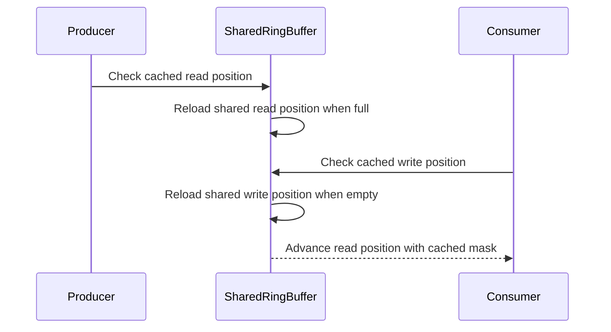

# [PR #2018] telemetry: optimize sharedRingBuffer and eliminate false sharing

source: https://github.com/ai-dynamo/nixl/pull/2018
state: open | updated: 2026-09-16T11:29:38Z
labels: external-contribution, size/L

## 正文

## What?

Currently sharedRingBuffer is an SPSC buffer, and already optimized for that with two atomics instead of locks. However the two atomics sit on the same cache line, so writing one invalidates the line on the other core. Also every push and pop reads the other side's position from shared memory, which pulls that core's cache line on every call. This is unnecessary in an SPSC buffer: since the producer and consumer each advance their position monotonically, a cached copy of the other side's position is safe to use. A stale value can only make the full/empty check conservative, never wrong.

Because the header layout changes, this also bumps TELEMETRY_VERSION from 4 to 5 and updates the tests and Python reader's struct to match. 

## Why?

The two indices sharing a cache line means every index update by one side invalidates the other side's line, and every push/pop re-reads the opposing index, adding a cross-core cache miss even when nothing changed. In NIXL as shipped the buffer is written only by the periodic flush task, so this cost is a negligible fraction of end-to-end time at current rates. The change removes the per-call coherence traffic at no cost to the current path, and the benefit grows if the buffer moves onto a hotter path (e.g., a higher flush rate or more frequent use).

## How?

We use alignas to make sure the two atomics are not on the same cache line. The alignment is conservatively hardcoded to 256, the value GCC uses for hardware_destructive_interference_size on ARM, instead of using the std constant directly, so the shared memory layout stays identical across compilers and build flags. The repeated reads of the opposing index are addressed with cached values that are only refreshed (with a load acquire) when the buffer appears full/empty. The caches are seeded on attach paths, the same change is applied to the Python example reader, and a new gtest covers a consumer re-attaching mid-stream.

The header fields are also ordered so version keeps byte offset 16 across layout versions, so a reader on a mismatched file always reads a real version field and fails with a clean mismatch.

## Results

To test the throughput improvement I send 200,000,000 16-byte events (same size as nixlTelemetryEvent) on a ring with 65536 entries from a pinned producer core to a pinned consumer core through the real sharedRingBuffer over /dev/shm. Latency is a two-ring ping-pong RTT, averaged over 1,000,000 round trips. All metrics are averaged over 3 runs on a multi-socket ARM server:

| Core pairing | Baseline M events/s | Optimized M events/s | Speedup | Baseline RTT (ns) | Optimized RTT (ns) | Speedup |
|---|---|---|---|---|---|---|
| same-socket | 11.9 | 51.9 | **4.4×** | 1022 | 555 | **1.8×** |
| cross-socket | 2.5 | 9.2 | **3.7×** | 4448 | 3353 | **1.3×** |

Note that this is a synthetic saturation microbenchmark studying the buffer's standalone behavior under pressure; it measures the buffer's ceiling, not an expected end-to-end win. I can include the benchmark and full logs as part of this PR if you'd like.

<!-- This is an auto-generated comment: release notes by coderabbit.ai -->
## Summary by CodeRabbit

## New Features
- Updated the telemetry shared-memory format to version 5.
- Improved ring-buffer alignment and stream-reading efficiency.
- Enabled readers to resume correctly when reconnecting to an active stream.

## Bug Fixes
- Fixed event handling when a reader reconnects while unread events remain.

## Documentation
- Documented the updated telemetry format, buffer layout, versioning, and field offsets.
- Clarified compatibility validation and handling for mismatched telemetry versions.
<!-- end of auto-generated comment: release notes by coderabbit.ai -->

## 评论 (26)

### copy-pr-bot[bot] · 2026-07-30

This pull request requires additional validation before any workflows can run on NVIDIA's runners.

Pull request vetters can view their responsibilities [here](https://docs.gha-runners.nvidia.com/cpr/vetters).

Contributors can view more details about this message [here](https://docs.gha-runners.nvidia.com/cpr/contributors).


### github-actions[bot] · 2026-07-30

👋 Hi pooriaPoorsarvi! Thank you for contributing to ai-dynamo/nixl.

Your PR reviewers will review your contribution then trigger the CI to test your changes.

🚀

### coderabbitai[bot] · 2026-07-30

<!-- This is an auto-generated comment: summarize by coderabbit.ai -->
<!-- review_stack_entry_start -->

[](https://app.coderabbit.ai/change-stack/ai-dynamo/nixl/pull/2018?utm_source=github_walkthrough&utm_medium=github&utm_campaign=change_stack)

<!-- review_stack_entry_end -->
<!-- recent_review_start -->

No actionable comments were generated in the recent review. 🎉

<details>
<summary>ℹ️ Recent review info</summary>

<details>
<summary>⚙️ Run configuration</summary>

**Configuration used**: Path: .coderabbit.yaml

**Review profile**: ASSERTIVE

**Plan**: Enterprise

**Run ID**: `faf087f3-aada-4b40-8e27-b2bcbd8b945d`

</details>

<details>
<summary>📥 Commits</summary>

Reviewing files that changed from the base of the PR and between 60276843105b28275e23d4eaba6b23fa0a0d2a71 and 62b500e479c4666e265def08d30c05d9d3cf971c.

</details>

<details>
<summary>📒 Files selected for processing (2)</summary>

* `docs/telemetry.md`
* `src/core/telemetry/telemetry_event.h`

</details>

</details>

---


<!-- recent_review_end -->
<!-- walkthrough_start -->

<details>
<summary>📝 Walkthrough</summary>

## Walkthrough

Telemetry version 5 defines a padded shared-memory header, updates the Python reader layout, and changes ring-buffer operations to use cached positions and masks. Tests cover consumer reattachment and the updated telemetry version contract.

### Changes

**Telemetry buffer version 5**

|Layer / File(s)|Summary|
|---|---|
|**Padded telemetry buffer layout** <br> `src/core/telemetry/telemetry_event.h`, `src/utils/common/cyclic_buffer.h`, `src/utils/common/cyclic_buffer.tpp`, `examples/python/telemetry_reader.py`, `docs/telemetry.md`|Telemetry version 5 uses a 512-byte padded header with 256-byte position alignment. C++ and Python layouts include compile-time or runtime validation. Documentation describes the updated format.|
|**Cached ring-buffer operations** <br> `src/utils/common/cyclic_buffer.h`, `src/utils/common/cyclic_buffer.tpp`, `examples/python/telemetry_reader.py`|Push and pop paths use cached positions and masks. Buffer creation, attachment, and Python mapping initialize the cached state.|
|**Telemetry reader reattachment validation** <br> `test/gtest/telemetry_test.cpp`|Tests verify that a reattached consumer reads the remaining event and that the telemetry version contract is 5.|

**Estimated code review effort:** 3 (Moderate) | ~20 minutes


**Possibly related PRs**

- [ai-dynamo/nixl#1951](https://github.com/ai-dynamo/nixl/pull/1951): Adds cyclic-ring and telemetry stress tests related to these changes.

**Suggested reviewers:** `colinnv`, `e-eygin`

### Sequence Diagram(s)



</details>

<!-- walkthrough_end -->
<!-- final_review_risk_start -->
**Mergeability Score:** _⚪ Minimal_ · up to `62b50`

The change is merge-ready after normal checks and review; no actionable merge-blocking risk remains.
<!-- final_review_risk_end -->
<!-- pre_merge_checks_walkthrough_start -->

<details>
<summary>🚥 Pre-merge checks | ✅ 4 | ❌ 1</summary>

### ❌ Failed checks (1 warning)

|     Check name     | Status     | Explanation                                                                           | Resolution                                                                         |
| :----------------: | :--------- | :------------------------------------------------------------------------------------ | :--------------------------------------------------------------------------------- |
| Docstring Coverage | ⚠️ Warning | Docstring coverage is 66.67% which is insufficient. The required threshold is 80.00%. | Write docstrings for the functions missing them to satisfy the coverage threshold. |

<details>
<summary>✅ Passed checks (4 passed)</summary>

|         Check name         | Status   | Explanation                                                                                                                                      |
| :------------------------: | :------- | :----------------------------------------------------------------------------------------------------------------------------------------------- |
|         Title check        | ✅ Passed | The title clearly and concisely describes the sharedRingBuffer optimization and false-sharing reduction.                                         |
|      Description check     | ✅ Passed | The description includes complete What, Why, and How sections, with implementation details, compatibility changes, tests, and benchmark context. |
|     Linked Issues check    | ✅ Passed | Check skipped because no linked issues were found for this pull request.                                                                         |
| Out of Scope Changes check | ✅ Passed | Check skipped because no linked issues were found for this pull request.                                                                         |

</details>

</details>

<!-- pre_merge_checks_walkthrough_end -->
<!-- finishing_touch_checkbox_start -->

<details>
<summary>✨ Finishing Touches</summary>

<details>
<summary>🧪 Generate unit tests (beta)</summary>

- [ ] <!-- {"checkboxId": "f47ac10b-58cc-4372-a567-0e02b2c3d479", "radioGroupId": "utg-output-choice-group-unknown_comment_id"} -->   Create PR with unit tests

</details>

</details>

<!-- finishing_touch_checkbox_end -->
<!-- tips_start -->

---


<sub>Comment `@coderabbitai help` to get the list of available commands.</sub>

<!-- tips_end -->

### iyastreb · 2026-07-31

/build

### iyastreb · 2026-07-31

/ok to test f18d9fa

### svc-nixl · 2026-07-31

🤖 **CI Triage Agent** — `nixl-ci-gpu` · commit `e16ad170`

**TL;DR:** The "Run CPP tests" stage was aborted (exit 143) after 61 minutes because the `ucx_threadpool`/`ucx_telemetry` transfer tests each ballooned from ~15s to ~140s (a ~10x per-transfer stall), blowing the wall budget; the regression tracks PR #2017's change to UCP worker/context field initialization.

<details><summary>Full analysis</summary>

**Summary:** Jenkins `nixl-ci-gpu` #3018 stage "Run CPP tests" (node 242) was SIGTERM-killed at 06:16:39 mid gtest run (test 130/157) after ~61 min, because UCX threadpool transfer tests ran ~10x slower than baseline.

**Root cause:** Not a wall-time-limit problem and not a single silent hang — the gtest log shows continuous progress (every test emits a completion line right up to the kill), so the process was making progress but each threadpool transfer/notification wait was pathologically slow. Comparing the passing build (stage 203) to the failing build (stage 242) on the same test list:
- `ucx_threadpool/TestTransfer.remoteMDFromSocket`: 17.5s → 137.3s
- `ucx_threadpool/TestTransfer.NotificationOnly`: 15.8s → 142.3s
- `ucx_threadpool/TestTransfer.SelfNotification`: 15.5s → 144.2s
- `ucx_threadpool/TestTransfer.EmptyNotificationPayload`: 15.4s → 138.8s
- `ucx_threadpool/TestTransfer.ListenerCommSize`: 52.6s → 177.4s
- `ucx_telemetry/GetXferTelemetryFile`: 3.7s → 38.4s

The slowdown is specific to the *threadpool* progress engine (the plain `ucx/` and `ucx_no_pt/` variants are basically unchanged), and each stalled test lands near ~120–140s — consistent with a UCP progress/wakeup path not being armed, so waits fall back to a coarse timeout instead of completing promptly. The head commit e16ad17 is PR #2017, which changes *which* UCP worker/context fields get initialized — a plausible way to leave the threadpool worker's progress/wakeup path under-initialized.

**Implicated commit:** [REDACTED:Hex High Entropy String] — "PLUGIN/UCX: Init only needed fields in UCP (#2017)" by Ilia Yastrebov (2026-07-31), the most recent UCX change and the head of this PR. (Secondary suspect: 6ad0ceae "UCX context&worker logging (#2005)".)

**File:** `src/plugins/ucx/` UCP worker/context init changed by #2017 (worker creation in `ucx_backend.cpp` / `ucx_utils`); exact init lines are in the #2017 diff.

**Suggested fix:** Do **not** raise the stage time limit — that only masks the regression. Instead, review PR #2017's change to UCP field initialization and confirm the threadpool worker still initializes the progress/wakeup-related fields (e.g. the fields that enable efficient `ucp_worker_progress`/event wait). Bisect by re-running CPP tests with #2017 reverted; if threadpool transfer times return to ~15s, restore the previously-initialized field(s) for the threadpool worker path.

**Related:** PR #2017 (https://github.com/ai-dynamo/nixl/pull/2017), PR #2005 (https://github.com/ai-dynamo/nixl/pull/2005); threadpool engine refactor #1906.

</details>


> 🛡️ This comment had 1 potential secret(s) redacted (Hex High Entropy String). See request_id `062a8aaf-d0b9-46c3-bb3e-23bf213d7a46` in the triage console for the audit trail.

<!-- triage-agent request_id: 062a8aaf-d0b9-46c3-bb3e-23bf213d7a46 -->
<!-- triage-agent-bot -->

### svc-nixl · 2026-08-03

🤖 **CI Triage Agent** — `nixl-ci-gpu` · commit `69dfb233`

**TL;DR:** The Docker image push to the NVIDIA artifactory registry failed with `authentication required` during `podman push`; this is a CI registry-credential/infra issue, not a code defect in PR #2018. Re-run the build after refreshing the registry credentials.

<details><summary>Full analysis</summary>

**Summary:** The "Compiling NIXL Docker Image" stages (node 162, and the `ucx-v1.22.x` variant node 125) failed at the final `podman push` step to artifactory, not during compilation.

**Root cause:** `podman push artifactory.nvidia.com/sw-nbu-swx-nixl-docker-local/ci/pr/x86_64/nixl-ci-gpu-test-v1.22.x:3036` failed with `Error: trying to reuse blob sha256:cb633ce3...e32fd638 at destination: ... authentication required` and exited with code 125. The entire NIXL + nixlbench build, install, and image commit succeeded beforehand; the registry rejected the push due to missing/expired authentication (blob-mount HEAD request returned auth-required). No hang — timestamps show continuous progress right up to the push.

**Implicated commit:** unknown — not caused by the PR commit; this is a registry auth/infrastructure failure. (The registry push token/credentials should be rotated or refreshed; do not quote the token value.)

**File:** N/A (CI pipeline registry-push step "Compiling NIXL Docker Image"; failure at `podman push` to `sw-nbu-swx-nixl-docker-local`)

**Suggested fix:** Refresh/renew the artifactory push credentials used by the Jenkins `nixl-ci-gpu` job (e.g. re-login `podman login artifactory.nvidia.com` with a valid token, or verify the CI credential/secret has not expired), then re-run build #3036. If pushes intermittently fail on blob reuse, consider adding a `podman login` retry or `--creds`/`--authfile` refresh before the push. No source-code change is needed.

**Related:** none found.

</details>

<!-- triage-agent request_id: 1c39ec18-9def-47e2-a2f1-d4ddc60460b1 -->
<!-- triage-agent-bot -->

### svc-nixl · 2026-08-03

🤖 **CI Triage Agent** — `nixl-ci-gpu` · commit `69dfb233`

**TL;DR:** The `Run Nixlbench tests` stage (v1.22.x) hung for ~23 minutes during the UCCL ASIO transfer loop and was killed by Jenkins (exit 143); this is the known UCCL nixlbench hang (issue #1999), and the fix is to also disable the still-active ASIO UCCL loop that PR #2000 missed.

<details><summary>Full analysis</summary>

**Summary:** Jenkins stage 299 (`Run Nixlbench tests`, ucx-v1.22.x) was ABORTED after wall-clock kill (SIGTERM / exit code 143) because the UCCL nixlbench test hung.

**Root cause:** A hang, not a slow test. The last application output was `Engine destroyed` at `2026-08-03T09:42:40.772Z`, immediately after the UCCL WRITE VRAM→VRAM iteration completed and the script began the next UCCL WRITE VRAM→DRAM iteration. There was then **~23 minutes of complete silence** (no log lines) until `10:05:32.736Z` when Jenkins issued "Sending interrupt signal to process" → `script returned exit code 143`. This is the known UCCL nixlbench hang tracked in issue #1999. PR #2000 (`7a244b980b47`) intended to skip UCCL nixlbench tests to reduce this flakiness, but it only commented out the **ETCD-based** UCCL loop (`.gitlab/test_nixlbench.sh` lines 124–131). The **ASIO-based UCCL loop (lines 95–103) is still active**, so nixlbench still runs UCCL transfers over ASIO — which is where this build deadlocked.

**Implicated commit:** `7a244b980b47` (ovidiusm, #2000 "CI: Skip UCCL nixlbench tests") — incomplete skip; underlying hang is issue #1999.

**File:** `.gitlab/test_nixlbench.sh:95-103` (the active ASIO UCCL loop).

**Suggested fix:** Also disable the ASIO UCCL loop (lines 95–103) the same way the ETCD UCCL loop was commented out, until issue #1999 is resolved — e.g. wrap it in the same skip/comment guard referencing #1999. Do **not** raise the stage time limit; the process was deadlocked (23-minute zero-output gap), so more wall time would only delay the same kill. Separately, adding a per-nixlbench-invocation `timeout` in the script (e.g. `timeout 120 ./bin/nixlbench ...`) would make future hangs fail fast with a clear signal instead of consuming the whole stage budget.

**Related:** Issue #1999 (UCCL nixlbench test hangs); PR #2000 / commit `7a244b980b47` (partial skip); PR #1724 (UCCL crash fix + GDB trap).

</details>

<!-- triage-agent request_id: 0b301fea-6d4b-43f1-b06e-b1c0a8e7e965 -->
<!-- triage-agent-bot -->

### svc-nixl · 2026-08-03

🤖 **CI Triage Agent** — `nixl-ci-gpu` · commit `69dfb233`

**TL;DR:** The "Run CPP tests" stage was SIGTERM-killed (exit 143) after overrunning its wall-clock limit because the `ucx_threadpool*` `TestTransfer` cases each ran ~145–187s (~3x their non-threadpool baselines); the multi-threaded slowdown points to a telemetry ring-buffer contention regression introduced by PR #2018.

<details><summary>Full analysis</summary>

**Summary:** `nixl-ci-gpu` #3044 stage "Run CPP tests" (node 242) was aborted mid-test at [118/157] with exit code 143 after the threadpool UCX transfer tests ran far slower than baseline and exhausted the stage time budget.

**Root cause:** A performance regression, not a genuine "needs more time" case. The test harness kept producing output continuously (no single >2-min silent gap — each case finished and printed its duration), but every `ucx_threadpool/TestTransfer.*` and `ucx_threadpool_no_pt/TestTransfer.*` case took 145–187s versus 21–90s for the single-threaded `ucx`/`ucx_no_pt` equivalents. The regression scales with thread count, implicating multi-writer contention on the telemetry shared ring buffer. PR #2018 ("telemetry: optimize sharedRingBuffer and eliminate false sharing") is the change under test and directly rewrites that ring buffer; its per-slot cacheline padding / synchronization change appears to have added contention on the concurrent producer path exercised by the threadpool backend, tripling per-transfer time and overrunning the ~48-minute stage limit.

**Implicated commit:** PR #2018 (HEAD [REDACTED:Hex High Entropy String]) — telemetry sharedRingBuffer optimization. The prior telemetry ring-buffer/staging work is by author e-eygin (e.g., [REDACTED:Hex High Entropy String] "telemetry: extract bounded staging queue").

**File:** The telemetry cyclic/shared ring buffer implementation touched by PR #2018 (log references `cyclic_buffer.tpp:249`); the concurrent producer path used by the UCX threadpool backend under `src/plugins/ucx`.

**Suggested fix:** Do not raise the time limit — that masks the regression. Micro-benchmark the ring buffer's multi-producer enqueue path before/after PR #2018 (e.g., N threads posting transfers with `NIXL_TELEMETRY_ENABLE=y`). Look for a newly-introduced heavier atomic/lock, a spin-retry loop, or padding that increased contention on the shared head/tail indices, and revert to a lighter-weight synchronization (e.g., relaxed atomics / per-producer sharding) so threadpool `TestTransfer` returns to its former ~50–90s range. Confirm by re-running only the `ucx_threadpool*` gtest cases with and without the PR.

**Related:** PR #2018 (https://github.com/ai-dynamo/nixl/pull/2018); related telemetry ring-buffer/staging PRs #1945, #1911, #1887.

</details>


> 🛡️ This comment had 1 potential secret(s) redacted (Hex High Entropy String). See request_id `be62339c-7b4d-4b8d-8924-d6a53624dc0b` in the triage console for the audit trail.

<!-- triage-agent request_id: be62339c-7b4d-4b8d-8924-d6a53624dc0b -->
<!-- triage-agent-bot -->

### pooriaPoorsarvi · 2026-08-03

Thanks for the triage, but I think there are some inconsistencies in @svc-nixl's conclusion.

The code before this PR was already lock-free and CAS-free on the head and tail indices, using release/acquire memory ordering with atomics because it is an SPSC buffer. This PR does not change that concurrency model; it only pads the two indices and caches the opposing index and the mask.

I also went through the tests the bot flagged. The suites are all instantiations of the `TestTransfer` fixture, and that fixture explicitly disables telemetry before creating any agents: `TestTransfer::SetUp()` sets `NIXL_TELEMETRY_ENABLE=n` ([test_transfer.cpp:154-155](https://github.com/ai-dynamo/nixl/blob/f18d9fa43f8d0e2f0a1d9111b98ea858a4ac779a/test/gtest/test_transfer.cpp#L154-L155)). With telemetry off, the agent never constructs a telemetry object, so no `sharedRingBuffer` is ever created and none of this PR's code runs in those tests. The one transfer fixture that does not do this, `TestTransferTelemetry`, creates two agents, but they cannot share a buffer: the shared-memory file is keyed by agent name in `getFilePath()` ([buffer_exporter.cpp:26](https://github.com/ai-dynamo/nixl/blob/f18d9fa43f8d0e2f0a1d9111b98ea858a4ac779a/src/core/telemetry/buffer_exporter.cpp#L26)), so each agent maps its own file. And within an agent there is still only one writer: the buffer is private to the exporter, and the only call path to `buffer_.push`, in `nixlTelemetryBufferExporter::exportEvent()` ([buffer_exporter.cpp:41](https://github.com/ai-dynamo/nixl/blob/f18d9fa43f8d0e2f0a1d9111b98ea858a4ac779a/src/core/telemetry/buffer_exporter.cpp#L41)), runs on the agent's single telemetry drain thread, constructed as `pool_(1)` in the `nixlTelemetry` constructor ([telemetry.cpp:117](https://github.com/ai-dynamo/nixl/blob/f18d9fa43f8d0e2f0a1d9111b98ea858a4ac779a/src/core/telemetry/telemetry.cpp#L117)). To make sure I didn't misunderstand the stack, I also logged pid, tid, and file path on every push and pop and ran the suites: within every test, no file is pushed or popped by more than one tid in my runs.

So I think "multi-writer contention on the telemetry shared ring buffer" cannot be the cause. As a next step I'll try and make sure my environment is close to the CI.

Also, if it's alright with you, I can merge the latest main so the next CI run picks it up, in case the slowdown is unrelated and already resolved.

### e-eygin · 2026-08-03

One request on the description rather than the code. The "Why?" says the false-sharing cost "on the producer side is on the transfer data path", but that isn't where this buffer sits today. The transfer path calls `stagingQueue_.tryPush` (mutex + vector append); the ring buffer is written only by the 100 ms periodic flush task, and the reference readers poll at 500 ms. So in NIXL as shipped, the line ping-pongs at roughly 10 Hz between a batch producer and a 2 Hz consumer, and the coherence traffic being removed is close to zero.

That doesn't make the change wrong — it's cheap, correct, and it's the right shape for when this buffer does move onto a hotter path. I'd just ask that the claim be softened and the table labeled as a synthetic saturation benchmark, so the 4.4× isn't read as an expected end-to-end win.

### pooriaPoorsarvi · 2026-08-04

> One request on the description rather than the code. The "Why?" says the false-sharing cost "on the producer side is on the transfer data path", but that isn't where this buffer sits today. The transfer path calls `stagingQueue_.tryPush` (mutex + vector append); the ring buffer is written only by the 100 ms periodic flush task, and the reference readers poll at 500 ms. So in NIXL as shipped, the line ping-pongs at roughly 10 Hz between a batch producer and a 2 Hz consumer, and the coherence traffic being removed is close to zero.
> 
> That doesn't make the change wrong — it's cheap, correct, and it's the right shape for when this buffer does move onto a hotter path. I'd just ask that the claim be softened and the table labeled as a synthetic saturation benchmark, so the 4.4× isn't read as an expected end-to-end win.

Absolutely, that makes sense. I appreciate the context on where the buffer actually sits today. As you described, the `sharedRingBuffer` is written only by the periodic flush task, so it accounts for a negligible fraction of end-to-end time at current rates, and by Amdahl's law the end-to-end speedup from this change is correspondingly negligible; it matters more if the buffer moves onto a hotter path (e.g., a higher flush rate). I've updated the PR description accordingly: the "Why?" section now explains that the change removes the per-call coherence traffic at no cost to the current path, and that the benefit grows if the buffer sees more frequent use, and the Results table is updated with more detail, explicitly stating that the benchmark I ran is a synthetic saturation microbenchmark studying the buffer's standalone behavior under pressure, not an end-to-end benchmark.

### pooriaPoorsarvi · 2026-08-13

Updated the branch with the latest main (62b500e). I also followed up on the "Run CPP tests" failure the CI triage bot attributed to this PR: I re-ran `.gitlab/test_cpp.sh`, unmodified except for two deviations: the Azure section (not available in my environment) and one socket test (depends on network behavior I can't change due to not having root on the compute node). Neither is implicated in the reported failure.

I ran it on both this branch (62b500e) and current main (2301000) as a control: all tests passed on both (209/209 and 208/208, with the extra case being the test this PR adds), with total runtime 5m59s vs 6m02s (within noise). The reported slowdown does not reproduce here, and the branch is now up to date with main so a fresh CI run will reflect the current state. Happy to make further changes if anything remains open on the earlier review items.


### brminich · 2026-08-20

/ok to test 62b500e479c4666e265def08d30c05d9d3cf971c

### brminich · 2026-08-20

/build

### svc-nixl · 2026-08-20

🤖 **CI Triage Agent** — `nixl-ci-dl-gpu` · commit `25804f0f`

**TL;DR:** The `nixl-ci-dl-gpu` #1917 Python-test stage failed because the new `test_prep_mem_view` test crashed with `nixlBackendError: NIXL_ERR_BACKEND` — UCX's GPU device API rejected NIXL's locally-registered VRAM memory handle (`invalid memh for md_index`) when building the local device mem-list, so the fix belongs in NIXL's local `prepMemView`/registration path (or the test/skip gating), not in CI infra.

<details><summary>Full analysis</summary>

**Summary:** `test/python/test_nixl_api.py::test_prep_mem_view` failed on GB200 node gb200-nvl4-ts2-87; the worker process aborted inside `agent.prep_mem_view(...)` for the local VRAM descriptor.

**Root cause:** The local overload of `prepMemView` (`nixlUcxEngine::prepMemView(const nixl_meta_dlist_t&)`, ucx_backend.cpp:1493) calls `nixl::ucx::createMemList`, which builds each element from the registered memory handle (`md->getMem().getMemh()`, `mem_list.cpp:109-122`). UCX 1.22's device API rejected that handle: `ucp_device.c:248 invalid memh for md_index=6` (and `md_index=7` in the peer) → `failed to create local mem list handle: Invalid parameter`, which NIXL surfaces as `NIXL_ERR_BACKEND` at ucx_backend.cpp:1502. In other words the VRAM buffer's registration did not yield a device-usable memh for the md_index the device mem-list packer expects; the `cuDevicePrimaryCtxGetState ... error code 4` line is a follow-on teardown symptom, not the trigger. This is a code/UCX-version integration defect in the newly-exposed `prep_mem_view` local path, not an infrastructure problem (build reported `UCX GPU Device API: YES`, node allocated cleanly, only this one test failed, 24 passed).

**Implicated commit:** Test and API exposed by `[REDACTED:Hex High Entropy String]` "BINDINGS/PYTHON: Expose prepMemView (local + remote overloads)... (#1715)" by x41lakazam; device mem-list logic in `src/plugins/ucx/mem_list.cpp` (PR #1715 era). No newer commit changed this path, so the defect is inherent to that feature under UCX 1.22.

**File:** `src/plugins/ucx/mem_list.cpp:109-122` (local `memListElement::create`) surfacing via `src/plugins/ucx/ucx_backend.cpp:1502`; test at `test/python/test_nixl_api.py:293`.

**Suggested fix:** Investigate why the locally-registered VRAM `ucp_mem_h` is not accepted by `ucp_device_remote_mem_list_create` on UCX 1.22 (the `md_index` in the error suggests the registration/memh does not cover a device-capable MD). Concretely: ensure the buffer is registered so its memh maps to the device (cuda) MD the device API needs, or gate `test_prep_mem_view` behind a stronger capability check than `HAVE_UCX_GPU_DEVICE_API` (e.g. verify `ucp_device_mem_list_create` succeeds for a local VRAM memh at runtime) until the local-memh path is corrected. Have the maintainer of #1715 (x41lakazam) confirm the expected UCX registration flags for the device mem-list.

**Related:** PR #1715 (feature that added `prepMemView` and this test). No existing issue found for the `invalid memh`/`createMemList` failure — worth opening one and tagging PR #2018.

</details>


> 🛡️ This comment had 1 potential secret(s) redacted (Hex High Entropy String). See request_id `58c52eee-6a68-4d07-8fef-04c113dfdb58` in the triage console for the audit trail.

<!-- triage-agent request_id: 58c52eee-6a68-4d07-8fef-04c113dfdb58 -->
<!-- triage-agent-bot -->

### pooriaPoorsarvi · 2026-08-20

Glad to see “Run CPP tests” passing on the latest run, matching my local tests. The newly failing test was added to the main branch after my recent merge. Looking at the triage it traces to another PR, and the same `test_prep_mem_view` failure appears on other open PRs (e.g. #2118 which is a version update and can't be the culprit) with the same triage conclusion. Happy to look into it further if you’d like, or to wait until the fix lands, then merge main again and re-test.

### ColinNV · 2026-09-14

/build

### svc-nixl · 2026-09-14

🤖 **CI Triage Agent** — `Blossom-CI` · commit `ba9a916f`

**TL;DR:** Nothing was built or tested — the Blossom-CI `Authorization` gate refused to auto-trigger because commit `ba9a916` is unsigned, and `blossom-ci` exited 255. Have an authorized maintainer comment `/build` on PR #2018, or push GPG-signed commits.

<details><summary>Full analysis</summary>

**Summary:** The `Authorization` job of the Blossom-CI workflow failed with `##[error]Process completed with exit code 255` after 4 seconds; no downstream stage (Vulnerability scan, Start ci job) ever ran.

**Root cause:** Not a code or infra defect — an authorization-policy rejection. The workflow was started by `pull_request_target` (the log shows `Evaluating: ... ('pull_request_target' == 'pull_request_target')` → `Result: true`), so the `blossom-ci` helper attempted the automatic trigger path. It then checked the head commit's signature and logged:

- `Commit signature not verified (reason=unsigned); declining auto-trigger`
- `PR State: open`
- `Auto-trigger declined: use manual comment trigger`
- `##[error]Process completed with exit code 255.`

Because the step runs under `bash -e` and `blossom-ci` returns a non-zero status when it declines, the declination surfaces as a hard job failure rather than a neutral skip. The commit for branch `opt/telemetry-sharedRingBuffer` is unsigned, which is the sole trigger condition here. Rate limits were healthy (`X-RateLimit-Remaining=14996`), the workflow file validated against `blossom-ci-v3.yaml`, and there are no timeouts, gaps, or test output in the log at all — total runtime was ~4 seconds.

**Implicated commit:** `[REDACTED:Hex High Entropy String]` (branch `opt/telemetry-sharedRingBuffer`, PR #2018) — implicated only in that it is unsigned; its content was never evaluated.

**File:** `.github/workflows/blossom-ci.yml:33-40` (the `Authorization` job / `if:` condition and `OPERATION: 'AUTH'` step)

**Suggested fix:** Two options, in order of preference:
1. **Unblock this PR now:** have an authorized maintainer post a `/build` comment on PR #2018. That takes the `github.event.comment.body == '/build'` branch of the `if:` at line 33, which does not require a verified signature. Alternatively, re-sign and force-push the branch (`git commit --amend -S` / `git rebase --exec 'git commit --amend --no-edit -S'`) so the auto-trigger path accepts it.
2. **Stop this from reading as a red CI failure:** an unsigned commit on an external/unsigned branch is an expected, routine state, but it currently reports as a failed required check on every `pull_request_target` event. Either restrict the `Authorization` job's `if:` to the comment trigger only (drop `github.event_name == 'pull_request_target'`), or wrap the step so a declination exits 0 — e.g. `run: blossom-ci || exit 0` with a `continue-on-error: true`, so genuine auth errors still differ from a benign "use manual comment trigger" decline.

Note that no artifact, test, or GPU evidence exists for this run to investigate further — the gate fired before checkout.

**Related:** none — the issue search returned only unrelated open PRs; no existing tracker for the unsigned-commit auto-trigger declination.

</details>


> 🛡️ This comment had 1 potential secret(s) redacted (Hex High Entropy String). See request_id `d318e5a5-f2e2-48d1-826c-9afbce3f7fe5` in the triage console for the audit trail.

<!-- triage-agent request_id: d318e5a5-f2e2-48d1-826c-9afbce3f7fe5 -->
<!-- triage-agent gha_run_id: 34873241062 -->
<!-- triage-agent-bot -->

### pooriaPoorsarvi · 2026-09-15

@ColinNV I think the latest merge commit being unsigned is what blocked the auto-trigger, the pipelines never started. Happy to push a signed merge of latest main on top of your commit, or wait for you to re-trigger.

### ColinNV · 2026-09-15

> Happy to push a signed merge of latest main on top of your commit, or wait for you to re-trigger.

OK, go ahead.

### svc-nixl · 2026-09-15

🤖 **CI Triage Agent** — `Blossom-CI` · commit `bc2ed49f`

**TL;DR:** No build or test ever ran — the Blossom-CI `Authorization` gate refused to auto-trigger because the PR head commit `bc2ed49` is unsigned, and the `blossom-ci` AUTH helper signals that refusal with exit code 255, which GitHub renders as a hard CI failure. Either have a maintainer comment `/build` (or sign the commits), and fix the workflow/helper so a declined auto-trigger exits neutrally instead of 255.

<details><summary>Full analysis</summary>

**Summary:** The `Authorization` job of the `Blossom-CI` workflow failed with `Process completed with exit code 255` after declining to auto-trigger the pipeline; downstream `Vulnerability scan` / `Start ci job` stages never executed.

**Root cause:** Not a code defect in this PR. The log shows the full decision path of the AUTH step:

```
15:20:33.9529  Workflow file validated against template: blossom-ci-v3.yaml
15:20:34.4329  ListCommits for PR auto-trigger - GitHub API rate limits: ... Remaining=14990
15:20:34.4335  Commit signature not verified (reason=unsigned); declining auto-trigger
15:20:35.4645  PR State: open
15:20:36.1806  Auto-trigger declined: use manual comment trigger
15:20:36.1851  ##[error]Process completed with exit code 255.
```

The workflow triggers on `pull_request_target` (`.github/workflows/blossom-ci.yml:15-16`, gate at line 33), so it fires automatically on every push to a PR branch. The auto-trigger path requires the head commit to carry a verified signature; `[REDACTED:Hex High Entropy String]` on `opt/telemetry-sharedRingBuffer` is unsigned, so the helper correctly falls back to "use manual comment trigger" — but reports that policy decision as exit 255 rather than a success/neutral status. The step runs under `shell: /home/github/bin/bash -e {0}` (line 36-38), so the non-zero exit propagates and marks the check red. Timestamps show the whole job took 4 seconds with no gaps — this is not a hang, timeout, or infra problem.

Note the rate-limit line is healthy (14990/15000 remaining), so this is not throttling either.

**Implicated commit:** `[REDACTED:Hex High Entropy String]` — "CI: Update Blossom CI to support automatic trigger (#2219)", NirWolfer, 2026-09-07. This added the `pull_request_target` auto-trigger path whose signature requirement now fails closed with 255 on unsigned PR commits.

**File:** `.github/workflows/blossom-ci.yml:33-40` (the `if:` gate and the `OPERATION: 'AUTH'` step); the exit code itself originates inside the `blossom-ci` helper on the `blossom` runner.

**Suggested fix:** Short term, unblock this PR the way the log instructs — an authorized maintainer comments `/build` on PR #2018 to run the pipeline via the manual path. To stop the spurious red X for all contributors who don't sign commits, pick one of:
1. In the `blossom-ci` helper, make "auto-trigger declined" exit `0` (or emit a neutral check conclusion) instead of `255` — declining to auto-start is expected policy, not an error.
2. Or narrow the workflow gate so the AUTH step is skipped rather than run-and-fail when auto-trigger preconditions can't be met, e.g. keep `pull_request_target` only for signed commits and rely on the `/build` comment otherwise.
3. If verified signatures are genuinely required for auto-trigger, document that in the contributing guide and ask contributors to enable commit signing (`git config commit.gpgsign true`) — but still don't surface the decline as a failed check.

**Related:** PR #2219 (introduced the auto-trigger); prior churn in this same area suggests a recurring problem — #771 "CI: fix for blossom-ci auto trigger without comment" and its revert #775, plus #748 "avoid /build comment to trigger blossom-ci". No existing open issue tracks the exit-255-on-decline behavior specifically.

</details>


> 🛡️ This comment had 1 potential secret(s) redacted (Hex High Entropy String). See request_id `5d751740-f5ec-48a8-8251-96cdbf19f546` in the triage console for the audit trail.

<!-- triage-agent request_id: 5d751740-f5ec-48a8-8251-96cdbf19f546 -->
<!-- triage-agent gha_run_id: 34987779177 -->
<!-- triage-agent-bot -->

### pooriaPoorsarvi · 2026-09-15

@ColinNV Sure, pushed the signed merge of latest main. 

### pooriaPoorsarvi · 2026-09-15

Still declined even though the head commit shows verified on GitHub. Unfortunately it probably needs a /build from your side.

### ColinNV · 2026-09-15

/build

### pooriaPoorsarvi · 2026-09-16

I checked the CI logs yesterday, there were two separate failures. My push declined on the signature check even though the last commit has both DCO and an SSH signature that shows verified on GitHub. The /build run failed with "Security check failed, LDAP account is not active/enabled", which I don't think I can follow up on from my side. I see the blossom CI has been updated recently since then, so I'll wait from your side for retrying the build once the CI is fixed. Feel free to let me know if anything is needed from my end.

## Review (20)

### coderabbitai[bot] · 2026-07-30 · COMMENTED

**Actionable comments posted: 2**

<details>
<summary>🤖 Prompt for all review comments with AI agents</summary>

```
Verify each finding against current code. Fix only still-valid issues, skip the
rest with a brief reason, keep changes minimal, and validate.

Inline comments:
In `@docs/telemetry.md`:
- Line 168: Update the opening definition of TELEMETRY_VERSION in the telemetry
documentation to describe it as the shared-memory layout version, including
buffer layout changes such as bufferHeader offsets, rather than attributing it
specifically to the serialized nixlTelemetryEvent binary layout. Keep the
existing version history and reader compatibility behavior unchanged.

In `@src/utils/common/cyclic_buffer.h`:
- Line 2: Shorten the SPDX copyright header line in cyclic_buffer.h to 100
characters or fewer while preserving the required copyright attribution and year
range.
```

</details>

<details>
<summary>🪄 Autofix (Beta)</summary>

Fix all unresolved CodeRabbit comments on this PR:

- [ ] <!-- {"checkboxId": "4b0d0e0a-96d7-4f10-b296-3a18ea78f0b9"} --> Push a commit to this branch (recommended)
- [ ] <!-- {"checkboxId": "ff5b1114-7d8c-49e6-8ac1-43f82af23a33"} --> Create a new PR with the fixes

</details>

---

<details>
<summary>ℹ️ Review info</summary>

<details>
<summary>⚙️ Run configuration</summary>

**Configuration used**: Path: .coderabbit.yaml

**Review profile**: ASSERTIVE

**Plan**: Enterprise

**Run ID**: `792c827f-561e-42a5-944f-2d2daee7c44a`

</details>

<details>
<summary>📥 Commits</summary>

Reviewing files that changed from the base of the PR and between b7c63b038b3ec130d4e6562bdebd26080742cdae and e2059b302e60260b5a1d04d7ffdb50896df8bba9.

</details>

<details>
<summary>📒 Files selected for processing (6)</summary>

* `docs/telemetry.md`
* `examples/python/telemetry_reader.py`
* `src/core/telemetry/telemetry_event.h`
* `src/utils/common/cyclic_buffer.h`
* `src/utils/common/cyclic_buffer.tpp`
* `test/gtest/telemetry_test.cpp`

</details>

</details>

<!-- This is an auto-generated comment by CodeRabbit for review status -->

### iyastreb · 2026-07-31 · DISMISSED

(no text)

### pooriaPoorsarvi · 2026-07-31 · COMMENTED

(no text)

### coderabbitai[bot] · 2026-07-31 · COMMENTED

(no text)

### pooriaPoorsarvi · 2026-07-31 · COMMENTED

(no text)

### coderabbitai[bot] · 2026-07-31 · COMMENTED

(no text)

### e-eygin · 2026-08-03 · COMMENTED

(no text)

### e-eygin · 2026-08-03 · COMMENTED

(no text)

### e-eygin · 2026-08-03 · COMMENTED

(no text)

### coderabbitai[bot] · 2026-08-04 · COMMENTED

**Actionable comments posted: 1**

<details>
<summary>🤖 Prompt for all review comments with AI agents</summary>

```
Verify each finding against current code. Fix only still-valid issues, skip the
rest with a brief reason, keep changes minimal, and validate.

Inline comments:
In `@src/utils/common/cyclic_buffer.h`:
- Around line 60-68: Define a fixed-size version-prefix layout in
src/utils/common/cyclic_buffer.h around the header fields so attachment code can
read the version independently of the full 512-byte v5 header. In
examples/python/telemetry_reader.py around the reader initialization, map and
validate the prefix through byte 20 before mapping BufferHeader. Update
docs/telemetry.md at the mismatch guidance so unconditional mismatch handling
occurs only after both readers probe the fixed prefix.
```

</details>

<details>
<summary>🪄 Autofix (Beta)</summary>

Fix all unresolved CodeRabbit comments on this PR:

- [ ] <!-- {"checkboxId": "4b0d0e0a-96d7-4f10-b296-3a18ea78f0b9"} --> Push a commit to this branch (recommended)
- [ ] <!-- {"checkboxId": "ff5b1114-7d8c-49e6-8ac1-43f82af23a33"} --> Create a new PR with the fixes

</details>

---

<details>
<summary>ℹ️ Review info</summary>

<details>
<summary>⚙️ Run configuration</summary>

**Configuration used**: Path: .coderabbit.yaml

**Review profile**: ASSERTIVE

**Plan**: Enterprise

**Run ID**: `9790d9d0-7af7-4ebc-acf9-c82721ae20e9`

</details>

<details>
<summary>📥 Commits</summary>

Reviewing files that changed from the base of the PR and between e2059b302e60260b5a1d04d7ffdb50896df8bba9 and bff1a5e915a80bcadf7d962f3969c83141d7f402.

</details>

<details>
<summary>📒 Files selected for processing (4)</summary>

* `docs/telemetry.md`
* `examples/python/telemetry_reader.py`
* `src/utils/common/cyclic_buffer.h`
* `src/utils/common/cyclic_buffer.tpp`

</details>

</details>

<!-- This is an auto-generated comment by CodeRabbit for review status -->

### pooriaPoorsarvi · 2026-08-04 · COMMENTED

(no text)

### pooriaPoorsarvi · 2026-08-04 · COMMENTED

(no text)

### pooriaPoorsarvi · 2026-08-04 · COMMENTED

(no text)

### e-eygin · 2026-08-04 · COMMENTED

(no text)

### pooriaPoorsarvi · 2026-08-06 · COMMENTED

(no text)

### pooriaPoorsarvi · 2026-08-06 · COMMENTED

(no text)

### coderabbitai[bot] · 2026-08-06 · COMMENTED

**Actionable comments posted: 1**

<details>
<summary>🤖 Prompt for all review comments with AI agents</summary>

```
Verify each finding against current code. Fix only still-valid issues, skip the
rest with a brief reason, keep changes minimal, and validate.

Inline comments:
In `@examples/python/telemetry_reader.py`:
- Line 113: Resolve the Ruff TRY003 violations in the BufferHeader validation
paths by defining and raising a dedicated BufferHeader layout exception for both
inline RuntimeError messages, or by adding narrowly scoped, documented TRY003
suppressions if a new exception is unnecessary. Keep the existing
unexpected-size error behavior unchanged.
```

</details>

<details>
<summary>🪄 Autofix</summary>

Fix all unresolved CodeRabbit comments on this PR:

- [ ] <!-- {"checkboxId": "4b0d0e0a-96d7-4f10-b296-3a18ea78f0b9"} --> Push a commit to this branch (recommended)
- [ ] <!-- {"checkboxId": "ff5b1114-7d8c-49e6-8ac1-43f82af23a33"} --> Create a new PR with the fixes

</details>

---

<details>
<summary>ℹ️ Review info</summary>

<details>
<summary>⚙️ Run configuration</summary>

**Configuration used**: Path: .coderabbit.yaml

**Review profile**: ASSERTIVE

**Plan**: Enterprise

**Run ID**: `7243fe99-a16e-4516-8690-1937b982fd92`

</details>

<details>
<summary>📥 Commits</summary>

Reviewing files that changed from the base of the PR and between bff1a5e915a80bcadf7d962f3969c83141d7f402 and 60276843105b28275e23d4eaba6b23fa0a0d2a71.

</details>

<details>
<summary>📒 Files selected for processing (1)</summary>

* `examples/python/telemetry_reader.py`

</details>

</details>

<!-- This is an auto-generated comment by CodeRabbit for review status -->

### coderabbitai[bot] · 2026-08-06 · COMMENTED

(no text)

### pooriaPoorsarvi · 2026-08-06 · COMMENTED

(no text)

### coderabbitai[bot] · 2026-08-06 · COMMENTED

(no text)
