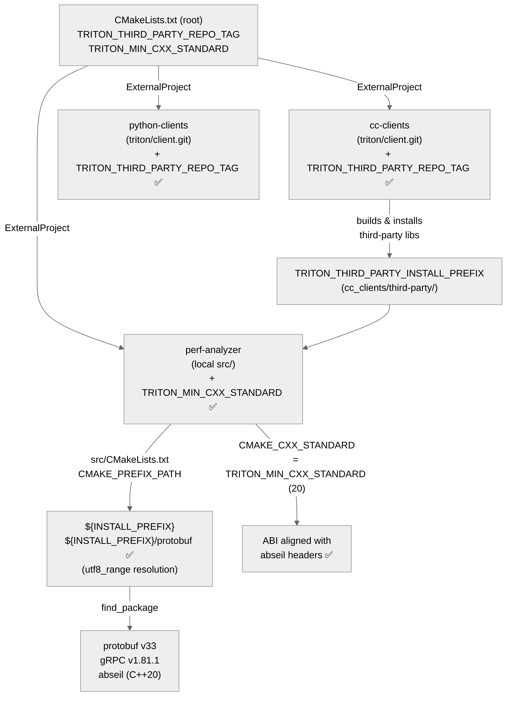

# [PR #466] build(deps): Align protobuf and related dependencies with the gRPC v1.81.1 bump

source: https://github.com/triton-inference-server/perf_analyzer/pull/466
state: closed | updated: 2026-07-23T02:35:14Z
labels: 

## 正文

#### What does the PR do?
Fixes the nightly build against the gRPC v1.81.1 / protobuf v33 third_party bump:
- Define a `TRITON_THIRD_PARTY_REPO_TAG` cache variable and forward it to the cc-clients and python-clients ExternalProject builds. Previously the client sub-builds fell back to their default third_party tag and picked up a revision incompatible with the rest of the build.
- Add the protobuf install tree as an extra `CMAKE_PREFIX_PATH` entry so the `utf8_range` package config nested inside it (required by protobuf v33's package config, pulled in transitively via `gRPCConfig`) resolves during perf-analyzer configure.
- Set `CMAKE_CXX_STANDARD` project-wide from `TRITON_MIN_CXX_STANDARD` (default 20). The abseil install pins its options to the standard used at build time (C++20 selects the `std::` ordering types); the client-backend object libraries previously compiled at the compiler default (`gnu++17`) and failed against the pinned abseil headers.
- Adapt to the protobuf v33 API: `JsonPrintOptions::always_print_primitive_fields` was removed — use its replacement `always_print_fields_with_no_presence` (triton and TFS client backends).

#### Checklist
- [x] PR title reflects the change and is of format `<commit_type>: <Title>`
- [x] Changes are described in the pull request.
- [x] Related issues are referenced.
- [ ] Populated [github labels](https://docs.github.com/en/issues/using-labels-and-milestones-to-track-work/managing-labels) field
- [x] Added [test plan](#test-plan) and verified test passes.
- [ ] Verified that the PR passes existing CI.
- [x] Verified copyright is correct on all changed files.
- [ ] Added _succinct_ git squash message before merging [ref](https://tbaggery.com/2008/04/19/a-note-about-git-commit-messages.html).
- [x] All template sections are filled out.
- [ ] Optional: Additional screenshots for behavior/output changes with before/after.

#### Related PRs:
- triton-inference-server/client#908
- triton-inference-server/common#160
- triton-inference-server/core#516
- triton-inference-server/server#8888
- triton-inference-server/third_party#79

#### Where should the reviewer start?
- `CMakeLists.txt` — `TRITON_THIRD_PARTY_REPO_TAG` cache var and its forwarding to both sub-builds

#### Test plan:
Nightly build pipeline on internal GitLab CI.

- CI Pipeline ID: 58489960

#### Caveats:
None.

#### Background
The gRPC v1.81.1 / protobuf v33 update in triton-inference-server/third_party#76 broke the nightly build across the Triton repos; this PR chain repairs it.

#### Related Issues: (use one of the action keywords Closes / Fixes / Resolves / Relates to)
- Resolves: TRI-1608

CI (internal): [#58489960](http://tritonserver.local/ci/pipelines/58489960) 

## 评论 (3)

### Vinya567 · 2026-07-22

@greptileai

### greptile-apps[bot] · 2026-07-22

<h3>Greptile Summary</h3>

This PR aligns the perf_analyzer build system with the gRPC v1.81.1 / protobuf v33 third-party bump by fixing missing tag forwarding, a missing `CMAKE_PREFIX_PATH` entry, a C++ standard mismatch, and deprecated protobuf API calls.

- Introduces `TRITON_THIRD_PARTY_REPO_TAG` in the root `CMakeLists.txt` and forwards it to both `cc-clients` and `python-clients` ExternalProject builds so all sub-builds clone a consistent third-party revision.
- Extends `CMAKE_PREFIX_PATH` in `src/CMakeLists.txt` with the `protobuf` sub-directory of the install prefix, enabling CMake to resolve the nested `utf8_range` package config required by protobuf v33 / `gRPCConfig`.
- Sets `CMAKE_CXX_STANDARD` project-wide from `TRITON_MIN_CXX_STANDARD` (default 20) so the perf-analyzer object libraries compile against the same standard as abseil, and replaces the removed `always_print_primitive_fields` field with `always_print_fields_with_no_presence` across the Triton and TFS client backends.

<h3>Confidence Score: 5/5</h3>

The changes are tightly scoped to build-system wiring and a well-understood API rename; the nightly CI pipeline confirms the build succeeds end-to-end.

All four changes are mechanical and narrowly targeted: cache variable forwarding, a CMake prefix path addition, a C++ standard propagation, and a protobuf API rename that compiles cleanly. No runtime logic was altered beyond the JSON serialization option swap, and the semantic implications of that swap are already documented in a prior review thread.

src/CMakeLists.txt — the TRITON_MIN_CXX_STANDARD guard has no fallback default, so a standalone inner-build invocation would silently skip the C++ standard setting.

<h3>Important Files Changed</h3>

| Filename | Overview |
|----------|----------|
| CMakeLists.txt | Adds TRITON_THIRD_PARTY_REPO_TAG cache variable and forwards it to cc-clients and python-clients ExternalProject builds so all sub-builds use a consistent third-party tag. |
| src/CMakeLists.txt | Sets CMAKE_CXX_STANDARD from TRITON_MIN_CXX_STANDARD (guarded) and adds the protobuf install sub-tree to CMAKE_PREFIX_PATH for utf8_range resolution; guard has no fallback default. |
| src/client_backend/triton/triton_client_backend.cc | Replaces removed always_print_primitive_fields with always_print_fields_with_no_presence at two call sites (ModelMetadata and ModelConfig) to adapt to protobuf v33 API. |
| src/client_backend/tensorflow_serving/tfserve_client_backend.cc | Same protobuf v33 API adaptation as the Triton backend — replaces always_print_primitive_fields with always_print_fields_with_no_presence for the TFS ModelMetadata call. |

<h3>Flowchart</h3>

<!-- greptile_other_comments_section -->

Reviews (2): Last reviewed commit: ["fix: Replace removed protobuf always\_pri..."](https://github.com/triton-inference-server/perf_analyzer/commit/8e70356d1a30f8dbea7a2563bc173d770cafa8eb) | [Re-trigger Greptile](https://app.greptile.com/api/retrigger?id=46378972)

### Vinya567 · 2026-07-22

@greptileai

## Review (4)

### matthewkotila · 2026-07-20 · APPROVED

(no text)

### nv-rinig · 2026-07-20 · APPROVED

(no text)

### greptile-apps[bot] · 2026-07-22 · COMMENTED

(no text)

### Vinya567 · 2026-07-22 · APPROVED

(no text)
