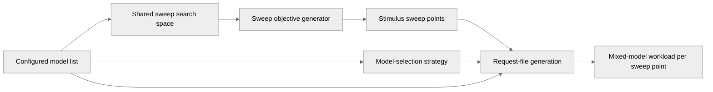

# [PR #471] fix: preserve model selection in GenAI-Perf sweeps

source: https://github.com/triton-inference-server/perf_analyzer/pull/471
state: open | updated: 2026-09-20T16:24:38Z
labels: 

## 正文

## Summary

A GenAI-Perf sweep with multiple models crashes before profiling with `KeyError: 'llama2:7b'`. The generator expects a search space for every model, but analyze supplies one shared search space for the mixed workload.

Generate sweep points from the supplied search spaces, including their debug descriptions. Requests keep both models and the existing selection strategy. This does not add independent per-model sweeps.

Fixes the crash reported in https://github.com/triton-inference-server/perf_analyzer/issues/428.

## Testing Done

The regression in this PR runs through configuration parsing, analyze initialization, sweep generation, and the real request-file writer. It reads JSONL prompts and serves an empty metrics endpoint through a local HTTP server. The normal CI suite runs it without mocking those paths.

I ran it on macOS arm64 with Python 3.12.9. It does not execute native Perf Analyzer, model inference, or a GPU benchmark.

| Source | Before | After |
| --- | --- | --- |
| [Current main](https://github.com/triton-inference-server/perf_analyzer/commit/ee519c63382237fadd8b92216d667b65fa503d35) | The second model raises KeyError in normal and debug modes | Both concurrency values retain both request models |
| [r26.08](https://github.com/triton-inference-server/perf_analyzer/commit/a218ec10e31310ecd8a7d08b2d1df75bca7c973e) | The same failure | The identical runtime patch produces the same result |

Both unmodified sources report:

```text
E   KeyError: 'llama2:7b'
```

With the patch, both sources emit these request-file observations:

```text
models=['mistral:7b', 'llama2:7b'] log_level=INFO
concurrency=1 request_models=['mistral:7b', 'llama2:7b']
concurrency=2 request_models=['mistral:7b', 'llama2:7b']
```

<details>
<summary>Commands and remaining raw output</summary>

From the checkout root, named worktree in this run, these commands run the committed CI test against both baselines and both patched sources. The Python environment has the package dependencies. Importlib mode keeps the test location from replacing the runtime selected by PYTHONPATH.

```bash
set -euo pipefail
git fetch https://github.com/triton-inference-server/perf_analyzer.git r26.08
mkdir -p ../baseline-source ../release-baseline-source ../release-source
git archive ee519c63382237fadd8b92216d667b65fa503d35 genai-perf | tar -x -C ../baseline-source
git archive a218ec10e31310ecd8a7d08b2d1df75bca7c973e genai-perf | tar -x -C ../release-baseline-source
git archive a218ec10e31310ecd8a7d08b2d1df75bca7c973e genai-perf | tar -x -C ../release-source
git diff ee519c63382237fadd8b92216d667b65fa503d35 HEAD -- genai-perf/genai_perf/config/generate/sweep_objective_generator.py | (cd ../release-source && git apply)
for tree in baseline-source release-baseline-source worktree release-source; do
  case "$tree" in
    baseline-source|release-baseline-source) expected=1 ;;
    *) expected=0 ;;
  esac
  result=0
  PYTHONPATH="../$tree/genai-perf" PYTHONDONTWRITEBYTECODE=1 \
    python -m pytest --import-mode=importlib -q -s --tb=short \
    --basetemp="../evidence/public-$tree" \
    genai-perf/tests/test_sweep_objective_generator.py::test_analyze_sweeps_model_selection \
    > "../public-$tree.log" 2>&1 || result=$?
  printf 'source=%s exit=%s\n' "$tree" "$result"
  cat "../public-$tree.log"
  test "$result" -eq "$expected"
done
```

The test also records the debug-mode result:

```text
models=['mistral:7b', 'llama2:7b'] log_level=DEBUG
concurrency=1 request_models=['mistral:7b', 'llama2:7b']
concurrency=2 request_models=['mistral:7b', 'llama2:7b']
```

The single-model control emits the same values before and after:

```text
models=['mistral:7b'] log_level=INFO
concurrency=1 request_models=['mistral:7b', 'mistral:7b']
concurrency=2 request_models=['mistral:7b', 'mistral:7b']
```

```text
models=['mistral:7b'] log_level=DEBUG
concurrency=1 request_models=['mistral:7b', 'mistral:7b']
concurrency=2 request_models=['mistral:7b', 'mistral:7b']
```

The baseline invocations exited with status 1; the patched invocations exited with status 0.

</details>

The existing W503 warning and type-check diagnostics are unchanged from the base.

## 评论 (1)

### greptile-apps[bot] · 2026-09-20

<!-- greptile_summary -->

<h2><a href="https://app.greptile.com/api/retrigger?id=66659174"><picture><source media="(prefers-color-scheme: dark)" srcset="https://greptile-static-assets.s3.amazonaws.com/badges/RetriggerDark.svg?v=2"><source media="(prefers-color-scheme: light)" srcset="https://greptile-static-assets.s3.amazonaws.com/badges/Retrigger.svg?v=2"></picture></a>Confidence Score: 5/5</h2>

The PR appears safe to merge with no actionable correctness, security, or repository-rule issues identified.

<h3>Summary</h3>

The PR fixes mixed-model GenAI-Perf sweeps by generating objectives from the supplied shared search spaces rather than incorrectly expecting one search space per configured request model.
- Preserves all configured request models and the existing model-selection strategy at every sweep point.
- Aligns sweep generation, configuration counting, and debug descriptions around the same search-space mapping.
- Adds an integration-style regression test for single- and mixed-model sweeps in normal and debug modes.
- Documents that multi-model analysis sweeps a shared mixed-model workload rather than independent per-model workloads.

<h3>Diagram</h3>



<sub>Reviews (1) · Last reviewed commit: ["test: exercise mixed-model sweeps with a..."](https://github.com/triton-inference-server/perf_analyzer/commit/6e0f252abd8fea80e0df9916534e2c936ed76a57)</sub>
